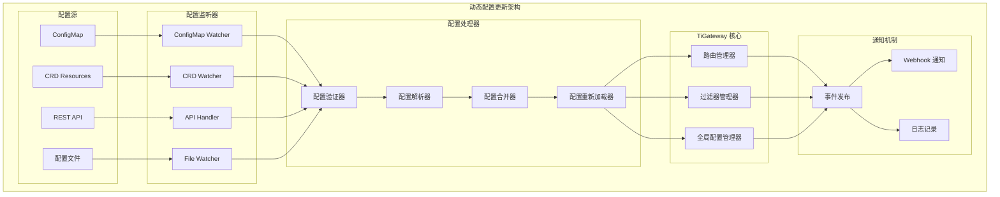

# 动态配置更新

TiGateway 提供了完整的动态配置更新功能，支持在不重启服务的情况下实时更新路由、过滤器和其他配置。

## 动态配置更新概述

### 更新架构



### 更新特性

- **实时更新**: 配置变更时立即生效，无需重启
- **多源支持**: 支持 ConfigMap、CRD、API、文件等多种配置源
- **配置验证**: 更新前进行配置验证，确保配置正确性
- **回滚机制**: 支持配置回滚到之前的版本
- **事件通知**: 提供配置变更事件通知机制
- **原子操作**: 确保配置更新的原子性

## 配置更新实现

### 1. 配置更新服务

```java
@Service
public class DynamicConfigurationService {
    
    @Autowired
    private ConfigurationValidator configurationValidator;
    
    @Autowired
    private ConfigurationReloader configurationReloader;
    
    @Autowired
    private ConfigurationHistoryService historyService;
    
    @Autowired
    private ApplicationEventPublisher eventPublisher;
    
    private final Map<String, Object> configurationCache = new ConcurrentHashMap<>();
    private final Map<String, Long> lastUpdateTime = new ConcurrentHashMap<>();
    
    public void updateConfiguration(String configType, String configId, Object configuration) {
        log.info("Updating configuration: type={}, id={}", configType, configId);
        
        try {
            // 验证配置
            if (!validateConfiguration(configType, configuration)) {
                throw new ConfigurationValidationException("Invalid configuration");
            }
            
            // 保存历史版本
            historyService.saveConfigurationVersion(configType, configId, configuration);
            
            // 更新配置缓存
            String cacheKey = configType + ":" + configId;
            configurationCache.put(cacheKey, configuration);
            lastUpdateTime.put(cacheKey, System.currentTimeMillis());
            
            // 重新加载配置
            configurationReloader.reloadConfiguration(configType, configId, configuration);
            
            // 发布配置更新事件
            ConfigurationUpdateEvent event = new ConfigurationUpdateEvent(
                configType, configId, configuration, System.currentTimeMillis());
            eventPublisher.publishEvent(event);
            
            log.info("Successfully updated configuration: type={}, id={}", configType, configId);
        } catch (Exception e) {
            log.error("Failed to update configuration: type={}, id={}", configType, configId, e);
            throw new ConfigurationUpdateException("Failed to update configuration", e);
        }
    }
    
    public void updateRouteConfiguration(String routeId, RouteDefinition route) {
        updateConfiguration("route", routeId, route);
    }
    
    public void updateFilterConfiguration(String filterId, FilterDefinition filter) {
        updateConfiguration("filter", filterId, filter);
    }
    
    public void updateGlobalConfiguration(String configId, Object configuration) {
        updateConfiguration("global", configId, configuration);
    }
    
    public void deleteConfiguration(String configType, String configId) {
        log.info("Deleting configuration: type={}, id={}", configType, configId);
        
        try {
            // 保存删除历史
            historyService.saveConfigurationVersion(configType, configId, null);
            
            // 从缓存中移除
            String cacheKey = configType + ":" + configId;
            configurationCache.remove(cacheKey);
            lastUpdateTime.remove(cacheKey);
            
            // 重新加载配置
            configurationReloader.reloadConfiguration(configType, configId, null);
            
            // 发布配置删除事件
            ConfigurationDeleteEvent event = new ConfigurationDeleteEvent(
                configType, configId, System.currentTimeMillis());
            eventPublisher.publishEvent(event);
            
            log.info("Successfully deleted configuration: type={}, id={}", configType, configId);
        } catch (Exception e) {
            log.error("Failed to delete configuration: type={}, id={}", configType, configId, e);
            throw new ConfigurationUpdateException("Failed to delete configuration", e);
        }
    }
    
    public Object getConfiguration(String configType, String configId) {
        String cacheKey = configType + ":" + configId;
        return configurationCache.get(cacheKey);
    }
    
    public Map<String, Object> getAllConfigurations(String configType) {
        return configurationCache.entrySet().stream()
            .filter(entry -> entry.getKey().startsWith(configType + ":"))
            .collect(Collectors.toMap(
                entry -> entry.getKey().substring(configType.length() + 1),
                Map.Entry::getValue
            ));
    }
    
    public boolean validateConfiguration(String configType, Object configuration) {
        try {
            switch (configType) {
                case "route":
                    return configurationValidator.validateRoute((RouteDefinition) configuration);
                case "filter":
                    return configurationValidator.validateFilter((FilterDefinition) configuration);
                case "global":
                    return configurationValidator.validateGlobalConfiguration(configuration);
                default:
                    return configurationValidator.validateGenericConfiguration(configuration);
            }
        } catch (Exception e) {
            log.error("Failed to validate configuration: type={}", configType, e);
            return false;
        }
    }
    
    public void rollbackConfiguration(String configType, String configId, String version) {
        log.info("Rolling back configuration: type={}, id={}, version={}", configType, configId, version);
        
        try {
            Object previousConfiguration = historyService.getConfigurationVersion(
                configType, configId, version);
            
            if (previousConfiguration == null) {
                throw new ConfigurationNotFoundException("Configuration version not found");
            }
            
            updateConfiguration(configType, configId, previousConfiguration);
            
            log.info("Successfully rolled back configuration: type={}, id={}, version={}", 
                configType, configId, version);
        } catch (Exception e) {
            log.error("Failed to rollback configuration: type={}, id={}, version={}", 
                configType, configId, version, e);
            throw new ConfigurationUpdateException("Failed to rollback configuration", e);
        }
    }
}
```

### 2. 配置重新加载器

```java
@Component
public class ConfigurationReloader {
    
    @Autowired
    private RouteDefinitionLocator routeDefinitionLocator;
    
    @Autowired
    private GatewayProperties gatewayProperties;
    
    @Autowired
    private ApplicationEventPublisher eventPublisher;
    
    @Autowired
    private RouteRefreshService routeRefreshService;
    
    public void reloadConfiguration(String configType, String configId, Object configuration) {
        log.info("Reloading configuration: type={}, id={}", configType, configId);
        
        try {
            switch (configType) {
                case "route":
                    reloadRouteConfiguration(configId, (RouteDefinition) configuration);
                    break;
                case "filter":
                    reloadFilterConfiguration(configId, (FilterDefinition) configuration);
                    break;
                case "global":
                    reloadGlobalConfiguration(configId, configuration);
                    break;
                default:
                    log.warn("Unknown configuration type: {}", configType);
            }
            
            log.info("Successfully reloaded configuration: type={}, id={}", configType, configId);
        } catch (Exception e) {
            log.error("Failed to reload configuration: type={}, id={}", configType, configId, e);
            throw new ConfigurationReloadException("Failed to reload configuration", e);
        }
    }
    
    private void reloadRouteConfiguration(String routeId, RouteDefinition route) {
        if (route == null) {
            // 删除路由
            removeRoute(routeId);
        } else {
            // 更新或添加路由
            updateRoute(routeId, route);
        }
        
        // 刷新路由缓存
        routeRefreshService.refreshRoutes();
        
        // 发布路由更新事件
        RoutesUpdatedEvent event = new RoutesUpdatedEvent(
            Collections.singletonList(route), System.currentTimeMillis());
        eventPublisher.publishEvent(event);
    }
    
    private void reloadFilterConfiguration(String filterId, FilterDefinition filter) {
        if (filter == null) {
            // 删除过滤器
            removeFilter(filterId);
        } else {
            // 更新或添加过滤器
            updateFilter(filterId, filter);
        }
        
        // 刷新过滤器配置
        refreshFilters();
        
        // 发布过滤器更新事件
        FiltersUpdatedEvent event = new FiltersUpdatedEvent(
            Collections.singletonList(filter), System.currentTimeMillis());
        eventPublisher.publishEvent(event);
    }
    
    private void reloadGlobalConfiguration(String configId, Object configuration) {
        // 更新全局配置
        updateGlobalConfiguration(configId, configuration);
        
        // 刷新全局配置
        refreshGlobalConfiguration();
        
        // 发布全局配置更新事件
        GlobalConfigurationUpdatedEvent event = new GlobalConfigurationUpdatedEvent(
            configId, configuration, System.currentTimeMillis());
        eventPublisher.publishEvent(event);
    }
    
    private void updateRoute(String routeId, RouteDefinition route) {
        List<RouteDefinition> routes = gatewayProperties.getRoutes();
        
        // 查找现有路由
        RouteDefinition existingRoute = routes.stream()
            .filter(r -> routeId.equals(r.getId()))
            .findFirst()
            .orElse(null);
        
        if (existingRoute != null) {
            // 更新现有路由
            int index = routes.indexOf(existingRoute);
            routes.set(index, route);
        } else {
            // 添加新路由
            routes.add(route);
        }
        
        gatewayProperties.setRoutes(routes);
    }
    
    private void removeRoute(String routeId) {
        List<RouteDefinition> routes = gatewayProperties.getRoutes();
        routes.removeIf(route -> routeId.equals(route.getId()));
        gatewayProperties.setRoutes(routes);
    }
    
    private void updateFilter(String filterId, FilterDefinition filter) {
        // 更新过滤器配置
        // 这里需要根据具体的过滤器类型进行更新
        log.info("Updating filter: {}", filterId);
    }
    
    private void removeFilter(String filterId) {
        // 删除过滤器配置
        log.info("Removing filter: {}", filterId);
    }
    
    private void updateGlobalConfiguration(String configId, Object configuration) {
        // 更新全局配置
        log.info("Updating global configuration: {}", configId);
    }
    
    private void refreshRoutes() {
        // 刷新路由配置
        routeRefreshService.refreshRoutes();
    }
    
    private void refreshFilters() {
        // 刷新过滤器配置
        log.info("Refreshing filters");
    }
    
    private void refreshGlobalConfiguration() {
        // 刷新全局配置
        log.info("Refreshing global configuration");
    }
}
```

### 3. 路由刷新服务

```java
@Service
public class RouteRefreshService {
    
    @Autowired
    private RouteDefinitionLocator routeDefinitionLocator;
    
    @Autowired
    private RouteLocator routeLocator;
    
    @Autowired
    private ApplicationEventPublisher eventPublisher;
    
    public void refreshRoutes() {
        log.info("Refreshing routes");
        
        try {
            // 清除路由缓存
            clearRouteCache();
            
            // 重新加载路由
            reloadRoutes();
            
            // 发布路由刷新事件
            RoutesRefreshedEvent event = new RoutesRefreshedEvent(System.currentTimeMillis());
            eventPublisher.publishEvent(event);
            
            log.info("Successfully refreshed routes");
        } catch (Exception e) {
            log.error("Failed to refresh routes", e);
            throw new RouteRefreshException("Failed to refresh routes", e);
        }
    }
    
    public void refreshRoute(String routeId) {
        log.info("Refreshing route: {}", routeId);
        
        try {
            // 清除特定路由缓存
            clearRouteCache(routeId);
            
            // 重新加载特定路由
            reloadRoute(routeId);
            
            // 发布路由刷新事件
            RouteRefreshedEvent event = new RouteRefreshedEvent(routeId, System.currentTimeMillis());
            eventPublisher.publishEvent(event);
            
            log.info("Successfully refreshed route: {}", routeId);
        } catch (Exception e) {
            log.error("Failed to refresh route: {}", routeId, e);
            throw new RouteRefreshException("Failed to refresh route", e);
        }
    }
    
    private void clearRouteCache() {
        // 清除所有路由缓存
        if (routeLocator instanceof CachingRouteLocator) {
            ((CachingRouteLocator) routeLocator).clearCache();
        }
    }
    
    private void clearRouteCache(String routeId) {
        // 清除特定路由缓存
        if (routeLocator instanceof CachingRouteLocator) {
            ((CachingRouteLocator) routeLocator).clearCache(routeId);
        }
    }
    
    private void reloadRoutes() {
        // 重新加载所有路由
        Flux<RouteDefinition> routes = routeDefinitionLocator.getRouteDefinitions();
        routes.subscribe(
            route -> log.debug("Loaded route: {}", route.getId()),
            error -> log.error("Failed to load routes", error),
            () -> log.info("Finished loading routes")
        );
    }
    
    private void reloadRoute(String routeId) {
        // 重新加载特定路由
        Flux<RouteDefinition> routes = routeDefinitionLocator.getRouteDefinitions();
        routes.filter(route -> routeId.equals(route.getId()))
            .subscribe(
                route -> log.debug("Loaded route: {}", route.getId()),
                error -> log.error("Failed to load route: {}", routeId, error)
            );
    }
}
```

## 配置更新 API

### 1. REST API 控制器

```java
@RestController
@RequestMapping("/api/configuration")
public class ConfigurationController {
    
    @Autowired
    private DynamicConfigurationService configurationService;
    
    @Autowired
    private ConfigurationHistoryService historyService;
    
    @PostMapping("/routes")
    public ResponseEntity<RouteDefinition> createRoute(@RequestBody RouteDefinition route) {
        try {
            configurationService.updateRouteConfiguration(route.getId(), route);
            return ResponseEntity.ok(route);
        } catch (Exception e) {
            return ResponseEntity.badRequest().build();
        }
    }
    
    @PutMapping("/routes/{routeId}")
    public ResponseEntity<RouteDefinition> updateRoute(
            @PathVariable String routeId, 
            @RequestBody RouteDefinition route) {
        try {
            configurationService.updateRouteConfiguration(routeId, route);
            return ResponseEntity.ok(route);
        } catch (Exception e) {
            return ResponseEntity.badRequest().build();
        }
    }
    
    @DeleteMapping("/routes/{routeId}")
    public ResponseEntity<Void> deleteRoute(@PathVariable String routeId) {
        try {
            configurationService.deleteConfiguration("route", routeId);
            return ResponseEntity.ok().build();
        } catch (Exception e) {
            return ResponseEntity.badRequest().build();
        }
    }
    
    @GetMapping("/routes")
    public ResponseEntity<List<RouteDefinition>> getRoutes() {
        try {
            Map<String, Object> routes = configurationService.getAllConfigurations("route");
            List<RouteDefinition> routeList = routes.values().stream()
                .map(obj -> (RouteDefinition) obj)
                .collect(Collectors.toList());
            return ResponseEntity.ok(routeList);
        } catch (Exception e) {
            return ResponseEntity.badRequest().build();
        }
    }
    
    @GetMapping("/routes/{routeId}")
    public ResponseEntity<RouteDefinition> getRoute(@PathVariable String routeId) {
        try {
            RouteDefinition route = (RouteDefinition) configurationService.getConfiguration("route", routeId);
            if (route != null) {
                return ResponseEntity.ok(route);
            } else {
                return ResponseEntity.notFound().build();
            }
        } catch (Exception e) {
            return ResponseEntity.badRequest().build();
        }
    }
    
    @PostMapping("/filters")
    public ResponseEntity<FilterDefinition> createFilter(@RequestBody FilterDefinition filter) {
        try {
            configurationService.updateFilterConfiguration(filter.getId(), filter);
            return ResponseEntity.ok(filter);
        } catch (Exception e) {
            return ResponseEntity.badRequest().build();
        }
    }
    
    @PutMapping("/filters/{filterId}")
    public ResponseEntity<FilterDefinition> updateFilter(
            @PathVariable String filterId, 
            @RequestBody FilterDefinition filter) {
        try {
            configurationService.updateFilterConfiguration(filterId, filter);
            return ResponseEntity.ok(filter);
        } catch (Exception e) {
            return ResponseEntity.badRequest().build();
        }
    }
    
    @DeleteMapping("/filters/{filterId}")
    public ResponseEntity<Void> deleteFilter(@PathVariable String filterId) {
        try {
            configurationService.deleteConfiguration("filter", filterId);
            return ResponseEntity.ok().build();
        } catch (Exception e) {
            return ResponseEntity.badRequest().build();
        }
    }
    
    @GetMapping("/filters")
    public ResponseEntity<List<FilterDefinition>> getFilters() {
        try {
            Map<String, Object> filters = configurationService.getAllConfigurations("filter");
            List<FilterDefinition> filterList = filters.values().stream()
                .map(obj -> (FilterDefinition) obj)
                .collect(Collectors.toList());
            return ResponseEntity.ok(filterList);
        } catch (Exception e) {
            return ResponseEntity.badRequest().build();
        }
    }
    
    @PostMapping("/global")
    public ResponseEntity<Object> updateGlobalConfiguration(
            @RequestParam String configId, 
            @RequestBody Object configuration) {
        try {
            configurationService.updateGlobalConfiguration(configId, configuration);
            return ResponseEntity.ok(configuration);
        } catch (Exception e) {
            return ResponseEntity.badRequest().build();
        }
    }
    
    @GetMapping("/global/{configId}")
    public ResponseEntity<Object> getGlobalConfiguration(@PathVariable String configId) {
        try {
            Object configuration = configurationService.getConfiguration("global", configId);
            if (configuration != null) {
                return ResponseEntity.ok(configuration);
            } else {
                return ResponseEntity.notFound().build();
            }
        } catch (Exception e) {
            return ResponseEntity.badRequest().build();
        }
    }
    
    @PostMapping("/refresh")
    public ResponseEntity<Void> refreshConfiguration() {
        try {
            // 刷新所有配置
            configurationService.refreshAllConfigurations();
            return ResponseEntity.ok().build();
        } catch (Exception e) {
            return ResponseEntity.badRequest().build();
        }
    }
    
    @PostMapping("/rollback")
    public ResponseEntity<Void> rollbackConfiguration(
            @RequestParam String configType,
            @RequestParam String configId,
            @RequestParam String version) {
        try {
            configurationService.rollbackConfiguration(configType, configId, version);
            return ResponseEntity.ok().build();
        } catch (Exception e) {
            return ResponseEntity.badRequest().build();
        }
    }
    
    @GetMapping("/history/{configType}/{configId}")
    public ResponseEntity<List<ConfigurationVersion>> getConfigurationHistory(
            @PathVariable String configType,
            @PathVariable String configId) {
        try {
            List<ConfigurationVersion> history = historyService.getConfigurationHistory(configType, configId);
            return ResponseEntity.ok(history);
        } catch (Exception e) {
            return ResponseEntity.badRequest().build();
        }
    }
}
```

### 2. WebSocket 配置更新通知

```java
@Component
public class ConfigurationWebSocketHandler extends TextWebSocketHandler {
    
    @Autowired
    private ApplicationEventPublisher eventPublisher;
    
    private final Set<WebSocketSession> sessions = Collections.synchronizedSet(new HashSet<>());
    
    @Override
    public void afterConnectionEstablished(WebSocketSession session) throws Exception {
        sessions.add(session);
        log.info("WebSocket connection established: {}", session.getId());
    }
    
    @Override
    public void afterConnectionClosed(WebSocketSession session, CloseStatus status) throws Exception {
        sessions.remove(session);
        log.info("WebSocket connection closed: {}", session.getId());
    }
    
    @Override
    public void handleTextMessage(WebSocketSession session, TextMessage message) throws Exception {
        // 处理客户端消息
        String payload = message.getPayload();
        log.info("Received WebSocket message: {}", payload);
        
        // 可以处理配置订阅等消息
        handleConfigurationSubscription(session, payload);
    }
    
    @EventListener
    public void handleConfigurationUpdate(ConfigurationUpdateEvent event) {
        // 向所有连接的客户端发送配置更新通知
        String message = createUpdateMessage(event);
        broadcastMessage(message);
    }
    
    @EventListener
    public void handleConfigurationDelete(ConfigurationDeleteEvent event) {
        // 向所有连接的客户端发送配置删除通知
        String message = createDeleteMessage(event);
        broadcastMessage(message);
    }
    
    private void handleConfigurationSubscription(WebSocketSession session, String payload) {
        try {
            ObjectMapper mapper = new ObjectMapper();
            Map<String, Object> message = mapper.readValue(payload, Map.class);
            
            String type = (String) message.get("type");
            if ("subscribe".equals(type)) {
                String configType = (String) message.get("configType");
                String configId = (String) message.get("configId");
                
                // 处理配置订阅
                log.info("Client {} subscribed to configuration: {}:{}", 
                    session.getId(), configType, configId);
            }
        } catch (Exception e) {
            log.error("Failed to handle configuration subscription", e);
        }
    }
    
    private String createUpdateMessage(ConfigurationUpdateEvent event) {
        try {
            ObjectMapper mapper = new ObjectMapper();
            Map<String, Object> message = new HashMap<>();
            message.put("type", "configuration_update");
            message.put("configType", event.getConfigType());
            message.put("configId", event.getConfigId());
            message.put("timestamp", event.getTimestamp());
            message.put("configuration", event.getConfiguration());
            
            return mapper.writeValueAsString(message);
        } catch (Exception e) {
            log.error("Failed to create update message", e);
            return "{}";
        }
    }
    
    private String createDeleteMessage(ConfigurationDeleteEvent event) {
        try {
            ObjectMapper mapper = new ObjectMapper();
            Map<String, Object> message = new HashMap<>();
            message.put("type", "configuration_delete");
            message.put("configType", event.getConfigType());
            message.put("configId", event.getConfigId());
            message.put("timestamp", event.getTimestamp());
            
            return mapper.writeValueAsString(message);
        } catch (Exception e) {
            log.error("Failed to create delete message", e);
            return "{}";
        }
    }
    
    private void broadcastMessage(String message) {
        synchronized (sessions) {
            for (WebSocketSession session : sessions) {
                try {
                    if (session.isOpen()) {
                        session.sendMessage(new TextMessage(message));
                    }
                } catch (Exception e) {
                    log.error("Failed to send message to session: {}", session.getId(), e);
                    sessions.remove(session);
                }
            }
        }
    }
}
```

## 配置历史管理

### 1. 配置历史服务

```java
@Service
public class ConfigurationHistoryService {
    
    @Autowired
    private KubernetesClient kubernetesClient;
    
    @Autowired
    private ObjectMapper objectMapper;
    
    private final int MAX_HISTORY_VERSIONS = 10;
    
    public void saveConfigurationVersion(String configType, String configId, Object configuration) {
        try {
            String version = generateVersion();
            ConfigurationVersion configVersion = new ConfigurationVersion();
            configVersion.setConfigType(configType);
            configVersion.setConfigId(configId);
            configVersion.setVersion(version);
            configVersion.setConfiguration(configuration);
            configVersion.setTimestamp(Instant.now());
            configVersion.setHash(generateHash(configuration));
            
            // 保存到 ConfigMap
            saveToConfigMap(configVersion);
            
            // 清理旧版本
            cleanupOldVersions(configType, configId);
            
            log.info("Saved configuration version: {}:{}:{}", configType, configId, version);
        } catch (Exception e) {
            log.error("Failed to save configuration version: {}:{}", configType, configId, e);
        }
    }
    
    public Object getConfigurationVersion(String configType, String configId, String version) {
        try {
            ConfigMap configMap = kubernetesClient.configMaps()
                .inNamespace("tigateway")
                .withName("tigateway-config-history-" + configType + "-" + configId)
                .get();
            
            if (configMap != null && configMap.getData() != null) {
                String versionData = configMap.getData().get(version);
                if (versionData != null) {
                    ConfigurationVersion configVersion = objectMapper.readValue(versionData, ConfigurationVersion.class);
                    return configVersion.getConfiguration();
                }
            }
            
            return null;
        } catch (Exception e) {
            log.error("Failed to get configuration version: {}:{}:{}", configType, configId, version, e);
            return null;
        }
    }
    
    public List<ConfigurationVersion> getConfigurationHistory(String configType, String configId) {
        try {
            ConfigMap configMap = kubernetesClient.configMaps()
                .inNamespace("tigateway")
                .withName("tigateway-config-history-" + configType + "-" + configId)
                .get();
            
            if (configMap == null || configMap.getData() == null) {
                return Collections.emptyList();
            }
            
            List<ConfigurationVersion> history = new ArrayList<>();
            for (Map.Entry<String, String> entry : configMap.getData().entrySet()) {
                if (!"metadata".equals(entry.getKey())) {
                    ConfigurationVersion configVersion = objectMapper.readValue(entry.getValue(), ConfigurationVersion.class);
                    history.add(configVersion);
                }
            }
            
            // 按时间戳排序
            history.sort((v1, v2) -> v2.getTimestamp().compareTo(v1.getTimestamp()));
            
            return history;
        } catch (Exception e) {
            log.error("Failed to get configuration history: {}:{}", configType, configId, e);
            return Collections.emptyList();
        }
    }
    
    private void saveToConfigMap(ConfigurationVersion configVersion) throws Exception {
        String configMapName = "tigateway-config-history-" + 
            configVersion.getConfigType() + "-" + configVersion.getConfigId();
        
        ConfigMap configMap = kubernetesClient.configMaps()
            .inNamespace("tigateway")
            .withName(configMapName)
            .get();
        
        if (configMap == null) {
            configMap = new ConfigMapBuilder()
                .withNewMetadata()
                    .withName(configMapName)
                    .withNamespace("tigateway")
                    .addToLabels("app", "tigateway")
                    .addToLabels("component", "config-history")
                    .addToLabels("configType", configVersion.getConfigType())
                    .addToLabels("configId", configVersion.getConfigId())
                .endMetadata()
                .withData(new HashMap<>())
                .build();
        }
        
        Map<String, String> data = configMap.getData();
        if (data == null) {
            data = new HashMap<>();
        }
        
        String versionData = objectMapper.writeValueAsString(configVersion);
        data.put(configVersion.getVersion(), versionData);
        
        // 保存元数据
        Map<String, Object> metadata = new HashMap<>();
        metadata.put("latestVersion", configVersion.getVersion());
        metadata.put("lastUpdated", configVersion.getTimestamp().toString());
        data.put("metadata", objectMapper.writeValueAsString(metadata));
        
        configMap.setData(data);
        
        kubernetesClient.configMaps()
            .inNamespace("tigateway")
            .createOrReplace(configMap);
    }
    
    private void cleanupOldVersions(String configType, String configId) {
        try {
            List<ConfigurationVersion> history = getConfigurationHistory(configType, configId);
            
            if (history.size() > MAX_HISTORY_VERSIONS) {
                // 删除旧版本
                List<ConfigurationVersion> toDelete = history.subList(MAX_HISTORY_VERSIONS, history.size());
                
                String configMapName = "tigateway-config-history-" + configType + "-" + configId;
                ConfigMap configMap = kubernetesClient.configMaps()
                    .inNamespace("tigateway")
                    .withName(configMapName)
                    .get();
                
                if (configMap != null && configMap.getData() != null) {
                    Map<String, String> data = configMap.getData();
                    
                    for (ConfigurationVersion version : toDelete) {
                        data.remove(version.getVersion());
                    }
                    
                    configMap.setData(data);
                    kubernetesClient.configMaps()
                        .inNamespace("tigateway")
                        .createOrReplace(configMap);
                }
            }
        } catch (Exception e) {
            log.error("Failed to cleanup old versions: {}:{}", configType, configId, e);
        }
    }
    
    private String generateVersion() {
        return "v" + System.currentTimeMillis();
    }
    
    private String generateHash(Object configuration) {
        try {
            String configJson = objectMapper.writeValueAsString(configuration);
            MessageDigest md = MessageDigest.getInstance("MD5");
            byte[] hash = md.digest(configJson.getBytes());
            return Base64.getEncoder().encodeToString(hash);
        } catch (Exception e) {
            log.error("Failed to generate hash", e);
            return "unknown";
        }
    }
}
```

## 配置更新监控

### 1. 配置更新指标

```java
@Component
public class ConfigurationMetrics {
    
    private final MeterRegistry meterRegistry;
    private final Counter configurationUpdates;
    private final Counter configurationDeletes;
    private final Timer configurationUpdateLatency;
    private final Gauge configurationCount;
    
    public ConfigurationMetrics(MeterRegistry meterRegistry) {
        this.meterRegistry = meterRegistry;
        this.configurationUpdates = Counter.builder("tigateway_configuration_updates_total")
            .description("Total number of configuration updates")
            .register(meterRegistry);
        this.configurationDeletes = Counter.builder("tigateway_configuration_deletes_total")
            .description("Total number of configuration deletes")
            .register(meterRegistry);
        this.configurationUpdateLatency = Timer.builder("tigateway_configuration_update_duration_seconds")
            .description("Configuration update duration")
            .register(meterRegistry);
        this.configurationCount = Gauge.builder("tigateway_configuration_count")
            .description("Number of active configurations")
            .register(meterRegistry);
    }
    
    public void recordConfigurationUpdate(String configType, String configId, boolean success) {
        configurationUpdates.increment(
            Tags.of(
                "configType", configType,
                "configId", configId,
                "success", String.valueOf(success)
            )
        );
    }
    
    public void recordConfigurationDelete(String configType, String configId, boolean success) {
        configurationDeletes.increment(
            Tags.of(
                "configType", configType,
                "configId", configId,
                "success", String.valueOf(success)
            )
        );
    }
    
    public void recordConfigurationUpdateLatency(Duration duration) {
        configurationUpdateLatency.record(duration);
    }
    
    public void updateConfigurationCount(int count) {
        configurationCount.set(count);
    }
}
```

## 最佳实践

### 1. 配置更新策略

```yaml
# 配置更新策略
apiVersion: v1
kind: ConfigMap
metadata:
  name: tigateway-config-update-policy
  namespace: tigateway
data:
  update-policy.yml: |
    configuration:
      update:
        strategy: "rolling"  # rolling, immediate, scheduled
        batch-size: 10
        interval: "30s"
        timeout: "5m"
        retry:
          max-attempts: 3
          backoff: "exponential"
          initial-delay: "1s"
          max-delay: "30s"
      validation:
        enabled: true
        schema-validation: true
        syntax-validation: true
        dependency-check: true
      rollback:
        enabled: true
        auto-rollback: true
        rollback-threshold: 0.1  # 10% error rate
        rollback-window: "5m"
      history:
        max-versions: 10
        retention-period: "7d"
        compression: true
```

### 2. 配置更新通知

```yaml
# 配置更新通知配置
apiVersion: v1
kind: ConfigMap
metadata:
  name: tigateway-config-notification
  namespace: tigateway
data:
  notification.yml: |
    notification:
      webhook:
        enabled: true
        url: "https://webhook.example.com/tigateway/config-update"
        timeout: "10s"
        retry:
          max-attempts: 3
          backoff: "exponential"
      email:
        enabled: false
        smtp:
          host: "smtp.example.com"
          port: 587
          username: "tigateway@example.com"
          password: "${SMTP_PASSWORD}"
        recipients:
        - "admin@example.com"
        - "ops@example.com"
      slack:
        enabled: false
        webhook-url: "${SLACK_WEBHOOK_URL}"
        channel: "#tigateway"
      teams:
        enabled: false
        webhook-url: "${TEAMS_WEBHOOK_URL}"
```

## 故障排除

### 1. 常见问题

#### 配置更新失败
```bash
# 检查配置更新日志
kubectl logs -f deployment/tigateway -n tigateway | grep "configuration"

# 检查配置验证
kubectl exec -it deployment/tigateway -n tigateway -- curl -X POST http://localhost:8090/actuator/configuration/validate

# 检查配置历史
kubectl get configmap -n tigateway | grep config-history
```

#### 配置回滚失败
```bash
# 检查配置历史
kubectl get configmap tigateway-config-history-route-user-service -n tigateway -o yaml

# 检查回滚日志
kubectl logs -f deployment/tigateway -n tigateway | grep "rollback"

# 手动回滚
kubectl exec -it deployment/tigateway -n tigateway -- curl -X POST "http://localhost:8090/api/configuration/rollback?configType=route&configId=user-service&version=v1234567890"
```

### 2. 调试命令

```bash
# 查看配置更新状态
kubectl exec -it deployment/tigateway -n tigateway -- curl http://localhost:8090/actuator/configuration/status

# 查看配置更新指标
kubectl exec -it deployment/tigateway -n tigateway -- curl http://localhost:8090/actuator/metrics/tigateway.configuration.updates.total

# 测试配置更新
kubectl exec -it deployment/tigateway -n tigateway -- curl -X POST http://localhost:8090/api/configuration/refresh
```

## 总结

TiGateway 的动态配置更新功能提供了完整的配置管理能力：

1. **实时更新**: 支持配置的实时更新，无需重启服务
2. **多源支持**: 支持 ConfigMap、CRD、API、文件等多种配置源
3. **配置验证**: 提供完整的配置验证机制
4. **历史管理**: 支持配置版本管理和回滚
5. **事件通知**: 提供配置变更事件通知
6. **监控指标**: 提供丰富的配置更新监控指标
7. **最佳实践**: 遵循配置更新最佳实践

通过动态配置更新功能，TiGateway 实现了真正的云原生配置管理，提供了灵活、可靠的配置更新方案。
