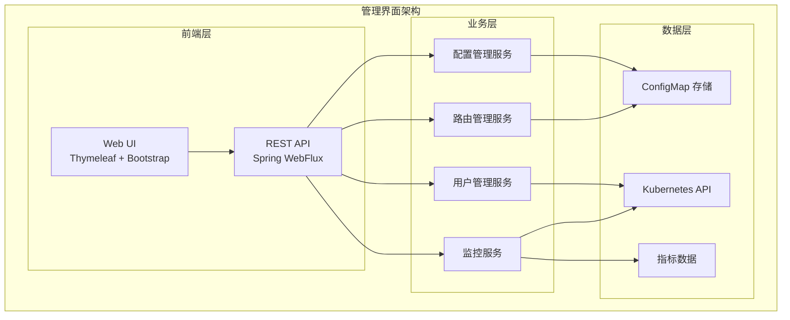
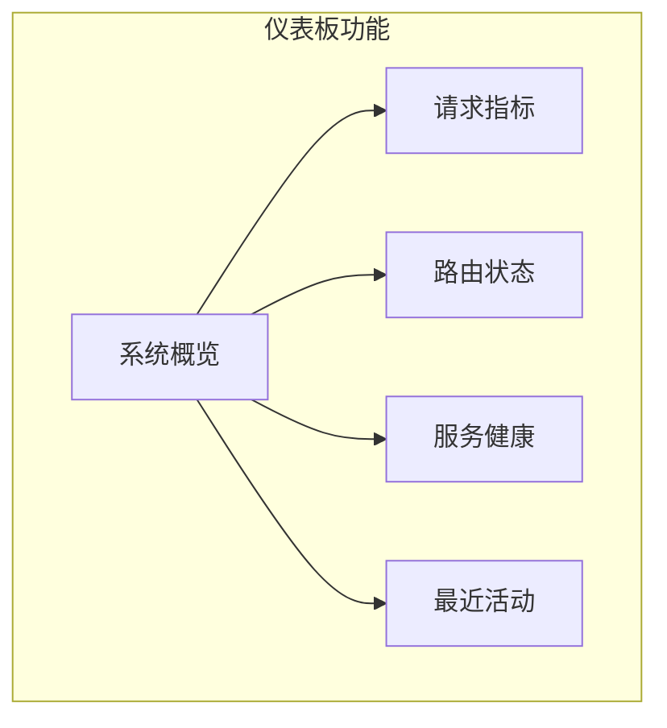

# 管理界面概述

TiGateway 提供了完整的 Web 管理界面，让您可以通过直观的图形界面管理网关配置、监控系统状态和查看运行指标。

## 管理界面架构

### 组件结构



### 端口配置

管理界面运行在独立的端口上，与主网关服务分离：

- **管理界面端口**: 8081
- **主网关端口**: 8080
- **监控端点端口**: 8090

## 主要功能模块

### 1. 仪表板

仪表板提供系统概览和关键指标：



**主要指标**:
- 总请求数
- 请求成功率
- 平均响应时间
- 活跃路由数
- 服务健康状态

### 2. 路由管理

路由管理模块提供完整的路由配置功能：

#### 路由列表

显示所有配置的路由：

```html
<!-- 路由列表页面 -->
<div class="route-list">
    <div class="route-item" th:each="route : ${routes}">
        <div class="route-id" th:text="${route.id}"></div>
        <div class="route-uri" th:text="${route.uri}"></div>
        <div class="route-predicates">
            <span th:each="predicate : ${route.predicates}" 
                  th:text="${predicate.name}"></span>
        </div>
        <div class="route-actions">
            <button class="btn-edit" th:onclick="'editRoute(\'' + ${route.id} + '\')'">编辑</button>
            <button class="btn-delete" th:onclick="'deleteRoute(\'' + ${route.id} + '\')'">删除</button>
        </div>
    </div>
</div>
```

#### 路由编辑器

提供可视化的路由配置界面：

```html
<!-- 路由编辑器 -->
<form id="route-form" th:object="${route}">
    <div class="form-group">
        <label for="route-id">路由 ID</label>
        <input type="text" id="route-id" th:field="*{id}" required>
    </div>
    
    <div class="form-group">
        <label for="route-uri">目标 URI</label>
        <input type="text" id="route-uri" th:field="*{uri}" required>
    </div>
    
    <div class="form-group">
        <label>谓词配置</label>
        <div id="predicates-container">
            <!-- 动态添加谓词 -->
        </div>
        <button type="button" onclick="addPredicate()">添加谓词</button>
    </div>
    
    <div class="form-group">
        <label>过滤器配置</label>
        <div id="filters-container">
            <!-- 动态添加过滤器 -->
        </div>
        <button type="button" onclick="addFilter()">添加过滤器</button>
    </div>
    
    <div class="form-actions">
        <button type="submit">保存</button>
        <button type="button" onclick="cancelEdit()">取消</button>
    </div>
</form>
```

### 3. 服务发现

服务发现模块显示 Kubernetes 集群中的服务：

```java
@RestController
@RequestMapping("/api/services")
public class ServiceDiscoveryController {
    
    @Autowired
    private KubernetesClient kubernetesClient;
    
    @GetMapping
    public Flux<ServiceInfo> getServices() {
        return Flux.fromIterable(kubernetesClient.services().list().getItems())
            .map(this::convertToServiceInfo);
    }
    
    @GetMapping("/{name}")
    public Mono<ServiceInfo> getService(@PathVariable String name) {
        return Mono.fromCallable(() -> {
            Service service = kubernetesClient.services()
                .withName(name)
                .get();
            return convertToServiceInfo(service);
        });
    }
    
    private ServiceInfo convertToServiceInfo(Service service) {
        ServiceInfo info = new ServiceInfo();
        info.setName(service.getMetadata().getName());
        info.setNamespace(service.getMetadata().getNamespace());
        info.setType(service.getSpec().getType());
        info.setPorts(service.getSpec().getPorts());
        info.setSelector(service.getSpec().getSelector());
        return info;
    }
}
```

### 4. 配置管理

配置管理模块提供 ConfigMap 的编辑和管理功能：

#### 配置编辑器

```html
<!-- 配置编辑器 -->
<div class="config-editor">
    <div class="config-tabs">
        <button class="tab-button active" onclick="showTab('application')">应用配置</button>
        <button class="tab-button" onclick="showTab('routes')">路由配置</button>
        <button class="tab-button" onclick="showTab('filters')">过滤器配置</button>
    </div>
    
    <div class="config-content">
        <div id="application-tab" class="tab-content active">
            <textarea id="application-config" th:text="${applicationConfig}"></textarea>
        </div>
        
        <div id="routes-tab" class="tab-content">
            <textarea id="routes-config" th:text="${routesConfig}"></textarea>
        </div>
        
        <div id="filters-tab" class="tab-content">
            <textarea id="filters-config" th:text="${filtersConfig}"></textarea>
        </div>
    </div>
    
    <div class="config-actions">
        <button onclick="saveConfig()">保存配置</button>
        <button onclick="validateConfig()">验证配置</button>
        <button onclick="reloadConfig()">重新加载</button>
    </div>
</div>
```

#### 配置验证

```java
@RestController
@RequestMapping("/api/config")
public class ConfigController {
    
    @Autowired
    private ConfigMapService configMapService;
    
    @PostMapping("/validate")
    public Mono<ValidationResult> validateConfig(@RequestBody ConfigData configData) {
        return Mono.fromCallable(() -> {
            ValidationResult result = new ValidationResult();
            
            try {
                // 验证 YAML 语法
                yamlValidator.validate(configData.getContent());
                
                // 验证 Schema
                schemaValidator.validate(configData.getContent());
                
                result.setValid(true);
                result.setMessage("配置验证通过");
            } catch (Exception e) {
                result.setValid(false);
                result.setMessage("配置验证失败: " + e.getMessage());
            }
            
            return result;
        });
    }
    
    @PostMapping("/save")
    public Mono<SaveResult> saveConfig(@RequestBody ConfigData configData) {
        return configMapService.updateConfig(configData)
            .map(result -> {
                SaveResult saveResult = new SaveResult();
                saveResult.setSuccess(result);
                saveResult.setMessage(result ? "配置保存成功" : "配置保存失败");
                return saveResult;
            });
    }
}
```

### 5. 监控面板

监控面板提供实时的系统监控信息：

#### 指标展示

```html
<!-- 监控面板 -->
<div class="monitoring-dashboard">
    <div class="metrics-grid">
        <div class="metric-card">
            <h3>请求总数</h3>
            <div class="metric-value" id="total-requests">0</div>
            <div class="metric-trend" id="requests-trend"></div>
        </div>
        
        <div class="metric-card">
            <h3>成功率</h3>
            <div class="metric-value" id="success-rate">0%</div>
            <div class="metric-trend" id="success-trend"></div>
        </div>
        
        <div class="metric-card">
            <h3>平均响应时间</h3>
            <div class="metric-value" id="avg-response-time">0ms</div>
            <div class="metric-trend" id="response-time-trend"></div>
        </div>
        
        <div class="metric-card">
            <h3>活跃连接数</h3>
            <div class="metric-value" id="active-connections">0</div>
            <div class="metric-trend" id="connections-trend"></div>
        </div>
    </div>
    
    <div class="charts-container">
        <div class="chart-panel">
            <h3>请求趋势</h3>
            <canvas id="requests-chart"></canvas>
        </div>
        
        <div class="chart-panel">
            <h3>响应时间分布</h3>
            <canvas id="response-time-chart"></canvas>
        </div>
    </div>
</div>
```

#### 实时数据更新

```javascript
// 实时数据更新
class MonitoringDashboard {
    constructor() {
        this.charts = {};
        this.metrics = {};
        this.updateInterval = 5000; // 5秒更新一次
    }
    
    init() {
        this.initCharts();
        this.startRealTimeUpdates();
    }
    
    initCharts() {
        // 初始化图表
        this.charts.requests = new Chart(document.getElementById('requests-chart'), {
            type: 'line',
            data: {
                labels: [],
                datasets: [{
                    label: '请求数',
                    data: [],
                    borderColor: 'rgb(75, 192, 192)',
                    tension: 0.1
                }]
            },
            options: {
                responsive: true,
                scales: {
                    y: {
                        beginAtZero: true
                    }
                }
            }
        });
    }
    
    startRealTimeUpdates() {
        setInterval(() => {
            this.updateMetrics();
        }, this.updateInterval);
    }
    
    async updateMetrics() {
        try {
            const response = await fetch('/api/metrics');
            const metrics = await response.json();
            
            this.updateMetricCards(metrics);
            this.updateCharts(metrics);
        } catch (error) {
            console.error('Failed to update metrics:', error);
        }
    }
    
    updateMetricCards(metrics) {
        document.getElementById('total-requests').textContent = metrics.totalRequests;
        document.getElementById('success-rate').textContent = metrics.successRate + '%';
        document.getElementById('avg-response-time').textContent = metrics.avgResponseTime + 'ms';
        document.getElementById('active-connections').textContent = metrics.activeConnections;
    }
    
    updateCharts(metrics) {
        const now = new Date().toLocaleTimeString();
        
        // 更新请求趋势图
        this.charts.requests.data.labels.push(now);
        this.charts.requests.data.datasets[0].data.push(metrics.totalRequests);
        
        // 保持最近20个数据点
        if (this.charts.requests.data.labels.length > 20) {
            this.charts.requests.data.labels.shift();
            this.charts.requests.data.datasets[0].data.shift();
        }
        
        this.charts.requests.update();
    }
}

// 初始化监控面板
document.addEventListener('DOMContentLoaded', () => {
    const dashboard = new MonitoringDashboard();
    dashboard.init();
});
```

## REST API 接口

### 路由管理 API

```java
@RestController
@RequestMapping("/api/routes")
public class RouteController {
    
    @Autowired
    private RouteService routeService;
    
    @GetMapping
    public Flux<RouteDefinition> getRoutes() {
        return routeService.getAllRoutes();
    }
    
    @GetMapping("/{id}")
    public Mono<RouteDefinition> getRoute(@PathVariable String id) {
        return routeService.getRoute(id);
    }
    
    @PostMapping
    public Mono<RouteDefinition> createRoute(@RequestBody RouteDefinition route) {
        return routeService.createRoute(route);
    }
    
    @PutMapping("/{id}")
    public Mono<RouteDefinition> updateRoute(@PathVariable String id, 
                                           @RequestBody RouteDefinition route) {
        return routeService.updateRoute(id, route);
    }
    
    @DeleteMapping("/{id}")
    public Mono<Void> deleteRoute(@PathVariable String id) {
        return routeService.deleteRoute(id);
    }
    
    @PostMapping("/{id}/refresh")
    public Mono<Void> refreshRoute(@PathVariable String id) {
        return routeService.refreshRoute(id);
    }
}
```

### 配置管理 API

```java
@RestController
@RequestMapping("/api/config")
public class ConfigController {
    
    @Autowired
    private ConfigMapService configMapService;
    
    @GetMapping("/application")
    public Mono<String> getApplicationConfig() {
        return configMapService.getApplicationConfig();
    }
    
    @GetMapping("/routes")
    public Mono<String> getRoutesConfig() {
        return configMapService.getRoutesConfig();
    }
    
    @GetMapping("/filters")
    public Mono<String> getFiltersConfig() {
        return configMapService.getFiltersConfig();
    }
    
    @PostMapping("/application")
    public Mono<Void> updateApplicationConfig(@RequestBody String config) {
        return configMapService.updateApplicationConfig(config);
    }
    
    @PostMapping("/routes")
    public Mono<Void> updateRoutesConfig(@RequestBody String config) {
        return configMapService.updateRoutesConfig(config);
    }
    
    @PostMapping("/filters")
    public Mono<Void> updateFiltersConfig(@RequestBody String config) {
        return configMapService.updateFiltersConfig(config);
    }
    
    @PostMapping("/reload")
    public Mono<Void> reloadConfig() {
        return configMapService.reloadConfig();
    }
}
```

### 监控 API

```java
@RestController
@RequestMapping("/api/metrics")
public class MetricsController {
    
    @Autowired
    private MeterRegistry meterRegistry;
    
    @GetMapping
    public Mono<MetricsData> getMetrics() {
        return Mono.fromCallable(() -> {
            MetricsData data = new MetricsData();
            
            // 获取请求总数
            Counter totalRequests = meterRegistry.counter("spring.cloud.gateway.requests");
            data.setTotalRequests((long) totalRequests.count());
            
            // 获取成功率
            Timer requestTimer = meterRegistry.timer("spring.cloud.gateway.requests");
            data.setSuccessRate(calculateSuccessRate(requestTimer));
            
            // 获取平均响应时间
            data.setAvgResponseTime(requestTimer.mean(TimeUnit.MILLISECONDS));
            
            // 获取活跃连接数
            Gauge activeConnections = meterRegistry.gauge("spring.cloud.gateway.active.connections");
            data.setActiveConnections(activeConnections.value());
            
            return data;
        });
    }
    
    @GetMapping("/prometheus")
    public Mono<String> getPrometheusMetrics() {
        return Mono.fromCallable(() -> {
            StringBuilder sb = new StringBuilder();
            meterRegistry.getMeters().forEach(meter -> {
                sb.append(meter.getId().getName()).append(" ");
                sb.append(meter.measure()).append("\n");
            });
            return sb.toString();
        });
    }
}
```

## 用户界面设计

### 响应式设计

管理界面采用响应式设计，支持各种设备：

```css
/* 响应式布局 */
.container {
    max-width: 1200px;
    margin: 0 auto;
    padding: 0 15px;
}

@media (max-width: 768px) {
    .container {
        padding: 0 10px;
    }
    
    .metrics-grid {
        grid-template-columns: 1fr;
    }
    
    .charts-container {
        flex-direction: column;
    }
}

@media (min-width: 769px) and (max-width: 1024px) {
    .metrics-grid {
        grid-template-columns: repeat(2, 1fr);
    }
}

@media (min-width: 1025px) {
    .metrics-grid {
        grid-template-columns: repeat(4, 1fr);
    }
}
```

### 主题支持

支持明暗主题切换：

```css
/* 明暗主题 */
:root {
    --bg-color: #ffffff;
    --text-color: #333333;
    --border-color: #e0e0e0;
    --primary-color: #007bff;
    --success-color: #28a745;
    --warning-color: #ffc107;
    --danger-color: #dc3545;
}

[data-theme="dark"] {
    --bg-color: #1a1a1a;
    --text-color: #ffffff;
    --border-color: #404040;
    --primary-color: #0d6efd;
    --success-color: #198754;
    --warning-color: #fd7e14;
    --danger-color: #dc2626;
}

body {
    background-color: var(--bg-color);
    color: var(--text-color);
    transition: background-color 0.3s, color 0.3s;
}
```

## 安全特性

### 认证和授权

```java
@Configuration
@EnableWebFluxSecurity
public class SecurityConfig {
    
    @Bean
    public SecurityWebFilterChain securityWebFilterChain(ServerHttpSecurity http) {
        return http
            .authorizeExchange(exchanges -> exchanges
                .pathMatchers("/api/public/**").permitAll()
                .pathMatchers("/api/admin/**").hasRole("ADMIN")
                .anyExchange().authenticated()
            )
            .oauth2Login(oauth2 -> oauth2
                .authenticationSuccessHandler(authenticationSuccessHandler())
            )
            .csrf(csrf -> csrf.disable())
            .build();
    }
    
    @Bean
    public ServerAuthenticationSuccessHandler authenticationSuccessHandler() {
        return new RedirectServerAuthenticationSuccessHandler("/dashboard");
    }
}
```

### 会话管理

```java
@Configuration
@EnableWebFluxSession
public class SessionConfig {
    
    @Bean
    public WebSessionIdResolver webSessionIdResolver() {
        CookieWebSessionIdResolver resolver = new CookieWebSessionIdResolver();
        resolver.setCookieName("SESSION");
        resolver.setCookieMaxAge(Duration.ofHours(8));
        resolver.setCookieHttpOnly(true);
        resolver.setCookieSecure(true);
        return resolver;
    }
}
```

## 部署配置

### 管理界面部署

```yaml
apiVersion: apps/v1
kind: Deployment
metadata:
  name: tigateway-admin
  namespace: tigateway
spec:
  replicas: 1
  selector:
    matchLabels:
      app: tigateway-admin
  template:
    metadata:
      labels:
        app: tigateway-admin
    spec:
      containers:
      - name: tigateway-admin
        image: tigateway:latest
        ports:
        - containerPort: 8081
          name: admin
        env:
        - name: SPRING_PROFILES_ACTIVE
          value: "admin"
        - name: SERVER_PORT
          value: "8081"
        livenessProbe:
          httpGet:
            path: /actuator/health
            port: 8081
          initialDelaySeconds: 30
          periodSeconds: 10
        readinessProbe:
          httpGet:
            path: /actuator/health
            port: 8081
          initialDelaySeconds: 5
          periodSeconds: 5
---
apiVersion: v1
kind: Service
metadata:
  name: tigateway-admin
  namespace: tigateway
spec:
  selector:
    app: tigateway-admin
  ports:
  - port: 8081
    targetPort: 8081
    name: admin
  type: ClusterIP
```

## 总结

TiGateway 的管理界面提供了完整的网关管理功能：

1. **直观的 Web 界面**: 基于 Thymeleaf 和 Bootstrap 的响应式界面
2. **完整的 REST API**: 支持程序化访问和集成
3. **实时监控**: 提供实时的系统监控和指标展示
4. **配置管理**: 支持可视化的配置编辑和验证
5. **服务发现**: 自动发现和显示 Kubernetes 服务
6. **安全特性**: 完整的认证、授权和会话管理
7. **响应式设计**: 支持各种设备和主题切换

管理界面使得 TiGateway 的使用更加便捷，降低了运维复杂度，提高了管理效率。