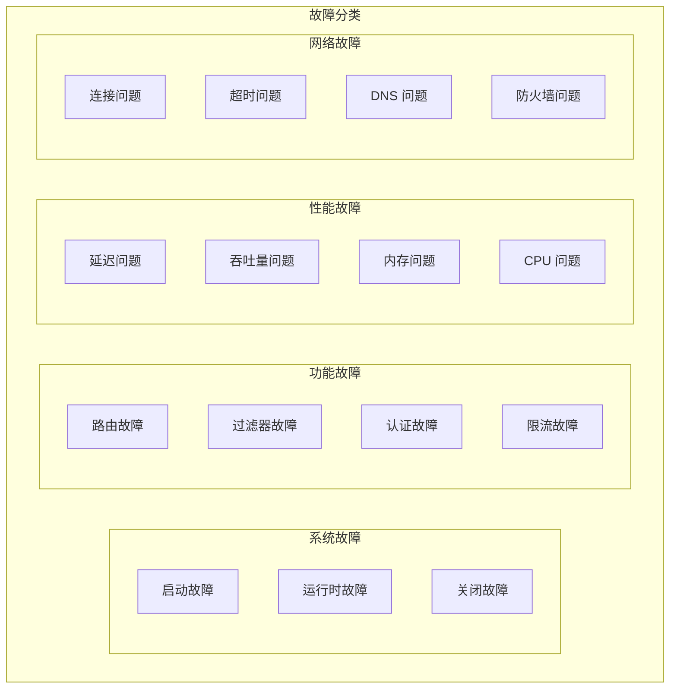
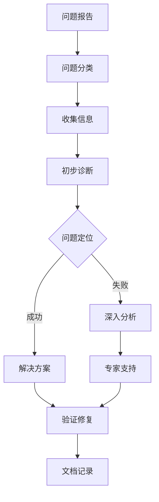

# 故障排除

TiGateway 故障排除指南提供了系统化的问题诊断和解决方案，帮助您快速定位和解决各种常见问题。

## 故障排除概述

### 故障分类



### 故障排除流程



## 系统故障排除

### 1. 启动故障

#### 问题：应用启动失败

**症状**：
- Pod 状态为 `CrashLoopBackOff`
- 应用日志显示启动错误
- 健康检查失败

**诊断步骤**：

```bash
# 1. 检查 Pod 状态
kubectl get pods -n tigateway -o wide

# 2. 查看 Pod 事件
kubectl describe pod <pod-name> -n tigateway

# 3. 查看应用日志
kubectl logs <pod-name> -n tigateway --previous

# 4. 检查配置
kubectl get configmap tigateway-config -n tigateway -o yaml

# 5. 检查环境变量
kubectl exec <pod-name> -n tigateway -- env | grep -E "(SPRING|TIGATEWAY)"
```

**常见原因和解决方案**：

1. **配置错误**
```yaml
# 检查配置文件语法
kubectl exec <pod-name> -n tigateway -- java -jar /app/tigateway.jar --spring.config.location=classpath:/application.yml --debug
```

2. **端口冲突**
```bash
# 检查端口占用
kubectl exec <pod-name> -n tigateway -- netstat -tlnp | grep :8080
```

3. **依赖服务不可用**
```bash
# 检查依赖服务
kubectl get svc -n tigateway
kubectl exec <pod-name> -n tigateway -- nslookup database-service
```

#### 问题：配置加载失败

**症状**：
- 启动日志显示配置错误
- 应用无法读取配置
- ConfigMap 挂载失败

**诊断步骤**：

```bash
# 1. 检查 ConfigMap
kubectl get configmap -n tigateway
kubectl describe configmap tigateway-config -n tigateway

# 2. 检查挂载点
kubectl exec <pod-name> -n tigateway -- ls -la /etc/tigateway/

# 3. 验证配置文件
kubectl exec <pod-name> -n tigateway -- cat /etc/tigateway/application.yml

# 4. 检查文件权限
kubectl exec <pod-name> -n tigateway -- ls -la /etc/tigateway/
```

**解决方案**：

```yaml
# 修复 ConfigMap 挂载
apiVersion: v1
kind: Pod
spec:
  containers:
  - name: tigateway
    volumeMounts:
    - name: config-volume
      mountPath: /etc/tigateway
      readOnly: true
  volumes:
  - name: config-volume
    configMap:
      name: tigateway-config
      items:
      - key: application.yml
        path: application.yml
```

### 2. 运行时故障

#### 问题：内存不足 (OOM)

**症状**：
- Pod 被 OOMKilled
- 应用响应缓慢
- 内存使用率持续增长

**诊断步骤**：

```bash
# 1. 检查内存使用
kubectl top pods -n tigateway

# 2. 查看 OOM 事件
kubectl describe pod <pod-name> -n tigateway | grep -A 5 -B 5 "OOMKilled"

# 3. 检查 JVM 内存设置
kubectl exec <pod-name> -n tigateway -- jps -v | grep tigateway

# 4. 分析内存使用
kubectl exec <pod-name> -n tigateway -- jstat -gc <pid> 1s 10
```

**解决方案**：

```yaml
# 调整资源限制
apiVersion: apps/v1
kind: Deployment
spec:
  template:
    spec:
      containers:
      - name: tigateway
        resources:
          requests:
            memory: "1Gi"
            cpu: "500m"
          limits:
            memory: "2Gi"
            cpu: "1000m"
        env:
        - name: JAVA_OPTS
          value: "-Xms1g -Xmx2g -XX:+UseG1GC"
```

#### 问题：CPU 使用率过高

**症状**：
- CPU 使用率持续 100%
- 响应时间增加
- 系统负载过高

**诊断步骤**：

```bash
# 1. 检查 CPU 使用
kubectl top pods -n tigateway

# 2. 分析线程状态
kubectl exec <pod-name> -n tigateway -- jstack <pid>

# 3. 检查 GC 情况
kubectl exec <pod-name> -n tigateway -- jstat -gc <pid> 1s 10

# 4. 分析热点方法
kubectl exec <pod-name> -n tigateway -- jcmd <pid> JFR.start duration=60s filename=/tmp/profile.jfr
```

**解决方案**：

```yaml
# 优化 JVM 参数
env:
- name: JAVA_OPTS
  value: "-XX:+UseG1GC -XX:MaxGCPauseMillis=200 -XX:+UnlockExperimentalVMOptions -XX:+UseJVMCICompiler"
```

## 功能故障排除

### 1. 路由故障

#### 问题：路由不生效

**症状**：
- 请求无法匹配路由
- 返回 404 错误
- 路由配置不生效

**诊断步骤**：

```bash
# 1. 检查路由配置
kubectl exec <pod-name> -n tigateway -- curl http://localhost:8081/api/v1/routes

# 2. 验证路由匹配
kubectl exec <pod-name> -n tigateway -- curl -v http://localhost:8080/api/users

# 3. 检查路由日志
kubectl logs <pod-name> -n tigateway | grep "route"

# 4. 验证断言配置
kubectl exec <pod-name> -n tigateway -- curl http://localhost:8081/api/v1/routes/user-service-route
```

**常见原因和解决方案**：

1. **断言配置错误**
```yaml
# 错误的配置
predicates:
- name: Path
  args:
    pattern: "/api/users/**"  # 缺少斜杠

# 正确的配置
predicates:
- name: Path
  args:
    pattern: "/api/users/**"
```

2. **路由顺序问题**
```yaml
# 调整路由顺序
routes:
- id: specific-route
  predicates:
  - Path=/api/users/detail
- id: general-route
  predicates:
  - Path=/api/users/**
```

#### 问题：路由转发失败

**症状**：
- 请求转发到错误的服务
- 返回 502/503 错误
- 服务发现失败

**诊断步骤**：

```bash
# 1. 检查目标服务
kubectl get svc -n default | grep user-service

# 2. 测试服务连接
kubectl exec <pod-name> -n tigateway -- curl http://user-service:8080/health

# 3. 检查服务发现
kubectl exec <pod-name> -n tigateway -- nslookup user-service

# 4. 查看转发日志
kubectl logs <pod-name> -n tigateway | grep "forward"
```

**解决方案**：

```yaml
# 修复服务发现配置
spring:
  cloud:
    discovery:
      enabled: true
      service-id: user-service
    loadbalancer:
      enabled: true
```

### 2. 过滤器故障

#### 问题：过滤器执行失败

**症状**：
- 过滤器抛出异常
- 请求处理中断
- 响应头缺失

**诊断步骤**：

```bash
# 1. 检查过滤器配置
kubectl exec <pod-name> -n tigateway -- curl http://localhost:8081/api/v1/filters/global

# 2. 查看过滤器日志
kubectl logs <pod-name> -n tigateway | grep "filter"

# 3. 测试过滤器功能
kubectl exec <pod-name> -n tigateway -- curl -v http://localhost:8080/api/test

# 4. 检查过滤器顺序
kubectl exec <pod-name> -n tigateway -- curl http://localhost:8081/api/v1/filters/order
```

**解决方案**：

```yaml
# 修复过滤器配置
filters:
- name: AddRequestHeader
  args:
    name: X-Service-Name
    value: tigateway
  order: 1
- name: AddResponseHeader
  args:
    name: X-Response-Time
    value: ${responseTime}
  order: 2
```

### 3. 认证故障

#### 问题：认证失败

**症状**：
- 返回 401 错误
- Token 验证失败
- 用户无法登录

**诊断步骤**：

```bash
# 1. 检查认证配置
kubectl exec <pod-name> -n tigateway -- curl http://localhost:8081/api/v1/config/security

# 2. 验证 Token
kubectl exec <pod-name> -n tigateway -- curl -H "Authorization: Bearer <token>" http://localhost:8080/api/protected

# 3. 检查认证日志
kubectl logs <pod-name> -n tigateway | grep "auth"

# 4. 测试认证服务
kubectl exec <pod-name> -n tigateway -- curl http://localhost:8081/api/v1/auth/me
```

**解决方案**：

```yaml
# 修复认证配置
security:
  jwt:
    secret: ${JWT_SECRET}
    expiration: 3600000
  oauth2:
    enabled: true
    client-id: ${OAUTH2_CLIENT_ID}
    client-secret: ${OAUTH2_CLIENT_SECRET}
```

## 性能故障排除

### 1. 延迟问题

#### 问题：响应时间过长

**症状**：
- 平均响应时间 > 1s
- 95% 响应时间 > 2s
- 用户体验差

**诊断步骤**：

```bash
# 1. 检查响应时间指标
kubectl exec <pod-name> -n tigateway -- curl http://localhost:8090/actuator/metrics/tigateway.requests.duration

# 2. 分析慢请求
kubectl logs <pod-name> -n tigateway | grep "slow"

# 3. 检查网络延迟
kubectl exec <pod-name> -n tigateway -- ping user-service

# 4. 分析调用链
kubectl exec <pod-name> -n tigateway -- curl http://localhost:8081/api/v1/traces/search
```

**解决方案**：

```yaml
# 优化连接配置
spring:
  cloud:
    gateway:
      httpclient:
        connect-timeout: 5000
        response-timeout: 10000
        pool:
          max-connections: 1000
          max-idle-time: 30s
```

### 2. 吞吐量问题

#### 问题：QPS 不达标

**症状**：
- 并发处理能力不足
- 请求排队等待
- 系统负载过高

**诊断步骤**：

```bash
# 1. 检查吞吐量指标
kubectl exec <pod-name> -n tigateway -- curl http://localhost:8090/actuator/metrics/tigateway.requests.total

# 2. 分析线程池状态
kubectl exec <pod-name> -n tigateway -- jstack <pid> | grep "pool"

# 3. 检查连接池
kubectl exec <pod-name> -n tigateway -- curl http://localhost:8090/actuator/metrics/http.client.connections

# 4. 分析瓶颈
kubectl exec <pod-name> -n tigateway -- jcmd <pid> JFR.start duration=60s filename=/tmp/throughput.jfr
```

**解决方案**：

```yaml
# 优化线程池配置
server:
  tomcat:
    threads:
      max: 200
      min-spare: 10
    max-connections: 10000
    accept-count: 1000
```

## 网络故障排除

### 1. 连接问题

#### 问题：服务连接失败

**症状**：
- 连接超时
- 连接被拒绝
- DNS 解析失败

**诊断步骤**：

```bash
# 1. 检查网络连通性
kubectl exec <pod-name> -n tigateway -- ping user-service

# 2. 测试端口连通性
kubectl exec <pod-name> -n tigateway -- telnet user-service 8080

# 3. 检查 DNS 解析
kubectl exec <pod-name> -n tigateway -- nslookup user-service

# 4. 查看网络策略
kubectl get networkpolicy -n tigateway
```

**解决方案**：

```yaml
# 配置网络策略
apiVersion: networking.k8s.io/v1
kind: NetworkPolicy
metadata:
  name: tigateway-network-policy
  namespace: tigateway
spec:
  podSelector:
    matchLabels:
      app: tigateway
  policyTypes:
  - Ingress
  - Egress
  ingress:
  - from:
    - namespaceSelector:
        matchLabels:
          name: default
    ports:
    - protocol: TCP
      port: 8080
  egress:
  - to:
    - namespaceSelector:
        matchLabels:
          name: default
    ports:
    - protocol: TCP
      port: 8080
```

### 2. 超时问题

#### 问题：请求超时

**症状**：
- 请求超时错误
- 连接超时
- 读取超时

**诊断步骤**：

```bash
# 1. 检查超时配置
kubectl exec <pod-name> -n tigateway -- curl http://localhost:8081/api/v1/config/timeout

# 2. 分析超时日志
kubectl logs <pod-name> -n tigateway | grep "timeout"

# 3. 测试服务响应时间
kubectl exec <pod-name> -n tigateway -- time curl http://user-service:8080/health

# 4. 检查负载情况
kubectl top pods -n tigateway
```

**解决方案**：

```yaml
# 调整超时配置
spring:
  cloud:
    gateway:
      httpclient:
        connect-timeout: 10000
        response-timeout: 30000
        pool:
          max-idle-time: 60s
```

## 故障排除工具

### 1. 诊断脚本

```bash
#!/bin/bash
# tigateway-diagnosis.sh

NAMESPACE="tigateway"
POD_NAME=$(kubectl get pods -n $NAMESPACE -l app=tigateway -o jsonpath='{.items[0].metadata.name}')

echo "=== TiGateway 诊断报告 ==="
echo "时间: $(date)"
echo "命名空间: $NAMESPACE"
echo "Pod: $POD_NAME"
echo

echo "=== Pod 状态 ==="
kubectl get pods -n $NAMESPACE -l app=tigateway

echo
echo "=== Pod 事件 ==="
kubectl describe pod $POD_NAME -n $NAMESPACE | grep -A 10 "Events:"

echo
echo "=== 应用日志 (最近 50 行) ==="
kubectl logs $POD_NAME -n $NAMESPACE --tail=50

echo
echo "=== 健康检查状态 ==="
kubectl exec $POD_NAME -n $NAMESPACE -- curl -s http://localhost:8090/actuator/health

echo
echo "=== 系统资源使用 ==="
kubectl top pod $POD_NAME -n $NAMESPACE

echo
echo "=== 路由配置 ==="
kubectl exec $POD_NAME -n $NAMESPACE -- curl -s http://localhost:8081/api/v1/routes

echo
echo "=== 配置信息 ==="
kubectl exec $POD_NAME -n $NAMESPACE -- curl -s http://localhost:8081/api/v1/config
```

### 2. 监控脚本

```bash
#!/bin/bash
# tigateway-monitor.sh

NAMESPACE="tigateway"
POD_NAME=$(kubectl get pods -n $NAMESPACE -l app=tigateway -o jsonpath='{.items[0].metadata.name}')

while true; do
    echo "=== $(date) ==="
    
    # 检查 Pod 状态
    STATUS=$(kubectl get pod $POD_NAME -n $NAMESPACE -o jsonpath='{.status.phase}')
    echo "Pod 状态: $STATUS"
    
    # 检查健康状态
    HEALTH=$(kubectl exec $POD_NAME -n $NAMESPACE -- curl -s http://localhost:8090/actuator/health | jq -r '.status')
    echo "健康状态: $HEALTH"
    
    # 检查资源使用
    kubectl top pod $POD_NAME -n $NAMESPACE
    
    # 检查错误日志
    ERROR_COUNT=$(kubectl logs $POD_NAME -n $NAMESPACE --since=1m | grep -c "ERROR")
    echo "错误日志数量 (最近1分钟): $ERROR_COUNT"
    
    echo "---"
    sleep 30
done
```

### 3. 性能分析脚本

```bash
#!/bin/bash
# tigateway-performance.sh

NAMESPACE="tigateway"
POD_NAME=$(kubectl get pods -n $NAMESPACE -l app=tigateway -o jsonpath='{.items[0].metadata.name}')

echo "=== 性能分析报告 ==="
echo "时间: $(date)"
echo

echo "=== JVM 内存使用 ==="
kubectl exec $POD_NAME -n $NAMESPACE -- jstat -gc 1 1s 5

echo
echo "=== 线程状态 ==="
kubectl exec $POD_NAME -n $NAMESPACE -- jstack 1 | grep -E "(RUNNABLE|BLOCKED|WAITING)" | sort | uniq -c

echo
echo "=== GC 统计 ==="
kubectl exec $POD_NAME -n $NAMESPACE -- jstat -gcutil 1

echo
echo "=== 请求指标 ==="
kubectl exec $POD_NAME -n $NAMESPACE -- curl -s http://localhost:8090/actuator/metrics/tigateway.requests.total
kubectl exec $POD_NAME -n $NAMESPACE -- curl -s http://localhost:8090/actuator/metrics/tigateway.requests.duration
```

## 故障预防

### 1. 监控告警

```yaml
# 监控告警配置
apiVersion: v1
kind: ConfigMap
metadata:
  name: tigateway-alerts
  namespace: tigateway
data:
  alerts.yml: |
    alerts:
      # 系统告警
      - name: "PodCrashLoopBackOff"
        condition: "kube_pod_status_phase{phase='Running'} == 0"
        severity: "critical"
        duration: "1m"
      
      - name: "HighMemoryUsage"
        condition: "container_memory_usage_bytes / container_spec_memory_limit_bytes > 0.8"
        severity: "warning"
        duration: "5m"
      
      - name: "HighCPUUsage"
        condition: "rate(container_cpu_usage_seconds_total[5m]) > 0.8"
        severity: "warning"
        duration: "5m"
      
      # 应用告警
      - name: "HighErrorRate"
        condition: "rate(tigateway_requests_errors_total[5m]) / rate(tigateway_requests_total[5m]) > 0.05"
        severity: "warning"
        duration: "2m"
      
      - name: "HighResponseTime"
        condition: "histogram_quantile(0.95, rate(tigateway_requests_duration_seconds_bucket[5m])) > 2"
        severity: "warning"
        duration: "2m"
      
      - name: "CircuitBreakerOpen"
        condition: "tigateway_circuit_breaker_state == 1"
        severity: "critical"
        duration: "1m"
```

### 2. 健康检查

```yaml
# 健康检查配置
apiVersion: v1
kind: ConfigMap
metadata:
  name: tigateway-health-check
  namespace: tigateway
data:
  health-check.yml: |
    health:
      checks:
        # 基础检查
        - name: "application"
          type: "http"
          url: "http://localhost:8090/actuator/health"
          timeout: 5s
          interval: 30s
        
        # 依赖检查
        - name: "database"
          type: "http"
          url: "http://localhost:8090/actuator/health/db"
          timeout: 5s
          interval: 30s
        
        - name: "redis"
          type: "http"
          url: "http://localhost:8090/actuator/health/redis"
          timeout: 5s
          interval: 30s
        
        # 业务检查
        - name: "routes"
          type: "http"
          url: "http://localhost:8081/api/v1/routes"
          timeout: 10s
          interval: 60s
```

### 3. 自动恢复

```yaml
# 自动恢复配置
apiVersion: v1
kind: ConfigMap
metadata:
  name: tigateway-auto-recovery
  namespace: tigateway
data:
  auto-recovery.yml: |
    recovery:
      # 自动重启
      auto-restart:
        enabled: true
        max-restarts: 3
        restart-interval: 300s
      
      # 配置回滚
      config-rollback:
        enabled: true
        max-versions: 10
        rollback-trigger:
          error-rate: 0.1
          response-time: 5000ms
      
      # 服务降级
      service-degradation:
        enabled: true
        strategies:
        - name: "circuit-breaker"
          condition: "error_rate > 0.5"
          action: "open_circuit"
        - name: "rate-limit"
          condition: "response_time > 2000ms"
          action: "reduce_rate"
```

## 总结

TiGateway 故障排除指南提供了系统化的问题诊断和解决方案：

1. **故障分类**: 系统、功能、性能和网络故障
2. **诊断流程**: 标准化的问题诊断流程
3. **常见问题**: 详细的常见问题诊断和解决方案
4. **诊断工具**: 实用的诊断和监控脚本
5. **故障预防**: 监控告警和自动恢复机制
6. **最佳实践**: 故障预防和快速恢复的最佳实践

通过系统化的故障排除方法，运维团队能够快速定位和解决问题，确保 TiGateway 的稳定运行。
