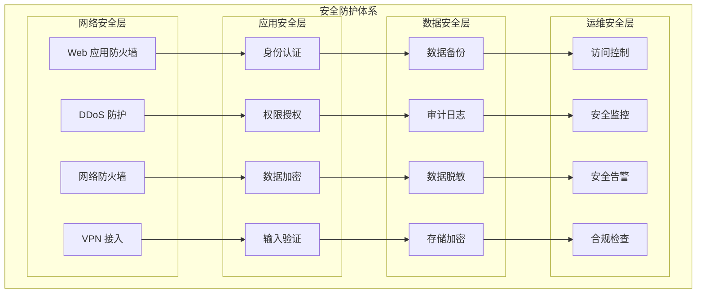

# 安全最佳实践

TiGateway 安全最佳实践指南提供了全面的安全防护策略，确保 API 网关在生产环境中的安全性和合规性。

## 安全架构概述

### 安全防护体系



### 安全原则

1. **最小权限原则**: 只授予必要的权限
2. **深度防御**: 多层安全防护
3. **零信任架构**: 不信任任何请求
4. **安全默认**: 默认安全配置
5. **持续监控**: 实时安全监控
6. **快速响应**: 快速安全响应

## 网络安全

### 1. 网络隔离

```yaml
# 网络策略配置
apiVersion: networking.k8s.io/v1
kind: NetworkPolicy
metadata:
  name: tigateway-network-policy
  namespace: tigateway
spec:
  podSelector:
    matchLabels:
      app: tigateway
  policyTypes:
  - Ingress
  - Egress
  
  # 入站规则
  ingress:
  - from:
    - namespaceSelector:
        matchLabels:
          name: ingress-nginx
    ports:
    - protocol: TCP
      port: 8080
  - from:
    - namespaceSelector:
        matchLabels:
          name: monitoring
    ports:
    - protocol: TCP
      port: 8090
  
  # 出站规则
  egress:
  - to:
    - namespaceSelector:
        matchLabels:
          name: default
    ports:
    - protocol: TCP
      port: 8080
  - to:
    - namespaceSelector:
        matchLabels:
          name: database
    ports:
    - protocol: TCP
      port: 5432
  - to:
    - namespaceSelector:
        matchLabels:
          name: redis
    ports:
    - protocol: TCP
      port: 6379
```

### 2. TLS/SSL 配置

```yaml
# TLS 配置
apiVersion: v1
kind: Secret
metadata:
  name: tigateway-tls
  namespace: tigateway
type: kubernetes.io/tls
data:
  tls.crt: <base64-encoded-cert>
  tls.key: <base64-encoded-key>

---
apiVersion: networking.k8s.io/v1
kind: Ingress
metadata:
  name: tigateway-ingress
  namespace: tigateway
  annotations:
    nginx.ingress.kubernetes.io/ssl-redirect: "true"
    nginx.ingress.kubernetes.io/force-ssl-redirect: "true"
    nginx.ingress.kubernetes.io/ssl-protocols: "TLSv1.2 TLSv1.3"
    nginx.ingress.kubernetes.io/ssl-ciphers: "ECDHE-RSA-AES128-GCM-SHA256,ECDHE-RSA-AES256-GCM-SHA384"
spec:
  tls:
  - hosts:
    - tigateway.example.com
    secretName: tigateway-tls
  rules:
  - host: tigateway.example.com
    http:
      paths:
      - path: /
        pathType: Prefix
        backend:
          service:
            name: tigateway
            port:
              number: 8080
```

### 3. 防火墙规则

```yaml
# 防火墙配置
apiVersion: v1
kind: ConfigMap
metadata:
  name: tigateway-firewall-rules
  namespace: tigateway
data:
  firewall-rules.yml: |
    firewall:
      # 允许的端口
      allowed-ports:
        - port: 8080
          protocol: TCP
          description: "Gateway HTTP"
        - port: 8081
          protocol: TCP
          description: "Admin HTTP"
        - port: 8090
          protocol: TCP
          description: "Management HTTP"
      
      # 拒绝的端口
      denied-ports:
        - port: 22
          protocol: TCP
          description: "SSH"
        - port: 3306
          protocol: TCP
          description: "MySQL"
        - port: 5432
          protocol: TCP
          description: "PostgreSQL"
      
      # IP 白名单
      allowed-ips:
        - "10.0.0.0/8"
        - "172.16.0.0/12"
        - "192.168.0.0/16"
      
      # IP 黑名单
      denied-ips:
        - "0.0.0.0/0"
        - "127.0.0.1"
```

## 身份认证和授权

### 1. JWT 安全配置

```yaml
# JWT 安全配置
apiVersion: v1
kind: ConfigMap
metadata:
  name: tigateway-jwt-security
  namespace: tigateway
data:
  jwt-security.yml: |
    security:
      jwt:
        # 密钥管理
        secret: ${JWT_SECRET}
        secret-rotation:
          enabled: true
          interval: 24h
          grace-period: 1h
        
        # Token 配置
        token:
          expiration: 3600000  # 1小时
          refresh-expiration: 86400000  # 24小时
          issuer: "tigateway"
          audience: "api-users"
        
        # 安全配置
        security:
          algorithm: "HS256"
          require-issuer: true
          require-audience: true
          require-expiration: true
          require-not-before: true
          clock-skew: 300  # 5分钟
        
        # 黑名单管理
        blacklist:
          enabled: true
          storage: "redis"
          ttl: 86400000  # 24小时
```

### 2. OAuth2 安全配置

```yaml
# OAuth2 安全配置
apiVersion: v1
kind: ConfigMap
metadata:
  name: tigateway-oauth2-security
  namespace: tigateway
data:
  oauth2-security.yml: |
    security:
      oauth2:
        # 客户端配置
        clients:
          - client-id: ${OAUTH2_CLIENT_ID}
            client-secret: ${OAUTH2_CLIENT_SECRET}
            authorized-grant-types:
              - "authorization_code"
              - "refresh_token"
            scope:
              - "read"
              - "write"
            redirect-uris:
              - "https://tigateway.example.com/callback"
            access-token-validity: 3600
            refresh-token-validity: 86400
        
        # 安全配置
        security:
          require-https: true
          allow-form-authentication: false
          token-endpoint-authentication-methods:
            - "client_secret_basic"
            - "client_secret_post"
        
        # 授权码配置
        authorization-code:
          length: 32
          expiration: 600  # 10分钟
          storage: "redis"
```

### 3. RBAC 权限控制

```yaml
# RBAC 配置
apiVersion: v1
kind: ConfigMap
metadata:
  name: tigateway-rbac-config
  namespace: tigateway
data:
  rbac-config.yml: |
    security:
      rbac:
        # 角色定义
        roles:
          - name: "admin"
            permissions:
              - "route:read"
              - "route:write"
              - "route:delete"
              - "filter:read"
              - "filter:write"
              - "filter:delete"
              - "config:read"
              - "config:write"
              - "user:read"
              - "user:write"
              - "user:delete"
          
          - name: "operator"
            permissions:
              - "route:read"
              - "route:write"
              - "filter:read"
              - "filter:write"
              - "config:read"
              - "config:write"
          
          - name: "viewer"
            permissions:
              - "route:read"
              - "filter:read"
              - "config:read"
              - "metrics:read"
        
        # 权限策略
        policies:
          - name: "admin-policy"
            roles: ["admin"]
            resources: ["*"]
            actions: ["*"]
          
          - name: "operator-policy"
            roles: ["operator"]
            resources: ["routes", "filters", "config"]
            actions: ["read", "write"]
          
          - name: "viewer-policy"
            roles: ["viewer"]
            resources: ["routes", "filters", "config", "metrics"]
            actions: ["read"]
```

## 数据安全

### 1. 数据加密

```java
@Configuration
public class DataEncryptionConfig {
    
    @Value("${tigateway.encryption.key}")
    private String encryptionKey;
    
    @Bean
    public AESUtil aesUtil() {
        return new AESUtil(encryptionKey);
    }
    
    @Bean
    public PasswordEncoder passwordEncoder() {
        return new BCryptPasswordEncoder(12);
    }
    
    @Bean
    public JasyptStringEncryptor jasyptStringEncryptor() {
        JasyptStringEncryptor encryptor = new JasyptStringEncryptor();
        encryptor.setPassword(encryptionKey);
        encryptor.setAlgorithm("PBEWithMD5AndDES");
        return encryptor;
    }
}

@Component
public class AESUtil {
    
    private final SecretKeySpec secretKey;
    private final Cipher cipher;
    
    public AESUtil(String key) {
        try {
            byte[] keyBytes = key.getBytes("UTF-8");
            MessageDigest sha = MessageDigest.getInstance("SHA-256");
            keyBytes = sha.digest(keyBytes);
            keyBytes = Arrays.copyOf(keyBytes, 16);
            
            this.secretKey = new SecretKeySpec(keyBytes, "AES");
            this.cipher = Cipher.getInstance("AES/ECB/PKCS5Padding");
        } catch (Exception e) {
            throw new RuntimeException("Failed to initialize AES encryption", e);
        }
    }
    
    public String encrypt(String plainText) {
        try {
            cipher.init(Cipher.ENCRYPT_MODE, secretKey);
            byte[] encrypted = cipher.doFinal(plainText.getBytes("UTF-8"));
            return Base64.getEncoder().encodeToString(encrypted);
        } catch (Exception e) {
            throw new RuntimeException("Encryption failed", e);
        }
    }
    
    public String decrypt(String encryptedText) {
        try {
            cipher.init(Cipher.DECRYPT_MODE, secretKey);
            byte[] decoded = Base64.getDecoder().decode(encryptedText);
            byte[] decrypted = cipher.doFinal(decoded);
            return new String(decrypted, "UTF-8");
        } catch (Exception e) {
            throw new RuntimeException("Decryption failed", e);
        }
    }
}
```

### 2. 敏感数据脱敏

```java
@Component
public class DataMaskingService {
    
    private static final String MASK_CHAR = "*";
    private static final int VISIBLE_CHARS = 4;
    
    public String maskEmail(String email) {
        if (email == null || email.isEmpty()) {
            return email;
        }
        
        int atIndex = email.indexOf("@");
        if (atIndex <= 0) {
            return email;
        }
        
        String localPart = email.substring(0, atIndex);
        String domain = email.substring(atIndex);
        
        if (localPart.length() <= VISIBLE_CHARS) {
            return MASK_CHAR.repeat(localPart.length()) + domain;
        }
        
        String visible = localPart.substring(0, VISIBLE_CHARS);
        String masked = MASK_CHAR.repeat(localPart.length() - VISIBLE_CHARS);
        
        return visible + masked + domain;
    }
    
    public String maskPhone(String phone) {
        if (phone == null || phone.isEmpty()) {
            return phone;
        }
        
        if (phone.length() <= VISIBLE_CHARS) {
            return MASK_CHAR.repeat(phone.length());
        }
        
        String visible = phone.substring(0, VISIBLE_CHARS);
        String masked = MASK_CHAR.repeat(phone.length() - VISIBLE_CHARS);
        
        return visible + masked;
    }
    
    public String maskCreditCard(String cardNumber) {
        if (cardNumber == null || cardNumber.isEmpty()) {
            return cardNumber;
        }
        
        if (cardNumber.length() <= 8) {
            return MASK_CHAR.repeat(cardNumber.length());
        }
        
        String firstFour = cardNumber.substring(0, 4);
        String lastFour = cardNumber.substring(cardNumber.length() - 4);
        String masked = MASK_CHAR.repeat(cardNumber.length() - 8);
        
        return firstFour + masked + lastFour;
    }
    
    public String maskIdCard(String idCard) {
        if (idCard == null || idCard.isEmpty()) {
            return idCard;
        }
        
        if (idCard.length() <= 8) {
            return MASK_CHAR.repeat(idCard.length());
        }
        
        String firstFour = idCard.substring(0, 4);
        String lastFour = idCard.substring(idCard.length() - 4);
        String masked = MASK_CHAR.repeat(idCard.length() - 8);
        
        return firstFour + masked + lastFour;
    }
}
```

### 3. 数据备份和恢复

```yaml
# 数据备份配置
apiVersion: v1
kind: ConfigMap
metadata:
  name: tigateway-backup-config
  namespace: tigateway
data:
  backup-config.yml: |
    backup:
      # 备份策略
      strategy:
        type: "incremental"
        schedule: "0 2 * * *"  # 每天凌晨2点
        retention: 30  # 保留30天
        compression: true
        encryption: true
      
      # 备份存储
      storage:
        type: "s3"
        bucket: "tigateway-backups"
        region: "us-west-2"
        prefix: "backups/"
        access-key: ${S3_ACCESS_KEY}
        secret-key: ${S3_SECRET_KEY}
      
      # 备份内容
      content:
        - "routes"
        - "filters"
        - "config"
        - "users"
        - "roles"
        - "permissions"
      
      # 恢复策略
      restore:
        enabled: true
        validation: true
        rollback: true
        notification: true
```

## 输入验证和防护

### 1. 输入验证

```java
@Component
public class InputValidationService {
    
    private static final String EMAIL_PATTERN = 
        "^[a-zA-Z0-9._%+-]+@[a-zA-Z0-9.-]+\\.[a-zA-Z]{2,}$";
    private static final String PHONE_PATTERN = 
        "^[+]?[1-9]\\d{1,14}$";
    private static final String URL_PATTERN = 
        "^(https?|ftp)://[^\\s/$.?#].[^\\s]*$";
    
    private final Pattern emailPattern = Pattern.compile(EMAIL_PATTERN);
    private final Pattern phonePattern = Pattern.compile(PHONE_PATTERN);
    private final Pattern urlPattern = Pattern.compile(URL_PATTERN);
    
    public ValidationResult validateEmail(String email) {
        if (email == null || email.isEmpty()) {
            return ValidationResult.error("Email cannot be empty");
        }
        
        if (email.length() > 254) {
            return ValidationResult.error("Email too long");
        }
        
        if (!emailPattern.matcher(email).matches()) {
            return ValidationResult.error("Invalid email format");
        }
        
        return ValidationResult.success();
    }
    
    public ValidationResult validatePhone(String phone) {
        if (phone == null || phone.isEmpty()) {
            return ValidationResult.error("Phone cannot be empty");
        }
        
        if (!phonePattern.matcher(phone).matches()) {
            return ValidationResult.error("Invalid phone format");
        }
        
        return ValidationResult.success();
    }
    
    public ValidationResult validateUrl(String url) {
        if (url == null || url.isEmpty()) {
            return ValidationResult.error("URL cannot be empty");
        }
        
        if (!urlPattern.matcher(url).matches()) {
            return ValidationResult.error("Invalid URL format");
        }
        
        return ValidationResult.success();
    }
    
    public ValidationResult validateRoute(Route route) {
        List<String> errors = new ArrayList<>();
        
        // 验证 ID
        if (route.getId() == null || route.getId().isEmpty()) {
            errors.add("Route ID cannot be empty");
        } else if (!route.getId().matches("^[a-zA-Z0-9-_]+$")) {
            errors.add("Route ID contains invalid characters");
        }
        
        // 验证 URI
        ValidationResult uriResult = validateUrl(route.getUri());
        if (!uriResult.isValid()) {
            errors.add("Invalid route URI: " + uriResult.getError());
        }
        
        // 验证断言
        if (route.getPredicates() == null || route.getPredicates().isEmpty()) {
            errors.add("Route must have at least one predicate");
        }
        
        if (errors.isEmpty()) {
            return ValidationResult.success();
        } else {
            return ValidationResult.error(String.join(", ", errors));
        }
    }
}
```

### 2. SQL 注入防护

```java
@Repository
public class SecureRouteRepository {
    
    @Autowired
    private JdbcTemplate jdbcTemplate;
    
    // 使用参数化查询防止 SQL 注入
    public List<Route> findRoutesByStatus(String status) {
        String sql = "SELECT * FROM routes WHERE status = ?";
        return jdbcTemplate.query(sql, new Object[]{status}, new RouteRowMapper());
    }
    
    // 使用命名参数
    public List<Route> findRoutesByPredicate(String predicateName, String predicateValue) {
        String sql = "SELECT * FROM routes r JOIN route_predicates rp ON r.id = rp.route_id " +
                    "WHERE rp.predicate_name = :predicateName AND rp.predicate_value = :predicateValue";
        
        MapSqlParameterSource params = new MapSqlParameterSource()
            .addValue("predicateName", predicateName)
            .addValue("predicateValue", predicateValue);
        
        return jdbcTemplate.query(sql, params, new RouteRowMapper());
    }
    
    // 输入验证和清理
    public void saveRoute(Route route) {
        // 验证输入
        validateRouteInput(route);
        
        // 清理输入
        String cleanedId = sanitizeInput(route.getId());
        String cleanedUri = sanitizeInput(route.getUri());
        
        String sql = "INSERT INTO routes (id, uri, status, created_at) VALUES (?, ?, ?, ?)";
        jdbcTemplate.update(sql, cleanedId, cleanedUri, route.getStatus(), new Date());
    }
    
    private void validateRouteInput(Route route) {
        if (route.getId() == null || route.getId().isEmpty()) {
            throw new IllegalArgumentException("Route ID cannot be empty");
        }
        
        if (!route.getId().matches("^[a-zA-Z0-9-_]+$")) {
            throw new IllegalArgumentException("Route ID contains invalid characters");
        }
        
        if (route.getUri() == null || route.getUri().isEmpty()) {
            throw new IllegalArgumentException("Route URI cannot be empty");
        }
    }
    
    private String sanitizeInput(String input) {
        if (input == null) {
            return null;
        }
        
        // 移除潜在的危险字符
        return input.replaceAll("[<>\"'&]", "");
    }
}
```

### 3. XSS 防护

```java
@Component
public class XSSProtectionService {
    
    private final PolicyFactory policy = Sanitizers.FORMATTING
        .and(Sanitizers.LINKS)
        .and(Sanitizers.BLOCKS)
        .and(Sanitizers.STYLES);
    
    public String sanitizeHtml(String html) {
        if (html == null) {
            return null;
        }
        
        return policy.sanitize(html);
    }
    
    public String sanitizeText(String text) {
        if (text == null) {
            return null;
        }
        
        // 转义 HTML 特殊字符
        return text.replace("&", "&amp;")
                  .replace("<", "&lt;")
                  .replace(">", "&gt;")
                  .replace("\"", "&quot;")
                  .replace("'", "&#x27;")
                  .replace("/", "&#x2F;");
    }
    
    public String sanitizeJson(String json) {
        if (json == null) {
            return null;
        }
        
        try {
            // 验证 JSON 格式
            ObjectMapper mapper = new ObjectMapper();
            JsonNode node = mapper.readTree(json);
            
            // 递归清理 JSON 中的字符串值
            sanitizeJsonNode(node);
            
            return mapper.writeValueAsString(node);
        } catch (Exception e) {
            throw new IllegalArgumentException("Invalid JSON format", e);
        }
    }
    
    private void sanitizeJsonNode(JsonNode node) {
        if (node.isObject()) {
            ObjectNode objectNode = (ObjectNode) node;
            objectNode.fieldNames().forEachRemaining(fieldName -> {
                JsonNode fieldValue = objectNode.get(fieldName);
                if (fieldValue.isTextual()) {
                    objectNode.put(fieldName, sanitizeText(fieldValue.asText()));
                } else {
                    sanitizeJsonNode(fieldValue);
                }
            });
        } else if (node.isArray()) {
            ArrayNode arrayNode = (ArrayNode) node;
            for (int i = 0; i < arrayNode.size(); i++) {
                JsonNode element = arrayNode.get(i);
                if (element.isTextual()) {
                    arrayNode.set(i, new TextNode(sanitizeText(element.asText())));
                } else {
                    sanitizeJsonNode(element);
                }
            }
        }
    }
}
```

## 安全监控和告警

### 1. 安全事件监控

```java
@Component
public class SecurityEventMonitor {
    
    private static final Logger logger = LoggerFactory.getLogger(SecurityEventMonitor.class);
    
    @Autowired
    private MeterRegistry meterRegistry;
    
    private final Counter authenticationAttempts;
    private final Counter authenticationFailures;
    private final Counter authorizationFailures;
    private final Counter suspiciousActivities;
    
    public SecurityEventMonitor(MeterRegistry meterRegistry) {
        this.meterRegistry = meterRegistry;
        this.authenticationAttempts = Counter.builder("tigateway.security.auth.attempts")
            .description("Authentication attempts")
            .register(meterRegistry);
        this.authenticationFailures = Counter.builder("tigateway.security.auth.failures")
            .description("Authentication failures")
            .register(meterRegistry);
        this.authorizationFailures = Counter.builder("tigateway.security.authz.failures")
            .description("Authorization failures")
            .register(meterRegistry);
        this.suspiciousActivities = Counter.builder("tigateway.security.suspicious.activities")
            .description("Suspicious activities")
            .register(meterRegistry);
    }
    
    public void recordAuthenticationAttempt(String username, boolean success, String sourceIp) {
        Tags tags = Tags.of(
            "username", username,
            "success", String.valueOf(success),
            "source_ip", sourceIp
        );
        
        authenticationAttempts.increment(tags);
        
        if (!success) {
            authenticationFailures.increment(tags);
            logger.warn("Authentication failed for user: {} from IP: {}", username, sourceIp);
        }
    }
    
    public void recordAuthorizationFailure(String username, String resource, String action, String sourceIp) {
        Tags tags = Tags.of(
            "username", username,
            "resource", resource,
            "action", action,
            "source_ip", sourceIp
        );
        
        authorizationFailures.increment(tags);
        logger.warn("Authorization failed for user: {} attempting {} on {} from IP: {}", 
                   username, action, resource, sourceIp);
    }
    
    public void recordSuspiciousActivity(String activity, String details, String sourceIp) {
        Tags tags = Tags.of(
            "activity", activity,
            "source_ip", sourceIp
        );
        
        suspiciousActivities.increment(tags);
        logger.error("Suspicious activity detected: {} - {} from IP: {}", activity, details, sourceIp);
    }
    
    @EventListener
    public void handleSecurityEvent(SecurityEvent event) {
        switch (event.getType()) {
            case AUTHENTICATION_ATTEMPT:
                recordAuthenticationAttempt(event.getUsername(), event.isSuccess(), event.getSourceIp());
                break;
            case AUTHORIZATION_FAILURE:
                recordAuthorizationFailure(event.getUsername(), event.getResource(), 
                                         event.getAction(), event.getSourceIp());
                break;
            case SUSPICIOUS_ACTIVITY:
                recordSuspiciousActivity(event.getActivity(), event.getDetails(), event.getSourceIp());
                break;
        }
    }
}
```

### 2. 安全告警配置

```yaml
# 安全告警配置
apiVersion: v1
kind: ConfigMap
metadata:
  name: tigateway-security-alerts
  namespace: tigateway
data:
  security-alerts.yml: |
    alerts:
      # 认证告警
      - name: "HighAuthenticationFailures"
        condition: "rate(tigateway_security_auth_failures_total[5m]) > 10"
        severity: "warning"
        duration: "2m"
        description: "High rate of authentication failures"
      
      - name: "BruteForceAttack"
        condition: "rate(tigateway_security_auth_failures_total[1m]) > 5"
        severity: "critical"
        duration: "1m"
        description: "Possible brute force attack detected"
      
      # 授权告警
      - name: "HighAuthorizationFailures"
        condition: "rate(tigateway_security_authz_failures_total[5m]) > 20"
        severity: "warning"
        duration: "2m"
        description: "High rate of authorization failures"
      
      # 可疑活动告警
      - name: "SuspiciousActivity"
        condition: "rate(tigateway_security_suspicious_activities_total[5m]) > 0"
        severity: "critical"
        duration: "1m"
        description: "Suspicious activity detected"
      
      # 异常访问告警
      - name: "AbnormalAccess"
        condition: "rate(tigateway_requests_total[5m]) > 1000"
        severity: "warning"
        duration: "2m"
        description: "Abnormal high request rate"
      
      # 地理异常告警
      - name: "GeographicAnomaly"
        condition: "tigateway_requests_by_country_total{country!=\"CN\"} > 100"
        severity: "info"
        duration: "5m"
        description: "Requests from unusual geographic location"
```

### 3. 安全审计日志

```java
@Component
public class SecurityAuditLogger {
    
    private static final Logger auditLogger = LoggerFactory.getLogger("SECURITY_AUDIT");
    
    public void logAuthentication(String username, boolean success, String sourceIp, String userAgent) {
        AuditEvent event = AuditEvent.builder()
            .timestamp(Instant.now())
            .eventType("AUTHENTICATION")
            .username(username)
            .success(success)
            .sourceIp(sourceIp)
            .userAgent(userAgent)
            .build();
        
        auditLogger.info("AUTHENTICATION: user={}, success={}, ip={}, userAgent={}", 
                        username, success, sourceIp, userAgent);
    }
    
    public void logAuthorization(String username, String resource, String action, 
                               boolean success, String sourceIp) {
        AuditEvent event = AuditEvent.builder()
            .timestamp(Instant.now())
            .eventType("AUTHORIZATION")
            .username(username)
            .resource(resource)
            .action(action)
            .success(success)
            .sourceIp(sourceIp)
            .build();
        
        auditLogger.info("AUTHORIZATION: user={}, resource={}, action={}, success={}, ip={}", 
                        username, resource, action, success, sourceIp);
    }
    
    public void logDataAccess(String username, String resource, String action, 
                            String dataType, String sourceIp) {
        AuditEvent event = AuditEvent.builder()
            .timestamp(Instant.now())
            .eventType("DATA_ACCESS")
            .username(username)
            .resource(resource)
            .action(action)
            .dataType(dataType)
            .sourceIp(sourceIp)
            .build();
        
        auditLogger.info("DATA_ACCESS: user={}, resource={}, action={}, dataType={}, ip={}", 
                        username, resource, action, dataType, sourceIp);
    }
    
    public void logConfigurationChange(String username, String configType, String configKey, 
                                     String oldValue, String newValue, String sourceIp) {
        AuditEvent event = AuditEvent.builder()
            .timestamp(Instant.now())
            .eventType("CONFIGURATION_CHANGE")
            .username(username)
            .configType(configType)
            .configKey(configKey)
            .oldValue(oldValue)
            .newValue(newValue)
            .sourceIp(sourceIp)
            .build();
        
        auditLogger.info("CONFIGURATION_CHANGE: user={}, type={}, key={}, oldValue={}, newValue={}, ip={}", 
                        username, configType, configKey, oldValue, newValue, sourceIp);
    }
}
```

## 合规性检查

### 1. 安全合规检查

```java
@Component
public class SecurityComplianceChecker {
    
    @Autowired
    private SecurityConfigurationService securityConfigService;
    
    @Autowired
    private UserService userService;
    
    public ComplianceReport checkSecurityCompliance() {
        ComplianceReport report = new ComplianceReport();
        
        // 检查密码策略
        checkPasswordPolicy(report);
        
        // 检查访问控制
        checkAccessControl(report);
        
        // 检查数据加密
        checkDataEncryption(report);
        
        // 检查审计日志
        checkAuditLogging(report);
        
        // 检查网络安全
        checkNetworkSecurity(report);
        
        return report;
    }
    
    private void checkPasswordPolicy(ComplianceReport report) {
        PasswordPolicy policy = securityConfigService.getPasswordPolicy();
        
        if (policy.getMinLength() < 8) {
            report.addViolation("PASSWORD_POLICY", "Password minimum length should be at least 8 characters");
        }
        
        if (!policy.isRequireUppercase()) {
            report.addViolation("PASSWORD_POLICY", "Password should require uppercase letters");
        }
        
        if (!policy.isRequireLowercase()) {
            report.addViolation("PASSWORD_POLICY", "Password should require lowercase letters");
        }
        
        if (!policy.isRequireNumbers()) {
            report.addViolation("PASSWORD_POLICY", "Password should require numbers");
        }
        
        if (!policy.isRequireSpecialChars()) {
            report.addViolation("PASSWORD_POLICY", "Password should require special characters");
        }
        
        if (policy.getMaxAge() > 90) {
            report.addViolation("PASSWORD_POLICY", "Password maximum age should not exceed 90 days");
        }
    }
    
    private void checkAccessControl(ComplianceReport report) {
        List<User> users = userService.getAllUsers();
        
        for (User user : users) {
            if (user.getRoles().isEmpty()) {
                report.addViolation("ACCESS_CONTROL", 
                    "User " + user.getUsername() + " has no roles assigned");
            }
            
            if (user.isEnabled() && user.getLastLogin() == null) {
                // 检查新用户是否在合理时间内登录
                long daysSinceCreation = ChronoUnit.DAYS.between(
                    user.getCreatedAt(), Instant.now());
                if (daysSinceCreation > 7) {
                    report.addViolation("ACCESS_CONTROL", 
                        "User " + user.getUsername() + " has not logged in within 7 days of creation");
                }
            }
        }
    }
    
    private void checkDataEncryption(ComplianceReport report) {
        EncryptionConfig config = securityConfigService.getEncryptionConfig();
        
        if (!config.isDataAtRestEncrypted()) {
            report.addViolation("DATA_ENCRYPTION", "Data at rest encryption is not enabled");
        }
        
        if (!config.isDataInTransitEncrypted()) {
            report.addViolation("DATA_ENCRYPTION", "Data in transit encryption is not enabled");
        }
        
        if (config.getKeyRotationInterval() > 365) {
            report.addViolation("DATA_ENCRYPTION", "Encryption key rotation interval should not exceed 365 days");
        }
    }
    
    private void checkAuditLogging(ComplianceReport report) {
        AuditConfig config = securityConfigService.getAuditConfig();
        
        if (!config.isEnabled()) {
            report.addViolation("AUDIT_LOGGING", "Audit logging is not enabled");
        }
        
        if (config.getRetentionDays() < 90) {
            report.addViolation("AUDIT_LOGGING", "Audit log retention should be at least 90 days");
        }
        
        if (!config.isTamperProof()) {
            report.addViolation("AUDIT_LOGGING", "Audit logs should be tamper-proof");
        }
    }
    
    private void checkNetworkSecurity(ComplianceReport report) {
        NetworkSecurityConfig config = securityConfigService.getNetworkSecurityConfig();
        
        if (!config.isTlsEnabled()) {
            report.addViolation("NETWORK_SECURITY", "TLS encryption is not enabled");
        }
        
        if (config.getTlsVersion().compareTo("1.2") < 0) {
            report.addViolation("NETWORK_SECURITY", "TLS version should be 1.2 or higher");
        }
        
        if (!config.isFirewallEnabled()) {
            report.addViolation("NETWORK_SECURITY", "Firewall is not enabled");
        }
    }
}
```

### 2. 安全扫描

```java
@Component
public class SecurityScanner {
    
    @Autowired
    private VulnerabilityScanner vulnerabilityScanner;
    
    @Autowired
    private DependencyScanner dependencyScanner;
    
    @Autowired
    private ConfigurationScanner configurationScanner;
    
    public SecurityScanReport performSecurityScan() {
        SecurityScanReport report = new SecurityScanReport();
        
        // 漏洞扫描
        List<Vulnerability> vulnerabilities = vulnerabilityScanner.scan();
        report.setVulnerabilities(vulnerabilities);
        
        // 依赖扫描
        List<DependencyIssue> dependencyIssues = dependencyScanner.scan();
        report.setDependencyIssues(dependencyIssues);
        
        // 配置扫描
        List<ConfigurationIssue> configurationIssues = configurationScanner.scan();
        report.setConfigurationIssues(configurationIssues);
        
        // 计算风险评分
        int riskScore = calculateRiskScore(vulnerabilities, dependencyIssues, configurationIssues);
        report.setRiskScore(riskScore);
        
        return report;
    }
    
    private int calculateRiskScore(List<Vulnerability> vulnerabilities, 
                                 List<DependencyIssue> dependencyIssues,
                                 List<ConfigurationIssue> configurationIssues) {
        int score = 0;
        
        // 漏洞评分
        for (Vulnerability vuln : vulnerabilities) {
            switch (vuln.getSeverity()) {
                case CRITICAL:
                    score += 10;
                    break;
                case HIGH:
                    score += 7;
                    break;
                case MEDIUM:
                    score += 4;
                    break;
                case LOW:
                    score += 1;
                    break;
            }
        }
        
        // 依赖问题评分
        for (DependencyIssue issue : dependencyIssues) {
            switch (issue.getSeverity()) {
                case CRITICAL:
                    score += 8;
                    break;
                case HIGH:
                    score += 5;
                    break;
                case MEDIUM:
                    score += 3;
                    break;
                case LOW:
                    score += 1;
                    break;
            }
        }
        
        // 配置问题评分
        for (ConfigurationIssue issue : configurationIssues) {
            switch (issue.getSeverity()) {
                case CRITICAL:
                    score += 6;
                    break;
                case HIGH:
                    score += 4;
                    break;
                case MEDIUM:
                    score += 2;
                    break;
                case LOW:
                    score += 1;
                    break;
            }
        }
        
        return Math.min(score, 100); // 最高100分
    }
}
```

## 安全最佳实践总结

### 1. 安全配置清单

```yaml
# 安全配置清单
apiVersion: v1
kind: ConfigMap
metadata:
  name: tigateway-security-checklist
  namespace: tigateway
data:
  security-checklist.yml: |
    security:
      checklist:
        # 网络安全
        network:
          - "启用 TLS/SSL 加密"
          - "配置防火墙规则"
          - "实施网络隔离"
          - "启用 DDoS 防护"
          - "配置 VPN 接入"
        
        # 身份认证
        authentication:
          - "启用强密码策略"
          - "实施多因素认证"
          - "配置账户锁定策略"
          - "启用会话管理"
          - "实施单点登录"
        
        # 权限控制
        authorization:
          - "实施最小权限原则"
          - "配置基于角色的访问控制"
          - "启用权限审计"
          - "实施权限分离"
          - "配置权限过期"
        
        # 数据安全
        data:
          - "启用数据加密"
          - "实施数据脱敏"
          - "配置数据备份"
          - "启用数据完整性检查"
          - "实施数据分类"
        
        # 应用安全
        application:
          - "启用输入验证"
          - "实施输出编码"
          - "配置安全头"
          - "启用 CSRF 防护"
          - "实施 XSS 防护"
        
        # 监控审计
        monitoring:
          - "启用安全监控"
          - "配置安全告警"
          - "实施审计日志"
          - "启用异常检测"
          - "配置安全报告"
```

### 2. 安全运维流程

```yaml
# 安全运维流程
apiVersion: v1
kind: ConfigMap
metadata:
  name: tigateway-security-operations
  namespace: tigateway
data:
  security-operations.yml: |
    security:
      operations:
        # 日常检查
        daily:
          - "检查安全日志"
          - "验证系统状态"
          - "检查用户活动"
          - "验证备份状态"
          - "检查证书有效期"
        
        # 周度检查
        weekly:
          - "执行安全扫描"
          - "检查权限配置"
          - "验证访问控制"
          - "检查数据完整性"
          - "更新安全补丁"
        
        # 月度检查
        monthly:
          - "执行合规检查"
          - "检查安全策略"
          - "验证灾难恢复"
          - "检查安全培训"
          - "更新安全文档"
        
        # 季度检查
        quarterly:
          - "执行渗透测试"
          - "检查安全架构"
          - "验证安全流程"
          - "检查第三方安全"
          - "更新安全策略"
```

## 总结

TiGateway 安全最佳实践指南提供了全面的安全防护策略：

1. **安全架构**: 多层安全防护体系
2. **网络安全**: 网络隔离、TLS/SSL 配置和防火墙规则
3. **身份认证和授权**: JWT、OAuth2 和 RBAC 安全配置
4. **数据安全**: 数据加密、脱敏和备份策略
5. **输入验证和防护**: 输入验证、SQL 注入防护和 XSS 防护
6. **安全监控和告警**: 安全事件监控、告警配置和审计日志
7. **合规性检查**: 安全合规检查和漏洞扫描
8. **最佳实践**: 安全配置清单和运维流程

通过实施这些安全最佳实践，可以确保 TiGateway 在生产环境中的安全性和合规性，保护系统和数据免受各种安全威胁。
