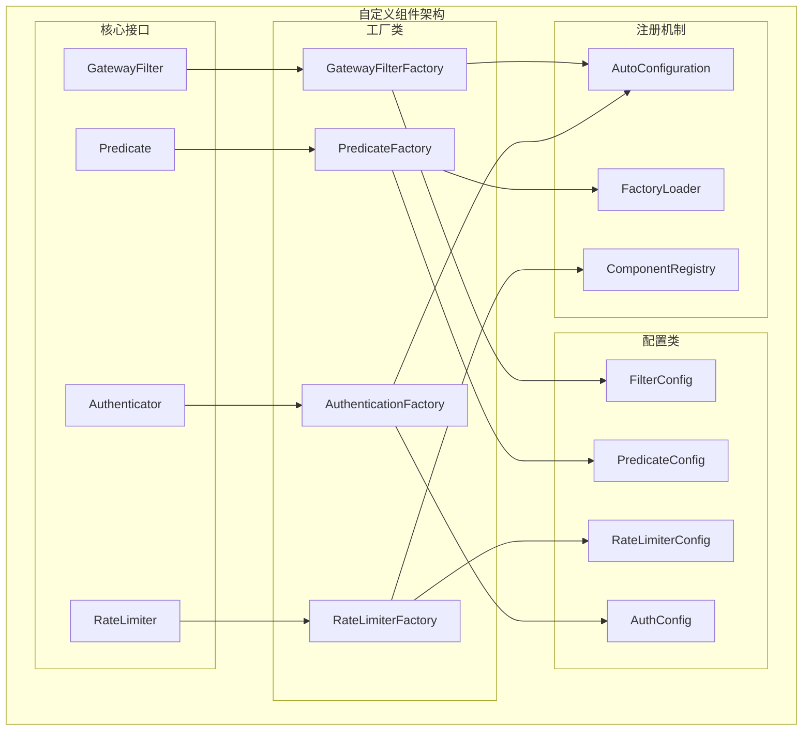
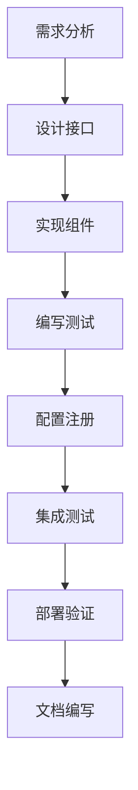

# 自定义组件开发

TiGateway 自定义组件开发指南提供了完整的开发框架，帮助您创建自定义的过滤器、断言、限流器和认证组件，以满足特定的业务需求。

## 自定义组件概述

### 组件架构



### 开发流程



## 自定义过滤器开发

### 1. 基础过滤器实现

```java
/**
 * 自定义请求头过滤器
 */
public class CustomHeaderGatewayFilter implements GatewayFilter, Ordered {
    
    private final String headerName;
    private final String headerValue;
    private final int order;
    
    public CustomHeaderGatewayFilter(String headerName, String headerValue, int order) {
        this.headerName = headerName;
        this.headerValue = headerValue;
        this.order = order;
    }
    
    @Override
    public Mono<Void> filter(ServerWebExchange exchange, GatewayFilterChain chain) {
        ServerHttpRequest request = exchange.getRequest();
        ServerHttpRequest.Builder builder = request.mutate();
        
        // 添加自定义请求头
        builder.header(headerName, headerValue);
        
        // 记录日志
        log.info("Added custom header: {} = {}", headerName, headerValue);
        
        return chain.filter(exchange.mutate().request(builder.build()).build());
    }
    
    @Override
    public int getOrder() {
        return order;
    }
}
```

### 2. 过滤器工厂实现

```java
/**
 * 自定义请求头过滤器工厂
 */
@Component
public class CustomHeaderGatewayFilterFactory extends AbstractGatewayFilterFactory<CustomHeaderGatewayFilterFactory.Config> {
    
    private static final String HEADER_NAME_KEY = "headerName";
    private static final String HEADER_VALUE_KEY = "headerValue";
    private static final String ORDER_KEY = "order";
    
    public CustomHeaderGatewayFilterFactory() {
        super(Config.class);
    }
    
    @Override
    public List<String> shortcutFieldOrder() {
        return Arrays.asList(HEADER_NAME_KEY, HEADER_VALUE_KEY, ORDER_KEY);
    }
    
    @Override
    public GatewayFilter apply(Config config) {
        return new CustomHeaderGatewayFilter(
            config.getHeaderName(),
            config.getHeaderValue(),
            config.getOrder()
        );
    }
    
    @Override
    public ShortcutType shortcutType() {
        return ShortcutType.GATHER_LIST;
    }
    
    @Data
    public static class Config {
        private String headerName;
        private String headerValue;
        private int order = 0;
    }
}
```

### 3. 高级过滤器实现

```java
/**
 * 自定义响应时间过滤器
 */
public class ResponseTimeGatewayFilter implements GatewayFilter, Ordered {
    
    private static final Logger log = LoggerFactory.getLogger(ResponseTimeGatewayFilter.class);
    
    private final String responseTimeHeader;
    private final int order;
    
    public ResponseTimeGatewayFilter(String responseTimeHeader, int order) {
        this.responseTimeHeader = responseTimeHeader;
        this.order = order;
    }
    
    @Override
    public Mono<Void> filter(ServerWebExchange exchange, GatewayFilterChain chain) {
        long startTime = System.currentTimeMillis();
        
        return chain.filter(exchange).then(
            Mono.fromRunnable(() -> {
                long endTime = System.currentTimeMillis();
                long responseTime = endTime - startTime;
                
                // 添加响应时间头
                ServerHttpResponse response = exchange.getResponse();
                response.getHeaders().add(responseTimeHeader, String.valueOf(responseTime));
                
                // 记录响应时间日志
                log.info("Request processed in {}ms for path: {}", 
                        responseTime, exchange.getRequest().getPath().value());
                
                // 记录指标
                recordMetrics(exchange, responseTime);
            })
        );
    }
    
    private void recordMetrics(ServerWebExchange exchange, long responseTime) {
        // 记录响应时间指标
        String path = exchange.getRequest().getPath().value();
        String method = exchange.getRequest().getMethod().name();
        
        // 使用 Micrometer 记录指标
        Timer.Sample sample = Timer.start();
        sample.stop(Timer.builder("tigateway.custom.response.time")
            .tag("path", path)
            .tag("method", method)
            .register(Metrics.globalRegistry));
    }
    
    @Override
    public int getOrder() {
        return order;
    }
}
```

### 4. 过滤器工厂注册

```java
/**
 * 自定义过滤器自动配置
 */
@Configuration
@EnableConfigurationProperties
public class CustomFilterAutoConfiguration {
    
    @Bean
    public CustomHeaderGatewayFilterFactory customHeaderGatewayFilterFactory() {
        return new CustomHeaderGatewayFilterFactory();
    }
    
    @Bean
    public ResponseTimeGatewayFilterFactory responseTimeGatewayFilterFactory() {
        return new ResponseTimeGatewayFilterFactory();
    }
    
    @Bean
    public CustomMetricsGatewayFilterFactory customMetricsGatewayFilterFactory() {
        return new CustomMetricsGatewayFilterFactory();
    }
}
```

## 自定义断言开发

### 1. 基础断言实现

```java
/**
 * 自定义时间范围断言
 */
public class CustomTimeRangePredicate implements Predicate<ServerWebExchange> {
    
    private final LocalTime startTime;
    private final LocalTime endTime;
    
    public CustomTimeRangePredicate(LocalTime startTime, LocalTime endTime) {
        this.startTime = startTime;
        this.endTime = endTime;
    }
    
    @Override
    public boolean test(ServerWebExchange exchange) {
        LocalTime currentTime = LocalTime.now();
        
        if (startTime.isBefore(endTime)) {
            // 正常时间范围，如 09:00-17:00
            return !currentTime.isBefore(startTime) && !currentTime.isAfter(endTime);
        } else {
            // 跨天时间范围，如 22:00-06:00
            return !currentTime.isBefore(startTime) || !currentTime.isAfter(endTime);
        }
    }
    
    @Override
    public String toString() {
        return String.format("TimeRange: %s-%s", startTime, endTime);
    }
}
```

### 2. 断言工厂实现

```java
/**
 * 自定义时间范围断言工厂
 */
@Component
public class CustomTimeRangePredicateFactory extends AbstractRoutePredicateFactory<CustomTimeRangePredicateFactory.Config> {
    
    private static final String START_TIME_KEY = "startTime";
    private static final String END_TIME_KEY = "endTime";
    
    public CustomTimeRangePredicateFactory() {
        super(Config.class);
    }
    
    @Override
    public List<String> shortcutFieldOrder() {
        return Arrays.asList(START_TIME_KEY, END_TIME_KEY);
    }
    
    @Override
    public Predicate<ServerWebExchange> apply(Config config) {
        return new CustomTimeRangePredicate(config.getStartTime(), config.getEndTime());
    }
    
    @Override
    public ShortcutType shortcutType() {
        return ShortcutType.GATHER_LIST;
    }
    
    @Data
    public static class Config {
        private LocalTime startTime;
        private LocalTime endTime;
    }
}
```

### 3. 高级断言实现

```java
/**
 * 自定义地理位置断言
 */
public class GeoLocationPredicate implements Predicate<ServerWebExchange> {
    
    private final Set<String> allowedCountries;
    private final Set<String> allowedRegions;
    private final Set<String> blockedIps;
    
    public GeoLocationPredicate(Set<String> allowedCountries, Set<String> allowedRegions, Set<String> blockedIps) {
        this.allowedCountries = allowedCountries;
        this.allowedRegions = allowedRegions;
        this.blockedIps = blockedIps;
    }
    
    @Override
    public boolean test(ServerWebExchange exchange) {
        String clientIp = getClientIp(exchange);
        
        // 检查 IP 黑名单
        if (blockedIps.contains(clientIp)) {
            return false;
        }
        
        // 获取地理位置信息
        GeoLocation geoLocation = getGeoLocation(clientIp);
        if (geoLocation == null) {
            return false;
        }
        
        // 检查国家限制
        if (!allowedCountries.isEmpty() && !allowedCountries.contains(geoLocation.getCountry())) {
            return false;
        }
        
        // 检查地区限制
        if (!allowedRegions.isEmpty() && !allowedRegions.contains(geoLocation.getRegion())) {
            return false;
        }
        
        return true;
    }
    
    private String getClientIp(ServerWebExchange exchange) {
        ServerHttpRequest request = exchange.getRequest();
        String xForwardedFor = request.getHeaders().getFirst("X-Forwarded-For");
        
        if (xForwardedFor != null && !xForwardedFor.isEmpty()) {
            return xForwardedFor.split(",")[0].trim();
        }
        
        String xRealIp = request.getHeaders().getFirst("X-Real-IP");
        if (xRealIp != null && !xRealIp.isEmpty()) {
            return xRealIp;
        }
        
        return request.getRemoteAddress() != null ? 
            request.getRemoteAddress().getAddress().getHostAddress() : "unknown";
    }
    
    private GeoLocation getGeoLocation(String ip) {
        // 实现地理位置查询逻辑
        // 可以使用第三方服务如 MaxMind GeoIP2
        return null; // 简化实现
    }
    
    @Override
    public String toString() {
        return String.format("GeoLocation: countries=%s, regions=%s, blockedIps=%s", 
                           allowedCountries, allowedRegions, blockedIps);
    }
}
```

## 自定义限流器开发

### 1. 基础限流器实现

```java
/**
 * 自定义令牌桶限流器
 */
public class CustomTokenBucketRateLimiter implements RateLimiter {
    
    private final RedisTemplate<String, String> redisTemplate;
    private final String keyPrefix;
    private final int capacity;
    private final int refillRate;
    private final Duration refillPeriod;
    
    public CustomTokenBucketRateLimiter(RedisTemplate<String, String> redisTemplate,
                                      String keyPrefix,
                                      int capacity,
                                      int refillRate,
                                      Duration refillPeriod) {
        this.redisTemplate = redisTemplate;
        this.keyPrefix = keyPrefix;
        this.capacity = capacity;
        this.refillRate = refillRate;
        this.refillPeriod = refillPeriod;
    }
    
    @Override
    public Mono<Response> isAllowed(String routeId, String id) {
        String key = keyPrefix + ":" + routeId + ":" + id;
        
        return Mono.fromCallable(() -> {
            // 使用 Lua 脚本实现原子操作
            String luaScript = """
                local key = KEYS[1]
                local capacity = tonumber(ARGV[1])
                local refillRate = tonumber(ARGV[2])
                local refillPeriod = tonumber(ARGV[3])
                local now = tonumber(ARGV[4])
                
                local bucket = redis.call('HMGET', key, 'tokens', 'lastRefill')
                local tokens = tonumber(bucket[1]) or capacity
                local lastRefill = tonumber(bucket[2]) or now
                
                -- 计算需要补充的令牌数
                local timePassed = now - lastRefill
                local tokensToAdd = math.floor(timePassed / refillPeriod) * refillRate
                
                -- 更新令牌数
                tokens = math.min(capacity, tokens + tokensToAdd)
                lastRefill = now
                
                -- 检查是否有足够的令牌
                if tokens >= 1 then
                    tokens = tokens - 1
                    redis.call('HMSET', key, 'tokens', tokens, 'lastRefill', lastRefill)
                    redis.call('EXPIRE', key, 3600)
                    return {1, tokens, capacity}
                else
                    redis.call('HMSET', key, 'tokens', tokens, 'lastRefill', lastRefill)
                    redis.call('EXPIRE', key, 3600)
                    return {0, tokens, capacity}
                end
                """;
            
            List<String> keys = Arrays.asList(key);
            List<String> args = Arrays.asList(
                String.valueOf(capacity),
                String.valueOf(refillRate),
                String.valueOf(refillPeriod.toMillis()),
                String.valueOf(System.currentTimeMillis())
            );
            
            List<Object> result = redisTemplate.execute(
                (RedisCallback<List<Object>>) connection -> 
                    connection.eval(luaScript.getBytes(), ReturnType.MULTI, 1, 
                                  key.getBytes(), 
                                  args.toArray(new String[0]))
            );
            
            boolean allowed = ((Number) result.get(0)).intValue() == 1;
            int remainingTokens = ((Number) result.get(1)).intValue();
            int capacity = ((Number) result.get(2)).intValue();
            
            return new Response(allowed, 
                Map.of("X-RateLimit-Remaining", String.valueOf(remainingTokens),
                      "X-RateLimit-Capacity", String.valueOf(capacity)));
        });
    }
}
```

### 2. 限流器工厂实现

```java
/**
 * 自定义令牌桶限流器工厂
 */
@Component
public class CustomTokenBucketRateLimiterFactory implements RateLimiterFactory<CustomTokenBucketRateLimiterFactory.Config> {
    
    @Autowired
    private RedisTemplate<String, String> redisTemplate;
    
    @Override
    public RateLimiter apply(Config config) {
        return new CustomTokenBucketRateLimiter(
            redisTemplate,
            config.getKeyPrefix(),
            config.getCapacity(),
            config.getRefillRate(),
            config.getRefillPeriod()
        );
    }
    
    @Override
    public Class<Config> getConfigClass() {
        return Config.class;
    }
    
    @Data
    public static class Config {
        private String keyPrefix = "tigateway:rate:limit";
        private int capacity = 100;
        private int refillRate = 10;
        private Duration refillPeriod = Duration.ofSeconds(1);
    }
}
```

### 3. 高级限流器实现

```java
/**
 * 自定义滑动窗口限流器
 */
public class SlidingWindowRateLimiter implements RateLimiter {
    
    private final RedisTemplate<String, String> redisTemplate;
    private final String keyPrefix;
    private final int windowSize;
    private final Duration windowDuration;
    
    public SlidingWindowRateLimiter(RedisTemplate<String, String> redisTemplate,
                                  String keyPrefix,
                                  int windowSize,
                                  Duration windowDuration) {
        this.redisTemplate = redisTemplate;
        this.keyPrefix = keyPrefix;
        this.windowSize = windowSize;
        this.windowDuration = windowDuration;
    }
    
    @Override
    public Mono<Response> isAllowed(String routeId, String id) {
        String key = keyPrefix + ":" + routeId + ":" + id;
        
        return Mono.fromCallable(() -> {
            long now = System.currentTimeMillis();
            long windowStart = now - windowDuration.toMillis();
            
            // 使用 Lua 脚本实现滑动窗口
            String luaScript = """
                local key = KEYS[1]
                local windowStart = tonumber(ARGV[1])
                local windowSize = tonumber(ARGV[2])
                local now = tonumber(ARGV[3])
                
                -- 清理过期的请求记录
                redis.call('ZREMRANGEBYSCORE', key, 0, windowStart)
                
                -- 获取当前窗口内的请求数
                local currentCount = redis.call('ZCARD', key)
                
                if currentCount < windowSize then
                    -- 允许请求，记录时间戳
                    redis.call('ZADD', key, now, now)
                    redis.call('EXPIRE', key, 3600)
                    return {1, currentCount + 1, windowSize}
                else
                    return {0, currentCount, windowSize}
                end
                """;
            
            List<String> keys = Arrays.asList(key);
            List<String> args = Arrays.asList(
                String.valueOf(windowStart),
                String.valueOf(windowSize),
                String.valueOf(now)
            );
            
            List<Object> result = redisTemplate.execute(
                (RedisCallback<List<Object>>) connection -> 
                    connection.eval(luaScript.getBytes(), ReturnType.MULTI, 1, 
                                  key.getBytes(), 
                                  args.toArray(new String[0]))
            );
            
            boolean allowed = ((Number) result.get(0)).intValue() == 1;
            int currentCount = ((Number) result.get(1)).intValue();
            int windowSize = ((Number) result.get(2)).intValue();
            
            return new Response(allowed, 
                Map.of("X-RateLimit-Remaining", String.valueOf(windowSize - currentCount),
                      "X-RateLimit-Limit", String.valueOf(windowSize)));
        });
    }
}
```

## 自定义认证组件开发

### 1. 基础认证器实现

```java
/**
 * 自定义 API Key 认证器
 */
public class ApiKeyAuthenticator implements Authenticator {
    
    private final ApiKeyService apiKeyService;
    private final String headerName;
    
    public ApiKeyAuthenticator(ApiKeyService apiKeyService, String headerName) {
        this.apiKeyService = apiKeyService;
        this.headerName = headerName;
    }
    
    @Override
    public Mono<AuthenticationResult> authenticate(ServerWebExchange exchange) {
        ServerHttpRequest request = exchange.getRequest();
        String apiKey = request.getHeaders().getFirst(headerName);
        
        if (apiKey == null || apiKey.isEmpty()) {
            return Mono.just(AuthenticationResult.failure("API Key is required"));
        }
        
        return apiKeyService.validateApiKey(apiKey)
            .map(valid -> {
                if (valid) {
                    ApiKeyInfo apiKeyInfo = apiKeyService.getApiKeyInfo(apiKey);
                    return AuthenticationResult.success(apiKeyInfo);
                } else {
                    return AuthenticationResult.failure("Invalid API Key");
                }
            })
            .onErrorReturn(AuthenticationResult.failure("Authentication error"));
    }
}
```

### 2. 认证器工厂实现

```java
/**
 * 自定义 API Key 认证器工厂
 */
@Component
public class ApiKeyAuthenticatorFactory implements AuthenticatorFactory<ApiKeyAuthenticatorFactory.Config> {
    
    @Autowired
    private ApiKeyService apiKeyService;
    
    @Override
    public Authenticator create(Config config) {
        return new ApiKeyAuthenticator(apiKeyService, config.getHeaderName());
    }
    
    @Override
    public Class<Config> getConfigClass() {
        return Config.class;
    }
    
    @Data
    public static class Config {
        private String headerName = "X-API-Key";
        private String keyPrefix = "tigateway:api:key";
        private Duration cacheTtl = Duration.ofMinutes(30);
    }
}
```

### 3. 高级认证器实现

```java
/**
 * 自定义 OAuth2 认证器
 */
public class CustomOAuth2Authenticator implements Authenticator {
    
    private final OAuth2TokenValidator tokenValidator;
    private final UserInfoService userInfoService;
    private final String tokenHeader;
    
    public CustomOAuth2Authenticator(OAuth2TokenValidator tokenValidator,
                                   UserInfoService userInfoService,
                                   String tokenHeader) {
        this.tokenValidator = tokenValidator;
        this.userInfoService = userInfoService;
        this.tokenHeader = tokenHeader;
    }
    
    @Override
    public Mono<AuthenticationResult> authenticate(ServerWebExchange exchange) {
        ServerHttpRequest request = exchange.getRequest();
        String authHeader = request.getHeaders().getFirst(tokenHeader);
        
        if (authHeader == null || !authHeader.startsWith("Bearer ")) {
            return Mono.just(AuthenticationResult.failure("Bearer token is required"));
        }
        
        String token = authHeader.substring(7);
        
        return tokenValidator.validateToken(token)
            .flatMap(validationResult -> {
                if (validationResult.isValid()) {
                    return userInfoService.getUserInfo(token)
                        .map(userInfo -> AuthenticationResult.success(userInfo))
                        .onErrorReturn(AuthenticationResult.failure("Failed to get user info"));
                } else {
                    return Mono.just(AuthenticationResult.failure("Invalid token"));
                }
            })
            .onErrorReturn(AuthenticationResult.failure("Authentication error"));
    }
}
```

## 组件配置和注册

### 1. 自动配置类

```java
/**
 * 自定义组件自动配置
 */
@Configuration
@EnableConfigurationProperties
@ConditionalOnProperty(name = "tigateway.custom.components.enabled", havingValue = "true", matchIfMissing = true)
public class CustomComponentsAutoConfiguration {
    
    @Bean
    @ConditionalOnMissingBean
    public CustomHeaderGatewayFilterFactory customHeaderGatewayFilterFactory() {
        return new CustomHeaderGatewayFilterFactory();
    }
    
    @Bean
    @ConditionalOnMissingBean
    public ResponseTimeGatewayFilterFactory responseTimeGatewayFilterFactory() {
        return new ResponseTimeGatewayFilterFactory();
    }
    
    @Bean
    @ConditionalOnMissingBean
    public CustomTimeRangePredicateFactory customTimeRangePredicateFactory() {
        return new CustomTimeRangePredicateFactory();
    }
    
    @Bean
    @ConditionalOnMissingBean
    public CustomTokenBucketRateLimiterFactory customTokenBucketRateLimiterFactory() {
        return new CustomTokenBucketRateLimiterFactory();
    }
    
    @Bean
    @ConditionalOnMissingBean
    public ApiKeyAuthenticatorFactory apiKeyAuthenticatorFactory() {
        return new ApiKeyAuthenticatorFactory();
    }
}
```

### 2. 配置文件

```yaml
# application.yml
tigateway:
  custom:
    components:
      enabled: true
      
      # 自定义过滤器配置
      filters:
        custom-header:
          header-name: "X-Custom-Header"
          header-value: "TiGateway"
          order: 1
        
        response-time:
          response-time-header: "X-Response-Time"
          order: -1
      
      # 自定义断言配置
      predicates:
        time-range:
          start-time: "09:00"
          end-time: "17:00"
        
        geo-location:
          allowed-countries:
            - "CN"
            - "US"
          allowed-regions:
            - "Asia"
            - "North America"
          blocked-ips:
            - "192.168.1.100"
      
      # 自定义限流器配置
      rate-limiters:
        token-bucket:
          key-prefix: "tigateway:rate:limit"
          capacity: 100
          refill-rate: 10
          refill-period: 1s
        
        sliding-window:
          key-prefix: "tigateway:sliding:window"
          window-size: 1000
          window-duration: 60s
      
      # 自定义认证器配置
      authenticators:
        api-key:
          header-name: "X-API-Key"
          key-prefix: "tigateway:api:key"
          cache-ttl: 30m
        
        oauth2:
          token-header: "Authorization"
          issuer: "https://auth.example.com"
          audience: "tigateway-api"
```

### 3. 组件注册

```java
/**
 * 自定义组件注册器
 */
@Component
public class CustomComponentRegistry {
    
    private final ApplicationContext applicationContext;
    private final Map<String, GatewayFilterFactory> filterFactories = new HashMap<>();
    private final Map<String, PredicateFactory> predicateFactories = new HashMap<>();
    private final Map<String, RateLimiterFactory> rateLimiterFactories = new HashMap<>();
    private final Map<String, AuthenticatorFactory> authenticatorFactories = new HashMap<>();
    
    public CustomComponentRegistry(ApplicationContext applicationContext) {
        this.applicationContext = applicationContext;
        registerComponents();
    }
    
    private void registerComponents() {
        // 注册自定义过滤器工厂
        registerFilterFactories();
        
        // 注册自定义断言工厂
        registerPredicateFactories();
        
        // 注册自定义限流器工厂
        registerRateLimiterFactories();
        
        // 注册自定义认证器工厂
        registerAuthenticatorFactories();
    }
    
    private void registerFilterFactories() {
        String[] filterFactoryNames = applicationContext.getBeanNamesForType(GatewayFilterFactory.class);
        for (String name : filterFactoryNames) {
            GatewayFilterFactory factory = applicationContext.getBean(name, GatewayFilterFactory.class);
            if (factory instanceof CustomHeaderGatewayFilterFactory) {
                filterFactories.put("CustomHeader", factory);
            } else if (factory instanceof ResponseTimeGatewayFilterFactory) {
                filterFactories.put("ResponseTime", factory);
            }
        }
    }
    
    private void registerPredicateFactories() {
        String[] predicateFactoryNames = applicationContext.getBeanNamesForType(PredicateFactory.class);
        for (String name : predicateFactoryNames) {
            PredicateFactory factory = applicationContext.getBean(name, PredicateFactory.class);
            if (factory instanceof CustomTimeRangePredicateFactory) {
                predicateFactories.put("CustomTimeRange", factory);
            }
        }
    }
    
    private void registerRateLimiterFactories() {
        String[] rateLimiterFactoryNames = applicationContext.getBeanNamesForType(RateLimiterFactory.class);
        for (String name : rateLimiterFactoryNames) {
            RateLimiterFactory factory = applicationContext.getBean(name, RateLimiterFactory.class);
            if (factory instanceof CustomTokenBucketRateLimiterFactory) {
                rateLimiterFactories.put("CustomTokenBucket", factory);
            }
        }
    }
    
    private void registerAuthenticatorFactories() {
        String[] authenticatorFactoryNames = applicationContext.getBeanNamesForType(AuthenticatorFactory.class);
        for (String name : authenticatorFactoryNames) {
            AuthenticatorFactory factory = applicationContext.getBean(name, AuthenticatorFactory.class);
            if (factory instanceof ApiKeyAuthenticatorFactory) {
                authenticatorFactories.put("ApiKey", factory);
            }
        }
    }
    
    public Map<String, GatewayFilterFactory> getFilterFactories() {
        return filterFactories;
    }
    
    public Map<String, PredicateFactory> getPredicateFactories() {
        return predicateFactories;
    }
    
    public Map<String, RateLimiterFactory> getRateLimiterFactories() {
        return rateLimiterFactories;
    }
    
    public Map<String, AuthenticatorFactory> getAuthenticatorFactories() {
        return authenticatorFactories;
    }
}
```

## 测试和验证

### 1. 单元测试

```java
/**
 * 自定义过滤器测试
 */
@ExtendWith(MockitoExtension.class)
class CustomHeaderGatewayFilterTest {
    
    @Mock
    private ServerWebExchange exchange;
    
    @Mock
    private GatewayFilterChain chain;
    
    @Mock
    private ServerHttpRequest request;
    
    @Mock
    private ServerHttpRequest.Builder requestBuilder;
    
    @Test
    void testCustomHeaderFilter() {
        // 准备测试数据
        String headerName = "X-Custom-Header";
        String headerValue = "TiGateway";
        int order = 1;
        
        CustomHeaderGatewayFilter filter = new CustomHeaderGatewayFilter(headerName, headerValue, order);
        
        // 模拟请求
        when(exchange.getRequest()).thenReturn(request);
        when(request.mutate()).thenReturn(requestBuilder);
        when(requestBuilder.header(anyString(), anyString())).thenReturn(requestBuilder);
        when(requestBuilder.build()).thenReturn(request);
        when(exchange.mutate()).thenReturn(exchange.mutate());
        when(exchange.mutate().request(any())).thenReturn(exchange.mutate());
        when(exchange.mutate().build()).thenReturn(exchange);
        when(chain.filter(any())).thenReturn(Mono.empty());
        
        // 执行测试
        StepVerifier.create(filter.filter(exchange, chain))
            .verifyComplete();
        
        // 验证结果
        verify(requestBuilder).header(headerName, headerValue);
        verify(chain).filter(any());
    }
    
    @Test
    void testOrder() {
        CustomHeaderGatewayFilter filter = new CustomHeaderGatewayFilter("test", "value", 5);
        assertEquals(5, filter.getOrder());
    }
}
```

### 2. 集成测试

```java
/**
 * 自定义组件集成测试
 */
@SpringBootTest(webEnvironment = SpringBootTest.WebEnvironment.RANDOM_PORT)
@TestPropertySource(properties = {
    "tigateway.custom.components.enabled=true",
    "spring.cloud.gateway.routes[0].id=test-route",
    "spring.cloud.gateway.routes[0].uri=http://httpbin.org",
    "spring.cloud.gateway.routes[0].predicates[0]=Path=/test",
    "spring.cloud.gateway.routes[0].filters[0]=CustomHeader=X-Test-Header,TestValue,1"
})
class CustomComponentsIntegrationTest {
    
    @Autowired
    private TestRestTemplate restTemplate;
    
    @LocalServerPort
    private int port;
    
    @Test
    void testCustomHeaderFilter() {
        ResponseEntity<String> response = restTemplate.getForEntity(
            "http://localhost:" + port + "/test", String.class);
        
        assertEquals(HttpStatus.OK, response.getStatusCode());
        assertTrue(response.getHeaders().containsKey("X-Test-Header"));
        assertEquals("TestValue", response.getHeaders().getFirst("X-Test-Header"));
    }
    
    @Test
    void testCustomTimeRangePredicate() {
        // 测试时间范围断言
        ResponseEntity<String> response = restTemplate.getForEntity(
            "http://localhost:" + port + "/test", String.class);
        
        // 根据当前时间验证结果
        LocalTime currentTime = LocalTime.now();
        if (currentTime.isAfter(LocalTime.of(9, 0)) && currentTime.isBefore(LocalTime.of(17, 0))) {
            assertEquals(HttpStatus.OK, response.getStatusCode());
        } else {
            assertEquals(HttpStatus.NOT_FOUND, response.getStatusCode());
        }
    }
}
```

## 部署和发布

### 1. Maven 配置

```xml
<!-- pom.xml -->
<project>
    <modelVersion>4.0.0</modelVersion>
    <groupId>com.tigateway</groupId>
    <artifactId>tigateway-custom-components</artifactId>
    <version>1.0.0</version>
    <packaging>jar</packaging>
    
    <dependencies>
        <dependency>
            <groupId>org.springframework.cloud</groupId>
            <artifactId>spring-cloud-starter-gateway</artifactId>
        </dependency>
        <dependency>
            <groupId>org.springframework.boot</groupId>
            <artifactId>spring-boot-starter-data-redis</artifactId>
        </dependency>
        <dependency>
            <groupId>org.springframework.boot</groupId>
            <artifactId>spring-boot-starter-test</artifactId>
            <scope>test</scope>
        </dependency>
    </dependencies>
    
    <build>
        <plugins>
            <plugin>
                <groupId>org.springframework.boot</groupId>
                <artifactId>spring-boot-maven-plugin</artifactId>
            </plugin>
        </plugins>
    </build>
</project>
```

### 2. Docker 配置

```dockerfile
# Dockerfile
FROM openjdk:11-jre-slim

COPY target/tigateway-custom-components-1.0.0.jar app.jar

EXPOSE 8080

ENTRYPOINT ["java", "-jar", "/app.jar"]
```

### 3. Kubernetes 部署

```yaml
# k8s-deployment.yaml
apiVersion: apps/v1
kind: Deployment
metadata:
  name: tigateway-custom-components
  namespace: tigateway
spec:
  replicas: 3
  selector:
    matchLabels:
      app: tigateway-custom-components
  template:
    metadata:
      labels:
        app: tigateway-custom-components
    spec:
      containers:
      - name: tigateway-custom-components
        image: tigateway-custom-components:1.0.0
        ports:
        - containerPort: 8080
        env:
        - name: SPRING_PROFILES_ACTIVE
          value: "kubernetes"
        - name: TIGATEWAY_CUSTOM_COMPONENTS_ENABLED
          value: "true"
```

## 总结

TiGateway 自定义组件开发指南提供了完整的开发框架：

1. **组件架构**: 清晰的组件架构和开发流程
2. **自定义过滤器**: 基础过滤器、过滤器工厂和高级过滤器实现
3. **自定义断言**: 基础断言、断言工厂和高级断言实现
4. **自定义限流器**: 令牌桶限流器、滑动窗口限流器和限流器工厂
5. **自定义认证组件**: API Key 认证器、OAuth2 认证器和认证器工厂
6. **组件配置和注册**: 自动配置、配置文件和组件注册
7. **测试和验证**: 单元测试和集成测试
8. **部署和发布**: Maven 配置、Docker 配置和 Kubernetes 部署

通过自定义组件开发，可以扩展 TiGateway 的功能，满足特定的业务需求，提供更灵活和强大的 API 网关解决方案。
