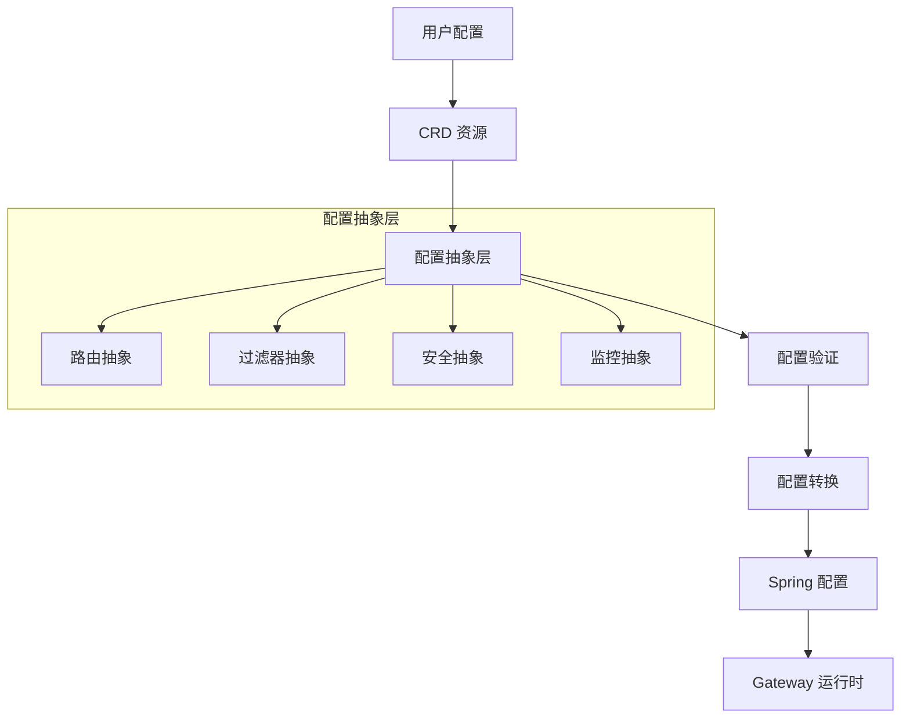

# TiGateway CRD 配置抽象设计

## 概述

TiGateway 采用基于 Kubernetes Custom Resource Definitions (CRD) 的配置抽象设计，提供声明式、云原生的配置管理方式。本文档详细说明了 TiGateway 的 CRD 配置抽象层设计，包括配置模型、抽象层次、转换机制和最佳实践。

## 设计理念

### 1. 云原生配置管理

- **声明式配置**: 使用 YAML 声明期望状态，系统自动收敛到目标状态
- **GitOps 友好**: 配置存储在 Git 中，支持版本控制和审计
- **Kubernetes 原生**: 完全基于 Kubernetes 资源模型，无缝集成
- **多环境支持**: 通过命名空间和环境标签实现多环境配置隔离

### 2. 配置抽象层次



## 核心配置抽象

### 1. 路由配置抽象

#### 1.1 路由定义抽象

```yaml
# 路由配置抽象模型
apiVersion: tigateway.cn/v1
kind: TiGatewayRouteConfig
metadata:
  name: api-routes
  namespace: tigateway
spec:
  # 路由组配置
  routeGroups:
    - name: user-service-group
      description: "用户服务路由组"
      labels:
        service: user
        version: v1
        environment: production
      
      # 路由定义
      routes:
        - id: user-read-route
          description: "用户读取操作路由"
          # 目标服务抽象
          target:
            service: user-service
            namespace: backend
            port: 8080
            version: v1
          
          # 匹配条件抽象
          match:
            path: "/api/users/**"
            methods: [GET, HEAD]
            headers:
              - name: X-API-Version
                value: v1
            query:
              - name: format
                values: [json, xml]
            time:
              start: "2024-01-01T00:00:00Z"
              end: "2024-12-31T23:59:59Z"
          
          # 流量控制抽象
          traffic:
            weight: 80
            priority: 100
            canary:
              enabled: false
              percentage: 0
          
          # 过滤器链抽象
          filters:
            - name: StripPrefix
              config:
                parts: 2
            - name: AddRequestHeader
              config:
                name: X-Service
                value: user-service
            - name: CircuitBreaker
              config:
                name: user-service-cb
                fallbackUri: forward:/fallback/user
                failureThreshold: 5
                timeout: 30s
            - name: RateLimiter
              config:
                type: redis
                requestsPerMinute: 100
                burstCapacity: 200
                keyResolver: user
          
          # 安全配置抽象
          security:
            authentication:
              required: true
              type: jwt
              header: Authorization
            authorization:
              required: true
              roles: [USER, ADMIN]
            cors:
              enabled: true
              allowedOrigins: ["https://example.com"]
              allowedMethods: [GET, POST, PUT, DELETE]
          
          # 监控配置抽象
          monitoring:
            metrics:
              enabled: true
              labels:
                - service
                - version
                - environment
            tracing:
              enabled: true
              sampleRate: 0.1
            logging:
              enabled: true
              level: INFO
```

#### 1.2 服务发现抽象

```yaml
# 服务发现配置抽象
apiVersion: tigateway.cn/v1
kind: TiGatewayServiceDiscovery
metadata:
  name: backend-services
  namespace: tigateway
spec:
  # 服务注册中心配置
  registries:
    - name: kubernetes
      type: kubernetes
      config:
        namespace: backend
        labelSelector: "app=backend"
        healthCheck:
          enabled: true
          path: /health
          interval: 10s
          timeout: 5s
    
    - name: consul
      type: consul
      config:
        host: consul-server
        port: 8500
        datacenter: dc1
        healthCheck:
          enabled: true
          path: /health
          interval: 10s
  
  # 服务映射配置
  serviceMappings:
    - name: user-service
      registries: [kubernetes, consul]
      loadBalancer:
        type: round_robin
        healthCheck:
          enabled: true
          path: /health
          interval: 10s
          timeout: 5s
          unhealthyThreshold: 3
      circuitBreaker:
        enabled: true
        failureThreshold: 5
        timeout: 30s
        halfOpenMaxCalls: 3
```

### 2. 过滤器配置抽象

#### 2.1 过滤器链抽象

```yaml
# 过滤器链配置抽象
apiVersion: tigateway.cn/v1
kind: TiGatewayFilterChain
metadata:
  name: global-filters
  namespace: tigateway
spec:
  # 全局过滤器链
  globalFilters:
    - name: RequestIdFilter
      order: -1000
      config:
        headerName: X-Request-ID
        generateType: uuid
        includeInResponse: true
    
    - name: AuthenticationFilter
      order: -900
      config:
        type: jwt
        secret: ${JWT_SECRET}
        header: Authorization
        skipPaths:
          - /health
          - /actuator/**
          - /public/**
    
    - name: AuthorizationFilter
      order: -800
      config:
        type: rbac
        roleHeader: X-User-Roles
        defaultRole: GUEST
        roleMappings:
          ADMIN: [admin, super-admin]
          USER: [user, premium-user]
          GUEST: [guest]
    
    - name: RateLimitFilter
      order: -700
      config:
        type: redis
        redis:
          host: redis-server
          port: 6379
          database: 0
        limits:
          - key: ip
            requestsPerMinute: 1000
            burstCapacity: 2000
          - key: user
            requestsPerMinute: 100
            burstCapacity: 200
          - key: global
            requestsPerMinute: 10000
            burstCapacity: 20000
    
    - name: LoggingFilter
      order: -600
      config:
        level: INFO
        includeHeaders: true
        includeBody: false
        maxBodySize: 1024
        sensitiveHeaders:
          - Authorization
          - X-API-Key
          - Cookie
    
    - name: MetricsFilter
      order: -500
      config:
        enabled: true
        labels:
          - service
          - method
          - status
          - user
        percentiles: [0.5, 0.95, 0.99]
        histogram: true
    
    - name: TracingFilter
      order: -400
      config:
        enabled: true
        sampleRate: 0.1
        includeHeaders:
          - X-Request-ID
          - X-User-ID
          - X-Tenant-ID
        excludePaths:
          - /health
          - /actuator/**
  
  # 路由特定过滤器链
  routeFilters:
    - routeSelector:
        labels:
          service: user
          version: v1
      filters:
        - name: UserContextFilter
          order: -100
          config:
            extractFromToken: true
            includeInRequest: true
            headers:
              - X-User-ID
              - X-User-Roles
              - X-Tenant-ID
        
        - name: DataTransformFilter
          order: 0
          config:
            requestTransform:
              enabled: true
              type: json
              rules:
                - path: $.user.id
                  transform: toUpperCase
            responseTransform:
              enabled: true
              type: json
              rules:
                - path: $.data
                  transform: addMetadata
```

#### 2.2 自定义过滤器抽象

```yaml
# 自定义过滤器配置抽象
apiVersion: tigateway.cn/v1
kind: TiGatewayCustomFilter
metadata:
  name: business-logic-filter
  namespace: tigateway
spec:
  # 过滤器定义
  filter:
    name: BusinessLogicFilter
    version: v1.0.0
    description: "业务逻辑过滤器"
    
    # 过滤器配置
    config:
      # 业务规则配置
      businessRules:
        - name: vip-user-check
          condition: "user.role == 'VIP'"
          action: "add-header"
          params:
            header: X-VIP-User
            value: "true"
        
        - name: rate-limit-by-tier
          condition: "user.tier == 'PREMIUM'"
          action: "rate-limit"
          params:
            requestsPerMinute: 200
            burstCapacity: 400
        
        - name: geo-restriction
          condition: "request.geo.country not in ['US', 'CA', 'GB']"
          action: "block"
          params:
            reason: "Geographic restriction"
            statusCode: 403
      
      # 数据源配置
      dataSources:
        - name: user-service
          type: http
          config:
            url: "http://user-service:8080"
            timeout: 5s
            retries: 3
        
        - name: redis-cache
          type: redis
          config:
            host: redis-server
            port: 6379
            database: 1
            ttl: 300s
      
      # 缓存配置
      cache:
        enabled: true
        ttl: 300s
        maxSize: 1000
        keyGenerator: "user.id + request.path"
  
  # 过滤器部署配置
  deployment:
    replicas: 3
    resources:
      requests:
        memory: "128Mi"
        cpu: "100m"
      limits:
        memory: "256Mi"
        cpu: "200m"
    
    # 健康检查配置
    healthCheck:
      enabled: true
      path: /health
      interval: 10s
      timeout: 5s
      failureThreshold: 3
```

### 3. 安全配置抽象

#### 3.1 认证配置抽象

```yaml
# 认证配置抽象
apiVersion: tigateway.cn/v1
kind: TiGatewayAuthentication
metadata:
  name: jwt-authentication
  namespace: tigateway
spec:
  # 认证提供者配置
  providers:
    - name: jwt-provider
      type: jwt
      config:
        secret: ${JWT_SECRET}
        algorithm: HS256
        issuer: tigateway
        audience: tigateway-clients
        expiration: 3600s
        refreshToken:
          enabled: true
          expiration: 7200s
        claims:
          - name: sub
            required: true
            type: string
          - name: roles
            required: true
            type: array
          - name: tenant
            required: false
            type: string
    
    - name: oauth2-provider
      type: oauth2
      config:
        issuer: ${OAUTH2_ISSUER}
        clientId: ${OAUTH2_CLIENT_ID}
        clientSecret: ${OAUTH2_CLIENT_SECRET}
        scopes: [openid, profile, email]
        redirectUri: "{baseUrl}/oauth2/callback"
        tokenEndpoint: ${OAUTH2_TOKEN_ENDPOINT}
        userInfoEndpoint: ${OAUTH2_USERINFO_ENDPOINT}
    
    - name: api-key-provider
      type: api-key
      config:
        header: X-API-Key
        queryParam: api_key
        validation:
          type: database
          table: api_keys
          columns:
            key: api_key
            user: user_id
            active: is_active
            expires: expires_at
  
  # 认证策略配置
  strategies:
    - name: jwt-strategy
      provider: jwt-provider
      order: 1
      conditions:
        - header: Authorization
          pattern: "Bearer .+"
    
    - name: api-key-strategy
      provider: api-key-provider
      order: 2
      conditions:
        - header: X-API-Key
          required: true
    
    - name: oauth2-strategy
      provider: oauth2-provider
      order: 3
      conditions:
        - path: /oauth2/**
  
  # 认证规则配置
  rules:
    - name: public-access
      paths:
        - /health
        - /actuator/**
        - /public/**
      authentication:
        required: false
    
    - name: api-access
      paths:
        - /api/**
      authentication:
        required: true
        strategies: [jwt-strategy, api-key-strategy]
    
    - name: admin-access
      paths:
        - /admin/**
      authentication:
        required: true
        strategies: [jwt-strategy]
        roles: [ADMIN, SUPER_ADMIN]
```

#### 3.2 授权配置抽象

```yaml
# 授权配置抽象
apiVersion: tigateway.cn/v1
kind: TiGatewayAuthorization
metadata:
  name: rbac-authorization
  namespace: tigateway
spec:
  # 角色定义
  roles:
    - name: GUEST
      description: "访客角色"
      permissions:
        - resource: public
          actions: [read]
    
    - name: USER
      description: "普通用户角色"
      permissions:
        - resource: user
          actions: [read, write]
        - resource: profile
          actions: [read, write]
    
    - name: PREMIUM_USER
      description: "高级用户角色"
      permissions:
        - resource: user
          actions: [read, write]
        - resource: profile
          actions: [read, write]
        - resource: premium
          actions: [read]
    
    - name: ADMIN
      description: "管理员角色"
      permissions:
        - resource: "*"
          actions: [read, write, delete]
    
    - name: SUPER_ADMIN
      description: "超级管理员角色"
      permissions:
        - resource: "*"
          actions: [read, write, delete, admin]
  
  # 权限定义
  permissions:
    - name: user:read
      description: "读取用户信息"
      resource: user
      action: read
      conditions:
        - expression: "user.id == resource.owner_id || user.roles.contains('ADMIN')"
    
    - name: user:write
      description: "修改用户信息"
      resource: user
      action: write
      conditions:
        - expression: "user.id == resource.owner_id || user.roles.contains('ADMIN')"
    
    - name: admin:access
      description: "访问管理功能"
      resource: admin
      action: access
      conditions:
        - expression: "user.roles.contains('ADMIN')"
  
  # 授权策略配置
  policies:
    - name: user-resource-policy
      description: "用户资源访问策略"
      rules:
        - subjects: [USER, PREMIUM_USER, ADMIN]
          resources: [user, profile]
          actions: [read, write]
          conditions:
            - expression: "user.id == resource.owner_id || user.roles.contains('ADMIN')"
    
    - name: admin-policy
      description: "管理员访问策略"
      rules:
        - subjects: [ADMIN, SUPER_ADMIN]
          resources: ["*"]
          actions: [read, write, delete, admin]
    
    - name: tenant-isolation-policy
      description: "租户隔离策略"
      rules:
        - subjects: [USER, PREMIUM_USER, ADMIN]
          resources: ["*"]
          actions: [read, write, delete]
          conditions:
            - expression: "user.tenant == resource.tenant"
  
  # 授权规则配置
  rules:
    - name: api-authorization
      paths:
        - /api/**
      authorization:
        required: true
        policy: user-resource-policy
    
    - name: admin-authorization
      paths:
        - /admin/**
      authorization:
        required: true
        policy: admin-policy
        roles: [ADMIN, SUPER_ADMIN]
    
    - name: tenant-authorization
      paths:
        - /tenant/**
      authorization:
        required: true
        policy: tenant-isolation-policy
```

### 4. 监控配置抽象

#### 4.1 指标配置抽象

```yaml
# 监控配置抽象
apiVersion: tigateway.cn/v1
kind: TiGatewayMonitoring
metadata:
  name: gateway-monitoring
  namespace: tigateway
spec:
  # 指标配置
  metrics:
    enabled: true
    exporters:
      - name: prometheus
        type: prometheus
        config:
          port: 9090
          path: /metrics
          interval: 30s
          labels:
            - service
            - version
            - environment
            - instance
    
    # 自定义指标配置
    customMetrics:
      - name: request_duration_seconds
        type: histogram
        description: "Request duration in seconds"
        labels:
          - method
          - path
          - status
          - service
        buckets: [0.1, 0.5, 1.0, 2.5, 5.0, 10.0]
      
      - name: active_connections
        type: gauge
        description: "Number of active connections"
        labels:
          - service
          - instance
      
      - name: error_rate
        type: counter
        description: "Error rate by service"
        labels:
          - service
          - error_type
          - status_code
  
  # 日志配置
  logging:
    enabled: true
    level: INFO
    format: json
    fields:
      - timestamp
      - level
      - message
      - service
      - request_id
      - user_id
      - tenant_id
      - method
      - path
      - status
      - duration
      - ip
      - user_agent
    
    # 日志输出配置
    outputs:
      - name: console
        type: console
        config:
          enabled: true
          level: INFO
      
      - name: file
        type: file
        config:
          enabled: true
          path: /app/logs/tigateway.log
          level: DEBUG
          maxSize: 100MB
          maxFiles: 10
          maxAge: 30d
      
      - name: elasticsearch
        type: elasticsearch
        config:
          enabled: true
          url: http://elasticsearch:9200
          index: tigateway-logs
          level: INFO
  
  # 追踪配置
  tracing:
    enabled: true
    provider: jaeger
    config:
      endpoint: http://jaeger:14268/api/traces
      sampleRate: 0.1
      serviceName: tigateway
      tags:
        - key: environment
          value: production
        - key: version
          value: v1.0.0
    
    # 追踪规则配置
    rules:
      - name: api-tracing
        paths:
          - /api/**
        sampleRate: 0.1
        includeHeaders:
          - X-Request-ID
          - X-User-ID
          - X-Tenant-ID
        excludeHeaders:
          - Authorization
          - Cookie
      
      - name: admin-tracing
        paths:
          - /admin/**
        sampleRate: 1.0
        includeHeaders:
          - X-Request-ID
          - X-User-ID
          - X-Admin-Action
  
  # 告警配置
  alerts:
    enabled: true
    rules:
      - name: high-error-rate
        condition: "error_rate > 0.05"
        duration: "5m"
        severity: warning
        labels:
          service: tigateway
          alert_type: error_rate
        annotations:
          summary: "High error rate detected"
          description: "Error rate is above 5% for 5 minutes"
      
      - name: high-latency
        condition: "request_duration_seconds_p95 > 2.0"
        duration: "3m"
        severity: critical
        labels:
          service: tigateway
          alert_type: latency
        annotations:
          summary: "High latency detected"
          description: "95th percentile latency is above 2 seconds"
      
      - name: service-down
        condition: "up == 0"
        duration: "1m"
        severity: critical
        labels:
          service: tigateway
          alert_type: availability
        annotations:
          summary: "Service is down"
          description: "Service has been down for 1 minute"
```

## 配置转换机制

### 1. CRD 到 Spring 配置转换

```java
@Component
public class CrdToSpringConfigTransformer {
    
    /**
     * 将 TiGatewayRouteConfig 转换为 Spring Cloud Gateway 配置
     */
    public GatewayProperties transformRouteConfig(TiGatewayRouteConfig crdConfig) {
        GatewayProperties gatewayProperties = new GatewayProperties();
        
        // 转换路由配置
        List<RouteDefinition> routes = crdConfig.getSpec().getRouteGroups().stream()
            .flatMap(group -> group.getRoutes().stream())
            .map(this::transformRoute)
            .collect(Collectors.toList());
        
        gatewayProperties.setRoutes(routes);
        
        // 转换全局过滤器配置
        List<FilterDefinition> globalFilters = crdConfig.getSpec().getGlobalFilters().stream()
            .map(this::transformFilter)
            .collect(Collectors.toList());
        
        gatewayProperties.setDefaultFilters(globalFilters);
        
        return gatewayProperties;
    }
    
    private RouteDefinition transformRoute(TiGatewayRoute route) {
        RouteDefinition routeDefinition = new RouteDefinition();
        routeDefinition.setId(route.getId());
        routeDefinition.setUri(URI.create(route.getTarget().getService()));
        
        // 转换谓词
        List<PredicateDefinition> predicates = route.getMatch().getPredicates().stream()
            .map(this::transformPredicate)
            .collect(Collectors.toList());
        routeDefinition.setPredicates(predicates);
        
        // 转换过滤器
        List<FilterDefinition> filters = route.getFilters().stream()
            .map(this::transformFilter)
            .collect(Collectors.toList());
        routeDefinition.setFilters(filters);
        
        // 转换元数据
        Map<String, Object> metadata = new HashMap<>();
        metadata.put("description", route.getDescription());
        metadata.put("labels", route.getLabels());
        routeDefinition.setMetadata(metadata);
        
        return routeDefinition;
    }
    
    private PredicateDefinition transformPredicate(TiGatewayPredicate predicate) {
        PredicateDefinition predicateDefinition = new PredicateDefinition();
        predicateDefinition.setName(predicate.getName());
        predicateDefinition.setArgs(predicate.getArgs());
        return predicateDefinition;
    }
    
    private FilterDefinition transformFilter(TiGatewayFilter filter) {
        FilterDefinition filterDefinition = new FilterDefinition();
        filterDefinition.setName(filter.getName());
        filterDefinition.setArgs(filter.getConfig());
        return filterDefinition;
    }
}
```

### 2. 配置验证机制

```java
@Component
public class CrdConfigValidator {
    
    /**
     * 验证 CRD 配置
     */
    public ValidationResult validate(TiGatewayRouteConfig config) {
        ValidationResult result = new ValidationResult();
        
        // 验证路由配置
        validateRoutes(config.getSpec().getRouteGroups(), result);
        
        // 验证过滤器配置
        validateFilters(config.getSpec().getGlobalFilters(), result);
        
        // 验证安全配置
        validateSecurity(config.getSpec().getSecurity(), result);
        
        return result;
    }
    
    private void validateRoutes(List<TiGatewayRouteGroup> routeGroups, ValidationResult result) {
        for (TiGatewayRouteGroup group : routeGroups) {
            for (TiGatewayRoute route : group.getRoutes()) {
                // 验证路由 ID 唯一性
                if (!isRouteIdUnique(route.getId())) {
                    result.addError("Route ID must be unique: " + route.getId());
                }
                
                // 验证目标服务
                if (!isValidService(route.getTarget())) {
                    result.addError("Invalid target service: " + route.getTarget().getService());
                }
                
                // 验证匹配条件
                validateMatchConditions(route.getMatch(), result);
                
                // 验证过滤器
                validateFilters(route.getFilters(), result);
            }
        }
    }
    
    private void validateFilters(List<TiGatewayFilter> filters, ValidationResult result) {
        for (TiGatewayFilter filter : filters) {
            // 验证过滤器名称
            if (!isValidFilterName(filter.getName())) {
                result.addError("Invalid filter name: " + filter.getName());
            }
            
            // 验证过滤器配置
            if (!isValidFilterConfig(filter.getName(), filter.getConfig())) {
                result.addError("Invalid filter config for: " + filter.getName());
            }
        }
    }
}
```

### 3. 配置热更新机制

```java
@Component
public class CrdConfigHotReloader {
    
    @Autowired
    private RouteLocator routeLocator;
    
    @Autowired
    private CrdToSpringConfigTransformer transformer;
    
    /**
     * 监听 CRD 配置变化并热更新
     */
    @EventListener
    public void onConfigChange(ConfigChangeEvent event) {
        try {
            // 验证新配置
            ValidationResult validation = configValidator.validate(event.getNewConfig());
            if (!validation.isValid()) {
                log.error("Configuration validation failed: {}", validation.getErrors());
                return;
            }
            
            // 转换配置
            GatewayProperties newProperties = transformer.transformRouteConfig(event.getNewConfig());
            
            // 应用新配置
            applyConfiguration(newProperties);
            
            // 刷新路由
            refreshRoutes();
            
            log.info("Configuration hot reloaded successfully");
            
        } catch (Exception e) {
            log.error("Failed to hot reload configuration", e);
            // 回滚到上一个有效配置
            rollbackConfiguration();
        }
    }
    
    private void applyConfiguration(GatewayProperties properties) {
        // 应用新的路由配置
        routeLocator.getRoutes().subscribe(route -> {
            // 更新路由配置
        });
    }
    
    private void refreshRoutes() {
        // 触发路由刷新
        applicationEventPublisher.publishEvent(new RefreshRoutesEvent(this));
    }
}
```

## 配置管理最佳实践

### 1. 配置分层管理

```yaml
# 基础配置层
apiVersion: tigateway.cn/v1
kind: TiGatewayBaseConfig
metadata:
  name: base-config
  namespace: tigateway
spec:
  # 基础配置
  base:
    server:
      port: 8080
    logging:
      level: INFO
    metrics:
      enabled: true

---
# 环境配置层
apiVersion: tigateway.cn/v1
kind: TiGatewayEnvironmentConfig
metadata:
  name: prod-config
  namespace: tigateway
spec:
  # 环境特定配置
  environment: production
  overrides:
    logging:
      level: WARN
    metrics:
      sampleRate: 0.1
    security:
      strictMode: true

---
# 应用配置层
apiVersion: tigateway.cn/v1
kind: TiGatewayRouteConfig
metadata:
  name: app-routes
  namespace: tigateway
spec:
  # 应用特定路由配置
  routes:
    - id: user-service
      target:
        service: user-service
      match:
        path: /api/users/**
```

### 2. 配置模板化

```yaml
# 配置模板
apiVersion: tigateway.cn/v1
kind: TiGatewayConfigTemplate
metadata:
  name: microservice-template
  namespace: tigateway
spec:
  # 模板定义
  template:
    routes:
      - id: "{{.serviceName}}-route"
        target:
          service: "{{.serviceName}}"
          namespace: "{{.namespace}}"
        match:
          path: "/api/{{.serviceName}}/**"
        filters:
          - name: StripPrefix
            config:
              parts: 2
          - name: AddRequestHeader
            config:
              name: X-Service
              value: "{{.serviceName}}"
  
  # 模板参数
  parameters:
    - name: serviceName
      required: true
      type: string
      description: "Service name"
    - name: namespace
      required: true
      type: string
      description: "Namespace"
    - name: version
      required: false
      type: string
      default: "v1"
      description: "Service version"

---
# 使用模板创建配置
apiVersion: tigateway.cn/v1
kind: TiGatewayRouteConfig
metadata:
  name: user-service-routes
  namespace: tigateway
spec:
  # 基于模板生成配置
  template: microservice-template
  parameters:
    serviceName: user-service
    namespace: backend
    version: v1
```

### 3. 配置版本管理

```yaml
# 配置版本管理
apiVersion: tigateway.cn/v1
kind: TiGatewayConfigVersion
metadata:
  name: config-v1.0.0
  namespace: tigateway
spec:
  # 版本信息
  version: v1.0.0
  description: "Initial configuration version"
  createdBy: admin
  createdAt: "2024-09-23T10:00:00Z"
  
  # 配置快照
  config:
    routes:
      - id: user-service-v1
        target:
          service: user-service
          version: v1
        match:
          path: /api/users/**
        filters:
          - name: StripPrefix
            config:
              parts: 2
  
  # 部署状态
  deployment:
    status: active
    replicas: 3
    lastDeployed: "2024-09-23T10:00:00Z"
    deployedBy: admin

---
# 配置回滚
apiVersion: tigateway.cn/v1
kind: TiGatewayConfigRollback
metadata:
  name: rollback-to-v1.0.0
  namespace: tigateway
spec:
  # 回滚目标版本
  targetVersion: v1.0.0
  
  # 回滚原因
  reason: "Performance issues with v1.1.0"
  
  # 回滚策略
  strategy: immediate
  
  # 回滚后验证
  validation:
    enabled: true
    timeout: 300s
    healthCheck:
      enabled: true
      path: /health
      interval: 10s
```

## 配置抽象的优势

### 1. 声明式配置管理

- **简化配置**: 通过抽象层隐藏复杂的 Spring 配置细节
- **类型安全**: 基于 CRD Schema 的强类型配置验证
- **版本控制**: 配置变更的完整版本历史和回滚能力

### 2. 云原生集成

- **Kubernetes 原生**: 完全基于 Kubernetes 资源模型
- **GitOps 支持**: 配置存储在 Git 中，支持自动化部署
- **多环境管理**: 通过命名空间和标签实现环境隔离

### 3. 运维友好

- **配置热更新**: 支持配置的动态更新和热重载
- **配置验证**: 完整的配置验证和错误提示
- **监控集成**: 内置的监控和告警配置

### 4. 开发效率

- **配置模板**: 可重用的配置模板和参数化配置
- **配置继承**: 支持配置的分层继承和覆盖
- **配置生成**: 基于模板的配置自动生成

---

**相关文档**:
- [CRD API 文档](../api/crd-api.md)
- [基础配置示例](../examples/basic-config.md)
- [高级配置示例](../examples/advanced-config.md)
- [Kubernetes 部署](../deployment/kubernetes.md)
