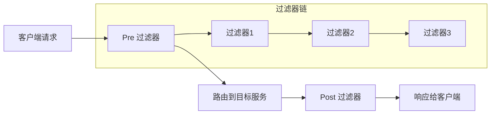
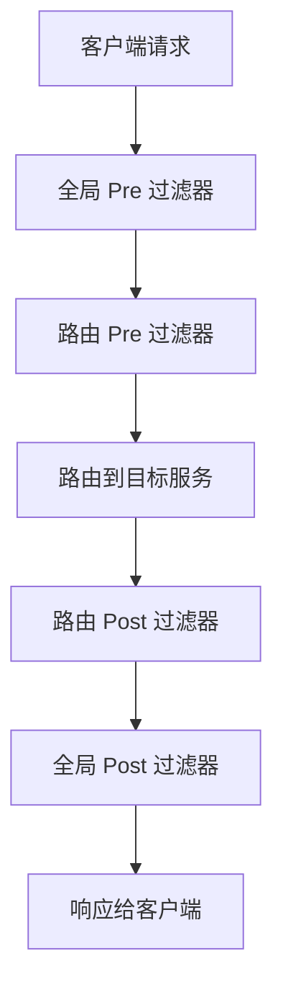

# TiGateway CRD 过滤器配置文档

## 概述

本文档详细说明了 TiGateway 中各种网关过滤器（Gateway Filter）的 CRD 配置方法。过滤器是 Spring Cloud Gateway 的核心组件，用于在请求转发前后修改请求和响应。每个过滤器都是 `GatewayFilter` 的实例，通过特定的工厂构建。

## 1. 过滤器基础概念

### 1.1 过滤器工作原理



### 1.2 过滤器类型

- **Pre 过滤器**: 在请求转发前执行
- **Post 过滤器**: 在响应返回前执行
- **全局过滤器**: 应用于所有路由
- **路由过滤器**: 应用于特定路由

## 2. 请求头过滤器

### 2.1 AddRequestHeader 过滤器

向下游请求添加请求头。

```yaml
apiVersion: tigateway.cn/v1
kind: TiGatewayRouteConfig
metadata:
  name: add-request-header-example
spec:
  routes:
    - id: add-header-route
      uri: https://example.org
      filters:
        - AddRequestHeader=X-Request-red, blue
```

**配置参数:**
- `name`: 请求头名称
- `value`: 请求头值

**支持路径变量:**
```yaml
predicates:
  - Path=/red/{segment}
filters:
  - AddRequestHeader=X-Request-Red, Blue-{segment}
```

**使用场景:**
- 添加服务标识
- 传递用户信息
- 添加追踪信息

### 2.2 AddRequestHeadersIfNotPresent 过滤器

仅当请求头不存在时添加请求头。

```yaml
apiVersion: tigateway.cn/v1
kind: TiGatewayRouteConfig
metadata:
  name: add-request-headers-if-not-present-example
spec:
  routes:
    - id: add-headers-if-not-present-route
      uri: https://example.org
      filters:
        - AddRequestHeadersIfNotPresent=X-Request-Color-1:blue,X-Request-Color-2:green
```

**配置参数:**
- `headers`: 冒号分隔的键值对集合

**多值请求头:**
```yaml
filters:
  - AddRequestHeadersIfNotPresent=X-Request-Color-1:blue,X-Request-Color-1:green
```

**使用场景:**
- 设置默认值
- 避免覆盖现有请求头
- 条件性添加请求头

### 2.3 SetRequestHeader 过滤器

设置或替换请求头。

```yaml
apiVersion: tigateway.cn/v1
kind: TiGatewayRouteConfig
metadata:
  name: set-request-header-example
spec:
  routes:
    - id: set-header-route
      uri: https://example.org
      filters:
        - SetRequestHeader=X-Request-Red, Blue
```

**配置参数:**
- `name`: 请求头名称
- `value`: 请求头值

**支持路径变量:**
```yaml
predicates:
  - Host: {segment}.myhost.org
filters:
  - SetRequestHeader=foo, bar-{segment}
```

**使用场景:**
- 强制设置请求头
- 标准化请求头格式
- 替换敏感信息

### 2.4 RemoveRequestHeader 过滤器

移除请求头。

```yaml
apiVersion: tigateway.cn/v1
kind: TiGatewayRouteConfig
metadata:
  name: remove-request-header-example
spec:
  routes:
    - id: remove-header-route
      uri: https://example.org
      filters:
        - RemoveRequestHeader=X-Request-Foo
```

**配置参数:**
- `name`: 要移除的请求头名称

**使用场景:**
- 移除敏感信息
- 清理不必要的请求头
- 安全防护

### 2.5 MapRequestHeader 过滤器

映射请求头到新的请求头。

```yaml
apiVersion: tigateway.cn/v1
kind: TiGatewayRouteConfig
metadata:
  name: map-request-header-example
spec:
  routes:
    - id: map-header-route
      uri: https://example.org
      filters:
        - MapRequestHeader=Blue, X-Request-Red
```

**配置参数:**
- `fromHeader`: 源请求头名称
- `toHeader`: 目标请求头名称

**使用场景:**
- 请求头重命名
- 标准化请求头名称
- 兼容性处理

## 3. 响应头过滤器

### 3.1 AddResponseHeader 过滤器

向响应添加响应头。

```yaml
apiVersion: tigateway.cn/v1
kind: TiGatewayRouteConfig
metadata:
  name: add-response-header-example
spec:
  routes:
    - id: add-response-header-route
      uri: https://example.org
      filters:
        - AddResponseHeader=X-Response-Time, ${responseTime}
```

**配置参数:**
- `name`: 响应头名称
- `value`: 响应头值

**使用场景:**
- 添加响应时间
- 添加服务信息
- 添加追踪信息

### 3.2 SetResponseHeader 过滤器

设置或替换响应头。

```yaml
apiVersion: tigateway.cn/v1
kind: TiGatewayRouteConfig
metadata:
  name: set-response-header-example
spec:
  routes:
    - id: set-response-header-route
      uri: https://example.org
      filters:
        - SetResponseHeader=X-Response-Red, Blue
```

**配置参数:**
- `name`: 响应头名称
- `value`: 响应头值

**使用场景:**
- 强制设置响应头
- 标准化响应头格式
- 安全响应头设置

### 3.3 RemoveResponseHeader 过滤器

移除响应头。

```yaml
apiVersion: tigateway.cn/v1
kind: TiGatewayRouteConfig
metadata:
  name: remove-response-header-example
spec:
  routes:
    - id: remove-response-header-route
      uri: https://example.org
      filters:
        - RemoveResponseHeader=X-Response-Foo
```

**配置参数:**
- `name`: 要移除的响应头名称

**使用场景:**
- 移除敏感信息
- 清理不必要的响应头
- 安全防护

### 3.4 RewriteResponseHeader 过滤器

重写响应头值。

```yaml
apiVersion: tigateway.cn/v1
kind: TiGatewayRouteConfig
metadata:
  name: rewrite-response-header-example
spec:
  routes:
    - id: rewrite-response-header-route
      uri: https://example.org
      filters:
        - RewriteResponseHeader=X-Response-Red, , password=[^&]+, password=***
```

**配置参数:**
- `name`: 响应头名称
- `regexp`: 正则表达式
- `replacement`: 替换值

**使用场景:**
- 隐藏敏感信息
- 格式化响应头值
- 数据脱敏

### 3.5 DedupeResponseHeader 过滤器

去重响应头。

```yaml
apiVersion: tigateway.cn/v1
kind: TiGatewayRouteConfig
metadata:
  name: dedupe-response-header-example
spec:
  routes:
    - id: dedupe-response-header-route
      uri: https://example.org
      filters:
        - DedupeResponseHeader=Access-Control-Allow-Credentials Access-Control-Allow-Origin
```

**配置参数:**
- `headers`: 要去重的响应头名称列表

**使用场景:**
- 解决 CORS 头重复问题
- 清理重复响应头
- 标准化响应头

## 4. 请求参数过滤器

### 4.1 AddRequestParameter 过滤器

向下游请求添加查询参数。

```yaml
apiVersion: tigateway.cn/v1
kind: TiGatewayRouteConfig
metadata:
  name: add-request-parameter-example
spec:
  routes:
    - id: add-parameter-route
      uri: https://example.org
      filters:
        - AddRequestParameter=red, blue
```

**配置参数:**
- `name`: 参数名称
- `value`: 参数值

**支持路径变量:**
```yaml
predicates:
  - Host: {segment}.myhost.org
filters:
  - AddRequestParameter=foo, bar-{segment}
```

**使用场景:**
- 添加默认参数
- 传递上下文信息
- 参数标准化

### 4.2 RemoveRequestParameter 过滤器

移除查询参数。

```yaml
apiVersion: tigateway.cn/v1
kind: TiGatewayRouteConfig
metadata:
  name: remove-request-parameter-example
spec:
  routes:
    - id: remove-parameter-route
      uri: https://example.org
      filters:
        - RemoveRequestParameter=red
```

**配置参数:**
- `name`: 要移除的参数名称

**使用场景:**
- 移除敏感参数
- 清理调试参数
- 安全防护

## 5. 路径处理过滤器

### 5.1 PrefixPath 过滤器

为请求路径添加前缀。

```yaml
apiVersion: tigateway.cn/v1
kind: TiGatewayRouteConfig
metadata:
  name: prefix-path-example
spec:
  routes:
    - id: prefix-path-route
      uri: https://example.org
      filters:
        - PrefixPath=/mypath
```

**配置参数:**
- `prefix`: 路径前缀

**使用场景:**
- API 版本前缀
- 服务路径前缀
- 路径标准化

### 5.2 StripPrefix 过滤器

从请求路径中移除指定数量的路径段。

```yaml
apiVersion: tigateway.cn/v1
kind: TiGatewayRouteConfig
metadata:
  name: strip-prefix-example
spec:
  routes:
    - id: strip-prefix-route
      uri: https://nameservice
      predicates:
        - Path=/name/**
      filters:
        - StripPrefix=2
```

**配置参数:**
- `parts`: 要移除的路径段数量

**示例:**
- 请求路径: `/name/blue/red`
- 移除 2 段后: `/red`

**使用场景:**
- 微服务路径映射
- API 网关路径转换
- 服务发现路径处理

### 5.3 SetPath 过滤器

设置请求路径。

```yaml
apiVersion: tigateway.cn/v1
kind: TiGatewayRouteConfig
metadata:
  name: set-path-example
spec:
  routes:
    - id: set-path-route
      uri: https://example.org
      predicates:
        - Path=/red/{segment}
      filters:
        - SetPath=/{segment}
```

**配置参数:**
- `template`: 路径模板

**使用场景:**
- 路径重写
- 路径标准化
- 动态路径生成

### 5.4 RewritePath 过滤器

使用正则表达式重写请求路径。

```yaml
apiVersion: tigateway.cn/v1
kind: TiGatewayRouteConfig
metadata:
  name: rewrite-path-example
spec:
  routes:
    - id: rewrite-path-route
      uri: https://example.org
      predicates:
        - Path=/red/**
      filters:
        - RewritePath=/red/?(?<segment>.*), /$\{segment}
```

**配置参数:**
- `regexp`: 正则表达式
- `replacement`: 替换表达式

**示例:**
- 请求路径: `/red/blue`
- 重写后: `/blue`

**使用场景:**
- 复杂路径重写
- 路径模式转换
- 向后兼容性

## 6. 请求体处理过滤器

### 6.1 CacheRequestBody 过滤器

缓存请求体。

```yaml
apiVersion: tigateway.cn/v1
kind: TiGatewayRouteConfig
metadata:
  name: cache-request-body-example
spec:
  routes:
    - id: cache-request-body-route
      uri: https://example.org
      filters:
        - CacheRequestBody=1024
```

**配置参数:**
- `size`: 缓存大小（字节）

**使用场景:**
- 请求体重复读取
- 请求体验证
- 请求体转换

### 6.2 ModifyRequestBody 过滤器

修改请求体（仅支持 Java DSL）。

```yaml
apiVersion: tigateway.cn/v1
kind: TiGatewayRouteConfig
metadata:
  name: modify-request-body-example
spec:
  routes:
    - id: modify-request-body-route
      uri: https://example.org
      filters:
        - ModifyRequestBody=String, Hello, application/json, (exchange, s) -> Mono.just(new Hello(s.toUpperCase()))
```

**配置参数:**
- `inClass`: 输入类型
- `outClass`: 输出类型
- `newContentType`: 新的内容类型
- `rewriteFunction`: 重写函数

**使用场景:**
- 请求体格式转换
- 请求体内容修改
- 数据验证和清理

### 6.3 ModifyResponseBody 过滤器

修改响应体（仅支持 Java DSL）。

```yaml
apiVersion: tigateway.cn/v1
kind: TiGatewayRouteConfig
metadata:
  name: modify-response-body-example
spec:
  routes:
    - id: modify-response-body-route
      uri: https://example.org
      filters:
        - ModifyResponseBody=String, String, (exchange, s) -> Mono.just(s.toUpperCase())
```

**配置参数:**
- `inClass`: 输入类型
- `outClass`: 输出类型
- `rewriteFunction`: 重写函数

**使用场景:**
- 响应体格式转换
- 响应体内容修改
- 数据脱敏

### 6.4 RemoveJsonAttributesResponseBody 过滤器

从 JSON 响应体中移除属性。

```yaml
apiVersion: tigateway.cn/v1
kind: TiGatewayRouteConfig
metadata:
  name: remove-json-attributes-example
spec:
  routes:
    - id: remove-json-attributes-route
      uri: https://example.org
      filters:
        - RemoveJsonAttributesResponseBody=id,color
        - RemoveJsonAttributesResponseBody=id,color,true  # 递归删除
```

**配置参数:**
- `attributes`: 要移除的属性名称列表
- `recursive`: 是否递归删除（可选，默认 false）

**使用场景:**
- 数据脱敏
- 响应体简化
- 隐私保护

## 7. 状态和重定向过滤器

### 7.1 SetStatus 过滤器

设置响应状态码。

```yaml
apiVersion: tigateway.cn/v1
kind: TiGatewayRouteConfig
metadata:
  name: set-status-example
spec:
  routes:
    - id: set-status-route
      uri: https://example.org
      filters:
        - SetStatus=UNAUTHORIZED
        - SetStatus=401
```

**配置参数:**
- `status`: HTTP 状态码（数字或枚举）

**原始状态码保留:**
```yaml
apiVersion: tigateway.cn/v1
kind: TiGatewayRouteConfig
metadata:
  name: preserve-original-status
spec:
  setStatus:
    originalStatusHeaderName: original-http-status
  routes:
    - id: preserve-status-route
      uri: https://example.org
      filters:
        - SetStatus=UNAUTHORIZED
```

**使用场景:**
- 错误处理
- 状态码标准化
- 维护模式

### 7.2 RedirectTo 过滤器

重定向到指定 URL。

```yaml
apiVersion: tigateway.cn/v1
kind: TiGatewayRouteConfig
metadata:
  name: redirect-example
spec:
  routes:
    - id: redirect-route
      uri: no://op
      filters:
        - RedirectTo=302, https://acme.org
```

**配置参数:**
- `status`: 重定向状态码（3xx）
- `url`: 重定向目标 URL

**使用场景:**
- URL 重定向
- 服务迁移
- 临时重定向

## 8. 安全过滤器

### 8.1 SecureHeaders 过滤器

添加安全相关的响应头。

```yaml
apiVersion: tigateway.cn/v1
kind: TiGatewayRouteConfig
metadata:
  name: secure-headers-example
spec:
  routes:
    - id: secure-headers-route
      uri: https://example.org
      filters:
        - SecureHeaders
```

**默认添加的安全头:**
- `X-Xss-Protection: 1 (mode=block)`
- `Strict-Transport-Security: max-age=631138519`
- `X-Frame-Options: DENY`
- `X-Content-Type-Options: nosniff`
- `Referrer-Policy: no-referrer`
- `Content-Security-Policy: default-src 'self' https:; font-src 'self' https: data:; img-src 'self' https: data:; object-src 'none'; script-src https:; style-src 'self' https: 'unsafe-inline'`
- `X-Download-Options: noopen`
- `X-Permitted-Cross-Domain-Policies: none`

**自定义安全头:**
```yaml
apiVersion: tigateway.cn/v1
kind: TiGatewayRouteConfig
metadata:
  name: custom-secure-headers
spec:
  secureHeaders:
    xssProtectionHeader: "1; mode=block"
    strictTransportSecurity: "max-age=31536000; includeSubDomains"
    frameOptions: "SAMEORIGIN"
    contentTypeOptions: "nosniff"
    referrerPolicy: "strict-origin-when-cross-origin"
    contentSecurityPolicy: "default-src 'self'"
    downloadOptions: "noopen"
    permittedCrossDomainPolicies: "none"
  routes:
    - id: custom-secure-route
      uri: https://example.org
      filters:
        - SecureHeaders
```

**禁用特定安全头:**
```yaml
apiVersion: tigateway.cn/v1
kind: TiGatewayRouteConfig
metadata:
  name: disable-secure-headers
spec:
  secureHeaders:
    disable: "x-frame-options,strict-transport-security"
  routes:
    - id: disable-secure-route
      uri: https://example.org
      filters:
        - SecureHeaders
```

**使用场景:**
- 安全防护
- 合规要求
- 安全头标准化

### 8.2 RequestHeaderSize 过滤器

限制请求头大小。

```yaml
apiVersion: tigateway.cn/v1
kind: TiGatewayRouteConfig
metadata:
  name: request-header-size-example
spec:
  routes:
    - id: request-header-size-route
      uri: https://example.org
      filters:
        - RequestHeaderSize=1000B
```

**配置参数:**
- `maxSize`: 最大请求头大小
- `errorHeaderName`: 错误信息响应头名称（默认 "errorMessage"）

**使用场景:**
- 防止请求头过大攻击
- 资源保护
- 安全防护

### 8.3 RequestSize 过滤器

限制请求体大小。

```yaml
apiVersion: tigateway.cn/v1
kind: TiGatewayRouteConfig
metadata:
  name: request-size-example
spec:
  routes:
    - id: request-size-route
      uri: https://example.org
      filters:
        - RequestSize=5MB
```

**配置参数:**
- `maxSize`: 最大请求体大小

**使用场景:**
- 防止大文件上传攻击
- 资源保护
- 性能优化

## 9. 限流和熔断过滤器

### 9.1 RequestRateLimiter 过滤器

请求限流。

```yaml
apiVersion: tigateway.cn/v1
kind: TiGatewayRouteConfig
metadata:
  name: request-rate-limiter-example
spec:
  routes:
    - id: rate-limiter-route
      uri: https://example.org
      filters:
        - RequestRateLimiter=#{@redisRateLimiter}
```

**Redis 限流器配置:**
```yaml
apiVersion: tigateway.cn/v1
kind: TiGatewayRouteConfig
metadata:
  name: redis-rate-limiter-example
spec:
  routes:
    - id: redis-rate-limiter-route
      uri: https://example.org
      filters:
        - name: RequestRateLimiter
          args:
            redis-rate-limiter.replenishRate: 10
            redis-rate-limiter.burstCapacity: 20
            redis-rate-limiter.requestedTokens: 1
            key-resolver: "#{@userKeyResolver}"
```

**配置参数:**
- `replenishRate`: 每秒允许的请求数
- `burstCapacity`: 突发容量
- `requestedTokens`: 每个请求消耗的令牌数
- `key-resolver`: 键解析器 Bean 名称

**自定义键解析器:**
```java
@Bean
KeyResolver userKeyResolver() {
    return exchange -> Mono.just(exchange.getRequest().getQueryParams().getFirst("user"));
}
```

**使用场景:**
- API 限流
- 防止滥用
- 资源保护

### 9.2 CircuitBreaker 过滤器

熔断器。

```yaml
apiVersion: tigateway.cn/v1
kind: TiGatewayRouteConfig
metadata:
  name: circuit-breaker-example
spec:
  routes:
    - id: circuit-breaker-route
      uri: https://example.org
      filters:
        - CircuitBreaker=myCircuitBreaker
```

**熔断器配置:**
```yaml
apiVersion: tigateway.cn/v1
kind: TiGatewayRouteConfig
metadata:
  name: circuit-breaker-config
spec:
  circuitBreaker:
    myCircuitBreaker:
      failureRateThreshold: 50
      waitDurationInOpenState: 30s
      slidingWindowSize: 10
      minimumNumberOfCalls: 5
      permittedNumberOfCallsInHalfOpenState: 3
      automaticTransitionFromOpenToHalfOpenEnabled: true
      slowCallRateThreshold: 50
      slowCallDurationThreshold: 2s
  routes:
    - id: circuit-breaker-route
      uri: https://example.org
      filters:
        - CircuitBreaker=myCircuitBreaker
```

**使用场景:**
- 服务保护
- 故障隔离
- 提高可用性

## 10. 缓存过滤器

### 10.1 LocalResponseCache 过滤器

本地响应缓存。

```yaml
apiVersion: tigateway.cn/v1
kind: TiGatewayRouteConfig
metadata:
  name: local-response-cache-example
spec:
  routes:
    - id: local-cache-route
      uri: https://example.org
      filters:
        - LocalResponseCache=30m,500MB
```

**配置参数:**
- `timeToLive`: 缓存生存时间
- `maxSize`: 最大缓存大小

**缓存规则:**
- 只缓存无请求体的 GET 请求
- 只缓存状态码为 200、206、301 的响应
- 遵循 Cache-Control 头指令

**使用场景:**
- 静态资源缓存
- API 响应缓存
- 性能优化

## 11. 会话过滤器

### 11.1 SaveSession 过滤器

保存会话。

```yaml
apiVersion: tigateway.cn/v1
kind: TiGatewayRouteConfig
metadata:
  name: save-session-example
spec:
  routes:
    - id: save-session-route
      uri: https://example.org
      predicates:
        - Path=/foo/**
      filters:
        - SaveSession
```

**使用场景:**
- Spring Session 集成
- 会话状态保存
- 安全上下文传递

## 12. 重试过滤器

### 12.1 Retry 过滤器

请求重试。

```yaml
apiVersion: tigateway.cn/v1
kind: TiGatewayRouteConfig
metadata:
  name: retry-example
spec:
  routes:
    - id: retry-route
      uri: https://example.org
      filters:
        - Retry=3
```

**重试配置:**
```yaml
apiVersion: tigateway.cn/v1
kind: TiGatewayRouteConfig
metadata:
  name: retry-config
spec:
  routes:
    - id: retry-route
      uri: https://example.org
      filters:
        - name: Retry
          args:
            retries: 3
            statuses: BAD_GATEWAY,INTERNAL_SERVER_ERROR
            methods: GET,POST
            backoff:
              firstBackoff: 50ms
              maxBackoff: 500ms
              factor: 2
              basedOnPreviousValue: false
```

**配置参数:**
- `retries`: 重试次数
- `statuses`: 需要重试的状态码
- `methods`: 需要重试的 HTTP 方法
- `backoff`: 退避策略

**使用场景:**
- 临时故障处理
- 提高可用性
- 网络抖动处理

## 13. 主机头过滤器

### 13.1 PreserveHostHeader 过滤器

保留原始 Host 头。

```yaml
apiVersion: tigateway.cn/v1
kind: TiGatewayRouteConfig
metadata:
  name: preserve-host-header-example
spec:
  routes:
    - id: preserve-host-route
      uri: https://example.org
      filters:
        - PreserveHostHeader
```

**使用场景:**
- 虚拟主机支持
- 多租户应用
- 域名路由

### 13.2 SetRequestHostHeader 过滤器

设置请求 Host 头。

```yaml
apiVersion: tigateway.cn/v1
kind: TiGatewayRouteConfig
metadata:
  name: set-request-host-header-example
spec:
  routes:
    - id: set-host-route
      uri: https://example.org
      filters:
        - SetRequestHostHeader=api.example.com
```

**使用场景:**
- 主机头标准化
- 服务发现
- 负载均衡

## 14. 令牌中继过滤器

### 14.1 TokenRelay 过滤器

OAuth2 令牌中继。

```yaml
apiVersion: tigateway.cn/v1
kind: TiGatewayRouteConfig
metadata:
  name: token-relay-example
spec:
  routes:
    - id: token-relay-route
      uri: https://example.org
      filters:
        - TokenRelay
```

**使用场景:**
- OAuth2 集成
- 令牌传递
- 身份验证

## 15. 协议转换过滤器

### 15.1 JsonToGrpc 过滤器

JSON 到 gRPC 转换。

```yaml
apiVersion: tigateway.cn/v1
kind: TiGatewayRouteConfig
metadata:
  name: json-to-grpc-example
spec:
  routes:
    - id: json-to-grpc-route
      uri: https://example.org
      filters:
        - JsonToGrpc=proto://user.proto
```

**使用场景:**
- 协议转换
- gRPC 服务集成
- 微服务通信

## 16. 降级过滤器

### 16.1 FallbackHeaders 过滤器

降级响应头。

```yaml
apiVersion: tigateway.cn/v1
kind: TiGatewayRouteConfig
metadata:
  name: fallback-headers-example
spec:
  routes:
    - id: fallback-headers-route
      uri: https://example.org
      filters:
        - FallbackHeaders=fallback
```

**使用场景:**
- 熔断降级
- 故障处理
- 服务降级

## 17. 位置重写过滤器

### 17.1 RewriteLocationResponseHeader 过滤器

重写 Location 响应头。

```yaml
apiVersion: tigateway.cn/v1
kind: TiGatewayRouteConfig
metadata:
  name: rewrite-location-example
spec:
  routes:
    - id: rewrite-location-route
      uri: http://example.org
      filters:
        - RewriteLocationResponseHeader=AS_IN_REQUEST, Location, ,
```

**配置参数:**
- `stripVersionMode`: 版本剥离模式（NEVER_STRIP, AS_IN_REQUEST, ALWAYS_STRIP）
- `locationHeaderName`: Location 头名称
- `hostValue`: 主机值
- `protocolsRegex`: 协议正则表达式

**使用场景:**
- 重定向处理
- 位置头标准化
- 代理环境适配

## 18. 全局过滤器配置

### 18.1 全局过滤器定义

```yaml
apiVersion: tigateway.cn/v1
kind: TiGatewayGlobalFilter
metadata:
  name: global-filters
  namespace: tigateway
spec:
  filters:
    - name: CustomGlobalFilter
      order: -1
      config:
        headerName: X-Global-Filter
        headerValue: "Global Value"
    - name: MetricsFilter
      order: 0
      config:
        enabled: true
    - name: LocalResponseCacheFilter
      order: 1
      config:
        enabled: true
        maxSize: 100MB
```

### 18.2 默认过滤器配置

```yaml
apiVersion: tigateway.cn/v1
kind: TiGatewayRouteConfig
metadata:
  name: default-filters
spec:
  defaultFilters:
    - AddRequestHeader=X-Gateway, TiGateway
    - AddResponseHeader=X-Response-Time, ${responseTime}
    - SecureHeaders
    - RequestRateLimiter=#{@defaultRateLimiter}
```

## 19. 过滤器组合和顺序

### 19.1 过滤器执行顺序



### 19.2 过滤器顺序配置

```yaml
apiVersion: tigateway.cn/v1
kind: TiGatewayRouteConfig
metadata:
  name: ordered-filters
spec:
  routes:
    - id: ordered-route
      uri: https://example.org
      filters:
        - AddRequestHeader=X-First, first
        - AddRequestHeader=X-Second, second
        - AddRequestHeader=X-Third, third
      order: 0
```

## 20. 过滤器最佳实践

### 20.1 过滤器设计原则

1. **单一职责**: 每个过滤器应该只负责一个功能
2. **性能考虑**: 避免在过滤器中执行耗时操作
3. **错误处理**: 提供适当的错误处理和降级策略
4. **可配置性**: 使过滤器参数可配置
5. **可测试性**: 设计易于测试的过滤器

### 20.2 过滤器使用建议

1. **顺序优化**: 将最可能失败的过滤器放在前面
2. **缓存利用**: 合理使用缓存过滤器提高性能
3. **安全防护**: 使用安全过滤器保护系统
4. **监控告警**: 为关键过滤器配置监控和告警
5. **文档维护**: 保持过滤器配置文档的更新

### 20.3 常见问题解决

#### 20.3.1 过滤器不生效

```yaml
# 检查过滤器顺序和配置
apiVersion: tigateway.cn/v1
kind: TiGatewayRouteConfig
metadata:
  name: debug-filters
spec:
  routes:
    - id: debug-route
      uri: https://example.org
      filters:
        - AddRequestHeader=X-Debug, enabled  # 确保过滤器名称正确
        - AddResponseHeader=X-Debug-Response, enabled
      metadata:
        debug: true  # 启用调试模式
```

#### 20.3.2 过滤器性能问题

```yaml
# 优化过滤器性能
apiVersion: tigateway.cn/v1
kind: TiGatewayRouteConfig
metadata:
  name: optimized-filters
spec:
  routes:
    - id: optimized-route
      uri: https://example.org
      filters:
        - LocalResponseCache=5m,100MB  # 使用缓存
        - RequestRateLimiter=#{@optimizedRateLimiter}  # 限流保护
      metadata:
        performance:
          cacheEnabled: true
          rateLimitEnabled: true
```

## 21. 完整配置示例

### 21.1 API网关过滤器配置

```yaml
apiVersion: tigateway.cn/v1
kind: TiGatewayRouteConfig
metadata:
  name: complete-api-gateway
spec:
  # 全局配置
  globalCors:
    corsConfigurations:
      "[/**]":
        allowedOrigins: "*"
        allowedMethods: ["GET", "POST", "PUT", "DELETE"]
        allowedHeaders: "*"
        allowCredentials: true
        maxAge: 3600
  
  secureHeaders:
    xssProtectionHeader: "1; mode=block"
    strictTransportSecurity: "max-age=31536000; includeSubDomains"
    frameOptions: "SAMEORIGIN"
    contentTypeOptions: "nosniff"
    referrerPolicy: "strict-origin-when-cross-origin"
    contentSecurityPolicy: "default-src 'self'"
  
  # 默认过滤器
  defaultFilters:
    - AddRequestHeader=X-Gateway, TiGateway
    - AddRequestHeader=X-Request-Time, ${timestamp}
    - AddResponseHeader=X-Response-Time, ${responseTime}
    - AddResponseHeader=X-Gateway-Version, 1.0.0
    - SecureHeaders
    - RequestRateLimiter=#{@defaultRateLimiter}
  
  # 路由配置
  routes:
    # 用户服务路由
    - id: user-service-route
      uri: lb://user-service
      predicates:
        - Path=/api/users/**
        - Method=GET,POST,PUT,DELETE
      filters:
        - StripPrefix=2
        - AddRequestHeader=X-Service, user-service
        - AddRequestHeader=X-User-Context, ${userContext}
        - CircuitBreaker=userServiceBreaker
        - Retry=2
        - LocalResponseCache=5m,50MB
        - RemoveJsonAttributesResponseBody=password,secret,true
      order: 1
      metadata:
        description: "用户服务路由"
        tags: ["user", "api", "v1"]
        monitoring:
          enabled: true
          metrics: ["request_count", "response_time", "error_rate"]
    
    # 订单服务路由
    - id: order-service-route
      uri: lb://order-service
      predicates:
        - Path=/api/orders/**
        - Method=GET,POST,PUT
        - Header=Authorization, Bearer .*
      filters:
        - StripPrefix=2
        - AddRequestHeader=X-Service, order-service
        - AddRequestHeader=X-User-ID, ${userId}
        - CircuitBreaker=orderServiceBreaker
        - RequestRateLimiter=#{@orderRateLimiter}
        - CacheRequestBody=1024
        - ModifyResponseBody=String, String, (exchange, s) -> s.replaceAll("\\\"price\\\":\\d+", "\\\"price\\\":***")
      order: 2
      metadata:
        description: "订单服务路由"
        tags: ["order", "api", "v1"]
        security:
          level: high
          audit: true
    
    # 管理接口路由
    - id: admin-route
      uri: lb://admin-service
      predicates:
        - Path=/admin/**
        - RemoteAddr=192.168.0.0/16,10.0.0.0/8
        - Header=X-Admin-Token, .*
      filters:
        - StripPrefix=1
        - AddRequestHeader=X-Service, admin-service
        - AddRequestHeader=X-Admin-Access, true
        - RequestHeaderSize=8KB
        - RequestSize=5MB
        - SecureHeaders
      order: 3
      metadata:
        description: "管理接口路由"
        tags: ["admin", "management"]
        security:
          level: critical
          audit: true
          accessLog: true
```

---

**相关文档**:
- [CRD 资源配置文档](./crd-resource-configuration.md)
- [CRD 谓词配置文档](./crd-predicate-configuration.md)
- [CRD 配置抽象设计](./crd-configuration-design.md)
- [过滤器工厂开发指南](../development/filter-factories.md)
- [Spring Cloud Gateway 集成指南](../development/spring-cloud-gateway-integration.md)