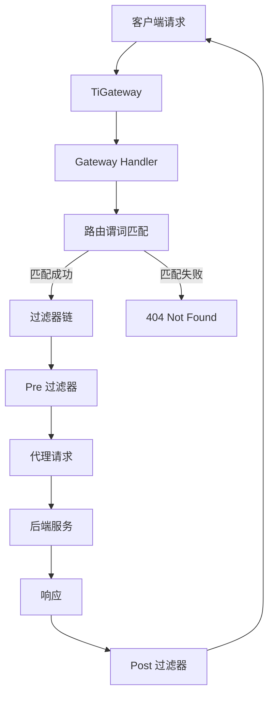

# TiGateway Spring Cloud Gateway 集成指南

## 概述

TiGateway 基于 Spring Cloud Gateway 构建，提供了完整的 Spring Cloud Gateway 功能集成。本文档详细说明了如何在 TiGateway 中使用和扩展 Spring Cloud Gateway 的功能。

## 快速开始

### 添加 Spring Cloud Gateway 依赖

要在 TiGateway 项目中添加 Spring Cloud Gateway，请使用以下依赖：

```xml
<dependency>
    <groupId>org.springframework.cloud</groupId>
    <artifactId>spring-cloud-starter-gateway</artifactId>
</dependency>
```

### 启用/禁用网关

如果你添加了 starter，但不想启用网关，请设置：

```yaml
spring:
  cloud:
    gateway:
      enabled: false
```

## 技术栈要求

TiGateway 基于以下技术栈构建：

- **Spring Boot 2.x**: 提供基础框架支持
- **Spring WebFlux**: 提供响应式 Web 支持
- **Project Reactor**: 提供响应式编程模型

> **注意**: TiGateway 需要 Spring Boot 和 Spring WebFlux 提供的 Netty 运行时。它不能在传统的 Servlet 容器中工作，也不能以 WAR 的形式构建。

## 核心概念

### 1. Route（路由）

路由是 TiGateway 的基本构建块。它由以下部分组成：

- **ID**: 路由的唯一标识符
- **URI**: 目标服务地址
- **Predicates**: 路由匹配条件集合
- **Filters**: 请求/响应处理过滤器集合

```yaml
spring:
  cloud:
    gateway:
      routes:
        - id: user-service-route
          uri: lb://user-service
          predicates:
            - Path=/api/users/**
          filters:
            - StripPrefix=2
```

### 2. Predicate（谓词）

谓词是 Java 8 Function Predicate，输入类型是 `ServerWebExchange`。它允许你匹配 HTTP 请求中的任何内容，如 header 或查询参数。

```yaml
predicates:
  - Path=/api/users/**
  - Method=GET,POST
  - Header=X-API-Version, v1
```

### 3. Filter（过滤器）

过滤器是 `GatewayFilter` 的实例，用于在发送下游请求之前或之后修改请求和响应。

```yaml
filters:
  - AddRequestHeader=X-Gateway, TiGateway
  - StripPrefix=2
  - CircuitBreaker=user-service-cb
```

## 工作原理

下图展示了 TiGateway 的工作流程：



## 配置方式

### 1. 快捷方式配置

快捷方式配置由过滤器名称，后面跟一个等号 (=)，然后是用逗号 (,) 分隔的参数值。

```yaml
spring:
  cloud:
    gateway:
      routes:
        - id: cookie_route
          uri: https://example.org
          predicates:
            - Cookie=mycookie,mycookievalue
```

### 2. 完全展开的参数

完全展开的参数看起来更像标准的 YAML 配置，有名称/值对。

```yaml
spring:
  cloud:
    gateway:
      routes:
        - id: cookie_route
          uri: https://example.org
          predicates:
            - name: Cookie
              args:
                name: mycookie
                regexp: mycookievalue
```

## 路由谓词工厂

TiGateway 支持所有 Spring Cloud Gateway 的内置路由谓词工厂：

### 1. Path 谓词

匹配请求路径：

```yaml
predicates:
  - Path=/api/users/**,/api/orders/**
```

### 2. Method 谓词

匹配 HTTP 方法：

```yaml
predicates:
  - Method=GET,POST,PUT,DELETE
```

### 3. Header 谓词

匹配请求头：

```yaml
predicates:
  - Header=X-Request-Id, \d+
```

### 4. Host 谓词

匹配主机名：

```yaml
predicates:
  - Host=**.example.org,**.api.example.org
```

### 5. Query 谓词

匹配查询参数：

```yaml
predicates:
  - Query=green
  - Query=red, gree.
```

### 6. Cookie 谓词

匹配 Cookie：

```yaml
predicates:
  - Cookie=chocolate, ch.p
```

### 7. After/Before/Between 谓词

时间相关的匹配：

```yaml
predicates:
  - After=2024-01-20T17:42:47.789-07:00[America/Denver]
  - Before=2024-12-31T23:59:59+08:00
  - Between=2024-01-01T00:00:00+08:00, 2024-12-31T23:59:59+08:00
```

### 8. RemoteAddr 谓词

匹配远程地址：

```yaml
predicates:
  - RemoteAddr=192.168.1.1/24
```

### 9. Weight 谓词

权重路由：

```yaml
predicates:
  - Weight=group1, 80
```

## 过滤器工厂

TiGateway 支持所有 Spring Cloud Gateway 的内置过滤器工厂：

### 1. 请求头过滤器

```yaml
filters:
  - AddRequestHeader=X-Request-Red, Blue
  - AddRequestHeadersIfNotPresent=X-Request-Color-1:blue,X-Request-Color-2:green
  - RemoveRequestHeader=X-Request-Foo
  - SetRequestHeader=X-Request-Red, Blue
```

### 2. 响应头过滤器

```yaml
filters:
  - AddResponseHeader=X-Response-Red, Blue
  - RemoveResponseHeader=X-Response-Foo
  - SetResponseHeader=X-Response-Red, Blue
```

### 3. 路径过滤器

```yaml
filters:
  - StripPrefix=2
  - PrefixPath=/mypath
  - RewritePath=/red/?(?<segment>.*), /$\{segment}
  - SetPath=/{segment}
```

### 4. 请求参数过滤器

```yaml
filters:
  - AddRequestParameter=red, blue
  - RemoveRequestParameter=red
```

### 5. 状态码过滤器

```yaml
filters:
  - SetStatus=UNAUTHORIZED
  - SetStatus=401
```

### 6. 重定向过滤器

```yaml
filters:
  - RedirectTo=302, https://example.org
```

### 7. 熔断器过滤器

```yaml
filters:
  - name: CircuitBreaker
    args:
      name: user-service-cb
      fallbackUri: forward:/fallback
```

### 8. 限流过滤器

```yaml
filters:
  - name: RequestRateLimiter
    args:
      redis-rate-limiter.replenishRate: 10
      redis-rate-limiter.burstCapacity: 20
      key-resolver: "#{@userKeyResolver}"
```

## 全局过滤器

TiGateway 支持全局过滤器，应用于所有路由：

### 1. 自定义全局过滤器

```java
@Bean
public GlobalFilter customGlobalFilter() {
    return (exchange, chain) -> exchange.getPrincipal()
        .map(Principal::getName)
        .defaultIfEmpty("Default User")
        .map(userName -> {
            // 添加请求头
            exchange.getRequest().mutate().header("CUSTOM-REQUEST-HEADER", userName).build();
            return exchange;
        })
        .flatMap(chain::filter);
}
```

### 2. 内置全局过滤器

TiGateway 包含以下内置全局过滤器：

- **ReactiveLoadBalancerClientFilter**: 负载均衡
- **RouteToRequestUrlFilter**: 路由到请求 URL
- **NettyRoutingFilter**: Netty 路由
- **NettyWriteResponseFilter**: Netty 写入响应
- **ForwardRoutingFilter**: 转发路由
- **ForwardPathFilter**: 转发路径
- **WebsocketRoutingFilter**: WebSocket 路由

## 服务发现集成

TiGateway 支持基于服务注册中心的路由创建：

```yaml
spring:
  cloud:
    gateway:
      discovery:
        locator:
          enabled: true
          predicates:
            - name: Path
              args:
                pattern: "'/'+serviceId+'/**'"
          filters:
            - name: RewritePath
              args:
                regexp: "'/' + serviceId + '/?(?<remaining>.*)'"
                replacement: "'/${remaining}'"
```

## 配置管理

### 1. 外部配置源

TiGateway 支持从外部来源加载配置：

```java
public interface RouteDefinitionLocator {
    Flux<RouteDefinition> getRouteDefinitions();
}
```

### 2. 动态配置

支持基于数据库、Redis、MongoDB 等外部存储的动态配置。

## 监控和指标

### 1. Actuator 端点

TiGateway 提供以下监控端点：

- `/actuator/gateway/routes`: 查看所有路由
- `/actuator/gateway/routes/{id}`: 查看特定路由
- `/actuator/gateway/globalfilters`: 查看全局过滤器
- `/actuator/gateway/routefilters`: 查看路由过滤器
- `/actuator/gateway/refresh`: 刷新路由缓存

### 2. 指标监控

```yaml
spring:
  cloud:
    gateway:
      metrics:
        enabled: true
```

## 安全配置

### 1. CORS 配置

```yaml
spring:
  cloud:
    gateway:
      globalcors:
        cors-configurations:
          '[/**]':
            allowedOrigins: "https://example.org"
            allowedMethods:
              - GET
              - POST
```

### 2. 安全头

```yaml
filters:
  - SecureHeaders
```

## 性能优化

### 1. HTTP 超时配置

```yaml
spring:
  cloud:
    gateway:
      httpclient:
        connect-timeout: 1000
        response-timeout: 5s
```

### 2. 连接池配置

```yaml
spring:
  cloud:
    gateway:
      httpclient:
        pool:
          type: elastic
          max-connections: 1000
          max-idle-time: 30s
          max-life-time: 60s
```

## 故障排除

### 1. 日志级别

在 DEBUG 和 TRACE 级别，以下 logger 可能包含有价值的故障排除信息：

- `org.springframework.cloud.gateway`
- `org.springframework.http.server.reactive`
- `org.springframework.web.reactive`
- `org.springframework.boot.autoconfigure.web`
- `reactor.netty`
- `redisratelimiter`

### 2. Wiretap 调试

```yaml
spring:
  cloud:
    gateway:
      httpserver:
        wiretap: true
      httpclient:
        wiretap: true
```

## 最佳实践

### 1. 路由设计

- 使用有意义的路由 ID
- 合理组织路由结构
- 避免过于复杂的谓词组合

### 2. 过滤器使用

- 合理使用过滤器顺序
- 避免不必要的过滤器
- 使用全局过滤器处理通用逻辑

### 3. 性能考虑

- 合理配置超时时间
- 使用连接池
- 监控关键指标

### 4. 安全考虑

- 配置适当的安全头
- 使用 HTTPS
- 实施访问控制

---

**相关文档**:
- [系统架构](../architecture/system-architecture.md)
- [模块设计](../architecture/module-design.md)
- [自定义组件开发](./custom-components.md)
- [故障排除](../examples/troubleshooting.md)
