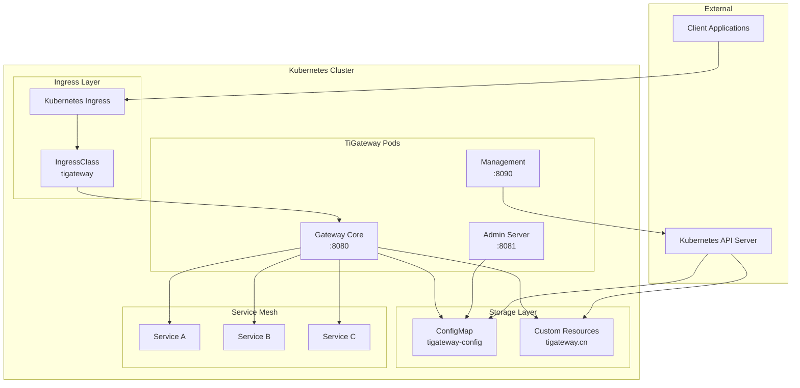
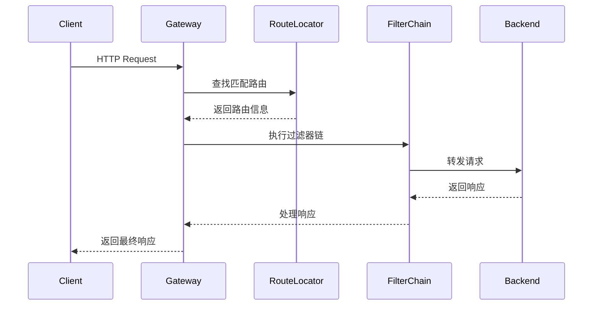
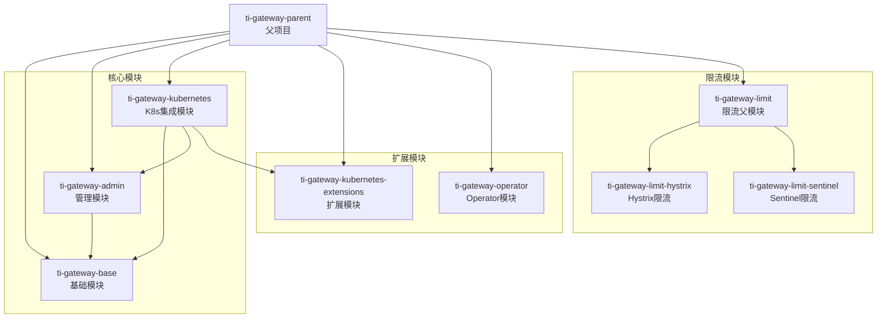
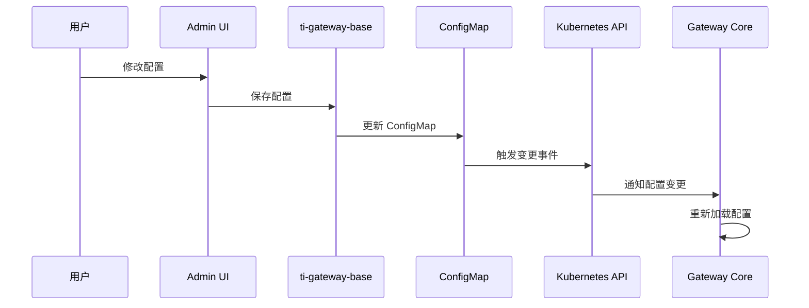
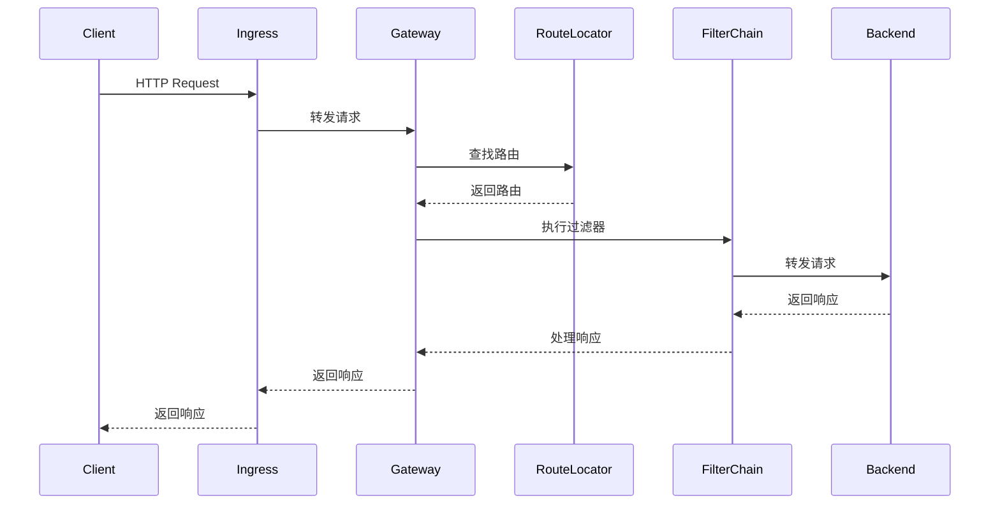
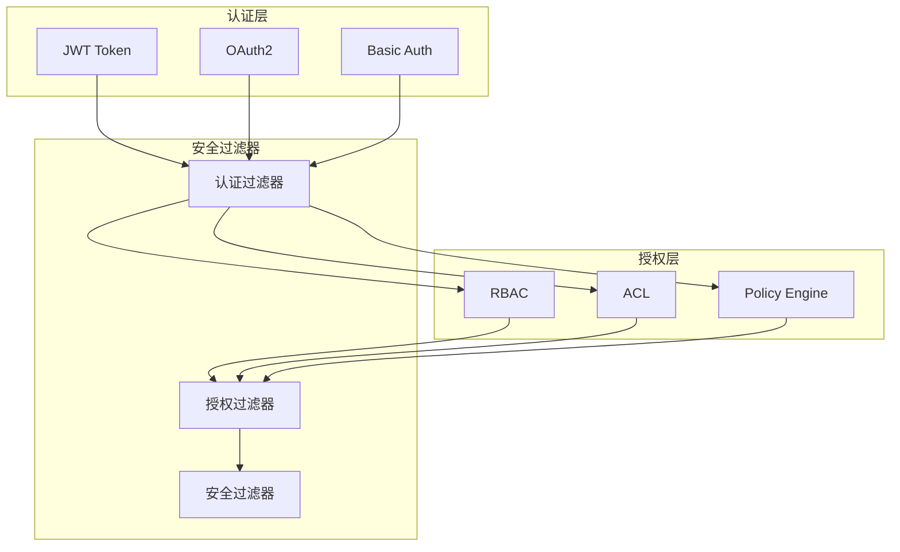
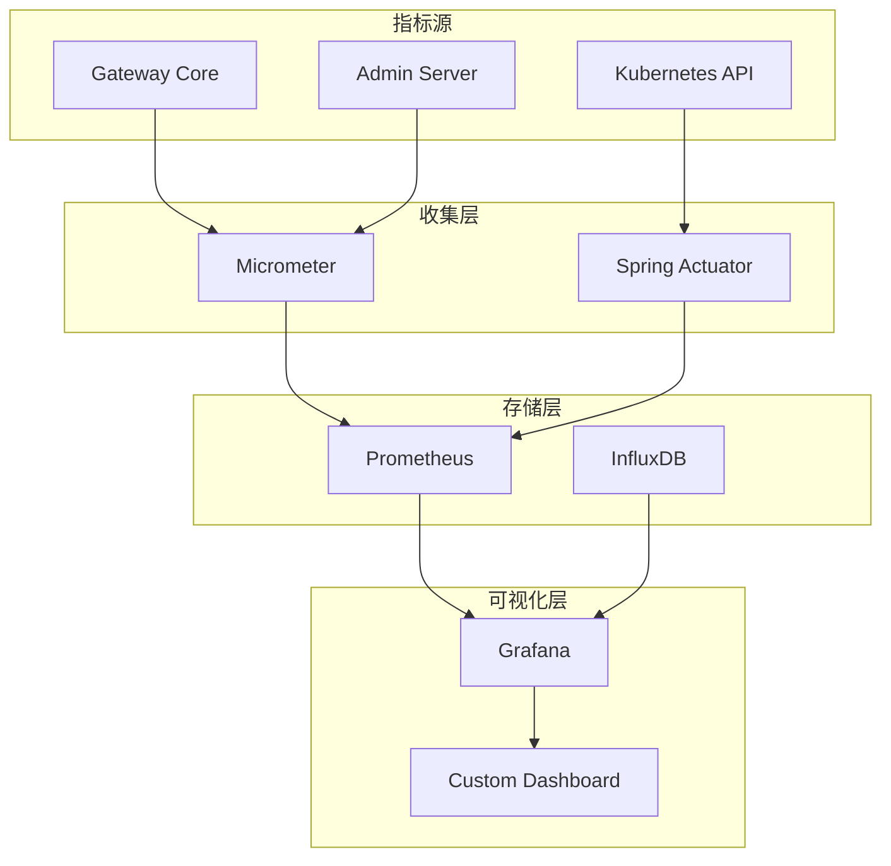
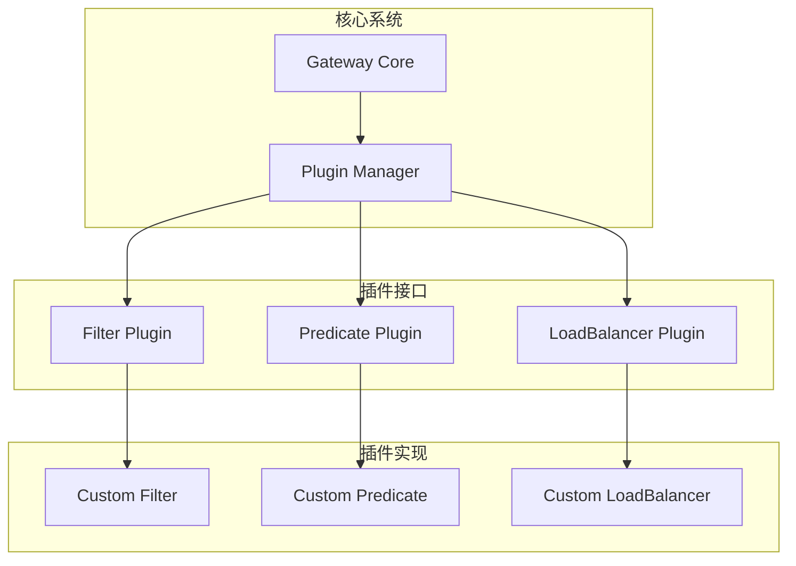
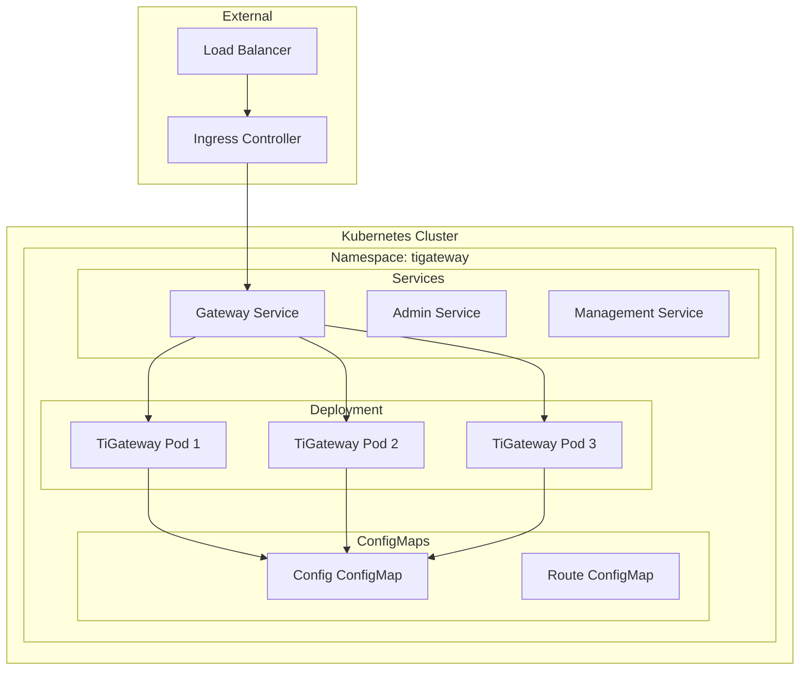
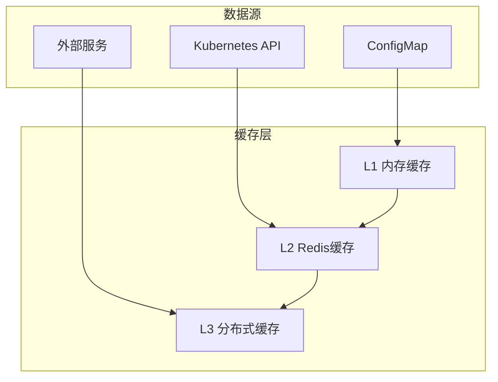

# TiGateway 架构概述

## 整体架构

TiGateway 采用云原生架构设计，基于 Spring Cloud Gateway 构建，专门为 Kubernetes 环境优化。整个系统由多个模块组成，每个模块都有明确的职责和边界。

## 架构图



## 核心组件

### 1. Gateway Core (端口 8080)

**功能**: 主要的网关服务，处理所有入站请求

**技术栈**: 
- Spring Cloud Gateway 3.1.x
- Spring WebFlux
- Reactor Netty

**主要特性**:
- 动态路由配置
- 负载均衡
- 熔断器
- 限流
- 认证授权
- 请求/响应转换

**核心流程**:


### 2. Admin Server (端口 8081)

**功能**: 管理界面和 API，提供 Web UI 和 REST API

**技术栈**:
- Spring Boot
- Thymeleaf
- Spring WebFlux
- Bootstrap

**主要特性**:
- 路由管理界面
- 配置管理
- 监控面板
- 用户管理
- 实时配置更新

**界面功能**:
- **仪表板**: 系统概览和关键指标
- **路由管理**: 创建、编辑、删除路由
- **服务发现**: 查看 Kubernetes 服务
- **配置管理**: 编辑 ConfigMap 配置
- **监控面板**: 查看系统指标和日志

### 3. Management Endpoints (端口 8090)

**功能**: 监控、健康检查和运维端点

**技术栈**:
- Spring Boot Actuator
- Micrometer
- Prometheus

**主要端点**:
- `/actuator/health` - 健康检查
- `/actuator/metrics` - 指标收集
- `/actuator/gateway/routes` - 路由信息
- `/actuator/configprops` - 配置属性
- `/actuator/env` - 环境信息

## 模块架构

### 模块依赖关系



### 模块详细说明

#### ti-gateway-base
**职责**: 基础功能模块，提供核心数据模型和存储实现

**主要包结构**:
```
ti.gateway.base/
├── core/                    # 核心接口
│   ├── cache/              # 缓存接口
│   └── config/             # 配置接口
├── storage/                # 存储实现
│   └── configmap/          # ConfigMap存储
│       ├── config/         # 自动配置
│       ├── impl/           # 实现类
│       └── model/          # 数据模型
├── validation/             # 配置验证
│   └── schema/             # YAML Schema
└── util/                   # 工具类
```

**核心功能**:
- ConfigMap 存储实现
- 数据模型定义
- YAML Schema 验证
- 配置缓存管理

#### ti-gateway-admin
**职责**: 管理界面模块，提供 Web UI 和 REST API

**主要包结构**:
```
ti.gateway.admin/
├── config/                 # 配置类
├── controller/             # 控制器
│   ├── web/               # Web控制器
│   └── api/               # REST API控制器
├── service/               # 业务服务
├── model/                 # 数据模型
└── static/                # 静态资源
```

**核心功能**:
- Web 管理界面
- REST API 端点
- 配置管理服务
- 用户认证授权

#### ti-gateway-kubernetes
**职责**: Kubernetes 集成模块，主应用入口

**主要包结构**:
```
ti.gateway.kubernetes/
├── config/                 # 配置类
├── controller/             # 控制器
├── service/               # 业务服务
├── integration/           # 集成组件
│   ├── ingress/           # Ingress集成
│   ├── service/           # 服务发现
│   └── configmap/         # ConfigMap集成
└── filter/                # 自定义过滤器
```

**核心功能**:
- 主应用启动
- Ingress 控制器
- 服务发现集成
- 配置热更新

## 数据流架构

### 配置数据流



### 请求处理流程



## 存储架构

### ConfigMap 存储

TiGateway 使用 Kubernetes ConfigMap 作为主要配置存储：

```yaml
apiVersion: v1
kind: ConfigMap
metadata:
  name: tigateway-app-config
data:
  application.yml: |
    spring:
      cloud:
        gateway:
          routes:
          - id: example-route
            uri: http://example-service
            predicates:
            - Path=/api/**
  routes.yaml: |
    # 路由配置
  filters.yaml: |
    # 过滤器配置
```

### CRD 资源

支持自定义资源定义：

```yaml
apiVersion: tigateway.cn/v1
kind: TiGateway
metadata:
  name: example-gateway
spec:
  routes:
  - id: example-route
    uri: http://example-service
    predicates:
    - Path=/api/**
```

## 安全架构

### 认证和授权



### 网络安全

- **TLS 终止**: 支持 HTTPS 和 TLS 终止
- **网络策略**: 集成 Kubernetes NetworkPolicy
- **服务网格**: 支持 Istio 等服务网格
- **防火墙**: 支持网络防火墙规则

## 监控架构

### 指标收集



### 日志架构

- **结构化日志**: 使用 JSON 格式输出日志
- **日志聚合**: 支持 ELK、Fluentd 等日志聚合
- **链路追踪**: 集成 Zipkin、Jaeger 等追踪系统
- **审计日志**: 记录所有配置变更和操作

## 扩展架构

### 插件系统

TiGateway 支持插件扩展：



### 自定义组件

- **自定义过滤器**: 实现 GatewayFilter 接口
- **自定义谓词**: 实现 RoutePredicateFactory 接口
- **自定义负载均衡器**: 实现 LoadBalancer 接口
- **自定义配置源**: 实现 RouteDefinitionLocator 接口

## 部署架构

### 容器化部署



### 高可用部署

- **多副本**: 支持水平扩展
- **负载均衡**: 使用 Kubernetes Service
- **故障转移**: 自动故障检测和转移
- **滚动更新**: 零停机部署

## 性能架构

### 响应式架构

TiGateway 基于 Spring WebFlux 的响应式架构：

- **非阻塞 I/O**: 使用 Netty 非阻塞 I/O
- **背压处理**: 支持响应式流背压
- **资源优化**: 高效的线程和内存使用
- **并发处理**: 支持高并发请求处理

### 缓存架构



## 总结

TiGateway 的架构设计充分考虑了云原生环境的特点，具有以下优势：

1. **云原生**: 完全基于 Kubernetes 原生资源
2. **可扩展**: 模块化设计，支持水平扩展
3. **高可用**: 多副本部署，自动故障转移
4. **可观测**: 完整的监控和日志系统
5. **安全**: 多层次安全防护
6. **性能**: 响应式架构，高性能处理

这种架构设计使得 TiGateway 能够很好地适应现代云原生应用的需求，为微服务架构提供可靠的网关服务。
