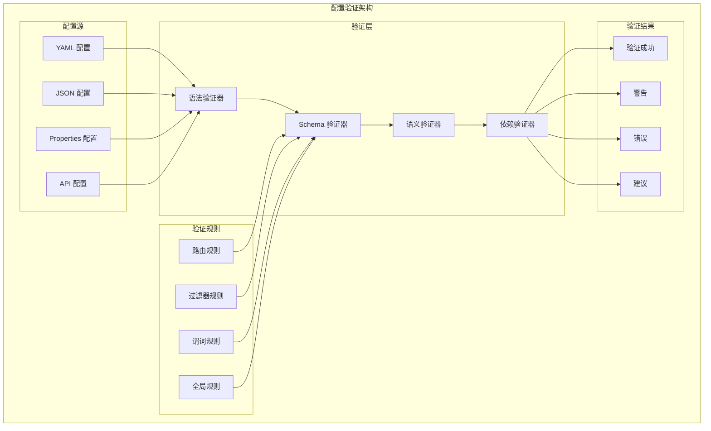

# 配置验证

TiGateway 提供了完整的配置验证机制，确保配置的正确性和一致性，防止因配置错误导致的服务异常。

## 配置验证概述

### 验证架构



### 验证特性

- **多格式支持**: 支持 YAML、JSON、Properties 等多种配置格式
- **分层验证**: 提供语法、Schema、语义、依赖等多层验证
- **实时验证**: 配置更新时实时进行验证
- **详细报告**: 提供详细的验证报告和错误信息
- **自动修复**: 支持配置的自动修复建议
- **规则扩展**: 支持自定义验证规则

## 验证器实现

### 1. 配置验证器

```java
@Component
public class ConfigurationValidator {
    
    @Autowired
    private SyntaxValidator syntaxValidator;
    
    @Autowired
    private SchemaValidator schemaValidator;
    
    @Autowired
    private SemanticValidator semanticValidator;
    
    @Autowired
    private DependencyValidator dependencyValidator;
    
    public ValidationResult validateConfiguration(String configType, Object configuration) {
        ValidationResult result = new ValidationResult();
        
        try {
            // 语法验证
            ValidationResult syntaxResult = syntaxValidator.validate(configType, configuration);
            result.merge(syntaxResult);
            
            if (syntaxResult.hasErrors()) {
                return result;
            }
            
            // Schema 验证
            ValidationResult schemaResult = schemaValidator.validate(configType, configuration);
            result.merge(schemaResult);
            
            if (schemaResult.hasErrors()) {
                return result;
            }
            
            // 语义验证
            ValidationResult semanticResult = semanticValidator.validate(configType, configuration);
            result.merge(semanticResult);
            
            if (semanticResult.hasErrors()) {
                return result;
            }
            
            // 依赖验证
            ValidationResult dependencyResult = dependencyValidator.validate(configType, configuration);
            result.merge(dependencyResult);
            
            return result;
        } catch (Exception e) {
            result.addError("VALIDATION_ERROR", "Configuration validation failed: " + e.getMessage());
            return result;
        }
    }
    
    public boolean validateRoute(RouteDefinition route) {
        ValidationResult result = validateConfiguration("route", route);
        return !result.hasErrors();
    }
    
    public boolean validateFilter(FilterDefinition filter) {
        ValidationResult result = validateConfiguration("filter", filter);
        return !result.hasErrors();
    }
    
    public boolean validateGlobalConfiguration(Object configuration) {
        ValidationResult result = validateConfiguration("global", configuration);
        return !result.hasErrors();
    }
    
    public boolean validateGenericConfiguration(Object configuration) {
        ValidationResult result = validateConfiguration("generic", configuration);
        return !result.hasErrors();
    }
}
```

### 2. 语法验证器

```java
@Component
public class SyntaxValidator {
    
    @Autowired
    private YamlSyntaxValidator yamlSyntaxValidator;
    
    @Autowired
    private JsonSyntaxValidator jsonSyntaxValidator;
    
    @Autowired
    private PropertiesSyntaxValidator propertiesSyntaxValidator;
    
    public ValidationResult validate(String configType, Object configuration) {
        ValidationResult result = new ValidationResult();
        
        if (configuration instanceof String) {
            String configString = (String) configuration;
            
            // 根据配置类型选择验证器
            if (configString.trim().startsWith("{")) {
                // JSON 格式
                result.merge(jsonSyntaxValidator.validate(configString));
            } else if (configString.contains(":") && configString.contains("\n")) {
                // YAML 格式
                result.merge(yamlSyntaxValidator.validate(configString));
            } else if (configString.contains("=")) {
                // Properties 格式
                result.merge(propertiesSyntaxValidator.validate(configString));
            }
        } else if (configuration instanceof Map) {
            // 对象格式，验证结构
            result.merge(validateObjectStructure((Map<String, Object>) configuration));
        }
        
        return result;
    }
    
    private ValidationResult validateObjectStructure(Map<String, Object> config) {
        ValidationResult result = new ValidationResult();
        
        // 验证必要的字段
        if (!config.containsKey("id")) {
            result.addError("MISSING_ID", "Configuration must have an 'id' field");
        }
        
        if (!config.containsKey("uri")) {
            result.addError("MISSING_URI", "Configuration must have a 'uri' field");
        }
        
        // 验证字段类型
        Object id = config.get("id");
        if (id != null && !(id instanceof String)) {
            result.addError("INVALID_ID_TYPE", "ID field must be a string");
        }
        
        Object uri = config.get("uri");
        if (uri != null && !(uri instanceof String)) {
            result.addError("INVALID_URI_TYPE", "URI field must be a string");
        }
        
        return result;
    }
}

@Component
public class YamlSyntaxValidator {
    
    public ValidationResult validate(String yamlContent) {
        ValidationResult result = new ValidationResult();
        
        try {
            Yaml yaml = new Yaml();
            yaml.load(yamlContent);
            result.addSuccess("YAML_SYNTAX_VALID", "YAML syntax is valid");
        } catch (Exception e) {
            result.addError("YAML_SYNTAX_ERROR", "YAML syntax error: " + e.getMessage());
        }
        
        return result;
    }
}

@Component
public class JsonSyntaxValidator {
    
    @Autowired
    private ObjectMapper objectMapper;
    
    public ValidationResult validate(String jsonContent) {
        ValidationResult result = new ValidationResult();
        
        try {
            objectMapper.readTree(jsonContent);
            result.addSuccess("JSON_SYNTAX_VALID", "JSON syntax is valid");
        } catch (Exception e) {
            result.addError("JSON_SYNTAX_ERROR", "JSON syntax error: " + e.getMessage());
        }
        
        return result;
    }
}

@Component
public class PropertiesSyntaxValidator {
    
    public ValidationResult validate(String propertiesContent) {
        ValidationResult result = new ValidationResult();
        
        try {
            Properties properties = new Properties();
            properties.load(new StringReader(propertiesContent));
            result.addSuccess("PROPERTIES_SYNTAX_VALID", "Properties syntax is valid");
        } catch (Exception e) {
            result.addError("PROPERTIES_SYNTAX_ERROR", "Properties syntax error: " + e.getMessage());
        }
        
        return result;
    }
}
```

### 3. Schema 验证器

```java
@Component
public class SchemaValidator {
    
    @Autowired
    private RouteSchemaValidator routeSchemaValidator;
    
    @Autowired
    private FilterSchemaValidator filterSchemaValidator;
    
    @Autowired
    private GlobalSchemaValidator globalSchemaValidator;
    
    public ValidationResult validate(String configType, Object configuration) {
        ValidationResult result = new ValidationResult();
        
        switch (configType) {
            case "route":
                result.merge(routeSchemaValidator.validate(configuration));
                break;
            case "filter":
                result.merge(filterSchemaValidator.validate(configuration));
                break;
            case "global":
                result.merge(globalSchemaValidator.validate(configuration));
                break;
            default:
                result.addWarning("UNKNOWN_CONFIG_TYPE", "Unknown configuration type: " + configType);
        }
        
        return result;
    }
}

@Component
public class RouteSchemaValidator {
    
    public ValidationResult validate(Object configuration) {
        ValidationResult result = new ValidationResult();
        
        if (!(configuration instanceof RouteDefinition)) {
            result.addError("INVALID_ROUTE_TYPE", "Configuration must be a RouteDefinition");
            return result;
        }
        
        RouteDefinition route = (RouteDefinition) configuration;
        
        // 验证 ID
        if (route.getId() == null || route.getId().trim().isEmpty()) {
            result.addError("MISSING_ROUTE_ID", "Route ID is required");
        } else if (!isValidRouteId(route.getId())) {
            result.addError("INVALID_ROUTE_ID", "Route ID contains invalid characters");
        }
        
        // 验证 URI
        if (route.getUri() == null || route.getUri().trim().isEmpty()) {
            result.addError("MISSING_ROUTE_URI", "Route URI is required");
        } else if (!isValidUri(route.getUri())) {
            result.addError("INVALID_ROUTE_URI", "Route URI format is invalid");
        }
        
        // 验证谓词
        if (route.getPredicates() == null || route.getPredicates().isEmpty()) {
            result.addError("MISSING_ROUTE_PREDICATES", "Route predicates are required");
        } else {
            for (PredicateDefinition predicate : route.getPredicates()) {
                ValidationResult predicateResult = validatePredicate(predicate);
                result.merge(predicateResult);
            }
        }
        
        // 验证过滤器
        if (route.getFilters() != null) {
            for (FilterDefinition filter : route.getFilters()) {
                ValidationResult filterResult = validateFilter(filter);
                result.merge(filterResult);
            }
        }
        
        return result;
    }
    
    private boolean isValidRouteId(String id) {
        return id.matches("^[a-zA-Z0-9-_]+$");
    }
    
    private boolean isValidUri(String uri) {
        try {
            URI.create(uri);
            return true;
        } catch (Exception e) {
            return false;
        }
    }
    
    private ValidationResult validatePredicate(PredicateDefinition predicate) {
        ValidationResult result = new ValidationResult();
        
        if (predicate.getName() == null || predicate.getName().trim().isEmpty()) {
            result.addError("MISSING_PREDICATE_NAME", "Predicate name is required");
        } else if (!isValidPredicateName(predicate.getName())) {
            result.addError("INVALID_PREDICATE_NAME", "Unknown predicate: " + predicate.getName());
        }
        
        if (predicate.getArgs() == null || predicate.getArgs().isEmpty()) {
            result.addWarning("EMPTY_PREDICATE_ARGS", "Predicate has no arguments");
        }
        
        return result;
    }
    
    private ValidationResult validateFilter(FilterDefinition filter) {
        ValidationResult result = new ValidationResult();
        
        if (filter.getName() == null || filter.getName().trim().isEmpty()) {
            result.addError("MISSING_FILTER_NAME", "Filter name is required");
        } else if (!isValidFilterName(filter.getName())) {
            result.addError("INVALID_FILTER_NAME", "Unknown filter: " + filter.getName());
        }
        
        return result;
    }
    
    private boolean isValidPredicateName(String name) {
        // 验证谓词名称是否有效
        Set<String> validPredicates = Set.of(
            "After", "Before", "Between", "Cookie", "Header", "Host", 
            "Method", "Path", "Query", "RemoteAddr", "Weight", "XForwardedRemoteAddr"
        );
        return validPredicates.contains(name);
    }
    
    private boolean isValidFilterName(String name) {
        // 验证过滤器名称是否有效
        Set<String> validFilters = Set.of(
            "AddRequestHeader", "AddRequestHeadersIfNotPresent", "AddRequestParameter",
            "AddResponseHeader", "CircuitBreaker", "CacheRequestBody", "DedupeResponseHeader",
            "FallbackHeaders", "JsonToGrpc", "LocalResponseCache", "MapRequestHeader",
            "ModifyRequestBody", "ModifyResponseBody", "PrefixPath", "PreserveHostHeader",
            "RedirectTo", "RemoveJsonAttributesResponseBody", "RemoveRequestHeader",
            "RemoveRequestParameter", "RemoveResponseHeader", "RequestHeaderSize",
            "RequestRateLimiter", "RewriteLocationResponseHeader", "RewritePath",
            "RewriteResponseHeader", "SaveSession", "SecureHeaders", "SetPath",
            "SetRequestHeader", "SetResponseHeader", "SetStatus", "StripPrefix",
            "Retry", "RequestSize", "SetRequestHostHeader", "TokenRelay"
        );
        return validFilters.contains(name);
    }
}

@Component
public class FilterSchemaValidator {
    
    public ValidationResult validate(Object configuration) {
        ValidationResult result = new ValidationResult();
        
        if (!(configuration instanceof FilterDefinition)) {
            result.addError("INVALID_FILTER_TYPE", "Configuration must be a FilterDefinition");
            return result;
        }
        
        FilterDefinition filter = (FilterDefinition) configuration;
        
        // 验证过滤器名称
        if (filter.getName() == null || filter.getName().trim().isEmpty()) {
            result.addError("MISSING_FILTER_NAME", "Filter name is required");
        } else if (!isValidFilterName(filter.getName())) {
            result.addError("INVALID_FILTER_NAME", "Unknown filter: " + filter.getName());
        }
        
        // 验证过滤器参数
        if (filter.getArgs() != null) {
            ValidationResult argsResult = validateFilterArgs(filter.getName(), filter.getArgs());
            result.merge(argsResult);
        }
        
        return result;
    }
    
    private ValidationResult validateFilterArgs(String filterName, Map<String, Object> args) {
        ValidationResult result = new ValidationResult();
        
        switch (filterName) {
            case "AddRequestHeader":
                result.merge(validateAddRequestHeaderArgs(args));
                break;
            case "CircuitBreaker":
                result.merge(validateCircuitBreakerArgs(args));
                break;
            case "RequestRateLimiter":
                result.merge(validateRequestRateLimiterArgs(args));
                break;
            case "RewritePath":
                result.merge(validateRewritePathArgs(args));
                break;
            default:
                result.addWarning("UNKNOWN_FILTER_ARGS", "No validation rules for filter: " + filterName);
        }
        
        return result;
    }
    
    private ValidationResult validateAddRequestHeaderArgs(Map<String, Object> args) {
        ValidationResult result = new ValidationResult();
        
        if (!args.containsKey("name")) {
            result.addError("MISSING_HEADER_NAME", "Header name is required for AddRequestHeader filter");
        }
        
        if (!args.containsKey("value")) {
            result.addError("MISSING_HEADER_VALUE", "Header value is required for AddRequestHeader filter");
        }
        
        return result;
    }
    
    private ValidationResult validateCircuitBreakerArgs(Map<String, Object> args) {
        ValidationResult result = new ValidationResult();
        
        if (!args.containsKey("name")) {
            result.addError("MISSING_CIRCUIT_BREAKER_NAME", "Circuit breaker name is required");
        }
        
        return result;
    }
    
    private ValidationResult validateRequestRateLimiterArgs(Map<String, Object> args) {
        ValidationResult result = new ValidationResult();
        
        if (!args.containsKey("redis-rate-limiter.replenishRate")) {
            result.addError("MISSING_REPLENISH_RATE", "Replenish rate is required for RequestRateLimiter filter");
        }
        
        if (!args.containsKey("redis-rate-limiter.burstCapacity")) {
            result.addError("MISSING_BURST_CAPACITY", "Burst capacity is required for RequestRateLimiter filter");
        }
        
        return result;
    }
    
    private ValidationResult validateRewritePathArgs(Map<String, Object> args) {
        ValidationResult result = new ValidationResult();
        
        if (!args.containsKey("regexp")) {
            result.addError("MISSING_REGEXP", "Regular expression is required for RewritePath filter");
        }
        
        if (!args.containsKey("replacement")) {
            result.addError("MISSING_REPLACEMENT", "Replacement string is required for RewritePath filter");
        }
        
        return result;
    }
}
```

### 4. 语义验证器

```java
@Component
public class SemanticValidator {
    
    @Autowired
    private RouteSemanticValidator routeSemanticValidator;
    
    @Autowired
    private FilterSemanticValidator filterSemanticValidator;
    
    public ValidationResult validate(String configType, Object configuration) {
        ValidationResult result = new ValidationResult();
        
        switch (configType) {
            case "route":
                result.merge(routeSemanticValidator.validate(configuration));
                break;
            case "filter":
                result.merge(filterSemanticValidator.validate(configuration));
                break;
            default:
                result.addWarning("UNKNOWN_CONFIG_TYPE", "No semantic validation for type: " + configType);
        }
        
        return result;
    }
}

@Component
public class RouteSemanticValidator {
    
    public ValidationResult validate(Object configuration) {
        ValidationResult result = new ValidationResult();
        
        if (!(configuration instanceof RouteDefinition)) {
            return result;
        }
        
        RouteDefinition route = (RouteDefinition) configuration;
        
        // 验证 URI 语义
        ValidationResult uriResult = validateUriSemantics(route.getUri());
        result.merge(uriResult);
        
        // 验证谓词语义
        if (route.getPredicates() != null) {
            for (PredicateDefinition predicate : route.getPredicates()) {
                ValidationResult predicateResult = validatePredicateSemantics(predicate);
                result.merge(predicateResult);
            }
        }
        
        // 验证过滤器语义
        if (route.getFilters() != null) {
            for (FilterDefinition filter : route.getFilters()) {
                ValidationResult filterResult = validateFilterSemantics(filter);
                result.merge(filterResult);
            }
        }
        
        return result;
    }
    
    private ValidationResult validateUriSemantics(String uri) {
        ValidationResult result = new ValidationResult();
        
        if (uri == null) {
            return result;
        }
        
        // 验证 URI 协议
        if (uri.startsWith("lb://")) {
            String serviceName = uri.substring(5);
            if (serviceName.isEmpty()) {
                result.addError("EMPTY_SERVICE_NAME", "Service name cannot be empty in lb:// URI");
            } else if (!isValidServiceName(serviceName)) {
                result.addError("INVALID_SERVICE_NAME", "Invalid service name: " + serviceName);
            }
        } else if (uri.startsWith("http://") || uri.startsWith("https://")) {
            try {
                URI.create(uri);
            } catch (Exception e) {
                result.addError("INVALID_HTTP_URI", "Invalid HTTP URI: " + e.getMessage());
            }
        } else if (uri.startsWith("forward://")) {
            String path = uri.substring(10);
            if (path.isEmpty()) {
                result.addError("EMPTY_FORWARD_PATH", "Forward path cannot be empty");
            }
        }
        
        return result;
    }
    
    private ValidationResult validatePredicateSemantics(PredicateDefinition predicate) {
        ValidationResult result = new ValidationResult();
        
        String name = predicate.getName();
        Map<String, Object> args = predicate.getArgs();
        
        if (args == null) {
            return result;
        }
        
        switch (name) {
            case "Path":
                result.merge(validatePathPredicate(args));
                break;
            case "Host":
                result.merge(validateHostPredicate(args));
                break;
            case "Method":
                result.merge(validateMethodPredicate(args));
                break;
            case "Query":
                result.merge(validateQueryPredicate(args));
                break;
        }
        
        return result;
    }
    
    private ValidationResult validatePathPredicate(Map<String, Object> args) {
        ValidationResult result = new ValidationResult();
        
        Object pattern = args.get("pattern");
        if (pattern instanceof String) {
            String pathPattern = (String) pattern;
            if (!pathPattern.startsWith("/")) {
                result.addWarning("PATH_PATTERN_SLASH", "Path pattern should start with '/'");
            }
            if (pathPattern.contains("//")) {
                result.addError("PATH_PATTERN_DOUBLE_SLASH", "Path pattern contains double slashes");
            }
        }
        
        return result;
    }
    
    private ValidationResult validateHostPredicate(Map<String, Object> args) {
        ValidationResult result = new ValidationResult();
        
        Object pattern = args.get("pattern");
        if (pattern instanceof String) {
            String hostPattern = (String) pattern;
            if (!isValidHostPattern(hostPattern)) {
                result.addError("INVALID_HOST_PATTERN", "Invalid host pattern: " + hostPattern);
            }
        }
        
        return result;
    }
    
    private ValidationResult validateMethodPredicate(Map<String, Object> args) {
        ValidationResult result = new ValidationResult();
        
        Object methods = args.get("methods");
        if (methods instanceof String) {
            String methodString = (String) methods;
            String[] methodArray = methodString.split(",");
            for (String method : methodArray) {
                if (!isValidHttpMethod(method.trim())) {
                    result.addError("INVALID_HTTP_METHOD", "Invalid HTTP method: " + method);
                }
            }
        }
        
        return result;
    }
    
    private ValidationResult validateQueryPredicate(Map<String, Object> args) {
        ValidationResult result = new ValidationResult();
        
        Object param = args.get("param");
        if (param instanceof String) {
            String paramName = (String) param;
            if (paramName.isEmpty()) {
                result.addError("EMPTY_QUERY_PARAM", "Query parameter name cannot be empty");
            }
        }
        
        return result;
    }
    
    private ValidationResult validateFilterSemantics(FilterDefinition filter) {
        ValidationResult result = new ValidationResult();
        
        String name = filter.getName();
        Map<String, Object> args = filter.getArgs();
        
        if (args == null) {
            return result;
        }
        
        switch (name) {
            case "StripPrefix":
                result.merge(validateStripPrefixFilter(args));
                break;
            case "RewritePath":
                result.merge(validateRewritePathFilter(args));
                break;
            case "RequestRateLimiter":
                result.merge(validateRequestRateLimiterFilter(args));
                break;
        }
        
        return result;
    }
    
    private ValidationResult validateStripPrefixFilter(Map<String, Object> args) {
        ValidationResult result = new ValidationResult();
        
        Object parts = args.get("parts");
        if (parts instanceof String) {
            try {
                int partCount = Integer.parseInt((String) parts);
                if (partCount < 0) {
                    result.addError("NEGATIVE_STRIP_PREFIX", "Strip prefix parts cannot be negative");
                }
            } catch (NumberFormatException e) {
                result.addError("INVALID_STRIP_PREFIX_PARTS", "Strip prefix parts must be a number");
            }
        }
        
        return result;
    }
    
    private ValidationResult validateRewritePathFilter(Map<String, Object> args) {
        ValidationResult result = new ValidationResult();
        
        Object regexp = args.get("regexp");
        if (regexp instanceof String) {
            try {
                Pattern.compile((String) regexp);
            } catch (PatternSyntaxException e) {
                result.addError("INVALID_REGEXP", "Invalid regular expression: " + e.getMessage());
            }
        }
        
        return result;
    }
    
    private ValidationResult validateRequestRateLimiterFilter(Map<String, Object> args) {
        ValidationResult result = new ValidationResult();
        
        Object replenishRate = args.get("redis-rate-limiter.replenishRate");
        if (replenishRate instanceof String) {
            try {
                int rate = Integer.parseInt((String) replenishRate);
                if (rate <= 0) {
                    result.addError("INVALID_REPLENISH_RATE", "Replenish rate must be positive");
                }
            } catch (NumberFormatException e) {
                result.addError("INVALID_REPLENISH_RATE_FORMAT", "Replenish rate must be a number");
            }
        }
        
        Object burstCapacity = args.get("redis-rate-limiter.burstCapacity");
        if (burstCapacity instanceof String) {
            try {
                int capacity = Integer.parseInt((String) burstCapacity);
                if (capacity <= 0) {
                    result.addError("INVALID_BURST_CAPACITY", "Burst capacity must be positive");
                }
            } catch (NumberFormatException e) {
                result.addError("INVALID_BURST_CAPACITY_FORMAT", "Burst capacity must be a number");
            }
        }
        
        return result;
    }
    
    private boolean isValidServiceName(String serviceName) {
        return serviceName.matches("^[a-zA-Z0-9-_]+$");
    }
    
    private boolean isValidHostPattern(String hostPattern) {
        // 简单的主机模式验证
        return hostPattern.matches("^[a-zA-Z0-9.*-]+$");
    }
    
    private boolean isValidHttpMethod(String method) {
        Set<String> validMethods = Set.of("GET", "POST", "PUT", "DELETE", "PATCH", "HEAD", "OPTIONS", "TRACE");
        return validMethods.contains(method.toUpperCase());
    }
}
```

### 5. 依赖验证器

```java
@Component
public class DependencyValidator {
    
    @Autowired
    private ServiceDiscoveryService serviceDiscoveryService;
    
    @Autowired
    private ConfigurationService configurationService;
    
    public ValidationResult validate(String configType, Object configuration) {
        ValidationResult result = new ValidationResult();
        
        switch (configType) {
            case "route":
                result.merge(validateRouteDependencies(configuration));
                break;
            case "filter":
                result.merge(validateFilterDependencies(configuration));
                break;
            default:
                result.addWarning("UNKNOWN_CONFIG_TYPE", "No dependency validation for type: " + configType);
        }
        
        return result;
    }
    
    private ValidationResult validateRouteDependencies(Object configuration) {
        ValidationResult result = new ValidationResult();
        
        if (!(configuration instanceof RouteDefinition)) {
            return result;
        }
        
        RouteDefinition route = (RouteDefinition) configuration;
        
        // 验证服务依赖
        ValidationResult serviceResult = validateServiceDependencies(route.getUri());
        result.merge(serviceResult);
        
        // 验证过滤器依赖
        if (route.getFilters() != null) {
            for (FilterDefinition filter : route.getFilters()) {
                ValidationResult filterResult = validateFilterDependencies(filter);
                result.merge(filterResult);
            }
        }
        
        return result;
    }
    
    private ValidationResult validateServiceDependencies(String uri) {
        ValidationResult result = new ValidationResult();
        
        if (uri != null && uri.startsWith("lb://")) {
            String serviceName = uri.substring(5);
            
            // 检查服务是否存在
            if (!serviceDiscoveryService.isServiceAvailable(serviceName)) {
                result.addWarning("SERVICE_NOT_AVAILABLE", "Service not available: " + serviceName);
            }
            
            // 检查服务健康状态
            if (!serviceDiscoveryService.isServiceHealthy(serviceName)) {
                result.addWarning("SERVICE_UNHEALTHY", "Service is unhealthy: " + serviceName);
            }
        }
        
        return result;
    }
    
    private ValidationResult validateFilterDependencies(Object configuration) {
        ValidationResult result = new ValidationResult();
        
        if (!(configuration instanceof FilterDefinition)) {
            return result;
        }
        
        FilterDefinition filter = (FilterDefinition) configuration;
        String name = filter.getName();
        Map<String, Object> args = filter.getArgs();
        
        if (args == null) {
            return result;
        }
        
        switch (name) {
            case "CircuitBreaker":
                result.merge(validateCircuitBreakerDependencies(args));
                break;
            case "RequestRateLimiter":
                result.merge(validateRequestRateLimiterDependencies(args));
                break;
            case "TokenRelay":
                result.merge(validateTokenRelayDependencies(args));
                break;
        }
        
        return result;
    }
    
    private ValidationResult validateCircuitBreakerDependencies(Map<String, Object> args) {
        ValidationResult result = new ValidationResult();
        
        // 检查熔断器配置是否存在
        String circuitBreakerName = (String) args.get("name");
        if (circuitBreakerName != null) {
            if (!configurationService.hasCircuitBreakerConfig(circuitBreakerName)) {
                result.addWarning("CIRCUIT_BREAKER_CONFIG_MISSING", 
                    "Circuit breaker configuration not found: " + circuitBreakerName);
            }
        }
        
        return result;
    }
    
    private ValidationResult validateRequestRateLimiterDependencies(Map<String, Object> args) {
        ValidationResult result = new ValidationResult();
        
        // 检查 Redis 连接
        if (!configurationService.isRedisAvailable()) {
            result.addError("REDIS_NOT_AVAILABLE", "Redis is not available for rate limiting");
        }
        
        // 检查 KeyResolver 配置
        String keyResolver = (String) args.get("key-resolver");
        if (keyResolver != null) {
            if (!configurationService.hasKeyResolver(keyResolver)) {
                result.addWarning("KEY_RESOLVER_NOT_FOUND", "Key resolver not found: " + keyResolver);
            }
        }
        
        return result;
    }
    
    private ValidationResult validateTokenRelayDependencies(Map<String, Object> args) {
        ValidationResult result = new ValidationResult();
        
        // 检查 OAuth2 配置
        if (!configurationService.hasOAuth2Config()) {
            result.addError("OAUTH2_CONFIG_MISSING", "OAuth2 configuration is required for TokenRelay filter");
        }
        
        return result;
    }
}
```

## 验证结果

### 1. 验证结果类

```java
public class ValidationResult {
    
    private final List<ValidationMessage> messages = new ArrayList<>();
    private final Map<String, Object> metadata = new HashMap<>();
    
    public void addError(String code, String message) {
        messages.add(new ValidationMessage(ValidationLevel.ERROR, code, message));
    }
    
    public void addWarning(String code, String message) {
        messages.add(new ValidationMessage(ValidationLevel.WARNING, code, message));
    }
    
    public void addInfo(String code, String message) {
        messages.add(new ValidationMessage(ValidationLevel.INFO, code, message));
    }
    
    public void addSuccess(String code, String message) {
        messages.add(new ValidationMessage(ValidationLevel.SUCCESS, code, message));
    }
    
    public void addSuggestion(String code, String message) {
        messages.add(new ValidationMessage(ValidationLevel.SUGGESTION, code, message));
    }
    
    public void merge(ValidationResult other) {
        messages.addAll(other.messages);
        metadata.putAll(other.metadata);
    }
    
    public boolean hasErrors() {
        return messages.stream().anyMatch(msg -> msg.getLevel() == ValidationLevel.ERROR);
    }
    
    public boolean hasWarnings() {
        return messages.stream().anyMatch(msg -> msg.getLevel() == ValidationLevel.WARNING);
    }
    
    public boolean isValid() {
        return !hasErrors();
    }
    
    public List<ValidationMessage> getErrors() {
        return messages.stream()
            .filter(msg -> msg.getLevel() == ValidationLevel.ERROR)
            .collect(Collectors.toList());
    }
    
    public List<ValidationMessage> getWarnings() {
        return messages.stream()
            .filter(msg -> msg.getLevel() == ValidationLevel.WARNING)
            .collect(Collectors.toList());
    }
    
    public List<ValidationMessage> getMessages() {
        return new ArrayList<>(messages);
    }
    
    public Map<String, Object> getMetadata() {
        return new HashMap<>(metadata);
    }
    
    public void setMetadata(String key, Object value) {
        metadata.put(key, value);
    }
}

public class ValidationMessage {
    
    private final ValidationLevel level;
    private final String code;
    private final String message;
    private final String field;
    private final Object value;
    private final String suggestion;
    private final long timestamp;
    
    public ValidationMessage(ValidationLevel level, String code, String message) {
        this(level, code, message, null, null, null);
    }
    
    public ValidationMessage(ValidationLevel level, String code, String message, 
                           String field, Object value, String suggestion) {
        this.level = level;
        this.code = code;
        this.message = message;
        this.field = field;
        this.value = value;
        this.suggestion = suggestion;
        this.timestamp = System.currentTimeMillis();
    }
    
    // Getters
    public ValidationLevel getLevel() { return level; }
    public String getCode() { return code; }
    public String getMessage() { return message; }
    public String getField() { return field; }
    public Object getValue() { return value; }
    public String getSuggestion() { return suggestion; }
    public long getTimestamp() { return timestamp; }
}

public enum ValidationLevel {
    ERROR, WARNING, INFO, SUCCESS, SUGGESTION
}
```

## 配置验证 API

### 1. 验证 API 控制器

```java
@RestController
@RequestMapping("/api/validation")
public class ValidationController {
    
    @Autowired
    private ConfigurationValidator configurationValidator;
    
    @PostMapping("/validate")
    public ResponseEntity<ValidationResult> validateConfiguration(
            @RequestParam String configType,
            @RequestBody Object configuration) {
        try {
            ValidationResult result = configurationValidator.validateConfiguration(configType, configuration);
            return ResponseEntity.ok(result);
        } catch (Exception e) {
            ValidationResult errorResult = new ValidationResult();
            errorResult.addError("VALIDATION_ERROR", "Validation failed: " + e.getMessage());
            return ResponseEntity.badRequest().body(errorResult);
        }
    }
    
    @PostMapping("/validate/route")
    public ResponseEntity<ValidationResult> validateRoute(@RequestBody RouteDefinition route) {
        try {
            ValidationResult result = configurationValidator.validateConfiguration("route", route);
            return ResponseEntity.ok(result);
        } catch (Exception e) {
            ValidationResult errorResult = new ValidationResult();
            errorResult.addError("VALIDATION_ERROR", "Route validation failed: " + e.getMessage());
            return ResponseEntity.badRequest().body(errorResult);
        }
    }
    
    @PostMapping("/validate/filter")
    public ResponseEntity<ValidationResult> validateFilter(@RequestBody FilterDefinition filter) {
        try {
            ValidationResult result = configurationValidator.validateConfiguration("filter", filter);
            return ResponseEntity.ok(result);
        } catch (Exception e) {
            ValidationResult errorResult = new ValidationResult();
            errorResult.addError("VALIDATION_ERROR", "Filter validation failed: " + e.getMessage());
            return ResponseEntity.badRequest().body(errorResult);
        }
    }
    
    @PostMapping("/validate/global")
    public ResponseEntity<ValidationResult> validateGlobalConfiguration(@RequestBody Object configuration) {
        try {
            ValidationResult result = configurationValidator.validateConfiguration("global", configuration);
            return ResponseEntity.ok(result);
        } catch (Exception e) {
            ValidationResult errorResult = new ValidationResult();
            errorResult.addError("VALIDATION_ERROR", "Global configuration validation failed: " + e.getMessage());
            return ResponseEntity.badRequest().body(errorResult);
        }
    }
    
    @PostMapping("/validate/batch")
    public ResponseEntity<Map<String, ValidationResult>> validateBatch(
            @RequestBody Map<String, Object> configurations) {
        try {
            Map<String, ValidationResult> results = new HashMap<>();
            
            for (Map.Entry<String, Object> entry : configurations.entrySet()) {
                String configId = entry.getKey();
                Object configuration = entry.getValue();
                
                // 推断配置类型
                String configType = inferConfigType(configuration);
                ValidationResult result = configurationValidator.validateConfiguration(configType, configuration);
                results.put(configId, result);
            }
            
            return ResponseEntity.ok(results);
        } catch (Exception e) {
            return ResponseEntity.badRequest().build();
        }
    }
    
    @GetMapping("/rules")
    public ResponseEntity<Map<String, Object>> getValidationRules() {
        try {
            Map<String, Object> rules = new HashMap<>();
            
            // 路由验证规则
            rules.put("route", getRouteValidationRules());
            
            // 过滤器验证规则
            rules.put("filter", getFilterValidationRules());
            
            // 全局配置验证规则
            rules.put("global", getGlobalValidationRules());
            
            return ResponseEntity.ok(rules);
        } catch (Exception e) {
            return ResponseEntity.badRequest().build();
        }
    }
    
    private String inferConfigType(Object configuration) {
        if (configuration instanceof RouteDefinition) {
            return "route";
        } else if (configuration instanceof FilterDefinition) {
            return "filter";
        } else if (configuration instanceof Map) {
            Map<String, Object> configMap = (Map<String, Object>) configuration;
            if (configMap.containsKey("routes")) {
                return "global";
            } else if (configMap.containsKey("uri")) {
                return "route";
            } else if (configMap.containsKey("name") && configMap.containsKey("args")) {
                return "filter";
            }
        }
        return "generic";
    }
    
    private Map<String, Object> getRouteValidationRules() {
        Map<String, Object> rules = new HashMap<>();
        rules.put("requiredFields", Arrays.asList("id", "uri", "predicates"));
        rules.put("validPredicates", Arrays.asList("After", "Before", "Between", "Cookie", "Header", "Host", "Method", "Path", "Query", "RemoteAddr", "Weight", "XForwardedRemoteAddr"));
        rules.put("validFilters", Arrays.asList("AddRequestHeader", "AddRequestHeadersIfNotPresent", "AddRequestParameter", "AddResponseHeader", "CircuitBreaker", "CacheRequestBody", "DedupeResponseHeader", "FallbackHeaders", "JsonToGrpc", "LocalResponseCache", "MapRequestHeader", "ModifyRequestBody", "ModifyResponseBody", "PrefixPath", "PreserveHostHeader", "RedirectTo", "RemoveJsonAttributesResponseBody", "RemoveRequestHeader", "RemoveRequestParameter", "RemoveResponseHeader", "RequestHeaderSize", "RequestRateLimiter", "RewriteLocationResponseHeader", "RewritePath", "RewriteResponseHeader", "SaveSession", "SecureHeaders", "SetPath", "SetRequestHeader", "SetResponseHeader", "SetStatus", "StripPrefix", "Retry", "RequestSize", "SetRequestHostHeader", "TokenRelay"));
        return rules;
    }
    
    private Map<String, Object> getFilterValidationRules() {
        Map<String, Object> rules = new HashMap<>();
        rules.put("requiredFields", Arrays.asList("name"));
        rules.put("validFilters", Arrays.asList("AddRequestHeader", "AddRequestHeadersIfNotPresent", "AddRequestParameter", "AddResponseHeader", "CircuitBreaker", "CacheRequestBody", "DedupeResponseHeader", "FallbackHeaders", "JsonToGrpc", "LocalResponseCache", "MapRequestHeader", "ModifyRequestBody", "ModifyResponseBody", "PrefixPath", "PreserveHostHeader", "RedirectTo", "RemoveJsonAttributesResponseBody", "RemoveRequestHeader", "RemoveRequestParameter", "RemoveResponseHeader", "RequestHeaderSize", "RequestRateLimiter", "RewriteLocationResponseHeader", "RewritePath", "RewriteResponseHeader", "SaveSession", "SecureHeaders", "SetPath", "SetRequestHeader", "SetResponseHeader", "SetStatus", "StripPrefix", "Retry", "RequestSize", "SetRequestHostHeader", "TokenRelay"));
        return rules;
    }
    
    private Map<String, Object> getGlobalValidationRules() {
        Map<String, Object> rules = new HashMap<>();
        rules.put("validConfigTypes", Arrays.asList("application", "routes", "filters", "monitoring"));
        return rules;
    }
}
```

## 配置验证监控

### 1. 验证指标

```java
@Component
public class ValidationMetrics {
    
    private final MeterRegistry meterRegistry;
    private final Counter validationRequests;
    private final Counter validationErrors;
    private final Counter validationWarnings;
    private final Timer validationLatency;
    
    public ValidationMetrics(MeterRegistry meterRegistry) {
        this.meterRegistry = meterRegistry;
        this.validationRequests = Counter.builder("tigateway_validation_requests_total")
            .description("Total number of validation requests")
            .register(meterRegistry);
        this.validationErrors = Counter.builder("tigateway_validation_errors_total")
            .description("Total number of validation errors")
            .register(meterRegistry);
        this.validationWarnings = Counter.builder("tigateway_validation_warnings_total")
            .description("Total number of validation warnings")
            .register(meterRegistry);
        this.validationLatency = Timer.builder("tigateway_validation_duration_seconds")
            .description("Configuration validation duration")
            .register(meterRegistry);
    }
    
    public void recordValidationRequest(String configType, boolean success) {
        validationRequests.increment(
            Tags.of(
                "configType", configType,
                "success", String.valueOf(success)
            )
        );
    }
    
    public void recordValidationErrors(String configType, int errorCount) {
        validationErrors.increment(
            Tags.of("configType", configType),
            errorCount
        );
    }
    
    public void recordValidationWarnings(String configType, int warningCount) {
        validationWarnings.increment(
            Tags.of("configType", configType),
            warningCount
        );
    }
    
    public void recordValidationLatency(Duration duration) {
        validationLatency.record(duration);
    }
}
```

## 最佳实践

### 1. 验证规则配置

```yaml
# 验证规则配置
apiVersion: v1
kind: ConfigMap
metadata:
  name: tigateway-validation-rules
  namespace: tigateway
data:
  validation-rules.yml: |
    validation:
      enabled: true
      strict-mode: false
      rules:
        route:
          required-fields:
          - id
          - uri
          - predicates
          field-validation:
            id:
              pattern: "^[a-zA-Z0-9-_]+$"
              min-length: 1
              max-length: 50
            uri:
              pattern: "^(lb://|http://|https://|forward://).*"
          predicate-validation:
            Path:
              required-args:
              - pattern
              pattern-validation:
                pattern:
                  regex: "^/.*"
        filter:
          required-fields:
          - name
          filter-validation:
            AddRequestHeader:
              required-args:
              - name
              - value
            CircuitBreaker:
              required-args:
              - name
            RequestRateLimiter:
              required-args:
              - redis-rate-limiter.replenishRate
              - redis-rate-limiter.burstCapacity
      dependencies:
        enabled: true
        service-check: true
        health-check: true
        config-check: true
      suggestions:
        enabled: true
        auto-fix: false
        max-suggestions: 5
```

### 2. 验证策略

```yaml
# 验证策略配置
apiVersion: v1
kind: ConfigMap
metadata:
  name: tigateway-validation-strategy
  namespace: tigateway
data:
  validation-strategy.yml: |
    strategy:
      validation:
        mode: "strict"  # strict, lenient, custom
        fail-fast: true
        continue-on-error: false
        max-errors: 10
        max-warnings: 50
      reporting:
        format: "detailed"  # summary, detailed, json
        include-suggestions: true
        include-metadata: true
        include-timestamps: true
      caching:
        enabled: true
        ttl: "5m"
        max-size: 1000
      monitoring:
        enabled: true
        metrics: true
        logging: true
        alerting: true
```

## 故障排除

### 1. 常见问题

#### 验证失败
```bash
# 检查验证日志
kubectl logs -f deployment/tigateway -n tigateway | grep "validation"

# 检查验证规则
kubectl get configmap tigateway-validation-rules -n tigateway -o yaml

# 手动验证配置
kubectl exec -it deployment/tigateway -n tigateway -- curl -X POST http://localhost:8090/api/validation/validate/route -H "Content-Type: application/json" -d '{"id":"test-route","uri":"lb://test-service","predicates":[{"name":"Path","args":{"pattern":"/test/**"}}]}'
```

#### 验证规则不生效
```bash
# 检查验证规则配置
kubectl get configmap tigateway-validation-rules -n tigateway -o yaml

# 检查验证器状态
kubectl exec -it deployment/tigateway -n tigateway -- curl http://localhost:8090/actuator/health/validation

# 重新加载验证规则
kubectl exec -it deployment/tigateway -n tigateway -- curl -X POST http://localhost:8090/actuator/refresh
```

#### 验证性能问题
```bash
# 检查验证指标
kubectl exec -it deployment/tigateway -n tigateway -- curl http://localhost:8090/actuator/metrics/tigateway.validation.duration.seconds

# 检查验证缓存
kubectl exec -it deployment/tigateway -n tigateway -- curl http://localhost:8090/actuator/validation/cache

# 调整验证策略
kubectl edit configmap tigateway-validation-strategy -n tigateway
```

### 2. 调试命令

```bash
# 查看验证器状态
kubectl exec -it deployment/tigateway -n tigateway -- curl http://localhost:8090/actuator/validation/status

# 查看验证规则
kubectl exec -it deployment/tigateway -n tigateway -- curl http://localhost:8090/api/validation/rules

# 测试验证功能
kubectl exec -it deployment/tigateway -n tigateway -- curl -X POST http://localhost:8090/api/validation/validate -H "Content-Type: application/json" -d '{"configType":"route","configuration":{"id":"test","uri":"lb://test","predicates":[{"name":"Path","args":{"pattern":"/test"}}]}}'
```

## 自定义验证规则

### 1. 自定义验证器

```java
@Component
public class CustomRouteValidator implements RouteValidator {
    
    @Override
    public ValidationResult validate(RouteDefinition route) {
        ValidationResult result = new ValidationResult();
        
        // 自定义验证逻辑
        if (route.getId().contains("admin")) {
            // 管理员路由需要特殊验证
            if (!hasAdminPredicate(route)) {
                result.addError("ADMIN_ROUTE_MISSING_PREDICATE", 
                    "Admin routes must have authentication predicate");
            }
        }
        
        // 验证路由命名规范
        if (!followsNamingConvention(route.getId())) {
            result.addWarning("NAMING_CONVENTION", 
                "Route ID should follow naming convention: service-action");
        }
        
        return result;
    }
    
    private boolean hasAdminPredicate(RouteDefinition route) {
        return route.getPredicates().stream()
            .anyMatch(predicate -> "Header".equals(predicate.getName()) && 
                     "Authorization".equals(predicate.getArgs().get("header")));
    }
    
    private boolean followsNamingConvention(String routeId) {
        return routeId.matches("^[a-z]+-[a-z]+$");
    }
}
```

## 总结

TiGateway 的配置验证功能提供了完整的配置质量保证机制：

1. **分层验证**: 提供语法、Schema、语义、依赖等多层验证
2. **多格式支持**: 支持 YAML、JSON、Properties 等多种配置格式
3. **实时验证**: 配置更新时实时进行验证
4. **详细报告**: 提供详细的验证报告和错误信息
5. **自动修复**: 支持配置的自动修复建议
6. **规则扩展**: 支持自定义验证规则
7. **性能优化**: 提供验证缓存和并行处理
8. **监控集成**: 提供完整的验证监控和告警

通过配置验证功能，TiGateway 确保了配置的正确性和一致性，防止因配置错误导致的服务异常，提高了系统的可靠性和稳定性。