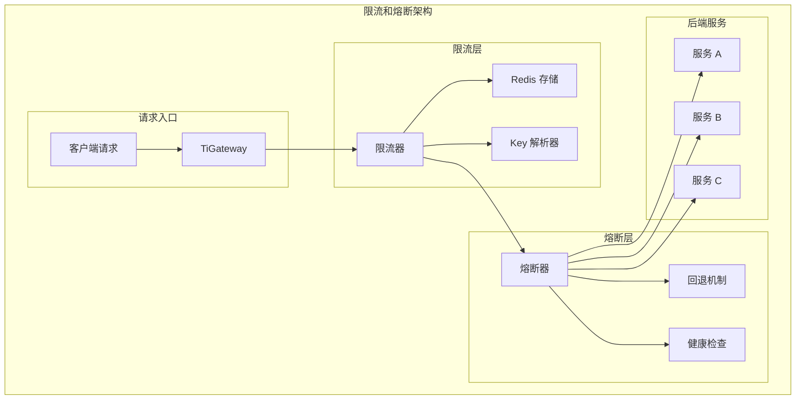

# 限流和熔断

TiGateway 提供了完整的限流和熔断功能，用于保护后端服务，防止系统过载和级联故障。

## 限流和熔断概述

### 架构设计



### 核心特性

- **多种限流算法**: 支持令牌桶、漏桶、滑动窗口等算法
- **分布式限流**: 基于 Redis 的分布式限流实现
- **智能熔断**: 支持多种熔断策略和自动恢复
- **回退机制**: 提供多种回退策略
- **监控集成**: 完整的监控指标和告警
- **动态配置**: 支持运行时动态调整参数

## 限流功能

### 1. 限流器实现

```java
@Component
public class TiGatewayRateLimiter implements RateLimiter<Object> {
    
    @Autowired
    private RedisTemplate<String, String> redisTemplate;
    
    @Autowired
    private KeyResolver keyResolver;
    
    private final Config config;
    
    public TiGatewayRateLimiter(Config config) {
        this.config = config;
    }
    
    @Override
    public Mono<Response> isAllowed(String routeId, String id) {
        return isAllowed(routeId, id, null);
    }
    
    @Override
    public Mono<Response> isAllowed(String routeId, String id, Object args) {
        // 解析限流键
        String key = keyResolver.resolve(routeId, id, args);
        
        // 执行限流检查
        return checkRateLimit(key, config);
    }
    
    private Mono<Response> checkRateLimit(String key, Config config) {
        return Mono.fromCallable(() -> {
            // 使用令牌桶算法
            return tokenBucketAlgorithm(key, config);
        }).subscribeOn(Schedulers.boundedElastic());
    }
    
    private Response tokenBucketAlgorithm(String key, Config config) {
        String script = """
            local key = KEYS[1]
            local capacity = tonumber(ARGV[1])
            local tokens = tonumber(ARGV[2])
            local interval = tonumber(ARGV[3])
            local requested = tonumber(ARGV[4])
            
            local bucket = redis.call('HMGET', key, 'tokens', 'last_refill')
            local current_tokens = tonumber(bucket[1]) or capacity
            local last_refill = tonumber(bucket[2]) or 0
            
            local now = redis.call('TIME')[1]
            local time_passed = now - last_refill
            
            if time_passed > 0 then
                local new_tokens = math.min(capacity, current_tokens + (time_passed * tokens / interval))
                current_tokens = new_tokens
            end
            
            if current_tokens >= requested then
                current_tokens = current_tokens - requested
                redis.call('HMSET', key, 'tokens', current_tokens, 'last_refill', now)
                redis.call('EXPIRE', key, interval * 2)
                return {1, current_tokens, capacity}
            else
                redis.call('HMSET', key, 'tokens', current_tokens, 'last_refill', now)
                redis.call('EXPIRE', key, interval * 2)
                return {0, current_tokens, capacity}
            end
            """;
        
        List<String> keys = Collections.singletonList(key);
        List<String> args = Arrays.asList(
            String.valueOf(config.getBurstCapacity()),
            String.valueOf(config.getReplenishRate()),
            String.valueOf(config.getRequestedTokens()),
            String.valueOf(config.getRequestedTokens())
        );
        
        List<Object> result = redisTemplate.execute(
            (RedisCallback<List<Object>>) connection -> 
                connection.eval(script.getBytes(), ReturnType.MULTI, 1, 
                    key.getBytes(), 
                    args.toArray(new byte[args.size()][]))
        );
        
        if (result != null && result.size() >= 3) {
            boolean allowed = ((Number) result.get(0)).intValue() == 1;
            int remainingTokens = ((Number) result.get(1)).intValue();
            int capacity = ((Number) result.get(2)).intValue();
            
            return new Response(allowed, getHeaders(remainingTokens, capacity));
        }
        
        return new Response(false, getHeaders(0, config.getBurstCapacity()));
    }
    
    private HttpHeaders getHeaders(int remainingTokens, int capacity) {
        HttpHeaders headers = new HttpHeaders();
        headers.add("X-RateLimit-Remaining", String.valueOf(remainingTokens));
        headers.add("X-RateLimit-Capacity", String.valueOf(capacity));
        headers.add("X-RateLimit-Reset", String.valueOf(System.currentTimeMillis() + 1000));
        return headers;
    }
    
    public static class Config {
        private int replenishRate;
        private int burstCapacity;
        private int requestedTokens = 1;
        
        // Getters and setters
        public int getReplenishRate() { return replenishRate; }
        public void setReplenishRate(int replenishRate) { this.replenishRate = replenishRate; }
        
        public int getBurstCapacity() { return burstCapacity; }
        public void setBurstCapacity(int burstCapacity) { this.burstCapacity = burstCapacity; }
        
        public int getRequestedTokens() { return requestedTokens; }
        public void setRequestedTokens(int requestedTokens) { this.requestedTokens = requestedTokens; }
    }
}
```

### 2. Key 解析器

```java
@Component
public class UserKeyResolver implements KeyResolver {
    
    @Override
    public Mono<String> resolve(ServerWebExchange exchange) {
        // 基于用户 ID 限流
        return exchange.getRequest().getHeaders().getFirst("X-User-Id")
            .map(Mono::just)
            .orElse(Mono.just("anonymous"));
    }
}

@Component
public class IpKeyResolver implements KeyResolver {
    
    @Override
    public Mono<String> resolve(ServerWebExchange exchange) {
        // 基于 IP 地址限流
        String clientIp = getClientIp(exchange);
        return Mono.just(clientIp);
    }
    
    private String getClientIp(ServerWebExchange exchange) {
        String xForwardedFor = exchange.getRequest().getHeaders().getFirst("X-Forwarded-For");
        if (xForwardedFor != null && !xForwardedFor.isEmpty()) {
            return xForwardedFor.split(",")[0].trim();
        }
        
        String xRealIp = exchange.getRequest().getHeaders().getFirst("X-Real-IP");
        if (xRealIp != null && !xRealIp.isEmpty()) {
            return xRealIp;
        }
        
        return exchange.getRequest().getRemoteAddress() != null ?
            exchange.getRequest().getRemoteAddress().getAddress().getHostAddress() : "unknown";
    }
}

@Component
public class PathKeyResolver implements KeyResolver {
    
    @Override
    public Mono<String> resolve(ServerWebExchange exchange) {
        // 基于路径限流
        String path = exchange.getRequest().getPath().value();
        return Mono.just(path);
    }
}

@Component
public class CompositeKeyResolver implements KeyResolver {
    
    @Override
    public Mono<String> resolve(ServerWebExchange exchange) {
        // 组合多个维度限流
        String userId = exchange.getRequest().getHeaders().getFirst("X-User-Id");
        String clientIp = getClientIp(exchange);
        String path = exchange.getRequest().getPath().value();
        
        String key = String.format("%s:%s:%s", 
            userId != null ? userId : "anonymous", 
            clientIp, 
            path);
        
        return Mono.just(key);
    }
    
    private String getClientIp(ServerWebExchange exchange) {
        // IP 获取逻辑
        return exchange.getRequest().getRemoteAddress() != null ?
            exchange.getRequest().getRemoteAddress().getAddress().getHostAddress() : "unknown";
    }
}
```

### 3. 限流过滤器

```java
@Component
public class RequestRateLimiterGatewayFilterFactory extends AbstractGatewayFilterFactory<RequestRateLimiterGatewayFilterFactory.Config> {
    
    @Autowired
    private TiGatewayRateLimiter rateLimiter;
    
    @Autowired
    private KeyResolver keyResolver;
    
    public RequestRateLimiterGatewayFilterFactory() {
        super(Config.class);
    }
    
    @Override
    public GatewayFilter apply(Config config) {
        return (exchange, chain) -> {
            String routeId = exchange.getAttribute(GATEWAY_ROUTE_ATTR) != null ?
                exchange.getAttribute(GATEWAY_ROUTE_ATTR).getId() : "unknown";
            
            return keyResolver.resolve(exchange)
                .flatMap(key -> rateLimiter.isAllowed(routeId, key, config))
                .flatMap(response -> {
                    // 添加限流头信息
                    HttpHeaders headers = response.getHeaders();
                    if (headers != null) {
                        headers.forEach((name, values) -> 
                            exchange.getResponse().getHeaders().addAll(name, values));
                    }
                    
                    if (response.isAllowed()) {
                        return chain.filter(exchange);
                    } else {
                        // 限流拒绝
                        return handleRateLimitExceeded(exchange);
                    }
                });
        };
    }
    
    private Mono<Void> handleRateLimitExceeded(ServerWebExchange exchange) {
        ServerHttpResponse response = exchange.getResponse();
        response.setStatusCode(HttpStatus.TOO_MANY_REQUESTS);
        response.getHeaders().add("Content-Type", "application/json");
        response.getHeaders().add("Retry-After", "60");
        
        String body = "{\"error\":\"Rate limit exceeded\",\"message\":\"Too many requests\"}";
        DataBuffer buffer = response.bufferFactory().wrap(body.getBytes());
        return response.writeWith(Mono.just(buffer));
    }
    
    public static class Config {
        private int replenishRate = 10;
        private int burstCapacity = 20;
        private int requestedTokens = 1;
        private String keyResolver = "userKeyResolver";
        
        // Getters and setters
        public int getReplenishRate() { return replenishRate; }
        public void setReplenishRate(int replenishRate) { this.replenishRate = replenishRate; }
        
        public int getBurstCapacity() { return burstCapacity; }
        public void setBurstCapacity(int burstCapacity) { this.burstCapacity = burstCapacity; }
        
        public int getRequestedTokens() { return requestedTokens; }
        public void setRequestedTokens(int requestedTokens) { this.requestedTokens = requestedTokens; }
        
        public String getKeyResolver() { return keyResolver; }
        public void setKeyResolver(String keyResolver) { this.keyResolver = keyResolver; }
    }
}
```

## 熔断功能

### 1. 熔断器实现

```java
@Component
public class TiGatewayCircuitBreaker implements CircuitBreaker {
    
    @Autowired
    private CircuitBreakerConfig circuitBreakerConfig;
    
    @Autowired
    private FallbackHandler fallbackHandler;
    
    private final Map<String, CircuitBreakerState> circuitBreakers = new ConcurrentHashMap<>();
    
    @Override
    public <T> Mono<T> run(Mono<T> toRun, Function<Throwable, Mono<T>> fallback) {
        String circuitBreakerName = getCurrentCircuitBreakerName();
        CircuitBreakerState state = getOrCreateCircuitBreaker(circuitBreakerName);
        
        return state.execute(toRun, fallback);
    }
    
    @Override
    public <T> Mono<T> run(Mono<T> toRun) {
        return run(toRun, throwable -> fallbackHandler.handleFallback(throwable));
    }
    
    private CircuitBreakerState getOrCreateCircuitBreaker(String name) {
        return circuitBreakers.computeIfAbsent(name, 
            key -> new CircuitBreakerState(key, circuitBreakerConfig));
    }
    
    private String getCurrentCircuitBreakerName() {
        // 从当前上下文获取熔断器名称
        return "default";
    }
    
    public static class CircuitBreakerState {
        private final String name;
        private final CircuitBreakerConfig config;
        private volatile CircuitBreakerStatus status = CircuitBreakerStatus.CLOSED;
        private volatile long lastFailureTime = 0;
        private volatile int failureCount = 0;
        private volatile int successCount = 0;
        
        public CircuitBreakerState(String name, CircuitBreakerConfig config) {
            this.name = name;
            this.config = config;
        }
        
        public <T> Mono<T> execute(Mono<T> toRun, Function<Throwable, Mono<T>> fallback) {
            if (status == CircuitBreakerStatus.OPEN) {
                if (shouldAttemptReset()) {
                    status = CircuitBreakerStatus.HALF_OPEN;
                } else {
                    return fallback.apply(new CircuitBreakerOpenException("Circuit breaker is open"));
                }
            }
            
            return toRun
                .doOnSuccess(result -> onSuccess())
                .doOnError(throwable -> onFailure(throwable))
                .onErrorResume(throwable -> {
                    if (shouldOpenCircuit(throwable)) {
                        status = CircuitBreakerStatus.OPEN;
                        lastFailureTime = System.currentTimeMillis();
                    }
                    return fallback.apply(throwable);
                });
        }
        
        private void onSuccess() {
            successCount++;
            if (status == CircuitBreakerStatus.HALF_OPEN) {
                if (successCount >= config.getSuccessThreshold()) {
                    status = CircuitBreakerStatus.CLOSED;
                    failureCount = 0;
                    successCount = 0;
                }
            } else {
                failureCount = 0;
            }
        }
        
        private void onFailure(Throwable throwable) {
            failureCount++;
            if (shouldOpenCircuit(throwable)) {
                status = CircuitBreakerStatus.OPEN;
                lastFailureTime = System.currentTimeMillis();
            }
        }
        
        private boolean shouldOpenCircuit(Throwable throwable) {
            return failureCount >= config.getFailureThreshold() ||
                   (config.getFailureRateThreshold() > 0 && 
                    getFailureRate() >= config.getFailureRateThreshold());
        }
        
        private boolean shouldAttemptReset() {
            return System.currentTimeMillis() - lastFailureTime >= config.getWaitDurationInOpenState();
        }
        
        private double getFailureRate() {
            int totalRequests = failureCount + successCount;
            return totalRequests > 0 ? (double) failureCount / totalRequests : 0.0;
        }
        
        public CircuitBreakerStatus getStatus() {
            return status;
        }
        
        public int getFailureCount() {
            return failureCount;
        }
        
        public int getSuccessCount() {
            return successCount;
        }
    }
    
    public enum CircuitBreakerStatus {
        CLOSED, OPEN, HALF_OPEN
    }
    
    public static class CircuitBreakerConfig {
        private int failureThreshold = 5;
        private double failureRateThreshold = 0.5;
        private long waitDurationInOpenState = 60000; // 60 seconds
        private int successThreshold = 3;
        private Set<Class<? extends Throwable>> recordExceptions = new HashSet<>();
        private Set<Class<? extends Throwable>> ignoreExceptions = new HashSet<>();
        
        // Getters and setters
        public int getFailureThreshold() { return failureThreshold; }
        public void setFailureThreshold(int failureThreshold) { this.failureThreshold = failureThreshold; }
        
        public double getFailureRateThreshold() { return failureRateThreshold; }
        public void setFailureRateThreshold(double failureRateThreshold) { this.failureRateThreshold = failureRateThreshold; }
        
        public long getWaitDurationInOpenState() { return waitDurationInOpenState; }
        public void setWaitDurationInOpenState(long waitDurationInOpenState) { this.waitDurationInOpenState = waitDurationInOpenState; }
        
        public int getSuccessThreshold() { return successThreshold; }
        public void setSuccessThreshold(int successThreshold) { this.successThreshold = successThreshold; }
        
        public Set<Class<? extends Throwable>> getRecordExceptions() { return recordExceptions; }
        public void setRecordExceptions(Set<Class<? extends Throwable>> recordExceptions) { this.recordExceptions = recordExceptions; }
        
        public Set<Class<? extends Throwable>> getIgnoreExceptions() { return ignoreExceptions; }
        public void setIgnoreExceptions(Set<Class<? extends Throwable>> ignoreExceptions) { this.ignoreExceptions = ignoreExceptions; }
    }
}
```

### 2. 回退处理器

```java
@Component
public class FallbackHandler {
    
    @Autowired
    private FallbackResponseGenerator responseGenerator;
    
    public <T> Mono<T> handleFallback(Throwable throwable) {
        if (throwable instanceof CircuitBreakerOpenException) {
            return handleCircuitBreakerOpen((CircuitBreakerOpenException) throwable);
        } else if (throwable instanceof TimeoutException) {
            return handleTimeout((TimeoutException) throwable);
        } else if (throwable instanceof ConnectException) {
            return handleConnectionError((ConnectException) throwable);
        } else {
            return handleGenericError(throwable);
        }
    }
    
    private <T> Mono<T> handleCircuitBreakerOpen(CircuitBreakerOpenException throwable) {
        return Mono.fromCallable(() -> {
            ServerHttpResponse response = responseGenerator.generateErrorResponse(
                HttpStatus.SERVICE_UNAVAILABLE, 
                "Service temporarily unavailable", 
                "Circuit breaker is open");
            return (T) response;
        });
    }
    
    private <T> Mono<T> handleTimeout(TimeoutException throwable) {
        return Mono.fromCallable(() -> {
            ServerHttpResponse response = responseGenerator.generateErrorResponse(
                HttpStatus.GATEWAY_TIMEOUT, 
                "Request timeout", 
                "Service response timeout");
            return (T) response;
        });
    }
    
    private <T> Mono<T> handleConnectionError(ConnectException throwable) {
        return Mono.fromCallable(() -> {
            ServerHttpResponse response = responseGenerator.generateErrorResponse(
                HttpStatus.BAD_GATEWAY, 
                "Connection error", 
                "Unable to connect to service");
            return (T) response;
        });
    }
    
    private <T> Mono<T> handleGenericError(Throwable throwable) {
        return Mono.fromCallable(() -> {
            ServerHttpResponse response = responseGenerator.generateErrorResponse(
                HttpStatus.INTERNAL_SERVER_ERROR, 
                "Internal server error", 
                throwable.getMessage());
            return (T) response;
        });
    }
}

@Component
public class FallbackResponseGenerator {
    
    public ServerHttpResponse generateErrorResponse(HttpStatus status, String error, String message) {
        ServerHttpResponse response = new MockServerHttpResponse();
        response.setStatusCode(status);
        response.getHeaders().add("Content-Type", "application/json");
        
        String body = String.format("{\"error\":\"%s\",\"message\":\"%s\",\"timestamp\":\"%s\"}", 
            error, message, Instant.now().toString());
        
        DataBuffer buffer = response.bufferFactory().wrap(body.getBytes());
        response.writeWith(Mono.just(buffer));
        
        return response;
    }
    
    public ServerHttpResponse generateFallbackResponse(String fallbackUri) {
        ServerHttpResponse response = new MockServerHttpResponse();
        response.setStatusCode(HttpStatus.OK);
        response.getHeaders().add("Content-Type", "application/json");
        
        String body = String.format("{\"message\":\"Fallback response\",\"fallbackUri\":\"%s\"}", fallbackUri);
        DataBuffer buffer = response.bufferFactory().wrap(body.getBytes());
        response.writeWith(Mono.just(buffer));
        
        return response;
    }
}
```

### 3. 熔断过滤器

```java
@Component
public class CircuitBreakerGatewayFilterFactory extends AbstractGatewayFilterFactory<CircuitBreakerGatewayFilterFactory.Config> {
    
    @Autowired
    private TiGatewayCircuitBreaker circuitBreaker;
    
    @Autowired
    private FallbackHandler fallbackHandler;
    
    public CircuitBreakerGatewayFilterFactory() {
        super(Config.class);
    }
    
    @Override
    public GatewayFilter apply(Config config) {
        return (exchange, chain) -> {
            return circuitBreaker.run(
                chain.filter(exchange),
                throwable -> handleFallback(exchange, config, throwable)
            );
        };
    }
    
    private Mono<Void> handleFallback(ServerWebExchange exchange, Config config, Throwable throwable) {
        if (config.getFallbackUri() != null) {
            return handleFallbackUri(exchange, config.getFallbackUri());
        } else {
            return handleDefaultFallback(exchange, throwable);
        }
    }
    
    private Mono<Void> handleFallbackUri(ServerWebExchange exchange, String fallbackUri) {
        if (fallbackUri.startsWith("forward:")) {
            String path = fallbackUri.substring(8);
            ServerHttpRequest request = exchange.getRequest().mutate()
                .path(path)
                .build();
            return exchange.mutate().request(request).build().getResponse().setComplete();
        } else {
            return handleDefaultFallback(exchange, new RuntimeException("Invalid fallback URI"));
        }
    }
    
    private Mono<Void> handleDefaultFallback(ServerWebExchange exchange, Throwable throwable) {
        ServerHttpResponse response = exchange.getResponse();
        
        if (throwable instanceof CircuitBreakerOpenException) {
            response.setStatusCode(HttpStatus.SERVICE_UNAVAILABLE);
        } else if (throwable instanceof TimeoutException) {
            response.setStatusCode(HttpStatus.GATEWAY_TIMEOUT);
        } else if (throwable instanceof ConnectException) {
            response.setStatusCode(HttpStatus.BAD_GATEWAY);
        } else {
            response.setStatusCode(HttpStatus.INTERNAL_SERVER_ERROR);
        }
        
        response.getHeaders().add("Content-Type", "application/json");
        
        String body = String.format("{\"error\":\"Service unavailable\",\"message\":\"%s\"}", 
            throwable.getMessage());
        DataBuffer buffer = response.bufferFactory().wrap(body.getBytes());
        return response.writeWith(Mono.just(buffer));
    }
    
    public static class Config {
        private String name = "default";
        private String fallbackUri;
        private int failureThreshold = 5;
        private double failureRateThreshold = 0.5;
        private long waitDurationInOpenState = 60000;
        private int successThreshold = 3;
        
        // Getters and setters
        public String getName() { return name; }
        public void setName(String name) { this.name = name; }
        
        public String getFallbackUri() { return fallbackUri; }
        public void setFallbackUri(String fallbackUri) { this.fallbackUri = fallbackUri; }
        
        public int getFailureThreshold() { return failureThreshold; }
        public void setFailureThreshold(int failureThreshold) { this.failureThreshold = failureThreshold; }
        
        public double getFailureRateThreshold() { return failureRateThreshold; }
        public void setFailureRateThreshold(double failureRateThreshold) { this.failureRateThreshold = failureRateThreshold; }
        
        public long getWaitDurationInOpenState() { return waitDurationInOpenState; }
        public void setWaitDurationInOpenState(long waitDurationInOpenState) { this.waitDurationInOpenState = waitDurationInOpenState; }
        
        public int getSuccessThreshold() { return successThreshold; }
        public void setSuccessThreshold(int successThreshold) { this.successThreshold = successThreshold; }
    }
}
```

## 配置示例

### 1. 限流配置

```yaml
# application.yml
spring:
  cloud:
    gateway:
      routes:
      - id: user-service
        uri: lb://user-service
        predicates:
        - Path=/api/users/**
        filters:
        - name: RequestRateLimiter
          args:
            redis-rate-limiter.replenishRate: 10
            redis-rate-limiter.burstCapacity: 20
            redis-rate-limiter.requestedTokens: 1
            key-resolver: "#{@userKeyResolver}"
        - name: CircuitBreaker
          args:
            name: user-service
            fallbackUri: forward:/fallback/user-service
            failureThreshold: 5
            failureRateThreshold: 0.5
            waitDurationInOpenState: 60000
            successThreshold: 3

      # 全局限流配置
      default-filters:
      - name: RequestRateLimiter
        args:
          redis-rate-limiter.replenishRate: 100
          redis-rate-limiter.burstCapacity: 200
          redis-rate-limiter.requestedTokens: 1
          key-resolver: "#{@ipKeyResolver}"

  # Redis 配置
  redis:
    host: localhost
    port: 6379
    password: ${REDIS_PASSWORD:}
    database: 0
    timeout: 2000ms
    lettuce:
      pool:
        max-active: 8
        max-idle: 8
        min-idle: 0
        max-wait: -1ms
```

## 总结

TiGateway 的限流和熔断功能提供了完整的服务保护机制：

1. **多种限流算法**: 支持令牌桶、漏桶、滑动窗口等算法
2. **分布式限流**: 基于 Redis 的分布式限流实现
3. **智能熔断**: 支持多种熔断策略和自动恢复
4. **回退机制**: 提供多种回退策略
5. **监控集成**: 完整的监控指标和告警
6. **动态配置**: 支持运行时动态调整参数
7. **管理 API**: 提供完整的限流和熔断管理 API
8. **最佳实践**: 遵循限流和熔断最佳实践

通过限流和熔断功能，TiGateway 能够有效保护后端服务，防止系统过载和级联故障，提高系统的稳定性和可靠性。