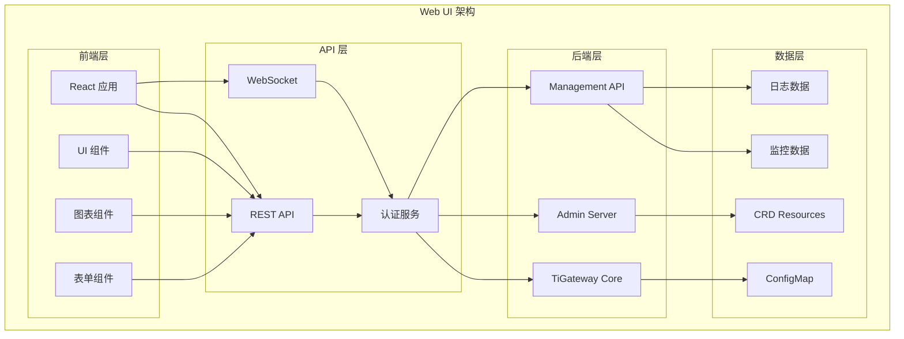

# Web UI 使用指南

TiGateway 提供了功能丰富的 Web 管理界面，让您可以通过直观的图形界面管理路由、监控系统状态和配置网关参数。

## Web UI 概述

### 界面架构



### 核心功能

- **路由管理**: 可视化创建、编辑和删除路由
- **过滤器配置**: 图形化配置各种过滤器
- **监控仪表板**: 实时监控系统状态和性能
- **配置管理**: 在线编辑和管理配置
- **用户管理**: 管理用户权限和角色
- **日志查看**: 实时查看和分析日志
- **链路追踪**: 可视化分布式链路追踪

## 界面导航

### 1. 主菜单

```typescript
interface MainMenu {
  dashboard: {
    title: "仪表板";
    icon: "dashboard";
    path: "/dashboard";
  };
  routes: {
    title: "路由管理";
    icon: "route";
    path: "/routes";
    children: {
      list: { title: "路由列表"; path: "/routes/list"; };
      create: { title: "创建路由"; path: "/routes/create"; };
      edit: { title: "编辑路由"; path: "/routes/edit/:id"; };
    };
  };
  filters: {
    title: "过滤器";
    icon: "filter";
    path: "/filters";
    children: {
      global: { title: "全局过滤器"; path: "/filters/global"; };
      route: { title: "路由过滤器"; path: "/filters/route"; };
    };
  };
  monitoring: {
    title: "监控";
    icon: "monitor";
    path: "/monitoring";
    children: {
      metrics: { title: "指标监控"; path: "/monitoring/metrics"; };
      logs: { title: "日志查看"; path: "/monitoring/logs"; };
      traces: { title: "链路追踪"; path: "/monitoring/traces"; };
    };
  };
  configuration: {
    title: "配置管理";
    icon: "config";
    path: "/configuration";
    children: {
      general: { title: "通用配置"; path: "/configuration/general"; };
      security: { title: "安全配置"; path: "/configuration/security"; };
      performance: { title: "性能配置"; path: "/configuration/performance"; };
    };
  };
  users: {
    title: "用户管理";
    icon: "user";
    path: "/users";
    children: {
      list: { title: "用户列表"; path: "/users/list"; };
      roles: { title: "角色管理"; path: "/users/roles"; };
      permissions: { title: "权限管理"; path: "/users/permissions"; };
    };
  };
}
```

### 2. 面包屑导航

```typescript
interface BreadcrumbItem {
  title: string;
  path?: string;
  icon?: string;
}

// 示例：路由编辑页面
const breadcrumbItems: BreadcrumbItem[] = [
  { title: "首页", path: "/", icon: "home" },
  { title: "路由管理", path: "/routes" },
  { title: "路由列表", path: "/routes/list" },
  { title: "编辑路由", icon: "edit" }
];
```

## 路由管理

### 1. 路由列表

路由列表页面显示所有已配置的路由，支持搜索、筛选和排序。

```typescript
interface RouteListItem {
  id: string;
  name: string;
  uri: string;
  predicates: Predicate[];
  filters: Filter[];
  status: "active" | "inactive" | "error";
  lastModified: string;
  createdBy: string;
}

// 路由列表组件
const RouteList: React.FC = () => {
  const [routes, setRoutes] = useState<RouteListItem[]>([]);
  const [loading, setLoading] = useState(false);
  const [searchTerm, setSearchTerm] = useState("");
  const [statusFilter, setStatusFilter] = useState<string>("all");

  return (
    <div className="route-list">
      <div className="toolbar">
        <SearchInput 
          value={searchTerm}
          onChange={setSearchTerm}
          placeholder="搜索路由..."
        />
        <StatusFilter 
          value={statusFilter}
          onChange={setStatusFilter}
          options={[
            { value: "all", label: "全部" },
            { value: "active", label: "活跃" },
            { value: "inactive", label: "非活跃" },
            { value: "error", label: "错误" }
          ]}
        />
        <Button 
          type="primary" 
          icon="plus"
          onClick={() => navigate("/routes/create")}
        >
          创建路由
        </Button>
      </div>
      
      <Table
        dataSource={filteredRoutes}
        columns={[
          {
            title: "路由 ID",
            dataIndex: "id",
            key: "id",
            render: (id: string) => (
              <Link to={`/routes/edit/${id}`}>{id}</Link>
            )
          },
          {
            title: "名称",
            dataIndex: "name",
            key: "name"
          },
          {
            title: "目标 URI",
            dataIndex: "uri",
            key: "uri"
          },
          {
            title: "状态",
            dataIndex: "status",
            key: "status",
            render: (status: string) => (
              <StatusTag status={status} />
            )
          },
          {
            title: "最后修改",
            dataIndex: "lastModified",
            key: "lastModified",
            render: (date: string) => formatDate(date)
          },
          {
            title: "操作",
            key: "actions",
            render: (_, record: RouteListItem) => (
              <ActionButtons record={record} />
            )
          }
        ]}
        loading={loading}
        pagination={{
          pageSize: 20,
          showSizeChanger: true,
          showQuickJumper: true
        }}
      />
    </div>
  );
};
```

### 2. 路由创建/编辑

路由创建和编辑页面提供直观的表单界面来配置路由。

```typescript
interface RouteFormData {
  id: string;
  name: string;
  uri: string;
  predicates: Predicate[];
  filters: Filter[];
  metadata: Record<string, any>;
}

// 路由表单组件
const RouteForm: React.FC<{ routeId?: string }> = ({ routeId }) => {
  const [form] = Form.useForm<RouteFormData>();
  const [loading, setLoading] = useState(false);
  const [predicates, setPredicates] = useState<Predicate[]>([]);
  const [filters, setFilters] = useState<Filter[]>([]);

  const handleSubmit = async (values: RouteFormData) => {
    setLoading(true);
    try {
      if (routeId) {
        await updateRoute(routeId, values);
      } else {
        await createRoute(values);
      }
      message.success(routeId ? "路由更新成功" : "路由创建成功");
      navigate("/routes/list");
    } catch (error) {
      message.error("操作失败");
    } finally {
      setLoading(false);
    }
  };

  return (
    <div className="route-form">
      <Form
        form={form}
        layout="vertical"
        onFinish={handleSubmit}
        initialValues={initialValues}
      >
        <Card title="基本信息" className="form-section">
          <Form.Item
            name="id"
            label="路由 ID"
            rules={[{ required: true, message: "请输入路由 ID" }]}
          >
            <Input placeholder="例如: user-service-route" />
          </Form.Item>
          
          <Form.Item
            name="name"
            label="路由名称"
            rules={[{ required: true, message: "请输入路由名称" }]}
          >
            <Input placeholder="例如: 用户服务路由" />
          </Form.Item>
          
          <Form.Item
            name="uri"
            label="目标 URI"
            rules={[{ required: true, message: "请输入目标 URI" }]}
          >
            <Input placeholder="例如: lb://user-service" />
          </Form.Item>
        </Card>

        <Card title="断言配置" className="form-section">
          <PredicateBuilder
            predicates={predicates}
            onChange={setPredicates}
          />
        </Card>

        <Card title="过滤器配置" className="form-section">
          <FilterBuilder
            filters={filters}
            onChange={setFilters}
          />
        </Card>

        <Card title="元数据" className="form-section">
          <MetadataEditor
            metadata={form.getFieldValue("metadata") || {}}
            onChange={(metadata) => form.setFieldsValue({ metadata })}
          />
        </Card>

        <div className="form-actions">
          <Button onClick={() => navigate("/routes/list")}>
            取消
          </Button>
          <Button type="primary" htmlType="submit" loading={loading}>
            {routeId ? "更新" : "创建"}
          </Button>
        </div>
      </Form>
    </div>
  );
};
```

### 3. 断言构建器

断言构建器提供图形化界面来配置路由断言。

```typescript
interface Predicate {
  name: string;
  args: Record<string, any>;
}

// 断言构建器组件
const PredicateBuilder: React.FC<{
  predicates: Predicate[];
  onChange: (predicates: Predicate[]) => void;
}> = ({ predicates, onChange }) => {
  const [selectedPredicate, setSelectedPredicate] = useState<string>("");

  const availablePredicates = [
    { name: "Path", description: "路径匹配", icon: "path" },
    { name: "Host", description: "主机匹配", icon: "host" },
    { name: "Method", description: "HTTP 方法匹配", icon: "method" },
    { name: "Header", description: "请求头匹配", icon: "header" },
    { name: "Query", description: "查询参数匹配", icon: "query" },
    { name: "Cookie", description: "Cookie 匹配", icon: "cookie" },
    { name: "After", description: "时间后匹配", icon: "time" },
    { name: "Before", description: "时间前匹配", icon: "time" },
    { name: "Between", description: "时间区间匹配", icon: "time" },
    { name: "RemoteAddr", description: "远程地址匹配", icon: "ip" }
  ];

  const addPredicate = (predicateName: string) => {
    const newPredicate: Predicate = {
      name: predicateName,
      args: getDefaultArgs(predicateName)
    };
    onChange([...predicates, newPredicate]);
  };

  const updatePredicate = (index: number, predicate: Predicate) => {
    const newPredicates = [...predicates];
    newPredicates[index] = predicate;
    onChange(newPredicates);
  };

  const removePredicate = (index: number) => {
    const newPredicates = predicates.filter((_, i) => i !== index);
    onChange(newPredicates);
  };

  return (
    <div className="predicate-builder">
      <div className="predicate-selector">
        <Select
          placeholder="选择断言类型"
          value={selectedPredicate}
          onChange={setSelectedPredicate}
          style={{ width: 200 }}
        >
          {availablePredicates.map(predicate => (
            <Select.Option key={predicate.name} value={predicate.name}>
              <Icon type={predicate.icon} />
              {predicate.name} - {predicate.description}
            </Select.Option>
          ))}
        </Select>
        <Button 
          type="primary" 
          onClick={() => addPredicate(selectedPredicate)}
          disabled={!selectedPredicate}
        >
          添加断言
        </Button>
      </div>

      <div className="predicate-list">
        {predicates.map((predicate, index) => (
          <Card key={index} size="small" className="predicate-item">
            <div className="predicate-header">
              <span className="predicate-name">{predicate.name}</span>
              <Button 
                type="text" 
                danger 
                icon="delete"
                onClick={() => removePredicate(index)}
              />
            </div>
            <PredicateConfig
              predicate={predicate}
              onChange={(updatedPredicate) => updatePredicate(index, updatedPredicate)}
            />
          </Card>
        ))}
      </div>
    </div>
  );
};
```

## 监控仪表板

### 1. 系统概览

系统概览页面显示关键指标和系统状态。

```typescript
// 系统概览组件
const SystemOverview: React.FC = () => {
  const [metrics, setMetrics] = useState<SystemMetrics | null>(null);
  const [loading, setLoading] = useState(true);

  useEffect(() => {
    const fetchMetrics = async () => {
      try {
        const data = await api.getSystemMetrics();
        setMetrics(data);
      } catch (error) {
        message.error("获取系统指标失败");
      } finally {
        setLoading(false);
      }
    };

    fetchMetrics();
    const interval = setInterval(fetchMetrics, 30000); // 30秒刷新

    return () => clearInterval(interval);
  }, []);

  if (loading) {
    return <Spin size="large" />;
  }

  return (
    <div className="system-overview">
      <Row gutter={[16, 16]}>
        <Col span={6}>
          <StatCard
            title="总请求数"
            value={metrics?.totalRequests || 0}
            icon="request"
            color="blue"
            trend={metrics?.requestTrend}
          />
        </Col>
        <Col span={6}>
          <StatCard
            title="错误率"
            value={`${(metrics?.errorRate || 0).toFixed(2)}%`}
            icon="error"
            color="red"
            trend={metrics?.errorTrend}
          />
        </Col>
        <Col span={6}>
          <StatCard
            title="平均响应时间"
            value={`${(metrics?.avgResponseTime || 0).toFixed(0)}ms`}
            icon="clock"
            color="green"
            trend={metrics?.responseTimeTrend}
          />
        </Col>
        <Col span={6}>
          <StatCard
            title="活跃连接"
            value={metrics?.activeConnections || 0}
            icon="connection"
            color="orange"
            trend={metrics?.connectionTrend}
          />
        </Col>
      </Row>

      <Row gutter={[16, 16]} style={{ marginTop: 16 }}>
        <Col span={12}>
          <Card title="请求趋势">
            <RequestTrendChart data={metrics?.requestTrendData} />
          </Card>
        </Col>
        <Col span={12}>
          <Card title="响应时间分布">
            <ResponseTimeChart data={metrics?.responseTimeData} />
          </Card>
        </Col>
      </Row>

      <Row gutter={[16, 16]} style={{ marginTop: 16 }}>
        <Col span={24}>
          <Card title="路由状态">
            <RouteStatusTable routes={metrics?.routeStatus} />
          </Card>
        </Col>
      </Row>
    </div>
  );
};
```

### 2. 实时监控

实时监控页面提供实时数据流和告警信息。

```typescript
// 实时监控组件
const RealTimeMonitoring: React.FC = () => {
  const [wsConnection, setWsConnection] = useState<WebSocket | null>(null);
  const [realTimeData, setRealTimeData] = useState<RealTimeData | null>(null);
  const [alerts, setAlerts] = useState<Alert[]>([]);

  useEffect(() => {
    const ws = new WebSocket('ws://localhost:8081/ws/monitoring');
    
    ws.onopen = () => {
      console.log('WebSocket 连接已建立');
      setWsConnection(ws);
    };

    ws.onmessage = (event) => {
      const data = JSON.parse(event.data);
      if (data.type === 'metrics') {
        setRealTimeData(data.payload);
      } else if (data.type === 'alert') {
        setAlerts(prev => [data.payload, ...prev.slice(0, 99)]);
      }
    };

    ws.onclose = () => {
      console.log('WebSocket 连接已关闭');
      setWsConnection(null);
    };

    return () => {
      ws.close();
    };
  }, []);

  return (
    <div className="real-time-monitoring">
      <Row gutter={[16, 16]}>
        <Col span={16}>
          <Card title="实时指标">
            <RealTimeMetricsChart data={realTimeData} />
          </Card>
        </Col>
        <Col span={8}>
          <Card title="实时告警">
            <AlertList alerts={alerts} />
          </Card>
        </Col>
      </Row>

      <Row gutter={[16, 16]} style={{ marginTop: 16 }}>
        <Col span={12}>
          <Card title="请求分布">
            <RequestDistributionChart data={realTimeData?.requestDistribution} />
          </Card>
        </Col>
        <Col span={12}>
          <Card title="错误分析">
            <ErrorAnalysisChart data={realTimeData?.errorAnalysis} />
          </Card>
        </Col>
      </Row>
    </div>
  );
};
```

## 配置管理

### 1. 通用配置

通用配置页面允许用户修改系统的基本配置。

```typescript
// 通用配置组件
const GeneralConfiguration: React.FC = () => {
  const [form] = Form.useForm();
  const [loading, setLoading] = useState(false);
  const [config, setConfig] = useState<GeneralConfig | null>(null);

  useEffect(() => {
    const fetchConfig = async () => {
      try {
        const data = await api.getGeneralConfig();
        setConfig(data);
        form.setFieldsValue(data);
      } catch (error) {
        message.error("获取配置失败");
      }
    };

    fetchConfig();
  }, [form]);

  const handleSave = async (values: GeneralConfig) => {
    setLoading(true);
    try {
      await api.updateGeneralConfig(values);
      message.success("配置保存成功");
    } catch (error) {
      message.error("配置保存失败");
    } finally {
      setLoading(false);
    }
  };

  return (
    <div className="general-configuration">
      <Form
        form={form}
        layout="vertical"
        onFinish={handleSave}
        initialValues={config}
      >
        <Card title="服务器配置" className="config-section">
          <Row gutter={16}>
            <Col span={12}>
              <Form.Item
                name="server.port"
                label="服务器端口"
                rules={[{ required: true, message: "请输入服务器端口" }]}
              >
                <InputNumber min={1} max={65535} style={{ width: '100%' }} />
              </Form.Item>
            </Col>
            <Col span={12}>
              <Form.Item
                name="server.contextPath"
                label="上下文路径"
              >
                <Input placeholder="/api" />
              </Form.Item>
            </Col>
          </Row>
        </Card>

        <Card title="连接配置" className="config-section">
          <Row gutter={16}>
            <Col span={12}>
              <Form.Item
                name="connection.timeout"
                label="连接超时 (毫秒)"
                rules={[{ required: true, message: "请输入连接超时时间" }]}
              >
                <InputNumber min={1000} style={{ width: '100%' }} />
              </Form.Item>
            </Col>
            <Col span={12}>
              <Form.Item
                name="connection.readTimeout"
                label="读取超时 (毫秒)"
                rules={[{ required: true, message: "请输入读取超时时间" }]}
              >
                <InputNumber min={1000} style={{ width: '100%' }} />
              </Form.Item>
            </Col>
          </Row>
        </Card>

        <Card title="日志配置" className="config-section">
          <Row gutter={16}>
            <Col span={12}>
              <Form.Item
                name="logging.level"
                label="日志级别"
                rules={[{ required: true, message: "请选择日志级别" }]}
              >
                <Select>
                  <Select.Option value="DEBUG">DEBUG</Select.Option>
                  <Select.Option value="INFO">INFO</Select.Option>
                  <Select.Option value="WARN">WARN</Select.Option>
                  <Select.Option value="ERROR">ERROR</Select.Option>
                </Select>
              </Form.Item>
            </Col>
            <Col span={12}>
              <Form.Item
                name="logging.maxFileSize"
                label="最大文件大小 (MB)"
                rules={[{ required: true, message: "请输入最大文件大小" }]}
              >
                <InputNumber min={1} max={1024} style={{ width: '100%' }} />
              </Form.Item>
            </Col>
          </Row>
        </Card>

        <div className="config-actions">
          <Button type="primary" htmlType="submit" loading={loading}>
            保存配置
          </Button>
          <Button onClick={() => form.resetFields()}>
            重置
          </Button>
        </div>
      </Form>
    </div>
  );
};
```

## 用户管理

### 1. 用户列表

用户列表页面显示所有用户及其权限信息。

```typescript
// 用户列表组件
const UserList: React.FC = () => {
  const [users, setUsers] = useState<User[]>([]);
  const [loading, setLoading] = useState(false);
  const [selectedUsers, setSelectedUsers] = useState<string[]>([]);

  const columns = [
    {
      title: "用户名",
      dataIndex: "username",
      key: "username",
      render: (username: string, record: User) => (
        <Link to={`/users/edit/${record.id}`}>{username}</Link>
      )
    },
    {
      title: "邮箱",
      dataIndex: "email",
      key: "email"
    },
    {
      title: "角色",
      dataIndex: "roles",
      key: "roles",
      render: (roles: string[]) => (
        <div>
          {roles.map(role => (
            <Tag key={role} color="blue">{role}</Tag>
          ))}
        </div>
      )
    },
    {
      title: "状态",
      dataIndex: "status",
      key: "status",
      render: (status: string) => (
        <StatusTag status={status} />
      )
    },
    {
      title: "最后登录",
      dataIndex: "lastLogin",
      key: "lastLogin",
      render: (date: string) => formatDate(date)
    },
    {
      title: "操作",
      key: "actions",
      render: (_, record: User) => (
        <Space>
          <Button 
            type="link" 
            size="small"
            onClick={() => navigate(`/users/edit/${record.id}`)}
          >
            编辑
          </Button>
          <Button 
            type="link" 
            size="small" 
            danger
            onClick={() => handleDelete(record.id)}
          >
            删除
          </Button>
        </Space>
      )
    }
  ];

  return (
    <div className="user-list">
      <div className="toolbar">
        <Button 
          type="primary" 
          icon="plus"
          onClick={() => navigate("/users/create")}
        >
          创建用户
        </Button>
        <Button 
          danger
          disabled={selectedUsers.length === 0}
          onClick={handleBatchDelete}
        >
          批量删除
        </Button>
      </div>

      <Table
        dataSource={users}
        columns={columns}
        loading={loading}
        rowSelection={{
          selectedRowKeys: selectedUsers,
          onChange: setSelectedUsers
        }}
        pagination={{
          pageSize: 20,
          showSizeChanger: true,
          showQuickJumper: true
        }}
      />
    </div>
  );
};
```

## 最佳实践

### 1. 界面使用建议

```yaml
# Web UI 使用最佳实践
web-ui:
  best-practices:
    # 路由管理
    route-management:
      - 使用有意义的路由 ID 和名称
      - 合理配置断言和过滤器
      - 定期检查和优化路由性能
      - 使用路由分组和标签
    
    # 监控使用
    monitoring:
      - 设置合适的刷新间隔
      - 关注关键指标趋势
      - 及时响应告警信息
      - 定期分析性能数据
    
    # 配置管理
    configuration:
      - 修改配置前先备份
      - 分步骤进行配置更改
      - 测试配置更改的影响
      - 记录配置更改历史
    
    # 用户管理
    user-management:
      - 遵循最小权限原则
      - 定期审查用户权限
      - 使用强密码策略
      - 启用多因素认证
```

### 2. 性能优化

```typescript
// Web UI 性能优化配置
const performanceConfig = {
  // 数据加载优化
  dataLoading: {
    pageSize: 20,
    debounceTime: 300,
    cacheTimeout: 300000, // 5分钟
    prefetchEnabled: true
  },
  
  // 图表渲染优化
  chartRendering: {
    maxDataPoints: 1000,
    animationEnabled: false,
    responsiveEnabled: true,
    lazyLoading: true
  },
  
  // 实时数据优化
  realTimeData: {
    updateInterval: 5000, // 5秒
    maxBufferSize: 100,
    compressionEnabled: true
  }
};
```

## 故障排除

### 1. 常见问题

#### 界面无法访问
```bash
# 检查服务状态
kubectl get pods -n tigateway | grep admin

# 检查端口配置
kubectl get svc -n tigateway | grep admin

# 检查日志
kubectl logs -f deployment/tigateway-admin -n tigateway
```

#### 数据加载失败
```bash
# 检查 API 连接
kubectl exec -it deployment/tigateway-admin -n tigateway -- curl http://localhost:8080/api/health

# 检查数据库连接
kubectl exec -it deployment/tigateway-admin -n tigateway -- curl http://localhost:8080/api/config

# 检查网络连接
kubectl exec -it deployment/tigateway-admin -n tigateway -- ping tigateway-core
```

#### 权限问题
```bash
# 检查用户权限
kubectl exec -it deployment/tigateway-admin -n tigateway -- curl http://localhost:8080/api/users/current

# 检查角色配置
kubectl exec -it deployment/tigateway-admin -n tigateway -- curl http://localhost:8080/api/roles

# 检查权限配置
kubectl exec -it deployment/tigateway-admin -n tigateway -- curl http://localhost:8080/api/permissions
```

## 总结

TiGateway 的 Web UI 提供了直观易用的管理界面：

1. **路由管理**: 可视化创建、编辑和管理路由配置
2. **监控仪表板**: 实时监控系统状态和性能指标
3. **配置管理**: 在线编辑和管理系统配置
4. **用户管理**: 管理用户权限和角色
5. **实时数据**: 支持实时数据流和 WebSocket 连接
6. **响应式设计**: 适配不同屏幕尺寸的设备
7. **权限控制**: 基于角色的访问控制
8. **性能优化**: 优化的数据加载和渲染性能
9. **故障排除**: 完整的故障排除指南

通过 Web UI，用户可以方便地管理 TiGateway 的各个方面，提高运维效率和管理体验。
