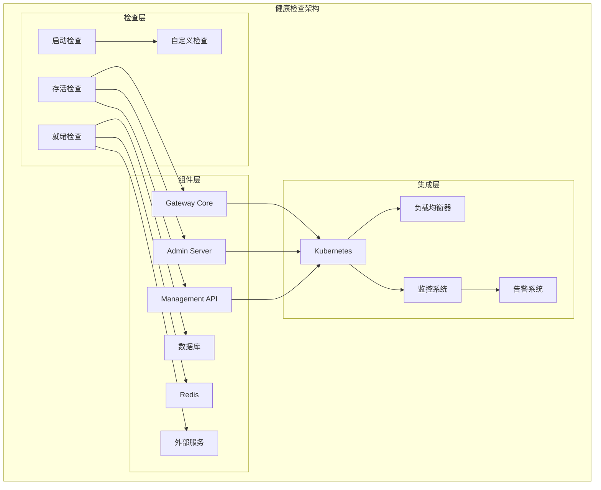

# 健康检查

TiGateway 提供了全面的健康检查机制，确保系统各个组件的正常运行状态，支持 Kubernetes 原生的健康检查集成。

## 健康检查概述

### 架构设计



### 核心特性

- **多层级检查**: 支持存活、就绪和启动检查
- **组件健康**: 检查各个组件的健康状态
- **依赖检查**: 检查外部依赖服务的可用性
- **自定义检查**: 支持自定义健康检查逻辑
- **Kubernetes 集成**: 原生支持 K8s 健康检查
- **监控集成**: 与监控系统集成
- **告警支持**: 支持健康状态告警

## 健康检查类型

### 1. 存活检查 (Liveness Probe)

存活检查用于确定应用程序是否正在运行。

```java
@Component
public class LivenessHealthIndicator implements HealthIndicator {
    
    @Override
    public Health health() {
        try {
            // 检查应用程序基本状态
            if (isApplicationRunning()) {
                return Health.up()
                    .withDetail("status", "Application is running")
                    .withDetail("timestamp", Instant.now())
                    .build();
            } else {
                return Health.down()
                    .withDetail("status", "Application is not running")
                    .withDetail("timestamp", Instant.now())
                    .build();
            }
        } catch (Exception e) {
            return Health.down()
                .withDetail("status", "Application error")
                .withDetail("error", e.getMessage())
                .withDetail("timestamp", Instant.now())
                .build();
        }
    }
    
    private boolean isApplicationRunning() {
        // 检查应用程序基本状态
        return true; // 简化实现
    }
}
```

### 2. 就绪检查 (Readiness Probe)

就绪检查用于确定应用程序是否准备好接收流量。

```java
@Component
public class ReadinessHealthIndicator implements HealthIndicator {
    
    @Autowired
    private DatabaseHealthIndicator databaseHealthIndicator;
    
    @Autowired
    private RedisHealthIndicator redisHealthIndicator;
    
    @Autowired
    private ExternalServiceHealthIndicator externalServiceHealthIndicator;
    
    @Override
    public Health health() {
        Health.Builder builder = Health.up();
        boolean isReady = true;
        
        // 检查数据库连接
        Health dbHealth = databaseHealthIndicator.health();
        builder.withDetail("database", dbHealth.getStatus());
        if (dbHealth.getStatus() != Status.UP) {
            isReady = false;
        }
        
        // 检查 Redis 连接
        Health redisHealth = redisHealthIndicator.health();
        builder.withDetail("redis", redisHealth.getStatus());
        if (redisHealth.getStatus() != Status.UP) {
            isReady = false;
        }
        
        // 检查外部服务
        Health externalHealth = externalServiceHealthIndicator.health();
        builder.withDetail("externalServices", externalHealth.getStatus());
        if (externalHealth.getStatus() != Status.UP) {
            isReady = false;
        }
        
        builder.withDetail("timestamp", Instant.now());
        
        return isReady ? builder.build() : builder.down().build();
    }
}
```

### 3. 启动检查 (Startup Probe)

启动检查用于确定应用程序是否已经启动完成。

```java
@Component
public class StartupHealthIndicator implements HealthIndicator {
    
    @Value("${tigateway.startup.timeout:60}")
    private int startupTimeoutSeconds;
    
    private final long startupTime = System.currentTimeMillis();
    
    @Override
    public Health health() {
        long currentTime = System.currentTimeMillis();
        long elapsedTime = (currentTime - startupTime) / 1000;
        
        if (elapsedTime < startupTimeoutSeconds) {
            return Health.up()
                .withDetail("status", "Application is starting")
                .withDetail("elapsedTime", elapsedTime + "s")
                .withDetail("timeout", startupTimeoutSeconds + "s")
                .build();
        } else {
            return Health.down()
                .withDetail("status", "Application startup timeout")
                .withDetail("elapsedTime", elapsedTime + "s")
                .withDetail("timeout", startupTimeoutSeconds + "s")
                .build();
        }
    }
}
```

## 组件健康检查

### 1. 数据库健康检查

```java
@Component
public class DatabaseHealthIndicator implements HealthIndicator {
    
    @Autowired
    private DataSource dataSource;
    
    @Override
    public Health health() {
        try {
            // 检查数据库连接
            try (Connection connection = dataSource.getConnection()) {
                if (connection.isValid(5)) {
                    return Health.up()
                        .withDetail("database", "Available")
                        .withDetail("url", connection.getMetaData().getURL())
                        .withDetail("driver", connection.getMetaData().getDriverName())
                        .withDetail("version", connection.getMetaData().getDatabaseProductVersion())
                        .build();
                } else {
                    return Health.down()
                        .withDetail("database", "Connection invalid")
                        .build();
                }
            }
        } catch (SQLException e) {
            return Health.down()
                .withDetail("database", "Connection failed")
                .withDetail("error", e.getMessage())
                .build();
        }
    }
}
```

### 2. Redis 健康检查

```java
@Component
public class RedisHealthIndicator implements HealthIndicator {
    
    @Autowired
    private RedisTemplate<String, String> redisTemplate;
    
    @Override
    public Health health() {
        try {
            // 执行简单的 Redis 操作
            String testKey = "health:check:" + System.currentTimeMillis();
            redisTemplate.opsForValue().set(testKey, "test", Duration.ofSeconds(10));
            String value = redisTemplate.opsForValue().get(testKey);
            redisTemplate.delete(testKey);
            
            if ("test".equals(value)) {
                return Health.up()
                    .withDetail("redis", "Available")
                    .withDetail("operation", "Read/Write test successful")
                    .build();
            } else {
                return Health.down()
                    .withDetail("redis", "Read/Write test failed")
                    .build();
            }
        } catch (Exception e) {
            return Health.down()
                .withDetail("redis", "Connection failed")
                .withDetail("error", e.getMessage())
                .build();
        }
    }
}
```

### 3. 外部服务健康检查

```java
@Component
public class ExternalServiceHealthIndicator implements HealthIndicator {
    
    @Autowired
    private WebClient webClient;
    
    @Value("${tigateway.health.external.services}")
    private List<String> externalServices;
    
    @Override
    public Health health() {
        Health.Builder builder = Health.up();
        boolean allServicesUp = true;
        
        for (String service : externalServices) {
            try {
                Health serviceHealth = checkService(service);
                builder.withDetail(service, serviceHealth.getStatus());
                if (serviceHealth.getStatus() != Status.UP) {
                    allServicesUp = false;
                }
            } catch (Exception e) {
                builder.withDetail(service, Status.DOWN);
                builder.withDetail(service + ".error", e.getMessage());
                allServicesUp = false;
            }
        }
        
        return allServicesUp ? builder.build() : builder.down().build();
    }
    
    private Health checkService(String serviceUrl) {
        try {
            String response = webClient.get()
                .uri(serviceUrl + "/health")
                .retrieve()
                .bodyToMono(String.class)
                .timeout(Duration.ofSeconds(5))
                .block();
            
            if (response != null && response.contains("UP")) {
                return Health.up()
                    .withDetail("url", serviceUrl)
                    .withDetail("response", response)
                    .build();
            } else {
                return Health.down()
                    .withDetail("url", serviceUrl)
                    .withDetail("response", response)
                    .build();
            }
        } catch (Exception e) {
            return Health.down()
                .withDetail("url", serviceUrl)
                .withDetail("error", e.getMessage())
                .build();
        }
    }
}
```

## 自定义健康检查

### 1. 业务健康检查

```java
@Component
public class BusinessHealthIndicator implements HealthIndicator {
    
    @Autowired
    private RouteService routeService;
    
    @Autowired
    private FilterService filterService;
    
    @Override
    public Health health() {
        Health.Builder builder = Health.up();
        
        try {
            // 检查路由配置
            List<Route> routes = routeService.getAllRoutes();
            builder.withDetail("routes.total", routes.size());
            
            long activeRoutes = routes.stream()
                .filter(route -> "active".equals(route.getStatus()))
                .count();
            builder.withDetail("routes.active", activeRoutes);
            
            // 检查过滤器配置
            List<Filter> filters = filterService.getAllFilters();
            builder.withDetail("filters.total", filters.size());
            
            // 检查配置完整性
            boolean configValid = validateConfiguration(routes, filters);
            if (!configValid) {
                builder.down().withDetail("config", "Invalid configuration");
            }
            
        } catch (Exception e) {
            builder.down()
                .withDetail("error", e.getMessage())
                .withDetail("timestamp", Instant.now());
        }
        
        return builder.build();
    }
    
    private boolean validateConfiguration(List<Route> routes, List<Filter> filters) {
        // 验证配置的完整性
        for (Route route : routes) {
            if (route.getUri() == null || route.getUri().isEmpty()) {
                return false;
            }
            if (route.getPredicates() == null || route.getPredicates().isEmpty()) {
                return false;
            }
        }
        return true;
    }
}
```

### 2. 性能健康检查

```java
@Component
public class PerformanceHealthIndicator implements HealthIndicator {
    
    @Autowired
    private MeterRegistry meterRegistry;
    
    @Value("${tigateway.health.performance.threshold.responseTime:1000}")
    private long responseTimeThreshold;
    
    @Value("${tigateway.health.performance.threshold.errorRate:0.05}")
    private double errorRateThreshold;
    
    @Override
    public Health health() {
        Health.Builder builder = Health.up();
        
        try {
            // 检查响应时间
            Timer responseTimer = meterRegistry.find("tigateway.requests.duration").timer();
            if (responseTimer != null) {
                double avgResponseTime = responseTimer.mean(TimeUnit.MILLISECONDS);
                builder.withDetail("avgResponseTime", avgResponseTime + "ms");
                
                if (avgResponseTime > responseTimeThreshold) {
                    builder.down().withDetail("performance", "High response time");
                }
            }
            
            // 检查错误率
            Counter totalRequests = meterRegistry.find("tigateway.requests.total").counter();
            Counter errorRequests = meterRegistry.find("tigateway.requests.errors").counter();
            
            if (totalRequests != null && errorRequests != null) {
                double totalCount = totalRequests.count();
                double errorCount = errorRequests.count();
                double errorRate = totalCount > 0 ? errorCount / totalCount : 0;
                
                builder.withDetail("errorRate", String.format("%.2f%%", errorRate * 100));
                
                if (errorRate > errorRateThreshold) {
                    builder.down().withDetail("performance", "High error rate");
                }
            }
            
            // 检查内存使用
            MemoryMXBean memoryBean = ManagementFactory.getMemoryMXBean();
            MemoryUsage heapUsage = memoryBean.getHeapMemoryUsage();
            double memoryUsage = (double) heapUsage.getUsed() / heapUsage.getMax();
            
            builder.withDetail("memoryUsage", String.format("%.2f%%", memoryUsage * 100));
            
            if (memoryUsage > 0.9) {
                builder.down().withDetail("performance", "High memory usage");
            }
            
        } catch (Exception e) {
            builder.down()
                .withDetail("error", e.getMessage())
                .withDetail("timestamp", Instant.now());
        }
        
        return builder.build();
    }
}
```

## Kubernetes 集成

### 1. 部署配置

```yaml
apiVersion: apps/v1
kind: Deployment
metadata:
  name: tigateway
  namespace: tigateway
spec:
  replicas: 3
  selector:
    matchLabels:
      app: tigateway
  template:
    metadata:
      labels:
        app: tigateway
    spec:
      containers:
      - name: tigateway
        image: tigateway:latest
        ports:
        - containerPort: 8080
          name: gateway
        - containerPort: 8081
          name: admin
        - containerPort: 8090
          name: management
        
        # 存活检查
        livenessProbe:
          httpGet:
            path: /actuator/health/liveness
            port: 8090
          initialDelaySeconds: 30
          periodSeconds: 10
          timeoutSeconds: 5
          failureThreshold: 3
        
        # 就绪检查
        readinessProbe:
          httpGet:
            path: /actuator/health/readiness
            port: 8090
          initialDelaySeconds: 5
          periodSeconds: 5
          timeoutSeconds: 3
          failureThreshold: 3
        
        # 启动检查
        startupProbe:
          httpGet:
            path: /actuator/health/startup
            port: 8090
          initialDelaySeconds: 10
          periodSeconds: 5
          timeoutSeconds: 3
          failureThreshold: 12
        
        # 资源限制
        resources:
          requests:
            memory: "512Mi"
            cpu: "250m"
          limits:
            memory: "1Gi"
            cpu: "500m"
        
        # 环境变量
        env:
        - name: SPRING_PROFILES_ACTIVE
          value: "kubernetes"
        - name: TIGATEWAY_HEALTH_EXTERNAL_SERVICES
          value: "http://user-service:8080,http://order-service:8080"
```

### 2. 服务配置

```yaml
apiVersion: v1
kind: Service
metadata:
  name: tigateway
  namespace: tigateway
spec:
  selector:
    app: tigateway
  ports:
  - name: gateway
    port: 8080
    targetPort: 8080
  - name: admin
    port: 8081
    targetPort: 8081
  - name: management
    port: 8090
    targetPort: 8090
  type: ClusterIP
```

### 3. Ingress 配置

```yaml
apiVersion: networking.k8s.io/v1
kind: Ingress
metadata:
  name: tigateway-ingress
  namespace: tigateway
  annotations:
    nginx.ingress.kubernetes.io/health-check-path: /actuator/health
    nginx.ingress.kubernetes.io/health-check-interval: 10s
    nginx.ingress.kubernetes.io/health-check-timeout: 5s
spec:
  rules:
  - host: tigateway.example.com
    http:
      paths:
      - path: /
        pathType: Prefix
        backend:
          service:
            name: tigateway
            port:
              number: 8080
```

## 健康检查配置

### 1. 应用配置

```yaml
# application.yml
management:
  endpoints:
    web:
      exposure:
        include: health,info,metrics
      base-path: /actuator
  endpoint:
    health:
      show-details: always
      show-components: always
      probes:
        enabled: true
  health:
    defaults:
      enabled: true
    diskspace:
      enabled: true
      threshold: 100MB
    db:
      enabled: true
    redis:
      enabled: true
    circuitbreakers:
      enabled: true

# 自定义健康检查配置
tigateway:
  health:
    # 检查间隔
    check-interval: 30s
    
    # 超时时间
    timeout: 10s
    
    # 外部服务检查
    external:
      services:
      - "http://user-service:8080/health"
      - "http://order-service:8080/health"
      - "http://payment-service:8080/health"
      timeout: 5s
      interval: 60s
    
    # 性能阈值
    performance:
      response-time-threshold: 1000ms
      error-rate-threshold: 0.05
      memory-usage-threshold: 0.9
      cpu-usage-threshold: 0.8
    
    # 业务检查
    business:
      enabled: true
      check-routes: true
      check-filters: true
      validate-config: true
```

### 2. 健康检查规则

```yaml
# 健康检查规则配置
apiVersion: v1
kind: ConfigMap
metadata:
  name: tigateway-health-rules
  namespace: tigateway
data:
  health-rules.yml: |
    health:
      rules:
        # 存活检查规则
        liveness:
          enabled: true
          checks:
          - name: "application"
            type: "basic"
            timeout: 5s
          - name: "jvm"
            type: "jvm"
            timeout: 3s
        
        # 就绪检查规则
        readiness:
          enabled: true
          checks:
          - name: "database"
            type: "database"
            timeout: 5s
            required: true
          - name: "redis"
            type: "redis"
            timeout: 3s
            required: true
          - name: "external-services"
            type: "external"
            timeout: 10s
            required: false
        
        # 启动检查规则
        startup:
          enabled: true
          timeout: 60s
          checks:
          - name: "configuration"
            type: "config"
            timeout: 10s
          - name: "routes"
            type: "routes"
            timeout: 5s
      
      # 告警配置
      alerting:
        enabled: true
        channels:
        - type: webhook
          url: "http://alertmanager:9093/api/v1/alerts"
        - type: email
          recipients:
          - "admin@tigateway.com"
        
        rules:
        - name: "health-check-failed"
          condition: "health_status == 'DOWN'"
          severity: "critical"
          duration: "1m"
        - name: "performance-degraded"
          condition: "response_time > 1000ms OR error_rate > 0.05"
          severity: "warning"
          duration: "5m"
```

## 监控和告警

### 1. 健康检查指标

```java
@Component
public class HealthCheckMetrics {
    
    private final MeterRegistry meterRegistry;
    private final Counter healthCheckCounter;
    private final Timer healthCheckTimer;
    private final Gauge healthStatusGauge;
    
    public HealthCheckMetrics(MeterRegistry meterRegistry) {
        this.meterRegistry = meterRegistry;
        this.healthCheckCounter = Counter.builder("tigateway_health_checks_total")
            .description("Total number of health checks")
            .register(meterRegistry);
        this.healthCheckTimer = Timer.builder("tigateway_health_checks_duration_seconds")
            .description("Health check duration")
            .register(meterRegistry);
        this.healthStatusGauge = Gauge.builder("tigateway_health_status")
            .description("Health status (1=UP, 0=DOWN)")
            .register(meterRegistry);
    }
    
    public void recordHealthCheck(String checkType, String status, Duration duration) {
        Tags tags = Tags.of(
            "check_type", checkType,
            "status", status
        );
        
        healthCheckCounter.increment(tags);
        healthCheckTimer.record(duration, tags);
        
        int statusValue = "UP".equals(status) ? 1 : 0;
        healthStatusGauge.set(statusValue, tags);
    }
}
```

### 2. 健康检查监听器

```java
@Component
public class HealthCheckEventListener {
    
    private static final Logger logger = LoggerFactory.getLogger(HealthCheckEventListener.class);
    
    @Autowired
    private HealthCheckMetrics healthCheckMetrics;
    
    @Autowired
    private AlertService alertService;
    
    @EventListener
    public void handleHealthCheckEvent(HealthCheckEvent event) {
        logger.info("Health check event: {} - {}", event.getCheckType(), event.getStatus());
        
        // 记录指标
        healthCheckMetrics.recordHealthCheck(
            event.getCheckType(),
            event.getStatus(),
            event.getDuration()
        );
        
        // 发送告警
        if ("DOWN".equals(event.getStatus())) {
            Alert alert = new Alert();
            alert.setType("HEALTH_CHECK_FAILED");
            alert.setSeverity("CRITICAL");
            alert.setMessage("Health check failed: " + event.getCheckType());
            alert.setDetails(event.getDetails());
            alert.setTimestamp(Instant.now());
            
            alertService.sendAlert(alert);
        }
    }
}
```

## 最佳实践

### 1. 健康检查设计原则

```yaml
# 健康检查最佳实践配置
apiVersion: v1
kind: ConfigMap
metadata:
  name: tigateway-health-best-practices
  namespace: tigateway
data:
  health-best-practices.yml: |
    health:
      best-practices:
        # 检查设计原则
        design:
          - 检查应该是轻量级的
          - 避免在健康检查中执行耗时操作
          - 检查应该快速失败
          - 提供有意义的错误信息
        
        # 检查频率
        frequency:
          liveness: 10s
          readiness: 5s
          startup: 5s
        
        # 超时配置
        timeout:
          liveness: 5s
          readiness: 3s
          startup: 3s
        
        # 失败阈值
        failure-threshold:
          liveness: 3
          readiness: 3
          startup: 12
        
        # 成功阈值
        success-threshold:
          liveness: 1
          readiness: 1
          startup: 1
        
        # 检查内容
        checks:
          liveness:
            - 应用程序基本状态
            - JVM 状态
            - 内存使用情况
          
          readiness:
            - 数据库连接
            - Redis 连接
            - 外部服务连接
            - 配置完整性
          
          startup:
            - 配置加载
            - 路由初始化
            - 过滤器初始化
```

### 2. 故障恢复策略

```yaml
# 故障恢复策略配置
apiVersion: v1
kind: ConfigMap
metadata:
  name: tigateway-health-recovery
  namespace: tigateway
data:
  recovery-strategy.yml: |
    health:
      recovery:
        # 自动恢复
        auto-recovery:
          enabled: true
          max-attempts: 3
          backoff-interval: 30s
        
        # 降级策略
        degradation:
          enabled: true
          strategies:
          - name: "circuit-breaker"
            condition: "error_rate > 0.5"
            action: "open_circuit"
          - name: "rate-limit"
            condition: "response_time > 2000ms"
            action: "reduce_rate"
          - name: "fallback"
            condition: "external_service_down"
            action: "use_fallback"
        
        # 恢复验证
        recovery-validation:
          enabled: true
          checks:
          - "health_check_pass"
          - "performance_acceptable"
          - "dependencies_available"
```

## 故障排除

### 1. 常见问题

#### 健康检查失败
```bash
# 检查健康检查端点
kubectl exec -it deployment/tigateway -n tigateway -- curl http://localhost:8090/actuator/health

# 检查详细健康信息
kubectl exec -it deployment/tigateway -n tigateway -- curl http://localhost:8090/actuator/health/liveness

# 检查组件健康状态
kubectl exec -it deployment/tigateway -n tigateway -- curl http://localhost:8090/actuator/health/readiness

# 查看健康检查日志
kubectl logs -f deployment/tigateway -n tigateway | grep "health"
```

#### 启动检查超时
```bash
# 检查启动检查配置
kubectl get deployment tigateway -n tigateway -o yaml | grep startupProbe

# 检查启动日志
kubectl logs -f deployment/tigateway -n tigateway | grep "startup"

# 检查配置加载
kubectl exec -it deployment/tigateway -n tigateway -- curl http://localhost:8090/actuator/health/startup
```

#### 就绪检查失败
```bash
# 检查数据库连接
kubectl exec -it deployment/tigateway -n tigateway -- curl http://localhost:8090/actuator/health/db

# 检查 Redis 连接
kubectl exec -it deployment/tigateway -n tigateway -- curl http://localhost:8090/actuator/health/redis

# 检查外部服务
kubectl exec -it deployment/tigateway -n tigateway -- curl http://localhost:8090/actuator/health/external
```

### 2. 调试命令

```bash
# 查看 Pod 健康状态
kubectl get pods -n tigateway -o wide

# 查看 Pod 事件
kubectl describe pod <pod-name> -n tigateway

# 查看健康检查指标
kubectl exec -it deployment/tigateway -n tigateway -- curl http://localhost:8090/actuator/metrics/tigateway.health.checks.total

# 查看健康检查历史
kubectl exec -it deployment/tigateway -n tigateway -- curl http://localhost:8090/actuator/health/history

# 手动触发健康检查
kubectl exec -it deployment/tigateway -n tigateway -- curl -X POST http://localhost:8090/actuator/health/refresh
```

## 总结

TiGateway 的健康检查功能提供了全面的系统健康监控：

1. **多层级检查**: 支持存活、就绪和启动检查
2. **组件健康**: 检查各个组件的健康状态
3. **依赖检查**: 检查外部依赖服务的可用性
4. **自定义检查**: 支持自定义健康检查逻辑
5. **Kubernetes 集成**: 原生支持 K8s 健康检查
6. **监控集成**: 与监控系统集成
7. **告警支持**: 支持健康状态告警
8. **故障恢复**: 提供自动恢复和降级策略
9. **最佳实践**: 遵循健康检查最佳实践

通过健康检查功能，TiGateway 能够确保系统的稳定运行，及时发现和处理问题，提供高可用的服务。
