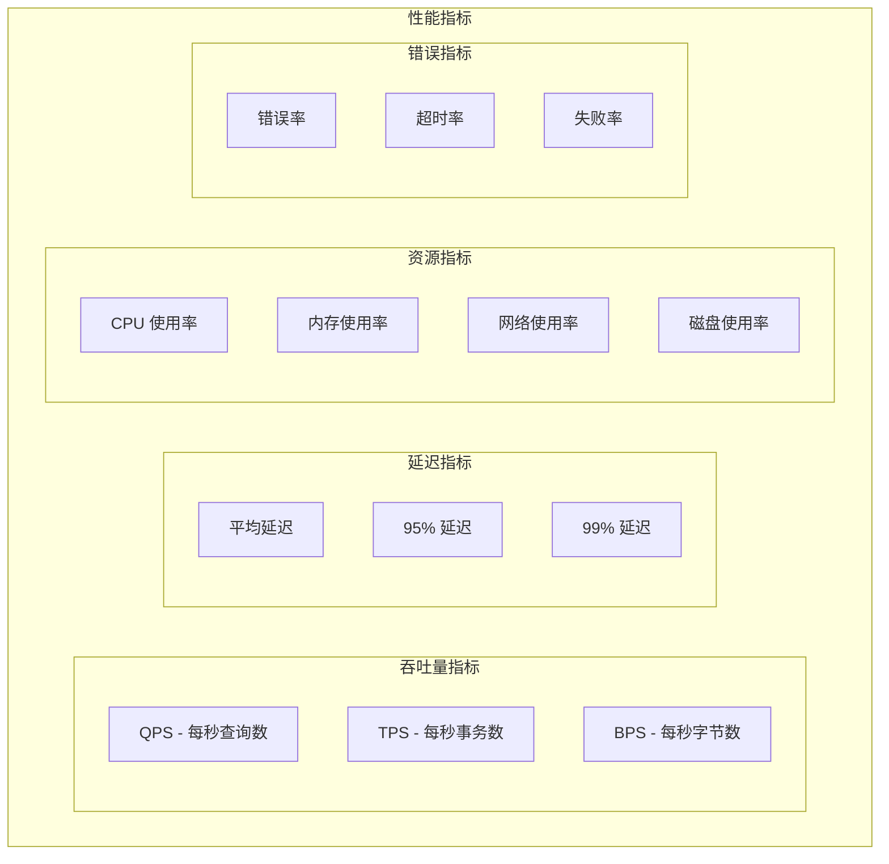
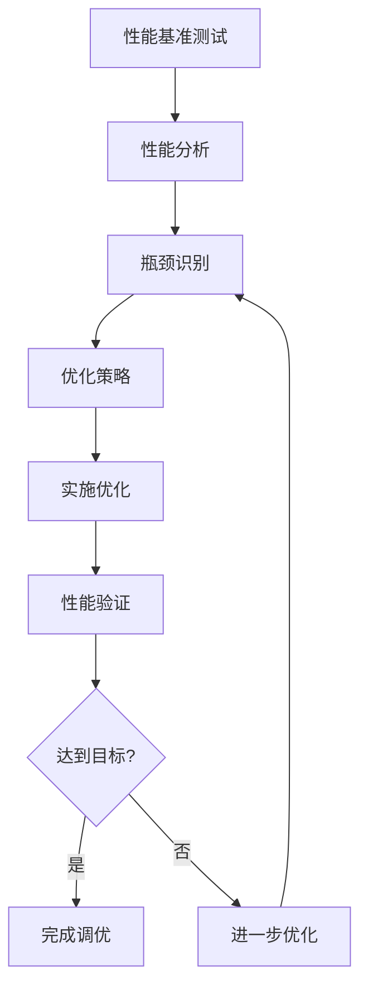

# 性能调优

TiGateway 性能调优指南提供了全面的性能优化策略，帮助您最大化系统吞吐量、降低延迟并提高资源利用率。

## 性能调优概述

### 性能指标



### 性能调优流程



## JVM 性能调优

### 1. 内存调优

#### 堆内存配置

```bash
# 基础内存配置
JAVA_OPTS="-Xms2g -Xmx4g"

# 详细内存配置
JAVA_OPTS="-Xms2g -Xmx4g \
  -XX:NewRatio=3 \
  -XX:SurvivorRatio=8 \
  -XX:MetaspaceSize=256m \
  -XX:MaxMetaspaceSize=512m \
  -XX:MaxDirectMemorySize=1g"
```

#### 垃圾收集器选择

```bash
# G1 垃圾收集器 (推荐)
JAVA_OPTS="-XX:+UseG1GC \
  -XX:MaxGCPauseMillis=200 \
  -XX:G1HeapRegionSize=16m \
  -XX:G1NewSizePercent=30 \
  -XX:G1MaxNewSizePercent=40 \
  -XX:G1MixedGCCountTarget=8 \
  -XX:InitiatingHeapOccupancyPercent=45"

# ZGC 垃圾收集器 (低延迟)
JAVA_OPTS="-XX:+UnlockExperimentalVMOptions \
  -XX:+UseZGC \
  -XX:+UseLargePages \
  -XX:ZCollectionInterval=5"

# Parallel GC (高吞吐量)
JAVA_OPTS="-XX:+UseParallelGC \
  -XX:ParallelGCThreads=8 \
  -XX:MaxGCPauseMillis=100"
```

### 2. JVM 参数优化

```yaml
# JVM 优化配置
apiVersion: v1
kind: ConfigMap
metadata:
  name: tigateway-jvm-config
  namespace: tigateway
data:
  jvm-optimization.yml: |
    jvm:
      # 基础配置
      memory:
        heap:
          initial: "2g"
          maximum: "4g"
        metaspace:
          initial: "256m"
          maximum: "512m"
        direct-memory: "1g"
      
      # GC 配置
      garbage-collection:
        type: "G1GC"
        max-pause-time: "200ms"
        heap-region-size: "16m"
        new-size-percent: 30
        max-new-size-percent: 40
        mixed-gc-count: 8
        initiating-heap-occupancy: 45
      
      # 性能优化
      performance:
        tiered-compilation: true
        compressed-oops: true
        use-biased-locking: true
        use-string-deduplication: true
        aggressive-opts: true
      
      # 监控配置
      monitoring:
        flight-recorder: true
        jmx: true
        gc-logging: true
        heap-dump-on-oom: true
```

## 应用性能调优

### 1. Spring Boot 调优

```yaml
# application.yml
server:
  # 连接器配置
  tomcat:
    # 线程池配置
    threads:
      max: 200
      min-spare: 20
    # 连接配置
    max-connections: 10000
    accept-count: 1000
    connection-timeout: 20000
    # 缓冲区配置
    max-http-post-size: 2MB
    max-http-header-size: 8KB
    # 压缩配置
    compression:
      enabled: true
      mime-types: text/html,text/xml,text/plain,text/css,text/javascript,application/javascript,application/json
      min-response-size: 1024

# Spring Cloud Gateway 配置
spring:
  cloud:
    gateway:
      # HTTP 客户端配置
      httpclient:
        connect-timeout: 5000
        response-timeout: 10000
        pool:
          max-connections: 1000
          max-idle-time: 30s
          max-life-time: 60s
          pending-acquire-timeout: 60s
          pending-acquire-max-count: 1000
        wiretap: false
        compression: true
      
      # 路由配置
      routes:
        - id: optimized-route
          uri: lb://user-service
          predicates:
            - Path=/api/users/**
          filters:
            - name: Retry
              args:
                retries: 3
                statuses: BAD_GATEWAY,GATEWAY_TIMEOUT
                methods: GET,POST
                backoff:
                  first-backoff: 50ms
                  max-backoff: 500ms
                  factor: 2
```

### 2. 响应式编程优化

```java
@Configuration
public class ReactiveOptimizationConfig {
    
    @Bean
    public WebClient.Builder optimizedWebClientBuilder() {
        return WebClient.builder()
            .clientConnector(new ReactorClientHttpConnector(
                HttpClient.create()
                    .option(ChannelOption.CONNECT_TIMEOUT_MILLIS, 5000)
                    .option(ChannelOption.SO_KEEPALIVE, true)
                    .option(ChannelOption.TCP_NODELAY, true)
                    .responseTimeout(Duration.ofSeconds(10))
                    .doOnConnected(conn -> 
                        conn.addHandlerLast(new ReadTimeoutHandler(10))
                            .addHandlerLast(new WriteTimeoutHandler(10)))
            ))
            .codecs(configurer -> {
                configurer.defaultCodecs().maxInMemorySize(1024 * 1024); // 1MB
                configurer.defaultCodecs().enableLoggingRequestDetails(true);
            });
    }
    
    @Bean
    public Scheduler optimizedScheduler() {
        return Schedulers.newBoundedElastic(
            50, // 最大线程数
            1000, // 最大任务队列大小
            "tigateway-optimized"
        );
    }
}
```

### 3. 缓存优化

```java
@Configuration
@EnableCaching
public class CacheOptimizationConfig {
    
    @Bean
    public CacheManager cacheManager() {
        CaffeineCacheManager cacheManager = new CaffeineCacheManager();
        cacheManager.setCaffeine(Caffeine.newBuilder()
            .maximumSize(10000)
            .expireAfterWrite(Duration.ofMinutes(30))
            .expireAfterAccess(Duration.ofMinutes(10))
            .recordStats()
            .build());
        return cacheManager;
    }
    
    @Bean
    public RedisCacheManager redisCacheManager(RedisConnectionFactory connectionFactory) {
        RedisCacheConfiguration config = RedisCacheConfiguration.defaultCacheConfig()
            .entryTtl(Duration.ofMinutes(30))
            .serializeKeysWith(RedisSerializationContext.SerializationPair
                .fromSerializer(new StringRedisSerializer()))
            .serializeValuesWith(RedisSerializationContext.SerializationPair
                .fromSerializer(new GenericJackson2JsonRedisSerializer()));
        
        return RedisCacheManager.builder(connectionFactory)
            .cacheDefaults(config)
            .build();
    }
}
```

## 网络性能调优

### 1. HTTP 连接优化

```yaml
# HTTP 连接优化配置
spring:
  cloud:
    gateway:
      httpclient:
        # 连接池配置
        pool:
          max-connections: 1000
          max-idle-time: 30s
          max-life-time: 60s
          pending-acquire-timeout: 60s
          pending-acquire-max-count: 1000
          eviction-interval: 30s
        
        # 连接配置
        connect-timeout: 5000
        response-timeout: 10000
        read-timeout: 10000
        write-timeout: 10000
        
        # 压缩配置
        compression: true
        compression-level: 6
        
        # 其他优化
        wiretap: false
        follow-redirects: false
        keep-alive: true
```

### 2. 负载均衡优化

```yaml
# 负载均衡优化配置
spring:
  cloud:
    loadbalancer:
      # 负载均衡算法
      algorithm: "round_robin"  # round_robin, random, weighted_round_robin
      
      # 健康检查
      health-check:
        enabled: true
        interval: 30s
        timeout: 5s
        path: "/health"
      
      # 重试配置
      retry:
        enabled: true
        max-attempts: 3
        retry-on-all-operations: false
        retry-on-status-codes: 502, 503, 504
      
      # 缓存配置
      cache:
        enabled: true
        ttl: 30s
        capacity: 1000
```

### 3. 网络缓冲区优化

```java
@Configuration
public class NetworkOptimizationConfig {
    
    @Bean
    public NettyReactiveWebServerFactory nettyReactiveWebServerFactory() {
        NettyReactiveWebServerFactory factory = new NettyReactiveWebServerFactory();
        factory.addServerCustomizers(httpServer -> 
            httpServer.option(ChannelOption.SO_BACKLOG, 1024)
                .option(ChannelOption.SO_REUSEADDR, true)
                .option(ChannelOption.TCP_NODELAY, true)
                .option(ChannelOption.SO_KEEPALIVE, true)
                .childOption(ChannelOption.SO_KEEPALIVE, true)
                .childOption(ChannelOption.TCP_NODELAY, true)
                .childOption(ChannelOption.SO_RCVBUF, 65536)
                .childOption(ChannelOption.SO_SNDBUF, 65536)
        );
        return factory;
    }
}
```

## 数据库性能调优

### 1. 连接池优化

```yaml
# 数据库连接池配置
spring:
  datasource:
    # HikariCP 配置
    hikari:
      # 连接池大小
      maximum-pool-size: 20
      minimum-idle: 5
      
      # 连接超时
      connection-timeout: 30000
      idle-timeout: 600000
      max-lifetime: 1800000
      
      # 性能优化
      leak-detection-threshold: 60000
      validation-timeout: 5000
      connection-test-query: "SELECT 1"
      
      # 其他配置
      auto-commit: true
      read-only: false
      transaction-isolation: "TRANSACTION_READ_COMMITTED"
```

### 2. 查询优化

```java
@Repository
public class OptimizedRouteRepository {
    
    @Autowired
    private JdbcTemplate jdbcTemplate;
    
    // 使用批量查询
    public List<Route> findRoutesByIds(List<String> ids) {
        String sql = "SELECT * FROM routes WHERE id IN (" + 
            ids.stream().map(id -> "?").collect(Collectors.joining(",")) + ")";
        return jdbcTemplate.query(sql, ids.toArray(), new RouteRowMapper());
    }
    
    // 使用分页查询
    public Page<Route> findRoutesWithPagination(int page, int size) {
        String sql = "SELECT * FROM routes ORDER BY created_at DESC LIMIT ? OFFSET ?";
        int offset = page * size;
        List<Route> routes = jdbcTemplate.query(sql, new Object[]{size, offset}, new RouteRowMapper());
        
        String countSql = "SELECT COUNT(*) FROM routes";
        int total = jdbcTemplate.queryForObject(countSql, Integer.class);
        
        return new PageImpl<>(routes, PageRequest.of(page, size), total);
    }
    
    // 使用缓存
    @Cacheable(value = "routes", key = "#id")
    public Route findById(String id) {
        String sql = "SELECT * FROM routes WHERE id = ?";
        return jdbcTemplate.queryForObject(sql, new Object[]{id}, new RouteRowMapper());
    }
}
```

## 缓存性能调优

### 1. Redis 优化

```yaml
# Redis 优化配置
spring:
  redis:
    # 连接配置
    host: redis-server
    port: 6379
    password: ${REDIS_PASSWORD}
    database: 0
    timeout: 2000ms
    
    # 连接池配置
    lettuce:
      pool:
        max-active: 20
        max-idle: 10
        min-idle: 5
        max-wait: 2000ms
      shutdown-timeout: 100ms
    
    # 序列化配置
    serialization:
      key-serializer: "org.springframework.data.redis.serializer.StringRedisSerializer"
      value-serializer: "org.springframework.data.redis.serializer.GenericJackson2JsonRedisSerializer"
```

### 2. 缓存策略优化

```java
@Service
public class OptimizedCacheService {
    
    @Autowired
    private RedisTemplate<String, Object> redisTemplate;
    
    // 多级缓存
    @Cacheable(value = "local", key = "#key")
    public Object getWithLocalCache(String key) {
        return getWithRedisCache(key);
    }
    
    @Cacheable(value = "redis", key = "#key")
    public Object getWithRedisCache(String key) {
        return getFromDatabase(key);
    }
    
    // 缓存预热
    @EventListener(ApplicationReadyEvent.class)
    public void warmupCache() {
        List<String> hotKeys = getHotKeys();
        for (String key : hotKeys) {
            Object value = getFromDatabase(key);
            redisTemplate.opsForValue().set(key, value, Duration.ofHours(1));
        }
    }
    
    // 缓存更新策略
    @CacheEvict(value = "routes", key = "#route.id")
    public void updateRoute(Route route) {
        updateRouteInDatabase(route);
        // 异步更新缓存
        CompletableFuture.runAsync(() -> {
            redisTemplate.opsForValue().set("route:" + route.getId(), route, Duration.ofHours(1));
        });
    }
}
```

## 监控和调优

### 1. 性能监控

```java
@Component
public class PerformanceMonitor {
    
    private final MeterRegistry meterRegistry;
    private final Timer requestTimer;
    private final Counter errorCounter;
    private final Gauge activeConnections;
    
    public PerformanceMonitor(MeterRegistry meterRegistry) {
        this.meterRegistry = meterRegistry;
        this.requestTimer = Timer.builder("tigateway.requests.duration")
            .description("Request processing time")
            .register(meterRegistry);
        this.errorCounter = Counter.builder("tigateway.requests.errors")
            .description("Request errors")
            .register(meterRegistry);
        this.activeConnections = Gauge.builder("tigateway.connections.active")
            .description("Active connections")
            .register(meterRegistry, this, PerformanceMonitor::getActiveConnections);
    }
    
    public void recordRequest(String method, String path, Duration duration, boolean success) {
        Tags tags = Tags.of("method", method, "path", path, "success", String.valueOf(success));
        requestTimer.record(duration, tags);
        
        if (!success) {
            errorCounter.increment(tags);
        }
    }
    
    private int getActiveConnections() {
        // 获取活跃连接数
        return 0; // 简化实现
    }
}
```

### 2. 性能分析

```java
@Component
public class PerformanceAnalyzer {
    
    @Autowired
    private MeterRegistry meterRegistry;
    
    @Scheduled(fixedRate = 60000) // 每分钟分析一次
    public void analyzePerformance() {
        // 分析响应时间
        Timer requestTimer = meterRegistry.find("tigateway.requests.duration").timer();
        if (requestTimer != null) {
            double avgResponseTime = requestTimer.mean(TimeUnit.MILLISECONDS);
            double p95ResponseTime = requestTimer.percentile(0.95, TimeUnit.MILLISECONDS);
            
            if (avgResponseTime > 1000) {
                log.warn("Average response time is high: {}ms", avgResponseTime);
            }
            
            if (p95ResponseTime > 2000) {
                log.warn("95th percentile response time is high: {}ms", p95ResponseTime);
            }
        }
        
        // 分析错误率
        Counter totalRequests = meterRegistry.find("tigateway.requests.total").counter();
        Counter errorRequests = meterRegistry.find("tigateway.requests.errors").counter();
        
        if (totalRequests != null && errorRequests != null) {
            double totalCount = totalRequests.count();
            double errorCount = errorRequests.count();
            double errorRate = totalCount > 0 ? errorCount / totalCount : 0;
            
            if (errorRate > 0.05) {
                log.warn("Error rate is high: {:.2f}%", errorRate * 100);
            }
        }
        
        // 分析内存使用
        MemoryMXBean memoryBean = ManagementFactory.getMemoryMXBean();
        MemoryUsage heapUsage = memoryBean.getHeapMemoryUsage();
        double memoryUsage = (double) heapUsage.getUsed() / heapUsage.getMax();
        
        if (memoryUsage > 0.8) {
            log.warn("Memory usage is high: {:.2f}%", memoryUsage * 100);
        }
    }
}
```

## 负载测试

### 1. 压力测试脚本

```bash
#!/bin/bash
# tigateway-load-test.sh

GATEWAY_URL="http://tigateway.example.com"
CONCURRENT_USERS=100
TEST_DURATION=300s
RAMP_UP_TIME=60s

echo "=== TiGateway 负载测试 ==="
echo "目标URL: $GATEWAY_URL"
echo "并发用户: $CONCURRENT_USERS"
echo "测试时长: $TEST_DURATION"
echo "预热时间: $RAMP_UP_TIME"
echo

# 使用 wrk 进行压力测试
wrk -t12 -c$CONCURRENT_USERS -d$TEST_DURATION --latency $GATEWAY_URL/api/users

echo
echo "=== 详细性能测试 ==="

# 测试不同端点
endpoints=(
    "/api/users"
    "/api/orders"
    "/api/products"
    "/api/health"
)

for endpoint in "${endpoints[@]}"; do
    echo "测试端点: $endpoint"
    wrk -t4 -c50 -d60s --latency $GATEWAY_URL$endpoint
    echo "---"
done
```

### 2. JMeter 测试计划

```xml
<?xml version="1.0" encoding="UTF-8"?>
<jmeterTestPlan version="1.2">
  <hashTree>
    <TestPlan testname="TiGateway Performance Test">
      <elementProp name="TestPlan.arguments" elementType="Arguments" guiclass="ArgumentsPanel">
        <collectionProp name="Arguments.arguments"/>
      </elementProp>
      <stringProp name="TestPlan.user_define_classpath"></stringProp>
      <boolProp name="TestPlan.functional_mode">false</boolProp>
      <boolProp name="TestPlan.serialize_threadgroups">false</boolProp>
      <elementProp name="TestPlan.arguments" elementType="Arguments" guiclass="ArgumentsPanel">
        <collectionProp name="Arguments.arguments"/>
      </elementProp>
      <stringProp name="TestPlan.user_define_classpath"></stringProp>
      <stringProp name="TestPlan.comments">TiGateway Performance Test Plan</stringProp>
      <boolProp name="TestPlan.functional_mode">false</boolProp>
      <boolProp name="TestPlan.serialize_threadgroups">false</boolProp>
    </TestPlan>
    <hashTree>
      <ThreadGroup testname="Gateway Load Test">
        <stringProp name="ThreadGroup.on_sample_error">continue</stringProp>
        <elementProp name="ThreadGroup.main_controller" elementType="LoopController">
          <boolProp name="LoopController.continue_forever">false</boolProp>
          <stringProp name="LoopController.loops">-1</stringProp>
        </elementProp>
        <stringProp name="ThreadGroup.num_threads">100</stringProp>
        <stringProp name="ThreadGroup.ramp_time">60</stringProp>
        <boolProp name="ThreadGroup.scheduler">true</boolProp>
        <stringProp name="ThreadGroup.duration">300</stringProp>
        <stringProp name="ThreadGroup.delay"></stringProp>
      </ThreadGroup>
    </hashTree>
  </hashTree>
</jmeterTestPlan>
```

## 性能调优最佳实践

### 1. 系统级优化

```yaml
# 系统级优化配置
apiVersion: v1
kind: ConfigMap
metadata:
  name: tigateway-performance-optimization
  namespace: tigateway
data:
  performance-optimization.yml: |
    performance:
      # JVM 优化
      jvm:
        heap-size: "4g"
        gc-algorithm: "G1GC"
        gc-pause-time: "200ms"
        metaspace-size: "512m"
      
      # 应用优化
      application:
        thread-pool-size: 200
        connection-pool-size: 1000
        cache-size: 10000
        request-timeout: 10000
      
      # 网络优化
      network:
        tcp-nodelay: true
        so-keepalive: true
        so-reuseaddr: true
        receive-buffer-size: 65536
        send-buffer-size: 65536
      
      # 数据库优化
      database:
        connection-pool-size: 20
        connection-timeout: 30000
        query-timeout: 10000
        batch-size: 1000
      
      # 缓存优化
      cache:
        redis-pool-size: 20
        cache-ttl: 1800
        cache-size: 10000
        compression: true
```

### 2. 监控和告警

```yaml
# 性能监控告警配置
apiVersion: v1
kind: ConfigMap
metadata:
  name: tigateway-performance-alerts
  namespace: tigateway
data:
  performance-alerts.yml: |
    alerts:
      # 性能告警
      - name: "HighResponseTime"
        condition: "histogram_quantile(0.95, rate(tigateway_requests_duration_seconds_bucket[5m])) > 2"
        severity: "warning"
        duration: "2m"
        description: "95th percentile response time is high"
      
      - name: "HighErrorRate"
        condition: "rate(tigateway_requests_errors_total[5m]) / rate(tigateway_requests_total[5m]) > 0.05"
        severity: "critical"
        duration: "1m"
        description: "Error rate is high"
      
      - name: "HighMemoryUsage"
        condition: "jvm_memory_used_bytes / jvm_memory_max_bytes > 0.8"
        severity: "warning"
        duration: "5m"
        description: "Memory usage is high"
      
      - name: "HighCPUUsage"
        condition: "rate(process_cpu_seconds_total[5m]) > 0.8"
        severity: "warning"
        duration: "5m"
        description: "CPU usage is high"
      
      - name: "LowThroughput"
        condition: "rate(tigateway_requests_total[5m]) < 100"
        severity: "info"
        duration: "10m"
        description: "Throughput is low"
```

## 总结

TiGateway 性能调优指南提供了全面的性能优化策略：

1. **JVM 性能调优**: 内存配置、垃圾收集器选择和参数优化
2. **应用性能调优**: Spring Boot 配置、响应式编程优化和缓存策略
3. **网络性能调优**: HTTP 连接优化、负载均衡和缓冲区配置
4. **数据库性能调优**: 连接池优化和查询优化
5. **缓存性能调优**: Redis 优化和缓存策略
6. **监控和调优**: 性能监控、分析和告警
7. **负载测试**: 压力测试和性能验证
8. **最佳实践**: 系统级优化和监控告警

通过系统化的性能调优方法，可以显著提升 TiGateway 的性能表现，满足高并发、低延迟的业务需求。
