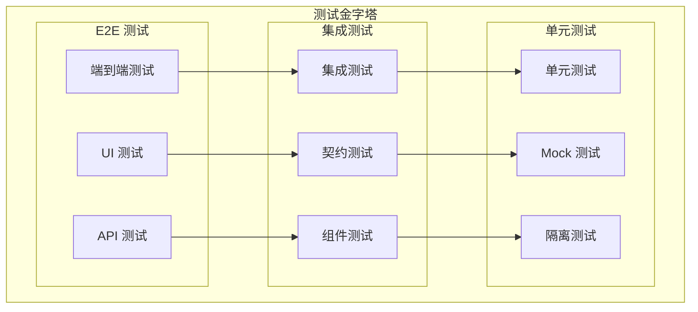
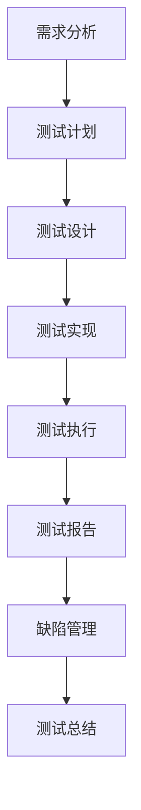

# 测试指南

TiGateway 测试指南提供了完整的测试策略和方法，帮助您构建可靠的测试体系，确保系统的质量和稳定性。

## 测试概述

### 测试金字塔



### 测试策略



## 单元测试

### 1. 过滤器测试

```java
/**
 * 自定义过滤器单元测试
 */
@ExtendWith(MockitoExtension.class)
class CustomHeaderGatewayFilterTest {
    
    @Mock
    private ServerWebExchange exchange;
    
    @Mock
    private GatewayFilterChain chain;
    
    @Mock
    private ServerHttpRequest request;
    
    @Mock
    private ServerHttpRequest.Builder requestBuilder;
    
    @Mock
    private ServerHttpResponse response;
    
    @Test
    void testCustomHeaderFilter() {
        // 准备测试数据
        String headerName = "X-Custom-Header";
        String headerValue = "TiGateway";
        int order = 1;
        
        CustomHeaderGatewayFilter filter = new CustomHeaderGatewayFilter(headerName, headerValue, order);
        
        // 模拟请求
        when(exchange.getRequest()).thenReturn(request);
        when(request.mutate()).thenReturn(requestBuilder);
        when(requestBuilder.header(anyString(), anyString())).thenReturn(requestBuilder);
        when(requestBuilder.build()).thenReturn(request);
        when(exchange.mutate()).thenReturn(exchange.mutate());
        when(exchange.mutate().request(any())).thenReturn(exchange.mutate());
        when(exchange.mutate().build()).thenReturn(exchange);
        when(chain.filter(any())).thenReturn(Mono.empty());
        
        // 执行测试
        StepVerifier.create(filter.filter(exchange, chain))
            .verifyComplete();
        
        // 验证结果
        verify(requestBuilder).header(headerName, headerValue);
        verify(chain).filter(any());
    }
    
    @Test
    void testFilterOrder() {
        CustomHeaderGatewayFilter filter = new CustomHeaderGatewayFilter("test", "value", 5);
        assertEquals(5, filter.getOrder());
    }
    
    @Test
    void testFilterWithNullHeader() {
        CustomHeaderGatewayFilter filter = new CustomHeaderGatewayFilter(null, "value", 1);
        
        when(exchange.getRequest()).thenReturn(request);
        when(request.mutate()).thenReturn(requestBuilder);
        when(requestBuilder.header(anyString(), anyString())).thenReturn(requestBuilder);
        when(requestBuilder.build()).thenReturn(request);
        when(exchange.mutate()).thenReturn(exchange.mutate());
        when(exchange.mutate().request(any())).thenReturn(exchange.mutate());
        when(exchange.mutate().build()).thenReturn(exchange);
        when(chain.filter(any())).thenReturn(Mono.empty());
        
        StepVerifier.create(filter.filter(exchange, chain))
            .verifyComplete();
        
        verify(requestBuilder).header(null, "value");
    }
}
```

### 2. 断言测试

```java
/**
 * 自定义断言单元测试
 */
@ExtendWith(MockitoExtension.class)
class CustomTimeRangePredicateTest {
    
    @Mock
    private ServerWebExchange exchange;
    
    @Test
    void testTimeRangePredicateWithinRange() {
        // 测试正常时间范围内的请求
        LocalTime startTime = LocalTime.of(9, 0);
        LocalTime endTime = LocalTime.of(17, 0);
        
        // 模拟当前时间为 10:00
        try (MockedStatic<LocalTime> mockedLocalTime = mockStatic(LocalTime.class)) {
            mockedLocalTime.when(LocalTime::now).thenReturn(LocalTime.of(10, 0));
            
            CustomTimeRangePredicate predicate = new CustomTimeRangePredicate(startTime, endTime);
            
            assertTrue(predicate.test(exchange));
        }
    }
    
    @Test
    void testTimeRangePredicateOutsideRange() {
        // 测试时间范围外的请求
        LocalTime startTime = LocalTime.of(9, 0);
        LocalTime endTime = LocalTime.of(17, 0);
        
        // 模拟当前时间为 20:00
        try (MockedStatic<LocalTime> mockedLocalTime = mockStatic(LocalTime.class)) {
            mockedLocalTime.when(LocalTime::now).thenReturn(LocalTime.of(20, 0));
            
            CustomTimeRangePredicate predicate = new CustomTimeRangePredicate(startTime, endTime);
            
            assertFalse(predicate.test(exchange));
        }
    }
    
    @Test
    void testTimeRangePredicateCrossDay() {
        // 测试跨天的时间范围
        LocalTime startTime = LocalTime.of(22, 0);
        LocalTime endTime = LocalTime.of(6, 0);
        
        // 模拟当前时间为 23:00
        try (MockedStatic<LocalTime> mockedLocalTime = mockStatic(LocalTime.class)) {
            mockedLocalTime.when(LocalTime::now).thenReturn(LocalTime.of(23, 0));
            
            CustomTimeRangePredicate predicate = new CustomTimeRangePredicate(startTime, endTime);
            
            assertTrue(predicate.test(exchange));
        }
    }
    
    @Test
    void testTimeRangePredicateToString() {
        LocalTime startTime = LocalTime.of(9, 0);
        LocalTime endTime = LocalTime.of(17, 0);
        
        CustomTimeRangePredicate predicate = new CustomTimeRangePredicate(startTime, endTime);
        
        String result = predicate.toString();
        assertTrue(result.contains("09:00"));
        assertTrue(result.contains("17:00"));
    }
}
```

### 3. 限流器测试

```java
/**
 * 自定义限流器单元测试
 */
@ExtendWith(MockitoExtension.class)
class CustomTokenBucketRateLimiterTest {
    
    @Mock
    private RedisTemplate<String, String> redisTemplate;
    
    @Mock
    private RedisConnection connection;
    
    @Mock
    private RedisCallback<List<Object>> redisCallback;
    
    @Test
    void testRateLimiterAllowRequest() {
        // 准备测试数据
        String keyPrefix = "test:rate:limit";
        int capacity = 10;
        int refillRate = 1;
        Duration refillPeriod = Duration.ofSeconds(1);
        
        CustomTokenBucketRateLimiter rateLimiter = new CustomTokenBucketRateLimiter(
            redisTemplate, keyPrefix, capacity, refillRate, refillPeriod);
        
        // 模拟 Redis 返回允许请求
        List<Object> mockResult = Arrays.asList(1, 9, 10); // allowed=1, remaining=9, capacity=10
        when(redisTemplate.execute(any(RedisCallback.class))).thenReturn(mockResult);
        
        // 执行测试
        StepVerifier.create(rateLimiter.isAllowed("route1", "user1"))
            .assertNext(response -> {
                assertTrue(response.isAllowed());
                assertEquals("9", response.getHeaders().get("X-RateLimit-Remaining"));
                assertEquals("10", response.getHeaders().get("X-RateLimit-Capacity"));
            })
            .verifyComplete();
    }
    
    @Test
    void testRateLimiterDenyRequest() {
        // 准备测试数据
        String keyPrefix = "test:rate:limit";
        int capacity = 10;
        int refillRate = 1;
        Duration refillPeriod = Duration.ofSeconds(1);
        
        CustomTokenBucketRateLimiter rateLimiter = new CustomTokenBucketRateLimiter(
            redisTemplate, keyPrefix, capacity, refillRate, refillPeriod);
        
        // 模拟 Redis 返回拒绝请求
        List<Object> mockResult = Arrays.asList(0, 0, 10); // allowed=0, remaining=0, capacity=10
        when(redisTemplate.execute(any(RedisCallback.class))).thenReturn(mockResult);
        
        // 执行测试
        StepVerifier.create(rateLimiter.isAllowed("route1", "user1"))
            .assertNext(response -> {
                assertFalse(response.isAllowed());
                assertEquals("0", response.getHeaders().get("X-RateLimit-Remaining"));
                assertEquals("10", response.getHeaders().get("X-RateLimit-Capacity"));
            })
            .verifyComplete();
    }
    
    @Test
    void testRateLimiterRedisError() {
        // 准备测试数据
        String keyPrefix = "test:rate:limit";
        int capacity = 10;
        int refillRate = 1;
        Duration refillPeriod = Duration.ofSeconds(1);
        
        CustomTokenBucketRateLimiter rateLimiter = new CustomTokenBucketRateLimiter(
            redisTemplate, keyPrefix, capacity, refillRate, refillPeriod);
        
        // 模拟 Redis 异常
        when(redisTemplate.execute(any(RedisCallback.class)))
            .thenThrow(new RuntimeException("Redis connection failed"));
        
        // 执行测试
        StepVerifier.create(rateLimiter.isAllowed("route1", "user1"))
            .expectError(RuntimeException.class)
            .verify();
    }
}
```

### 4. 认证器测试

```java
/**
 * 自定义认证器单元测试
 */
@ExtendWith(MockitoExtension.class)
class ApiKeyAuthenticatorTest {
    
    @Mock
    private ApiKeyService apiKeyService;
    
    @Mock
    private ServerWebExchange exchange;
    
    @Mock
    private ServerHttpRequest request;
    
    @Mock
    private ServerHttpHeaders headers;
    
    @Test
    void testAuthenticationSuccess() {
        // 准备测试数据
        String headerName = "X-API-Key";
        String apiKey = "test-api-key";
        ApiKeyInfo apiKeyInfo = new ApiKeyInfo("user1", "admin", Arrays.asList("read", "write"));
        
        ApiKeyAuthenticator authenticator = new ApiKeyAuthenticator(apiKeyService, headerName);
        
        // 模拟请求
        when(exchange.getRequest()).thenReturn(request);
        when(request.getHeaders()).thenReturn(headers);
        when(headers.getFirst(headerName)).thenReturn(apiKey);
        when(apiKeyService.validateApiKey(apiKey)).thenReturn(Mono.just(true));
        when(apiKeyService.getApiKeyInfo(apiKey)).thenReturn(apiKeyInfo);
        
        // 执行测试
        StepVerifier.create(authenticator.authenticate(exchange))
            .assertNext(result -> {
                assertTrue(result.isSuccess());
                assertEquals(apiKeyInfo, result.getPrincipal());
            })
            .verifyComplete();
    }
    
    @Test
    void testAuthenticationFailureInvalidKey() {
        // 准备测试数据
        String headerName = "X-API-Key";
        String apiKey = "invalid-api-key";
        
        ApiKeyAuthenticator authenticator = new ApiKeyAuthenticator(apiKeyService, headerName);
        
        // 模拟请求
        when(exchange.getRequest()).thenReturn(request);
        when(request.getHeaders()).thenReturn(headers);
        when(headers.getFirst(headerName)).thenReturn(apiKey);
        when(apiKeyService.validateApiKey(apiKey)).thenReturn(Mono.just(false));
        
        // 执行测试
        StepVerifier.create(authenticator.authenticate(exchange))
            .assertNext(result -> {
                assertFalse(result.isSuccess());
                assertEquals("Invalid API Key", result.getErrorMessage());
            })
            .verifyComplete();
    }
    
    @Test
    void testAuthenticationFailureMissingKey() {
        // 准备测试数据
        String headerName = "X-API-Key";
        
        ApiKeyAuthenticator authenticator = new ApiKeyAuthenticator(apiKeyService, headerName);
        
        // 模拟请求
        when(exchange.getRequest()).thenReturn(request);
        when(request.getHeaders()).thenReturn(headers);
        when(headers.getFirst(headerName)).thenReturn(null);
        
        // 执行测试
        StepVerifier.create(authenticator.authenticate(exchange))
            .assertNext(result -> {
                assertFalse(result.isSuccess());
                assertEquals("API Key is required", result.getErrorMessage());
            })
            .verifyComplete();
    }
    
    @Test
    void testAuthenticationServiceError() {
        // 准备测试数据
        String headerName = "X-API-Key";
        String apiKey = "test-api-key";
        
        ApiKeyAuthenticator authenticator = new ApiKeyAuthenticator(apiKeyService, headerName);
        
        // 模拟请求
        when(exchange.getRequest()).thenReturn(request);
        when(request.getHeaders()).thenReturn(headers);
        when(headers.getFirst(headerName)).thenReturn(apiKey);
        when(apiKeyService.validateApiKey(apiKey))
            .thenReturn(Mono.error(new RuntimeException("Service error")));
        
        // 执行测试
        StepVerifier.create(authenticator.authenticate(exchange))
            .assertNext(result -> {
                assertFalse(result.isSuccess());
                assertEquals("Authentication error", result.getErrorMessage());
            })
            .verifyComplete();
    }
}
```

## 集成测试

### 1. 路由集成测试

```java
/**
 * 路由集成测试
 */
@SpringBootTest(webEnvironment = SpringBootTest.WebEnvironment.RANDOM_PORT)
@TestPropertySource(properties = {
    "spring.cloud.gateway.routes[0].id=test-route",
    "spring.cloud.gateway.routes[0].uri=http://httpbin.org",
    "spring.cloud.gateway.routes[0].predicates[0]=Path=/test",
    "spring.cloud.gateway.routes[0].filters[0]=AddRequestHeader=X-Test-Header,TestValue"
})
class RouteIntegrationTest {
    
    @Autowired
    private TestRestTemplate restTemplate;
    
    @LocalServerPort
    private int port;
    
    @Test
    void testRouteWithCustomHeader() {
        ResponseEntity<String> response = restTemplate.getForEntity(
            "http://localhost:" + port + "/test", String.class);
        
        assertEquals(HttpStatus.OK, response.getStatusCode());
        assertTrue(response.getBody().contains("TestValue"));
    }
    
    @Test
    void testRouteNotFound() {
        ResponseEntity<String> response = restTemplate.getForEntity(
            "http://localhost:" + port + "/notfound", String.class);
        
        assertEquals(HttpStatus.NOT_FOUND, response.getStatusCode());
    }
    
    @Test
    void testRouteWithMultipleFilters() {
        // 配置多个过滤器
        ResponseEntity<String> response = restTemplate.getForEntity(
            "http://localhost:" + port + "/test", String.class);
        
        assertEquals(HttpStatus.OK, response.getStatusCode());
        // 验证多个过滤器的效果
    }
}
```

### 2. 过滤器集成测试

```java
/**
 * 过滤器集成测试
 */
@SpringBootTest(webEnvironment = SpringBootTest.WebEnvironment.RANDOM_PORT)
@TestPropertySource(properties = {
    "spring.cloud.gateway.routes[0].id=filter-test-route",
    "spring.cloud.gateway.routes[0].uri=http://httpbin.org",
    "spring.cloud.gateway.routes[0].predicates[0]=Path=/filter-test",
    "spring.cloud.gateway.routes[0].filters[0]=CustomHeader=X-Custom-Header,CustomValue,1",
    "spring.cloud.gateway.routes[0].filters[1]=ResponseTime=X-Response-Time,-1"
})
class FilterIntegrationTest {
    
    @Autowired
    private TestRestTemplate restTemplate;
    
    @LocalServerPort
    private int port;
    
    @Test
    void testCustomHeaderFilter() {
        ResponseEntity<String> response = restTemplate.getForEntity(
            "http://localhost:" + port + "/filter-test", String.class);
        
        assertEquals(HttpStatus.OK, response.getStatusCode());
        assertTrue(response.getHeaders().containsKey("X-Response-Time"));
    }
    
    @Test
    void testResponseTimeFilter() {
        long startTime = System.currentTimeMillis();
        
        ResponseEntity<String> response = restTemplate.getForEntity(
            "http://localhost:" + port + "/filter-test", String.class);
        
        long endTime = System.currentTimeMillis();
        long responseTime = endTime - startTime;
        
        assertEquals(HttpStatus.OK, response.getStatusCode());
        
        String responseTimeHeader = response.getHeaders().getFirst("X-Response-Time");
        assertNotNull(responseTimeHeader);
        
        long actualResponseTime = Long.parseLong(responseTimeHeader);
        assertTrue(actualResponseTime > 0);
        assertTrue(actualResponseTime <= responseTime);
    }
}
```

### 3. 认证集成测试

```java
/**
 * 认证集成测试
 */
@SpringBootTest(webEnvironment = SpringBootTest.WebEnvironment.RANDOM_PORT)
@TestPropertySource(properties = {
    "spring.cloud.gateway.routes[0].id=auth-test-route",
    "spring.cloud.gateway.routes[0].uri=http://httpbin.org",
    "spring.cloud.gateway.routes[0].predicates[0]=Path=/auth-test",
    "spring.cloud.gateway.routes[0].filters[0]=ApiKeyAuth=X-API-Key"
})
class AuthenticationIntegrationTest {
    
    @Autowired
    private TestRestTemplate restTemplate;
    
    @LocalServerPort
    private int port;
    
    @Test
    void testAuthenticationSuccess() {
        HttpHeaders headers = new HttpHeaders();
        headers.set("X-API-Key", "valid-api-key");
        
        HttpEntity<String> entity = new HttpEntity<>(headers);
        
        ResponseEntity<String> response = restTemplate.exchange(
            "http://localhost:" + port + "/auth-test", 
            HttpMethod.GET, 
            entity, 
            String.class);
        
        assertEquals(HttpStatus.OK, response.getStatusCode());
    }
    
    @Test
    void testAuthenticationFailure() {
        HttpHeaders headers = new HttpHeaders();
        headers.set("X-API-Key", "invalid-api-key");
        
        HttpEntity<String> entity = new HttpEntity<>(headers);
        
        ResponseEntity<String> response = restTemplate.exchange(
            "http://localhost:" + port + "/auth-test", 
            HttpMethod.GET, 
            entity, 
            String.class);
        
        assertEquals(HttpStatus.UNAUTHORIZED, response.getStatusCode());
    }
    
    @Test
    void testAuthenticationMissingKey() {
        ResponseEntity<String> response = restTemplate.getForEntity(
            "http://localhost:" + port + "/auth-test", String.class);
        
        assertEquals(HttpStatus.UNAUTHORIZED, response.getStatusCode());
    }
}
```

## 端到端测试

### 1. 完整流程测试

```java
/**
 * 端到端测试
 */
@SpringBootTest(webEnvironment = SpringBootTest.WebEnvironment.RANDOM_PORT)
@TestPropertySource(properties = {
    "spring.cloud.gateway.routes[0].id=e2e-test-route",
    "spring.cloud.gateway.routes[0].uri=http://httpbin.org",
    "spring.cloud.gateway.routes[0].predicates[0]=Path=/e2e-test",
    "spring.cloud.gateway.routes[0].filters[0]=ApiKeyAuth=X-API-Key",
    "spring.cloud.gateway.routes[0].filters[1]=RateLimit=10,1s",
    "spring.cloud.gateway.routes[0].filters[2]=CustomHeader=X-Test-Header,TestValue,1",
    "spring.cloud.gateway.routes[0].filters[3]=ResponseTime=X-Response-Time,-1"
})
class EndToEndTest {
    
    @Autowired
    private TestRestTemplate restTemplate;
    
    @LocalServerPort
    private int port;
    
    @Test
    void testCompleteRequestFlow() {
        HttpHeaders headers = new HttpHeaders();
        headers.set("X-API-Key", "valid-api-key");
        headers.set("Content-Type", "application/json");
        
        String requestBody = "{\"message\": \"Hello TiGateway\"}";
        HttpEntity<String> entity = new HttpEntity<>(requestBody, headers);
        
        ResponseEntity<String> response = restTemplate.exchange(
            "http://localhost:" + port + "/e2e-test", 
            HttpMethod.POST, 
            entity, 
            String.class);
        
        assertEquals(HttpStatus.OK, response.getStatusCode());
        
        // 验证响应头
        assertTrue(response.getHeaders().containsKey("X-Response-Time"));
        assertTrue(response.getHeaders().containsKey("X-RateLimit-Remaining"));
        
        // 验证响应体
        assertTrue(response.getBody().contains("Hello TiGateway"));
    }
    
    @Test
    void testRateLimitExceeded() {
        HttpHeaders headers = new HttpHeaders();
        headers.set("X-API-Key", "valid-api-key");
        
        HttpEntity<String> entity = new HttpEntity<>(headers);
        
        // 发送超过限制的请求
        for (int i = 0; i < 12; i++) {
            ResponseEntity<String> response = restTemplate.exchange(
                "http://localhost:" + port + "/e2e-test", 
                HttpMethod.GET, 
                entity, 
                String.class);
            
            if (i < 10) {
                assertEquals(HttpStatus.OK, response.getStatusCode());
            } else {
                assertEquals(HttpStatus.TOO_MANY_REQUESTS, response.getStatusCode());
            }
        }
    }
    
    @Test
    void testErrorHandling() {
        HttpHeaders headers = new HttpHeaders();
        headers.set("X-API-Key", "valid-api-key");
        
        HttpEntity<String> entity = new HttpEntity<>(headers);
        
        // 测试不存在的路由
        ResponseEntity<String> response = restTemplate.exchange(
            "http://localhost:" + port + "/non-existent", 
            HttpMethod.GET, 
            entity, 
            String.class);
        
        assertEquals(HttpStatus.NOT_FOUND, response.getStatusCode());
    }
}
```

### 2. 性能测试

```java
/**
 * 性能测试
 */
@SpringBootTest(webEnvironment = SpringBootTest.WebEnvironment.RANDOM_PORT)
class PerformanceTest {
    
    @Autowired
    private TestRestTemplate restTemplate;
    
    @LocalServerPort
    private int port;
    
    @Test
    void testConcurrentRequests() throws InterruptedException {
        int threadCount = 10;
        int requestsPerThread = 100;
        CountDownLatch latch = new CountDownLatch(threadCount);
        AtomicInteger successCount = new AtomicInteger(0);
        AtomicInteger errorCount = new AtomicInteger(0);
        List<Long> responseTimes = Collections.synchronizedList(new ArrayList<>());
        
        ExecutorService executor = Executors.newFixedThreadPool(threadCount);
        
        for (int i = 0; i < threadCount; i++) {
            executor.submit(() -> {
                try {
                    for (int j = 0; j < requestsPerThread; j++) {
                        long startTime = System.currentTimeMillis();
                        
                        ResponseEntity<String> response = restTemplate.getForEntity(
                            "http://localhost:" + port + "/test", String.class);
                        
                        long endTime = System.currentTimeMillis();
                        long responseTime = endTime - startTime;
                        responseTimes.add(responseTime);
                        
                        if (response.getStatusCode() == HttpStatus.OK) {
                            successCount.incrementAndGet();
                        } else {
                            errorCount.incrementAndGet();
                        }
                    }
                } catch (Exception e) {
                    errorCount.incrementAndGet();
                } finally {
                    latch.countDown();
                }
            });
        }
        
        latch.await(30, TimeUnit.SECONDS);
        executor.shutdown();
        
        // 验证结果
        int totalRequests = threadCount * requestsPerThread;
        assertEquals(totalRequests, successCount.get() + errorCount.get());
        
        // 计算性能指标
        double successRate = (double) successCount.get() / totalRequests;
        double avgResponseTime = responseTimes.stream().mapToLong(Long::longValue).average().orElse(0);
        long maxResponseTime = responseTimes.stream().mapToLong(Long::longValue).max().orElse(0);
        long minResponseTime = responseTimes.stream().mapToLong(Long::longValue).min().orElse(0);
        
        System.out.println("Performance Test Results:");
        System.out.println("Total Requests: " + totalRequests);
        System.out.println("Success Count: " + successCount.get());
        System.out.println("Error Count: " + errorCount.get());
        System.out.println("Success Rate: " + String.format("%.2f%%", successRate * 100));
        System.out.println("Average Response Time: " + avgResponseTime + "ms");
        System.out.println("Max Response Time: " + maxResponseTime + "ms");
        System.out.println("Min Response Time: " + minResponseTime + "ms");
        
        // 断言性能要求
        assertTrue("Success rate should be > 95%", successRate > 0.95);
        assertTrue("Average response time should be < 1000ms", avgResponseTime < 1000);
    }
}
```

## 测试工具和框架

### 1. 测试配置

```yaml
# application-test.yml
spring:
  profiles:
    active: test
  
  cloud:
    gateway:
      routes:
        - id: test-route
          uri: http://httpbin.org
          predicates:
            - Path=/test
          filters:
            - AddRequestHeader=X-Test-Header,TestValue
  
  # 测试数据库配置
  datasource:
    url: jdbc:h2:mem:testdb
    driver-class-name: org.h2.Driver
    username: sa
    password: 
  
  # 测试 Redis 配置
  redis:
    host: localhost
    port: 6379
    database: 1

# 测试配置
tigateway:
  test:
    enabled: true
    mock-services: true
    test-data:
      api-keys:
        - key: "test-api-key"
          user: "test-user"
          permissions: ["read", "write"]
      routes:
        - id: "test-route"
          uri: "http://httpbin.org"
          predicates:
            - Path=/test
```

### 2. 测试基类

```java
/**
 * 测试基类
 */
@SpringBootTest
@ActiveProfiles("test")
@DirtiesContext(classMode = DirtiesContext.ClassMode.AFTER_EACH_TEST_METHOD)
public abstract class TiGatewayTestBase {
    
    @Autowired
    protected TestRestTemplate restTemplate;
    
    @Autowired
    protected WebTestClient webTestClient;
    
    @LocalServerPort
    protected int port;
    
    @BeforeEach
    void setUp() {
        // 测试前的准备工作
        setupTestData();
    }
    
    @AfterEach
    void tearDown() {
        // 测试后的清理工作
        cleanupTestData();
    }
    
    protected void setupTestData() {
        // 设置测试数据
    }
    
    protected void cleanupTestData() {
        // 清理测试数据
    }
    
    protected String getBaseUrl() {
        return "http://localhost:" + port;
    }
    
    protected HttpHeaders createAuthHeaders(String apiKey) {
        HttpHeaders headers = new HttpHeaders();
        headers.set("X-API-Key", apiKey);
        return headers;
    }
    
    protected HttpEntity<String> createRequestEntity(String body, HttpHeaders headers) {
        return new HttpEntity<>(body, headers);
    }
}
```

### 3. 测试工具类

```java
/**
 * 测试工具类
 */
public class TestUtils {
    
    /**
     * 创建测试路由
     */
    public static Route createTestRoute(String id, String uri, String path) {
        Route route = new Route();
        route.setId(id);
        route.setUri(uri);
        route.setPredicates(Arrays.asList(
            new Predicate("Path", Map.of("pattern", path))
        ));
        return route;
    }
    
    /**
     * 创建测试过滤器
     */
    public static Filter createTestFilter(String name, Map<String, Object> args) {
        Filter filter = new Filter();
        filter.setName(name);
        filter.setArgs(args);
        return filter;
    }
    
    /**
     * 创建测试用户
     */
    public static User createTestUser(String username, String password, List<String> roles) {
        User user = new User();
        user.setUsername(username);
        user.setPassword(password);
        user.setRoles(roles);
        user.setEnabled(true);
        return user;
    }
    
    /**
     * 等待条件满足
     */
    public static void waitForCondition(Supplier<Boolean> condition, int timeoutSeconds) {
        long startTime = System.currentTimeMillis();
        long timeout = timeoutSeconds * 1000L;
        
        while (System.currentTimeMillis() - startTime < timeout) {
            if (condition.get()) {
                return;
            }
            try {
                Thread.sleep(100);
            } catch (InterruptedException e) {
                Thread.currentThread().interrupt();
                throw new RuntimeException("Wait interrupted", e);
            }
        }
        
        throw new RuntimeException("Condition not met within timeout: " + timeoutSeconds + "s");
    }
    
    /**
     * 生成随机字符串
     */
    public static String generateRandomString(int length) {
        String chars = "ABCDEFGHIJKLMNOPQRSTUVWXYZabcdefghijklmnopqrstuvwxyz0123456789";
        Random random = new Random();
        StringBuilder sb = new StringBuilder();
        
        for (int i = 0; i < length; i++) {
            sb.append(chars.charAt(random.nextInt(chars.length())));
        }
        
        return sb.toString();
    }
}
```

## 测试最佳实践

### 1. 测试策略

```yaml
# 测试策略配置
tigateway:
  testing:
    strategy:
      # 单元测试
      unit:
        enabled: true
        coverage-threshold: 80
        timeout: 30s
      
      # 集成测试
      integration:
        enabled: true
        coverage-threshold: 70
        timeout: 60s
      
      # 端到端测试
      e2e:
        enabled: true
        coverage-threshold: 60
        timeout: 300s
      
      # 性能测试
      performance:
        enabled: true
        max-response-time: 1000ms
        min-success-rate: 95%
    
    # 测试数据
    test-data:
      cleanup: true
      isolation: true
      mock-external-services: true
    
    # 测试报告
    reporting:
      enabled: true
      format: ["html", "json", "xml"]
      output-directory: "target/test-reports"
```

### 2. 测试环境管理

```java
/**
 * 测试环境管理
 */
@Component
@Profile("test")
public class TestEnvironmentManager {
    
    @Autowired
    private RedisTemplate<String, String> redisTemplate;
    
    @Autowired
    private JdbcTemplate jdbcTemplate;
    
    @PostConstruct
    public void setupTestEnvironment() {
        // 设置测试环境
        setupTestDatabase();
        setupTestRedis();
        setupTestRoutes();
    }
    
    @PreDestroy
    public void cleanupTestEnvironment() {
        // 清理测试环境
        cleanupTestDatabase();
        cleanupTestRedis();
    }
    
    private void setupTestDatabase() {
        // 创建测试表
        jdbcTemplate.execute("CREATE TABLE IF NOT EXISTS test_routes (" +
            "id VARCHAR(255) PRIMARY KEY, " +
            "uri VARCHAR(255), " +
            "predicates TEXT, " +
            "filters TEXT" +
            ")");
        
        // 插入测试数据
        jdbcTemplate.update("INSERT INTO test_routes (id, uri, predicates, filters) VALUES (?, ?, ?, ?)",
            "test-route", "http://httpbin.org", "[]", "[]");
    }
    
    private void setupTestRedis() {
        // 设置测试 Redis 数据
        redisTemplate.opsForValue().set("test:api:key:valid", "test-user");
        redisTemplate.opsForValue().set("test:rate:limit:user1", "10");
    }
    
    private void setupTestRoutes() {
        // 设置测试路由
    }
    
    private void cleanupTestDatabase() {
        // 清理测试数据库
        jdbcTemplate.execute("DROP TABLE IF EXISTS test_routes");
    }
    
    private void cleanupTestRedis() {
        // 清理测试 Redis 数据
        redisTemplate.delete("test:api:key:valid");
        redisTemplate.delete("test:rate:limit:user1");
    }
}
```

## 总结

TiGateway 测试指南提供了完整的测试策略和方法：

1. **测试概述**: 测试金字塔和测试策略
2. **单元测试**: 过滤器、断言、限流器和认证器测试
3. **集成测试**: 路由、过滤器和认证集成测试
4. **端到端测试**: 完整流程测试和性能测试
5. **测试工具和框架**: 测试配置、基类和工具类
6. **测试最佳实践**: 测试策略和环境管理

通过系统化的测试方法，可以确保 TiGateway 的质量和稳定性，为用户提供可靠的 API 网关服务。
