# TiGateway 数据流设计

## 概述

TiGateway 采用云原生架构，数据流设计基于 Kubernetes 原生资源，支持配置热更新、服务发现和动态路由。本文档详细说明了数据在系统中的流转过程。

## 整体数据流架构

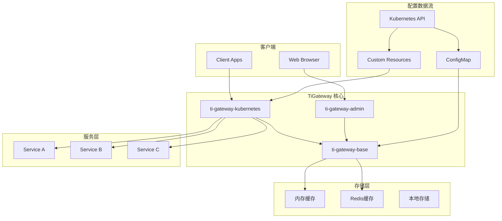

## 配置数据流

### 1. 配置来源
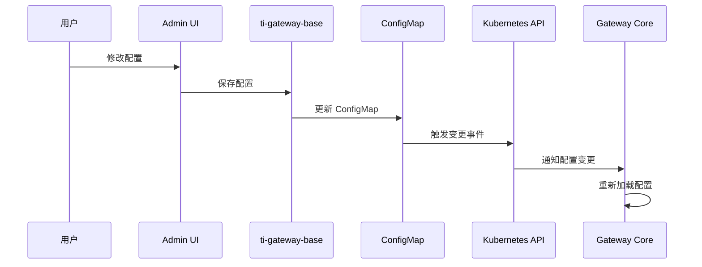

### 2. ConfigMap 配置流
```yaml
# ConfigMap 配置结构
apiVersion: v1
kind: ConfigMap
metadata:
  name: tigateway-app-config
data:
  application.yml: |
    spring:
      cloud:
        gateway:
          routes:
            - id: user-service
              uri: lb://user-service
              predicates:
                - Path=/api/users/**
              filters:
                - StripPrefix=2
  routes.json: |
    [
      {
        "id": "user-service",
        "uri": "lb://user-service",
        "predicates": [{"name": "Path", "args": {"pattern": "/api/users/**"}}],
        "filters": [{"name": "StripPrefix", "args": {"parts": 2}}]
      }
    ]
```

### 3. 配置热更新机制
```java
@Component
public class ConfigMapWatcher {
    
    @EventListener
    public void handleConfigChange(ConfigMapChangeEvent event) {
        // 1. 验证配置格式
        if (validateConfig(event.getNewConfig())) {
            // 2. 更新内存缓存
            updateMemoryCache(event.getNewConfig());
            // 3. 通知路由更新
            notifyRouteUpdate(event.getNewConfig());
            // 4. 记录变更日志
            logConfigChange(event);
        }
    }
}
```

## 路由数据流

### 1. 路由发现流程
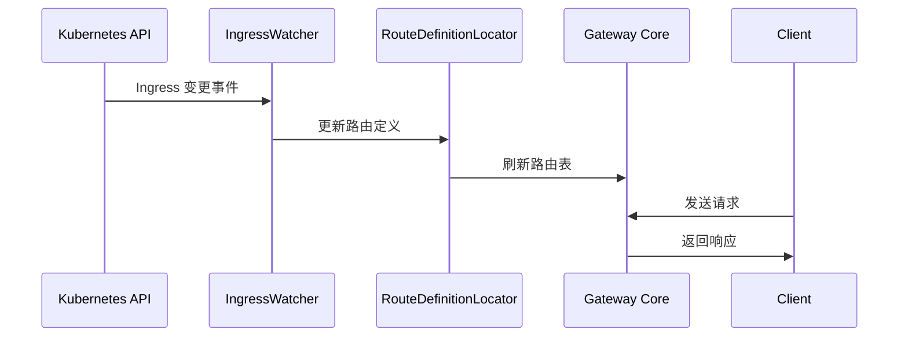

### 2. 动态路由更新
```java
@Service
public class DynamicRouteService {
    
    public void updateRoute(RouteDefinition route) {
        // 1. 验证路由配置
        validateRoute(route);
        
        // 2. 更新路由定义
        routeDefinitionLocator.updateRoute(route);
        
        // 3. 刷新网关路由
        gatewayWebHandler.refresh();
        
        // 4. 记录路由变更
        logRouteChange(route);
    }
}
```

### 3. 路由匹配流程
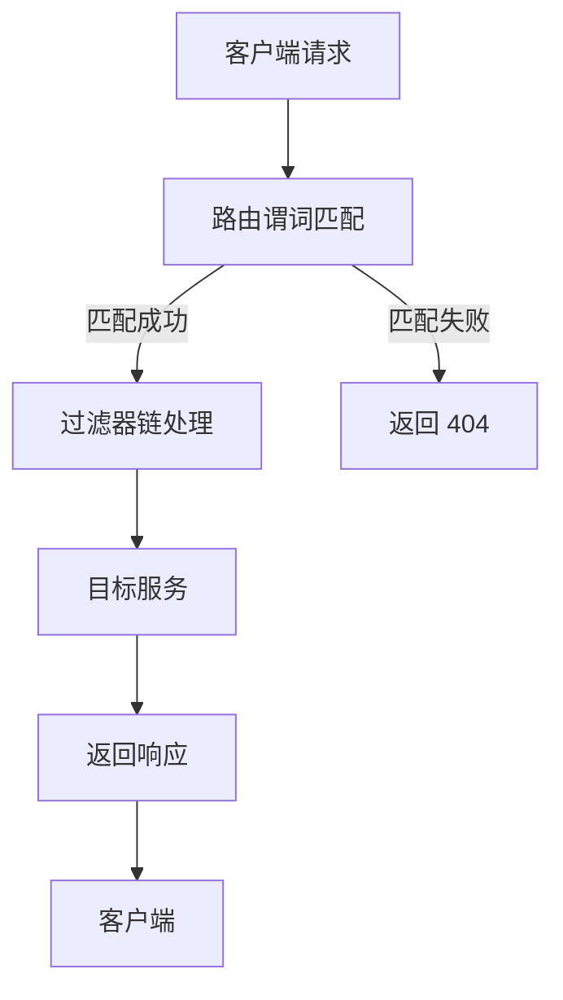

## 服务发现数据流

### 1. Kubernetes 服务发现
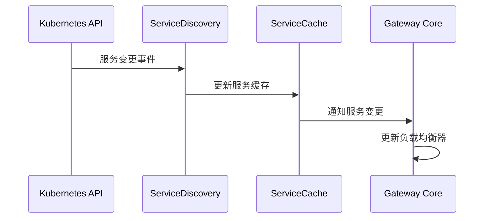

### 2. 服务注册与发现
```java
@Component
public class KubernetesServiceDiscovery {
    
    @EventListener
    public void handleServiceChange(ServiceChangeEvent event) {
        switch (event.getType()) {
            case ADDED:
                addService(event.getService());
                break;
            case MODIFIED:
                updateService(event.getService());
                break;
            case DELETED:
                removeService(event.getService());
                break;
        }
    }
}
```

## 缓存数据流

### 1. 多级缓存架构
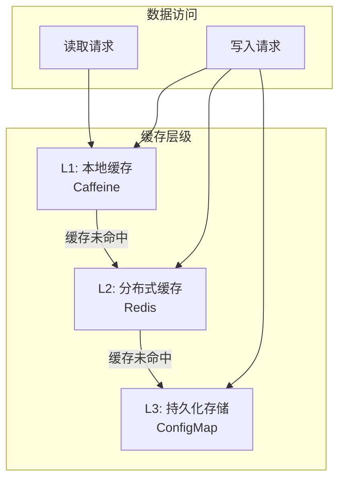

### 2. 缓存更新策略
```java
@Service
public class CacheManager {
    
    @Cacheable(value = "routes", key = "#routeId")
    public RouteDefinition getRoute(String routeId) {
        return routeRepository.findById(routeId);
    }
    
    @CacheEvict(value = "routes", key = "#route.id")
    public void updateRoute(RouteDefinition route) {
        routeRepository.save(route);
        // 异步更新其他缓存
        asyncUpdateCache(route);
    }
}
```

## 监控数据流

### 1. 指标收集流程
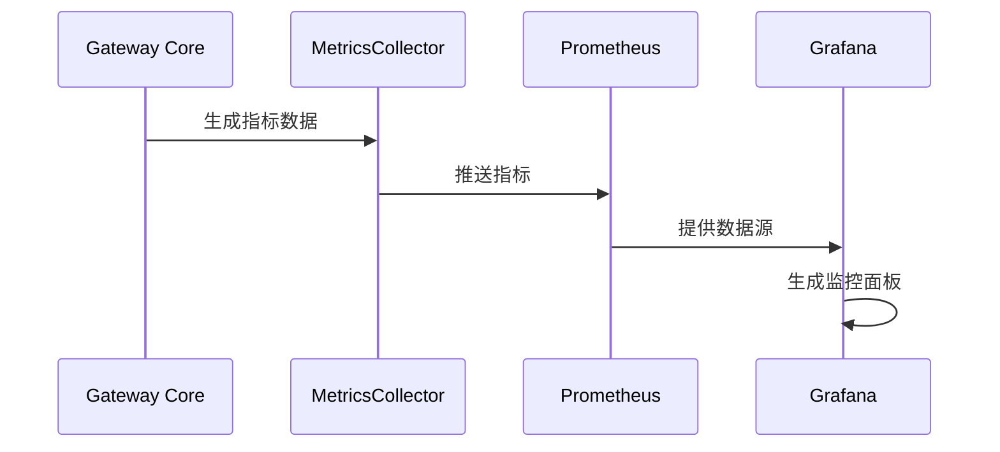

### 2. 日志数据流
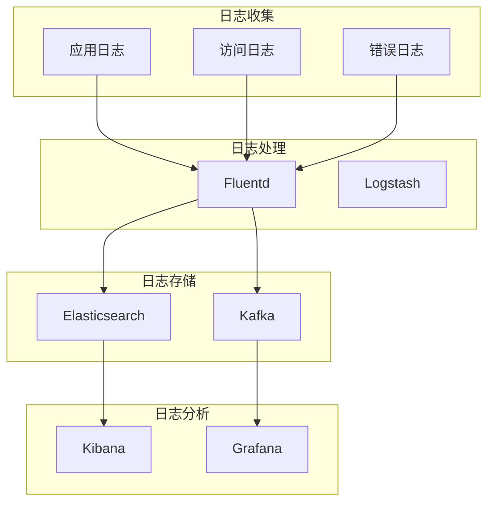

## 安全数据流

### 1. 认证授权流程
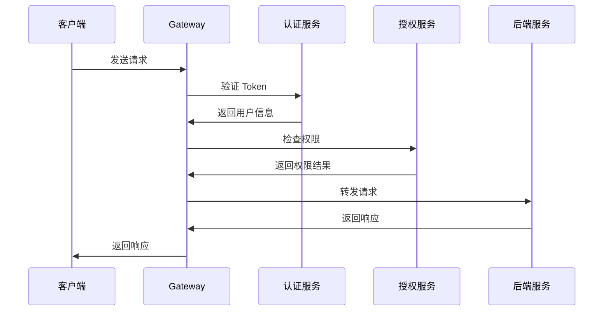

### 2. 安全配置数据流
```java
@Component
public class SecurityConfigManager {
    
    public void updateSecurityConfig(SecurityConfig config) {
        // 1. 验证安全配置
        validateSecurityConfig(config);
        
        // 2. 更新安全策略
        updateSecurityPolicies(config);
        
        // 3. 刷新安全过滤器
        refreshSecurityFilters();
        
        // 4. 记录安全变更
        auditSecurityChange(config);
    }
}
```

## 数据一致性保证

### 1. 最终一致性模型
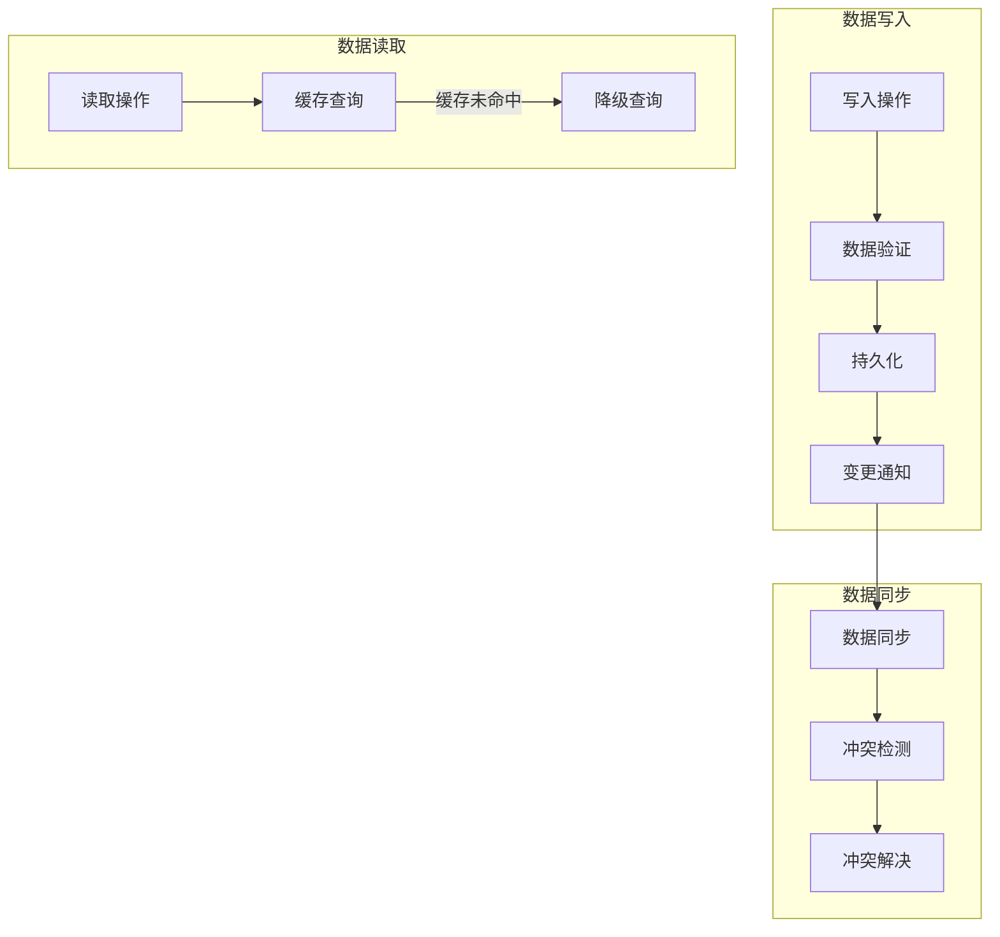

### 2. 数据版本控制
```java
@Entity
public class RouteDefinition {
    @Id
    private String id;
    private String uri;
    private List<PredicateDefinition> predicates;
    private List<FilterDefinition> filters;
    
    @Version
    private Long version;
    
    @LastModifiedDate
    private LocalDateTime lastModified;
    
    // 乐观锁控制
    public boolean updateWithVersion(RouteDefinition newRoute) {
        if (this.version.equals(newRoute.getVersion())) {
            this.uri = newRoute.getUri();
            this.predicates = newRoute.getPredicates();
            this.filters = newRoute.getFilters();
            this.version++;
            return true;
        }
        return false; // 版本冲突
    }
}
```

## 性能优化数据流

### 1. 异步处理流程
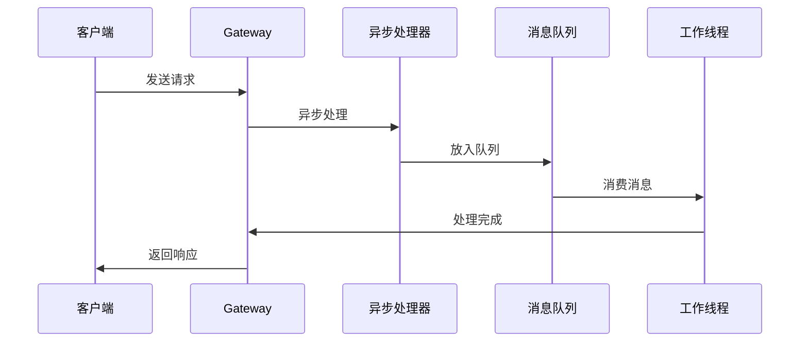

### 2. 批量处理优化
```java
@Component
public class BatchProcessor {
    
    @Scheduled(fixedDelay = 1000)
    public void processBatch() {
        List<RouteUpdate> updates = batchQueue.drainTo(100);
        if (!updates.isEmpty()) {
            // 批量更新路由
            batchUpdateRoutes(updates);
            // 批量刷新缓存
            batchRefreshCache(updates);
        }
    }
}
```

## 数据备份与恢复

### 1. 配置备份流程
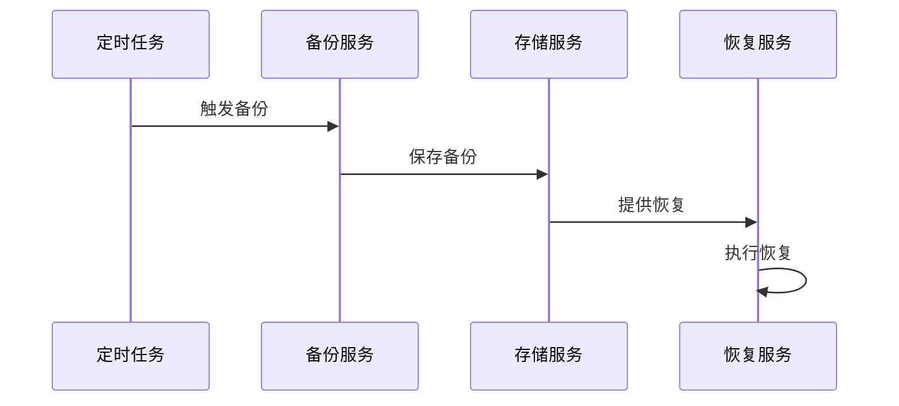

### 2. 数据恢复机制
```java
@Service
public class DataRecoveryService {
    
    public void restoreFromBackup(String backupId) {
        // 1. 加载备份数据
        BackupData backup = loadBackup(backupId);
        
        // 2. 验证数据完整性
        validateBackupData(backup);
        
        // 3. 执行数据恢复
        restoreConfigData(backup.getConfig());
        restoreRouteData(backup.getRoutes());
        
        // 4. 刷新系统状态
        refreshSystemState();
    }
}
```

## 数据流监控

### 1. 数据流指标
```java
@Component
public class DataFlowMetrics {
    
    private final Counter configUpdateCounter;
    private final Timer routeUpdateTimer;
    private final Gauge cacheHitRatio;
    
    public DataFlowMetrics(MeterRegistry meterRegistry) {
        this.configUpdateCounter = Counter.builder("tigateway.config.updates")
            .description("Number of configuration updates")
            .register(meterRegistry);
            
        this.routeUpdateTimer = Timer.builder("tigateway.routes.update.time")
            .description("Route update processing time")
            .register(meterRegistry);
            
        this.cacheHitRatio = Gauge.builder("tigateway.cache.hit.ratio")
            .description("Cache hit ratio")
            .register(meterRegistry, this, DataFlowMetrics::getCacheHitRatio);
    }
}
```

### 2. 数据流追踪
```java
@Component
public class DataFlowTracer {
    
    public void traceConfigUpdate(String configId, String operation) {
        Span span = tracer.nextSpan()
            .name("config-update")
            .tag("config.id", configId)
            .tag("operation", operation)
            .start();
            
        try (Tracer.SpanInScope ws = tracer.withSpanInScope(span)) {
            // 执行配置更新
            performConfigUpdate(configId, operation);
        } finally {
            span.end();
        }
    }
}
```

---

**相关文档**:
- [系统架构](./system-architecture.md)
- [模块设计](./module-design.md)
- [安全架构](./security.md)
