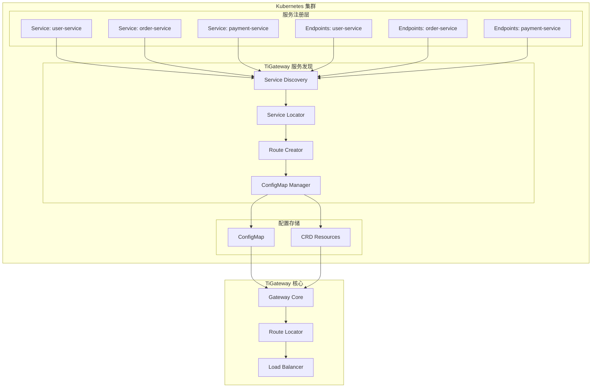

# 服务发现

TiGateway 提供了完整的 Kubernetes 服务发现支持，能够自动发现和管理 Kubernetes 集群中的服务，并动态创建路由配置。

## 服务发现概述

### 服务发现架构



### 服务发现特性

- **自动发现**: 自动发现 Kubernetes 集群中的服务
- **动态路由**: 根据服务自动创建路由配置
- **实时更新**: 服务变更时自动更新路由配置
- **标签过滤**: 支持基于标签的服务过滤
- **命名空间隔离**: 支持跨命名空间的服务发现

## 服务发现配置

### 1. 基本配置

```yaml
# application.yml
spring:
  cloud:
    gateway:
      discovery:
        locator:
          enabled: true
          lower-case-service-id: true
          predicates:
          - name: Path
            args:
              pattern: "'/'+serviceId+'/**'"
          filters:
          - name: RewritePath
            args:
              regexp: "'/' + serviceId + '/?(?<remaining>.*)'"
              replacement: "'/${remaining}'"
```

### 2. 高级配置

```yaml
# application.yml
spring:
  cloud:
    gateway:
      discovery:
        locator:
          enabled: true
          lower-case-service-id: true
          include-expression: "hasLabel('gateway', 'enabled')"
          url-expression: "'lb://'+serviceId"
          predicates:
          - name: Path
            args:
              pattern: "'/'+serviceId+'/**'"
          - name: Host
            args:
              pattern: "'**.'+serviceId+'.example.com'"
          filters:
          - name: RewritePath
            args:
              regexp: "'/' + serviceId + '/?(?<remaining>.*)'"
              replacement: "'/${remaining}'"
          - name: AddRequestHeader
            args:
              name: X-Service-Name
              value: serviceId
```

### 3. 命名空间配置

```yaml
# application.yml
spring:
  cloud:
    gateway:
      discovery:
        locator:
          enabled: true
          lower-case-service-id: true
          include-expression: "hasLabel('gateway', 'enabled') && namespace == 'microservices'"
          url-expression: "'lb://'+serviceId"
          predicates:
          - name: Path
            args:
              pattern: "'/'+serviceId+'/**'"
          filters:
          - name: RewritePath
            args:
              regexp: "'/' + serviceId + '/?(?<remaining>.*)'"
              replacement: "'/${remaining}'"
```

## 服务发现实现

### 1. 服务发现服务

```java
@Service
public class KubernetesServiceDiscoveryService {
    
    @Autowired
    private KubernetesClient kubernetesClient;
    
    @Autowired
    private RouteDefinitionLocator routeDefinitionLocator;
    
    private final Map<String, Service> discoveredServices = new ConcurrentHashMap<>();
    private final Map<String, RouteDefinition> generatedRoutes = new ConcurrentHashMap<>();
    
    @PostConstruct
    public void init() {
        // 启动服务发现
        startServiceDiscovery();
    }
    
    public void startServiceDiscovery() {
        // 监听服务变化
        kubernetesClient.services().inAnyNamespace().watch(new Watcher<Service>() {
            @Override
            public void eventReceived(Action action, Service service) {
                handleServiceChange(action, service);
            }
            
            @Override
            public void onClose(WatcherException cause) {
                log.error("Service watcher closed", cause);
                // 重新启动监听
                startServiceDiscovery();
            }
        });
        
        // 监听端点变化
        kubernetesClient.endpoints().inAnyNamespace().watch(new Watcher<Endpoints>() {
            @Override
            public void eventReceived(Action action, Endpoints endpoints) {
                handleEndpointsChange(action, endpoints);
            }
            
            @Override
            public void onClose(WatcherException cause) {
                log.error("Endpoints watcher closed", cause);
                // 重新启动监听
                startServiceDiscovery();
            }
        });
    }
    
    private void handleServiceChange(Action action, Service service) {
        String serviceId = service.getMetadata().getName();
        String namespace = service.getMetadata().getNamespace();
        
        log.info("Service {} changed: {}", serviceId, action);
        
        switch (action) {
            case ADDED:
            case MODIFIED:
                if (shouldIncludeService(service)) {
                    discoveredServices.put(serviceId, service);
                    createRouteForService(service);
                }
                break;
            case DELETED:
                discoveredServices.remove(serviceId);
                removeRouteForService(serviceId);
                break;
        }
    }
    
    private void handleEndpointsChange(Action action, Endpoints endpoints) {
        String serviceId = endpoints.getMetadata().getName();
        String namespace = endpoints.getMetadata().getNamespace();
        
        log.info("Endpoints {} changed: {}", serviceId, action);
        
        // 检查服务是否健康
        boolean isHealthy = isServiceHealthy(endpoints);
        updateServiceHealth(serviceId, isHealthy);
    }
    
    private boolean shouldIncludeService(Service service) {
        Map<String, String> labels = service.getMetadata().getLabels();
        if (labels == null) {
            return false;
        }
        
        // 检查是否启用了网关
        String gatewayEnabled = labels.get("gateway");
        if (!"enabled".equals(gatewayEnabled)) {
            return false;
        }
        
        // 检查服务类型
        String serviceType = service.getSpec().getType();
        if (!"ClusterIP".equals(serviceType) && !"NodePort".equals(serviceType)) {
            return false;
        }
        
        // 检查端口配置
        List<ServicePort> ports = service.getSpec().getPorts();
        if (ports == null || ports.isEmpty()) {
            return false;
        }
        
        return true;
    }
    
    private void createRouteForService(Service service) {
        String serviceId = service.getMetadata().getName();
        String namespace = service.getMetadata().getNamespace();
        
        RouteDefinition route = new RouteDefinition();
        route.setId(serviceId);
        route.setUri("lb://" + serviceId);
        
        // 设置谓词
        List<PredicateDefinition> predicates = new ArrayList<>();
        
        // 路径谓词
        PredicateDefinition pathPredicate = new PredicateDefinition();
        pathPredicate.setName("Path");
        pathPredicate.addArg("pattern", "/" + serviceId + "/**");
        predicates.add(pathPredicate);
        
        // 主机谓词（如果配置了域名）
        String hostPattern = getHostPattern(service);
        if (hostPattern != null) {
            PredicateDefinition hostPredicate = new PredicateDefinition();
            hostPredicate.setName("Host");
            hostPredicate.addArg("pattern", hostPattern);
            predicates.add(hostPredicate);
        }
        
        route.setPredicates(predicates);
        
        // 设置过滤器
        List<FilterDefinition> filters = createFiltersForService(service);
        route.setFilters(filters);
        
        // 设置元数据
        Map<String, Object> metadata = new HashMap<>();
        metadata.put("service", serviceId);
        metadata.put("namespace", namespace);
        metadata.put("discovered", true);
        metadata.put("discoveredAt", Instant.now().toString());
        route.setMetadata(metadata);
        
        generatedRoutes.put(serviceId, route);
        
        // 保存路由配置
        saveRouteConfiguration(route);
    }
    
    private List<FilterDefinition> createFiltersForService(Service service) {
        List<FilterDefinition> filters = new ArrayList<>();
        
        // 重写路径过滤器
        FilterDefinition rewriteFilter = new FilterDefinition();
        rewriteFilter.setName("RewritePath");
        rewriteFilter.addArg("regexp", "/" + service.getMetadata().getName() + "/?(?<remaining>.*)");
        rewriteFilter.addArg("replacement", "/${remaining}");
        filters.add(rewriteFilter);
        
        // 添加服务头过滤器
        FilterDefinition headerFilter = new FilterDefinition();
        headerFilter.setName("AddRequestHeader");
        headerFilter.addArg("name", "X-Service-Name");
        headerFilter.addArg("value", service.getMetadata().getName());
        filters.add(headerFilter);
        
        // 添加命名空间头过滤器
        FilterDefinition namespaceFilter = new FilterDefinition();
        namespaceFilter.setName("AddRequestHeader");
        namespaceFilter.addArg("name", "X-Service-Namespace");
        namespaceFilter.addArg("value", service.getMetadata().getNamespace());
        filters.add(namespaceFilter);
        
        // 根据标签添加自定义过滤器
        Map<String, String> labels = service.getMetadata().getLabels();
        if (labels != null) {
            String rateLimit = labels.get("gateway.rate-limit");
            if (rateLimit != null) {
                FilterDefinition rateLimitFilter = new FilterDefinition();
                rateLimitFilter.setName("RequestRateLimiter");
                rateLimitFilter.addArg("redis-rate-limiter.replenishRate", rateLimit);
                rateLimitFilter.addArg("redis-rate-limiter.burstCapacity", 
                    labels.getOrDefault("gateway.rate-limit-burst", "200"));
                filters.add(rateLimitFilter);
            }
            
            String circuitBreaker = labels.get("gateway.circuit-breaker");
            if (circuitBreaker != null) {
                FilterDefinition circuitBreakerFilter = new FilterDefinition();
                circuitBreakerFilter.setName("CircuitBreaker");
                circuitBreakerFilter.addArg("name", circuitBreaker);
                String fallbackUri = labels.get("gateway.circuit-breaker-fallback");
                if (fallbackUri != null) {
                    circuitBreakerFilter.addArg("fallbackUri", fallbackUri);
                }
                filters.add(circuitBreakerFilter);
            }
        }
        
        return filters;
    }
    
    private String getHostPattern(Service service) {
        Map<String, String> labels = service.getMetadata().getLabels();
        if (labels != null) {
            String hostPattern = labels.get("gateway.host-pattern");
            if (hostPattern != null) {
                return hostPattern;
            }
        }
        return null;
    }
    
    private boolean isServiceHealthy(Endpoints endpoints) {
        if (endpoints.getSubsets() == null || endpoints.getSubsets().isEmpty()) {
            return false;
        }
        
        for (EndpointSubset subset : endpoints.getSubsets()) {
            if (subset.getAddresses() != null && !subset.getAddresses().isEmpty()) {
                return true;
            }
        }
        
        return false;
    }
    
    private void updateServiceHealth(String serviceId, boolean isHealthy) {
        RouteDefinition route = generatedRoutes.get(serviceId);
        if (route != null) {
            Map<String, Object> metadata = route.getMetadata();
            if (metadata == null) {
                metadata = new HashMap<>();
                route.setMetadata(metadata);
            }
            metadata.put("healthy", isHealthy);
            metadata.put("healthCheckAt", Instant.now().toString());
            
            // 更新路由配置
            saveRouteConfiguration(route);
        }
    }
    
    private void removeRouteForService(String serviceId) {
        generatedRoutes.remove(serviceId);
        removeRouteConfiguration(serviceId);
    }
    
    private void saveRouteConfiguration(RouteDefinition route) {
        // 保存到 ConfigMap
        saveToConfigMap(route);
        
        // 保存到 CRD
        saveToCRD(route);
    }
    
    private void saveToConfigMap(RouteDefinition route) {
        try {
            ConfigMap configMap = kubernetesClient.configMaps()
                .inNamespace("tigateway")
                .withName("tigateway-route-config")
                .get();
            
            if (configMap == null) {
                configMap = new ConfigMapBuilder()
                    .withNewMetadata()
                        .withName("tigateway-route-config")
                        .withNamespace("tigateway")
                    .endMetadata()
                    .withData(new HashMap<>())
                    .build();
            }
            
            Map<String, String> data = configMap.getData();
            if (data == null) {
                data = new HashMap<>();
            }
            
            // 更新路由配置
            String routesYaml = data.get("routes.yaml");
            if (routesYaml == null) {
                routesYaml = "spring:\n  cloud:\n    gateway:\n      routes:\n";
            }
            
            // 添加新路由
            String routeYaml = convertRouteToYaml(route);
            routesYaml += routeYaml;
            
            data.put("routes.yaml", routesYaml);
            configMap.setData(data);
            
            kubernetesClient.configMaps()
                .inNamespace("tigateway")
                .createOrReplace(configMap);
                
        } catch (Exception e) {
            log.error("Failed to save route to ConfigMap", e);
        }
    }
    
    private void saveToCRD(RouteDefinition route) {
        try {
            TiGatewayRoute crdRoute = new TiGatewayRoute();
            crdRoute.setMetadata(new ObjectMeta());
            crdRoute.getMetadata().setName(route.getId());
            crdRoute.getMetadata().setNamespace("tigateway");
            
            TiGatewayRouteSpec spec = new TiGatewayRouteSpec();
            spec.setGateway("default-gateway");
            spec.setRoute(convertToCRDRoute(route));
            crdRoute.setSpec(spec);
            
            kubernetesClient.customResources(TiGatewayRoute.class)
                .inNamespace("tigateway")
                .createOrReplace(crdRoute);
                
        } catch (Exception e) {
            log.error("Failed to save route to CRD", e);
        }
    }
    
    private String convertRouteToYaml(RouteDefinition route) {
        StringBuilder yaml = new StringBuilder();
        yaml.append("      - id: ").append(route.getId()).append("\n");
        yaml.append("        uri: ").append(route.getUri()).append("\n");
        
        if (route.getPredicates() != null && !route.getPredicates().isEmpty()) {
            yaml.append("        predicates:\n");
            for (PredicateDefinition predicate : route.getPredicates()) {
                yaml.append("        - name: ").append(predicate.getName()).append("\n");
                if (predicate.getArgs() != null) {
                    yaml.append("          args:\n");
                    for (Map.Entry<String, Object> entry : predicate.getArgs().entrySet()) {
                        yaml.append("            ").append(entry.getKey()).append(": ").append(entry.getValue()).append("\n");
                    }
                }
            }
        }
        
        if (route.getFilters() != null && !route.getFilters().isEmpty()) {
            yaml.append("        filters:\n");
            for (FilterDefinition filter : route.getFilters()) {
                yaml.append("        - name: ").append(filter.getName()).append("\n");
                if (filter.getArgs() != null) {
                    yaml.append("          args:\n");
                    for (Map.Entry<String, Object> entry : filter.getArgs().entrySet()) {
                        yaml.append("            ").append(entry.getKey()).append(": ").append(entry.getValue()).append("\n");
                    }
                }
            }
        }
        
        return yaml.toString();
    }
}
```

### 2. 服务发现配置器

```java
@Configuration
public class ServiceDiscoveryConfiguration {
    
    @Bean
    public RouteDefinitionLocator serviceDiscoveryRouteDefinitionLocator(
            KubernetesServiceDiscoveryService discoveryService) {
        return new ServiceDiscoveryRouteDefinitionLocator(discoveryService);
    }
    
    public static class ServiceDiscoveryRouteDefinitionLocator implements RouteDefinitionLocator {
        
        private final KubernetesServiceDiscoveryService discoveryService;
        
        public ServiceDiscoveryRouteDefinitionLocator(KubernetesServiceDiscoveryService discoveryService) {
            this.discoveryService = discoveryService;
        }
        
        @Override
        public Flux<RouteDefinition> getRouteDefinitions() {
            return Flux.fromIterable(discoveryService.getDiscoveredRoutes());
        }
    }
}
```

### 3. 服务健康检查

```java
@Component
public class ServiceHealthChecker {
    
    @Autowired
    private KubernetesClient kubernetesClient;
    
    private final Map<String, Boolean> serviceHealth = new ConcurrentHashMap<>();
    
    @Scheduled(fixedRate = 30000) // 每30秒检查一次
    public void checkServiceHealth() {
        kubernetesClient.services().inAnyNamespace().list().getItems()
            .stream()
            .filter(this::shouldCheckHealth)
            .forEach(this::checkServiceHealth);
    }
    
    private boolean shouldCheckHealth(Service service) {
        Map<String, String> labels = service.getMetadata().getLabels();
        return labels != null && "enabled".equals(labels.get("gateway"));
    }
    
    private void checkServiceHealth(Service service) {
        String serviceId = service.getMetadata().getName();
        String namespace = service.getMetadata().getNamespace();
        
        try {
            // 检查端点
            Endpoints endpoints = kubernetesClient.endpoints()
                .inNamespace(namespace)
                .withName(serviceId)
                .get();
            
            boolean isHealthy = isServiceHealthy(endpoints);
            serviceHealth.put(serviceId, isHealthy);
            
            // 更新路由状态
            updateRouteHealth(serviceId, isHealthy);
            
        } catch (Exception e) {
            log.error("Failed to check health for service: {}", serviceId, e);
            serviceHealth.put(serviceId, false);
        }
    }
    
    private boolean isServiceHealthy(Endpoints endpoints) {
        if (endpoints == null || endpoints.getSubsets() == null) {
            return false;
        }
        
        for (EndpointSubset subset : endpoints.getSubsets()) {
            if (subset.getAddresses() != null && !subset.getAddresses().isEmpty()) {
                return true;
            }
        }
        
        return false;
    }
    
    private void updateRouteHealth(String serviceId, boolean isHealthy) {
        // 更新路由元数据
        // 这里可以更新路由的健康状态
        log.info("Service {} health status: {}", serviceId, isHealthy ? "healthy" : "unhealthy");
    }
    
    public boolean isServiceHealthy(String serviceId) {
        return serviceHealth.getOrDefault(serviceId, false);
    }
    
    public Map<String, Boolean> getAllServiceHealth() {
        return new HashMap<>(serviceHealth);
    }
}
```

## 服务发现监控

### 1. 服务发现指标

```java
@Component
public class ServiceDiscoveryMetrics {
    
    private final MeterRegistry meterRegistry;
    private final Gauge discoveredServicesGauge;
    private final Counter serviceDiscoveryEvents;
    private final Timer serviceDiscoveryLatency;
    
    public ServiceDiscoveryMetrics(MeterRegistry meterRegistry) {
        this.meterRegistry = meterRegistry;
        this.discoveredServicesGauge = Gauge.builder("tigateway_discovered_services")
            .description("Number of discovered services")
            .register(meterRegistry);
        this.serviceDiscoveryEvents = Counter.builder("tigateway_service_discovery_events")
            .description("Service discovery events")
            .register(meterRegistry);
        this.serviceDiscoveryLatency = Timer.builder("tigateway_service_discovery_latency")
            .description("Service discovery latency")
            .register(meterRegistry);
    }
    
    public void recordServiceDiscovered(String serviceId, String namespace) {
        serviceDiscoveryEvents.increment(
            Tags.of(
                "action", "discovered",
                "service", serviceId,
                "namespace", namespace
            )
        );
    }
    
    public void recordServiceRemoved(String serviceId, String namespace) {
        serviceDiscoveryEvents.increment(
            Tags.of(
                "action", "removed",
                "service", serviceId,
                "namespace", namespace
            )
        );
    }
    
    public void recordServiceUpdated(String serviceId, String namespace) {
        serviceDiscoveryEvents.increment(
            Tags.of(
                "action", "updated",
                "service", serviceId,
                "namespace", namespace
            )
        );
    }
    
    public void updateDiscoveredServicesCount(int count) {
        discoveredServicesGauge.set(count);
    }
    
    public void recordDiscoveryLatency(Duration duration) {
        serviceDiscoveryLatency.record(duration);
    }
}
```

### 2. 服务发现健康检查

```java
@Component
public class ServiceDiscoveryHealthIndicator implements HealthIndicator {
    
    @Autowired
    private KubernetesServiceDiscoveryService discoveryService;
    
    @Autowired
    private ServiceHealthChecker healthChecker;
    
    @Override
    public Health health() {
        try {
            Map<String, Boolean> serviceHealth = healthChecker.getAllServiceHealth();
            int totalServices = serviceHealth.size();
            int healthyServices = (int) serviceHealth.values().stream().filter(Boolean::booleanValue).count();
            
            Map<String, Object> details = new HashMap<>();
            details.put("totalServices", totalServices);
            details.put("healthyServices", healthyServices);
            details.put("unhealthyServices", totalServices - healthyServices);
            details.put("serviceHealth", serviceHealth);
            
            if (totalServices == 0) {
                return Health.up()
                    .withDetail("message", "No services discovered")
                    .withDetails(details)
                    .build();
            }
            
            if (healthyServices == totalServices) {
                return Health.up()
                    .withDetail("message", "All services are healthy")
                    .withDetails(details)
                    .build();
            } else {
                return Health.down()
                    .withDetail("message", "Some services are unhealthy")
                    .withDetails(details)
                    .build();
            }
            
        } catch (Exception e) {
            return Health.down()
                .withDetail("error", e.getMessage())
                .build();
        }
    }
}
```

## 服务发现配置管理

### 1. 服务标签配置

```yaml
# 服务标签示例
apiVersion: v1
kind: Service
metadata:
  name: user-service
  namespace: microservices
  labels:
    app: user-service
    version: v1
    gateway: enabled                    # 启用网关
    gateway.host-pattern: "*.user.example.com"  # 主机模式
    gateway.rate-limit: "100"          # 限流配置
    gateway.rate-limit-burst: "200"    # 限流突发容量
    gateway.circuit-breaker: "user-service"  # 熔断器配置
    gateway.circuit-breaker-fallback: "forward:/fallback"  # 熔断器回退
spec:
  selector:
    app: user-service
  ports:
  - port: 80
    targetPort: 8080
    protocol: TCP
```

### 2. 服务发现配置

```yaml
# application.yml
spring:
  cloud:
    gateway:
      discovery:
        locator:
          enabled: true
          lower-case-service-id: true
          include-expression: "hasLabel('gateway', 'enabled')"
          url-expression: "'lb://'+serviceId"
          predicates:
          - name: Path
            args:
              pattern: "'/'+serviceId+'/**'"
          - name: Host
            args:
              pattern: "'**.'+serviceId+'.example.com'"
          filters:
          - name: RewritePath
            args:
              regexp: "'/' + serviceId + '/?(?<remaining>.*)'"
              replacement: "'/${remaining}'"
          - name: AddRequestHeader
            args:
              name: X-Service-Name
              value: serviceId
          - name: AddRequestHeader
            args:
              name: X-Service-Namespace
              value: namespace
```

### 3. 服务发现过滤器

```java
@Component
public class ServiceDiscoveryFilter implements GlobalFilter, Ordered {
    
    @Autowired
    private ServiceHealthChecker healthChecker;
    
    @Override
    public Mono<Void> filter(ServerWebExchange exchange, GatewayFilterChain chain) {
        String serviceId = exchange.getAttribute("serviceId");
        if (serviceId != null) {
            boolean isHealthy = healthChecker.isServiceHealthy(serviceId);
            if (!isHealthy) {
                return handleUnhealthyService(exchange);
            }
        }
        
        return chain.filter(exchange);
    }
    
    private Mono<Void> handleUnhealthyService(ServerWebExchange exchange) {
        ServerHttpResponse response = exchange.getResponse();
        response.setStatusCode(HttpStatus.SERVICE_UNAVAILABLE);
        response.getHeaders().add("Content-Type", "application/json");
        
        String body = "{\"error\":\"Service Unavailable\",\"message\":\"Service is currently unavailable\"}";
        DataBuffer buffer = response.bufferFactory().wrap(body.getBytes());
        return response.writeWith(Mono.just(buffer));
    }
    
    @Override
    public int getOrder() {
        return -100;
    }
}
```

## 最佳实践

### 1. 服务标签规范

```yaml
# 推荐的服务标签规范
apiVersion: v1
kind: Service
metadata:
  name: example-service
  namespace: microservices
  labels:
    app: example-service
    version: v1.0.0
    environment: production
    team: backend
    gateway: enabled                    # 启用网关发现
    gateway.priority: "100"            # 路由优先级
    gateway.host-pattern: "*.example.com"  # 主机模式
    gateway.rate-limit: "100"          # 限流配置
    gateway.circuit-breaker: "example-service"  # 熔断器配置
    gateway.auth-required: "true"      # 是否需要认证
    gateway.cors-enabled: "true"       # 是否启用CORS
spec:
  selector:
    app: example-service
  ports:
  - port: 80
    targetPort: 8080
    protocol: TCP
```

### 2. 命名空间组织

```yaml
# 按环境组织服务
apiVersion: v1
kind: Namespace
metadata:
  name: microservices-dev
  labels:
    environment: development
    gateway: enabled
---
apiVersion: v1
kind: Namespace
metadata:
  name: microservices-staging
  labels:
    environment: staging
    gateway: enabled
---
apiVersion: v1
kind: Namespace
metadata:
  name: microservices-prod
  labels:
    environment: production
    gateway: enabled
```

### 3. 服务发现配置

```yaml
# 按环境配置服务发现
spring:
  profiles: development
  cloud:
    gateway:
      discovery:
        locator:
          enabled: true
          include-expression: "hasLabel('gateway', 'enabled') && namespace == 'microservices-dev'"
---
spring:
  profiles: production
  cloud:
    gateway:
      discovery:
        locator:
          enabled: true
          include-expression: "hasLabel('gateway', 'enabled') && namespace == 'microservices-prod'"
```

## 故障排除

### 1. 常见问题

#### 服务未被发现
```bash
# 检查服务标签
kubectl get svc -n microservices --show-labels

# 检查服务发现配置
kubectl get configmap tigateway-route-config -o yaml

# 检查服务发现日志
kubectl logs -f deployment/tigateway -n tigateway | grep "Service"
```

#### 路由未创建
```bash
# 检查路由配置
kubectl get configmap tigateway-route-config -o yaml

# 检查路由状态
kubectl get tigatewayroute -n tigateway

# 检查服务发现状态
kubectl exec -it deployment/tigateway -n tigateway -- curl http://localhost:8090/actuator/health
```

#### 服务健康检查失败
```bash
# 检查服务端点
kubectl get endpoints -n microservices

# 检查服务健康状态
kubectl describe svc user-service -n microservices

# 检查服务发现健康检查
kubectl exec -it deployment/tigateway -n tigateway -- curl http://localhost:8090/actuator/health/serviceDiscovery
```

### 2. 调试命令

```bash
# 查看所有服务
kubectl get svc --all-namespaces

# 查看服务详情
kubectl describe svc user-service -n microservices

# 查看服务端点
kubectl get endpoints user-service -n microservices

# 查看服务发现指标
kubectl exec -it deployment/tigateway -n tigateway -- curl http://localhost:8090/actuator/metrics/tigateway.discovered.services
```

## 总结

TiGateway 的服务发现功能提供了完整的 Kubernetes 服务自动发现和管理能力：

1. **自动发现**: 自动发现 Kubernetes 集群中的服务
2. **动态路由**: 根据服务自动创建路由配置
3. **实时更新**: 服务变更时自动更新路由配置
4. **健康检查**: 提供完整的服务健康检查机制
5. **监控指标**: 提供丰富的服务发现监控指标
6. **配置管理**: 支持灵活的服务发现配置
7. **最佳实践**: 遵循服务标签规范和命名空间组织原则

通过服务发现功能，TiGateway 可以自动管理微服务架构中的服务路由，大大简化了网关配置的维护工作。
