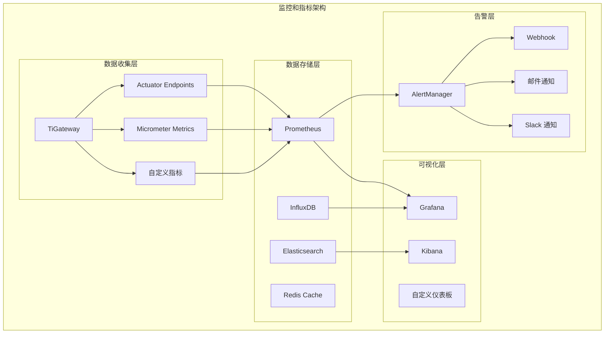

# 监控和指标

TiGateway 提供了完整的监控和指标功能，帮助您了解网关的运行状态、性能表现和业务指标。

## 监控和指标概述

### 架构设计



### 核心特性

- **多维度指标**: 支持系统、应用、业务等多维度指标
- **实时监控**: 提供实时性能监控和告警
- **历史数据**: 支持历史数据查询和分析
- **自定义指标**: 支持自定义业务指标
- **多存储后端**: 支持 Prometheus、InfluxDB 等多种存储
- **可视化仪表板**: 提供丰富的可视化图表
- **智能告警**: 支持基于规则的智能告警

## 系统指标

### 1. JVM 指标

```java
@Component
public class JvmMetricsCollector {
    
    private final MeterRegistry meterRegistry;
    private final MemoryMXBean memoryBean;
    private final ThreadMXBean threadBean;
    private final GarbageCollectorMXBean gcBean;
    
    public JvmMetricsCollector(MeterRegistry meterRegistry) {
        this.meterRegistry = meterRegistry;
        this.memoryBean = ManagementFactory.getMemoryMXBean();
        this.threadBean = ManagementFactory.getThreadMXBean();
        this.gcBean = ManagementFactory.getGarbageCollectorMXBeans().get(0);
        
        registerJvmMetrics();
    }
    
    private void registerJvmMetrics() {
        // 内存指标
        Gauge.builder("jvm.memory.used")
            .description("Used memory in bytes")
            .register(meterRegistry, memoryBean, bean -> {
                MemoryUsage heapUsage = bean.getHeapMemoryUsage();
                return heapUsage.getUsed();
            });
        
        Gauge.builder("jvm.memory.max")
            .description("Max memory in bytes")
            .register(meterRegistry, memoryBean, bean -> {
                MemoryUsage heapUsage = bean.getHeapMemoryUsage();
                return heapUsage.getMax();
            });
        
        // 线程指标
        Gauge.builder("jvm.threads.live")
            .description("Live threads")
            .register(meterRegistry, threadBean, ThreadMXBean::getThreadCount);
        
        Gauge.builder("jvm.threads.daemon")
            .description("Daemon threads")
            .register(meterRegistry, threadBean, ThreadMXBean::getDaemonThreadCount);
        
        // GC 指标
        Gauge.builder("jvm.gc.collections")
            .description("GC collections")
            .register(meterRegistry, gcBean, GarbageCollectorMXBean::getCollectionCount);
        
        Gauge.builder("jvm.gc.time")
            .description("GC time in milliseconds")
            .register(meterRegistry, gcBean, GarbageCollectorMXBean::getCollectionTime);
    }
}
```

### 2. 系统资源指标

```java
@Component
public class SystemMetricsCollector {
    
    private final MeterRegistry meterRegistry;
    private final OperatingSystemMXBean osBean;
    private final RuntimeMXBean runtimeBean;
    
    public SystemMetricsCollector(MeterRegistry meterRegistry) {
        this.meterRegistry = meterRegistry;
        this.osBean = ManagementFactory.getOperatingSystemMXBean();
        this.runtimeBean = ManagementFactory.getRuntimeMXBean();
        
        registerSystemMetrics();
    }
    
    private void registerSystemMetrics() {
        // CPU 指标
        Gauge.builder("system.cpu.usage")
            .description("System CPU usage")
            .register(meterRegistry, osBean, bean -> {
                if (bean instanceof com.sun.management.OperatingSystemMXBean) {
                    return ((com.sun.management.OperatingSystemMXBean) bean).getProcessCpuLoad();
                }
                return 0.0;
            });
        
        // 内存指标
        Gauge.builder("system.memory.total")
            .description("Total system memory")
            .register(meterRegistry, osBean, bean -> {
                if (bean instanceof com.sun.management.OperatingSystemMXBean) {
                    return ((com.sun.management.OperatingSystemMXBean) bean).getTotalPhysicalMemorySize();
                }
                return 0L;
            });
        
        Gauge.builder("system.memory.free")
            .description("Free system memory")
            .register(meterRegistry, osBean, bean -> {
                if (bean instanceof com.sun.management.OperatingSystemMXBean) {
                    return ((com.sun.management.OperatingSystemMXBean) bean).getFreePhysicalMemorySize();
                }
                return 0L;
            });
        
        // 磁盘指标
        Gauge.builder("system.disk.total")
            .description("Total disk space")
            .register(meterRegistry, this, SystemMetricsCollector::getTotalDiskSpace);
        
        Gauge.builder("system.disk.free")
            .description("Free disk space")
            .register(meterRegistry, this, SystemMetricsCollector::getFreeDiskSpace);
        
        // 运行时间
        Gauge.builder("system.uptime")
            .description("System uptime in seconds")
            .register(meterRegistry, runtimeBean, RuntimeMXBean::getUptime);
    }
    
    private long getTotalDiskSpace() {
        try {
            File root = new File("/");
            return root.getTotalSpace();
        } catch (Exception e) {
            return 0L;
        }
    }
    
    private long getFreeDiskSpace() {
        try {
            File root = new File("/");
            return root.getFreeSpace();
        } catch (Exception e) {
            return 0L;
        }
    }
}
```

## 应用指标

### 1. 请求指标

```java
@Component
public class RequestMetricsCollector {
    
    private final MeterRegistry meterRegistry;
    private final Counter requestCounter;
    private final Timer requestTimer;
    private final Counter errorCounter;
    private final Gauge activeRequests;
    
    private final AtomicInteger activeRequestsCount = new AtomicInteger(0);
    
    public RequestMetricsCollector(MeterRegistry meterRegistry) {
        this.meterRegistry = meterRegistry;
        this.requestCounter = Counter.builder("tigateway.requests.total")
            .description("Total number of requests")
            .register(meterRegistry);
        this.requestTimer = Timer.builder("tigateway.requests.duration")
            .description("Request duration")
            .register(meterRegistry);
        this.errorCounter = Counter.builder("tigateway.requests.errors")
            .description("Total number of errors")
            .register(meterRegistry);
        this.activeRequests = Gauge.builder("tigateway.requests.active")
            .description("Active requests")
            .register(meterRegistry, this, RequestMetricsCollector::getActiveRequests);
    }
    
    public void recordRequest(String method, String path, int statusCode, Duration duration) {
        Tags tags = Tags.of(
            "method", method,
            "path", path,
            "status", String.valueOf(statusCode)
        );
        
        requestCounter.increment(tags);
        requestTimer.record(duration, tags);
        
        if (statusCode >= 400) {
            errorCounter.increment(tags);
        }
    }
    
    public void incrementActiveRequests() {
        activeRequestsCount.incrementAndGet();
    }
    
    public void decrementActiveRequests() {
        activeRequestsCount.decrementAndGet();
    }
    
    private int getActiveRequests() {
        return activeRequestsCount.get();
    }
}
```

### 2. 路由指标

```java
@Component
public class RouteMetricsCollector {
    
    private final MeterRegistry meterRegistry;
    private final Counter routeRequestCounter;
    private final Timer routeRequestTimer;
    private final Counter routeErrorCounter;
    private final Gauge routeActiveRequests;
    
    private final Map<String, AtomicInteger> routeActiveRequestsMap = new ConcurrentHashMap<>();
    
    public RouteMetricsCollector(MeterRegistry meterRegistry) {
        this.meterRegistry = meterRegistry;
        this.routeRequestCounter = Counter.builder("tigateway.routes.requests.total")
            .description("Total number of route requests")
            .register(meterRegistry);
        this.routeRequestTimer = Timer.builder("tigateway.routes.requests.duration")
            .description("Route request duration")
            .register(meterRegistry);
        this.routeErrorCounter = Counter.builder("tigateway.routes.requests.errors")
            .description("Total number of route errors")
            .register(meterRegistry);
        this.routeActiveRequests = Gauge.builder("tigateway.routes.requests.active")
            .description("Active route requests")
            .register(meterRegistry, this, RouteMetricsCollector::getTotalActiveRequests);
    }
    
    public void recordRouteRequest(String routeId, String method, String path, int statusCode, Duration duration) {
        Tags tags = Tags.of(
            "route_id", routeId,
            "method", method,
            "path", path,
            "status", String.valueOf(statusCode)
        );
        
        routeRequestCounter.increment(tags);
        routeRequestTimer.record(duration, tags);
        
        if (statusCode >= 400) {
            routeErrorCounter.increment(tags);
        }
    }
    
    public void incrementRouteActiveRequests(String routeId) {
        routeActiveRequestsMap.computeIfAbsent(routeId, k -> new AtomicInteger(0)).incrementAndGet();
    }
    
    public void decrementRouteActiveRequests(String routeId) {
        AtomicInteger count = routeActiveRequestsMap.get(routeId);
        if (count != null) {
            count.decrementAndGet();
        }
    }
    
    private int getTotalActiveRequests() {
        return routeActiveRequestsMap.values().stream()
            .mapToInt(AtomicInteger::get)
            .sum();
    }
}
```

### 3. 过滤器指标

```java
@Component
public class FilterMetricsCollector {
    
    private final MeterRegistry meterRegistry;
    private final Counter filterExecutionCounter;
    private final Timer filterExecutionTimer;
    private final Counter filterErrorCounter;
    
    public FilterMetricsCollector(MeterRegistry meterRegistry) {
        this.meterRegistry = meterRegistry;
        this.filterExecutionCounter = Counter.builder("tigateway.filters.executions.total")
            .description("Total number of filter executions")
            .register(meterRegistry);
        this.filterExecutionTimer = Timer.builder("tigateway.filters.executions.duration")
            .description("Filter execution duration")
            .register(meterRegistry);
        this.filterErrorCounter = Counter.builder("tigateway.filters.executions.errors")
            .description("Total number of filter errors")
            .register(meterRegistry);
    }
    
    public void recordFilterExecution(String filterName, String routeId, boolean success, Duration duration) {
        Tags tags = Tags.of(
            "filter_name", filterName,
            "route_id", routeId,
            "success", String.valueOf(success)
        );
        
        filterExecutionCounter.increment(tags);
        filterExecutionTimer.record(duration, tags);
        
        if (!success) {
            filterErrorCounter.increment(tags);
        }
    }
}
```

## 业务指标

### 1. 用户指标

```java
@Component
public class UserMetricsCollector {
    
    private final MeterRegistry meterRegistry;
    private final Counter userRequestCounter;
    private final Timer userRequestTimer;
    private final Gauge activeUsers;
    
    private final Set<String> activeUsersSet = ConcurrentHashMap.newKeySet();
    
    public UserMetricsCollector(MeterRegistry meterRegistry) {
        this.meterRegistry = meterRegistry;
        this.userRequestCounter = Counter.builder("tigateway.users.requests.total")
            .description("Total number of user requests")
            .register(meterRegistry);
        this.userRequestTimer = Timer.builder("tigateway.users.requests.duration")
            .description("User request duration")
            .register(meterRegistry);
        this.activeUsers = Gauge.builder("tigateway.users.active")
            .description("Active users")
            .register(meterRegistry, this, UserMetricsCollector::getActiveUsersCount);
    }
    
    public void recordUserRequest(String userId, String method, String path, Duration duration) {
        Tags tags = Tags.of(
            "user_id", userId,
            "method", method,
            "path", path
        );
        
        userRequestCounter.increment(tags);
        userRequestTimer.record(duration, tags);
        
        activeUsersSet.add(userId);
    }
    
    public void removeActiveUser(String userId) {
        activeUsersSet.remove(userId);
    }
    
    private int getActiveUsersCount() {
        return activeUsersSet.size();
    }
}
```

### 2. API 指标

```java
@Component
public class ApiMetricsCollector {
    
    private final MeterRegistry meterRegistry;
    private final Counter apiRequestCounter;
    private final Timer apiRequestTimer;
    private final Counter apiErrorCounter;
    private final Gauge apiResponseTime;
    
    private final Map<String, AtomicLong> apiResponseTimeMap = new ConcurrentHashMap<>();
    
    public ApiMetricsCollector(MeterRegistry meterRegistry) {
        this.meterRegistry = meterRegistry;
        this.apiRequestCounter = Counter.builder("tigateway.api.requests.total")
            .description("Total number of API requests")
            .register(meterRegistry);
        this.apiRequestTimer = Timer.builder("tigateway.api.requests.duration")
            .description("API request duration")
            .register(meterRegistry);
        this.apiErrorCounter = Counter.builder("tigateway.api.requests.errors")
            .description("Total number of API errors")
            .register(meterRegistry);
        this.apiResponseTime = Gauge.builder("tigateway.api.response.time")
            .description("API response time")
            .register(meterRegistry, this, ApiMetricsCollector::getAverageResponseTime);
    }
    
    public void recordApiRequest(String apiName, String version, String method, int statusCode, Duration duration) {
        Tags tags = Tags.of(
            "api_name", apiName,
            "version", version,
            "method", method,
            "status", String.valueOf(statusCode)
        );
        
        apiRequestCounter.increment(tags);
        apiRequestTimer.record(duration, tags);
        
        if (statusCode >= 400) {
            apiErrorCounter.increment(tags);
        }
        
        // 更新响应时间
        String key = apiName + ":" + version;
        apiResponseTimeMap.computeIfAbsent(key, k -> new AtomicLong(0))
            .set(duration.toMillis());
    }
    
    private long getAverageResponseTime() {
        return apiResponseTimeMap.values().stream()
            .mapToLong(AtomicLong::get)
            .average()
            .orElse(0.0);
    }
}
```

## 监控配置

### 1. Prometheus 配置

```yaml
# prometheus.yml
global:
  scrape_interval: 15s
  evaluation_interval: 15s

rule_files:
  - "tigateway_rules.yml"

scrape_configs:
  - job_name: 'tigateway'
    static_configs:
      - targets: ['tigateway:8090']
    metrics_path: '/actuator/prometheus'
    scrape_interval: 5s
    scrape_timeout: 5s

  - job_name: 'tigateway-admin'
    static_configs:
      - targets: ['tigateway-admin:8081']
    metrics_path: '/actuator/prometheus'
    scrape_interval: 5s
    scrape_timeout: 5s

alerting:
  alertmanagers:
    - static_configs:
        - targets:
          - alertmanager:9093
```

### 2. 告警规则

```yaml
# tigateway_rules.yml
groups:
- name: tigateway
  rules:
  - alert: HighErrorRate
    expr: rate(tigateway_requests_errors_total[5m]) / rate(tigateway_requests_total[5m]) > 0.1
    for: 2m
    labels:
      severity: warning
    annotations:
      summary: "High error rate detected"
      description: "Error rate is {{ $value | humanizePercentage }}"

  - alert: HighResponseTime
    expr: histogram_quantile(0.95, rate(tigateway_requests_duration_seconds_bucket[5m])) > 1
    for: 2m
    labels:
      severity: warning
    annotations:
      summary: "High response time detected"
      description: "95th percentile response time is {{ $value }}s"

  - alert: HighMemoryUsage
    expr: jvm_memory_used_bytes / jvm_memory_max_bytes > 0.8
    for: 2m
    labels:
      severity: critical
    annotations:
      summary: "High memory usage detected"
      description: "Memory usage is {{ $value | humanizePercentage }}"

  - alert: HighCPUUsage
    expr: system_cpu_usage > 0.8
    for: 2m
    labels:
      severity: warning
    annotations:
      summary: "High CPU usage detected"
      description: "CPU usage is {{ $value | humanizePercentage }}"

  - alert: ServiceDown
    expr: up == 0
    for: 1m
    labels:
      severity: critical
    annotations:
      summary: "Service is down"
      description: "{{ $labels.job }} is down"
```

### 3. Grafana 仪表板

```json
{
  "dashboard": {
    "title": "TiGateway Monitoring",
    "panels": [
      {
        "title": "Request Rate",
        "type": "graph",
        "targets": [
          {
            "expr": "rate(tigateway_requests_total[5m])",
            "legendFormat": "{{method}} {{path}}"
          }
        ]
      },
      {
        "title": "Response Time",
        "type": "graph",
        "targets": [
          {
            "expr": "histogram_quantile(0.95, rate(tigateway_requests_duration_seconds_bucket[5m]))",
            "legendFormat": "95th percentile"
          },
          {
            "expr": "histogram_quantile(0.50, rate(tigateway_requests_duration_seconds_bucket[5m]))",
            "legendFormat": "50th percentile"
          }
        ]
      },
      {
        "title": "Error Rate",
        "type": "graph",
        "targets": [
          {
            "expr": "rate(tigateway_requests_errors_total[5m]) / rate(tigateway_requests_total[5m])",
            "legendFormat": "Error Rate"
          }
        ]
      },
      {
        "title": "Active Requests",
        "type": "singlestat",
        "targets": [
          {
            "expr": "tigateway_requests_active",
            "legendFormat": "Active Requests"
          }
        ]
      },
      {
        "title": "Memory Usage",
        "type": "graph",
        "targets": [
          {
            "expr": "jvm_memory_used_bytes",
            "legendFormat": "Used Memory"
          },
          {
            "expr": "jvm_memory_max_bytes",
            "legendFormat": "Max Memory"
          }
        ]
      },
      {
        "title": "CPU Usage",
        "type": "graph",
        "targets": [
          {
            "expr": "system_cpu_usage",
            "legendFormat": "CPU Usage"
          }
        ]
      }
    ]
  }
}
```

## 自定义指标

### 1. 自定义指标收集器

```java
@Component
public class CustomMetricsCollector {
    
    private final MeterRegistry meterRegistry;
    private final Counter businessEventCounter;
    private final Timer businessProcessTimer;
    private final Gauge businessValue;
    
    public CustomMetricsCollector(MeterRegistry meterRegistry) {
        this.meterRegistry = meterRegistry;
        this.businessEventCounter = Counter.builder("tigateway.business.events.total")
            .description("Total number of business events")
            .register(meterRegistry);
        this.businessProcessTimer = Timer.builder("tigateway.business.process.duration")
            .description("Business process duration")
            .register(meterRegistry);
        this.businessValue = Gauge.builder("tigateway.business.value")
            .description("Business value")
            .register(meterRegistry, this, CustomMetricsCollector::getBusinessValue);
    }
    
    public void recordBusinessEvent(String eventType, String category, Map<String, String> tags) {
        Tags micrometerTags = Tags.of(
            "event_type", eventType,
            "category", category
        );
        
        // 添加自定义标签
        for (Map.Entry<String, String> entry : tags.entrySet()) {
            micrometerTags = micrometerTags.and(entry.getKey(), entry.getValue());
        }
        
        businessEventCounter.increment(micrometerTags);
    }
    
    public void recordBusinessProcess(String processName, Duration duration) {
        Tags tags = Tags.of("process_name", processName);
        businessProcessTimer.record(duration, tags);
    }
    
    private double getBusinessValue() {
        // 计算业务价值指标
        return calculateBusinessValue();
    }
    
    private double calculateBusinessValue() {
        // 实现业务价值计算逻辑
        return 0.0;
    }
}
```

### 2. 指标标签管理

```java
@Component
public class MetricsTagManager {
    
    private final MeterRegistry meterRegistry;
    private final Map<String, Set<String>> allowedTags = new HashMap<>();
    
    public MetricsTagManager(MeterRegistry meterRegistry) {
        this.meterRegistry = meterRegistry;
        initializeAllowedTags();
    }
    
    private void initializeAllowedTags() {
        allowedTags.put("method", Set.of("GET", "POST", "PUT", "DELETE", "PATCH"));
        allowedTags.put("status", Set.of("200", "201", "400", "401", "403", "404", "500"));
        allowedTags.put("route_id", Set.of()); // 动态路由 ID
        allowedTags.put("user_id", Set.of()); // 动态用户 ID
    }
    
    public Tags createTags(Map<String, String> tagMap) {
        Tags.Builder builder = Tags.builder();
        
        for (Map.Entry<String, String> entry : tagMap.entrySet()) {
            String key = entry.getKey();
            String value = entry.getValue();
            
            if (isValidTag(key, value)) {
                builder.and(key, value);
            }
        }
        
        return builder.build();
    }
    
    private boolean isValidTag(String key, String value) {
        Set<String> allowedValues = allowedTags.get(key);
        if (allowedValues == null) {
            return false; // 未知标签
        }
        
        if (allowedValues.isEmpty()) {
            return true; // 动态标签
        }
        
        return allowedValues.contains(value);
    }
    
    public void addAllowedTag(String key, String value) {
        allowedTags.computeIfAbsent(key, k -> new HashSet<>()).add(value);
    }
    
    public void removeAllowedTag(String key, String value) {
        Set<String> values = allowedTags.get(key);
        if (values != null) {
            values.remove(value);
        }
    }
    
    public Set<String> getAllowedTagValues(String key) {
        return allowedTags.getOrDefault(key, Collections.emptySet());
    }
}
```

## 监控 API

### 1. 指标查询 API

```java
@RestController
@RequestMapping("/api/metrics")
public class MetricsController {
    
    @Autowired
    private MeterRegistry meterRegistry;
    
    @GetMapping("/system")
    public ResponseEntity<Map<String, Object>> getSystemMetrics() {
        Map<String, Object> metrics = new HashMap<>();
        
        // JVM 指标
        metrics.put("jvm.memory.used", getGaugeValue("jvm.memory.used"));
        metrics.put("jvm.memory.max", getGaugeValue("jvm.memory.max"));
        metrics.put("jvm.threads.live", getGaugeValue("jvm.threads.live"));
        metrics.put("jvm.gc.collections", getGaugeValue("jvm.gc.collections"));
        
        // 系统指标
        metrics.put("system.cpu.usage", getGaugeValue("system.cpu.usage"));
        metrics.put("system.memory.total", getGaugeValue("system.memory.total"));
        metrics.put("system.memory.free", getGaugeValue("system.memory.free"));
        metrics.put("system.uptime", getGaugeValue("system.uptime"));
        
        return ResponseEntity.ok(metrics);
    }
    
    @GetMapping("/requests")
    public ResponseEntity<Map<String, Object>> getRequestMetrics() {
        Map<String, Object> metrics = new HashMap<>();
        
        // 请求指标
        metrics.put("requests.total", getCounterValue("tigateway.requests.total"));
        metrics.put("requests.errors", getCounterValue("tigateway.requests.errors"));
        metrics.put("requests.active", getGaugeValue("tigateway.requests.active"));
        metrics.put("requests.duration", getTimerValue("tigateway.requests.duration"));
        
        return ResponseEntity.ok(metrics);
    }
    
    private double getGaugeValue(String name) {
        return meterRegistry.find(name).gauge() != null ? 
            meterRegistry.find(name).gauge().value() : 0.0;
    }
    
    private double getCounterValue(String name) {
        return meterRegistry.find(name).counter() != null ? 
            meterRegistry.find(name).counter().count() : 0.0;
    }
    
    private Map<String, Object> getTimerValue(String name) {
        Timer timer = meterRegistry.find(name).timer();
        if (timer != null) {
            Map<String, Object> timerMetrics = new HashMap<>();
            timerMetrics.put("count", timer.count());
            timerMetrics.put("totalTime", timer.totalTime(TimeUnit.MILLISECONDS));
            timerMetrics.put("mean", timer.mean(TimeUnit.MILLISECONDS));
            timerMetrics.put("max", timer.max(TimeUnit.MILLISECONDS));
            return timerMetrics;
        }
        return Collections.emptyMap();
    }
}
```

## 总结

TiGateway 的监控和指标功能提供了完整的可观测性解决方案：

1. **多维度指标**: 支持系统、应用、业务等多维度指标收集
2. **实时监控**: 提供实时性能监控和状态检查
3. **历史数据**: 支持历史数据查询和趋势分析
4. **自定义指标**: 支持自定义业务指标和标签
5. **多存储后端**: 支持 Prometheus、InfluxDB 等多种存储方案
6. **可视化仪表板**: 提供丰富的可视化图表和仪表板
7. **智能告警**: 支持基于规则的智能告警和通知
8. **性能优化**: 提供指标收集和存储的性能优化
9. **故障排除**: 提供完整的故障排除和调试工具

通过监控和指标功能，TiGateway 能够提供全面的可观测性，帮助运维团队及时发现和解决问题，确保系统的稳定运行。