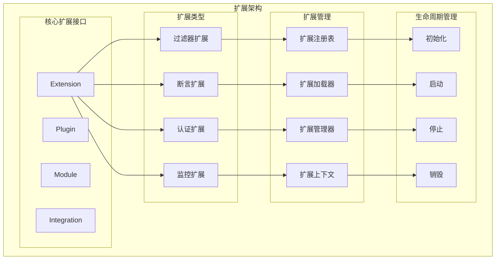
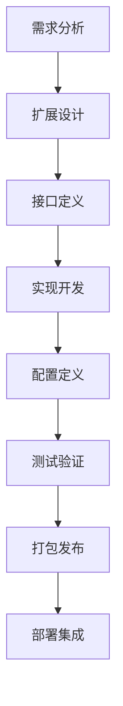

# 扩展开发

TiGateway 扩展开发指南提供了完整的扩展开发框架，帮助您创建自定义的扩展模块，实现特定的业务逻辑和集成需求。

## 扩展开发概述

### 扩展架构



### 扩展开发流程



## 扩展接口定义

### 1. 基础扩展接口

```java
/**
 * 扩展基础接口
 */
public interface Extension {
    
    /**
     * 获取扩展名称
     */
    String getName();
    
    /**
     * 获取扩展版本
     */
    String getVersion();
    
    /**
     * 获取扩展描述
     */
    String getDescription();
    
    /**
     * 获取扩展类型
     */
    ExtensionType getType();
    
    /**
     * 初始化扩展
     */
    void initialize(ExtensionContext context) throws ExtensionException;
    
    /**
     * 启动扩展
     */
    void start() throws ExtensionException;
    
    /**
     * 停止扩展
     */
    void stop() throws ExtensionException;
    
    /**
     * 销毁扩展
     */
    void destroy() throws ExtensionException;
    
    /**
     * 获取扩展状态
     */
    ExtensionStatus getStatus();
    
    /**
     * 获取扩展配置
     */
    ExtensionConfig getConfig();
}

/**
 * 扩展类型枚举
 */
public enum ExtensionType {
    FILTER("过滤器扩展"),
    PREDICATE("断言扩展"),
    AUTHENTICATOR("认证扩展"),
    AUTHORIZER("授权扩展"),
    RATE_LIMITER("限流扩展"),
    MONITOR("监控扩展"),
    INTEGRATION("集成扩展"),
    CUSTOM("自定义扩展");
    
    private final String description;
    
    ExtensionType(String description) {
        this.description = description;
    }
    
    public String getDescription() {
        return description;
    }
}

/**
 * 扩展状态枚举
 */
public enum ExtensionStatus {
    INITIALIZED("已初始化"),
    STARTED("已启动"),
    STOPPED("已停止"),
    DESTROYED("已销毁"),
    ERROR("错误状态");
    
    private final String description;
    
    ExtensionStatus(String description) {
        this.description = description;
    }
    
    public String getDescription() {
        return description;
    }
}
```

### 2. 扩展上下文

```java
/**
 * 扩展上下文
 */
public class ExtensionContext {
    
    private final ApplicationContext applicationContext;
    private final ExtensionConfig config;
    private final ExtensionRegistry registry;
    private final EventPublisher eventPublisher;
    private final MetricsRegistry metricsRegistry;
    
    public ExtensionContext(ApplicationContext applicationContext,
                          ExtensionConfig config,
                          ExtensionRegistry registry,
                          EventPublisher eventPublisher,
                          MetricsRegistry metricsRegistry) {
        this.applicationContext = applicationContext;
        this.config = config;
        this.registry = registry;
        this.eventPublisher = eventPublisher;
        this.metricsRegistry = metricsRegistry;
    }
    
    public ApplicationContext getApplicationContext() {
        return applicationContext;
    }
    
    public ExtensionConfig getConfig() {
        return config;
    }
    
    public ExtensionRegistry getRegistry() {
        return registry;
    }
    
    public EventPublisher getEventPublisher() {
        return eventPublisher;
    }
    
    public MetricsRegistry getMetricsRegistry() {
        return metricsRegistry;
    }
    
    public <T> T getBean(Class<T> type) {
        return applicationContext.getBean(type);
    }
    
    public <T> T getBean(String name, Class<T> type) {
        return applicationContext.getBean(name, type);
    }
    
    public void publishEvent(Object event) {
        eventPublisher.publishEvent(event);
    }
    
    public Timer createTimer(String name, String... tags) {
        return metricsRegistry.timer(name, tags);
    }
    
    public Counter createCounter(String name, String... tags) {
        return metricsRegistry.counter(name, tags);
    }
}
```

### 3. 扩展配置

```java
/**
 * 扩展配置
 */
public class ExtensionConfig {
    
    private String name;
    private String version;
    private String description;
    private ExtensionType type;
    private Map<String, Object> properties;
    private List<Dependency> dependencies;
    private List<String> requiredPermissions;
    private boolean enabled;
    private int priority;
    
    public ExtensionConfig() {
        this.properties = new HashMap<>();
        this.dependencies = new ArrayList<>();
        this.requiredPermissions = new ArrayList<>();
        this.enabled = true;
        this.priority = 0;
    }
    
    // Getters and Setters
    public String getName() {
        return name;
    }
    
    public void setName(String name) {
        this.name = name;
    }
    
    public String getVersion() {
        return version;
    }
    
    public void setVersion(String version) {
        this.version = version;
    }
    
    public String getDescription() {
        return description;
    }
    
    public void setDescription(String description) {
        this.description = description;
    }
    
    public ExtensionType getType() {
        return type;
    }
    
    public void setType(ExtensionType type) {
        this.type = type;
    }
    
    public Map<String, Object> getProperties() {
        return properties;
    }
    
    public void setProperties(Map<String, Object> properties) {
        this.properties = properties;
    }
    
    public List<Dependency> getDependencies() {
        return dependencies;
    }
    
    public void setDependencies(List<Dependency> dependencies) {
        this.dependencies = dependencies;
    }
    
    public List<String> getRequiredPermissions() {
        return requiredPermissions;
    }
    
    public void setRequiredPermissions(List<String> requiredPermissions) {
        this.requiredPermissions = requiredPermissions;
    }
    
    public boolean isEnabled() {
        return enabled;
    }
    
    public void setEnabled(boolean enabled) {
        this.enabled = enabled;
    }
    
    public int getPriority() {
        return priority;
    }
    
    public void setPriority(int priority) {
        this.priority = priority;
    }
    
    public Object getProperty(String key) {
        return properties.get(key);
    }
    
    public void setProperty(String key, Object value) {
        properties.put(key, value);
    }
    
    public String getStringProperty(String key) {
        Object value = properties.get(key);
        return value != null ? value.toString() : null;
    }
    
    public int getIntProperty(String key, int defaultValue) {
        Object value = properties.get(key);
        if (value instanceof Number) {
            return ((Number) value).intValue();
        }
        return defaultValue;
    }
    
    public boolean getBooleanProperty(String key, boolean defaultValue) {
        Object value = properties.get(key);
        if (value instanceof Boolean) {
            return (Boolean) value;
        }
        return defaultValue;
    }
}

/**
 * 扩展依赖
 */
public class Dependency {
    
    private String name;
    private String version;
    private boolean required;
    
    public Dependency() {
        this.required = true;
    }
    
    public Dependency(String name, String version) {
        this.name = name;
        this.version = version;
        this.required = true;
    }
    
    public Dependency(String name, String version, boolean required) {
        this.name = name;
        this.version = version;
        this.required = required;
    }
    
    // Getters and Setters
    public String getName() {
        return name;
    }
    
    public void setName(String name) {
        this.name = name;
    }
    
    public String getVersion() {
        return version;
    }
    
    public void setVersion(String version) {
        this.version = version;
    }
    
    public boolean isRequired() {
        return required;
    }
    
    public void setRequired(boolean required) {
        this.required = required;
    }
}
```

## 扩展管理器

### 1. 扩展注册表

```java
/**
 * 扩展注册表
 */
@Component
public class ExtensionRegistry {
    
    private final Map<String, Extension> extensions = new ConcurrentHashMap<>();
    private final Map<ExtensionType, List<Extension>> extensionsByType = new ConcurrentHashMap<>();
    private final Map<String, ExtensionConfig> configs = new ConcurrentHashMap<>();
    
    public void registerExtension(Extension extension) {
        String name = extension.getName();
        extensions.put(name, extension);
        
        ExtensionType type = extension.getType();
        extensionsByType.computeIfAbsent(type, k -> new ArrayList<>()).add(extension);
        
        log.info("Registered extension: {} of type {}", name, type);
    }
    
    public void unregisterExtension(String name) {
        Extension extension = extensions.remove(name);
        if (extension != null) {
            ExtensionType type = extension.getType();
            List<Extension> typeExtensions = extensionsByType.get(type);
            if (typeExtensions != null) {
                typeExtensions.remove(extension);
            }
            log.info("Unregistered extension: {}", name);
        }
    }
    
    public Extension getExtension(String name) {
        return extensions.get(name);
    }
    
    public List<Extension> getExtensionsByType(ExtensionType type) {
        return extensionsByType.getOrDefault(type, Collections.emptyList());
    }
    
    public Collection<Extension> getAllExtensions() {
        return extensions.values();
    }
    
    public void registerConfig(String name, ExtensionConfig config) {
        configs.put(name, config);
    }
    
    public ExtensionConfig getConfig(String name) {
        return configs.get(name);
    }
    
    public Collection<ExtensionConfig> getAllConfigs() {
        return configs.values();
    }
    
    public boolean isExtensionRegistered(String name) {
        return extensions.containsKey(name);
    }
    
    public int getExtensionCount() {
        return extensions.size();
    }
    
    public int getExtensionCountByType(ExtensionType type) {
        return extensionsByType.getOrDefault(type, Collections.emptyList()).size();
    }
}
```

### 2. 扩展加载器

```java
/**
 * 扩展加载器
 */
@Component
public class ExtensionLoader {
    
    private static final Logger log = LoggerFactory.getLogger(ExtensionLoader.class);
    
    @Autowired
    private ExtensionRegistry registry;
    
    @Autowired
    private ApplicationContext applicationContext;
    
    @Autowired
    private EventPublisher eventPublisher;
    
    @Autowired
    private MeterRegistry meterRegistry;
    
    public void loadExtensions() {
        log.info("Loading extensions...");
        
        // 从配置文件加载扩展配置
        List<ExtensionConfig> configs = loadExtensionConfigs();
        
        // 加载扩展实现
        for (ExtensionConfig config : configs) {
            if (config.isEnabled()) {
                try {
                    loadExtension(config);
                } catch (Exception e) {
                    log.error("Failed to load extension: {}", config.getName(), e);
                }
            }
        }
        
        log.info("Loaded {} extensions", registry.getExtensionCount());
    }
    
    private List<ExtensionConfig> loadExtensionConfigs() {
        List<ExtensionConfig> configs = new ArrayList<>();
        
        // 从 application.yml 加载配置
        configs.addAll(loadConfigsFromYaml());
        
        // 从 ConfigMap 加载配置
        configs.addAll(loadConfigsFromConfigMap());
        
        return configs;
    }
    
    private List<ExtensionConfig> loadConfigsFromYaml() {
        // 实现从 YAML 配置文件加载扩展配置
        return new ArrayList<>();
    }
    
    private List<ExtensionConfig> loadConfigsFromConfigMap() {
        // 实现从 Kubernetes ConfigMap 加载扩展配置
        return new ArrayList<>();
    }
    
    private void loadExtension(ExtensionConfig config) throws Exception {
        log.info("Loading extension: {}", config.getName());
        
        // 检查依赖
        if (!checkDependencies(config)) {
            throw new ExtensionException("Dependencies not satisfied for extension: " + config.getName());
        }
        
        // 创建扩展实例
        Extension extension = createExtensionInstance(config);
        
        // 创建扩展上下文
        ExtensionContext context = new ExtensionContext(
            applicationContext, config, registry, eventPublisher, meterRegistry);
        
        // 初始化扩展
        extension.initialize(context);
        
        // 注册扩展
        registry.registerExtension(extension);
        
        // 启动扩展
        extension.start();
        
        log.info("Successfully loaded extension: {}", config.getName());
    }
    
    private boolean checkDependencies(ExtensionConfig config) {
        for (Dependency dependency : config.getDependencies()) {
            if (dependency.isRequired() && !registry.isExtensionRegistered(dependency.getName())) {
                log.warn("Required dependency not found: {} for extension: {}", 
                        dependency.getName(), config.getName());
                return false;
            }
        }
        return true;
    }
    
    private Extension createExtensionInstance(ExtensionConfig config) throws Exception {
        String className = config.getStringProperty("class");
        if (className == null) {
            throw new ExtensionException("Extension class not specified: " + config.getName());
        }
        
        Class<?> clazz = Class.forName(className);
        if (!Extension.class.isAssignableFrom(clazz)) {
            throw new ExtensionException("Extension class must implement Extension interface: " + className);
        }
        
        return (Extension) clazz.getDeclaredConstructor().newInstance();
    }
}
```

### 3. 扩展管理器

```java
/**
 * 扩展管理器
 */
@Component
public class ExtensionManager {
    
    private static final Logger log = LoggerFactory.getLogger(ExtensionManager.class);
    
    @Autowired
    private ExtensionRegistry registry;
    
    @Autowired
    private ExtensionLoader loader;
    
    @PostConstruct
    public void initialize() {
        log.info("Initializing extension manager...");
        loader.loadExtensions();
        log.info("Extension manager initialized");
    }
    
    @PreDestroy
    public void destroy() {
        log.info("Destroying extension manager...");
        stopAllExtensions();
        log.info("Extension manager destroyed");
    }
    
    public void startExtension(String name) throws ExtensionException {
        Extension extension = registry.getExtension(name);
        if (extension == null) {
            throw new ExtensionException("Extension not found: " + name);
        }
        
        if (extension.getStatus() == ExtensionStatus.STARTED) {
            log.warn("Extension already started: {}", name);
            return;
        }
        
        try {
            extension.start();
            log.info("Started extension: {}", name);
        } catch (Exception e) {
            log.error("Failed to start extension: {}", name, e);
            throw new ExtensionException("Failed to start extension: " + name, e);
        }
    }
    
    public void stopExtension(String name) throws ExtensionException {
        Extension extension = registry.getExtension(name);
        if (extension == null) {
            throw new ExtensionException("Extension not found: " + name);
        }
        
        if (extension.getStatus() == ExtensionStatus.STOPPED) {
            log.warn("Extension already stopped: {}", name);
            return;
        }
        
        try {
            extension.stop();
            log.info("Stopped extension: {}", name);
        } catch (Exception e) {
            log.error("Failed to stop extension: {}", name, e);
            throw new ExtensionException("Failed to stop extension: " + name, e);
        }
    }
    
    public void restartExtension(String name) throws ExtensionException {
        stopExtension(name);
        startExtension(name);
    }
    
    public void startAllExtensions() {
        for (Extension extension : registry.getAllExtensions()) {
            try {
                startExtension(extension.getName());
            } catch (Exception e) {
                log.error("Failed to start extension: {}", extension.getName(), e);
            }
        }
    }
    
    public void stopAllExtensions() {
        for (Extension extension : registry.getAllExtensions()) {
            try {
                stopExtension(extension.getName());
            } catch (Exception e) {
                log.error("Failed to stop extension: {}", extension.getName(), e);
            }
        }
    }
    
    public ExtensionStatus getExtensionStatus(String name) {
        Extension extension = registry.getExtension(name);
        return extension != null ? extension.getStatus() : null;
    }
    
    public List<Extension> getExtensionsByType(ExtensionType type) {
        return registry.getExtensionsByType(type);
    }
    
    public ExtensionInfo getExtensionInfo(String name) {
        Extension extension = registry.getExtension(name);
        if (extension == null) {
            return null;
        }
        
        return ExtensionInfo.builder()
            .name(extension.getName())
            .version(extension.getVersion())
            .description(extension.getDescription())
            .type(extension.getType())
            .status(extension.getStatus())
            .config(extension.getConfig())
            .build();
    }
    
    public List<ExtensionInfo> getAllExtensionInfo() {
        return registry.getAllExtensions().stream()
            .map(this::getExtensionInfo)
            .collect(Collectors.toList());
    }
}
```

## 扩展实现示例

### 1. 自定义过滤器扩展

```java
/**
 * 自定义请求日志过滤器扩展
 */
public class RequestLoggingFilterExtension implements Extension {
    
    private static final Logger log = LoggerFactory.getLogger(RequestLoggingFilterExtension.class);
    
    private String name;
    private String version;
    private String description;
    private ExtensionType type;
    private ExtensionStatus status;
    private ExtensionConfig config;
    private ExtensionContext context;
    
    private Timer requestTimer;
    private Counter requestCounter;
    private Counter errorCounter;
    
    @Override
    public String getName() {
        return name;
    }
    
    @Override
    public String getVersion() {
        return version;
    }
    
    @Override
    public String getDescription() {
        return description;
    }
    
    @Override
    public ExtensionType getType() {
        return type;
    }
    
    @Override
    public ExtensionStatus getStatus() {
        return status;
    }
    
    @Override
    public ExtensionConfig getConfig() {
        return config;
    }
    
    @Override
    public void initialize(ExtensionContext context) throws ExtensionException {
        this.context = context;
        this.config = context.getConfig();
        
        this.name = config.getName();
        this.version = config.getVersion();
        this.description = config.getDescription();
        this.type = config.getType();
        this.status = ExtensionStatus.INITIALIZED;
        
        // 初始化指标
        this.requestTimer = context.createTimer("tigateway.extension.request.logging.duration");
        this.requestCounter = context.createCounter("tigateway.extension.request.logging.total");
        this.errorCounter = context.createCounter("tigateway.extension.request.logging.errors");
        
        log.info("Initialized extension: {}", name);
    }
    
    @Override
    public void start() throws ExtensionException {
        this.status = ExtensionStatus.STARTED;
        log.info("Started extension: {}", name);
    }
    
    @Override
    public void stop() throws ExtensionException {
        this.status = ExtensionStatus.STOPPED;
        log.info("Stopped extension: {}", name);
    }
    
    @Override
    public void destroy() throws ExtensionException {
        this.status = ExtensionStatus.DESTROYED;
        log.info("Destroyed extension: {}", name);
    }
    
    /**
     * 处理请求日志
     */
    public void logRequest(ServerWebExchange exchange) {
        try {
            ServerHttpRequest request = exchange.getRequest();
            String method = request.getMethod().name();
            String path = request.getPath().value();
            String clientIp = getClientIp(request);
            
            // 记录请求日志
            log.info("Request: {} {} from {}", method, path, clientIp);
            
            // 记录指标
            requestCounter.increment();
            
        } catch (Exception e) {
            log.error("Failed to log request", e);
            errorCounter.increment();
        }
    }
    
    private String getClientIp(ServerHttpRequest request) {
        String xForwardedFor = request.getHeaders().getFirst("X-Forwarded-For");
        if (xForwardedFor != null && !xForwardedFor.isEmpty()) {
            return xForwardedFor.split(",")[0].trim();
        }
        
        String xRealIp = request.getHeaders().getFirst("X-Real-IP");
        if (xRealIp != null && !xRealIp.isEmpty()) {
            return xRealIp;
        }
        
        return request.getRemoteAddress() != null ? 
            request.getRemoteAddress().getAddress().getHostAddress() : "unknown";
    }
}
```

### 2. 自定义监控扩展

```java
/**
 * 自定义系统监控扩展
 */
public class SystemMonitoringExtension implements Extension {
    
    private static final Logger log = LoggerFactory.getLogger(SystemMonitoringExtension.class);
    
    private String name;
    private String version;
    private String description;
    private ExtensionType type;
    private ExtensionStatus status;
    private ExtensionConfig config;
    private ExtensionContext context;
    
    private ScheduledExecutorService scheduler;
    private Gauge memoryUsageGauge;
    private Gauge cpuUsageGauge;
    private Gauge diskUsageGauge;
    
    @Override
    public String getName() {
        return name;
    }
    
    @Override
    public String getVersion() {
        return version;
    }
    
    @Override
    public String getDescription() {
        return description;
    }
    
    @Override
    public ExtensionType getType() {
        return type;
    }
    
    @Override
    public ExtensionStatus getStatus() {
        return status;
    }
    
    @Override
    public ExtensionConfig getConfig() {
        return config;
    }
    
    @Override
    public void initialize(ExtensionContext context) throws ExtensionException {
        this.context = context;
        this.config = context.getConfig();
        
        this.name = config.getName();
        this.version = config.getVersion();
        this.description = config.getDescription();
        this.type = config.getType();
        this.status = ExtensionStatus.INITIALIZED;
        
        // 初始化指标
        this.memoryUsageGauge = Gauge.builder("tigateway.extension.system.memory.usage")
            .description("Memory usage percentage")
            .register(context.getMetricsRegistry());
        
        this.cpuUsageGauge = Gauge.builder("tigateway.extension.system.cpu.usage")
            .description("CPU usage percentage")
            .register(context.getMetricsRegistry());
        
        this.diskUsageGauge = Gauge.builder("tigateway.extension.system.disk.usage")
            .description("Disk usage percentage")
            .register(context.getMetricsRegistry());
        
        log.info("Initialized extension: {}", name);
    }
    
    @Override
    public void start() throws ExtensionException {
        this.status = ExtensionStatus.STARTED;
        
        // 启动监控任务
        int interval = config.getIntProperty("monitoring.interval", 30);
        scheduler = Executors.newScheduledThreadPool(1);
        scheduler.scheduleAtFixedRate(this::collectSystemMetrics, 0, interval, TimeUnit.SECONDS);
        
        log.info("Started extension: {}", name);
    }
    
    @Override
    public void stop() throws ExtensionException {
        this.status = ExtensionStatus.STOPPED;
        
        if (scheduler != null) {
            scheduler.shutdown();
            try {
                if (!scheduler.awaitTermination(5, TimeUnit.SECONDS)) {
                    scheduler.shutdownNow();
                }
            } catch (InterruptedException e) {
                scheduler.shutdownNow();
                Thread.currentThread().interrupt();
            }
        }
        
        log.info("Stopped extension: {}", name);
    }
    
    @Override
    public void destroy() throws ExtensionException {
        this.status = ExtensionStatus.DESTROYED;
        log.info("Destroyed extension: {}", name);
    }
    
    private void collectSystemMetrics() {
        try {
            // 收集内存使用情况
            MemoryMXBean memoryBean = ManagementFactory.getMemoryMXBean();
            MemoryUsage heapUsage = memoryBean.getHeapMemoryUsage();
            double memoryUsage = (double) heapUsage.getUsed() / heapUsage.getMax();
            memoryUsageGauge.set(memoryUsage);
            
            // 收集 CPU 使用情况
            OperatingSystemMXBean osBean = ManagementFactory.getOperatingSystemMXBean();
            if (osBean instanceof com.sun.management.OperatingSystemMXBean) {
                com.sun.management.OperatingSystemMXBean sunOsBean = 
                    (com.sun.management.OperatingSystemMXBean) osBean;
                double cpuUsage = sunOsBean.getProcessCpuLoad();
                cpuUsageGauge.set(cpuUsage);
            }
            
            // 收集磁盘使用情况
            File root = new File("/");
            long totalSpace = root.getTotalSpace();
            long freeSpace = root.getFreeSpace();
            double diskUsage = (double) (totalSpace - freeSpace) / totalSpace;
            diskUsageGauge.set(diskUsage);
            
        } catch (Exception e) {
            log.error("Failed to collect system metrics", e);
        }
    }
}
```

### 3. 自定义集成扩展

```java
/**
 * 自定义外部系统集成扩展
 */
public class ExternalSystemIntegrationExtension implements Extension {
    
    private static final Logger log = LoggerFactory.getLogger(ExternalSystemIntegrationExtension.class);
    
    private String name;
    private String version;
    private String description;
    private ExtensionType type;
    private ExtensionStatus status;
    private ExtensionConfig config;
    private ExtensionContext context;
    
    private WebClient webClient;
    private Timer requestTimer;
    private Counter requestCounter;
    private Counter errorCounter;
    
    @Override
    public String getName() {
        return name;
    }
    
    @Override
    public String getVersion() {
        return version;
    }
    
    @Override
    public String getDescription() {
        return description;
    }
    
    @Override
    public ExtensionType getType() {
        return type;
    }
    
    @Override
    public ExtensionStatus getStatus() {
        return status;
    }
    
    @Override
    public ExtensionConfig getConfig() {
        return config;
    }
    
    @Override
    public void initialize(ExtensionContext context) throws ExtensionException {
        this.context = context;
        this.config = context.getConfig();
        
        this.name = config.getName();
        this.version = config.getVersion();
        this.description = config.getDescription();
        this.type = config.getType();
        this.status = ExtensionStatus.INITIALIZED;
        
        // 初始化 WebClient
        String baseUrl = config.getStringProperty("baseUrl");
        if (baseUrl == null) {
            throw new ExtensionException("Base URL not configured for extension: " + name);
        }
        
        this.webClient = WebClient.builder()
            .baseUrl(baseUrl)
            .defaultHeader("User-Agent", "TiGateway-Extension/" + version)
            .build();
        
        // 初始化指标
        this.requestTimer = context.createTimer("tigateway.extension.external.request.duration");
        this.requestCounter = context.createCounter("tigateway.extension.external.request.total");
        this.errorCounter = context.createCounter("tigateway.extension.external.request.errors");
        
        log.info("Initialized extension: {}", name);
    }
    
    @Override
    public void start() throws ExtensionException {
        this.status = ExtensionStatus.STARTED;
        log.info("Started extension: {}", name);
    }
    
    @Override
    public void stop() throws ExtensionException {
        this.status = ExtensionStatus.STOPPED;
        log.info("Stopped extension: {}", name);
    }
    
    @Override
    public void destroy() throws ExtensionException {
        this.status = ExtensionStatus.DESTROYED;
        log.info("Destroyed extension: {}", name);
    }
    
    /**
     * 调用外部系统 API
     */
    public Mono<String> callExternalApi(String endpoint, Object request) {
        return Mono.fromCallable(() -> {
            Timer.Sample sample = Timer.start();
            try {
                requestCounter.increment();
                
                String response = webClient.post()
                    .uri(endpoint)
                    .bodyValue(request)
                    .retrieve()
                    .bodyToMono(String.class)
                    .timeout(Duration.ofSeconds(30))
                    .block();
                
                sample.stop(requestTimer);
                return response;
                
            } catch (Exception e) {
                sample.stop(requestTimer);
                errorCounter.increment();
                log.error("Failed to call external API: {}", endpoint, e);
                throw new ExtensionException("External API call failed", e);
            }
        });
    }
    
    /**
     * 健康检查
     */
    public Mono<Boolean> healthCheck() {
        return webClient.get()
            .uri("/health")
            .retrieve()
            .bodyToMono(String.class)
            .map(response -> "OK".equals(response))
            .timeout(Duration.ofSeconds(5))
            .onErrorReturn(false);
    }
}
```

## 扩展配置

### 1. 扩展配置文件

```yaml
# extensions.yml
tigateway:
  extensions:
    enabled: true
    
    # 扩展配置
    configs:
      - name: "request-logging-filter"
        version: "1.0.0"
        description: "请求日志过滤器扩展"
        type: "FILTER"
        enabled: true
        priority: 1
        class: "com.tigateway.extension.RequestLoggingFilterExtension"
        properties:
          logLevel: "INFO"
          includeHeaders: true
          includeBody: false
        dependencies:
          - name: "system-monitoring"
            version: "1.0.0"
            required: true
        requiredPermissions:
          - "extension:read"
          - "extension:write"
      
      - name: "system-monitoring"
        version: "1.0.0"
        description: "系统监控扩展"
        type: "MONITOR"
        enabled: true
        priority: 2
        class: "com.tigateway.extension.SystemMonitoringExtension"
        properties:
          monitoring.interval: 30
          monitoring.memory: true
          monitoring.cpu: true
          monitoring.disk: true
        dependencies: []
        requiredPermissions:
          - "monitoring:read"
      
      - name: "external-system-integration"
        version: "1.0.0"
        description: "外部系统集成扩展"
        type: "INTEGRATION"
        enabled: true
        priority: 3
        class: "com.tigateway.extension.ExternalSystemIntegrationExtension"
        properties:
          baseUrl: "https://api.external-system.com"
          timeout: 30000
          retryAttempts: 3
          retryDelay: 1000
        dependencies: []
        requiredPermissions:
          - "integration:read"
          - "integration:write"
```

### 2. 扩展自动配置

```java
/**
 * 扩展自动配置
 */
@Configuration
@EnableConfigurationProperties
@ConditionalOnProperty(name = "tigateway.extensions.enabled", havingValue = "true", matchIfMissing = true)
public class ExtensionAutoConfiguration {
    
    @Bean
    @ConditionalOnMissingBean
    public ExtensionRegistry extensionRegistry() {
        return new ExtensionRegistry();
    }
    
    @Bean
    @ConditionalOnMissingBean
    public ExtensionLoader extensionLoader() {
        return new ExtensionLoader();
    }
    
    @Bean
    @ConditionalOnMissingBean
    public ExtensionManager extensionManager() {
        return new ExtensionManager();
    }
    
    @Bean
    @ConditionalOnMissingBean
    public ExtensionController extensionController() {
        return new ExtensionController();
    }
}
```

### 3. 扩展管理 API

```java
/**
 * 扩展管理控制器
 */
@RestController
@RequestMapping("/api/v1/extensions")
public class ExtensionController {
    
    @Autowired
    private ExtensionManager extensionManager;
    
    @GetMapping
    public ResponseEntity<List<ExtensionInfo>> getAllExtensions() {
        List<ExtensionInfo> extensions = extensionManager.getAllExtensionInfo();
        return ResponseEntity.ok(extensions);
    }
    
    @GetMapping("/{name}")
    public ResponseEntity<ExtensionInfo> getExtension(@PathVariable String name) {
        ExtensionInfo extension = extensionManager.getExtensionInfo(name);
        if (extension == null) {
            return ResponseEntity.notFound().build();
        }
        return ResponseEntity.ok(extension);
    }
    
    @PostMapping("/{name}/start")
    public ResponseEntity<Void> startExtension(@PathVariable String name) {
        try {
            extensionManager.startExtension(name);
            return ResponseEntity.ok().build();
        } catch (ExtensionException e) {
            return ResponseEntity.badRequest().build();
        }
    }
    
    @PostMapping("/{name}/stop")
    public ResponseEntity<Void> stopExtension(@PathVariable String name) {
        try {
            extensionManager.stopExtension(name);
            return ResponseEntity.ok().build();
        } catch (ExtensionException e) {
            return ResponseEntity.badRequest().build();
        }
    }
    
    @PostMapping("/{name}/restart")
    public ResponseEntity<Void> restartExtension(@PathVariable String name) {
        try {
            extensionManager.restartExtension(name);
            return ResponseEntity.ok().build();
        } catch (ExtensionException e) {
            return ResponseEntity.badRequest().build();
        }
    }
    
    @GetMapping("/{name}/status")
    public ResponseEntity<ExtensionStatus> getExtensionStatus(@PathVariable String name) {
        ExtensionStatus status = extensionManager.getExtensionStatus(name);
        if (status == null) {
            return ResponseEntity.notFound().build();
        }
        return ResponseEntity.ok(status);
    }
    
    @GetMapping("/type/{type}")
    public ResponseEntity<List<ExtensionInfo>> getExtensionsByType(@PathVariable ExtensionType type) {
        List<Extension> extensions = extensionManager.getExtensionsByType(type);
        List<ExtensionInfo> extensionInfos = extensions.stream()
            .map(extension -> extensionManager.getExtensionInfo(extension.getName()))
            .collect(Collectors.toList());
        return ResponseEntity.ok(extensionInfos);
    }
}
```

## 扩展测试

### 1. 单元测试

```java
/**
 * 扩展单元测试
 */
@ExtendWith(MockitoExtension.class)
class ExtensionTest {
    
    @Mock
    private ExtensionContext context;
    
    @Mock
    private ExtensionConfig config;
    
    @Mock
    private MeterRegistry meterRegistry;
    
    @Test
    void testRequestLoggingFilterExtension() throws Exception {
        // 准备测试数据
        when(config.getName()).thenReturn("test-extension");
        when(config.getVersion()).thenReturn("1.0.0");
        when(config.getDescription()).thenReturn("Test extension");
        when(config.getType()).thenReturn(ExtensionType.FILTER);
        when(context.getConfig()).thenReturn(config);
        when(context.getMetricsRegistry()).thenReturn(meterRegistry);
        
        // 创建扩展实例
        RequestLoggingFilterExtension extension = new RequestLoggingFilterExtension();
        
        // 测试初始化
        extension.initialize(context);
        assertEquals(ExtensionStatus.INITIALIZED, extension.getStatus());
        assertEquals("test-extension", extension.getName());
        assertEquals("1.0.0", extension.getVersion());
        
        // 测试启动
        extension.start();
        assertEquals(ExtensionStatus.STARTED, extension.getStatus());
        
        // 测试停止
        extension.stop();
        assertEquals(ExtensionStatus.STOPPED, extension.getStatus());
        
        // 测试销毁
        extension.destroy();
        assertEquals(ExtensionStatus.DESTROYED, extension.getStatus());
    }
}
```

### 2. 集成测试

```java
/**
 * 扩展集成测试
 */
@SpringBootTest(webEnvironment = SpringBootTest.WebEnvironment.RANDOM_PORT)
@TestPropertySource(properties = {
    "tigateway.extensions.enabled=true",
    "tigateway.extensions.configs[0].name=test-extension",
    "tigateway.extensions.configs[0].type=FILTER",
    "tigateway.extensions.configs[0].enabled=true",
    "tigateway.extensions.configs[0].class=com.tigateway.extension.RequestLoggingFilterExtension"
})
class ExtensionIntegrationTest {
    
    @Autowired
    private ExtensionManager extensionManager;
    
    @Autowired
    private TestRestTemplate restTemplate;
    
    @LocalServerPort
    private int port;
    
    @Test
    void testExtensionManagement() {
        // 测试获取所有扩展
        ResponseEntity<List> response = restTemplate.getForEntity(
            "http://localhost:" + port + "/api/v1/extensions", List.class);
        assertEquals(HttpStatus.OK, response.getStatusCode());
        
        // 测试获取扩展信息
        ResponseEntity<Map> extensionResponse = restTemplate.getForEntity(
            "http://localhost:" + port + "/api/v1/extensions/test-extension", Map.class);
        assertEquals(HttpStatus.OK, extensionResponse.getStatusCode());
        
        // 测试启动扩展
        ResponseEntity<Void> startResponse = restTemplate.postForEntity(
            "http://localhost:" + port + "/api/v1/extensions/test-extension/start", null, Void.class);
        assertEquals(HttpStatus.OK, startResponse.getStatusCode());
        
        // 测试停止扩展
        ResponseEntity<Void> stopResponse = restTemplate.postForEntity(
            "http://localhost:" + port + "/api/v1/extensions/test-extension/stop", null, Void.class);
        assertEquals(HttpStatus.OK, stopResponse.getStatusCode());
    }
}
```

## 总结

TiGateway 扩展开发指南提供了完整的扩展开发框架：

1. **扩展架构**: 清晰的扩展架构和开发流程
2. **扩展接口**: 基础扩展接口、扩展上下文和扩展配置
3. **扩展管理**: 扩展注册表、扩展加载器和扩展管理器
4. **扩展实现**: 自定义过滤器扩展、监控扩展和集成扩展
5. **扩展配置**: 扩展配置文件、自动配置和管理 API
6. **扩展测试**: 单元测试和集成测试
7. **扩展部署**: 扩展打包、部署和运维

通过扩展开发框架，可以轻松创建自定义扩展，实现特定的业务逻辑和集成需求，为 TiGateway 提供更强大的功能和更好的可扩展性。
