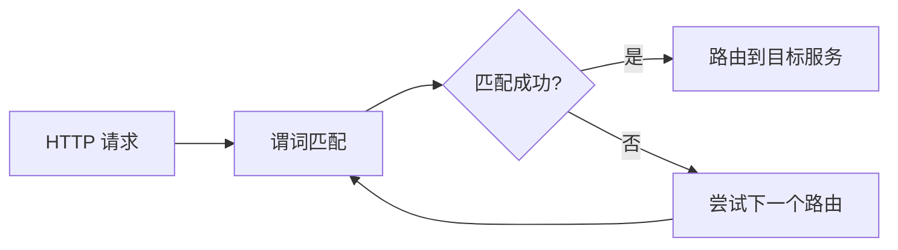

# TiGateway CRD 谓词配置文档

## 概述

本文档详细说明了 TiGateway 中各种路由谓词（Predicate）的 CRD 配置方法。谓词是 Spring Cloud Gateway 的核心概念，用于匹配和路由 HTTP 请求。每个谓词都是一个 Java 8 Function Predicate，输入类型是 `ServerWebExchange`。

## 1. 谓词基础概念

### 1.1 谓词工作原理



### 1.2 谓词组合

多个谓词使用逻辑 `and` 组合，所有谓词都必须返回 `true` 才能匹配路由：

```yaml
predicates:
  - Path=/api/users/**
  - Method=GET,POST
  - Header=X-Request-Id, \d+
```

## 2. 时间相关谓词

### 2.1 After 谓词

匹配指定时间之后发生的请求。

```yaml
apiVersion: tigateway.cn/v1
kind: TiGatewayRouteConfig
metadata:
  name: after-predicate-example
spec:
  routes:
    - id: after-route
      uri: https://example.org
      predicates:
        - After=2017-01-20T17:42:47.789-07:00[America/Denver]
```

**配置参数:**
- `datetime`: Java `ZonedDateTime` 格式的时间

**使用场景:**
- 维护窗口控制
- 功能发布时间控制
- 临时路由配置

### 2.2 Before 谓词

匹配指定时间之前发生的请求。

```yaml
apiVersion: tigateway.cn/v1
kind: TiGatewayRouteConfig
metadata:
  name: before-predicate-example
spec:
  routes:
    - id: before-route
      uri: https://example.org
      predicates:
        - Before=2017-01-20T17:42:47.789-07:00[America/Denver]
```

**配置参数:**
- `datetime`: Java `ZonedDateTime` 格式的时间

**使用场景:**
- 功能下线时间控制
- 维护窗口结束控制

### 2.3 Between 谓词

匹配两个时间点之间发生的请求。

```yaml
apiVersion: tigateway.cn/v1
kind: TiGatewayRouteConfig
metadata:
  name: between-predicate-example
spec:
  routes:
    - id: between-route
      uri: https://example.org
      predicates:
        - Between=2017-01-20T17:42:47.789-07:00[America/Denver], 2017-01-21T17:42:47.789-07:00[America/Denver]
```

**配置参数:**
- `datetime1`: 开始时间
- `datetime2`: 结束时间（必须晚于开始时间）

**使用场景:**
- 维护窗口
- 限时功能
- 测试环境访问控制

## 3. 请求路径谓词

### 3.1 Path 谓词

基于请求路径进行匹配，支持 Ant 风格模式。

```yaml
apiVersion: tigateway.cn/v1
kind: TiGatewayRouteConfig
metadata:
  name: path-predicate-example
spec:
  routes:
    - id: path-route
      uri: https://example.org
      predicates:
        - Path=/red/{segment},/blue/{segment}
```

**配置参数:**
- `patterns`: Spring `PathMatcher` 模式列表
- `matchTrailingSlash`: 是否匹配尾部斜杠（默认 true）

**路径变量提取:**
```yaml
predicates:
  - Path=/api/users/{userId}/orders/{orderId}
```

路径变量会存储在 `ServerWebExchange.getAttributes()` 中，键为 `ServerWebExchangeUtils.URI_TEMPLATE_VARIABLES_ATTRIBUTE`。

**使用场景:**
- API 版本路由
- 资源路径路由
- 微服务路径映射

## 4. HTTP 方法谓词

### 4.1 Method 谓词

基于 HTTP 方法进行匹配。

```yaml
apiVersion: tigateway.cn/v1
kind: TiGatewayRouteConfig
metadata:
  name: method-predicate-example
spec:
  routes:
    - id: method-route
      uri: https://example.org
      predicates:
        - Method=GET,POST
```

**配置参数:**
- `methods`: HTTP 方法列表（GET, POST, PUT, DELETE, PATCH, HEAD, OPTIONS）

**使用场景:**
- RESTful API 路由
- 只读操作路由
- 写操作路由

## 5. 请求头谓词

### 5.1 Header 谓词

基于请求头进行匹配。

```yaml
apiVersion: tigateway.cn/v1
kind: TiGatewayRouteConfig
metadata:
  name: header-predicate-example
spec:
  routes:
    - id: header-route
      uri: https://example.org
      predicates:
        - Header=X-Request-Id, \d+
```

**配置参数:**
- `header`: 请求头名称
- `regexp`: Java 正则表达式（可选）

**示例:**
```yaml
predicates:
  - Header=Content-Type, application/json
  - Header=Authorization, Bearer .*
  - Header=X-API-Version, v[12]
```

**使用场景:**
- API 版本控制
- 认证头验证
- 内容类型路由

## 6. Cookie 谓词

### 6.1 Cookie 谓词

基于 Cookie 进行匹配。

```yaml
apiVersion: tigateway.cn/v1
kind: TiGatewayRouteConfig
metadata:
  name: cookie-predicate-example
spec:
  routes:
    - id: cookie-route
      uri: https://example.org
      predicates:
        - Cookie=chocolate, ch.p
```

**配置参数:**
- `name`: Cookie 名称
- `regexp`: Java 正则表达式

**示例:**
```yaml
predicates:
  - Cookie=session, .*
  - Cookie=user-type, (admin|user)
  - Cookie=theme, (light|dark)
```

**使用场景:**
- 会话管理
- 用户类型路由
- 主题切换

## 7. 主机名谓词

### 7.1 Host 谓词

基于 Host 头进行匹配。

```yaml
apiVersion: tigateway.cn/v1
kind: TiGatewayRouteConfig
metadata:
  name: host-predicate-example
spec:
  routes:
    - id: host-route
      uri: https://example.org
      predicates:
        - Host=**.somehost.org,**.anotherhost.org
```

**配置参数:**
- `patterns`: Ant 风格的主机名模式列表

**URI 模板变量:**
```yaml
predicates:
  - Host={sub}.myhost.org
```

**示例:**
```yaml
predicates:
  - Host=api.example.com
  - Host=*.api.example.com
  - Host=admin.example.com,user.example.com
```

**使用场景:**
- 多租户应用
- 子域名路由
- 环境隔离

## 8. 查询参数谓词

### 8.1 Query 谓词

基于查询参数进行匹配。

```yaml
apiVersion: tigateway.cn/v1
kind: TiGatewayRouteConfig
metadata:
  name: query-predicate-example
spec:
  routes:
    - id: query-route
      uri: https://example.org
      predicates:
        - Query=green
        - Query=red, gree.
```

**配置参数:**
- `param`: 查询参数名称（必需）
- `regexp`: Java 正则表达式（可选）

**示例:**
```yaml
predicates:
  - Query=version
  - Query=debug, true
  - Query=format, (json|xml)
  - Query=page, \d+
```

**使用场景:**
- API 版本控制
- 调试模式路由
- 格式选择路由

## 9. 远程地址谓词

### 9.1 RemoteAddr 谓词

基于客户端 IP 地址进行匹配。

```yaml
apiVersion: tigateway.cn/v1
kind: TiGatewayRouteConfig
metadata:
  name: remote-addr-predicate-example
spec:
  routes:
    - id: remote-addr-route
      uri: https://example.org
      predicates:
        - RemoteAddr=192.168.1.1/24
```

**配置参数:**
- `sources`: CIDR 注解字符串列表（IPv4 或 IPv6）

**示例:**
```yaml
predicates:
  - RemoteAddr=192.168.1.0/24
  - RemoteAddr=10.0.0.0/8,172.16.0.0/12
  - RemoteAddr=2001:db8::/32
```

**使用场景:**
- 内网访问控制
- 地理位置路由
- 安全访问限制

### 9.2 自定义远程地址解析

当网关位于代理层后面时，需要自定义远程地址解析：

```yaml
apiVersion: tigateway.cn/v1
kind: TiGatewayRouteConfig
metadata:
  name: custom-remote-addr
spec:
  remoteAddressResolver:
    type: XForwardedRemoteAddressResolver
    maxTrustedIndex: 1
  routes:
    - id: proxied-route
      uri: https://downstream2
      predicates:
        - RemoteAddr=10.10.1.1, 10.10.1.1/24
```

**配置选项:**
- `trustAll`: 信任所有 X-Forwarded-For 头（不安全）
- `maxTrustedIndex`: 最大信任索引，基于可信基础设施数量

**X-Forwarded-For 示例:**
```
X-Forwarded-For: 0.0.0.1, 0.0.0.2, 0.0.0.3
```

不同 `maxTrustedIndex` 值的结果：

| maxTrustedIndex | 结果 |
|----------------|------|
| 1 | 0.0.0.3 |
| 2 | 0.0.0.2 |
| 3 | 0.0.0.1 |

## 10. X-Forwarded-For 谓词

### 10.1 XForwardedRemoteAddr 谓词

基于 X-Forwarded-For 头进行匹配。

```yaml
apiVersion: tigateway.cn/v1
kind: TiGatewayRouteConfig
metadata:
  name: xforwarded-predicate-example
spec:
  routes:
    - id: xforwarded-route
      uri: https://example.org
      predicates:
        - XForwardedRemoteAddr=192.168.1.1/24
```

**配置参数:**
- `sources`: CIDR 注解字符串列表

**使用场景:**
- 反向代理环境
- 负载均衡器环境
- 多层代理环境

## 11. 权重谓词

### 11.1 Weight 谓词

基于权重进行路由分发。

```yaml
apiVersion: tigateway.cn/v1
kind: TiGatewayRouteConfig
metadata:
  name: weight-predicate-example
spec:
  routes:
    - id: weight-high
      uri: https://weighthigh.org
      predicates:
        - Weight=group1, 8
    - id: weight-low
      uri: https://weightlow.org
      predicates:
        - Weight=group1, 2
```

**配置参数:**
- `group`: 权重组名称
- `weight`: 权重值（整数）

**权重计算:**
- 总权重 = 8 + 2 = 10
- weight-high 路由: 8/10 = 80% 流量
- weight-low 路由: 2/10 = 20% 流量

**使用场景:**
- 灰度发布
- A/B 测试
- 流量分配
- 金丝雀部署

## 12. 复合谓词配置

### 12.1 多条件组合

```yaml
apiVersion: tigateway.cn/v1
kind: TiGatewayRouteConfig
metadata:
  name: complex-predicate-example
spec:
  routes:
    - id: complex-route
      uri: https://example.org
      predicates:
        - Path=/api/v1/**
        - Method=GET,POST
        - Header=X-API-Version, v1
        - Header=Authorization, Bearer .*
        - Cookie=session, .*
        - Host=api.example.com
        - Query=format, json
        - RemoteAddr=192.168.0.0/16
        - After=2024-01-01T00:00:00Z
        - Before=2024-12-31T23:59:59Z
        - Weight=production, 100
```

### 12.2 条件优先级

谓词按以下顺序评估：
1. 时间相关谓词（After, Before, Between）
2. 路径相关谓词（Path）
3. 方法相关谓词（Method）
4. 头相关谓词（Header, Cookie, Host）
5. 参数相关谓词（Query）
6. 地址相关谓词（RemoteAddr, XForwardedRemoteAddr）
7. 权重相关谓词（Weight）

## 13. 谓词最佳实践

### 13.1 性能优化

1. **谓词顺序**: 将最可能匹配失败的谓词放在前面
2. **正则表达式**: 避免复杂的正则表达式
3. **路径匹配**: 使用精确路径匹配而不是通配符
4. **缓存结果**: 对于重复的谓词计算，考虑缓存

### 13.2 安全考虑

1. **输入验证**: 使用谓词验证请求参数
2. **访问控制**: 使用 RemoteAddr 限制访问来源
3. **认证检查**: 使用 Header 谓词检查认证信息
4. **时间窗口**: 使用时间谓词限制访问时间

### 13.3 调试技巧

1. **日志记录**: 启用 DEBUG 级别日志查看谓词匹配过程
2. **测试工具**: 使用 curl 或 Postman 测试谓词匹配
3. **监控指标**: 监控谓词匹配成功率
4. **错误处理**: 为谓词匹配失败提供清晰的错误信息

## 14. 谓词配置示例

### 14.1 API 网关路由

```yaml
apiVersion: tigateway.cn/v1
kind: TiGatewayRouteConfig
metadata:
  name: api-gateway-routes
spec:
  routes:
    # 用户服务路由
    - id: user-service-route
      uri: lb://user-service
      predicates:
        - Path=/api/users/**
        - Method=GET,POST,PUT,DELETE
        - Header=X-API-Version, v1
      filters:
        - StripPrefix=2
        - AddRequestHeader=X-Service, user-service
      order: 1

    # 订单服务路由
    - id: order-service-route
      uri: lb://order-service
      predicates:
        - Path=/api/orders/**
        - Method=GET,POST,PUT
        - Header=X-API-Version, v1
      filters:
        - StripPrefix=2
        - AddRequestHeader=X-Service, order-service
      order: 2

    # 管理接口路由（仅内网访问）
    - id: admin-route
      uri: lb://admin-service
      predicates:
        - Path=/admin/**
        - RemoteAddr=192.168.0.0/16,10.0.0.0/8
        - Header=X-Admin-Token, .*
      filters:
        - StripPrefix=1
        - AddRequestHeader=X-Service, admin-service
      order: 3

    # 灰度发布路由
    - id: user-service-v2-canary
      uri: lb://user-service-v2
      predicates:
        - Path=/api/users/**
        - Header=X-Canary, true
        - Weight=canary, 10
      filters:
        - StripPrefix=2
        - AddRequestHeader=X-Service, user-service-v2
        - AddRequestHeader=X-Canary, true
      order: 0  # 更高优先级

    # 维护模式路由
    - id: maintenance-route
      uri: https://maintenance.example.com
      predicates:
        - Path=/**
        - Header=X-Maintenance, true
      filters:
        - SetStatus=503
        - AddResponseHeader=Retry-After, 3600
      order: -1  # 最高优先级
```

### 14.2 多环境路由

```yaml
apiVersion: tigateway.cn/v1
kind: TiGatewayRouteConfig
metadata:
  name: multi-environment-routes
spec:
  routes:
    # 开发环境路由
    - id: dev-route
      uri: lb://dev-service
      predicates:
        - Path=/api/**
        - Host=dev-api.example.com
        - Header=X-Environment, dev
      filters:
        - StripPrefix=1
        - AddRequestHeader=X-Environment, dev
      order: 1

    # 测试环境路由
    - id: test-route
      uri: lb://test-service
      predicates:
        - Path=/api/**
        - Host=test-api.example.com
        - Header=X-Environment, test
      filters:
        - StripPrefix=1
        - AddRequestHeader=X-Environment, test
      order: 1

    # 生产环境路由
    - id: prod-route
      uri: lb://prod-service
      predicates:
        - Path=/api/**
        - Host=api.example.com
        - Header=X-Environment, prod
      filters:
        - StripPrefix=1
        - AddRequestHeader=X-Environment, prod
      order: 1
```

### 14.3 安全路由

```yaml
apiVersion: tigateway.cn/v1
kind: TiGatewayRouteConfig
metadata:
  name: security-routes
spec:
  routes:
    # 公开 API 路由
    - id: public-api-route
      uri: lb://public-service
      predicates:
        - Path=/api/public/**
        - Method=GET
        - RemoteAddr=0.0.0.0/0
      filters:
        - StripPrefix=2
        - AddRequestHeader=X-Access-Type, public
      order: 1

    # 认证 API 路由
    - id: auth-api-route
      uri: lb://auth-service
      predicates:
        - Path=/api/auth/**
        - Method=POST
        - Header=Content-Type, application/json
      filters:
        - StripPrefix=2
        - AddRequestHeader=X-Access-Type, auth
      order: 1

    # 受保护 API 路由
    - id: protected-api-route
      uri: lb://protected-service
      predicates:
        - Path=/api/protected/**
        - Header=Authorization, Bearer .*
        - Cookie=session, .*
        - RemoteAddr=192.168.0.0/16
      filters:
        - StripPrefix=2
        - AddRequestHeader=X-Access-Type, protected
        - CircuitBreaker=protected-service
      order: 1

    # 管理员 API 路由
    - id: admin-api-route
      uri: lb://admin-service
      predicates:
        - Path=/api/admin/**
        - Header=Authorization, Bearer .*
        - Header=X-Admin-Role, admin
        - RemoteAddr=10.0.0.0/8
        - Between=09:00:00,18:00:00
      filters:
        - StripPrefix=2
        - AddRequestHeader=X-Access-Type, admin
        - AddRequestHeader=X-Admin-Access, true
      order: 1
```

---

**相关文档**:
- [CRD 资源配置文档](./crd-resource-configuration.md)
- [CRD 配置抽象设计](./crd-configuration-design.md)
- [Spring Cloud Gateway 集成指南](../development/spring-cloud-gateway-integration.md)
- [谓词工厂开发指南](../development/predicate-factories.md)
