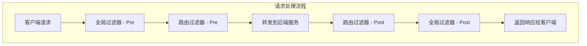

# 过滤器

TiGateway 基于 Spring Cloud Gateway 的过滤器系统，提供了丰富的内置过滤器，同时支持自定义过滤器开发。

## 过滤器概述

过滤器是 TiGateway 的核心组件，用于在请求转发过程中对请求和响应进行处理。过滤器分为两类：

- **GatewayFilter**: 路由级别的过滤器
- **GlobalFilter**: 全局过滤器，应用于所有路由

## 过滤器执行顺序



## 内置过滤器

### 1. 请求头过滤器

#### AddRequestHeader

添加请求头：

```yaml
filters:
- AddRequestHeader=X-Request-Red, Blue
- AddRequestHeader=X-Gateway, TiGateway
```

**示例**:
```yaml
routes:
- id: add-header-route
  uri: lb://backend-service
  predicates:
  - Path=/api/**
  filters:
  - AddRequestHeader=X-Request-ID, ${random.uuid}
  - AddRequestHeader=X-Gateway-Version, 1.0.0
```

#### AddRequestHeadersIfNotPresent

仅在请求头不存在时添加：

```yaml
filters:
- AddRequestHeadersIfNotPresent=X-Request-Color-1:blue,X-Request-Color-2:green
```

#### RemoveRequestHeader

移除请求头：

```yaml
filters:
- RemoveRequestHeader=X-Request-Foo
- RemoveRequestHeader=X-Forwarded-For
```

#### SetRequestHeader

设置请求头（替换现有值）：

```yaml
filters:
- SetRequestHeader=X-Request-Red, Blue
- SetRequestHeader=Authorization, Bearer ${jwt.token}
```

### 2. 响应头过滤器

#### AddResponseHeader

添加响应头：

```yaml
filters:
- AddResponseHeader=X-Response-Red, Blue
- AddResponseHeader=X-Response-Time, ${response.time}
```

#### RemoveResponseHeader

移除响应头：

```yaml
filters:
- RemoveResponseHeader=X-Response-Foo
- RemoveResponseHeader=Server
```

#### SetResponseHeader

设置响应头：

```yaml
filters:
- SetResponseHeader=X-Response-Red, Blue
- SetResponseHeader=Cache-Control, no-cache
```

### 3. 路径过滤器

#### PrefixPath

添加路径前缀：

```yaml
filters:
- PrefixPath=/api/v1
```

**示例**:
```yaml
routes:
- id: prefix-route
  uri: lb://backend-service
  predicates:
  - Path=/service/**
  filters:
  - PrefixPath=/api/v1
  # 请求 /service/users 会转发到 /api/v1/service/users
```

#### StripPrefix

移除路径前缀：

```yaml
filters:
- StripPrefix=2
```

**示例**:
```yaml
routes:
- id: strip-prefix-route
  uri: lb://backend-service
  predicates:
  - Path=/api/v1/users/**
  filters:
  - StripPrefix=2
  # 请求 /api/v1/users/123 会转发到 /users/123
```

#### RewritePath

重写路径：

```yaml
filters:
- RewritePath=/red/?(?<segment>.*), /$\{segment}
```

**示例**:
```yaml
routes:
- id: rewrite-path-route
  uri: lb://backend-service
  predicates:
  - Path=/red/**
  filters:
  - RewritePath=/red/?(?<segment>.*), /$\{segment}
  # 请求 /red/blue 会转发到 /blue
```

#### SetPath

设置路径：

```yaml
filters:
- SetPath=/{segment}
```

**示例**:
```yaml
routes:
- id: set-path-route
  uri: lb://backend-service
  predicates:
  - Path=/red/{segment}
  filters:
  - SetPath=/{segment}
  # 请求 /red/blue 会转发到 /blue
```

### 4. 请求参数过滤器

#### AddRequestParameter

添加请求参数：

```yaml
filters:
- AddRequestParameter=red, blue
- AddRequestParameter=version, v1
```

#### RemoveRequestParameter

移除请求参数：

```yaml
filters:
- RemoveRequestParameter=red
- RemoveRequestParameter=debug
```

### 5. 响应状态过滤器

#### SetStatus

设置响应状态码：

```yaml
filters:
- SetStatus=401
- SetStatus=UNAUTHORIZED
```

**示例**:
```yaml
routes:
- id: status-route
  uri: lb://backend-service
  predicates:
  - Path=/api/status/**
  filters:
  - SetStatus=200
```

### 6. 重定向过滤器

#### RedirectTo

重定向到指定 URL：

```yaml
filters:
- RedirectTo=302, https://example.org
```

**示例**:
```yaml
routes:
- id: redirect-route
  uri: no://op
  predicates:
  - Path=/old/**
  filters:
  - RedirectTo=301, https://new.example.com
```

### 7. 请求体过滤器

#### ModifyRequestBody

修改请求体：

```java
@Bean
public RouteLocator customRouteLocator(RouteLocatorBuilder builder) {
    return builder.routes()
        .route("modify-request-body", r -> r.path("/api/transform/**")
            .filters(f -> f.modifyRequestBody(String.class, String.class,
                (exchange, body) -> Mono.just(body.toUpperCase())))
            .uri("lb://backend-service"))
        .build();
}
```

#### CacheRequestBody

缓存请求体：

```java
@Bean
public RouteLocator customRouteLocator(RouteLocatorBuilder builder) {
    return builder.routes()
        .route("cache-request-body", r -> r.path("/api/cache/**")
            .filters(f -> f.cacheRequestBody(String.class))
            .uri("lb://backend-service"))
        .build();
}
```

### 8. 响应体过滤器

#### ModifyResponseBody

修改响应体：

```java
@Bean
public RouteLocator customRouteLocator(RouteLocatorBuilder builder) {
    return builder.routes()
        .route("modify-response-body", r -> r.path("/api/transform/**")
            .filters(f -> f.modifyResponseBody(String.class, String.class,
                (exchange, body) -> Mono.just(body.toUpperCase())))
            .uri("lb://backend-service"))
        .build();
}
```

### 9. 限流过滤器

#### RequestRateLimiter

请求限流：

```yaml
filters:
- name: RequestRateLimiter
  args:
    redis-rate-limiter.replenishRate: 10
    redis-rate-limiter.burstCapacity: 20
    redis-rate-limiter.requestedTokens: 1
    key-resolver: "#{@userKeyResolver}"
```

**配置 KeyResolver**:
```java
@Bean
public KeyResolver userKeyResolver() {
    return exchange -> Mono.just(
        exchange.getRequest().getQueryParams().getFirst("user"));
}
```

### 10. 熔断器过滤器

#### CircuitBreaker

熔断器：

```yaml
filters:
- name: CircuitBreaker
  args:
    name: myCircuitBreaker
    fallbackUri: forward:/fallback
```

**示例**:
```yaml
routes:
- id: circuit-breaker-route
  uri: lb://backend-service
  predicates:
  - Path=/api/unstable/**
  filters:
  - name: CircuitBreaker
    args:
      name: unstable-service
      fallbackUri: forward:/fallback
```

### 11. 重试过滤器

#### Retry

重试机制：

```yaml
filters:
- name: Retry
  args:
    retries: 3
    statuses: BAD_GATEWAY
    methods: GET,POST
    backoff:
      firstBackoff: 10ms
      maxBackoff: 50ms
      factor: 2
      basedOnPreviousValue: false
```

### 12. 请求大小过滤器

#### RequestSize

限制请求大小：

```yaml
filters:
- name: RequestSize
  args:
    maxSize: 5000000
```

### 13. 安全过滤器

#### SecureHeaders

添加安全头：

```yaml
filters:
- SecureHeaders
```

**自定义安全头**:
```yaml
spring:
  cloud:
    gateway:
      filter:
        secure-headers:
          xss-protection-header: "1; mode=block"
          strict-transport-security: "max-age=631138519"
          frame-options: "DENY"
          content-type-options: "nosniff"
```

## Kubernetes 原生过滤器

TiGateway 提供了 Kubernetes 原生的过滤器扩展：

### 1. KubernetesServiceFilter

自动添加 Kubernetes 服务信息：

```yaml
filters:
- name: KubernetesServiceFilter
  args:
    addServiceInfo: true
    addNamespaceInfo: true
```

### 2. KubernetesLabelFilter

根据 Kubernetes 标签过滤：

```yaml
filters:
- name: KubernetesLabelFilter
  args:
    requiredLabels:
      app: frontend
      version: v1
```

### 3. KubernetesAnnotationFilter

根据 Kubernetes 注解过滤：

```yaml
filters:
- name: KubernetesAnnotationFilter
  args:
    requiredAnnotations:
      tigateway.cn/enabled: "true"
      tigateway.cn/version: "v1"
```

## 自定义过滤器

### 1. 创建自定义过滤器

```java
@Component
public class CustomGatewayFilterFactory extends AbstractGatewayFilterFactory<CustomGatewayFilterFactory.Config> {
    
    public CustomGatewayFilterFactory() {
        super(Config.class);
    }
    
    @Override
    public GatewayFilter apply(Config config) {
        return (exchange, chain) -> {
            ServerHttpRequest request = exchange.getRequest();
            
            // 添加自定义逻辑
            ServerHttpRequest.Builder builder = request.mutate();
            builder.header("X-Custom-Header", config.getValue());
            
            return chain.filter(exchange.mutate().request(builder.build()).build());
        };
    }
    
    public static class Config {
        private String value;
        
        public String getValue() {
            return value;
        }
        
        public void setValue(String value) {
            this.value = value;
        }
    }
}
```

### 2. 配置自定义过滤器

```yaml
filters:
- name: Custom
  args:
    value: "custom-value"
```

### 3. 快捷方式配置

```yaml
filters:
- Custom=custom-value
```

## 过滤器链管理

### 1. 过滤器顺序

```yaml
routes:
- id: ordered-filters
  uri: lb://backend-service
  predicates:
  - Path=/api/**
  filters:
  - AddRequestHeader=X-Step, 1
  - AddRequestHeader=X-Step, 2
  - AddRequestHeader=X-Step, 3
```

### 2. 全局过滤器

```java
@Component
public class GlobalRequestLoggingFilter implements GlobalFilter, Ordered {
    
    private static final Logger log = LoggerFactory.getLogger(GlobalRequestLoggingFilter.class);
    
    @Override
    public Mono<Void> filter(ServerWebExchange exchange, GatewayFilterChain chain) {
        ServerHttpRequest request = exchange.getRequest();
        
        log.info("Request: {} {}", request.getMethod(), request.getURI());
        
        return chain.filter(exchange).then(Mono.fromRunnable(() -> {
            ServerHttpResponse response = exchange.getResponse();
            log.info("Response: {}", response.getStatusCode());
        }));
    }
    
    @Override
    public int getOrder() {
        return -1; // 高优先级
    }
}
```

## 过滤器监控

### 1. 过滤器指标

```java
@Component
public class FilterMetrics {
    
    private final MeterRegistry meterRegistry;
    private final Map<String, Timer> filterTimers = new ConcurrentHashMap<>();
    
    public FilterMetrics(MeterRegistry meterRegistry) {
        this.meterRegistry = meterRegistry;
    }
    
    public void recordFilterExecution(String filterName, long duration) {
        Timer timer = filterTimers.computeIfAbsent(filterName,
            name -> Timer.builder("gateway.filter.duration")
                .tag("filter", name)
                .register(meterRegistry));
        timer.record(duration, TimeUnit.MILLISECONDS);
    }
}
```

### 2. 过滤器健康检查

```java
@Component
public class FilterHealthIndicator implements HealthIndicator {
    
    @Autowired
    private List<GatewayFilterFactory> filterFactories;
    
    @Override
    public Health health() {
        Map<String, Object> details = new HashMap<>();
        details.put("totalFilters", filterFactories.size());
        details.put("filterNames", filterFactories.stream()
            .map(factory -> factory.getClass().getSimpleName())
            .collect(Collectors.toList()));
        
        return Health.up()
            .withDetails(details)
            .build();
    }
}
```

## 过滤器配置验证

### 1. 配置验证器

```java
@Component
public class FilterConfigValidator {
    
    @Autowired
    private List<GatewayFilterFactory> filterFactories;
    
    public ValidationResult validateFilterConfig(String filterName, Map<String, Object> args) {
        ValidationResult result = new ValidationResult();
        
        try {
            GatewayFilterFactory factory = filterFactories.stream()
                .filter(f -> f.name().equals(filterName))
                .findFirst()
                .orElseThrow(() -> new IllegalArgumentException("Unknown filter: " + filterName));
            
            // 验证参数
            validateFilterArgs(factory, args);
            
            result.setValid(true);
            result.setMessage("过滤器配置验证通过");
        } catch (Exception e) {
            result.setValid(false);
            result.setMessage("过滤器配置验证失败: " + e.getMessage());
        }
        
        return result;
    }
    
    private void validateFilterArgs(GatewayFilterFactory factory, Map<String, Object> args) {
        // 验证过滤器参数逻辑
        Class<?> configClass = factory.getConfigClass();
        if (configClass != null) {
            // 使用反射验证参数
            validateConfigClass(configClass, args);
        }
    }
}
```

## 最佳实践

### 1. 过滤器命名规范

```yaml
# 推荐的过滤器命名
filters:
- AddRequestHeader=X-Gateway, TiGateway
- AddRequestHeader=X-Request-ID, ${random.uuid}
- StripPrefix=2
- CircuitBreaker=backend-service
```

### 2. 过滤器顺序优化

```yaml
# 优化过滤器顺序
filters:
- AddRequestHeader=X-Request-ID, ${random.uuid}  # 添加请求ID
- StripPrefix=2                                   # 路径处理
- CircuitBreaker=backend-service                  # 熔断器
- AddResponseHeader=X-Response-Time, ${response.time} # 添加响应时间
```

### 3. 性能考虑

```yaml
# 避免不必要的过滤器
filters:
- AddRequestHeader=X-Gateway, TiGateway  # 轻量级操作
- StripPrefix=2                          # 轻量级操作
# 避免在热路径上使用重量级过滤器
```

### 4. 错误处理

```yaml
# 为关键过滤器配置错误处理
filters:
- name: CircuitBreaker
  args:
    name: backend-service
    fallbackUri: forward:/fallback
- name: Retry
  args:
    retries: 3
    statuses: BAD_GATEWAY
```

## 总结

TiGateway 的过滤器系统提供了强大的请求和响应处理能力：

1. **丰富的内置过滤器**: 支持请求头、响应头、路径、参数等多种处理
2. **Kubernetes 原生扩展**: 提供 Kubernetes 特定的过滤器
3. **自定义过滤器**: 支持开发自定义过滤器
4. **过滤器链管理**: 支持过滤器的顺序和组合
5. **监控和验证**: 提供过滤器级别的监控和配置验证
6. **最佳实践**: 遵循性能优化和错误处理原则

这些功能使得 TiGateway 能够灵活地处理各种请求和响应需求，为微服务架构提供可靠的网关服务。
