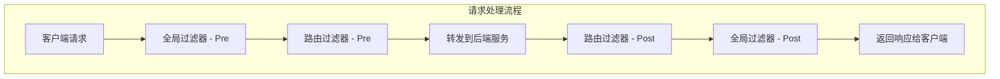

# 全局过滤器

全局过滤器是 TiGateway 中应用于所有路由的过滤器，它们在整个请求处理流程中执行，提供跨路由的通用功能。

## 全局过滤器概述

### 过滤器执行顺序



### 全局过滤器特点

- **全局应用**: 自动应用于所有路由
- **执行顺序**: 通过 `Ordered` 接口控制执行顺序
- **生命周期**: 支持请求前和请求后的处理
- **可配置**: 支持通过配置进行定制

## 内置全局过滤器

### 1. 负载均衡过滤器

#### ReactiveLoadBalancerClientFilter

自动处理负载均衡：

```java
@Component
public class LoadBalancerGlobalFilter implements GlobalFilter, Ordered {
    
    @Override
    public Mono<Void> filter(ServerWebExchange exchange, GatewayFilterChain chain) {
        URI url = exchange.getAttribute(GATEWAY_REQUEST_URL_ATTR);
        String schemePrefix = exchange.getAttribute(GATEWAY_SCHEME_PREFIX_ATTR);
        
        if (url == null || (!"lb".equals(url.getScheme()) && !"lb".equals(schemePrefix))) {
            return chain.filter(exchange);
        }
        
        // 处理负载均衡逻辑
        return loadBalancerClient.execute(serviceId, url, exchange, chain);
    }
    
    @Override
    public int getOrder() {
        return 10100;
    }
}
```

### 2. 路由转换过滤器

#### RouteToRequestUrlFilter

将路由信息转换为请求 URL：

```java
@Component
public class RouteToRequestUrlGlobalFilter implements GlobalFilter, Ordered {
    
    @Override
    public Mono<Void> filter(ServerWebExchange exchange, GatewayFilterChain chain) {
        Route route = exchange.getAttribute(GATEWAY_ROUTE_ATTR);
        if (route == null) {
            return chain.filter(exchange);
        }
        
        URI uri = exchange.getRequest().getURI();
        boolean encoded = containsEncodedParts(uri);
        
        URI routeUri = route.getUri();
        URI mergedUrl = UriComponentsBuilder.fromUri(uri)
            .uri(routeUri)
            .build(encoded)
            .toUri();
        
        exchange.getAttributes().put(GATEWAY_REQUEST_URL_ATTR, mergedUrl);
        return chain.filter(exchange);
    }
    
    @Override
    public int getOrder() {
        return 10000;
    }
}
```

### 3. 网络过滤器

#### NettyRoutingFilter

使用 Netty 进行网络请求：

```java
@Component
public class NettyRoutingGlobalFilter implements GlobalFilter, Ordered {
    
    @Override
    public Mono<Void> filter(ServerWebExchange exchange, GatewayFilterChain chain) {
        URI requestUrl = exchange.getRequiredAttribute(GATEWAY_REQUEST_URL_ATTR);
        String scheme = requestUrl.getScheme();
        
        if (!"http".equals(scheme) && !"https".equals(scheme)) {
            return chain.filter(exchange);
        }
        
        return chain.filter(exchange).then(Mono.defer(() -> {
            // 使用 Netty 客户端发送请求
            return nettyClient.execute(exchange, requestUrl);
        }));
    }
    
    @Override
    public int getOrder() {
        return Integer.MAX_VALUE;
    }
}
```

### 4. 响应写入过滤器

#### NettyWriteResponseFilter

将响应写入客户端：

```java
@Component
public class NettyWriteResponseGlobalFilter implements GlobalFilter, Ordered {
    
    @Override
    public Mono<Void> filter(ServerWebExchange exchange, GatewayFilterChain chain) {
        return chain.filter(exchange).then(Mono.defer(() -> {
            ServerHttpResponse response = exchange.getResponse();
            if (response.isCommitted()) {
                return Mono.empty();
            }
            
            // 写入响应数据
            return writeResponse(exchange, response);
        }));
    }
    
    @Override
    public int getOrder() {
        return -1;
    }
}
```

### 5. 转发过滤器

#### ForwardRoutingFilter

处理内部转发请求：

```java
@Component
public class ForwardRoutingGlobalFilter implements GlobalFilter, Ordered {
    
    @Override
    public Mono<Void> filter(ServerWebExchange exchange, GatewayFilterChain chain) {
        URI requestUrl = exchange.getRequiredAttribute(GATEWAY_REQUEST_URL_ATTR);
        String scheme = requestUrl.getScheme();
        
        if (!"forward".equals(scheme)) {
            return chain.filter(exchange);
        }
        
        // 处理内部转发
        return forwardRequest(exchange, requestUrl);
    }
    
    @Override
    public int getOrder() {
        return Integer.MAX_VALUE;
    }
}
```

### 6. WebSocket 路由过滤器

#### WebsocketRoutingFilter

处理 WebSocket 连接：

```java
@Component
public class WebsocketRoutingGlobalFilter implements GlobalFilter, Ordered {
    
    @Override
    public Mono<Void> filter(ServerWebExchange exchange, GatewayFilterChain chain) {
        URI requestUrl = exchange.getRequiredAttribute(GATEWAY_REQUEST_URL_ATTR);
        String scheme = requestUrl.getScheme();
        
        if (!"ws".equals(scheme) && !"wss".equals(scheme)) {
            return chain.filter(exchange);
        }
        
        // 处理 WebSocket 连接
        return handleWebSocketConnection(exchange, requestUrl);
    }
    
    @Override
    public int getOrder() {
        return Integer.MAX_VALUE - 1;
    }
}
```

## 自定义全局过滤器

### 1. 请求日志过滤器

```java
@Component
public class RequestLoggingGlobalFilter implements GlobalFilter, Ordered {
    
    private static final Logger log = LoggerFactory.getLogger(RequestLoggingGlobalFilter.class);
    
    @Override
    public Mono<Void> filter(ServerWebExchange exchange, GatewayFilterChain chain) {
        ServerHttpRequest request = exchange.getRequest();
        
        // 记录请求信息
        log.info("Request: {} {}", request.getMethod(), request.getURI());
        log.info("Headers: {}", request.getHeaders());
        
        long startTime = System.currentTimeMillis();
        
        return chain.filter(exchange).then(Mono.fromRunnable(() -> {
            long duration = System.currentTimeMillis() - startTime;
            ServerHttpResponse response = exchange.getResponse();
            
            log.info("Response: {} - Duration: {}ms", 
                response.getStatusCode(), duration);
        }));
    }
    
    @Override
    public int getOrder() {
        return -1000; // 高优先级，最先执行
    }
}
```

### 2. 请求 ID 过滤器

```java
@Component
public class RequestIdGlobalFilter implements GlobalFilter, Ordered {
    
    @Override
    public Mono<Void> filter(ServerWebExchange exchange, GatewayFilterChain chain) {
        ServerHttpRequest request = exchange.getRequest();
        
        // 生成请求 ID
        String requestId = UUID.randomUUID().toString();
        
        // 添加到请求头
        ServerHttpRequest.Builder builder = request.mutate();
        builder.header("X-Request-ID", requestId);
        
        // 添加到响应头
        ServerHttpResponse response = exchange.getResponse();
        response.getHeaders().add("X-Request-ID", requestId);
        
        // 添加到交换属性
        exchange.getAttributes().put("REQUEST_ID", requestId);
        
        return chain.filter(exchange.mutate().request(builder.build()).build());
    }
    
    @Override
    public int getOrder() {
        return -999;
    }
}
```

### 3. 认证过滤器

```java
@Component
public class AuthenticationGlobalFilter implements GlobalFilter, Ordered {
    
    @Autowired
    private JwtTokenProvider jwtTokenProvider;
    
    @Override
    public Mono<Void> filter(ServerWebExchange exchange, GatewayFilterChain chain) {
        ServerHttpRequest request = exchange.getRequest();
        
        // 检查是否需要认证
        if (isPublicPath(request.getPath().value())) {
            return chain.filter(exchange);
        }
        
        // 提取 JWT Token
        String token = extractToken(request);
        if (token == null) {
            return unauthorized(exchange);
        }
        
        // 验证 Token
        if (!jwtTokenProvider.validateToken(token)) {
            return unauthorized(exchange);
        }
        
        // 设置用户信息
        String username = jwtTokenProvider.getUsernameFromToken(token);
        exchange.getAttributes().put("USERNAME", username);
        
        return chain.filter(exchange);
    }
    
    private boolean isPublicPath(String path) {
        return path.startsWith("/public/") || 
               path.startsWith("/health") || 
               path.startsWith("/actuator");
    }
    
    private String extractToken(ServerHttpRequest request) {
        String bearerToken = request.getHeaders().getFirst("Authorization");
        if (bearerToken != null && bearerToken.startsWith("Bearer ")) {
            return bearerToken.substring(7);
        }
        return null;
    }
    
    private Mono<Void> unauthorized(ServerWebExchange exchange) {
        ServerHttpResponse response = exchange.getResponse();
        response.setStatusCode(HttpStatus.UNAUTHORIZED);
        response.getHeaders().add("Content-Type", "application/json");
        
        String body = "{\"error\":\"Unauthorized\",\"message\":\"Invalid or missing token\"}";
        DataBuffer buffer = response.bufferFactory().wrap(body.getBytes());
        return response.writeWith(Mono.just(buffer));
    }
    
    @Override
    public int getOrder() {
        return -100;
    }
}
```

### 4. 限流过滤器

```java
@Component
public class RateLimitGlobalFilter implements GlobalFilter, Ordered {
    
    private final RedisTemplate<String, String> redisTemplate;
    private final RateLimiter rateLimiter;
    
    public RateLimitGlobalFilter(RedisTemplate<String, String> redisTemplate) {
        this.redisTemplate = redisTemplate;
        this.rateLimiter = RateLimiter.create(100.0); // 每秒100个请求
    }
    
    @Override
    public Mono<Void> filter(ServerWebExchange exchange, GatewayFilterChain chain) {
        ServerHttpRequest request = exchange.getRequest();
        String clientId = getClientId(request);
        
        // 检查限流
        if (!rateLimiter.tryAcquire()) {
            return rateLimitExceeded(exchange);
        }
        
        // 使用 Redis 进行分布式限流
        String key = "rate_limit:" + clientId;
        String count = redisTemplate.opsForValue().get(key);
        
        if (count == null) {
            redisTemplate.opsForValue().set(key, "1", Duration.ofSeconds(60));
        } else {
            int currentCount = Integer.parseInt(count);
            if (currentCount >= 100) { // 每分钟100个请求
                return rateLimitExceeded(exchange);
            }
            redisTemplate.opsForValue().increment(key);
        }
        
        return chain.filter(exchange);
    }
    
    private String getClientId(ServerHttpRequest request) {
        String clientId = request.getHeaders().getFirst("X-Client-ID");
        if (clientId == null) {
            clientId = request.getRemoteAddress().getAddress().getHostAddress();
        }
        return clientId;
    }
    
    private Mono<Void> rateLimitExceeded(ServerWebExchange exchange) {
        ServerHttpResponse response = exchange.getResponse();
        response.setStatusCode(HttpStatus.TOO_MANY_REQUESTS);
        response.getHeaders().add("Content-Type", "application/json");
        response.getHeaders().add("Retry-After", "60");
        
        String body = "{\"error\":\"Rate limit exceeded\",\"message\":\"Too many requests\"}";
        DataBuffer buffer = response.bufferFactory().wrap(body.getBytes());
        return response.writeWith(Mono.just(buffer));
    }
    
    @Override
    public int getOrder() {
        return -50;
    }
}
```

### 5. 跨域过滤器

```java
@Component
public class CorsGlobalFilter implements GlobalFilter, Ordered {
    
    @Override
    public Mono<Void> filter(ServerWebExchange exchange, GatewayFilterChain chain) {
        ServerHttpRequest request = exchange.getRequest();
        ServerHttpResponse response = exchange.getResponse();
        
        // 处理预检请求
        if (request.getMethod() == HttpMethod.OPTIONS) {
            response.getHeaders().add("Access-Control-Allow-Origin", "*");
            response.getHeaders().add("Access-Control-Allow-Methods", "GET, POST, PUT, DELETE, OPTIONS");
            response.getHeaders().add("Access-Control-Allow-Headers", "Content-Type, Authorization, X-Requested-With");
            response.getHeaders().add("Access-Control-Max-Age", "3600");
            response.setStatusCode(HttpStatus.OK);
            return Mono.empty();
        }
        
        return chain.filter(exchange).then(Mono.fromRunnable(() -> {
            // 添加 CORS 头
            response.getHeaders().add("Access-Control-Allow-Origin", "*");
            response.getHeaders().add("Access-Control-Allow-Credentials", "true");
        }));
    }
    
    @Override
    public int getOrder() {
        return -200;
    }
}
```

### 6. 缓存过滤器

```java
@Component
public class CacheGlobalFilter implements GlobalFilter, Ordered {
    
    private final CacheManager cacheManager;
    
    public CacheGlobalFilter(CacheManager cacheManager) {
        this.cacheManager = cacheManager;
    }
    
    @Override
    public Mono<Void> filter(ServerWebExchange exchange, GatewayFilterChain chain) {
        ServerHttpRequest request = exchange.getRequest();
        
        // 只缓存 GET 请求
        if (request.getMethod() != HttpMethod.GET) {
            return chain.filter(exchange);
        }
        
        String cacheKey = generateCacheKey(request);
        Cache cache = cacheManager.getCache("gateway-cache");
        
        // 检查缓存
        Cache.ValueWrapper cached = cache.get(cacheKey);
        if (cached != null) {
            return returnCachedResponse(exchange, cached.get());
        }
        
        // 缓存响应
        return chain.filter(exchange).then(Mono.fromRunnable(() -> {
            ServerHttpResponse response = exchange.getResponse();
            if (response.getStatusCode() == HttpStatus.OK) {
                // 缓存响应数据
                cache.put(cacheKey, response);
            }
        }));
    }
    
    private String generateCacheKey(ServerHttpRequest request) {
        return request.getURI().toString() + ":" + request.getHeaders().toString();
    }
    
    private Mono<Void> returnCachedResponse(ServerWebExchange exchange, Object cached) {
        ServerHttpResponse response = exchange.getResponse();
        // 返回缓存的响应
        return response.writeWith(Mono.just(response.bufferFactory().wrap("cached response".getBytes())));
    }
    
    @Override
    public int getOrder() {
        return -10;
    }
}
```

## 过滤器配置

### 1. 全局过滤器配置

```yaml
# application.yml
spring:
  cloud:
    gateway:
      global-filters:
      - name: RequestLogging
        args:
          level: INFO
      - name: RequestId
        args:
          header-name: X-Request-ID
      - name: RateLimit
        args:
          requests-per-minute: 100
          burst-capacity: 200
      - name: Cors
        args:
          allowed-origins: "*"
          allowed-methods: "GET,POST,PUT,DELETE,OPTIONS"
          allowed-headers: "Content-Type,Authorization,X-Requested-With"
```

### 2. 过滤器顺序配置

```java
@Configuration
public class GlobalFilterConfiguration {
    
    @Bean
    @Order(-1000)
    public GlobalFilter requestLoggingFilter() {
        return new RequestLoggingGlobalFilter();
    }
    
    @Bean
    @Order(-999)
    public GlobalFilter requestIdFilter() {
        return new RequestIdGlobalFilter();
    }
    
    @Bean
    @Order(-100)
    public GlobalFilter authenticationFilter() {
        return new AuthenticationGlobalFilter();
    }
    
    @Bean
    @Order(-50)
    public GlobalFilter rateLimitFilter() {
        return new RateLimitGlobalFilter();
    }
}
```

## 过滤器监控

### 1. 过滤器指标

```java
@Component
public class FilterMetricsGlobalFilter implements GlobalFilter, Ordered {
    
    private final MeterRegistry meterRegistry;
    private final Map<String, Timer> filterTimers = new ConcurrentHashMap<>();
    
    public FilterMetricsGlobalFilter(MeterRegistry meterRegistry) {
        this.meterRegistry = meterRegistry;
    }
    
    @Override
    public Mono<Void> filter(ServerWebExchange exchange, GatewayFilterChain chain) {
        String routeId = exchange.getAttribute(GATEWAY_ROUTE_ATTR) != null ? 
            exchange.getAttribute(GATEWAY_ROUTE_ATTR).getId() : "unknown";
        
        Timer.Sample sample = Timer.start(meterRegistry);
        
        return chain.filter(exchange).doFinally(signalType -> {
            sample.stop(Timer.builder("gateway.filter.duration")
                .tag("route", routeId)
                .tag("filter", "global")
                .register(meterRegistry));
        });
    }
    
    @Override
    public int getOrder() {
        return -1;
    }
}
```

### 2. 过滤器健康检查

```java
@Component
public class FilterHealthIndicator implements HealthIndicator {
    
    @Autowired
    private List<GlobalFilter> globalFilters;
    
    @Override
    public Health health() {
        Map<String, Object> details = new HashMap<>();
        details.put("totalFilters", globalFilters.size());
        details.put("filterNames", globalFilters.stream()
            .map(filter -> filter.getClass().getSimpleName())
            .collect(Collectors.toList()));
        
        return Health.up()
            .withDetails(details)
            .build();
    }
}
```

## 最佳实践

### 1. 过滤器顺序

```java
// 推荐的过滤器顺序
@Component
@Order(-1000) // 最高优先级
public class RequestLoggingGlobalFilter implements GlobalFilter {
    // 请求日志记录
}

@Component
@Order(-999)
public class RequestIdGlobalFilter implements GlobalFilter {
    // 请求 ID 生成
}

@Component
@Order(-100)
public class AuthenticationGlobalFilter implements GlobalFilter {
    // 认证检查
}

@Component
@Order(-50)
public class RateLimitGlobalFilter implements GlobalFilter {
    // 限流控制
}

@Component
@Order(-10)
public class CacheGlobalFilter implements GlobalFilter {
    // 缓存处理
}

@Component
@Order(10000)
public class RouteToRequestUrlGlobalFilter implements GlobalFilter {
    // 路由转换
}

@Component
@Order(Integer.MAX_VALUE)
public class NettyRoutingGlobalFilter implements GlobalFilter {
    // 网络请求
}
```

### 2. 性能优化

```java
@Component
public class OptimizedGlobalFilter implements GlobalFilter, Ordered {
    
    // 使用缓存避免重复计算
    private final Cache<String, Boolean> pathCache = Caffeine.newBuilder()
        .maximumSize(1000)
        .expireAfterWrite(1, TimeUnit.HOURS)
        .build();
    
    @Override
    public Mono<Void> filter(ServerWebExchange exchange, GatewayFilterChain chain) {
        String path = exchange.getRequest().getPath().value();
        
        // 使用缓存检查路径
        Boolean shouldProcess = pathCache.get(path, this::shouldProcessPath);
        if (!shouldProcess) {
            return chain.filter(exchange);
        }
        
        // 处理逻辑
        return processRequest(exchange, chain);
    }
    
    private boolean shouldProcessPath(String path) {
        // 路径检查逻辑
        return path.startsWith("/api/");
    }
    
    @Override
    public int getOrder() {
        return -100;
    }
}
```

### 3. 错误处理

```java
@Component
public class ErrorHandlingGlobalFilter implements GlobalFilter, Ordered {
    
    @Override
    public Mono<Void> filter(ServerWebExchange exchange, GatewayFilterChain chain) {
        return chain.filter(exchange)
            .onErrorResume(throwable -> {
                log.error("Error in filter chain", throwable);
                return handleError(exchange, throwable);
            });
    }
    
    private Mono<Void> handleError(ServerWebExchange exchange, Throwable throwable) {
        ServerHttpResponse response = exchange.getResponse();
        
        if (throwable instanceof TimeoutException) {
            response.setStatusCode(HttpStatus.GATEWAY_TIMEOUT);
        } else if (throwable instanceof ConnectException) {
            response.setStatusCode(HttpStatus.BAD_GATEWAY);
        } else {
            response.setStatusCode(HttpStatus.INTERNAL_SERVER_ERROR);
        }
        
        response.getHeaders().add("Content-Type", "application/json");
        String body = "{\"error\":\"" + throwable.getMessage() + "\"}";
        DataBuffer buffer = response.bufferFactory().wrap(body.getBytes());
        return response.writeWith(Mono.just(buffer));
    }
    
    @Override
    public int getOrder() {
        return Integer.MAX_VALUE;
    }
}
```

## 总结

全局过滤器是 TiGateway 中重要的组件，提供了跨路由的通用功能：

1. **内置过滤器**: 提供负载均衡、路由转换、网络请求等核心功能
2. **自定义过滤器**: 支持开发自定义的全局过滤器
3. **执行顺序**: 通过 `Ordered` 接口控制过滤器执行顺序
4. **配置管理**: 支持通过配置进行过滤器定制
5. **监控指标**: 提供过滤器级别的监控和健康检查
6. **最佳实践**: 遵循性能优化和错误处理原则

通过合理使用全局过滤器，可以为 TiGateway 添加认证、限流、日志、缓存等通用功能，提高系统的可维护性和可观测性。
