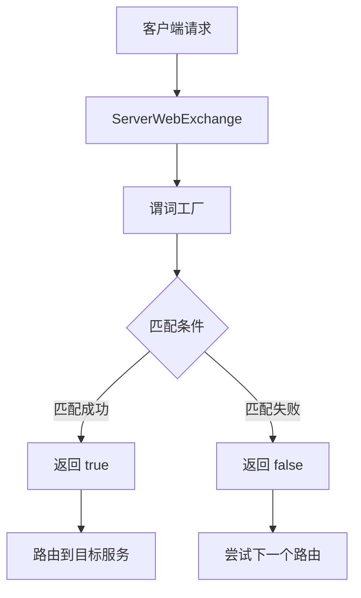

# TiGateway 谓词工厂开发指南

## 概述

谓词工厂是 TiGateway 路由匹配的核心组件，用于定义路由的匹配条件。本文档详细说明了如何开发自定义的谓词工厂来扩展 TiGateway 的路由匹配能力。

## 谓词工厂基础

### 1. 基本结构

所有谓词工厂都需要实现 `RoutePredicateFactory` 接口或继承 `AbstractRoutePredicateFactory` 类：

```java
@Component
public class CustomPredicateFactory extends AbstractRoutePredicateFactory<CustomPredicateFactory.Config> {

    public CustomPredicateFactory() {
        super(Config.class);
    }

    @Override
    public Predicate<ServerWebExchange> apply(Config config) {
        return exchange -> {
            // 谓词匹配逻辑
            ServerHttpRequest request = exchange.getRequest();
            return matches(config, request);
        };
    }

    public static class Config {
        // 配置属性
    }
}
```

### 2. 谓词执行流程



## 基于请求头的谓词

### 1. 自定义请求头谓词

```java
@Component
public class CustomHeaderPredicateFactory extends AbstractRoutePredicateFactory<CustomHeaderPredicateFactory.Config> {

    public CustomHeaderPredicateFactory() {
        super(Config.class);
    }

    @Override
    public Predicate<ServerWebExchange> apply(Config config) {
        return exchange -> {
            ServerHttpRequest request = exchange.getRequest();
            HttpHeaders headers = request.getHeaders();
            
            // 检查必需的请求头
            for (String requiredHeader : config.getRequiredHeaders()) {
                if (!headers.containsKey(requiredHeader)) {
                    return false;
                }
            }
            
            // 检查请求头值匹配
            for (Map.Entry<String, String> entry : config.getHeaderValues().entrySet()) {
                String headerValue = headers.getFirst(entry.getKey());
                if (headerValue == null || !headerValue.matches(entry.getValue())) {
                    return false;
                }
            }
            
            return true;
        };
    }

    public static class Config {
        private List<String> requiredHeaders = new ArrayList<>();
        private Map<String, String> headerValues = new HashMap<>();

        public List<String> getRequiredHeaders() {
            return requiredHeaders;
        }

        public void setRequiredHeaders(List<String> requiredHeaders) {
            this.requiredHeaders = requiredHeaders;
        }

        public Map<String, String> getHeaderValues() {
            return headerValues;
        }

        public void setHeaderValues(Map<String, String> headerValues) {
            this.headerValues = headerValues;
        }
    }
}
```

### 2. API 版本谓词

```java
@Component
public class ApiVersionPredicateFactory extends AbstractRoutePredicateFactory<ApiVersionPredicateFactory.Config> {

    public ApiVersionPredicateFactory() {
        super(Config.class);
    }

    @Override
    public Predicate<ServerWebExchange> apply(Config config) {
        return exchange -> {
            if (!config.isEnabled()) {
                return true;
            }

            ServerHttpRequest request = exchange.getRequest();
            String apiVersion = request.getHeaders().getFirst("X-API-Version");
            
            if (apiVersion == null) {
                return config.isAllowMissing();
            }

            return config.getSupportedVersions().contains(apiVersion);
        };
    }

    public static class Config {
        private boolean enabled = true;
        private List<String> supportedVersions = new ArrayList<>();
        private boolean allowMissing = false;

        public boolean isEnabled() {
            return enabled;
        }

        public void setEnabled(boolean enabled) {
            this.enabled = enabled;
        }

        public List<String> getSupportedVersions() {
            return supportedVersions;
        }

        public void setSupportedVersions(List<String> supportedVersions) {
            this.supportedVersions = supportedVersions;
        }

        public boolean isAllowMissing() {
            return allowMissing;
        }

        public void setAllowMissing(boolean allowMissing) {
            this.allowMissing = allowMissing;
        }
    }
}
```

## 基于请求参数的谓词

### 1. 查询参数谓词

```java
@Component
public class QueryParameterPredicateFactory extends AbstractRoutePredicateFactory<QueryParameterPredicateFactory.Config> {

    public QueryParameterPredicateFactory() {
        super(Config.class);
    }

    @Override
    public Predicate<ServerWebExchange> apply(Config config) {
        return exchange -> {
            ServerHttpRequest request = exchange.getRequest();
            MultiValueMap<String, String> queryParams = request.getQueryParams();
            
            // 检查必需的查询参数
            for (String requiredParam : config.getRequiredParams()) {
                if (!queryParams.containsKey(requiredParam)) {
                    return false;
                }
            }
            
            // 检查查询参数值匹配
            for (Map.Entry<String, String> entry : config.getParamValues().entrySet()) {
                String paramValue = queryParams.getFirst(entry.getKey());
                if (paramValue == null || !paramValue.matches(entry.getValue())) {
                    return false;
                }
            }
            
            return true;
        };
    }

    public static class Config {
        private List<String> requiredParams = new ArrayList<>();
        private Map<String, String> paramValues = new HashMap<>();

        public List<String> getRequiredParams() {
            return requiredParams;
        }

        public void setRequiredParams(List<String> requiredParams) {
            this.requiredParams = requiredParams;
        }

        public Map<String, String> getParamValues() {
            return paramValues;
        }

        public void setParamValues(Map<String, String> paramValues) {
            this.paramValues = paramValues;
        }
    }
}
```

### 2. 请求体参数谓词

```java
@Component
public class RequestBodyPredicateFactory extends AbstractRoutePredicateFactory<RequestBodyPredicateFactory.Config> {

    public RequestBodyPredicateFactory() {
        super(Config.class);
    }

    @Override
    public Predicate<ServerWebExchange> apply(Config config) {
        return exchange -> {
            ServerHttpRequest request = exchange.getRequest();
            
            // 检查请求体是否存在
            if (request.getHeaders().getContentLength() <= 0) {
                return config.isAllowEmptyBody();
            }
            
            // 检查内容类型
            String contentType = request.getHeaders().getFirst("Content-Type");
            if (contentType != null && !config.getSupportedContentTypes().contains(contentType)) {
                return false;
            }
            
            return true;
        };
    }

    public static class Config {
        private boolean allowEmptyBody = false;
        private List<String> supportedContentTypes = Arrays.asList("application/json", "application/xml");

        public boolean isAllowEmptyBody() {
            return allowEmptyBody;
        }

        public void setAllowEmptyBody(boolean allowEmptyBody) {
            this.allowEmptyBody = allowEmptyBody;
        }

        public List<String> getSupportedContentTypes() {
            return supportedContentTypes;
        }

        public void setSupportedContentTypes(List<String> supportedContentTypes) {
            this.supportedContentTypes = supportedContentTypes;
        }
    }
}
```

## 基于时间的谓词

### 1. 工作时间谓词

```java
@Component
public class WorkingHoursPredicateFactory extends AbstractRoutePredicateFactory<WorkingHoursPredicateFactory.Config> {

    public WorkingHoursPredicateFactory() {
        super(Config.class);
    }

    @Override
    public Predicate<ServerWebExchange> apply(Config config) {
        return exchange -> {
            if (!config.isEnabled()) {
                return true;
            }

            LocalTime currentTime = LocalTime.now();
            LocalTime startTime = config.getStartTime();
            LocalTime endTime = config.getEndTime();
            
            // 检查是否在工作时间内
            boolean isWorkingHours = !currentTime.isBefore(startTime) && !currentTime.isAfter(endTime);
            
            // 检查是否在允许的日期内
            DayOfWeek currentDay = LocalDate.now().getDayOfWeek();
            boolean isAllowedDay = config.getAllowedDays().contains(currentDay);
            
            return isWorkingHours && isAllowedDay;
        };
    }

    public static class Config {
        private boolean enabled = true;
        private LocalTime startTime = LocalTime.of(9, 0);
        private LocalTime endTime = LocalTime.of(18, 0);
        private List<DayOfWeek> allowedDays = Arrays.asList(
            DayOfWeek.MONDAY, DayOfWeek.TUESDAY, DayOfWeek.WEDNESDAY,
            DayOfWeek.THURSDAY, DayOfWeek.FRIDAY
        );

        public boolean isEnabled() {
            return enabled;
        }

        public void setEnabled(boolean enabled) {
            this.enabled = enabled;
        }

        public LocalTime getStartTime() {
            return startTime;
        }

        public void setStartTime(LocalTime startTime) {
            this.startTime = startTime;
        }

        public LocalTime getEndTime() {
            return endTime;
        }

        public void setEndTime(LocalTime endTime) {
            this.endTime = endTime;
        }

        public List<DayOfWeek> getAllowedDays() {
            return allowedDays;
        }

        public void setAllowedDays(List<DayOfWeek> allowedDays) {
            this.allowedDays = allowedDays;
        }
    }
}
```

### 2. 维护窗口谓词

```java
@Component
public class MaintenanceWindowPredicateFactory extends AbstractRoutePredicateFactory<MaintenanceWindowPredicateFactory.Config> {

    public MaintenanceWindowPredicateFactory() {
        super(Config.class);
    }

    @Override
    public Predicate<ServerWebExchange> apply(Config config) {
        return exchange -> {
            if (!config.isEnabled()) {
                return true;
            }

            LocalDateTime now = LocalDateTime.now();
            
            // 检查是否在维护窗口内
            for (MaintenanceWindow window : config.getMaintenanceWindows()) {
                if (now.isAfter(window.getStartTime()) && now.isBefore(window.getEndTime())) {
                    return false; // 在维护窗口内，拒绝请求
                }
            }
            
            return true;
        };
    }

    public static class Config {
        private boolean enabled = true;
        private List<MaintenanceWindow> maintenanceWindows = new ArrayList<>();

        public boolean isEnabled() {
            return enabled;
        }

        public void setEnabled(boolean enabled) {
            this.enabled = enabled;
        }

        public List<MaintenanceWindow> getMaintenanceWindows() {
            return maintenanceWindows;
        }

        public void setMaintenanceWindows(List<MaintenanceWindow> maintenanceWindows) {
            this.maintenanceWindows = maintenanceWindows;
        }
    }

    public static class MaintenanceWindow {
        private LocalDateTime startTime;
        private LocalDateTime endTime;
        private String description;

        public MaintenanceWindow(LocalDateTime startTime, LocalDateTime endTime, String description) {
            this.startTime = startTime;
            this.endTime = endTime;
            this.description = description;
        }

        // Getters and setters
        public LocalDateTime getStartTime() {
            return startTime;
        }

        public void setStartTime(LocalDateTime startTime) {
            this.startTime = startTime;
        }

        public LocalDateTime getEndTime() {
            return endTime;
        }

        public void setEndTime(LocalDateTime endTime) {
            this.endTime = endTime;
        }

        public String getDescription() {
            return description;
        }

        public void setDescription(String description) {
            this.description = description;
        }
    }
}
```

## 基于地理位置的谓词

### 1. 地理位置谓词

```java
@Component
public class GeoLocationPredicateFactory extends AbstractRoutePredicateFactory<GeoLocationPredicateFactory.Config> {

    public GeoLocationPredicateFactory() {
        super(Config.class);
    }

    @Override
    public Predicate<ServerWebExchange> apply(Config config) {
        return exchange -> {
            if (!config.isEnabled()) {
                return true;
            }

            ServerHttpRequest request = exchange.getRequest();
            
            // 获取客户端 IP 地址
            String clientIp = getClientIpAddress(request);
            if (clientIp == null) {
                return config.isAllowUnknownLocation();
            }
            
            // 获取地理位置信息
            GeoLocation location = getGeoLocation(clientIp);
            if (location == null) {
                return config.isAllowUnknownLocation();
            }
            
            // 检查是否在允许的地区内
            return config.getAllowedCountries().contains(location.getCountry()) ||
                   config.getAllowedRegions().contains(location.getRegion());
        };
    }

    private String getClientIpAddress(ServerHttpRequest request) {
        String xForwardedFor = request.getHeaders().getFirst("X-Forwarded-For");
        if (xForwardedFor != null && !xForwardedFor.isEmpty()) {
            return xForwardedFor.split(",")[0].trim();
        }
        
        String xRealIp = request.getHeaders().getFirst("X-Real-IP");
        if (xRealIp != null && !xRealIp.isEmpty()) {
            return xRealIp;
        }
        
        return request.getRemoteAddress() != null ? 
            request.getRemoteAddress().getAddress().getHostAddress() : null;
    }

    private GeoLocation getGeoLocation(String ipAddress) {
        // 实现地理位置查询逻辑
        // 这里可以调用第三方地理位置服务
        return new GeoLocation("US", "CA", "San Francisco");
    }

    public static class Config {
        private boolean enabled = true;
        private List<String> allowedCountries = new ArrayList<>();
        private List<String> allowedRegions = new ArrayList<>();
        private boolean allowUnknownLocation = false;

        public boolean isEnabled() {
            return enabled;
        }

        public void setEnabled(boolean enabled) {
            this.enabled = enabled;
        }

        public List<String> getAllowedCountries() {
            return allowedCountries;
        }

        public void setAllowedCountries(List<String> allowedCountries) {
            this.allowedCountries = allowedCountries;
        }

        public List<String> getAllowedRegions() {
            return allowedRegions;
        }

        public void setAllowedRegions(List<String> allowedRegions) {
            this.allowedRegions = allowedRegions;
        }

        public boolean isAllowUnknownLocation() {
            return allowUnknownLocation;
        }

        public void setAllowUnknownLocation(boolean allowUnknownLocation) {
            this.allowUnknownLocation = allowUnknownLocation;
        }
    }

    public static class GeoLocation {
        private String country;
        private String region;
        private String city;

        public GeoLocation(String country, String region, String city) {
            this.country = country;
            this.region = region;
            this.city = city;
        }

        // Getters and setters
        public String getCountry() {
            return country;
        }

        public void setCountry(String country) {
            this.country = country;
        }

        public String getRegion() {
            return region;
        }

        public void setRegion(String region) {
            this.region = region;
        }

        public String getCity() {
            return city;
        }

        public void setCity(String city) {
            this.city = city;
        }
    }
}
```

## 基于用户角色的谓词

### 1. 用户角色谓词

```java
@Component
public class UserRolePredicateFactory extends AbstractRoutePredicateFactory<UserRolePredicateFactory.Config> {

    public UserRolePredicateFactory() {
        super(Config.class);
    }

    @Override
    public Predicate<ServerWebExchange> apply(Config config) {
        return exchange -> {
            if (!config.isEnabled()) {
                return true;
            }

            ServerHttpRequest request = exchange.getRequest();
            String userRoles = request.getHeaders().getFirst("X-User-Roles");
            
            if (userRoles == null) {
                return config.isAllowAnonymous();
            }
            
            List<String> roles = Arrays.asList(userRoles.split(","));
            
            // 检查是否有必需的角色
            if (!config.getRequiredRoles().isEmpty()) {
                boolean hasRequiredRole = config.getRequiredRoles().stream()
                    .anyMatch(roles::contains);
                if (!hasRequiredRole) {
                    return false;
                }
            }
            
            // 检查是否被禁止的角色
            if (!config.getForbiddenRoles().isEmpty()) {
                boolean hasForbiddenRole = config.getForbiddenRoles().stream()
                    .anyMatch(roles::contains);
                if (hasForbiddenRole) {
                    return false;
                }
            }
            
            return true;
        };
    }

    public static class Config {
        private boolean enabled = true;
        private List<String> requiredRoles = new ArrayList<>();
        private List<String> forbiddenRoles = new ArrayList<>();
        private boolean allowAnonymous = false;

        public boolean isEnabled() {
            return enabled;
        }

        public void setEnabled(boolean enabled) {
            this.enabled = enabled;
        }

        public List<String> getRequiredRoles() {
            return requiredRoles;
        }

        public void setRequiredRoles(List<String> requiredRoles) {
            this.requiredRoles = requiredRoles;
        }

        public List<String> getForbiddenRoles() {
            return forbiddenRoles;
        }

        public void setForbiddenRoles(List<String> forbiddenRoles) {
            this.forbiddenRoles = forbiddenRoles;
        }

        public boolean isAllowAnonymous() {
            return allowAnonymous;
        }

        public void setAllowAnonymous(boolean allowAnonymous) {
            this.allowAnonymous = allowAnonymous;
        }
    }
}
```

## 基于请求大小的谓词

### 1. 请求大小谓词

```java
@Component
public class RequestSizePredicateFactory extends AbstractRoutePredicateFactory<RequestSizePredicateFactory.Config> {

    public RequestSizePredicateFactory() {
        super(Config.class);
    }

    @Override
    public Predicate<ServerWebExchange> apply(Config config) {
        return exchange -> {
            if (!config.isEnabled()) {
                return true;
            }

            ServerHttpRequest request = exchange.getRequest();
            
            // 检查请求体大小
            long contentLength = request.getHeaders().getContentLength();
            if (contentLength > 0 && contentLength > config.getMaxRequestSize()) {
                return false;
            }
            
            // 检查请求头大小
            long headerSize = calculateHeaderSize(request.getHeaders());
            if (headerSize > config.getMaxHeaderSize()) {
                return false;
            }
            
            return true;
        };
    }

    private long calculateHeaderSize(HttpHeaders headers) {
        return headers.entrySet().stream()
            .mapToLong(entry -> 
                entry.getKey().length() + 
                entry.getValue().stream().mapToInt(String::length).sum())
            .sum();
    }

    public static class Config {
        private boolean enabled = true;
        private long maxRequestSize = 1024 * 1024; // 1MB
        private long maxHeaderSize = 8 * 1024; // 8KB

        public boolean isEnabled() {
            return enabled;
        }

        public void setEnabled(boolean enabled) {
            this.enabled = enabled;
        }

        public long getMaxRequestSize() {
            return maxRequestSize;
        }

        public void setMaxRequestSize(long maxRequestSize) {
            this.maxRequestSize = maxRequestSize;
        }

        public long getMaxHeaderSize() {
            return maxHeaderSize;
        }

        public void setMaxHeaderSize(long maxHeaderSize) {
            this.maxHeaderSize = maxHeaderSize;
        }
    }
}
```

## 复合谓词

### 1. 复合条件谓词

```java
@Component
public class CompositePredicateFactory extends AbstractRoutePredicateFactory<CompositePredicateFactory.Config> {

    private final List<RoutePredicateFactory> predicateFactories;

    public CompositePredicateFactory(List<RoutePredicateFactory> predicateFactories) {
        super(Config.class);
        this.predicateFactories = predicateFactories;
    }

    @Override
    public Predicate<ServerWebExchange> apply(Config config) {
        return exchange -> {
            // 检查所有子谓词
            for (PredicateConfig predicateConfig : config.getPredicates()) {
                RoutePredicateFactory factory = findPredicateFactory(predicateConfig.getName());
                if (factory == null) {
                    continue;
                }
                
                Predicate<ServerWebExchange> predicate = factory.apply(predicateConfig.getArgs());
                boolean result = predicate.test(exchange);
                
                // 根据逻辑操作符组合结果
                if (predicateConfig.getOperator() == LogicalOperator.AND && !result) {
                    return false;
                } else if (predicateConfig.getOperator() == LogicalOperator.OR && result) {
                    return true;
                }
            }
            
            return true;
        };
    }

    private RoutePredicateFactory findPredicateFactory(String name) {
        return predicateFactories.stream()
            .filter(factory -> factory.name().equals(name))
            .findFirst()
            .orElse(null);
    }

    public static class Config {
        private List<PredicateConfig> predicates = new ArrayList<>();

        public List<PredicateConfig> getPredicates() {
            return predicates;
        }

        public void setPredicates(List<PredicateConfig> predicates) {
            this.predicates = predicates;
        }
    }

    public static class PredicateConfig {
        private String name;
        private Map<String, Object> args = new HashMap<>();
        private LogicalOperator operator = LogicalOperator.AND;

        public String getName() {
            return name;
        }

        public void setName(String name) {
            this.name = name;
        }

        public Map<String, Object> getArgs() {
            return args;
        }

        public void setArgs(Map<String, Object> args) {
            this.args = args;
        }

        public LogicalOperator getOperator() {
            return operator;
        }

        public void setOperator(LogicalOperator operator) {
            this.operator = operator;
        }
    }

    public enum LogicalOperator {
        AND, OR
    }
}
```

## 使用自定义谓词

### 1. 配置谓词

```yaml
spring:
  cloud:
    gateway:
      routes:
        - id: api-version-route
          uri: lb://api-service-v1
          predicates:
            - name: ApiVersion
              args:
                enabled: true
                supportedVersions: ["v1", "1.0"]
                allowMissing: false
            - Path=/api/**
        
        - id: working-hours-route
          uri: lb://business-service
          predicates:
            - name: WorkingHours
              args:
                enabled: true
                startTime: "09:00"
                endTime: "18:00"
                allowedDays: ["MONDAY", "TUESDAY", "WEDNESDAY", "THURSDAY", "FRIDAY"]
            - Path=/business/**
        
        - id: geo-location-route
          uri: lb://regional-service
          predicates:
            - name: GeoLocation
              args:
                enabled: true
                allowedCountries: ["US", "CA"]
                allowedRegions: ["CA", "NY"]
                allowUnknownLocation: false
            - Path=/regional/**
```

### 2. 测试谓词

```java
@SpringBootTest(webEnvironment = SpringBootTest.WebEnvironment.RANDOM_PORT)
class CustomPredicateIntegrationTest {

    @Autowired
    private TestRestTemplate restTemplate;

    @Test
    void testApiVersionPredicate() {
        HttpHeaders headers = new HttpHeaders();
        headers.set("X-API-Version", "v1");
        
        HttpEntity<String> entity = new HttpEntity<>(headers);
        ResponseEntity<String> response = restTemplate.exchange(
            "/api/test", HttpMethod.GET, entity, String.class);

        assertEquals(HttpStatus.OK, response.getStatusCode());
    }

    @Test
    void testWorkingHoursPredicate() {
        // 在工作时间内测试
        ResponseEntity<String> response = restTemplate.getForEntity("/business/test", String.class);
        assertEquals(HttpStatus.OK, response.getStatusCode());
    }
}
```

## 最佳实践

### 1. 性能考虑

- 避免在谓词中执行耗时操作
- 合理使用缓存
- 优化匹配逻辑

### 2. 配置管理

- 提供合理的默认值
- 支持动态配置更新
- 使用类型安全的配置

### 3. 错误处理

- 提供适当的错误处理
- 记录详细的匹配日志
- 提供降级机制

### 4. 测试覆盖

- 编写完整的单元测试
- 提供集成测试
- 测试边界条件

---

**相关文档**:
- [自定义组件开发](./custom-components.md)
- [过滤器工厂开发](./filter-factories.md)
- [Spring Cloud Gateway 集成](./spring-cloud-gateway-integration.md)
- [开发环境搭建](./setup.md)
