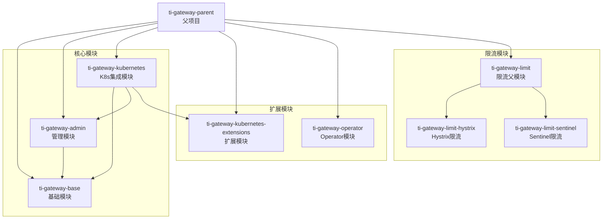
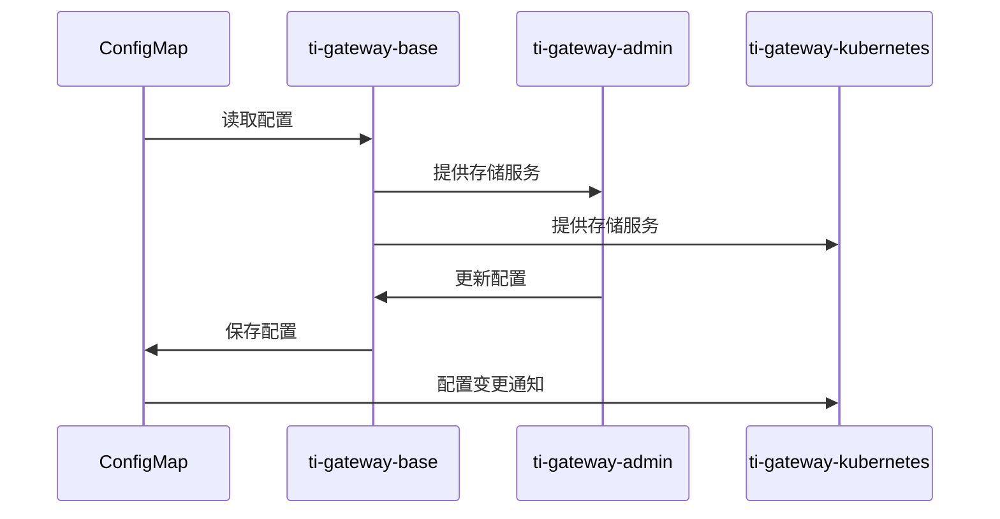
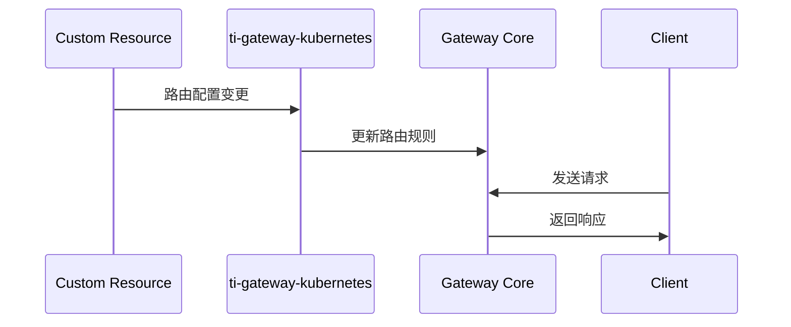

# TiGateway 模块设计

## 模块概览

TiGateway 采用多模块 Maven 项目结构，每个模块都有明确的职责和边界，支持独立开发和测试。

## 模块依赖关系



## 模块详细设计

### ti-gateway-parent
**职责**: 项目根模块，管理依赖版本和公共配置

**主要功能**:
- 依赖版本管理
- 插件配置
- 公共属性定义

**关键配置**:
```xml
<properties>
    <spring-boot.version>2.6.3</spring-boot.version>
    <spring-cloud.version>2021.0.1</spring-cloud.version>
    <kubernetes-client.version>18.0.1</kubernetes-client.version>
    <lombok.version>1.18.30</lombok.version>
</properties>
```

### ti-gateway-base
**职责**: 基础功能模块，提供核心数据模型和存储实现

**主要包结构**:
```
ti.gateway.base/
├── core/                    # 核心接口
│   ├── cache/              # 缓存接口
│   └── config/             # 配置接口
├── storage/                # 存储实现
│   └── configmap/          # ConfigMap存储
│       ├── config/         # 自动配置
│       ├── impl/           # 实现类
│       ├── mapper/         # 数据映射
│       └── model/          # 数据模型
└── schema/                 # YAML Schema
    ├── validator/          # 验证器
    └── transformer/        # 转换器
```

**核心接口**:
```java
// 应用服务器存储接口
public interface AppServerStorage {
    List<AppServerInfo> getAllAppServers();
    AppServerInfo getAppServer(String appId);
    void saveAppServer(AppServerInfo appServer);
    void deleteAppServer(String appId);
}

// ConfigMap存储实现
@Component
public class ConfigMapAppServerStorage implements AppServerStorage {
    // 实现基于ConfigMap的存储逻辑
}
```

### ti-gateway-admin
**职责**: 管理界面模块，提供Web UI和REST API

**主要包结构**:
```
ti.gateway.admin/
├── config/                 # 配置类
│   ├── AdminConfiguration.java
│   ├── AdminProperties.java
│   └── AdminServerConfiguration.java
├── controller/             # 控制器
│   ├── AdminController.java
│   └── ApiController.java
├── service/                # 服务层
│   ├── IGwAppInfoService.java
│   └── impl/
│       └── GwAppInfoServiceImpl.java
├── service/entity/         # 实体类
├── service/dto/            # 数据传输对象
└── base/                   # 基础类
    └── Page.java           # 分页类
```

**核心功能**:
- 独立端口管理服务 (8081)
- Web UI 管理界面
- REST API 端点
- 应用配置管理

### ti-gateway-kubernetes
**职责**: Kubernetes集成模块，主应用入口

**主要包结构**:
```
ti.gateway.kubernetes/
├── GatewayApplication.java # 主应用类
├── config/                 # 配置类
│   └── KubernetesDiscoveryConfiguration.java
├── ingress/                # Ingress集成
│   ├── IngressConfiguration.java
│   ├── IngressController.java
│   ├── IngressProperties.java
│   ├── IngressRouteDefinitionLocator.java
│   └── IngressWatcher.java
└── security/               # 安全配置
    ├── CommonSecurity.java
    └── SsoDisabledConfiguration.java
```

**核心功能**:
- 主网关服务 (端口 8080)
- Kubernetes Ingress 集成
- 服务发现
- 安全配置

### ti-gateway-kubernetes-extensions
**职责**: 扩展功能模块，提供插件机制

**主要功能**:
- 自定义扩展点
- 第三方集成
- 插件开发框架

### ti-gateway-operator
**职责**: Kubernetes Operator模块

**主要功能**:
- CRD 控制器
- 自定义资源管理
- 自动化运维

### ti-gateway-limit
**职责**: 限流功能模块

**子模块**:
- `ti-gateway-limit-hystrix`: Hystrix 限流实现
- `ti-gateway-limit-sentinel`: Sentinel 限流实现

## 模块间通信

### 依赖注入
```java
// Admin模块使用Base模块的存储服务
@Service
public class GwAppInfoServiceImpl implements IGwAppInfoService {
    
    @Autowired
    private AppServerStorage appServerStorage; // 来自ti-gateway-base
    
    // 业务逻辑实现
}
```

### 配置共享
```java
// 通过@ConfigurationProperties共享配置
@ConfigurationProperties(prefix = "admin")
public class AdminProperties {
    private Server server = new Server();
    // 配置属性
}
```

### 事件通信
```java
// 使用Spring事件机制进行模块间通信
@Component
public class RouteChangeListener {
    
    @EventListener
    public void handleRouteChange(RouteChangeEvent event) {
        // 处理路由变更事件
    }
}
```

## 数据流设计

### 配置数据流


### 路由数据流


## 扩展点设计

### 存储扩展
```java
// 定义存储扩展接口
public interface StorageExtension {
    void beforeSave(AppServerInfo appServer);
    void afterSave(AppServerInfo appServer);
    void beforeDelete(String appId);
    void afterDelete(String appId);
}

// 实现存储扩展
@Component
public class AuditStorageExtension implements StorageExtension {
    // 审计日志扩展实现
}
```

### 路由扩展
```java
// 定义路由扩展接口
public interface RouteExtension {
    RouteDefinition enhanceRoute(RouteDefinition route);
    boolean shouldApply(RouteDefinition route);
}

// 实现路由扩展
@Component
public class SecurityRouteExtension implements RouteExtension {
    // 安全增强扩展实现
}
```

## 测试策略

### 单元测试
```java
// 基础模块测试
@ExtendWith(MockitoExtension.class)
class ConfigMapAppServerStorageTest {
    
    @Mock
    private CoreV1Api coreV1Api;
    
    @InjectMocks
    private ConfigMapAppServerStorage storage;
    
    @Test
    void shouldSaveAppServer() {
        // 测试存储功能
    }
}
```

### 集成测试
```java
// 使用Testcontainers进行集成测试
@SpringBootTest
@Testcontainers
class TiGatewayIntegrationTest {
    
    @Container
    static KubernetesContainer kubernetes = new KubernetesContainer();
    
    @Test
    void shouldWorkWithKubernetes() {
        // 集成测试逻辑
    }
}
```

## 性能优化

### 缓存策略
```java
// 使用Spring Cache进行缓存
@Service
public class AppServerService {
    
    @Cacheable("appServers")
    public List<AppServerInfo> getAllAppServers() {
        // 缓存应用服务器列表
    }
    
    @CacheEvict("appServers")
    public void updateAppServer(AppServerInfo appServer) {
        // 更新时清除缓存
    }
}
```

### 异步处理
```java
// 使用异步处理提高性能
@Service
public class RouteUpdateService {
    
    @Async
    public CompletableFuture<Void> updateRoutesAsync() {
        // 异步更新路由
        return CompletableFuture.completedFuture(null);
    }
}
```

## 监控和指标

### 自定义指标
```java
// 使用Micrometer定义自定义指标
@Component
public class TiGatewayMetrics {
    
    private final Counter routeUpdateCounter;
    private final Timer routeProcessingTimer;
    
    public TiGatewayMetrics(MeterRegistry meterRegistry) {
        this.routeUpdateCounter = Counter.builder("tigateway.routes.updated")
            .description("Number of route updates")
            .register(meterRegistry);
            
        this.routeProcessingTimer = Timer.builder("tigateway.routes.processing")
            .description("Route processing time")
            .register(meterRegistry);
    }
}
```

---

**相关文档**:
- [系统架构](./system-architecture.md)
- [数据流设计](./data-flow.md)
- [开发环境搭建](../development/setup.md)
