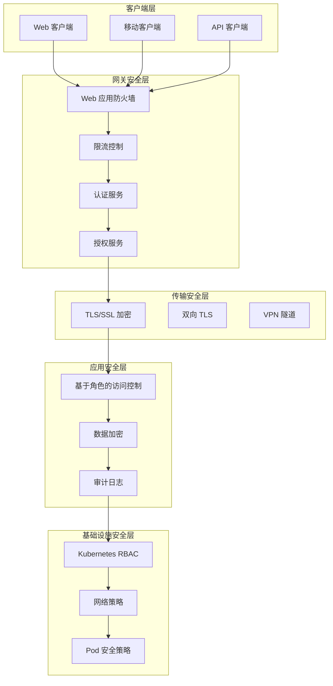
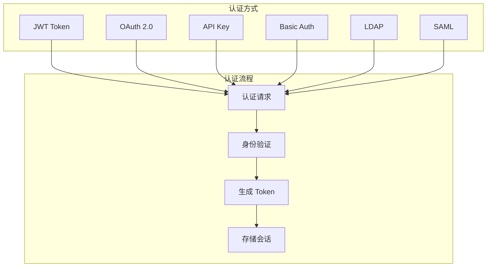
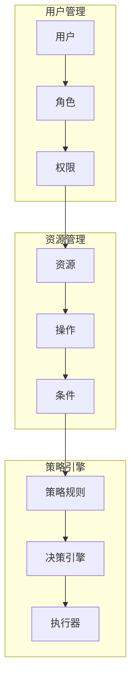
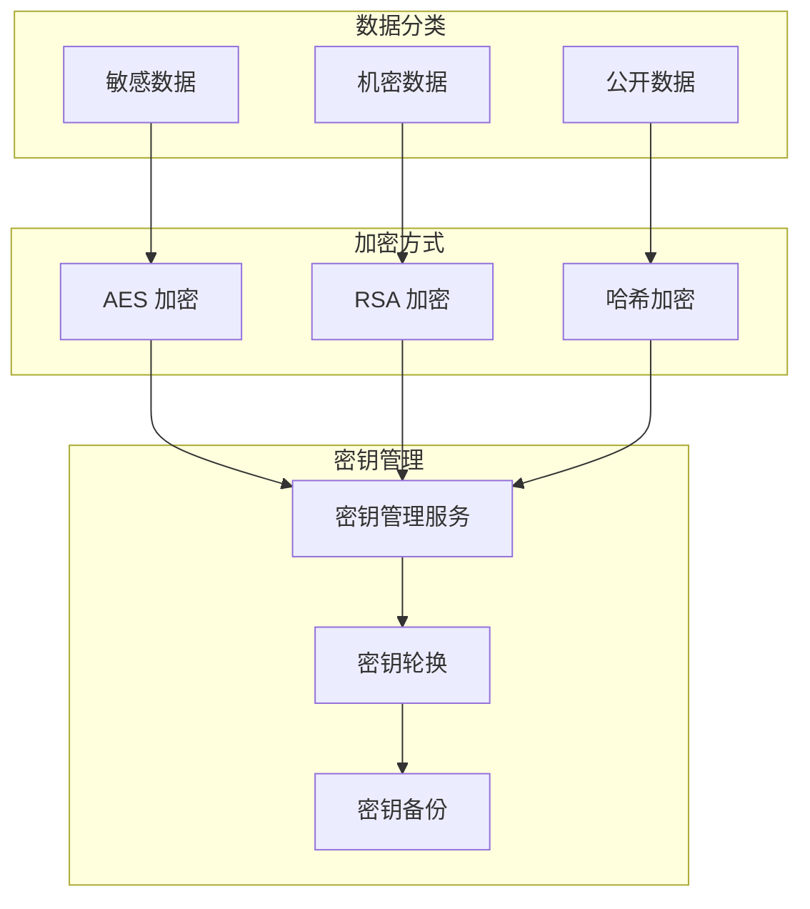
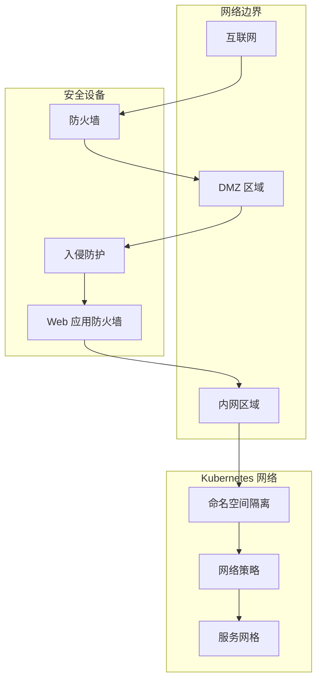
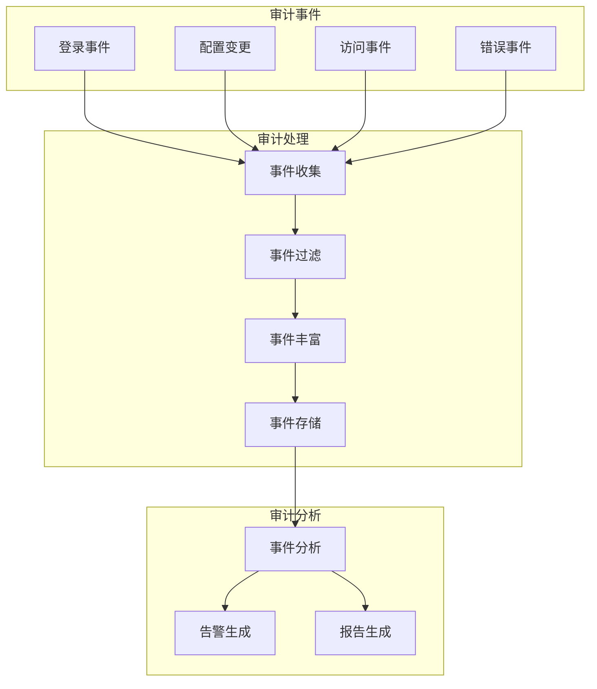

# TiGateway 安全架构

## 概述

TiGateway 采用多层安全架构设计，提供全面的安全防护机制，包括认证、授权、数据加密、网络安全等。本文档详细说明了 TiGateway 的安全架构设计和实现。

## 安全架构概览



## 认证架构

### 1. 多认证方式支持


### 2. JWT 认证实现
```java
@Component
public class JwtAuthenticationFilter implements GlobalFilter, Ordered {
    
    @Override
    public Mono<Void> filter(ServerWebExchange exchange, GatewayFilterChain chain) {
        ServerHttpRequest request = exchange.getRequest();
        String token = extractToken(request);
        
        if (token != null) {
            return validateToken(token)
                .flatMap(claims -> {
                    // 设置用户上下文
                    setUserContext(exchange, claims);
                    return chain.filter(exchange);
                })
                .onErrorResume(e -> {
                    // 认证失败处理
                    return handleAuthenticationError(exchange, e);
                });
        }
        
        return chain.filter(exchange);
    }
    
    private Mono<Claims> validateToken(String token) {
        try {
            Claims claims = Jwts.parser()
                .setSigningKey(jwtSecret)
                .parseClaimsJws(token)
                .getBody();
            return Mono.just(claims);
        } catch (Exception e) {
            return Mono.error(new AuthenticationException("Invalid token"));
        }
    }
}
```

### 3. OAuth 2.0 集成
```yaml
spring:
  security:
    oauth2:
      client:
        provider:
          sso:
            issuer-uri: ${SSO_ISSUER_URI}
            authorization-uri: ${SSO_AUTHORIZATION_URI}
            token-uri: ${SSO_TOKEN_URI}
            user-info-uri: ${SSO_USER_INFO_URI}
        registration:
          sso:
            client-id: ${SSO_CLIENT_ID}
            client-secret: ${SSO_CLIENT_SECRET}
            scope: openid,profile,email
            authorization-grant-type: authorization_code
            redirect-uri: "{baseUrl}/login/oauth2/code/{registrationId}"

sso:
  roles-attribute-name: roles
  groups-attribute-name: groups
```

## 授权架构

### 1. 基于角色的访问控制 (RBAC)


### 2. 权限模型设计
```java
@Entity
public class User {
    @Id
    private String id;
    private String username;
    private String email;
    
    @ManyToMany
    private Set<Role> roles;
    
    public boolean hasPermission(String resource, String action) {
        return roles.stream()
            .anyMatch(role -> role.hasPermission(resource, action));
    }
}

@Entity
public class Role {
    @Id
    private String id;
    private String name;
    private String description;
    
    @ManyToMany
    private Set<Permission> permissions;
    
    public boolean hasPermission(String resource, String action) {
        return permissions.stream()
            .anyMatch(permission -> 
                permission.getResource().equals(resource) && 
                permission.getAction().equals(action));
    }
}

@Entity
public class Permission {
    @Id
    private String id;
    private String resource;  // 资源类型：route, config, user
    private String action;    // 操作类型：read, write, delete
    private String condition; // 条件表达式
}
```

### 3. 策略执行器
```java
@Component
public class PolicyEnforcementPoint {
    
    public Mono<Boolean> checkPermission(String userId, String resource, String action) {
        return userService.findById(userId)
            .flatMap(user -> {
                // 检查用户权限
                if (user.hasPermission(resource, action)) {
                    return Mono.just(true);
                }
                
                // 检查动态策略
                return policyEngine.evaluate(user, resource, action);
            });
    }
    
    public Mono<Void> enforcePolicy(ServerWebExchange exchange, String resource, String action) {
        String userId = getCurrentUserId(exchange);
        
        return checkPermission(userId, resource, action)
            .flatMap(hasPermission -> {
                if (hasPermission) {
                    return Mono.empty();
                } else {
                    return Mono.error(new AccessDeniedException("Access denied"));
                }
            });
    }
}
```

## 数据安全

### 1. 数据加密架构


### 2. 敏感数据加密
```java
@Component
public class DataEncryptionService {
    
    @Value("${encryption.key}")
    private String encryptionKey;
    
    public String encrypt(String plainText) {
        try {
            Cipher cipher = Cipher.getInstance("AES/GCM/NoPadding");
            SecretKeySpec keySpec = new SecretKeySpec(
                encryptionKey.getBytes(), "AES");
            cipher.init(Cipher.ENCRYPT_MODE, keySpec);
            
            byte[] encrypted = cipher.doFinal(plainText.getBytes());
            return Base64.getEncoder().encodeToString(encrypted);
        } catch (Exception e) {
            throw new EncryptionException("Failed to encrypt data", e);
        }
    }
    
    public String decrypt(String encryptedText) {
        try {
            Cipher cipher = Cipher.getInstance("AES/GCM/NoPadding");
            SecretKeySpec keySpec = new SecretKeySpec(
                encryptionKey.getBytes(), "AES");
            cipher.init(Cipher.DECRYPT_MODE, keySpec);
            
            byte[] decoded = Base64.getDecoder().decode(encryptedText);
            byte[] decrypted = cipher.doFinal(decoded);
            return new String(decrypted);
        } catch (Exception e) {
            throw new EncryptionException("Failed to decrypt data", e);
        }
    }
}
```

### 3. 配置数据保护
```java
@Component
public class ConfigDataProtection {
    
    @Autowired
    private DataEncryptionService encryptionService;
    
    public void protectSensitiveConfig(ConfigMap configMap) {
        Map<String, String> data = configMap.getData();
        
        // 识别敏感配置项
        Set<String> sensitiveKeys = identifySensitiveKeys(data);
        
        // 加密敏感数据
        sensitiveKeys.forEach(key -> {
            String value = data.get(key);
            String encryptedValue = encryptionService.encrypt(value);
            data.put(key, encryptedValue);
        });
        
        // 添加加密标记
        data.put("_encrypted_keys", String.join(",", sensitiveKeys));
    }
    
    private Set<String> identifySensitiveKeys(Map<String, String> data) {
        return data.keySet().stream()
            .filter(key -> key.toLowerCase().contains("password") ||
                          key.toLowerCase().contains("secret") ||
                          key.toLowerCase().contains("token") ||
                          key.toLowerCase().contains("key"))
            .collect(Collectors.toSet());
    }
}
```

## 网络安全

### 1. 网络隔离架构


### 2. Kubernetes 网络策略
```yaml
apiVersion: networking.k8s.io/v1
kind: NetworkPolicy
metadata:
  name: tigateway-network-policy
  namespace: tigateway
spec:
  podSelector:
    matchLabels:
      app: tigateway
  policyTypes:
  - Ingress
  - Egress
  ingress:
  - from:
    - namespaceSelector:
        matchLabels:
          name: frontend
    - podSelector:
        matchLabels:
          app: admin
    ports:
    - protocol: TCP
      port: 8080
    - protocol: TCP
      port: 8081
  egress:
  - to:
    - namespaceSelector:
        matchLabels:
          name: backend
    ports:
    - protocol: TCP
      port: 8080
  - to: []
    ports:
    - protocol: TCP
      port: 53
    - protocol: UDP
      port: 53
```

### 3. TLS 配置
```yaml
apiVersion: v1
kind: Secret
metadata:
  name: tigateway-tls
  namespace: tigateway
type: kubernetes.io/tls
data:
  tls.crt: <base64-encoded-cert>
  tls.key: <base64-encoded-key>

---
apiVersion: networking.k8s.io/v1
kind: Ingress
metadata:
  name: tigateway-ingress
  namespace: tigateway
  annotations:
    nginx.ingress.kubernetes.io/ssl-redirect: "true"
    nginx.ingress.kubernetes.io/force-ssl-redirect: "true"
spec:
  tls:
  - hosts:
    - gateway.example.com
    secretName: tigateway-tls
  rules:
  - host: gateway.example.com
    http:
      paths:
      - path: /
        pathType: Prefix
        backend:
          service:
            name: tigateway
            port:
              number: 8080
```

## 审计与监控

### 1. 安全审计架构


### 2. 审计日志实现
```java
@Component
public class SecurityAuditLogger {
    
    private static final Logger auditLogger = LoggerFactory.getLogger("SECURITY_AUDIT");
    
    public void logAuthentication(String userId, String result, String details) {
        AuditEvent event = AuditEvent.builder()
            .eventType("AUTHENTICATION")
            .userId(userId)
            .result(result)
            .details(details)
            .timestamp(Instant.now())
            .sourceIp(getCurrentIp())
            .userAgent(getCurrentUserAgent())
            .build();
            
        auditLogger.info("AUTHENTICATION: {}", event);
    }
    
    public void logAuthorization(String userId, String resource, String action, String result) {
        AuditEvent event = AuditEvent.builder()
            .eventType("AUTHORIZATION")
            .userId(userId)
            .resource(resource)
            .action(action)
            .result(result)
            .timestamp(Instant.now())
            .sourceIp(getCurrentIp())
            .build();
            
        auditLogger.info("AUTHORIZATION: {}", event);
    }
    
    public void logConfigurationChange(String userId, String configType, String change) {
        AuditEvent event = AuditEvent.builder()
            .eventType("CONFIG_CHANGE")
            .userId(userId)
            .resource(configType)
            .action("MODIFY")
            .details(change)
            .timestamp(Instant.now())
            .build();
            
        auditLogger.info("CONFIG_CHANGE: {}", event);
    }
}
```

### 3. 安全监控告警
```java
@Component
public class SecurityMonitoringService {
    
    @EventListener
    public void handleSecurityEvent(SecurityEvent event) {
        // 检查是否需要告警
        if (shouldAlert(event)) {
            sendAlert(event);
        }
        
        // 更新安全指标
        updateSecurityMetrics(event);
    }
    
    private boolean shouldAlert(SecurityEvent event) {
        switch (event.getType()) {
            case FAILED_LOGIN:
                return checkFailedLoginThreshold(event);
            case SUSPICIOUS_ACCESS:
                return true;
            case CONFIG_CHANGE:
                return checkConfigChangeRisk(event);
            default:
                return false;
        }
    }
    
    private void sendAlert(SecurityEvent event) {
        Alert alert = Alert.builder()
            .severity(event.getSeverity())
            .title("Security Alert: " + event.getType())
            .description(event.getDescription())
            .timestamp(Instant.now())
            .build();
            
        alertService.sendAlert(alert);
    }
}
```

## 合规性要求

### 1. 数据保护合规
```java
@Component
public class DataProtectionCompliance {
    
    public void ensureDataRetention(String dataType, Duration retentionPeriod) {
        // 检查数据保留期限
        List<DataRecord> expiredRecords = findExpiredRecords(dataType, retentionPeriod);
        
        // 删除过期数据
        expiredRecords.forEach(record -> {
            if (isPersonalData(record)) {
                anonymizeData(record);
            } else {
                deleteData(record);
            }
        });
    }
    
    public void handleDataSubjectRequest(String subjectId, String requestType) {
        switch (requestType) {
            case "ACCESS":
                provideDataAccess(subjectId);
                break;
            case "PORTABILITY":
                provideDataPortability(subjectId);
                break;
            case "ERASURE":
                performDataErasure(subjectId);
                break;
            case "RECTIFICATION":
                performDataRectification(subjectId);
                break;
        }
    }
}
```

### 2. 安全基线配置
```yaml
# 安全基线配置
security:
  baseline:
    # 密码策略
    password:
      min-length: 12
      require-uppercase: true
      require-lowercase: true
      require-numbers: true
      require-special-chars: true
      max-age-days: 90
    
    # 会话管理
    session:
      timeout-minutes: 30
      max-concurrent-sessions: 5
      secure-cookies: true
      http-only-cookies: true
    
    # 加密要求
    encryption:
      min-key-size: 2048
      allowed-algorithms: ["AES-256", "RSA-2048"]
      require-tls: true
      tls-min-version: "1.2"
    
    # 审计要求
    audit:
      log-all-access: true
      log-config-changes: true
      log-security-events: true
      retention-days: 2555  # 7 years
```

## 安全测试

### 1. 安全测试策略
```java
@SpringBootTest
@TestPropertySource(properties = {
    "security.testing.enabled=true"
})
class SecurityIntegrationTest {
    
    @Test
    void shouldRejectInvalidJwtToken() {
        // 测试无效 JWT Token
        webTestClient.get()
            .uri("/api/secure")
            .header("Authorization", "Bearer invalid-token")
            .exchange()
            .expectStatus().isUnauthorized();
    }
    
    @Test
    void shouldEnforceRateLimit() {
        // 测试限流功能
        for (int i = 0; i < 100; i++) {
            webTestClient.get()
                .uri("/api/limited")
                .exchange()
                .expectStatus().isOk();
        }
        
        // 超过限制应该被拒绝
        webTestClient.get()
            .uri("/api/limited")
            .exchange()
            .expectStatus().isEqualTo(HttpStatus.TOO_MANY_REQUESTS);
    }
    
    @Test
    void shouldLogSecurityEvents() {
        // 测试安全事件日志
        webTestClient.post()
            .uri("/api/login")
            .bodyValue("{\"username\":\"invalid\",\"password\":\"wrong\"}")
            .exchange()
            .expectStatus().isUnauthorized();
            
        // 验证审计日志
        verify(auditLogger).info(contains("FAILED_LOGIN"));
    }
}
```

### 2. 渗透测试检查清单
```markdown
## 安全测试检查清单

### 认证安全
- [ ] 密码强度验证
- [ ] 账户锁定机制
- [ ] 会话超时处理
- [ ] 多因素认证
- [ ] 密码重置安全

### 授权安全
- [ ] 权限最小化原则
- [ ] 垂直权限提升防护
- [ ] 水平权限提升防护
- [ ] 资源访问控制
- [ ] API 权限验证

### 数据安全
- [ ] 敏感数据加密
- [ ] 数据传输加密
- [ ] 数据存储加密
- [ ] 密钥管理安全
- [ ] 数据脱敏处理

### 网络安全
- [ ] TLS 配置安全
- [ ] 网络隔离
- [ ] 防火墙规则
- [ ] DDoS 防护
- [ ] 入侵检测

### 应用安全
- [ ] 输入验证
- [ ] 输出编码
- [ ] SQL 注入防护
- [ ] XSS 防护
- [ ] CSRF 防护
```

---

**相关文档**:
- [系统架构](./system-architecture.md)
- [数据流设计](./data-flow.md)
- [模块设计](./module-design.md)
