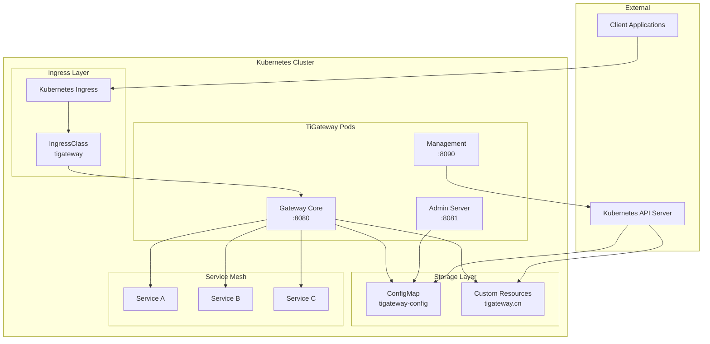
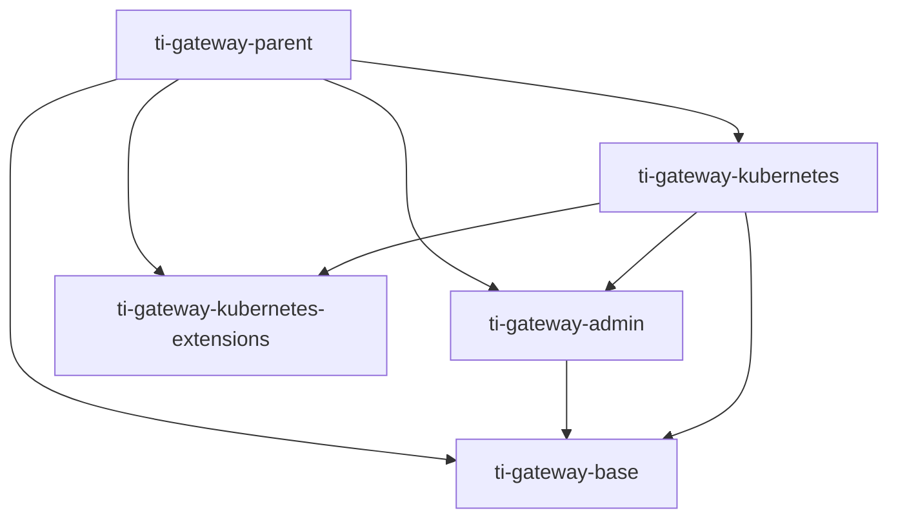

# TiGateway 系统架构

## 概述

TiGateway 是一个基于 Spring Cloud Gateway 的 Kubernetes 原生 API 网关解决方案，采用云原生架构设计，支持动态路由、服务发现和配置管理。

## 整体架构



## 核心组件

### 1. Gateway Core (端口 8080)
- **功能**: 主要的网关服务，处理所有入站请求
- **技术栈**: Spring Cloud Gateway + WebFlux
- **特性**:
  - 动态路由配置
  - 负载均衡
  - 熔断器
  - 限流
  - 认证授权

### 2. Admin Server (端口 8081)
- **功能**: 管理界面和 API，提供 Web UI 和 REST API
- **技术栈**: Spring Boot + Thymeleaf + WebFlux
- **特性**:
  - 路由管理界面
  - 配置管理
  - 监控面板
  - 用户管理

### 3. Management Endpoints (端口 8090)
- **功能**: 监控、健康检查和运维端点
- **技术栈**: Spring Boot Actuator
- **特性**:
  - 健康检查
  - 指标收集
  - 配置查看
  - 日志管理

## 数据存储架构

### ConfigMap 存储
```yaml
apiVersion: v1
kind: ConfigMap
metadata:
  name: tigateway-app-config
data:
  application.yml: |
    spring:
      cloud:
        gateway:
          routes:
            - id: user-service
              uri: lb://user-service
              predicates:
                - Path=/api/users/**
```

### 自定义资源定义 (CRD)
```yaml
apiVersion: tigateway.cn/v1
kind: TiGateway
metadata:
  name: tigateway-instance
spec:
  replicas: 3
  image: tigateway:latest
```

## 模块架构

### 模块依赖关系


### 模块职责

#### ti-gateway-base
- **职责**: 基础功能模块
- **包含**:
  - ConfigMap 存储实现
  - 数据模型定义
  - YAML Schema 验证
  - 通用工具类

#### ti-gateway-admin
- **职责**: 管理界面模块
- **包含**:
  - Web UI 界面
  - REST API 端点
  - 管理服务逻辑
  - 用户界面组件

#### ti-gateway-kubernetes
- **职责**: Kubernetes 集成模块
- **包含**:
  - 主应用入口
  - Ingress 控制器
  - 服务发现集成
  - Kubernetes 客户端

#### ti-gateway-kubernetes-extensions
- **职责**: 扩展功能模块
- **包含**:
  - 自定义扩展
  - 插件机制
  - 第三方集成

## 网络架构

### 端口分配
- **8080**: 主网关服务
- **8081**: Admin 管理界面
- **8090**: Management 监控端点

### 服务发现
```yaml
spring:
  cloud:
    kubernetes:
      discovery:
        enabled: true
        namespace: default
      config:
        enabled: true
        name: tigateway-config
```

### 负载均衡
- 使用 Spring Cloud LoadBalancer
- 支持多种负载均衡策略
- 集成 Kubernetes Service

## 安全架构

### 认证授权
```yaml
spring:
  security:
    oauth2:
      client:
        provider:
          sso:
            issuer-uri: ${SSO_ISSUER_URI}
```

### RBAC 配置
```yaml
apiVersion: rbac.authorization.k8s.io/v1
kind: Role
metadata:
  name: tigateway-role
rules:
  - apiGroups: [""]
    resources: ["configmaps", "services"]
    verbs: ["get", "list", "watch"]
```

## 扩展性设计

### 水平扩展
- 支持多副本部署
- 无状态设计
- 自动扩缩容

### 插件机制
- 支持自定义过滤器
- 可扩展路由策略
- 第三方集成接口

## 监控架构

### 指标收集
- Prometheus 指标
- 自定义业务指标
- JVM 监控指标

### 日志管理
- 结构化日志
- 日志聚合
- 分布式追踪

## 部署架构

### Kubernetes 部署
```yaml
apiVersion: apps/v1
kind: Deployment
metadata:
  name: tigateway
spec:
  replicas: 3
  selector:
    matchLabels:
      app: tigateway
  template:
    metadata:
      labels:
        app: tigateway
    spec:
      containers:
      - name: tigateway
        image: tigateway:latest
        ports:
        - containerPort: 8080
        - containerPort: 8081
        - containerPort: 8090
```

### Helm Chart 结构
```
helm/
├── gateway/
│   ├── Chart.yaml
│   ├── values.yaml
│   └── templates/
│       ├── deployment.yaml
│       ├── service.yaml
│       ├── configmap.yaml
│       └── rbac.yaml
└── tigateway-crds/
    ├── Chart.yaml
    ├── values.yaml
    └── templates/
        ├── tigateway-crd.yaml
        ├── tigateway-mapping-crd.yaml
        └── ingressclass.yaml
```

## 性能优化

### 缓存策略
- 路由配置缓存
- 服务发现缓存
- 配置热更新

### 连接池
- HTTP 连接池
- Kubernetes API 连接池
- 数据库连接池

## 故障恢复

### 健康检查
```yaml
livenessProbe:
  httpGet:
    path: /actuator/health
    port: 8090
  initialDelaySeconds: 30
  periodSeconds: 10

readinessProbe:
  httpGet:
    path: /actuator/health/readiness
    port: 8090
  initialDelaySeconds: 5
  periodSeconds: 5
```

### 故障转移
- 自动重试机制
- 熔断器保护
- 降级策略

---

**相关文档**:
- [模块设计](./module-design.md)
- [数据流设计](./data-flow.md)
- [安全架构](./security.md)
