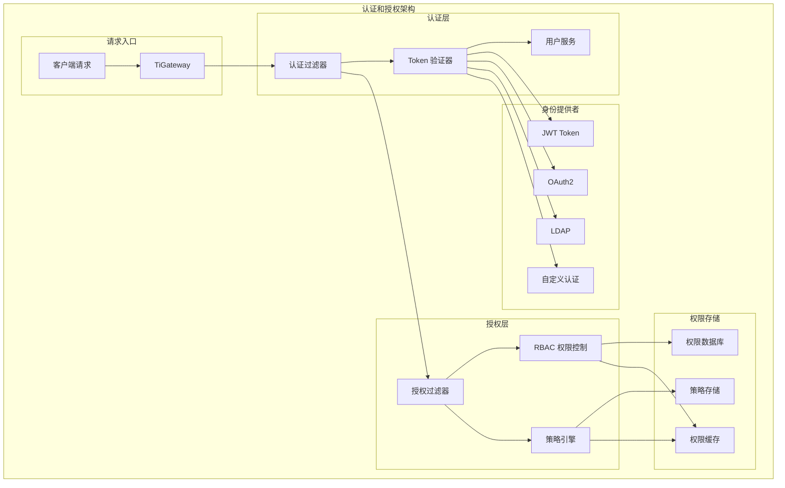

# 认证和授权

TiGateway 提供了完整的认证和授权功能，支持多种认证方式和细粒度的权限控制，确保 API 的安全访问。

## 认证和授权概述

### 架构设计



### 核心特性

- **多种认证方式**: 支持 JWT、OAuth2、LDAP、自定义认证
- **细粒度授权**: 支持基于角色和资源的权限控制
- **策略引擎**: 支持复杂的权限策略和规则
- **权限缓存**: 提供高性能的权限缓存机制
- **动态配置**: 支持运行时动态调整权限配置
- **审计日志**: 完整的认证和授权审计日志

## 认证功能

### 1. JWT 认证

```java
@Component
public class JwtAuthenticationFilter implements GlobalFilter, Ordered {
    
    @Autowired
    private JwtTokenProvider jwtTokenProvider;
    
    @Autowired
    private UserService userService;
    
    @Override
    public Mono<Void> filter(ServerWebExchange exchange, GatewayFilterChain chain) {
        ServerHttpRequest request = exchange.getRequest();
        
        // 检查是否需要认证
        if (isPublicPath(request.getPath().value())) {
            return chain.filter(exchange);
        }
        
        // 提取 JWT Token
        String token = extractToken(request);
        if (token == null) {
            return unauthorized(exchange, "Missing authentication token");
        }
        
        // 验证 Token
        if (!jwtTokenProvider.validateToken(token)) {
            return unauthorized(exchange, "Invalid authentication token");
        }
        
        // 获取用户信息
        String username = jwtTokenProvider.getUsernameFromToken(token);
        UserDetails userDetails = userService.loadUserByUsername(username);
        
        if (userDetails == null) {
            return unauthorized(exchange, "User not found");
        }
        
        // 设置用户上下文
        exchange.getAttributes().put("USER_DETAILS", userDetails);
        exchange.getAttributes().put("USERNAME", username);
        
        return chain.filter(exchange);
    }
    
    private boolean isPublicPath(String path) {
        return path.startsWith("/public/") || 
               path.startsWith("/health") || 
               path.startsWith("/actuator") ||
               path.startsWith("/login") ||
               path.startsWith("/register");
    }
    
    private String extractToken(ServerHttpRequest request) {
        String bearerToken = request.getHeaders().getFirst("Authorization");
        if (bearerToken != null && bearerToken.startsWith("Bearer ")) {
            return bearerToken.substring(7);
        }
        return null;
    }
    
    private Mono<Void> unauthorized(ServerWebExchange exchange, String message) {
        ServerHttpResponse response = exchange.getResponse();
        response.setStatusCode(HttpStatus.UNAUTHORIZED);
        response.getHeaders().add("Content-Type", "application/json");
        
        String body = String.format("{\"error\":\"Unauthorized\",\"message\":\"%s\"}", message);
        DataBuffer buffer = response.bufferFactory().wrap(body.getBytes());
        return response.writeWith(Mono.just(buffer));
    }
    
    @Override
    public int getOrder() {
        return -100;
    }
}

@Component
public class JwtTokenProvider {
    
    @Value("${jwt.secret}")
    private String secret;
    
    @Value("${jwt.expiration}")
    private long expiration;
    
    private Key getSigningKey() {
        byte[] keyBytes = Decoders.BASE64.decode(secret);
        return Keys.hmacShaKeyFor(keyBytes);
    }
    
    public String generateToken(UserDetails userDetails) {
        Map<String, Object> claims = new HashMap<>();
        claims.put("username", userDetails.getUsername());
        claims.put("authorities", userDetails.getAuthorities());
        
        return createToken(claims, userDetails.getUsername());
    }
    
    private String createToken(Map<String, Object> claims, String subject) {
        return Jwts.builder()
            .setClaims(claims)
            .setSubject(subject)
            .setIssuedAt(new Date(System.currentTimeMillis()))
            .setExpiration(new Date(System.currentTimeMillis() + expiration))
            .signWith(getSigningKey(), SignatureAlgorithm.HS256)
            .compact();
    }
    
    public Boolean validateToken(String token) {
        try {
            Jwts.parserBuilder()
                .setSigningKey(getSigningKey())
                .build()
                .parseClaimsJws(token);
            return true;
        } catch (JwtException | IllegalArgumentException e) {
            return false;
        }
    }
    
    public String getUsernameFromToken(String token) {
        return getClaimFromToken(token, Claims::getSubject);
    }
    
    public Date getExpirationDateFromToken(String token) {
        return getClaimFromToken(token, Claims::getExpiration);
    }
    
    public <T> T getClaimFromToken(String token, Function<Claims, T> claimsResolver) {
        final Claims claims = getAllClaimsFromToken(token);
        return claimsResolver.apply(claims);
    }
    
    private Claims getAllClaimsFromToken(String token) {
        return Jwts.parserBuilder()
            .setSigningKey(getSigningKey())
            .build()
            .parseClaimsJws(token)
            .getBody();
    }
    
    private Boolean isTokenExpired(String token) {
        final Date expiration = getExpirationDateFromToken(token);
        return expiration.before(new Date());
    }
}
```

### 2. OAuth2 认证

```java
@Component
public class OAuth2AuthenticationFilter implements GlobalFilter, Ordered {
    
    @Autowired
    private OAuth2AuthorizedClientService authorizedClientService;
    
    @Autowired
    private OAuth2UserService<OAuth2UserRequest, OAuth2User> oAuth2UserService;
    
    @Override
    public Mono<Void> filter(ServerWebExchange exchange, GatewayFilterChain chain) {
        ServerHttpRequest request = exchange.getRequest();
        
        // 检查是否需要认证
        if (isPublicPath(request.getPath().value())) {
            return chain.filter(exchange);
        }
        
        // 提取 OAuth2 Token
        String token = extractToken(request);
        if (token == null) {
            return unauthorized(exchange, "Missing OAuth2 token");
        }
        
        // 验证 Token
        return validateOAuth2Token(token)
            .flatMap(userDetails -> {
                // 设置用户上下文
                exchange.getAttributes().put("USER_DETAILS", userDetails);
                exchange.getAttributes().put("OAUTH2_TOKEN", token);
                return chain.filter(exchange);
            })
            .onErrorResume(throwable -> unauthorized(exchange, "Invalid OAuth2 token"));
    }
    
    private Mono<UserDetails> validateOAuth2Token(String token) {
        return Mono.fromCallable(() -> {
            // 验证 OAuth2 Token
            OAuth2AccessToken accessToken = new OAuth2AccessToken(
                OAuth2AccessToken.TokenType.BEARER, token);
            
            // 获取用户信息
            OAuth2UserRequest userRequest = new OAuth2UserRequest(
                getClientRegistration(), accessToken);
            
            OAuth2User oAuth2User = oAuth2UserService.loadUser(userRequest);
            
            // 转换为 UserDetails
            return convertToUserDetails(oAuth2User);
        }).subscribeOn(Schedulers.boundedElastic());
    }
    
    private UserDetails convertToUserDetails(OAuth2User oAuth2User) {
        List<GrantedAuthority> authorities = oAuth2User.getAuthorities().stream()
            .map(authority -> new SimpleGrantedAuthority(authority.getAuthority()))
            .collect(Collectors.toList());
        
        return new User(
            oAuth2User.getName(),
            "",
            authorities
        );
    }
    
    private ClientRegistration getClientRegistration() {
        // 获取 OAuth2 客户端注册信息
        return ClientRegistrations.fromIssuerLocation("https://oauth2.example.com")
            .clientId("tigateway")
            .clientSecret("secret")
            .build();
    }
    
    private String extractToken(ServerHttpRequest request) {
        String bearerToken = request.getHeaders().getFirst("Authorization");
        if (bearerToken != null && bearerToken.startsWith("Bearer ")) {
            return bearerToken.substring(7);
        }
        return null;
    }
    
    private boolean isPublicPath(String path) {
        return path.startsWith("/public/") || 
               path.startsWith("/health") || 
               path.startsWith("/actuator") ||
               path.startsWith("/oauth2/");
    }
    
    private Mono<Void> unauthorized(ServerWebExchange exchange, String message) {
        ServerHttpResponse response = exchange.getResponse();
        response.setStatusCode(HttpStatus.UNAUTHORIZED);
        response.getHeaders().add("Content-Type", "application/json");
        
        String body = String.format("{\"error\":\"Unauthorized\",\"message\":\"%s\"}", message);
        DataBuffer buffer = response.bufferFactory().wrap(body.getBytes());
        return response.writeWith(Mono.just(buffer));
    }
    
    @Override
    public int getOrder() {
        return -99;
    }
}
```

### 3. LDAP 认证

```java
@Component
public class LdapAuthenticationFilter implements GlobalFilter, Ordered {
    
    @Autowired
    private LdapTemplate ldapTemplate;
    
    @Autowired
    private UserService userService;
    
    @Override
    public Mono<Void> filter(ServerWebExchange exchange, GatewayFilterChain chain) {
        ServerHttpRequest request = exchange.getRequest();
        
        // 检查是否需要认证
        if (isPublicPath(request.getPath().value())) {
            return chain.filter(exchange);
        }
        
        // 提取认证信息
        String username = extractUsername(request);
        String password = extractPassword(request);
        
        if (username == null || password == null) {
            return unauthorized(exchange, "Missing authentication credentials");
        }
        
        // 验证 LDAP 认证
        return validateLdapAuthentication(username, password)
            .flatMap(userDetails -> {
                // 设置用户上下文
                exchange.getAttributes().put("USER_DETAILS", userDetails);
                exchange.getAttributes().put("USERNAME", username);
                return chain.filter(exchange);
            })
            .onErrorResume(throwable -> unauthorized(exchange, "Invalid credentials"));
    }
    
    private Mono<UserDetails> validateLdapAuthentication(String username, String password) {
        return Mono.fromCallable(() -> {
            // LDAP 认证
            boolean authenticated = ldapTemplate.authenticate(
                LdapQueryBuilder.query()
                    .where("uid").is(username),
                password
            );
            
            if (!authenticated) {
                throw new AuthenticationException("Invalid credentials");
            }
            
            // 获取用户信息
            User user = ldapTemplate.findOne(
                LdapQueryBuilder.query()
                    .where("uid").is(username),
                User.class
            );
            
            // 获取用户组
            List<String> groups = ldapTemplate.search(
                LdapQueryBuilder.query()
                    .where("member").is("uid=" + username + ",ou=users,dc=example,dc=com"),
                (AttributesMapper<String>) attrs -> attrs.get("cn").get().toString()
            );
            
            // 转换为 UserDetails
            return convertToUserDetails(user, groups);
        }).subscribeOn(Schedulers.boundedElastic());
    }
    
    private UserDetails convertToUserDetails(User user, List<String> groups) {
        List<GrantedAuthority> authorities = groups.stream()
            .map(group -> new SimpleGrantedAuthority("ROLE_" + group.toUpperCase()))
            .collect(Collectors.toList());
        
        return new User(
            user.getUid(),
            "",
            authorities
        );
    }
    
    private String extractUsername(ServerHttpRequest request) {
        return request.getHeaders().getFirst("X-Username");
    }
    
    private String extractPassword(ServerHttpRequest request) {
        return request.getHeaders().getFirst("X-Password");
    }
    
    private boolean isPublicPath(String path) {
        return path.startsWith("/public/") || 
               path.startsWith("/health") || 
               path.startsWith("/actuator");
    }
    
    private Mono<Void> unauthorized(ServerWebExchange exchange, String message) {
        ServerHttpResponse response = exchange.getResponse();
        response.setStatusCode(HttpStatus.UNAUTHORIZED);
        response.getHeaders().add("Content-Type", "application/json");
        
        String body = String.format("{\"error\":\"Unauthorized\",\"message\":\"%s\"}", message);
        DataBuffer buffer = response.bufferFactory().wrap(body.getBytes());
        return response.writeWith(Mono.just(buffer));
    }
    
    @Override
    public int getOrder() {
        return -98;
    }
}
```

## 授权功能

### 1. RBAC 授权

```java
@Component
public class RbacAuthorizationFilter implements GlobalFilter, Ordered {
    
    @Autowired
    private PermissionService permissionService;
    
    @Autowired
    private RoleService roleService;
    
    @Override
    public Mono<Void> filter(ServerWebExchange exchange, GatewayFilterChain chain) {
        ServerHttpRequest request = exchange.getRequest();
        
        // 获取用户信息
        UserDetails userDetails = exchange.getAttribute("USER_DETAILS");
        if (userDetails == null) {
            return chain.filter(exchange);
        }
        
        // 获取请求资源
        String resource = getResource(request);
        String action = getAction(request);
        
        // 检查权限
        return checkPermission(userDetails, resource, action)
            .flatMap(hasPermission -> {
                if (hasPermission) {
                    return chain.filter(exchange);
                } else {
                    return forbidden(exchange, "Insufficient permissions");
                }
            });
    }
    
    private Mono<Boolean> checkPermission(UserDetails userDetails, String resource, String action) {
        return Mono.fromCallable(() -> {
            // 获取用户角色
            List<String> roles = userDetails.getAuthorities().stream()
                .map(GrantedAuthority::getAuthority)
                .collect(Collectors.toList());
            
            // 检查角色权限
            for (String role : roles) {
                if (permissionService.hasPermission(role, resource, action)) {
                    return true;
                }
            }
            
            // 检查用户直接权限
            return permissionService.hasUserPermission(userDetails.getUsername(), resource, action);
        }).subscribeOn(Schedulers.boundedElastic());
    }
    
    private String getResource(ServerHttpRequest request) {
        String path = request.getPath().value();
        String method = request.getMethod().name();
        return method + ":" + path;
    }
    
    private String getAction(ServerHttpRequest request) {
        return request.getMethod().name().toLowerCase();
    }
    
    private Mono<Void> forbidden(ServerWebExchange exchange, String message) {
        ServerHttpResponse response = exchange.getResponse();
        response.setStatusCode(HttpStatus.FORBIDDEN);
        response.getHeaders().add("Content-Type", "application/json");
        
        String body = String.format("{\"error\":\"Forbidden\",\"message\":\"%s\"}", message);
        DataBuffer buffer = response.bufferFactory().wrap(body.getBytes());
        return response.writeWith(Mono.just(buffer));
    }
    
    @Override
    public int getOrder() {
        return -50;
    }
}

@Service
public class PermissionService {
    
    @Autowired
    private PermissionRepository permissionRepository;
    
    @Autowired
    private RedisTemplate<String, String> redisTemplate;
    
    private final String PERMISSION_CACHE_PREFIX = "permission:";
    private final Duration CACHE_TTL = Duration.ofMinutes(30);
    
    public boolean hasPermission(String role, String resource, String action) {
        String cacheKey = PERMISSION_CACHE_PREFIX + role + ":" + resource + ":" + action;
        
        // 检查缓存
        String cached = redisTemplate.opsForValue().get(cacheKey);
        if (cached != null) {
            return Boolean.parseBoolean(cached);
        }
        
        // 查询数据库
        boolean hasPermission = permissionRepository.hasPermission(role, resource, action);
        
        // 缓存结果
        redisTemplate.opsForValue().set(cacheKey, String.valueOf(hasPermission), CACHE_TTL);
        
        return hasPermission;
    }
    
    public boolean hasUserPermission(String username, String resource, String action) {
        String cacheKey = PERMISSION_CACHE_PREFIX + "user:" + username + ":" + resource + ":" + action;
        
        // 检查缓存
        String cached = redisTemplate.opsForValue().get(cacheKey);
        if (cached != null) {
            return Boolean.parseBoolean(cached);
        }
        
        // 查询数据库
        boolean hasPermission = permissionRepository.hasUserPermission(username, resource, action);
        
        // 缓存结果
        redisTemplate.opsForValue().set(cacheKey, String.valueOf(hasPermission), CACHE_TTL);
        
        return hasPermission;
    }
    
    public void clearPermissionCache(String role) {
        String pattern = PERMISSION_CACHE_PREFIX + role + ":*";
        Set<String> keys = redisTemplate.keys(pattern);
        if (keys != null && !keys.isEmpty()) {
            redisTemplate.delete(keys);
        }
    }
    
    public void clearUserPermissionCache(String username) {
        String pattern = PERMISSION_CACHE_PREFIX + "user:" + username + ":*";
        Set<String> keys = redisTemplate.keys(pattern);
        if (keys != null && !keys.isEmpty()) {
            redisTemplate.delete(keys);
        }
    }
}
```

### 2. 策略引擎

```java
@Component
public class PolicyEngine {
    
    @Autowired
    private PolicyRepository policyRepository;
    
    @Autowired
    private PolicyEvaluator policyEvaluator;
    
    public Mono<Boolean> evaluatePolicy(UserDetails userDetails, String resource, String action, Map<String, Object> context) {
        return Mono.fromCallable(() -> {
            // 获取相关策略
            List<Policy> policies = policyRepository.findPoliciesByResource(resource);
            
            // 评估策略
            for (Policy policy : policies) {
                if (policyEvaluator.evaluate(policy, userDetails, resource, action, context)) {
                    return policy.getEffect() == PolicyEffect.ALLOW;
                }
            }
            
            // 默认拒绝
            return false;
        }).subscribeOn(Schedulers.boundedElastic());
    }
    
    public Mono<Boolean> evaluateConditionalPolicy(UserDetails userDetails, String resource, String action, Map<String, Object> context) {
        return Mono.fromCallable(() -> {
            // 获取条件策略
            List<ConditionalPolicy> policies = policyRepository.findConditionalPoliciesByResource(resource);
            
            // 评估条件策略
            for (ConditionalPolicy policy : policies) {
                if (policyEvaluator.evaluateConditional(policy, userDetails, resource, action, context)) {
                    return policy.getEffect() == PolicyEffect.ALLOW;
                }
            }
            
            // 默认拒绝
            return false;
        }).subscribeOn(Schedulers.boundedElastic());
    }
}

@Component
public class PolicyEvaluator {
    
    @Autowired
    private ExpressionEvaluator expressionEvaluator;
    
    public boolean evaluate(Policy policy, UserDetails userDetails, String resource, String action, Map<String, Object> context) {
        // 检查主体匹配
        if (!matchesSubject(policy.getSubject(), userDetails)) {
            return false;
        }
        
        // 检查资源匹配
        if (!matchesResource(policy.getResource(), resource)) {
            return false;
        }
        
        // 检查动作匹配
        if (!matchesAction(policy.getAction(), action)) {
            return false;
        }
        
        // 检查条件
        if (policy.getCondition() != null) {
            return evaluateCondition(policy.getCondition(), userDetails, context);
        }
        
        return true;
    }
    
    public boolean evaluateConditional(ConditionalPolicy policy, UserDetails userDetails, String resource, String action, Map<String, Object> context) {
        // 评估条件表达式
        return expressionEvaluator.evaluate(policy.getCondition(), userDetails, resource, action, context);
    }
    
    private boolean matchesSubject(String subjectPattern, UserDetails userDetails) {
        if (subjectPattern.equals("*")) {
            return true;
        }
        
        if (subjectPattern.startsWith("user:")) {
            String username = subjectPattern.substring(5);
            return username.equals(userDetails.getUsername());
        }
        
        if (subjectPattern.startsWith("role:")) {
            String role = subjectPattern.substring(5);
            return userDetails.getAuthorities().stream()
                .anyMatch(authority -> authority.getAuthority().equals(role));
        }
        
        return false;
    }
    
    private boolean matchesResource(String resourcePattern, String resource) {
        if (resourcePattern.equals("*")) {
            return true;
        }
        
        // 支持通配符匹配
        return resource.matches(resourcePattern.replace("*", ".*"));
    }
    
    private boolean matchesAction(String actionPattern, String action) {
        if (actionPattern.equals("*")) {
            return true;
        }
        
        return actionPattern.equals(action);
    }
    
    private boolean evaluateCondition(String condition, UserDetails userDetails, Map<String, Object> context) {
        // 简单的条件评估
        return expressionEvaluator.evaluate(condition, userDetails, null, null, context);
    }
}

@Component
public class ExpressionEvaluator {
    
    public boolean evaluate(String expression, UserDetails userDetails, String resource, String action, Map<String, Object> context) {
        try {
            // 创建评估上下文
            Map<String, Object> variables = new HashMap<>();
            variables.put("user", userDetails);
            variables.put("username", userDetails.getUsername());
            variables.put("roles", userDetails.getAuthorities());
            variables.put("resource", resource);
            variables.put("action", action);
            variables.putAll(context);
            
            // 使用 SpEL 评估表达式
            ExpressionParser parser = new SpelExpressionParser();
            Expression exp = parser.parseExpression(expression);
            StandardEvaluationContext evalContext = new StandardEvaluationContext();
            evalContext.setVariables(variables);
            
            Object result = exp.getValue(evalContext);
            return Boolean.TRUE.equals(result);
        } catch (Exception e) {
            return false;
        }
    }
}
```

## 配置示例

### 1. JWT 配置

```yaml
# application.yml
jwt:
  secret: ${JWT_SECRET:mySecretKey}
  expiration: 86400000  # 24 hours
  header: Authorization
  prefix: "Bearer "

spring:
  security:
    oauth2:
      client:
        registration:
          tigateway:
            client-id: tigateway
            client-secret: ${OAUTH2_CLIENT_SECRET}
            authorization-grant-type: client_credentials
            scope: read,write
        provider:
          tigateway:
            token-uri: ${OAUTH2_TOKEN_URI}
            user-info-uri: ${OAUTH2_USER_INFO_URI}
```

### 2. LDAP 配置

```yaml
# application.yml
spring:
  ldap:
    urls: ldap://ldap.example.com:389
    base: dc=example,dc=com
    username: cn=admin,dc=example,dc=com
    password: ${LDAP_PASSWORD}
    user-search-base: ou=users
    user-search-filter: (uid={0})
    group-search-base: ou=groups
    group-search-filter: (member={0})
```

### 3. 权限配置

```yaml
# 权限配置
apiVersion: v1
kind: ConfigMap
metadata:
  name: tigateway-permissions
  namespace: tigateway
data:
  permissions.yml: |
    permissions:
      roles:
        admin:
          permissions:
          - resource: "*"
            actions: ["*"]
        user:
          permissions:
          - resource: "GET:/api/users/*"
            actions: ["read"]
          - resource: "POST:/api/users"
            actions: ["create"]
        guest:
          permissions:
          - resource: "GET:/api/public/*"
            actions: ["read"]
      
      policies:
      - name: "user-data-access"
        subject: "user:*"
        resource: "GET:/api/users/{userId}"
        action: "read"
        effect: "allow"
        condition: "user.username == #userId"
      
      - name: "admin-access"
        subject: "role:ADMIN"
        resource: "*"
        action: "*"
        effect: "allow"
      
      - name: "time-based-access"
        subject: "user:*"
        resource: "GET:/api/sensitive/*"
        action: "read"
        effect: "allow"
        condition: "T(java.time.LocalTime).now().isAfter(T(java.time.LocalTime).of(9, 0))"
```

## 管理 API

### 1. 认证管理 API

```java
@RestController
@RequestMapping("/api/auth")
public class AuthenticationController {
    
    @Autowired
    private JwtTokenProvider jwtTokenProvider;
    
    @Autowired
    private UserService userService;
    
    @PostMapping("/login")
    public ResponseEntity<AuthResponse> login(@RequestBody LoginRequest request) {
        try {
            // 验证用户凭据
            UserDetails userDetails = userService.loadUserByUsername(request.getUsername());
            if (!passwordEncoder.matches(request.getPassword(), userDetails.getPassword())) {
                return ResponseEntity.status(HttpStatus.UNAUTHORIZED).build();
            }
            
            // 生成 JWT Token
            String token = jwtTokenProvider.generateToken(userDetails);
            
            AuthResponse response = new AuthResponse();
            response.setToken(token);
            response.setUsername(userDetails.getUsername());
            response.setAuthorities(userDetails.getAuthorities());
            
            return ResponseEntity.ok(response);
        } catch (Exception e) {
            return ResponseEntity.status(HttpStatus.UNAUTHORIZED).build();
        }
    }
    
    @PostMapping("/refresh")
    public ResponseEntity<AuthResponse> refresh(@RequestHeader("Authorization") String token) {
        try {
            String jwtToken = token.substring(7);
            
            if (!jwtTokenProvider.validateToken(jwtToken)) {
                return ResponseEntity.status(HttpStatus.UNAUTHORIZED).build();
            }
            
            String username = jwtTokenProvider.getUsernameFromToken(jwtToken);
            UserDetails userDetails = userService.loadUserByUsername(username);
            
            String newToken = jwtTokenProvider.generateToken(userDetails);
            
            AuthResponse response = new AuthResponse();
            response.setToken(newToken);
            response.setUsername(userDetails.getUsername());
            response.setAuthorities(userDetails.getAuthorities());
            
            return ResponseEntity.ok(response);
        } catch (Exception e) {
            return ResponseEntity.status(HttpStatus.UNAUTHORIZED).build();
        }
    }
    
    @PostMapping("/logout")
    public ResponseEntity<Void> logout(@RequestHeader("Authorization") String token) {
        // 将 Token 加入黑名单
        String jwtToken = token.substring(7);
        jwtTokenProvider.addToBlacklist(jwtToken);
        
        return ResponseEntity.ok().build();
    }
}
```

### 2. 权限管理 API

```java
@RestController
@RequestMapping("/api/permissions")
public class PermissionController {
    
    @Autowired
    private PermissionService permissionService;
    
    @Autowired
    private RoleService roleService;
    
    @GetMapping("/user/{username}")
    public ResponseEntity<List<Permission>> getUserPermissions(@PathVariable String username) {
        try {
            List<Permission> permissions = permissionService.getUserPermissions(username);
            return ResponseEntity.ok(permissions);
        } catch (Exception e) {
            return ResponseEntity.badRequest().build();
        }
    }
    
    @GetMapping("/role/{role}")
    public ResponseEntity<List<Permission>> getRolePermissions(@PathVariable String role) {
        try {
            List<Permission> permissions = permissionService.getRolePermissions(role);
            return ResponseEntity.ok(permissions);
        } catch (Exception e) {
            return ResponseEntity.badRequest().build();
        }
    }
    
    @PostMapping("/user/{username}")
    public ResponseEntity<Void> grantUserPermission(
            @PathVariable String username,
            @RequestBody Permission permission) {
        try {
            permissionService.grantUserPermission(username, permission);
            return ResponseEntity.ok().build();
        } catch (Exception e) {
            return ResponseEntity.badRequest().build();
        }
    }
    
    @DeleteMapping("/user/{username}")
    public ResponseEntity<Void> revokeUserPermission(
            @PathVariable String username,
            @RequestBody Permission permission) {
        try {
            permissionService.revokeUserPermission(username, permission);
            return ResponseEntity.ok().build();
        } catch (Exception e) {
            return ResponseEntity.badRequest().build();
        }
    }
    
    @PostMapping("/role/{role}")
    public ResponseEntity<Void> grantRolePermission(
            @PathVariable String role,
            @RequestBody Permission permission) {
        try {
            permissionService.grantRolePermission(role, permission);
            return ResponseEntity.ok().build();
        } catch (Exception e) {
            return ResponseEntity.badRequest().build();
        }
    }
    
    @DeleteMapping("/role/{role}")
    public ResponseEntity<Void> revokeRolePermission(
            @PathVariable String role,
            @RequestBody Permission permission) {
        try {
            permissionService.revokeRolePermission(role, permission);
            return ResponseEntity.ok().build();
        } catch (Exception e) {
            return ResponseEntity.badRequest().build();
        }
    }
}
```

## 监控和审计

### 1. 认证审计

```java
@Component
public class AuthenticationAuditLogger {
    
    private static final Logger auditLogger = LoggerFactory.getLogger("AUDIT");
    
    public void logAuthenticationSuccess(String username, String clientIp, String userAgent) {
        auditLogger.info("AUTHENTICATION_SUCCESS: username={}, clientIp={}, userAgent={}, timestamp={}", 
            username, clientIp, userAgent, Instant.now());
    }
    
    public void logAuthenticationFailure(String username, String clientIp, String userAgent, String reason) {
        auditLogger.warn("AUTHENTICATION_FAILURE: username={}, clientIp={}, userAgent={}, reason={}, timestamp={}", 
            username, clientIp, userAgent, reason, Instant.now());
    }
    
    public void logAuthorizationSuccess(String username, String resource, String action, String clientIp) {
        auditLogger.info("AUTHORIZATION_SUCCESS: username={}, resource={}, action={}, clientIp={}, timestamp={}", 
            username, resource, action, clientIp, Instant.now());
    }
    
    public void logAuthorizationFailure(String username, String resource, String action, String clientIp, String reason) {
        auditLogger.warn("AUTHORIZATION_FAILURE: username={}, resource={}, action={}, clientIp={}, reason={}, timestamp={}", 
            username, resource, action, clientIp, reason, Instant.now());
    }
    
    public void logTokenRefresh(String username, String clientIp) {
        auditLogger.info("TOKEN_REFRESH: username={}, clientIp={}, timestamp={}", 
            username, clientIp, Instant.now());
    }
    
    public void logLogout(String username, String clientIp) {
        auditLogger.info("LOGOUT: username={}, clientIp={}, timestamp={}", 
            username, clientIp, Instant.now());
    }
}
```

### 2. 授权审计

```java
@Component
public class AuthorizationAuditLogger {
    
    private static final Logger auditLogger = LoggerFactory.getLogger("AUDIT");
    
    public void logPermissionCheck(String username, String resource, String action, boolean granted) {
        String level = granted ? "INFO" : "WARN";
        auditLogger.info("PERMISSION_CHECK: username={}, resource={}, action={}, granted={}, timestamp={}", 
            username, resource, action, granted, Instant.now());
    }
    
    public void logRoleAssignment(String username, String role, String assignedBy) {
        auditLogger.info("ROLE_ASSIGNMENT: username={}, role={}, assignedBy={}, timestamp={}", 
            username, role, assignedBy, Instant.now());
    }
    
    public void logRoleRemoval(String username, String role, String removedBy) {
        auditLogger.info("ROLE_REMOVAL: username={}, role={}, removedBy={}, timestamp={}", 
            username, role, removedBy, Instant.now());
    }
    
    public void logPermissionGrant(String username, String resource, String action, String grantedBy) {
        auditLogger.info("PERMISSION_GRANT: username={}, resource={}, action={}, grantedBy={}, timestamp={}", 
            username, resource, action, grantedBy, Instant.now());
    }
    
    public void logPermissionRevoke(String username, String resource, String action, String revokedBy) {
        auditLogger.info("PERMISSION_REVOKE: username={}, resource={}, action={}, revokedBy={}, timestamp={}", 
            username, resource, action, revokedBy, Instant.now());
    }
}
```

### 3. 安全指标

```java
@Component
public class SecurityMetrics {
    
    private final MeterRegistry meterRegistry;
    private final Counter authenticationAttempts;
    private final Counter authenticationSuccesses;
    private final Counter authenticationFailures;
    private final Counter authorizationAttempts;
    private final Counter authorizationSuccesses;
    private final Counter authorizationFailures;
    private final Timer authenticationLatency;
    private final Timer authorizationLatency;
    
    public SecurityMetrics(MeterRegistry meterRegistry) {
        this.meterRegistry = meterRegistry;
        this.authenticationAttempts = Counter.builder("tigateway_authentication_attempts_total")
            .description("Total number of authentication attempts")
            .register(meterRegistry);
        this.authenticationSuccesses = Counter.builder("tigateway_authentication_successes_total")
            .description("Total number of successful authentications")
            .register(meterRegistry);
        this.authenticationFailures = Counter.builder("tigateway_authentication_failures_total")
            .description("Total number of failed authentications")
            .register(meterRegistry);
        this.authorizationAttempts = Counter.builder("tigateway_authorization_attempts_total")
            .description("Total number of authorization attempts")
            .register(meterRegistry);
        this.authorizationSuccesses = Counter.builder("tigateway_authorization_successes_total")
            .description("Total number of successful authorizations")
            .register(meterRegistry);
        this.authorizationFailures = Counter.builder("tigateway_authorization_failures_total")
            .description("Total number of failed authorizations")
            .register(meterRegistry);
        this.authenticationLatency = Timer.builder("tigateway_authentication_duration_seconds")
            .description("Authentication duration")
            .register(meterRegistry);
        this.authorizationLatency = Timer.builder("tigateway_authorization_duration_seconds")
            .description("Authorization duration")
            .register(meterRegistry);
    }
    
    public void recordAuthenticationAttempt(String method) {
        authenticationAttempts.increment(Tags.of("method", method));
    }
    
    public void recordAuthenticationSuccess(String method) {
        authenticationSuccesses.increment(Tags.of("method", method));
    }
    
    public void recordAuthenticationFailure(String method, String reason) {
        authenticationFailures.increment(Tags.of("method", method, "reason", reason));
    }
    
    public void recordAuthorizationAttempt(String resource, String action) {
        authorizationAttempts.increment(Tags.of("resource", resource, "action", action));
    }
    
    public void recordAuthorizationSuccess(String resource, String action) {
        authorizationSuccesses.increment(Tags.of("resource", resource, "action", action));
    }
    
    public void recordAuthorizationFailure(String resource, String action, String reason) {
        authorizationFailures.increment(Tags.of("resource", resource, "action", action, "reason", reason));
    }
    
    public void recordAuthenticationLatency(Duration duration) {
        authenticationLatency.record(duration);
    }
    
    public void recordAuthorizationLatency(Duration duration) {
        authorizationLatency.record(duration);
    }
}
```

## 最佳实践

### 1. 安全配置

```yaml
# 安全最佳实践配置
apiVersion: v1
kind: ConfigMap
metadata:
  name: tigateway-security-best-practices
  namespace: tigateway
data:
  security-config.yml: |
    security:
      authentication:
        # JWT 配置
        jwt:
          secret: ${JWT_SECRET}
          expiration: 3600000  # 1 hour
          refresh-expiration: 86400000  # 24 hours
          algorithm: HS256
          issuer: tigateway
          audience: api-users
        
        # OAuth2 配置
        oauth2:
          enabled: true
          providers:
          - name: google
            client-id: ${GOOGLE_CLIENT_ID}
            client-secret: ${GOOGLE_CLIENT_SECRET}
            scope: openid,profile,email
          - name: github
            client-id: ${GITHUB_CLIENT_ID}
            client-secret: ${GITHUB_CLIENT_SECRET}
            scope: user:email
        
        # LDAP 配置
        ldap:
          enabled: false
          url: ldap://ldap.example.com:389
          base-dn: dc=example,dc=com
          user-dn-pattern: uid={0},ou=users
          group-search-base: ou=groups
          group-search-filter: (member={0})
      
      authorization:
        # RBAC 配置
        rbac:
          enabled: true
          cache:
            enabled: true
            ttl: 1800  # 30 minutes
            max-size: 10000
        
        # 策略引擎配置
        policy:
          enabled: true
          cache:
            enabled: true
            ttl: 3600  # 1 hour
            max-size: 5000
        
        # 权限检查配置
        permission-check:
          enabled: true
          fail-fast: true
          cache-results: true
      
      # 安全头配置
      headers:
        enabled: true
        strict-transport-security: "max-age=31536000; includeSubDomains"
        content-security-policy: "default-src 'self'"
        x-frame-options: DENY
        x-content-type-options: nosniff
        x-xss-protection: "1; mode=block"
        referrer-policy: strict-origin-when-cross-origin
      
      # 审计配置
      audit:
        enabled: true
        log-level: INFO
        include-request-body: false
        include-response-body: false
        sensitive-fields:
        - password
        - token
        - secret
        - key
      
      # 监控配置
      monitoring:
        enabled: true
        metrics:
          enabled: true
          detailed: true
        alerting:
          enabled: true
          rules:
          - name: "high-auth-failure-rate"
            condition: "auth_failure_rate > 0.1"
            severity: "warning"
          - name: "suspicious-auth-pattern"
            condition: "auth_attempts_per_minute > 100"
            severity: "critical"
```

### 2. 权限设计原则

```yaml
# 权限设计原则配置
apiVersion: v1
kind: ConfigMap
metadata:
  name: tigateway-permission-design-principles
  namespace: tigateway
data:
  permission-principles.yml: |
    permission:
      design:
        # 最小权限原则
        principle:
          least-privilege: true
          need-to-know: true
          separation-of-duties: true
        
        # 权限继承
        inheritance:
          enabled: true
          strategy: "hierarchical"  # hierarchical, flat, custom
        
        # 权限组合
        combination:
          strategy: "union"  # union, intersection, custom
          precedence: "explicit"  # explicit, inherited, role-based
        
        # 权限缓存
        cache:
          strategy: "lru"
          ttl: 1800  # 30 minutes
          max-size: 10000
          eviction-policy: "time-based"
        
        # 权限验证
        validation:
          enabled: true
          strict-mode: true
          validate-on-load: true
          validate-on-change: true
      
      # 角色设计
      roles:
        hierarchy:
        - name: "super-admin"
          level: 100
          permissions: ["*"]
        - name: "admin"
          level: 80
          permissions: ["admin:*"]
        - name: "user"
          level: 50
          permissions: ["user:*"]
        - name: "guest"
          level: 10
          permissions: ["public:*"]
        
        # 角色继承
        inheritance:
          enabled: true
          max-depth: 5
          circular-check: true
      
      # 资源设计
      resources:
        # 资源层次结构
        hierarchy:
        - name: "system"
          children:
          - name: "user-management"
            children:
            - name: "user-profile"
            - name: "user-permissions"
          - name: "system-config"
            children:
            - name: "global-settings"
            - name: "security-settings"
        
        # 资源权限
        permissions:
        - name: "read"
          description: "Read access"
        - name: "write"
          description: "Write access"
        - name: "delete"
          description: "Delete access"
        - name: "execute"
          description: "Execute access"
        - name: "admin"
          description: "Administrative access"
```

## 故障排除

### 1. 常见问题

#### 认证失败
```bash
# 检查 JWT 配置
kubectl get configmap tigateway-app-config -n tigateway -o yaml | grep jwt

# 检查认证日志
kubectl logs -f deployment/tigateway -n tigateway | grep "AUTHENTICATION"

# 检查用户服务
kubectl exec -it deployment/tigateway -n tigateway -- curl http://localhost:8090/actuator/health/user-service

# 验证 JWT Token
kubectl exec -it deployment/tigateway -n tigateway -- curl -X POST http://localhost:8090/api/auth/validate -H "Authorization: Bearer YOUR_TOKEN"
```

#### 授权失败
```bash
# 检查权限配置
kubectl get configmap tigateway-permissions -n tigateway -o yaml

# 检查权限缓存
kubectl exec -it deployment/tigateway -n tigateway -- curl http://localhost:8090/actuator/health/permission-cache

# 检查用户权限
kubectl exec -it deployment/tigateway -n tigateway -- curl http://localhost:8090/api/permissions/user/username

# 清除权限缓存
kubectl exec -it deployment/tigateway -n tigateway -- curl -X POST http://localhost:8090/api/permissions/cache/clear
```

#### Token 过期
```bash
# 检查 Token 状态
kubectl exec -it deployment/tigateway -n tigateway -- curl -X POST http://localhost:8090/api/auth/validate -H "Authorization: Bearer YOUR_TOKEN"

# 刷新 Token
kubectl exec -it deployment/tigateway -n tigateway -- curl -X POST http://localhost:8090/api/auth/refresh -H "Authorization: Bearer YOUR_TOKEN"

# 检查 Token 黑名单
kubectl exec -it deployment/tigateway -n tigateway -- curl http://localhost:8090/api/auth/blacklist
```

### 2. 调试命令

```bash
# 查看认证状态
kubectl exec -it deployment/tigateway -n tigateway -- curl http://localhost:8090/actuator/health/authentication

# 查看授权状态
kubectl exec -it deployment/tigateway -n tigateway -- curl http://localhost:8090/actuator/health/authorization

# 查看安全指标
kubectl exec -it deployment/tigateway -n tigateway -- curl http://localhost:8090/actuator/metrics/tigateway.authentication.attempts.total

# 查看审计日志
kubectl logs -f deployment/tigateway -n tigateway | grep "AUDIT"

# 测试认证
kubectl exec -it deployment/tigateway -n tigateway -- curl -X POST http://localhost:8090/api/auth/login -H "Content-Type: application/json" -d '{"username":"test","password":"test"}'
```

## 总结

TiGateway 的认证和授权功能提供了完整的安全保护机制：

1. **多种认证方式**: 支持 JWT、OAuth2、LDAP、自定义认证
2. **细粒度授权**: 支持基于角色和资源的权限控制
3. **策略引擎**: 支持复杂的权限策略和规则
4. **权限缓存**: 提供高性能的权限缓存机制
5. **动态配置**: 支持运行时动态调整权限配置
6. **审计日志**: 完整的认证和授权审计日志
7. **监控指标**: 提供丰富的安全监控指标
8. **管理 API**: 提供完整的认证和授权管理 API
9. **最佳实践**: 遵循安全设计原则和最佳实践

通过认证和授权功能，TiGateway 确保了 API 的安全访问，提供了细粒度的权限控制，并提供了完整的审计和监控能力。