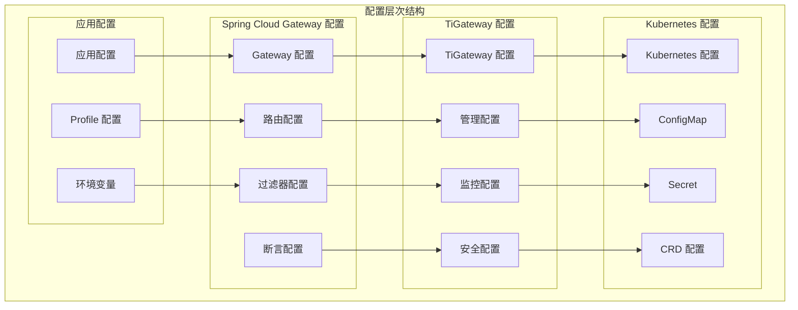

# 配置属性参考

TiGateway 配置属性参考提供了完整的配置选项说明，帮助您正确配置和调优 TiGateway 的各个方面。

## 配置属性概述

### 配置层次结构



## 基础配置属性

### 1. 应用配置

```yaml
# application.yml
spring:
  application:
    name: tigateway
  
  profiles:
    active: dev
  
  cloud:
    gateway:
      # 基础配置
      enabled: true
      default-filters:
        - name: AddRequestHeader
          args:
            name: X-Gateway-Name
            value: TiGateway
      
      # 路由配置
      routes:
        - id: user-service
          uri: lb://user-service
          predicates:
            - Path=/api/users/**
          filters:
            - name: AddRequestHeader
              args:
                name: X-Service-Name
                value: user-service
            - name: CircuitBreaker
              args:
                name: user-service-cb
                fallbackUri: forward:/fallback/user-service
      
      # HTTP 客户端配置
      httpclient:
        connect-timeout: 5000
        response-timeout: 10000
        pool:
          max-connections: 1000
          max-idle-time: 30s
          max-life-time: 60s
          pending-acquire-timeout: 60s
        wiretap: false
        compression: true
      
      # 负载均衡配置
      loadbalancer:
        enabled: true
        health-check:
          enabled: true
          interval: 30s
          timeout: 5s
          path: /health
        retry:
          enabled: true
          max-attempts: 3
          retry-on-all-operations: false
          retry-on-status-codes: 502, 503, 504
        cache:
          enabled: true
          ttl: 30s
          capacity: 1000
```

### 2. 服务器配置

```yaml
# 服务器配置
server:
  port: 8080
  
  # Tomcat 配置
  tomcat:
    threads:
      max: 200
      min-spare: 10
    max-connections: 10000
    accept-count: 1000
    connection-timeout: 20000
    max-http-post-size: 2MB
    max-http-header-size: 8KB
    compression:
      enabled: true
      mime-types: text/html,text/xml,text/plain,text/css,text/javascript,application/javascript,application/json
      min-response-size: 1024
  
  # 错误页面配置
  error:
    include-stacktrace: on_param
    include-message: always
    include-binding-errors: always
    include-exception: false
    path: /error
```

## TiGateway 核心配置

### 1. 基础配置

```yaml
# TiGateway 基础配置
tigateway:
  # 基础信息
  name: TiGateway
  version: 1.0.0
  description: Kubernetes Native API Gateway
  
  # 端口配置
  ports:
    gateway: 8080
    admin: 8081
    management: 8090
  
  # 环境配置
  environment:
    name: ${SPRING_PROFILES_ACTIVE:dev}
    region: ${TIGATEWAY_REGION:default}
    zone: ${TIGATEWAY_ZONE:default}
  
  # 集群配置
  cluster:
    enabled: true
    name: ${TIGATEWAY_CLUSTER_NAME:tigateway-cluster}
    node-id: ${HOSTNAME:default}
    discovery:
      enabled: true
      interval: 30s
      timeout: 10s
```

### 2. 管理配置

```yaml
# 管理配置
tigateway:
  admin:
    # 管理服务器配置
    server:
      enabled: true
      port: 8081
      context-path: /admin
      servlet:
        context-path: /admin
    
    # 认证配置
    auth:
      enabled: true
      type: jwt
      jwt:
        secret: ${TIGATEWAY_JWT_SECRET:tigateway-secret}
        expiration: 3600000
        issuer: tigateway
        audience: tigateway-admin
    
    # 权限配置
    security:
      enabled: true
      default-role: admin
      roles:
        - name: admin
          permissions:
            - "*"
        - name: operator
          permissions:
            - "route:read"
            - "route:write"
            - "filter:read"
            - "filter:write"
            - "config:read"
            - "config:write"
        - name: viewer
          permissions:
            - "route:read"
            - "filter:read"
            - "config:read"
            - "metrics:read"
    
    # API 配置
    api:
      enabled: true
      version: v1
      base-path: /api/v1
      cors:
        enabled: true
        allowed-origins: "*"
        allowed-methods: "GET,POST,PUT,DELETE,OPTIONS"
        allowed-headers: "*"
        allow-credentials: true
        max-age: 3600
```

### 3. 监控配置

```yaml
# 监控配置
tigateway:
  monitoring:
    # 指标配置
    metrics:
      enabled: true
      export:
        prometheus:
          enabled: true
          endpoint: /actuator/prometheus
        jmx:
          enabled: true
        influx:
          enabled: false
          url: http://localhost:8086
          database: tigateway
          username: admin
          password: admin
    
    # 健康检查配置
    health:
      enabled: true
      show-details: always
      show-components: always
      probes:
        enabled: true
      defaults:
        enabled: true
      diskspace:
        enabled: true
        threshold: 100MB
      db:
        enabled: true
      redis:
        enabled: true
      circuitbreakers:
        enabled: true
    
    # 链路追踪配置
    tracing:
      enabled: true
      type: brave
      sampling:
        probability: 0.1
      zipkin:
        endpoint: http://localhost:9411/api/v2/spans
      jaeger:
        endpoint: http://localhost:14268/api/traces
      tags:
        application: tigateway
        version: 1.0.0
        environment: ${SPRING_PROFILES_ACTIVE:dev}
```

## 安全配置属性

### 1. 认证配置

```yaml
# 认证配置
tigateway:
  security:
    # 认证配置
    authentication:
      enabled: true
      default-strategy: jwt
      
      # JWT 认证
      jwt:
        enabled: true
        secret: ${TIGATEWAY_JWT_SECRET:tigateway-secret}
        expiration: 3600000
        refresh-expiration: 86400000
        issuer: tigateway
        audience: tigateway-api
        algorithm: HS256
        header-name: Authorization
        header-prefix: Bearer
        clock-skew: 300
        require-issuer: true
        require-audience: true
        require-expiration: true
        require-not-before: true
      
      # OAuth2 认证
      oauth2:
        enabled: false
        client-id: ${OAUTH2_CLIENT_ID:}
        client-secret: ${OAUTH2_CLIENT_SECRET:}
        authorization-uri: ${OAUTH2_AUTHORIZATION_URI:}
        token-uri: ${OAUTH2_TOKEN_URI:}
        user-info-uri: ${OAUTH2_USER_INFO_URI:}
        scope: read,write
        redirect-uri: ${OAUTH2_REDIRECT_URI:}
      
      # LDAP 认证
      ldap:
        enabled: false
        url: ${LDAP_URL:}
        base-dn: ${LDAP_BASE_DN:}
        user-dn-pattern: ${LDAP_USER_DN_PATTERN:}
        group-search-base: ${LDAP_GROUP_SEARCH_BASE:}
        group-search-filter: ${LDAP_GROUP_SEARCH_FILTER:}
        manager-dn: ${LDAP_MANAGER_DN:}
        manager-password: ${LDAP_MANAGER_PASSWORD:}
    
    # 授权配置
    authorization:
      enabled: true
      default-strategy: rbac
      
      # RBAC 授权
      rbac:
        enabled: true
        default-role: user
        role-hierarchy:
          admin: [operator, viewer]
          operator: [viewer]
          viewer: []
        permission-separator: ":"
        case-sensitive: false
      
      # 策略授权
      policy:
        enabled: false
        engine: spel
        default-policy: deny
        policies:
          - name: admin-policy
            expression: "hasRole('ADMIN')"
            description: "Admin access policy"
          - name: user-policy
            expression: "hasRole('USER') and hasPermission('read')"
            description: "User read access policy"
    
    # 加密配置
    encryption:
      enabled: true
      algorithm: AES
      key: ${TIGATEWAY_ENCRYPTION_KEY:}
      key-size: 256
      mode: GCM
      padding: NoPadding
      iv-size: 12
      tag-size: 16
```

### 2. 网络安全配置

```yaml
# 网络安全配置
tigateway:
  security:
    network:
      # TLS 配置
      tls:
        enabled: true
        version: TLSv1.2
        ciphers:
          - ECDHE-RSA-AES128-GCM-SHA256
          - ECDHE-RSA-AES256-GCM-SHA384
          - ECDHE-RSA-AES128-SHA256
          - ECDHE-RSA-AES256-SHA384
        protocols:
          - TLSv1.2
          - TLSv1.3
        client-auth: none
        trust-store: ${TLS_TRUST_STORE:}
        trust-store-password: ${TLS_TRUST_STORE_PASSWORD:}
        key-store: ${TLS_KEY_STORE:}
        key-store-password: ${TLS_KEY_STORE_PASSWORD:}
        key-alias: ${TLS_KEY_ALIAS:}
      
      # 防火墙配置
      firewall:
        enabled: true
        allowed-ports:
          - 8080
          - 8081
          - 8090
        denied-ports:
          - 22
          - 3306
          - 5432
        allowed-ips:
          - 10.0.0.0/8
          - 172.16.0.0/12
          - 192.168.0.0/16
        denied-ips:
          - 0.0.0.0/0
          - 127.0.0.1
      
      # DDoS 防护
      ddos:
        enabled: true
        threshold: 1000
        window: 60s
        block-duration: 300s
        whitelist:
          - 10.0.0.0/8
          - 172.16.0.0/12
          - 192.168.0.0/16
```

## 限流和熔断配置

### 1. 限流配置

```yaml
# 限流配置
tigateway:
  rate-limiting:
    # 全局限流配置
    global:
      enabled: true
      default-rate: 1000
      default-period: 60s
      default-strategy: token-bucket
    
    # 限流器配置
    limiters:
      # 令牌桶限流器
      token-bucket:
        enabled: true
        default-capacity: 1000
        default-refill-rate: 100
        default-refill-period: 1s
        key-resolver: ip
        storage: redis
        redis:
          key-prefix: "tigateway:rate:limit"
          ttl: 3600s
      
      # 滑动窗口限流器
      sliding-window:
        enabled: true
        default-window-size: 1000
        default-window-duration: 60s
        key-resolver: ip
        storage: redis
        redis:
          key-prefix: "tigateway:sliding:window"
          ttl: 3600s
      
      # 固定窗口限流器
      fixed-window:
        enabled: true
        default-window-size: 1000
        default-window-duration: 60s
        key-resolver: ip
        storage: redis
        redis:
          key-prefix: "tigateway:fixed:window"
          ttl: 3600s
    
    # 键解析器配置
    key-resolvers:
      ip:
        enabled: true
        header-names:
          - X-Forwarded-For
          - X-Real-IP
      user:
        enabled: true
        header-name: X-User-Id
      path:
        enabled: true
        include-method: true
      composite:
        enabled: true
        resolvers:
          - ip
          - user
          - path
```

### 2. 熔断配置

```yaml
# 熔断配置
tigateway:
  circuit-breaker:
    # 全局熔断配置
    global:
      enabled: true
      default-failure-threshold: 50
      default-slow-call-threshold: 2000ms
      default-slow-call-rate-threshold: 50
      default-wait-duration: 60s
      default-permitted-calls: 10
      default-sliding-window-size: 100
      default-sliding-window-type: count
      default-minimum-number-of-calls: 10
    
    # 熔断器配置
    breakers:
      # 用户服务熔断器
      user-service:
        enabled: true
        failure-threshold: 50
        slow-call-threshold: 2000ms
        slow-call-rate-threshold: 50
        wait-duration: 60s
        permitted-calls: 10
        sliding-window-size: 100
        sliding-window-type: count
        minimum-number-of-calls: 10
        record-exceptions:
          - java.io.IOException
          - java.util.concurrent.TimeoutException
        ignore-exceptions:
          - java.lang.IllegalArgumentException
      
      # 订单服务熔断器
      order-service:
        enabled: true
        failure-threshold: 60
        slow-call-threshold: 3000ms
        slow-call-rate-threshold: 60
        wait-duration: 90s
        permitted-calls: 5
        sliding-window-size: 50
        sliding-window-type: time
        minimum-number-of-calls: 5
    
    # 降级配置
    fallback:
      enabled: true
      default-response:
        status: 503
        headers:
          Content-Type: application/json
        body: '{"error":"Service temporarily unavailable","message":"Circuit breaker is open"}'
      strategies:
        - name: default
          condition: "circuit-breaker-open"
          response:
            status: 503
            body: '{"error":"Service unavailable"}'
        - name: cached
          condition: "slow-response"
          response:
            status: 200
            body: '{"data":"cached","message":"Using cached response"}'
```

## 缓存配置属性

### 1. Redis 配置

```yaml
# Redis 配置
spring:
  redis:
    # 连接配置
    host: ${REDIS_HOST:localhost}
    port: ${REDIS_PORT:6379}
    password: ${REDIS_PASSWORD:}
    database: ${REDIS_DATABASE:0}
    timeout: 2000ms
    
    # 连接池配置
    lettuce:
      pool:
        max-active: 20
        max-idle: 10
        min-idle: 5
        max-wait: 2000ms
      shutdown-timeout: 100ms
    
    # 序列化配置
    serialization:
      key-serializer: "org.springframework.data.redis.serializer.StringRedisSerializer"
      value-serializer: "org.springframework.data.redis.serializer.GenericJackson2JsonRedisSerializer"

# TiGateway 缓存配置
tigateway:
  cache:
    # 缓存配置
    enabled: true
    default-ttl: 1800s
    default-max-size: 10000
    
    # 缓存类型配置
    types:
      # 路由缓存
      routes:
        enabled: true
        ttl: 3600s
        max-size: 1000
        key-prefix: "tigateway:cache:routes"
      
      # 过滤器缓存
      filters:
        enabled: true
        ttl: 1800s
        max-size: 500
        key-prefix: "tigateway:cache:filters"
      
      # 用户缓存
      users:
        enabled: true
        ttl: 900s
        max-size: 10000
        key-prefix: "tigateway:cache:users"
      
      # 权限缓存
      permissions:
        enabled: true
        ttl: 1800s
        max-size: 5000
        key-prefix: "tigateway:cache:permissions"
    
    # 缓存策略
    strategy:
      # 写入策略
      write:
        mode: write-through
        async: false
      
      # 读取策略
      read:
        mode: read-through
        fallback: true
      
      # 失效策略
      eviction:
        mode: lru
        max-size: 10000
        ttl: 1800s
```

### 2. 本地缓存配置

```yaml
# 本地缓存配置
tigateway:
  cache:
    local:
      # 本地缓存配置
      enabled: true
      default-ttl: 300s
      default-max-size: 1000
      
      # 缓存类型配置
      types:
        # 配置缓存
        config:
          enabled: true
          ttl: 60s
          max-size: 100
          key-prefix: "local:config"
        
        # 会话缓存
        session:
          enabled: true
          ttl: 1800s
          max-size: 10000
          key-prefix: "local:session"
        
        # 令牌缓存
        token:
          enabled: true
          ttl: 3600s
          max-size: 5000
          key-prefix: "local:token"
      
      # 缓存策略
      strategy:
        # 写入策略
        write:
          mode: write-behind
          async: true
          batch-size: 100
          flush-interval: 5s
        
        # 读取策略
        read:
          mode: read-through
          fallback: true
        
        # 失效策略
        eviction:
          mode: lru
          max-size: 1000
          ttl: 300s
```

## 日志配置属性

### 1. 日志配置

```yaml
# 日志配置
logging:
  level:
    root: INFO
    com.tigateway: DEBUG
    org.springframework.cloud.gateway: DEBUG
    org.springframework.web.reactive: DEBUG
    reactor.netty: DEBUG
  
  pattern:
    console: "%d{yyyy-MM-dd HH:mm:ss.SSS} [%thread] %-5level %logger{36} - %msg%n"
    file: "%d{yyyy-MM-dd HH:mm:ss.SSS} [%thread] %-5level %logger{36} - %msg%n"
  
  file:
    name: logs/tigateway.log
    max-size: 100MB
    max-history: 30
    total-size-cap: 1GB
  
  logback:
    rollingpolicy:
      max-file-size: 100MB
      max-history: 30
      total-size-cap: 1GB

# TiGateway 日志配置
tigateway:
  logging:
    # 日志配置
    enabled: true
    level: INFO
    format: json
    
    # 日志输出配置
    output:
      console:
        enabled: true
        level: INFO
        format: json
      file:
        enabled: true
        level: DEBUG
        format: json
        path: logs/tigateway.log
        max-size: 100MB
        max-history: 30
      elasticsearch:
        enabled: false
        url: http://localhost:9200
        index: tigateway-logs
        type: log
        username: elastic
        password: elastic
    
    # 日志类型配置
    types:
      # 请求日志
      request:
        enabled: true
        level: INFO
        include-headers: true
        include-body: false
        max-body-size: 1024
        sensitive-headers:
          - Authorization
          - X-API-Key
          - Cookie
      
      # 业务日志
      business:
        enabled: true
        level: INFO
        include-context: true
        include-user: true
        include-request-id: true
      
      # 安全日志
      security:
        enabled: true
        level: WARN
        include-ip: true
        include-user: true
        include-action: true
        include-result: true
      
      # 性能日志
      performance:
        enabled: true
        level: INFO
        include-metrics: true
        include-timing: true
        threshold: 1000ms
```

### 2. 审计日志配置

```yaml
# 审计日志配置
tigateway:
  logging:
    audit:
      # 审计日志配置
      enabled: true
      level: INFO
      format: json
      
      # 审计事件配置
      events:
        # 认证事件
        authentication:
          enabled: true
          include-success: true
          include-failure: true
          include-details: true
        
        # 授权事件
        authorization:
          enabled: true
          include-success: true
          include-failure: true
          include-resource: true
          include-action: true
        
        # 数据访问事件
        data-access:
          enabled: true
          include-read: true
          include-write: true
          include-delete: true
          include-details: true
        
        # 配置变更事件
        configuration:
          enabled: true
          include-route: true
          include-filter: true
          include-global: true
          include-details: true
      
      # 审计存储配置
      storage:
        # 本地存储
        local:
          enabled: true
          path: logs/audit
          max-size: 100MB
          max-history: 90
        
        # 数据库存储
        database:
          enabled: false
          table: audit_logs
          retention: 365
        
        # 外部存储
        external:
          enabled: false
          endpoint: http://audit-service:8080/api/audit
          timeout: 5000ms
          retry-attempts: 3
```

## 数据库配置属性

### 1. 数据源配置

```yaml
# 数据源配置
spring:
  datasource:
    # 主数据源
    url: ${DATABASE_URL:jdbc:postgresql://localhost:5432/tigateway}
    username: ${DATABASE_USERNAME:tigateway}
    password: ${DATABASE_PASSWORD:tigateway}
    driver-class-name: org.postgresql.Driver
    
    # HikariCP 连接池配置
    hikari:
      # 连接池大小
      maximum-pool-size: 20
      minimum-idle: 5
      
      # 连接超时
      connection-timeout: 30000
      idle-timeout: 600000
      max-lifetime: 1800000
      
      # 性能优化
      leak-detection-threshold: 60000
      validation-timeout: 5000
      connection-test-query: "SELECT 1"
      
      # 其他配置
      auto-commit: true
      read-only: false
      transaction-isolation: "TRANSACTION_READ_COMMITTED"
      
      # 连接池名称
      pool-name: TiGatewayHikariCP
      
      # 连接池属性
      data-source-properties:
        cachePrepStmts: true
        prepStmtCacheSize: 250
        prepStmtCacheSqlLimit: 2048
        useServerPrepStmts: true
        useLocalSessionState: true
        rewriteBatchedStatements: true
        cacheResultSetMetadata: true
        cacheServerConfiguration: true
        elideSetAutoCommits: true
        maintainTimeStats: false

# TiGateway 数据库配置
tigateway:
  database:
    # 数据库配置
    enabled: true
    type: postgresql
    schema: public
    
    # 连接配置
    connection:
      max-pool-size: 20
      min-pool-size: 5
      connection-timeout: 30000
      idle-timeout: 600000
      max-lifetime: 1800000
    
    # 事务配置
    transaction:
      enabled: true
      isolation-level: read_committed
      timeout: 30
      rollback-on-exception: true
    
    # 迁移配置
    migration:
      enabled: true
      locations: classpath:db/migration
      baseline-on-migrate: true
      validate-on-migrate: true
      out-of-order: false
      clean-disabled: true
```

### 2. JPA 配置

```yaml
# JPA 配置
spring:
  jpa:
    # 数据库配置
    database: postgresql
    database-platform: org.hibernate.dialect.PostgreSQLDialect
    show-sql: false
    properties:
      hibernate:
        format_sql: true
        use_sql_comments: true
        jdbc:
          batch_size: 20
          batch_versioned_data: true
        order_inserts: true
        order_updates: true
        batch_fetch_style: dynamic
        connection:
          provider_disables_autocommit: true
        cache:
          use_second_level_cache: true
          use_query_cache: true
          region:
            factory_class: org.hibernate.cache.jcache.JCacheRegionFactory
    hibernate:
      ddl-auto: validate
      naming:
        physical-strategy: org.hibernate.boot.model.naming.PhysicalNamingStrategyStandardImpl
        implicit-strategy: org.hibernate.boot.model.naming.ImplicitNamingStrategyLegacyJpaImpl
    open-in-view: false
    defer-datasource-initialization: true

# TiGateway JPA 配置
tigateway:
  jpa:
    # JPA 配置
    enabled: true
    show-sql: false
    format-sql: true
    
    # 缓存配置
    cache:
      enabled: true
      second-level-cache: true
      query-cache: true
      region-factory: jcache
    
    # 批量配置
    batch:
      enabled: true
      size: 20
      versioned-data: true
      inserts: true
      updates: true
    
    # 连接配置
    connection:
      auto-commit: false
      provider-disables-autocommit: true
```

## 环境变量配置

### 1. 环境变量列表

```bash
# 基础环境变量
SPRING_PROFILES_ACTIVE=dev
TIGATEWAY_ENVIRONMENT=dev
TIGATEWAY_REGION=us-west-2
TIGATEWAY_ZONE=us-west-2a

# 数据库环境变量
DATABASE_URL=jdbc:postgresql://localhost:5432/tigateway
DATABASE_USERNAME=tigateway
DATABASE_PASSWORD=tigateway

# Redis 环境变量
REDIS_HOST=localhost
REDIS_PORT=6379
REDIS_PASSWORD=
REDIS_DATABASE=0

# 安全环境变量
TIGATEWAY_JWT_SECRET=your-jwt-secret
TIGATEWAY_ENCRYPTION_KEY=your-encryption-key
OAUTH2_CLIENT_ID=your-oauth2-client-id
OAUTH2_CLIENT_SECRET=your-oauth2-client-secret

# 监控环境变量
PROMETHEUS_ENDPOINT=http://localhost:9090
GRAFANA_ENDPOINT=http://localhost:3000
JAEGER_ENDPOINT=http://localhost:14268

# Kubernetes 环境变量
KUBERNETES_NAMESPACE=tigateway
KUBERNETES_SERVICE_ACCOUNT=tigateway
KUBERNETES_CONFIG_MAP=tigateway-config
```

### 2. 配置映射

```yaml
# 环境变量到配置属性的映射
tigateway:
  config:
    mapping:
      # 基础配置映射
      environment: ${TIGATEWAY_ENVIRONMENT:dev}
      region: ${TIGATEWAY_REGION:default}
      zone: ${TIGATEWAY_ZONE:default}
      
      # 数据库配置映射
      database:
        url: ${DATABASE_URL:jdbc:postgresql://localhost:5432/tigateway}
        username: ${DATABASE_USERNAME:tigateway}
        password: ${DATABASE_PASSWORD:tigateway}
      
      # Redis 配置映射
      redis:
        host: ${REDIS_HOST:localhost}
        port: ${REDIS_PORT:6379}
        password: ${REDIS_PASSWORD:}
        database: ${REDIS_DATABASE:0}
      
      # 安全配置映射
      security:
        jwt:
          secret: ${TIGATEWAY_JWT_SECRET:tigateway-secret}
        encryption:
          key: ${TIGATEWAY_ENCRYPTION_KEY:}
        oauth2:
          client-id: ${OAUTH2_CLIENT_ID:}
          client-secret: ${OAUTH2_CLIENT_SECRET:}
      
      # 监控配置映射
      monitoring:
        prometheus:
          endpoint: ${PROMETHEUS_ENDPOINT:http://localhost:9090}
        grafana:
          endpoint: ${GRAFANA_ENDPOINT:http://localhost:3000}
        jaeger:
          endpoint: ${JAEGER_ENDPOINT:http://localhost:14268}
      
      # Kubernetes 配置映射
      kubernetes:
        namespace: ${KUBERNETES_NAMESPACE:tigateway}
        service-account: ${KUBERNETES_SERVICE_ACCOUNT:tigateway}
        config-map: ${KUBERNETES_CONFIG_MAP:tigateway-config}
```

## 配置验证

### 1. 配置验证规则

```yaml
# 配置验证规则
tigateway:
  config:
    validation:
      # 验证配置
      enabled: true
      strict-mode: false
      fail-fast: true
      
      # 验证规则
      rules:
        # 基础配置验证
        - name: "environment"
          type: "string"
          required: true
          pattern: "^[a-zA-Z0-9_-]+$"
          message: "Environment must be alphanumeric with underscores and hyphens"
        
        # 端口配置验证
        - name: "ports.gateway"
          type: "integer"
          required: true
          min: 1024
          max: 65535
          message: "Gateway port must be between 1024 and 65535"
        
        # 数据库配置验证
        - name: "database.url"
          type: "string"
          required: true
          pattern: "^jdbc:[a-zA-Z0-9]+://.*$"
          message: "Database URL must be a valid JDBC URL"
        
        # Redis 配置验证
        - name: "redis.host"
          type: "string"
          required: true
          message: "Redis host is required"
        
        # 安全配置验证
        - name: "security.jwt.secret"
          type: "string"
          required: true
          min-length: 32
          message: "JWT secret must be at least 32 characters long"
        
        # 监控配置验证
        - name: "monitoring.metrics.enabled"
          type: "boolean"
          required: true
          message: "Metrics monitoring must be enabled or disabled"
      
      # 验证策略
      strategy:
        # 验证时机
        timing: "startup"
        
        # 验证级别
        level: "error"
        
        # 验证报告
        report:
          enabled: true
          format: "json"
          output: "console"
```

### 2. 配置验证实现

```java
/**
 * 配置验证器
 */
@Component
public class ConfigurationValidator {
    
    private final List<ValidationRule> rules;
    private final ValidationStrategy strategy;
    
    public ConfigurationValidator(List<ValidationRule> rules, ValidationStrategy strategy) {
        this.rules = rules;
        this.strategy = strategy;
    }
    
    public ValidationResult validate(ConfigurationProperties properties) {
        ValidationResult result = new ValidationResult();
        
        for (ValidationRule rule : rules) {
            try {
                ValidationResult ruleResult = rule.validate(properties);
                result.merge(ruleResult);
            } catch (Exception e) {
                result.addError(rule.getName(), "Validation error: " + e.getMessage());
            }
        }
        
        if (strategy.isFailFast() && result.hasErrors()) {
            throw new ConfigurationValidationException("Configuration validation failed", result);
        }
        
        return result;
    }
}
```

## 总结

TiGateway 配置属性参考提供了完整的配置选项说明：

1. **配置属性概述**: 配置层次结构和组织方式
2. **基础配置属性**: 应用配置和服务器配置
3. **TiGateway 核心配置**: 基础配置、管理配置和监控配置
4. **安全配置属性**: 认证配置和网络安全配置
5. **限流和熔断配置**: 限流配置和熔断配置
6. **缓存配置属性**: Redis 配置和本地缓存配置
7. **日志配置属性**: 日志配置和审计日志配置
8. **数据库配置属性**: 数据源配置和 JPA 配置
9. **环境变量配置**: 环境变量列表和配置映射
10. **配置验证**: 配置验证规则和验证实现

通过详细的配置属性参考，可以正确配置和调优 TiGateway 的各个方面，确保系统的高效运行和稳定性。
