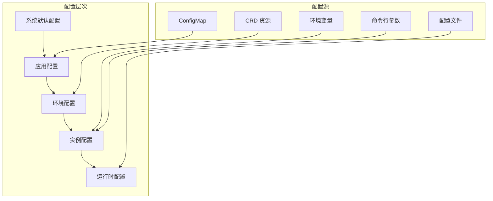
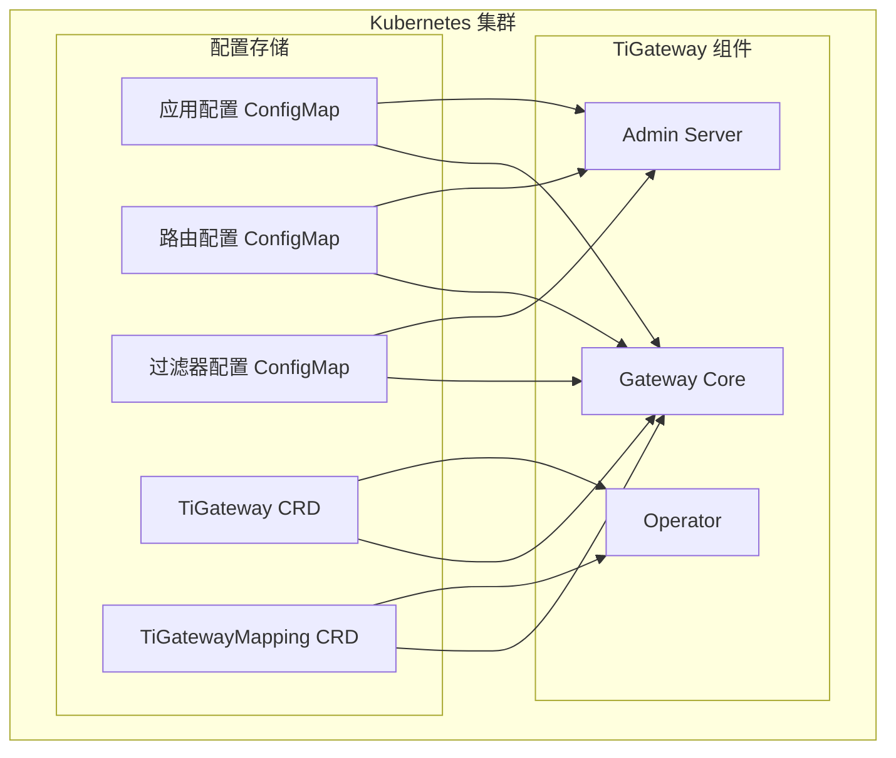

# 配置概述

TiGateway 的配置系统基于 Kubernetes 原生资源，提供了灵活、可扩展的配置管理方案。

## 配置架构

### 配置层次结构



### 配置存储架构



## 配置类型

### 1. 应用配置

应用配置包含 TiGateway 的核心设置：

```yaml
apiVersion: v1
kind: ConfigMap
metadata:
  name: tigateway-app-config
  namespace: tigateway
data:
  application.yml: |
    server:
      port: 8080
      servlet:
        context-path: /
    
    spring:
      application:
        name: tigateway
      cloud:
        gateway:
          discovery:
            locator:
              enabled: true
              lower-case-service-id: true
          httpclient:
            connect-timeout: 1000
            response-timeout: 5s
            pool:
              max-connections: 500
              max-idle-time: 30s
          metrics:
            enabled: true
            tags:
              application: tigateway
      
      security:
        oauth2:
          client:
            registration:
              gateway:
                client-id: tigateway
                client-secret: ${OAUTH2_CLIENT_SECRET}
                authorization-grant-type: client_credentials
                scope: read,write
            provider:
              gateway:
                token-uri: ${OAUTH2_TOKEN_URI}
    
    management:
      endpoints:
        web:
          exposure:
            include: health,info,metrics,prometheus,gateway
      endpoint:
        health:
          show-details: always
      metrics:
        export:
          prometheus:
            enabled: true
    
    logging:
      level:
        ti.gateway: INFO
        org.springframework.cloud.gateway: DEBUG
      pattern:
        console: "%d{yyyy-MM-dd HH:mm:ss} [%thread] %-5level %logger{36} - %msg%n"
```

### 2. 路由配置

路由配置定义请求转发规则：

```yaml
apiVersion: v1
kind: ConfigMap
metadata:
  name: tigateway-route-config
  namespace: tigateway
data:
  routes.yaml: |
    spring:
      cloud:
        gateway:
          routes:
          - id: user-service
            uri: lb://user-service
            predicates:
            - Path=/api/users/**
            filters:
            - StripPrefix=2
            - AddRequestHeader=X-Gateway, TiGateway
            - CircuitBreaker=user-service
            metadata:
              description: "用户服务路由"
              version: "v1"
              tags:
              - "user"
              - "api"
          
          - id: order-service
            uri: lb://order-service
            predicates:
            - Path=/api/orders/**
            filters:
            - StripPrefix=2
            - AddRequestHeader=X-Gateway, TiGateway
            - CircuitBreaker=order-service
            - Retry=3,INTERNAL_SERVER_ERROR,GET,10ms,50ms,2,false
            metadata:
              description: "订单服务路由"
              version: "v1"
              tags:
              - "order"
              - "api"
          
          - id: payment-service
            uri: lb://payment-service
            predicates:
            - Path=/api/payments/**
            - Method=POST,PUT
            filters:
            - StripPrefix=2
            - AddRequestHeader=X-Gateway, TiGateway
            - RequestRateLimiter=10,20,1,#{@userKeyResolver}
            metadata:
              description: "支付服务路由"
              version: "v1"
              tags:
              - "payment"
              - "api"
              - "secure"
```

### 3. 过滤器配置

过滤器配置定义全局过滤器：

```yaml
apiVersion: v1
kind: ConfigMap
metadata:
  name: tigateway-filter-config
  namespace: tigateway
data:
  filters.yaml: |
    spring:
      cloud:
        gateway:
          default-filters:
          - AddResponseHeader=X-Response-Default-Foo, Default-Bar
          - AddResponseHeader=X-Response-Time, ${response.time}
          - DedupeResponseHeader=Access-Control-Allow-Credentials Access-Control-Allow-Origin
          
          filter:
            request-rate-limiter:
              deny-empty-key: false
              empty-key-status-code: 429
              key-resolver: "#{@userKeyResolver}"
            
            secure-headers:
              xss-protection-header: "1; mode=block"
              strict-transport-security: "max-age=631138519"
              frame-options: "DENY"
              content-type-options: "nosniff"
              referrer-policy: "no-referrer"
              content-security-policy: "default-src 'self' https:; font-src 'self' https: data:; img-src 'self' https: data:; object-src 'none'; script-src https:; style-src 'self' https: 'unsafe-inline'"
              download-options: "noopen"
              permitted-cross-domain-policies: "none"
            
            circuit-breaker:
              name: default-circuit-breaker
              fallback-uri: forward:/fallback
              status-codes:
              - 500
              - "BAD_GATEWAY"
              - "SERVICE_UNAVAILABLE"
```

### 4. 监控配置

监控配置定义指标和健康检查：

```yaml
apiVersion: v1
kind: ConfigMap
metadata:
  name: tigateway-monitoring-config
  namespace: tigateway
data:
  monitoring.yml: |
    management:
      endpoints:
        web:
          exposure:
            include: "*"
          base-path: /actuator
      
      endpoint:
        health:
          show-details: always
          show-components: always
          probes:
            enabled: true
        info:
          enabled: true
        metrics:
          enabled: true
        prometheus:
          enabled: true
        gateway:
          enabled: true
      
      health:
        defaults:
          enabled: true
        circuitbreakers:
          enabled: true
        diskspace:
          enabled: true
        redis:
          enabled: true
        db:
          enabled: true
      
      metrics:
        export:
          prometheus:
            enabled: true
            step: 10s
            descriptions: true
        distribution:
          percentiles-histogram:
            http.server.requests: true
          percentiles:
            http.server.requests: 0.5, 0.9, 0.95, 0.99
          slo:
            http.server.requests: 50ms, 100ms, 200ms, 500ms
      
      tracing:
        sampling:
          probability: 1.0
        zipkin:
          endpoint: http://zipkin:9411/api/v2/spans
```

## 配置管理

### 1. 配置加载

TiGateway 支持多种配置加载方式：

```java
@Configuration
@EnableConfigurationProperties
public class TiGatewayConfiguration {
    
    @Bean
    @ConfigurationProperties("spring.cloud.gateway")
    public GatewayProperties gatewayProperties() {
        return new GatewayProperties();
    }
    
    @Bean
    public RouteDefinitionLocator routeDefinitionLocator() {
        return new ConfigMapRouteDefinitionLocator(
            kubernetesClient,
            configMapName,
            configMapNamespace
        );
    }
    
    @Bean
    public ConfigMapWatcher configMapWatcher() {
        return new ConfigMapWatcher(
            kubernetesClient,
            configMapName,
            configMapNamespace
        );
    }
}
```

### 2. 配置热更新

```java
@Component
public class ConfigMapWatcher {
    
    private final KubernetesClient kubernetesClient;
    private final String configMapName;
    private final String configMapNamespace;
    private final ApplicationEventPublisher eventPublisher;
    
    @EventListener
    public void handleConfigMapChange(ConfigMapChangeEvent event) {
        log.info("ConfigMap changed: {}", event.getConfigMapName());
        
        // 验证配置
        if (validateConfiguration(event.getConfigMap())) {
            // 发布配置变更事件
            eventPublisher.publishEvent(new ConfigurationChangeEvent(event.getConfigMap()));
        } else {
            log.error("Invalid configuration in ConfigMap: {}", event.getConfigMapName());
        }
    }
    
    private boolean validateConfiguration(ConfigMap configMap) {
        // 使用 YAML Schema 验证配置
        return yamlSchemaValidator.validate(configMap.getData());
    }
}
```

### 3. 配置验证

```java
@Component
public class ConfigurationValidator {
    
    @Autowired
    private YamlSchemaValidator schemaValidator;
    
    public ValidationResult validateConfiguration(String config) {
        ValidationResult result = new ValidationResult();
        
        try {
            // 验证 YAML 语法
            Yaml yaml = new Yaml();
            Object data = yaml.load(config);
            
            // 验证 Schema
            schemaValidator.validate(data);
            
            // 验证业务逻辑
            validateBusinessLogic(data);
            
            result.setValid(true);
            result.setMessage("配置验证通过");
        } catch (Exception e) {
            result.setValid(false);
            result.setMessage("配置验证失败: " + e.getMessage());
        }
        
        return result;
    }
    
    private void validateBusinessLogic(Object data) {
        // 验证业务逻辑
        Map<String, Object> config = (Map<String, Object>) data;
        Map<String, Object> spring = (Map<String, Object>) config.get("spring");
        Map<String, Object> cloud = (Map<String, Object>) spring.get("cloud");
        Map<String, Object> gateway = (Map<String, Object>) cloud.get("gateway");
        
        // 验证路由配置
        List<Map<String, Object>> routes = (List<Map<String, Object>>) gateway.get("routes");
        if (routes != null) {
            validateRoutes(routes);
        }
        
        // 验证过滤器配置
        List<Map<String, Object>> filters = (List<Map<String, Object>>) gateway.get("default-filters");
        if (filters != null) {
            validateFilters(filters);
        }
    }
    
    private void validateRoutes(List<Map<String, Object>> routes) {
        Set<String> routeIds = new HashSet<>();
        for (Map<String, Object> route : routes) {
            String id = (String) route.get("id");
            if (routeIds.contains(id)) {
                throw new IllegalArgumentException("重复的路由 ID: " + id);
            }
            routeIds.add(id);
            
            // 验证路由配置
            validateRoute(route);
        }
    }
    
    private void validateRoute(Map<String, Object> route) {
        // 验证必需字段
        if (!route.containsKey("id") || !route.containsKey("uri") || !route.containsKey("predicates")) {
            throw new IllegalArgumentException("路由配置缺少必需字段");
        }
        
        // 验证 URI 格式
        String uri = (String) route.get("uri");
        if (!uri.matches("^(https?|lb)://.*")) {
            throw new IllegalArgumentException("无效的 URI 格式: " + uri);
        }
        
        // 验证谓词配置
        List<Map<String, Object>> predicates = (List<Map<String, Object>>) route.get("predicates");
        if (predicates == null || predicates.isEmpty()) {
            throw new IllegalArgumentException("路由必须至少有一个谓词");
        }
    }
}
```

## 环境配置

### 1. 开发环境

```yaml
apiVersion: v1
kind: ConfigMap
metadata:
  name: tigateway-dev-config
  namespace: tigateway-dev
data:
  application-dev.yml: |
    server:
      port: 8080
    
    spring:
      cloud:
        gateway:
          discovery:
            locator:
              enabled: true
          httpclient:
            connect-timeout: 5000
            response-timeout: 30s
    
    logging:
      level:
        ti.gateway: DEBUG
        org.springframework.cloud.gateway: TRACE
```

### 2. 测试环境

```yaml
apiVersion: v1
kind: ConfigMap
metadata:
  name: tigateway-test-config
  namespace: tigateway-test
data:
  application-test.yml: |
    server:
      port: 8080
    
    spring:
      cloud:
        gateway:
          discovery:
            locator:
              enabled: true
          httpclient:
            connect-timeout: 3000
            response-timeout: 20s
    
    logging:
      level:
        ti.gateway: INFO
        org.springframework.cloud.gateway: DEBUG
```

### 3. 生产环境

```yaml
apiVersion: v1
kind: ConfigMap
metadata:
  name: tigateway-prod-config
  namespace: tigateway-prod
data:
  application-prod.yml: |
    server:
      port: 8080
    
    spring:
      cloud:
        gateway:
          discovery:
            locator:
              enabled: true
          httpclient:
            connect-timeout: 1000
            response-timeout: 5s
            pool:
              max-connections: 1000
              max-idle-time: 30s
    
    logging:
      level:
        ti.gateway: WARN
        org.springframework.cloud.gateway: INFO
```

## 配置安全

### 1. 敏感信息管理

使用 Kubernetes Secret 存储敏感信息：

```yaml
apiVersion: v1
kind: Secret
metadata:
  name: tigateway-secrets
  namespace: tigateway
type: Opaque
data:
  oauth2-client-secret: <base64-encoded-secret>
  database-password: <base64-encoded-password>
  jwt-secret: <base64-encoded-jwt-secret>
```

### 2. 配置加密

```java
@Component
public class ConfigurationEncryption {
    
    @Value("${spring.cloud.gateway.encryption.key}")
    private String encryptionKey;
    
    public String encrypt(String plainText) {
        // 使用 AES 加密
        return aesEncryption.encrypt(plainText, encryptionKey);
    }
    
    public String decrypt(String encryptedText) {
        // 使用 AES 解密
        return aesEncryption.decrypt(encryptedText, encryptionKey);
    }
}
```

### 3. 配置访问控制

```yaml
apiVersion: rbac.authorization.k8s.io/v1
kind: Role
metadata:
  name: tigateway-config-manager
  namespace: tigateway
rules:
- apiGroups: [""]
  resources: ["configmaps"]
  verbs: ["get", "list", "watch"]
- apiGroups: [""]
  resources: ["configmaps"]
  resourceNames: ["tigateway-*"]
  verbs: ["update", "patch"]
```

## 配置监控

### 1. 配置变更监控

```java
@Component
public class ConfigurationMonitor {
    
    private final MeterRegistry meterRegistry;
    private final Counter configChangeCounter;
    
    public ConfigurationMonitor(MeterRegistry meterRegistry) {
        this.meterRegistry = meterRegistry;
        this.configChangeCounter = Counter.builder("tigateway.config.changes")
            .description("Configuration change count")
            .register(meterRegistry);
    }
    
    @EventListener
    public void handleConfigurationChange(ConfigurationChangeEvent event) {
        configChangeCounter.increment(
            Tags.of(
                "configmap", event.getConfigMapName(),
                "namespace", event.getNamespace()
            )
        );
    }
}
```

### 2. 配置健康检查

```java
@Component
public class ConfigurationHealthIndicator implements HealthIndicator {
    
    @Autowired
    private ConfigurationValidator configurationValidator;
    
    @Override
    public Health health() {
        try {
            // 检查配置有效性
            ValidationResult result = configurationValidator.validateCurrentConfiguration();
            
            if (result.isValid()) {
                return Health.up()
                    .withDetail("configuration", "valid")
                    .withDetail("lastCheck", Instant.now())
                    .build();
            } else {
                return Health.down()
                    .withDetail("configuration", "invalid")
                    .withDetail("error", result.getMessage())
                    .build();
            }
        } catch (Exception e) {
            return Health.down()
                .withDetail("configuration", "error")
                .withDetail("exception", e.getMessage())
                .build();
        }
    }
}
```

## 配置最佳实践

### 1. 配置分层

```yaml
# 基础配置
spring:
  cloud:
    gateway:
      discovery:
        locator:
          enabled: true

# 环境特定配置
spring:
  profiles:
    active: ${SPRING_PROFILES_ACTIVE:dev}
  cloud:
    gateway:
      httpclient:
        connect-timeout: ${GATEWAY_CONNECT_TIMEOUT:1000}
        response-timeout: ${GATEWAY_RESPONSE_TIMEOUT:5s}
```

### 2. 配置验证

```yaml
# 使用 Schema 验证
spring:
  cloud:
    gateway:
      routes:
      - id: validated-route
        uri: lb://validated-service
        predicates:
        - Path=/api/validated/**
        # 配置会被 Schema 验证
```

### 3. 配置文档化

```yaml
# 配置文档化
spring:
  cloud:
    gateway:
      routes:
      - id: documented-route
        uri: lb://documented-service
        predicates:
        - Path=/api/documented/**
        metadata:
          description: "文档化的路由配置"
          version: "v1"
          owner: "team-a"
          tags:
          - "api"
          - "documented"
```

## 总结

TiGateway 的配置系统提供了灵活、可扩展的配置管理方案：

1. **多种配置类型**: 支持应用、路由、过滤器、监控等多种配置
2. **Kubernetes 原生**: 基于 ConfigMap 和 CRD 的配置存储
3. **配置热更新**: 支持配置的实时更新和验证
4. **配置验证**: 提供 YAML Schema 和业务逻辑验证
5. **环境管理**: 支持多环境配置管理
6. **配置安全**: 支持敏感信息加密和访问控制
7. **配置监控**: 提供配置变更监控和健康检查
8. **最佳实践**: 遵循配置分层、验证和文档化原则

这些功能使得 TiGateway 能够灵活地管理各种配置需求，为微服务架构提供可靠的配置管理服务。
