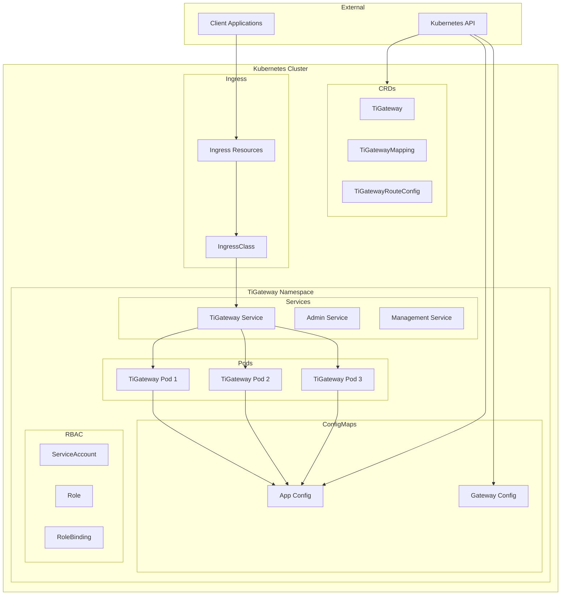

# Kubernetes 部署指南

## 概述

TiGateway 专为 Kubernetes 环境设计，支持原生 Kubernetes 部署方式，包括 Deployment、Service、ConfigMap、RBAC 等资源。

## 部署架构



## 部署方式

### 方式一：使用 Helm (推荐)

#### 1. 安装 CRDs
```bash
# 添加 Helm 仓库 (如果有)
helm repo add tigateway https://charts.tigateway.cn
helm repo update

# 安装 CRDs
helm install tigateway-crds ./helm/tigateway-crds
```

#### 2. 部署 Gateway
```bash
# 使用默认配置部署
helm install tigateway ./helm/gateway

# 使用自定义配置部署
helm install tigateway ./helm/gateway \
  --set replicaCount=3 \
  --set image.tag=1.0.0 \
  --set service.type=LoadBalancer
```

#### 3. 验证部署
```bash
# 检查 Helm 发布状态
helm list
helm status tigateway

# 检查 Pod 状态
kubectl get pods -l app=tigateway

# 检查服务状态
kubectl get svc tigateway
```

### 方式二：直接使用 YAML

#### 1. 创建命名空间
```yaml
apiVersion: v1
kind: Namespace
metadata:
  name: tigateway
  labels:
    name: tigateway
```

#### 2. 创建 ConfigMap
```yaml
apiVersion: v1
kind: ConfigMap
metadata:
  name: tigateway-config
  namespace: tigateway
data:
  application.yml: |
    spring:
      cloud:
        gateway:
          routes:
            - id: test-route
              uri: https://httpbin.org
              predicates:
                - Path=/test/**
              filters:
                - StripPrefix=1
    admin:
      server:
        enabled: true
        port: 8081
    management:
      server:
        port: 8090
      endpoints:
        web:
          exposure:
            include: "*"
```

#### 3. 创建 ServiceAccount 和 RBAC
```yaml
apiVersion: v1
kind: ServiceAccount
metadata:
  name: tigateway
  namespace: tigateway
---
apiVersion: rbac.authorization.k8s.io/v1
kind: Role
metadata:
  name: tigateway-role
  namespace: tigateway
rules:
  - apiGroups: [""]
    resources: ["configmaps", "services", "endpoints", "pods"]
    verbs: ["get", "list", "watch"]
  - apiGroups: ["networking.k8s.io"]
    resources: ["ingresses"]
    verbs: ["get", "list", "watch"]
  - apiGroups: ["tigateway.cn"]
    resources: ["*"]
    verbs: ["get", "list", "watch", "create", "update", "patch", "delete"]
---
apiVersion: rbac.authorization.k8s.io/v1
kind: RoleBinding
metadata:
  name: tigateway-role-binding
  namespace: tigateway
subjects:
  - kind: ServiceAccount
    name: tigateway
    namespace: tigateway
roleRef:
  kind: Role
  name: tigateway-role
  apiGroup: rbac.authorization.k8s.io
```

#### 4. 创建 Deployment
```yaml
apiVersion: apps/v1
kind: Deployment
metadata:
  name: tigateway
  namespace: tigateway
  labels:
    app: tigateway
spec:
  replicas: 3
  selector:
    matchLabels:
      app: tigateway
  template:
    metadata:
      labels:
        app: tigateway
    spec:
      serviceAccountName: tigateway
      containers:
      - name: tigateway
        image: tigateway:latest
        ports:
        - containerPort: 8080
          name: gateway
        - containerPort: 8081
          name: admin
        - containerPort: 8090
          name: management
        env:
        - name: SPRING_PROFILES_ACTIVE
          value: "kubernetes"
        - name: SPRING_CLOUD_KUBERNETES_DISCOVERY_ENABLED
          value: "true"
        - name: SPRING_CLOUD_KUBERNETES_CONFIG_ENABLED
          value: "true"
        volumeMounts:
        - name: config
          mountPath: /app/config
        livenessProbe:
          httpGet:
            path: /actuator/health/liveness
            port: 8090
          initialDelaySeconds: 60
          periodSeconds: 10
        readinessProbe:
          httpGet:
            path: /actuator/health/readiness
            port: 8090
          initialDelaySeconds: 30
          periodSeconds: 5
        resources:
          requests:
            memory: "512Mi"
            cpu: "250m"
          limits:
            memory: "1Gi"
            cpu: "500m"
      volumes:
      - name: config
        configMap:
          name: tigateway-config
```

#### 5. 创建 Service
```yaml
apiVersion: v1
kind: Service
metadata:
  name: tigateway
  namespace: tigateway
  labels:
    app: tigateway
spec:
  type: ClusterIP
  ports:
  - port: 8080
    targetPort: 8080
    name: gateway
  - port: 8081
    targetPort: 8081
    name: admin
  - port: 8090
    targetPort: 8090
    name: management
  selector:
    app: tigateway
---
apiVersion: v1
kind: Service
metadata:
  name: tigateway-admin
  namespace: tigateway
  labels:
    app: tigateway
    component: admin
spec:
  type: ClusterIP
  ports:
  - port: 8081
    targetPort: 8081
    name: admin
  selector:
    app: tigateway
---
apiVersion: v1
kind: Service
metadata:
  name: tigateway-management
  namespace: tigateway
  labels:
    app: tigateway
    component: management
spec:
  type: ClusterIP
  ports:
  - port: 8090
    targetPort: 8090
    name: management
  selector:
    app: tigateway
```

## 配置管理

### 环境变量配置
```yaml
env:
- name: SPRING_PROFILES_ACTIVE
  value: "kubernetes"
- name: SPRING_CLOUD_KUBERNETES_DISCOVERY_ENABLED
  value: "true"
- name: SPRING_CLOUD_KUBERNETES_CONFIG_ENABLED
  value: "true"
- name: ADMIN_SERVER_ENABLED
  value: "true"
- name: MANAGEMENT_SERVER_PORT
  value: "8090"
```

### ConfigMap 配置
```yaml
apiVersion: v1
kind: ConfigMap
metadata:
  name: tigateway-app-config
  namespace: tigateway
data:
  application.yml: |
    spring:
      cloud:
        gateway:
          kubernetes:
            ingress:
              enabled: true
              namespace: default
              refresh-interval: 30
          storage:
            configmap:
              enabled: true
              name: tigateway-app-config
              namespace: tigateway
      kubernetes:
        discovery:
          enabled: true
        config:
          enabled: true
    
    admin:
      server:
        enabled: true
        port: 8081
        context-path: /admin
    
    management:
      server:
        port: 8090
      endpoints:
        web:
          exposure:
            include: "*"
      endpoint:
        health:
          show-details: when_authorized
```

### Secret 配置
```yaml
apiVersion: v1
kind: Secret
metadata:
  name: tigateway-secrets
  namespace: tigateway
type: Opaque
data:
  # Base64 编码的配置
  sso-client-secret: <base64-encoded-secret>
  database-password: <base64-encoded-password>
```

## 服务暴露

### 方式一：LoadBalancer
```yaml
apiVersion: v1
kind: Service
metadata:
  name: tigateway-lb
  namespace: tigateway
spec:
  type: LoadBalancer
  ports:
  - port: 80
    targetPort: 8080
    name: gateway
  - port: 8081
    targetPort: 8081
    name: admin
  - port: 8090
    targetPort: 8090
    name: management
  selector:
    app: tigateway
```

### 方式二：NodePort
```yaml
apiVersion: v1
kind: Service
metadata:
  name: tigateway-np
  namespace: tigateway
spec:
  type: NodePort
  ports:
  - port: 8080
    targetPort: 8080
    nodePort: 30080
    name: gateway
  - port: 8081
    targetPort: 8081
    nodePort: 30081
    name: admin
  - port: 8090
    targetPort: 8090
    nodePort: 30090
    name: management
  selector:
    app: tigateway
```

### 方式三：Ingress
```yaml
apiVersion: networking.k8s.io/v1
kind: Ingress
metadata:
  name: tigateway-ingress
  namespace: tigateway
  annotations:
    kubernetes.io/ingress.class: nginx
    nginx.ingress.kubernetes.io/rewrite-target: /
spec:
  rules:
  - host: gateway.example.com
    http:
      paths:
      - path: /
        pathType: Prefix
        backend:
          service:
            name: tigateway
            port:
              number: 8080
  - host: admin.example.com
    http:
      paths:
      - path: /
        pathType: Prefix
        backend:
          service:
            name: tigateway
            port:
              number: 8081
  - host: management.example.com
    http:
      paths:
      - path: /
        pathType: Prefix
        backend:
          service:
            name: tigateway
            port:
              number: 8090
```

## 监控和日志

### Prometheus 监控
```yaml
apiVersion: v1
kind: Service
metadata:
  name: tigateway-metrics
  namespace: tigateway
  labels:
    app: tigateway
  annotations:
    prometheus.io/scrape: "true"
    prometheus.io/port: "8090"
    prometheus.io/path: "/actuator/prometheus"
spec:
  ports:
  - port: 8090
    targetPort: 8090
    name: metrics
  selector:
    app: tigateway
```

### 日志收集
```yaml
apiVersion: v1
kind: ConfigMap
metadata:
  name: tigateway-logging
  namespace: tigateway
data:
  logback-spring.xml: |
    <?xml version="1.0" encoding="UTF-8"?>
    <configuration>
      <include resource="org/springframework/boot/logging/logback/defaults.xml"/>
      <include resource="org/springframework/boot/logging/logback/console-appender.xml"/>
      
      <appender name="FILE" class="ch.qos.logback.core.rolling.RollingFileAppender">
        <file>/app/logs/tigateway.log</file>
        <rollingPolicy class="ch.qos.logback.core.rolling.TimeBasedRollingPolicy">
          <fileNamePattern>/app/logs/tigateway.%d{yyyy-MM-dd}.log</fileNamePattern>
          <maxHistory>30</maxHistory>
        </rollingPolicy>
        <encoder>
          <pattern>%d{yyyy-MM-dd HH:mm:ss.SSS} [%thread] %-5level %logger{36} - %msg%n</pattern>
        </encoder>
      </appender>
      
      <root level="INFO">
        <appender-ref ref="CONSOLE"/>
        <appender-ref ref="FILE"/>
      </root>
    </configuration>
```

## 高可用部署

### 多副本部署
```yaml
apiVersion: apps/v1
kind: Deployment
metadata:
  name: tigateway
  namespace: tigateway
spec:
  replicas: 3
  strategy:
    type: RollingUpdate
    rollingUpdate:
      maxSurge: 1
      maxUnavailable: 1
  selector:
    matchLabels:
      app: tigateway
  template:
    metadata:
      labels:
        app: tigateway
    spec:
      affinity:
        podAntiAffinity:
          preferredDuringSchedulingIgnoredDuringExecution:
          - weight: 100
            podAffinityTerm:
              labelSelector:
                matchExpressions:
                - key: app
                  operator: In
                  values:
                  - tigateway
              topologyKey: kubernetes.io/hostname
```

### Pod 中断预算
```yaml
apiVersion: policy/v1
kind: PodDisruptionBudget
metadata:
  name: tigateway-pdb
  namespace: tigateway
spec:
  minAvailable: 2
  selector:
    matchLabels:
      app: tigateway
```

### 水平自动扩缩容
```yaml
apiVersion: autoscaling/v2
kind: HorizontalPodAutoscaler
metadata:
  name: tigateway-hpa
  namespace: tigateway
spec:
  scaleTargetRef:
    apiVersion: apps/v1
    kind: Deployment
    name: tigateway
  minReplicas: 3
  maxReplicas: 10
  metrics:
  - type: Resource
    resource:
      name: cpu
      target:
        type: Utilization
        averageUtilization: 70
  - type: Resource
    resource:
      name: memory
      target:
        type: Utilization
        averageUtilization: 80
```

## 故障排除

### 常见问题

#### 1. Pod 启动失败
```bash
# 查看 Pod 状态
kubectl get pods -n tigateway

# 查看 Pod 详情
kubectl describe pod <pod-name> -n tigateway

# 查看日志
kubectl logs <pod-name> -n tigateway
```

#### 2. 服务无法访问
```bash
# 检查服务状态
kubectl get svc -n tigateway

# 检查端点
kubectl get endpoints -n tigateway

# 测试服务连接
kubectl exec -it <pod-name> -n tigateway -- curl localhost:8080/actuator/health
```

#### 3. 配置问题
```bash
# 检查 ConfigMap
kubectl get configmap -n tigateway
kubectl describe configmap tigateway-config -n tigateway

# 检查环境变量
kubectl exec -it <pod-name> -n tigateway -- env | grep SPRING
```

### 调试命令
```bash
# 进入 Pod 调试
kubectl exec -it <pod-name> -n tigateway -- /bin/bash

# 查看应用日志
kubectl logs -f <pod-name> -n tigateway

# 端口转发调试
kubectl port-forward svc/tigateway 8080:8080 -n tigateway
```

## 升级和维护

### 滚动升级
```bash
# 更新镜像
kubectl set image deployment/tigateway tigateway=tigateway:1.1.0 -n tigateway

# 查看升级状态
kubectl rollout status deployment/tigateway -n tigateway

# 回滚升级
kubectl rollout undo deployment/tigateway -n tigateway
```

### 配置更新
```bash
# 更新 ConfigMap
kubectl apply -f configmap.yaml

# 重启 Pod 应用新配置
kubectl rollout restart deployment/tigateway -n tigateway
```

---

**相关文档**:
- [Docker 部署](./docker.md)
- [Helm 部署](./helm.md)
- [监控运维](./monitoring.md)
