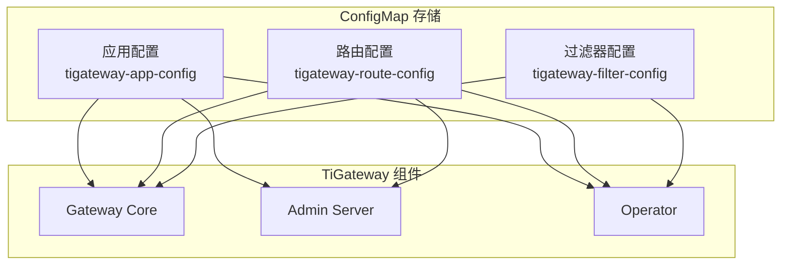
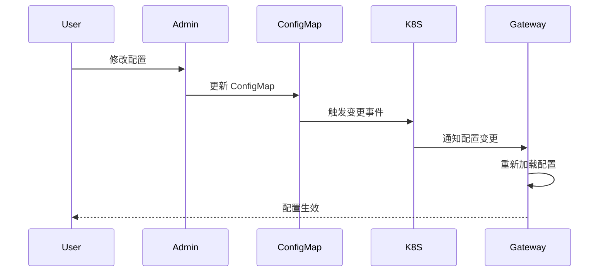
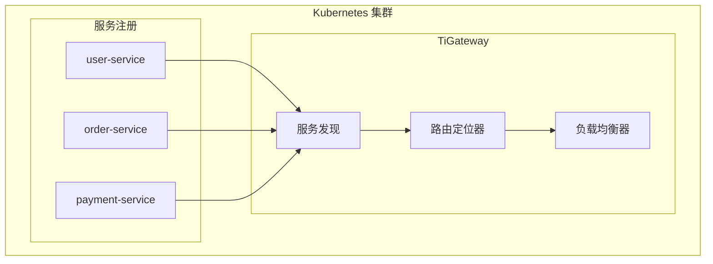

# Kubernetes 原生特性

TiGateway 作为 Kubernetes 原生的 API 网关，深度集成了 Kubernetes 的各种特性，提供了云原生的网关解决方案。

## Kubernetes 集成概述

TiGateway 的 Kubernetes 原生特性包括：

- **ConfigMap 存储**: 使用 ConfigMap 作为配置存储
- **CRD 资源管理**: 支持自定义资源定义
- **Ingress 集成**: 作为 Ingress 控制器
- **服务发现**: 自动发现 Kubernetes 服务
- **RBAC 支持**: 完整的权限控制
- **健康检查**: 集成 Kubernetes 健康检查

## ConfigMap 存储

### 配置存储架构

TiGateway 使用 Kubernetes ConfigMap 作为主要配置存储，支持配置的热更新和版本管理。



### ConfigMap 结构

#### 应用配置 ConfigMap

```yaml
apiVersion: v1
kind: ConfigMap
metadata:
  name: tigateway-app-config
  namespace: tigateway
data:
  application.yml: |
    server:
      port: 8080
    spring:
      cloud:
        gateway:
          discovery:
            locator:
              enabled: true
              lower-case-service-id: true
          httpclient:
            connect-timeout: 1000
            response-timeout: 5s
  logback-spring.xml: |
    <configuration>
      <include resource="org/springframework/boot/logging/logback/defaults.xml"/>
      <include resource="org/springframework/boot/logging/logback/console-appender.xml"/>
      <root level="INFO">
        <appender-ref ref="CONSOLE"/>
      </root>
    </configuration>
```

#### 路由配置 ConfigMap

```yaml
apiVersion: v1
kind: ConfigMap
metadata:
  name: tigateway-route-config
  namespace: tigateway
data:
  routes.yaml: |
    spring:
      cloud:
        gateway:
          routes:
          - id: user-service
            uri: lb://user-service
            predicates:
            - Path=/api/users/**
            filters:
            - StripPrefix=2
            - AddRequestHeader=X-Gateway, TiGateway
          - id: order-service
            uri: lb://order-service
            predicates:
            - Path=/api/orders/**
            filters:
            - StripPrefix=2
            - CircuitBreaker=order-service
```

### 配置热更新

TiGateway 支持配置的热更新，无需重启服务：



#### 配置监听器

```java
@Component
public class ConfigMapChangeListener {
    
    @EventListener
    public void handleConfigMapChange(ConfigMapChangeEvent event) {
        log.info("ConfigMap changed: {}", event.getConfigMapName());
        // 重新加载配置
        configurationReloader.reload();
    }
}
```

## CRD 资源管理

### 自定义资源定义

TiGateway 定义了一套完整的 CRD 资源：

```yaml
apiVersion: apiextensions.k8s.io/v1
kind: CustomResourceDefinition
metadata:
  name: tigateways.tigateway.cn
spec:
  group: tigateway.cn
  versions:
  - name: v1
    served: true
    storage: true
    schema:
      openAPIV3Schema:
        type: object
        properties:
          spec:
            type: object
            properties:
              routes:
                type: array
                items:
                  type: object
                  properties:
                    id:
                      type: string
                    uri:
                      type: string
                    predicates:
                      type: array
                    filters:
                      type: array
```

### TiGateway 资源

```yaml
apiVersion: tigateway.cn/v1
kind: TiGateway
metadata:
  name: example-gateway
  namespace: tigateway
spec:
  routes:
  - id: api-gateway
    uri: lb://api-service
    predicates:
    - Path=/api/**
    filters:
    - StripPrefix=1
    - AddRequestHeader=X-Gateway, TiGateway
  - id: web-gateway
    uri: lb://web-service
    predicates:
    - Path=/web/**
    filters:
    - StripPrefix=1
```

### TiGatewayMapping 资源

```yaml
apiVersion: tigateway.cn/v1
kind: TiGatewayMapping
metadata:
  name: service-mapping
  namespace: tigateway
spec:
  gateway: example-gateway
  mappings:
  - service: user-service
    path: /users
    targetPath: /
  - service: order-service
    path: /orders
    targetPath: /
```

## Ingress 集成

### Ingress 控制器

TiGateway 可以作为 Kubernetes Ingress 控制器使用：

```yaml
apiVersion: networking.k8s.io/v1
kind: IngressClass
metadata:
  name: tigateway
spec:
  controller: tigateway.cn/ingress-controller
---
apiVersion: networking.k8s.io/v1
kind: Ingress
metadata:
  name: example-ingress
  namespace: tigateway
  annotations:
    kubernetes.io/ingress.class: "tigateway"
    tigateway.cn/rewrite-target: "/"
spec:
  rules:
  - host: api.example.com
    http:
      paths:
      - path: /users
        pathType: Prefix
        backend:
          service:
            name: user-service
            port:
              number: 80
      - path: /orders
        pathType: Prefix
        backend:
          service:
            name: order-service
            port:
              number: 80
```

### Ingress 注解支持

TiGateway 支持丰富的 Ingress 注解：

```yaml
apiVersion: networking.k8s.io/v1
kind: Ingress
metadata:
  name: advanced-ingress
  annotations:
    kubernetes.io/ingress.class: "tigateway"
    # 路径重写
    tigateway.cn/rewrite-target: "/"
    # 负载均衡
    tigateway.cn/load-balancer: "round-robin"
    # 限流
    tigateway.cn/rate-limit: "100"
    # 熔断器
    tigateway.cn/circuit-breaker: "order-service"
    # 认证
    tigateway.cn/auth-type: "jwt"
    # CORS
    tigateway.cn/cors-enabled: "true"
    # 超时
    tigateway.cn/timeout: "30s"
spec:
  rules:
  - host: api.example.com
    http:
      paths:
      - path: /api
        pathType: Prefix
        backend:
          service:
            name: api-service
            port:
              number: 80
```

## 服务发现

### 自动服务发现

TiGateway 支持 Kubernetes 服务的自动发现：



### 服务发现配置

```yaml
spring:
  cloud:
    gateway:
      discovery:
        locator:
          enabled: true
          lower-case-service-id: true
          predicates:
          - name: Path
            args:
              pattern: "'/'+serviceId+'/**'"
          filters:
          - name: RewritePath
            args:
              regexp: "'/' + serviceId + '/?(?<remaining>.*)'"
              replacement: "'/${remaining}'"
```

### 动态路由创建

基于服务发现自动创建路由：

```java
@Component
public class KubernetesServiceDiscoveryLocator implements RouteDefinitionLocator {
    
    @Autowired
    private KubernetesClient kubernetesClient;
    
    @Override
    public Flux<RouteDefinition> getRouteDefinitions() {
        return Flux.fromIterable(kubernetesClient.services().list().getItems())
            .map(this::createRouteDefinition);
    }
    
    private RouteDefinition createRouteDefinition(Service service) {
        RouteDefinition route = new RouteDefinition();
        route.setId(service.getMetadata().getName());
        route.setUri(URI.create("lb://" + service.getMetadata().getName()));
        
        // 添加路径谓词
        PredicateDefinition predicate = new PredicateDefinition();
        predicate.setName("Path");
        predicate.addArg("pattern", "/" + service.getMetadata().getName() + "/**");
        route.setPredicates(Arrays.asList(predicate));
        
        // 添加重写路径过滤器
        FilterDefinition filter = new FilterDefinition();
        filter.setName("RewritePath");
        filter.addArg("regexp", "/" + service.getMetadata().getName() + "/?(?<remaining>.*)");
        filter.addArg("replacement", "/${remaining}");
        route.setFilters(Arrays.asList(filter));
        
        return route;
    }
}
```

## RBAC 支持

### 权限控制

TiGateway 支持完整的 Kubernetes RBAC：

```yaml
apiVersion: rbac.authorization.k8s.io/v1
kind: ClusterRole
metadata:
  name: tigateway-controller
rules:
- apiGroups: [""]
  resources: ["configmaps", "services", "endpoints"]
  verbs: ["get", "list", "watch"]
- apiGroups: ["networking.k8s.io"]
  resources: ["ingresses", "ingressclasses"]
  verbs: ["get", "list", "watch"]
- apiGroups: ["tigateway.cn"]
  resources: ["tigateways", "tigatewaymappings"]
  verbs: ["get", "list", "watch", "create", "update", "patch", "delete"]
---
apiVersion: rbac.authorization.k8s.io/v1
kind: ClusterRoleBinding
metadata:
  name: tigateway-controller
roleRef:
  apiGroup: rbac.authorization.k8s.io
  kind: ClusterRole
  name: tigateway-controller
subjects:
- kind: ServiceAccount
  name: tigateway-controller
  namespace: tigateway
```

### 服务账户

```yaml
apiVersion: v1
kind: ServiceAccount
metadata:
  name: tigateway-controller
  namespace: tigateway
---
apiVersion: v1
kind: ServiceAccount
metadata:
  name: tigateway-admin
  namespace: tigateway
```

## 健康检查

### Kubernetes 健康检查

TiGateway 提供完整的 Kubernetes 健康检查支持：

```yaml
apiVersion: apps/v1
kind: Deployment
metadata:
  name: tigateway
  namespace: tigateway
spec:
  replicas: 3
  selector:
    matchLabels:
      app: tigateway
  template:
    metadata:
      labels:
        app: tigateway
    spec:
      containers:
      - name: tigateway
        image: tigateway:latest
        ports:
        - containerPort: 8080
          name: gateway
        - containerPort: 8081
          name: admin
        - containerPort: 8090
          name: management
        livenessProbe:
          httpGet:
            path: /actuator/health/liveness
            port: 8090
          initialDelaySeconds: 30
          periodSeconds: 10
        readinessProbe:
          httpGet:
            path: /actuator/health/readiness
            port: 8090
          initialDelaySeconds: 5
          periodSeconds: 5
        startupProbe:
          httpGet:
            path: /actuator/health/startup
            port: 8090
          initialDelaySeconds: 10
          periodSeconds: 5
          failureThreshold: 30
```

### 健康检查端点

```java
@Component
public class KubernetesHealthIndicator implements HealthIndicator {
    
    @Override
    public Health health() {
        try {
            // 检查 Kubernetes API 连接
            kubernetesClient.getApiVersion();
            
            // 检查 ConfigMap 访问
            kubernetesClient.configMaps().list();
            
            return Health.up()
                .withDetail("kubernetes", "connected")
                .withDetail("configmap", "accessible")
                .build();
        } catch (Exception e) {
            return Health.down()
                .withDetail("kubernetes", "disconnected")
                .withDetail("error", e.getMessage())
                .build();
        }
    }
}
```

## 配置管理

### 配置验证

TiGateway 支持 YAML Schema 验证：

```yaml
# schema.yaml
type: object
properties:
  spring:
    type: object
    properties:
      cloud:
        type: object
        properties:
          gateway:
            type: object
            properties:
              routes:
                type: array
                items:
                  type: object
                  required: ["id", "uri", "predicates"]
                  properties:
                    id:
                      type: string
                      minLength: 1
                    uri:
                      type: string
                      pattern: "^https?://.*"
                    predicates:
                      type: array
                      minItems: 1
                    filters:
                      type: array
```

### 配置热重载

```java
@Component
public class ConfigMapWatcher {
    
    @EventListener
    public void handleConfigMapChange(ConfigMapChangeEvent event) {
        log.info("ConfigMap changed: {}", event.getConfigMapName());
        
        // 验证配置
        if (validateConfiguration(event.getConfigMap())) {
            // 重新加载配置
            configurationReloader.reload();
        } else {
            log.error("Invalid configuration in ConfigMap: {}", event.getConfigMapName());
        }
    }
    
    private boolean validateConfiguration(ConfigMap configMap) {
        // 使用 YAML Schema 验证配置
        return yamlSchemaValidator.validate(configMap.getData());
    }
}
```

## 监控集成

### Prometheus 指标

TiGateway 提供丰富的 Prometheus 指标：

```yaml
apiVersion: v1
kind: ConfigMap
metadata:
  name: tigateway-monitoring
  namespace: tigateway
data:
  prometheus.yml: |
    global:
      scrape_interval: 15s
    scrape_configs:
    - job_name: 'tigateway'
      static_configs:
      - targets: ['tigateway:8090']
      metrics_path: '/actuator/prometheus'
      scrape_interval: 5s
```

### Grafana 仪表板

```yaml
apiVersion: v1
kind: ConfigMap
metadata:
  name: tigateway-grafana-dashboard
  namespace: tigateway
data:
  dashboard.json: |
    {
      "dashboard": {
        "title": "TiGateway Dashboard",
        "panels": [
          {
            "title": "Request Rate",
            "type": "graph",
            "targets": [
              {
                "expr": "rate(spring_cloud_gateway_requests_total[5m])",
                "legendFormat": "{{route}}"
              }
            ]
          }
        ]
      }
    }
```

## 安全集成

### 网络策略

```yaml
apiVersion: networking.k8s.io/v1
kind: NetworkPolicy
metadata:
  name: tigateway-network-policy
  namespace: tigateway
spec:
  podSelector:
    matchLabels:
      app: tigateway
  policyTypes:
  - Ingress
  - Egress
  ingress:
  - from:
    - namespaceSelector:
        matchLabels:
          name: ingress-nginx
    ports:
    - protocol: TCP
      port: 8080
  egress:
  - to:
    - namespaceSelector: {}
    ports:
    - protocol: TCP
      port: 443
    - protocol: TCP
      port: 80
```

### Pod 安全策略

```yaml
apiVersion: policy/v1beta1
kind: PodSecurityPolicy
metadata:
  name: tigateway-psp
spec:
  privileged: false
  allowPrivilegeEscalation: false
  requiredDropCapabilities:
  - ALL
  volumes:
  - 'configMap'
  - 'emptyDir'
  - 'projected'
  - 'secret'
  - 'downwardAPI'
  - 'persistentVolumeClaim'
  runAsUser:
    rule: 'MustRunAsNonRoot'
  seLinux:
    rule: 'RunAsAny'
  fsGroup:
    rule: 'RunAsAny'
```

## 总结

TiGateway 的 Kubernetes 原生特性使其成为云原生环境中的理想选择：

1. **ConfigMap 存储**: 无状态配置管理
2. **CRD 支持**: 声明式资源管理
3. **Ingress 集成**: 原生 Ingress 控制器
4. **服务发现**: 自动服务发现和路由
5. **RBAC 支持**: 完整的权限控制
6. **健康检查**: 集成 Kubernetes 健康检查
7. **监控集成**: 丰富的监控和指标
8. **安全集成**: 网络策略和安全策略

这些特性使得 TiGateway 能够充分利用 Kubernetes 的能力，提供云原生的 API 网关解决方案。
