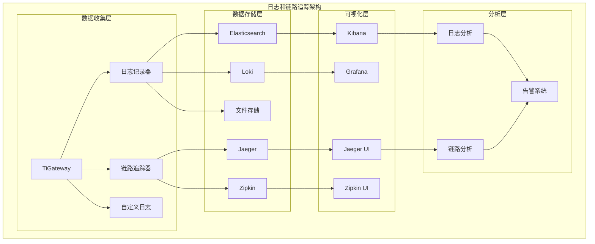

# 日志和链路追踪

TiGateway 提供了完整的日志记录和分布式链路追踪功能，帮助您了解请求的完整生命周期和系统行为。

## 日志和链路追踪概述

### 架构设计



### 核心特性

- **结构化日志**: 支持 JSON 格式的结构化日志
- **分布式追踪**: 支持分布式链路追踪和调用链分析
- **日志聚合**: 支持多节点日志聚合和集中管理
- **实时分析**: 提供实时日志分析和查询
- **告警集成**: 支持基于日志和追踪的告警
- **性能监控**: 提供请求性能分析和优化建议

## 日志功能

### 1. 结构化日志配置

```java
@Configuration
@EnableConfigurationProperties(LoggingProperties.class)
public class LoggingConfiguration {
    
    @Bean
    public LoggerContext loggerContext() {
        LoggerContext context = (LoggerContext) LoggerFactory.getILoggerFactory();
        
        // 配置控制台输出
        configureConsoleAppender(context);
        
        // 配置文件输出
        configureFileAppender(context);
        
        // 配置 Elasticsearch 输出
        configureElasticsearchAppender(context);
        
        return context;
    }
    
    private void configureConsoleAppender(LoggerContext context) {
        ConsoleAppender<ILoggingEvent> consoleAppender = new ConsoleAppender<>();
        consoleAppender.setContext(context);
        consoleAppender.setName("CONSOLE");
        
        // 使用 JSON 格式
        JsonEncoder encoder = new JsonEncoder();
        encoder.setContext(context);
        encoder.start();
        consoleAppender.setEncoder(encoder);
        
        consoleAppender.start();
        
        Logger rootLogger = context.getLogger(Logger.ROOT_LOGGER_NAME);
        rootLogger.addAppender(consoleAppender);
    }
    
    private void configureFileAppender(LoggerContext context) {
        RollingFileAppender<ILoggingEvent> fileAppender = new RollingFileAppender<>();
        fileAppender.setContext(context);
        fileAppender.setName("FILE");
        fileAppender.setFile("/var/log/tigateway/application.log");
        
        // 滚动策略
        TimeBasedRollingPolicy<ILoggingEvent> rollingPolicy = new TimeBasedRollingPolicy<>();
        rollingPolicy.setContext(context);
        rollingPolicy.setParent(fileAppender);
        rollingPolicy.setFileNamePattern("/var/log/tigateway/application.%d{yyyy-MM-dd}.%i.log");
        rollingPolicy.setMaxHistory(30);
        rollingPolicy.setTotalSizeCap(Size.valueOf("10GB"));
        rollingPolicy.start();
        
        fileAppender.setRollingPolicy(rollingPolicy);
        
        // 使用 JSON 格式
        JsonEncoder encoder = new JsonEncoder();
        encoder.setContext(context);
        encoder.start();
        fileAppender.setEncoder(encoder);
        
        fileAppender.start();
        
        Logger rootLogger = context.getLogger(Logger.ROOT_LOGGER_NAME);
        rootLogger.addAppender(fileAppender);
    }
    
    private void configureElasticsearchAppender(LoggerContext context) {
        ElasticsearchAppender<ILoggingEvent> esAppender = new ElasticsearchAppender<>();
        esAppender.setContext(context);
        esAppender.setName("ELASTICSEARCH");
        esAppender.setIndex("tigateway-logs");
        esAppender.setType("log");
        esAppender.setUrl("http://elasticsearch:9200");
        esAppender.start();
        
        Logger rootLogger = context.getLogger(Logger.ROOT_LOGGER_NAME);
        rootLogger.addAppender(esAppender);
    }
}
```

### 2. 请求日志记录器

```java
@Component
public class RequestLoggingFilter implements GlobalFilter, Ordered {
    
    private static final Logger logger = LoggerFactory.getLogger(RequestLoggingFilter.class);
    
    @Override
    public Mono<Void> filter(ServerWebExchange exchange, GatewayFilterChain chain) {
        ServerHttpRequest request = exchange.getRequest();
        String requestId = generateRequestId();
        
        // 设置请求 ID
        exchange.getAttributes().put("REQUEST_ID", requestId);
        
        // 记录请求开始日志
        logRequestStart(request, requestId);
        
        long startTime = System.currentTimeMillis();
        
        return chain.filter(exchange)
            .doOnSuccess(aVoid -> {
                long duration = System.currentTimeMillis() - startTime;
                logRequestSuccess(exchange, requestId, duration);
            })
            .doOnError(throwable -> {
                long duration = System.currentTimeMillis() - startTime;
                logRequestError(exchange, requestId, duration, throwable);
            });
    }
    
    private void logRequestStart(ServerHttpRequest request, String requestId) {
        Map<String, Object> logData = new HashMap<>();
        logData.put("requestId", requestId);
        logData.put("timestamp", Instant.now().toString());
        logData.put("level", "INFO");
        logData.put("event", "REQUEST_START");
        logData.put("method", request.getMethod().name());
        logData.put("path", request.getPath().value());
        logData.put("queryParams", request.getQueryParams().toSingleValueMap());
        logData.put("headers", getHeaders(request));
        logData.put("clientIp", getClientIp(request));
        logData.put("userAgent", request.getHeaders().getFirst("User-Agent"));
        
        logger.info("Request started: {}", new Gson().toJson(logData));
    }
    
    private void logRequestSuccess(ServerWebExchange exchange, String requestId, long duration) {
        ServerHttpRequest request = exchange.getRequest();
        ServerHttpResponse response = exchange.getResponse();
        
        Map<String, Object> logData = new HashMap<>();
        logData.put("requestId", requestId);
        logData.put("timestamp", Instant.now().toString());
        logData.put("level", "INFO");
        logData.put("event", "REQUEST_SUCCESS");
        logData.put("method", request.getMethod().name());
        logData.put("path", request.getPath().value());
        logData.put("statusCode", response.getStatusCode().value());
        logData.put("duration", duration);
        logData.put("responseHeaders", getHeaders(response));
        
        logger.info("Request completed: {}", new Gson().toJson(logData));
    }
    
    private void logRequestError(ServerWebExchange exchange, String requestId, long duration, Throwable throwable) {
        ServerHttpRequest request = exchange.getRequest();
        ServerHttpResponse response = exchange.getResponse();
        
        Map<String, Object> logData = new HashMap<>();
        logData.put("requestId", requestId);
        logData.put("timestamp", Instant.now().toString());
        logData.put("level", "ERROR");
        logData.put("event", "REQUEST_ERROR");
        logData.put("method", request.getMethod().name());
        logData.put("path", request.getPath().value());
        logData.put("statusCode", response.getStatusCode() != null ? response.getStatusCode().value() : 500);
        logData.put("duration", duration);
        logData.put("error", throwable.getMessage());
        logData.put("errorType", throwable.getClass().getSimpleName());
        logData.put("stackTrace", getStackTrace(throwable));
        
        logger.error("Request failed: {}", new Gson().toJson(logData));
    }
    
    private String generateRequestId() {
        return UUID.randomUUID().toString();
    }
    
    private String getClientIp(ServerHttpRequest request) {
        String xForwardedFor = request.getHeaders().getFirst("X-Forwarded-For");
        if (xForwardedFor != null && !xForwardedFor.isEmpty()) {
            return xForwardedFor.split(",")[0].trim();
        }
        
        String xRealIp = request.getHeaders().getFirst("X-Real-IP");
        if (xRealIp != null && !xRealIp.isEmpty()) {
            return xRealIp;
        }
        
        return request.getRemoteAddress() != null ?
            request.getRemoteAddress().getAddress().getHostAddress() : "unknown";
    }
    
    private Map<String, String> getHeaders(ServerHttpMessage message) {
        Map<String, String> headers = new HashMap<>();
        message.getHeaders().forEach((name, values) -> {
            if (values.size() == 1) {
                headers.put(name, values.get(0));
            } else {
                headers.put(name, String.join(",", values));
            }
        });
        return headers;
    }
    
    private String getStackTrace(Throwable throwable) {
        StringWriter sw = new StringWriter();
        PrintWriter pw = new PrintWriter(sw);
        throwable.printStackTrace(pw);
        return sw.toString();
    }
    
    @Override
    public int getOrder() {
        return -1000;
    }
}
```

### 3. 业务日志记录器

```java
@Component
public class BusinessLogger {
    
    private static final Logger logger = LoggerFactory.getLogger("BUSINESS");
    
    public void logUserAction(String userId, String action, String resource, Map<String, Object> context) {
        Map<String, Object> logData = new HashMap<>();
        logData.put("timestamp", Instant.now().toString());
        logData.put("level", "INFO");
        logData.put("event", "USER_ACTION");
        logData.put("userId", userId);
        logData.put("action", action);
        logData.put("resource", resource);
        logData.put("context", context);
        
        logger.info("User action: {}", new Gson().toJson(logData));
    }
    
    public void logApiCall(String apiName, String version, String method, int statusCode, long duration) {
        Map<String, Object> logData = new HashMap<>();
        logData.put("timestamp", Instant.now().toString());
        logData.put("level", "INFO");
        logData.put("event", "API_CALL");
        logData.put("apiName", apiName);
        logData.put("version", version);
        logData.put("method", method);
        logData.put("statusCode", statusCode);
        logData.put("duration", duration);
        
        logger.info("API call: {}", new Gson().toJson(logData));
    }
    
    public void logSecurityEvent(String eventType, String userId, String clientIp, String details) {
        Map<String, Object> logData = new HashMap<>();
        logData.put("timestamp", Instant.now().toString());
        logData.put("level", "WARN");
        logData.put("event", "SECURITY_EVENT");
        logData.put("eventType", eventType);
        logData.put("userId", userId);
        logData.put("clientIp", clientIp);
        logData.put("details", details);
        
        logger.warn("Security event: {}", new Gson().toJson(logData));
    }
    
    public void logPerformanceEvent(String component, String operation, long duration, Map<String, Object> metrics) {
        Map<String, Object> logData = new HashMap<>();
        logData.put("timestamp", Instant.now().toString());
        logData.put("level", "INFO");
        logData.put("event", "PERFORMANCE_EVENT");
        logData.put("component", component);
        logData.put("operation", operation);
        logData.put("duration", duration);
        logData.put("metrics", metrics);
        
        logger.info("Performance event: {}", new Gson().toJson(logData));
    }
}
```

## 链路追踪功能

### 1. 分布式追踪配置

```java
@Configuration
@EnableTracing
public class TracingConfiguration {
    
    @Bean
    public Tracer tracer() {
        return new BraveTracer(
            new Brave.Builder("tigateway")
                .reporter(AsyncReporter.create(createReporter()))
                .sampler(Sampler.create(1.0f))
                .build()
        );
    }
    
    private Sender createReporter() {
        return OkHttpSender.create("http://jaeger:14268/api/traces");
    }
    
    @Bean
    public TracingFilter tracingFilter(Tracer tracer) {
        return new TracingFilter(tracer);
    }
    
    @Bean
    public WebClientTracingCustomizer webClientTracingCustomizer(Tracer tracer) {
        return new WebClientTracingCustomizer(tracer);
    }
}
```

### 2. 链路追踪过滤器

```java
@Component
public class TracingFilter implements GlobalFilter, Ordered {
    
    private final Tracer tracer;
    
    public TracingFilter(Tracer tracer) {
        this.tracer = tracer;
    }
    
    @Override
    public Mono<Void> filter(ServerWebExchange exchange, GatewayFilterChain chain) {
        ServerHttpRequest request = exchange.getRequest();
        
        // 创建或继续追踪
        Span span = createOrContinueSpan(request);
        
        try (Tracer.SpanInScope ws = tracer.withSpanInScope(span)) {
            // 设置追踪信息
            exchange.getAttributes().put("TRACE_ID", span.context().traceId());
            exchange.getAttributes().put("SPAN_ID", span.context().spanId());
            
            // 添加请求标签
            span.tag("http.method", request.getMethod().name());
            span.tag("http.url", request.getURI().toString());
            span.tag("http.path", request.getPath().value());
            span.tag("http.client_ip", getClientIp(request));
            
            return chain.filter(exchange)
                .doOnSuccess(aVoid -> {
                    ServerHttpResponse response = exchange.getResponse();
                    span.tag("http.status_code", String.valueOf(response.getStatusCode().value()));
                    span.tag("http.response_size", String.valueOf(getResponseSize(response)));
                    span.finish();
                })
                .doOnError(throwable -> {
                    span.tag("error", true);
                    span.tag("error.message", throwable.getMessage());
                    span.tag("error.type", throwable.getClass().getSimpleName());
                    span.finish();
                });
        }
    }
    
    private Span createOrContinueSpan(ServerHttpRequest request) {
        // 检查是否有现有的追踪上下文
        String traceId = request.getHeaders().getFirst("X-Trace-Id");
        String spanId = request.getHeaders().getFirst("X-Span-Id");
        
        if (traceId != null && spanId != null) {
            // 继续现有追踪
            TraceContext context = TraceContext.newBuilder()
                .traceId(Long.parseUnsignedLong(traceId, 16))
                .spanId(Long.parseUnsignedLong(spanId, 16))
                .build();
            
            return tracer.nextSpan(TraceContextOrSamplingFlags.create(context));
        } else {
            // 创建新追踪
            return tracer.nextSpan().name("gateway-request").start();
        }
    }
    
    private String getClientIp(ServerHttpRequest request) {
        String xForwardedFor = request.getHeaders().getFirst("X-Forwarded-For");
        if (xForwardedFor != null && !xForwardedFor.isEmpty()) {
            return xForwardedFor.split(",")[0].trim();
        }
        
        String xRealIp = request.getHeaders().getFirst("X-Real-IP");
        if (xRealIp != null && !xRealIp.isEmpty()) {
            return xRealIp;
        }
        
        return request.getRemoteAddress() != null ?
            request.getRemoteAddress().getAddress().getHostAddress() : "unknown";
    }
    
    private long getResponseSize(ServerHttpResponse response) {
        String contentLength = response.getHeaders().getFirst("Content-Length");
        return contentLength != null ? Long.parseLong(contentLength) : 0;
    }
    
    @Override
    public int getOrder() {
        return -999;
    }
}
```

### 3. 路由追踪

```java
@Component
public class RouteTracingFilter implements GlobalFilter, Ordered {
    
    private final Tracer tracer;
    
    public RouteTracingFilter(Tracer tracer) {
        this.tracer = tracer;
    }
    
    @Override
    public Mono<Void> filter(ServerWebExchange exchange, GatewayFilterChain chain) {
        Route route = exchange.getAttribute(GATEWAY_ROUTE_ATTR);
        if (route == null) {
            return chain.filter(exchange);
        }
        
        Span parentSpan = tracer.currentSpan();
        if (parentSpan == null) {
            return chain.filter(exchange);
        }
        
        Span routeSpan = tracer.nextSpan(parentSpan.context())
            .name("route-" + route.getId())
            .tag("route.id", route.getId())
            .tag("route.uri", route.getUri().toString())
            .start();
        
        try (Tracer.SpanInScope ws = tracer.withSpanInScope(routeSpan)) {
            return chain.filter(exchange)
                .doOnSuccess(aVoid -> {
                    routeSpan.tag("route.success", true);
                    routeSpan.finish();
                })
                .doOnError(throwable -> {
                    routeSpan.tag("route.success", false);
                    routeSpan.tag("route.error", throwable.getMessage());
                    routeSpan.finish();
                });
        }
    }
    
    @Override
    public int getOrder() {
        return -998;
    }
}
```

## 配置示例

### 1. 日志配置

```yaml
# application.yml
logging:
  level:
    root: INFO
    ti.gateway: DEBUG
    org.springframework.cloud.gateway: DEBUG
  pattern:
    console: "%d{yyyy-MM-dd HH:mm:ss.SSS} [%thread] %-5level %logger{36} - %msg%n"
    file: "%d{yyyy-MM-dd HH:mm:ss.SSS} [%thread] %-5level %logger{36} - %msg%n"
  file:
    name: /var/log/tigateway/application.log
  logback:
    rollingpolicy:
      max-file-size: 100MB
      max-history: 30
      total-size-cap: 10GB

# 自定义日志配置
tigateway:
  logging:
    # 结构化日志配置
    structured:
      enabled: true
      format: json
      include-stack-trace: true
      include-mdc: true
    
    # 日志输出配置
    appenders:
      console:
        enabled: true
        level: INFO
      file:
        enabled: true
        level: DEBUG
        path: /var/log/tigateway/
        max-size: 100MB
        max-history: 30
      elasticsearch:
        enabled: true
        level: INFO
        url: http://elasticsearch:9200
        index: tigateway-logs
        type: log
    
    # 日志过滤配置
    filters:
      sensitive-data:
        enabled: true
        patterns:
        - "password"
        - "token"
        - "secret"
        - "key"
        replacement: "***"
    
    # 性能日志配置
    performance:
      enabled: true
      threshold: 1000ms
      include-request-body: false
      include-response-body: false
```

### 2. 链路追踪配置

```yaml
# 链路追踪配置
tigateway:
  tracing:
    # 追踪配置
    enabled: true
    sampler:
      type: const
      param: 1.0  # 100% 采样率
    
    # 追踪器配置
    tracer:
      service-name: tigateway
      endpoint: http://jaeger:14268/api/traces
      timeout: 5000ms
      buffer-size: 1000
    
    # 追踪标签配置
    tags:
      environment: ${SPRING_PROFILES_ACTIVE:default}
      version: ${APP_VERSION:1.0.0}
      region: ${REGION:unknown}
    
    # 追踪传播配置
    propagation:
      enabled: true
      headers:
      - "X-Trace-Id"
      - "X-Span-Id"
      - "X-B3-TraceId"
      - "X-B3-SpanId"
      - "X-B3-Sampled"
    
    # 追踪存储配置
    storage:
      type: jaeger  # jaeger, zipkin
      jaeger:
        endpoint: http://jaeger:14268/api/traces
        timeout: 5000ms
        buffer-size: 1000
      zipkin:
        endpoint: http://zipkin:9411/api/v2/spans
        timeout: 5000ms
        buffer-size: 1000
```

## 总结

TiGateway 的日志和链路追踪功能提供了完整的可观测性解决方案：

1. **结构化日志**: 支持 JSON 格式的结构化日志记录
2. **分布式追踪**: 支持分布式链路追踪和调用链分析
3. **日志聚合**: 支持多节点日志聚合和集中管理
4. **实时分析**: 提供实时日志分析和查询功能
5. **告警集成**: 支持基于日志和追踪的智能告警
6. **性能监控**: 提供请求性能分析和优化建议
7. **管理 API**: 提供完整的日志和追踪管理 API
8. **最佳实践**: 遵循日志和追踪的最佳实践
9. **故障排除**: 提供完整的故障排除和调试工具

通过日志和链路追踪功能，TiGateway 能够提供全面的可观测性，帮助开发团队和运维团队了解系统行为，快速定位和解决问题。