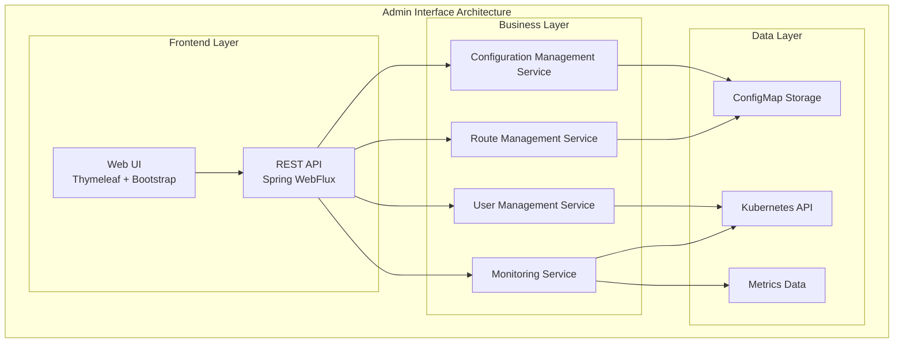
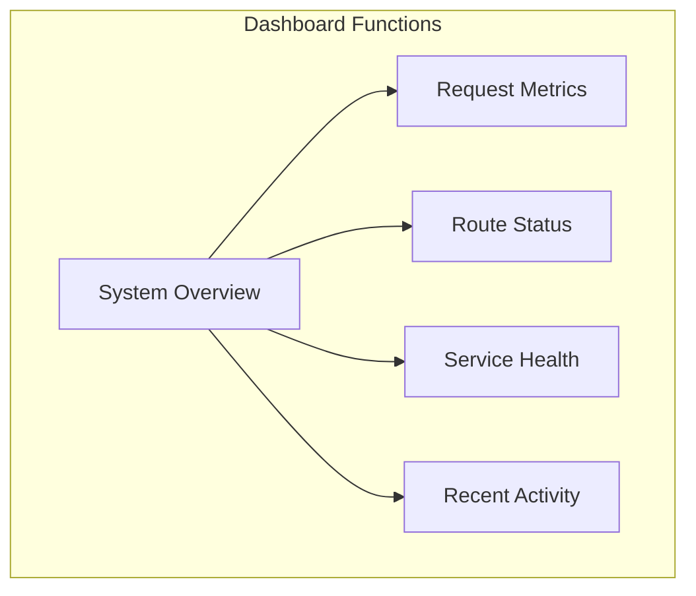

# Admin Interface Overview

TiGateway provides a complete web management interface that allows you to manage gateway configurations, monitor system status, and view operational metrics through an intuitive graphical interface.

## Admin Interface Architecture

### Component Structure



### Port Configuration

The admin interface runs on a separate port, isolated from the main gateway service:

- **Admin Interface Port**: 8081
- **Main Gateway Port**: 8080
- **Monitoring Endpoint Port**: 8090

## Main Functional Modules

### 1. Dashboard

The dashboard provides system overview and key metrics:



**Key Metrics**:
- Total request count
- Request success rate
- Average response time
- Active route count
- Service health status

### 2. Route Management

The route management module provides complete route configuration functionality:

#### Route List

Displays all configured routes with management actions:

```html
<!-- Route list page -->
<div class="route-list">
    <div class="route-item" th:each="route : ${routes}">
        <div class="route-id" th:text="${route.id}"></div>
        <div class="route-uri" th:text="${route.uri}"></div>
        <div class="route-predicates">
            <span th:each="predicate : ${route.predicates}" 
                  th:text="${predicate.name}"></span>
        </div>
        <div class="route-actions">
            <button class="btn-edit" th:onclick="'editRoute(\'' + ${route.id} + '\')'">Edit</button>
            <button class="btn-delete" th:onclick="'deleteRoute(\'' + ${route.id} + '\')'">Delete</button>
            <button class="btn-test" th:onclick="'testRoute(\'' + ${route.id} + '\')'">Test</button>
        </div>
    </div>
</div>
```

#### Route Creation

Interactive route creation form with validation:

```html
<!-- Route creation form -->
<form id="route-form" th:action="@{/admin/routes}" method="post">
    <div class="form-group">
        <label for="routeId">Route ID</label>
        <input type="text" id="routeId" name="id" class="form-control" required>
    </div>
    
    <div class="form-group">
        <label for="routeUri">Target URI</label>
        <input type="text" id="routeUri" name="uri" class="form-control" 
               placeholder="lb://service-name" required>
    </div>
    
    <div class="form-group">
        <label for="routePath">Path Pattern</label>
        <input type="text" id="routePath" name="path" class="form-control" 
               placeholder="/api/**" required>
    </div>
    
    <div class="form-group">
        <label for="routeFilters">Filters</label>
        <select id="routeFilters" name="filters" class="form-control" multiple>
            <option value="StripPrefix">Strip Prefix</option>
            <option value="AddRequestHeader">Add Request Header</option>
            <option value="AddResponseHeader">Add Response Header</option>
            <option value="CircuitBreaker">Circuit Breaker</option>
        </select>
    </div>
    
    <button type="submit" class="btn btn-primary">Create Route</button>
</form>
```

### 3. Configuration Management

#### Configuration Editor

Visual configuration editor with syntax highlighting and validation:

```html
<!-- Configuration editor -->
<div class="config-editor">
    <div class="editor-toolbar">
        <button class="btn btn-sm btn-primary" onclick="saveConfig()">Save</button>
        <button class="btn btn-sm btn-secondary" onclick="validateConfig()">Validate</button>
        <button class="btn btn-sm btn-info" onclick="formatConfig()">Format</button>
        <button class="btn btn-sm btn-warning" onclick="resetConfig()">Reset</button>
    </div>
    
    <div class="editor-container">
        <textarea id="config-editor" class="form-control" rows="20">
# TiGateway Configuration
spring:
  cloud:
    gateway:
      routes:
        - id: user-service
  uri: lb://user-service
  predicates:
    - Path=/api/users/**
  filters:
    - StripPrefix=2
        </textarea>
    </div>
</div>
```

### 4. Monitoring and Metrics

#### Real-time Metrics Dashboard

```html
<!-- Metrics dashboard -->
<div class="metrics-dashboard">
    <div class="row">
        <div class="col-md-3">
            <div class="metric-card">
                <h5>Total Requests</h5>
                <div class="metric-value" id="total-requests">0</div>
                <div class="metric-trend" id="requests-trend">+0%</div>
            </div>
        </div>
        
        <div class="col-md-3">
            <div class="metric-card">
                <h5>Success Rate</h5>
                <div class="metric-value" id="success-rate">0%</div>
                <div class="metric-trend" id="success-trend">+0%</div>
            </div>
        </div>
        
        <div class="col-md-3">
            <div class="metric-card">
                <h5>Avg Response Time</h5>
                <div class="metric-value" id="avg-response-time">0ms</div>
                <div class="metric-trend" id="response-trend">+0%</div>
            </div>
        </div>
        
        <div class="col-md-3">
            <div class="metric-card">
                <h5>Active Routes</h5>
                <div class="metric-value" id="active-routes">0</div>
                <div class="metric-trend" id="routes-trend">+0%</div>
            </div>
        </div>
    </div>
</div>
```

## API Endpoints

### Route Management API

```http
# Get all routes
GET /admin/api/routes

# Get specific route
GET /admin/api/routes/{id}

# Create route
POST /admin/api/routes
Content-Type: application/json

{
  "id": "user-service",
      "uri": "lb://user-service",
      "predicates": [
        {
          "name": "Path",
          "args": {
            "pattern": "/api/users/**"
          }
        }
      ],
      "filters": [
        {
          "name": "StripPrefix",
          "args": {
            "parts": 2
          }
    }
  ]
}

# Update route
PUT /admin/api/routes/{id}

# Delete route
DELETE /admin/api/routes/{id}

# Test route
POST /admin/api/routes/{id}/test
Content-Type: application/json

{
  "url": "/api/users/123",
  "method": "GET"
}
```

### Configuration Management API

```http
# Get current configuration
GET /admin/api/config

# Update configuration
PUT /admin/api/config
Content-Type: application/yaml

# Validate configuration
POST /admin/api/config/validate
Content-Type: application/yaml

# Backup configuration
POST /admin/api/config/backup

# Restore configuration
POST /admin/api/config/restore
Content-Type: application/json

{
  "backupId": "backup-2024-09-23-10-00-00"
}
```

### Monitoring API

```http
# Get current metrics
GET /admin/api/metrics/current

# Get metrics history
GET /admin/api/metrics/history?from=2024-09-23T00:00:00Z&to=2024-09-23T23:59:59Z

# Get route metrics
GET /admin/api/metrics/routes/{routeId}

# Get system health
GET /admin/api/health

# Get service status
GET /admin/api/services/status
```

## Security Configuration

### Authentication Setup

```yaml
# Admin interface security configuration
spring:
  security:
    oauth2:
      client:
        provider:
          admin:
            issuer-uri: ${ADMIN_OAUTH2_ISSUER_URI}
        registration:
          admin:
            client-id: ${ADMIN_OAUTH2_CLIENT_ID}
            client-secret: ${ADMIN_OAUTH2_CLIENT_SECRET}
            scope: openid,profile,email,admin
            authorization-grant-type: authorization_code
            redirect-uri: "{baseUrl}/login/oauth2/code/{registrationId}"

# Admin interface configuration
admin:
  server:
    enabled: true
    port: 8081
    context-path: /admin
    name: tigateway-admin
    security:
      enabled: true
      oauth2:
      enabled: true
        client-registration: admin
      session:
        timeout: 30m
        max-sessions: 1
```

## Deployment Configuration

### Kubernetes Deployment

```yaml
# Admin interface Kubernetes deployment
apiVersion: apps/v1
kind: Deployment
metadata:
  name: tigateway-admin
  namespace: tigateway
spec:
  replicas: 2
  selector:
    matchLabels:
      app: tigateway-admin
  template:
    metadata:
      labels:
        app: tigateway-admin
    spec:
      containers:
      - name: tigateway-admin
        image: tigateway/admin:latest
        ports:
        - containerPort: 8081
        env:
        - name: SPRING_PROFILES_ACTIVE
          value: "prod"
        - name: ADMIN_SERVER_PORT
          value: "8081"
        resources:
          requests:
            memory: "256Mi"
            cpu: "100m"
          limits:
            memory: "512Mi"
            cpu: "200m"
        livenessProbe:
          httpGet:
            path: /admin/actuator/health
            port: 8081
          initialDelaySeconds: 60
          periodSeconds: 30
        readinessProbe:
          httpGet:
            path: /admin/actuator/health
            port: 8081
          initialDelaySeconds: 30
          periodSeconds: 10

---
apiVersion: v1
kind: Service
metadata:
  name: tigateway-admin-service
  namespace: tigateway
spec:
  selector:
    app: tigateway-admin
  ports:
  - name: http
    port: 8081
    targetPort: 8081
  type: ClusterIP
```

---

**Related Documentation**:
- [Configuration Guide](../configuration/configuration.md)
- [Security Guide](../security/security-best-practices.md)
- [Monitoring Guide](../deployment/monitoring.md)
- [API Reference](../api/api-reference.md)