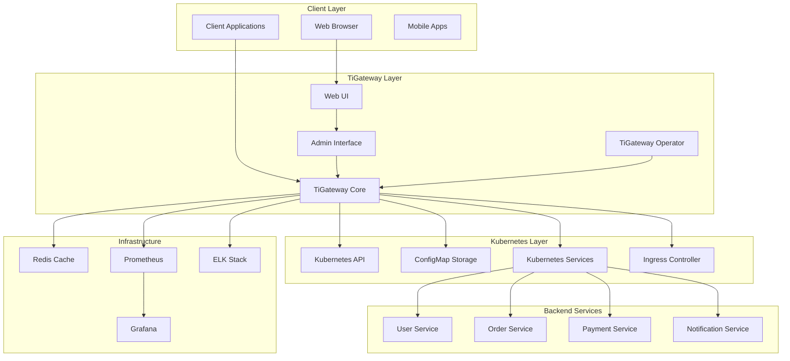
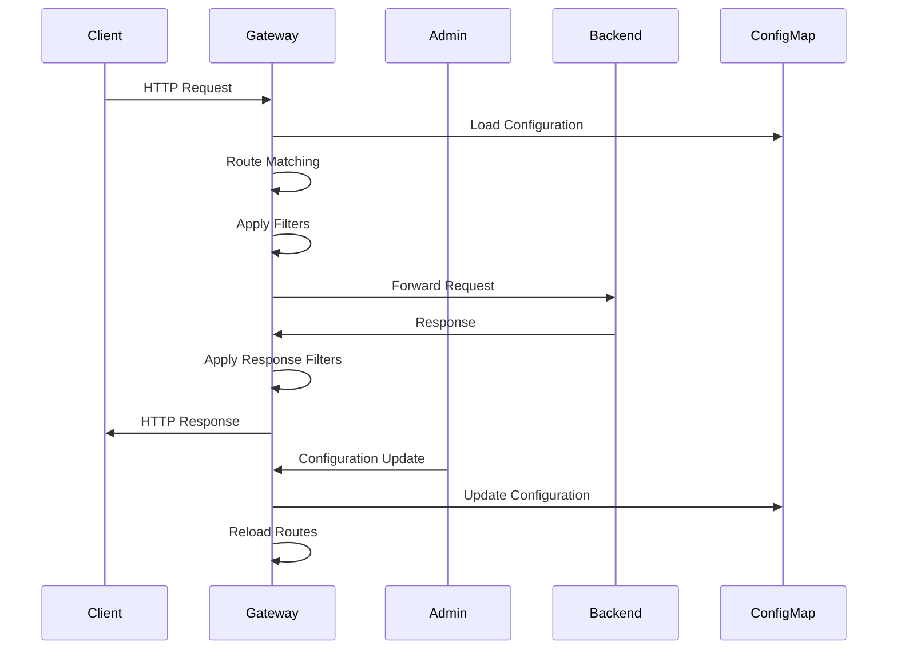
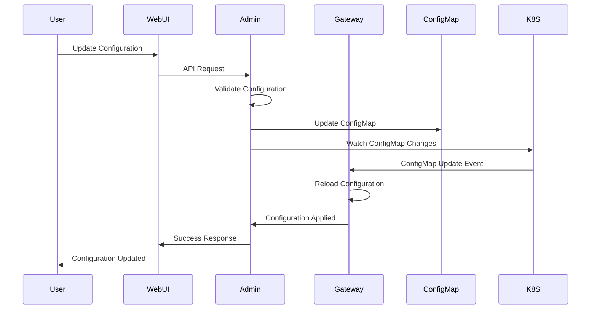
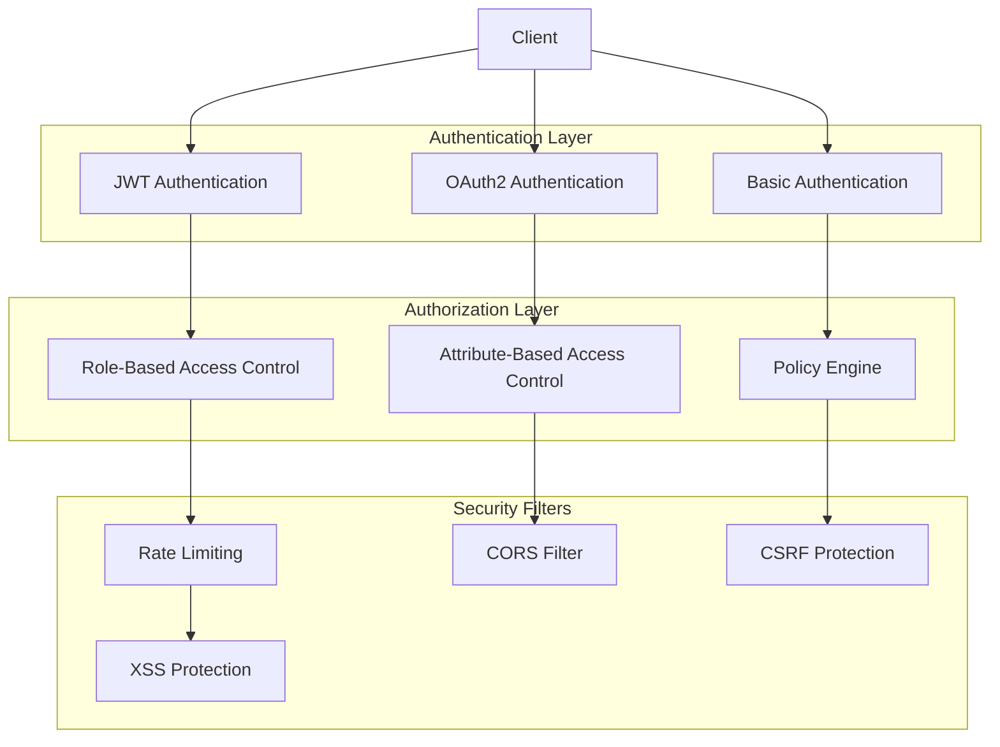
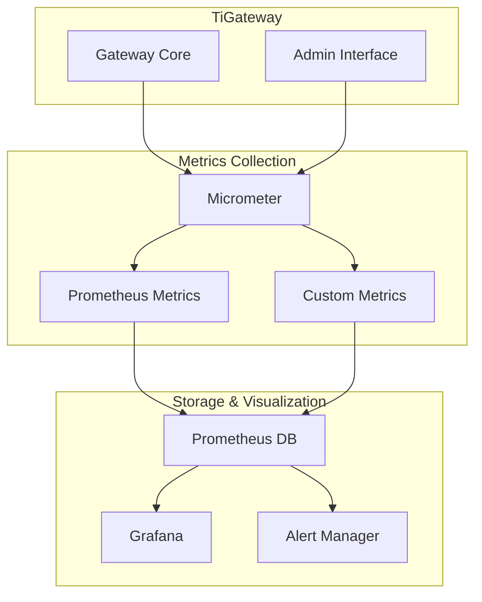
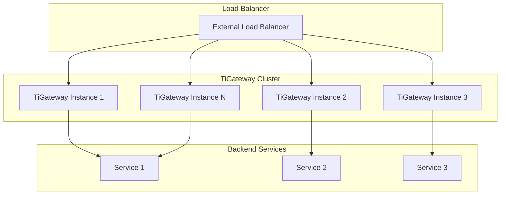
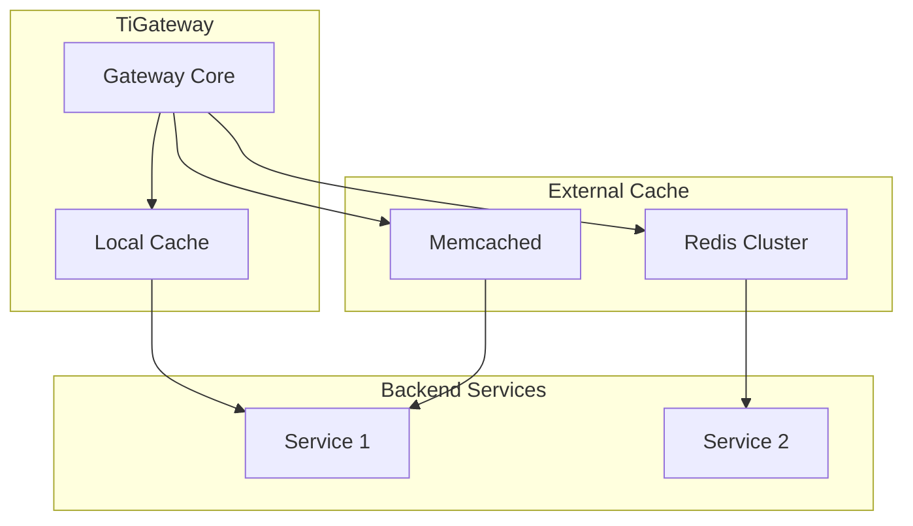
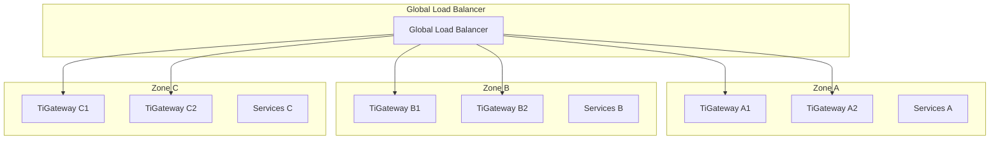
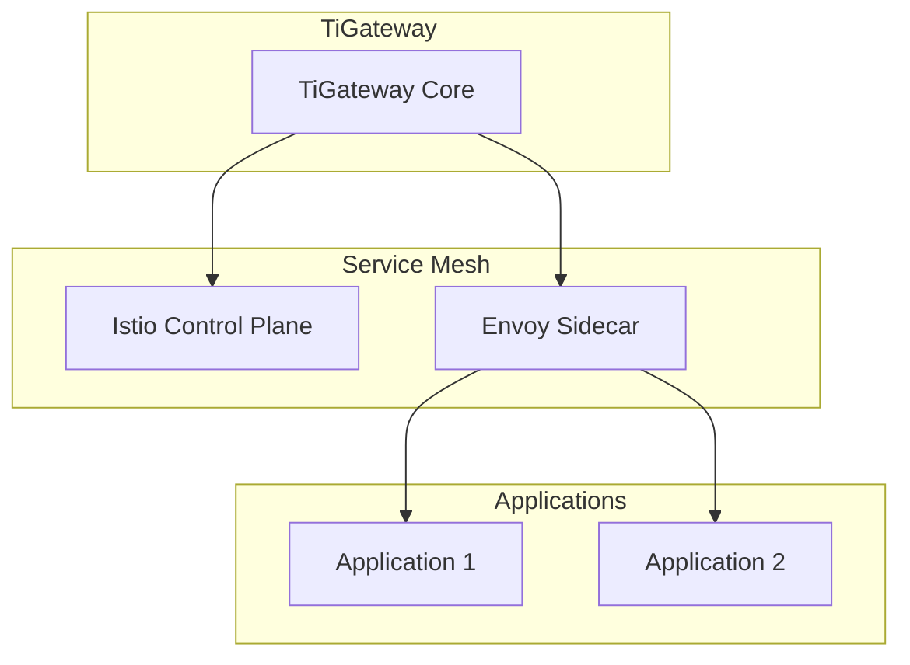

# Architecture

TiGateway is built on a modern, cloud-native architecture that leverages Spring Cloud Gateway and Kubernetes to provide high-performance, scalable API gateway capabilities.

## Architecture Overview



## Core Components

### 1. TiGateway Core

The main gateway engine built on Spring Cloud Gateway, providing:

- **Request Routing**: Intelligent routing based on path, header, and query parameters
- **Load Balancing**: Multiple load balancing algorithms (Round Robin, Least Connections, Random)
- **Circuit Breaker**: Built-in circuit breaker pattern for fault tolerance
- **Rate Limiting**: Request rate limiting and throttling capabilities
- **Security**: Authentication, authorization, and security policies

```yaml
# TiGateway Core Configuration
spring:
  cloud:
    gateway:
      routes:
        - id: user-service-route
          uri: lb://user-service
          predicates:
            - Path=/api/users/**
          filters:
            - StripPrefix=2
            - AddRequestHeader=X-Service,user-service
            - CircuitBreaker=user-service-cb,forward:/fallback
```

### 2. Admin Interface

RESTful API and Web UI for gateway management:

- **Configuration Management**: Dynamic route and filter configuration
- **Monitoring Dashboard**: Real-time metrics and health status
- **User Management**: Authentication and authorization
- **System Administration**: Logs, metrics, and system settings

```java
@RestController
@RequestMapping("/admin/api")
public class AdminController {
    
    @GetMapping("/routes")
    public Flux<RouteDefinition> getRoutes() {
        return routeService.getAllRoutes();
    }
    
    @PostMapping("/routes")
    public Mono<RouteDefinition> createRoute(@RequestBody RouteDefinition route) {
        return routeService.createRoute(route);
    }
}
```

### 3. TiGateway Operator

Kubernetes operator for managing TiGateway instances:

- **Custom Resource Management**: TiGateway, TiGatewayMapping, TiGatewayRouteConfig
- **Lifecycle Management**: Deployment, scaling, and updates
- **Configuration Synchronization**: Automatic configuration updates
- **Health Monitoring**: Continuous health checks and recovery

```yaml
apiVersion: tigateway.cn/v1
kind: TiGateway
metadata:
  name: tigateway-instance
  namespace: tigateway
spec:
  replicas: 3
  image: tigateway/tigateway:1.0.0
  resources:
    requests:
      memory: "256Mi"
      cpu: "100m"
    limits:
      memory: "1Gi"
      cpu: "500m"
```

## Data Flow

### Request Processing Flow



### Configuration Management Flow



## Deployment Architecture

### Kubernetes Deployment

```yaml
apiVersion: apps/v1
kind: Deployment
metadata:
  name: tigateway
  namespace: tigateway
spec:
  replicas: 3
  selector:
    matchLabels:
      app: tigateway
  template:
    metadata:
      labels:
        app: tigateway
    spec:
      containers:
      - name: tigateway
        image: tigateway/tigateway:1.0.0
        ports:
        - containerPort: 8080
          name: gateway
        - containerPort: 8081
          name: admin
        env:
        - name: SPRING_PROFILES_ACTIVE
          value: "kubernetes"
        - name: CONFIG_STORAGE_TYPE
          value: "configmap"
        resources:
          requests:
            memory: "256Mi"
            cpu: "100m"
          limits:
            memory: "1Gi"
            cpu: "500m"
        livenessProbe:
          httpGet:
            path: /actuator/health/liveness
            port: 8080
          initialDelaySeconds: 30
          periodSeconds: 10
        readinessProbe:
          httpGet:
            path: /actuator/health/readiness
            port: 8080
          initialDelaySeconds: 5
          periodSeconds: 5
```

### Service Configuration

```yaml
apiVersion: v1
kind: Service
metadata:
  name: tigateway
  namespace: tigateway
spec:
  selector:
    app: tigateway
  ports:
  - port: 8080
    targetPort: 8080
    name: gateway
  - port: 8081
    targetPort: 8081
    name: admin
  type: LoadBalancer
```

## Security Architecture

### Authentication and Authorization



### Security Configuration

```yaml
spring:
  security:
    oauth2:
      client:
        registration:
          gateway:
            client-id: ${OAUTH2_CLIENT_ID}
            client-secret: ${OAUTH2_CLIENT_SECRET}
            scope: read,write
        provider:
          gateway:
            authorization-uri: ${OAUTH2_AUTHORIZATION_URI}
            token-uri: ${OAUTH2_TOKEN_URI}
            user-info-uri: ${OAUTH2_USER_INFO_URI}
```

## Monitoring Architecture

### Metrics Collection



### Monitoring Configuration

```yaml
management:
  endpoints:
    web:
      exposure:
        include: "*"
  endpoint:
    health:
      show-details: always
    metrics:
      enabled: true
  metrics:
    export:
      prometheus:
        enabled: true
    tags:
      application: tigateway
      environment: ${SPRING_PROFILES_ACTIVE:default}
```

## Scalability Architecture

### Horizontal Scaling



### Auto-scaling Configuration

```yaml
apiVersion: autoscaling/v2
kind: HorizontalPodAutoscaler
metadata:
  name: tigateway-hpa
  namespace: tigateway
spec:
  scaleTargetRef:
    apiVersion: apps/v1
    kind: Deployment
    name: tigateway
  minReplicas: 2
  maxReplicas: 10
  metrics:
  - type: Resource
    resource:
      name: cpu
      target:
        type: Utilization
        averageUtilization: 70
  - type: Resource
    resource:
      name: memory
      target:
        type: Utilization
        averageUtilization: 80
```

## Performance Architecture

### Caching Strategy



### Performance Configuration

```yaml
spring:
  cloud:
    gateway:
      httpclient:
        connect-timeout: 1000
        response-timeout: 5000
        pool:
          max-connections: 500
          max-idle-time: 30s
          max-life-time: 60s
      filter:
        request-rate-limiter:
          redis-rate-limiter:
            replenish-rate: 100
            burst-capacity: 200
```

## High Availability Architecture

### Multi-Zone Deployment



### Disaster Recovery

```yaml
apiVersion: v1
kind: ConfigMap
metadata:
  name: tigateway-dr-config
  namespace: tigateway
data:
  backup-strategy: |
    - type: scheduled
      schedule: "0 2 * * *"
      retention: 7d
    - type: on-demand
      trigger: manual
      retention: 30d
  restore-strategy: |
    - type: point-in-time
      max-age: 24h
    - type: latest
      fallback: true
```

## Integration Architecture

### Service Mesh Integration



### API Gateway Integration

```yaml
apiVersion: networking.istio.io/v1alpha3
kind: Gateway
metadata:
  name: tigateway-gateway
  namespace: tigateway
spec:
  selector:
    istio: ingressgateway
  servers:
  - port:
      number: 80
      name: http
      protocol: HTTP
    hosts:
    - tigateway.example.com
  - port:
      number: 443
      name: https
      protocol: HTTPS
    tls:
      mode: SIMPLE
      credentialName: tigateway-tls
    hosts:
    - tigateway.example.com
```

## Best Practices

### 1. Resource Planning

```yaml
# Resource requirements for different environments
environments:
  development:
    replicas: 1
    resources:
      requests:
        memory: "128Mi"
        cpu: "50m"
      limits:
        memory: "256Mi"
        cpu: "100m"
  
  staging:
    replicas: 2
    resources:
      requests:
        memory: "256Mi"
        cpu: "100m"
      limits:
        memory: "512Mi"
        cpu: "200m"
  
  production:
    replicas: 3
    resources:
      requests:
        memory: "512Mi"
        cpu: "200m"
      limits:
        memory: "1Gi"
        cpu: "500m"
```

### 2. Configuration Management

```yaml
# Environment-specific configuration
spring:
  profiles:
    active: ${ENVIRONMENT:dev}
  config:
    import:
      - configmap:tigateway-config-${ENVIRONMENT}
      - optional:file:./config/override-${ENVIRONMENT}.yml
```

### 3. Monitoring and Alerting

```yaml
# Prometheus alerting rules
groups:
- name: tigateway
  rules:
  - alert: TiGatewayDown
    expr: up{job="tigateway"} == 0
    for: 1m
    labels:
      severity: critical
    annotations:
      summary: "TiGateway instance is down"
      description: "TiGateway instance {{ $labels.instance }} has been down for more than 1 minute."
  
  - alert: HighErrorRate
    expr: rate(http_requests_total{status=~"5.."}[5m]) > 0.1
    for: 2m
    labels:
      severity: warning
    annotations:
      summary: "High error rate detected"
      description: "Error rate is {{ $value }} errors per second."
```

## Next Steps

After understanding the architecture:

1. **[Installation Guide](./installation.md)** - Deploy TiGateway in your environment
2. **[Configuration Guide](./configuration.md)** - Configure TiGateway for your needs
3. **[Deployment Guide](./deployment/kubernetes.md)** - Production deployment best practices
4. **[Monitoring Setup](./monitoring-and-metrics.md)** - Set up comprehensive monitoring

---

**Ready to deploy?** Check out our [Installation Guide](./installation.md) to get started with TiGateway.
