# TiGateway Data Flow Design

## Overview

TiGateway adopts a cloud-native architecture with data flow design based on Kubernetes native resources, supporting configuration hot updates, service discovery, and dynamic routing. This document details the data flow process within the system.

## Overall Data Flow Architecture

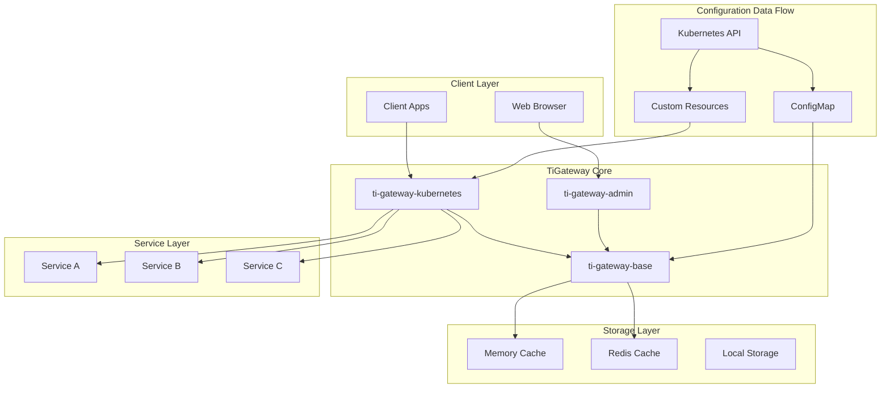

## Configuration Data Flow

### 1. Configuration Sources
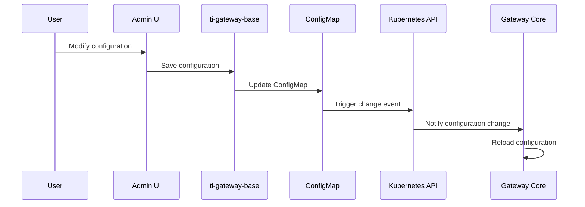

### 2. ConfigMap Configuration Flow
```yaml
# ConfigMap configuration structure
apiVersion: v1
kind: ConfigMap
metadata:
  name: tigateway-app-config
data:
  application.yml: |
    spring:
      cloud:
        gateway:
          routes:
            - id: user-service
              uri: lb://user-service
              predicates:
                - Path=/api/users/**
              filters:
                - StripPrefix=2
  routes.json: |
    [
      {
        "id": "user-service",
        "uri": "lb://user-service",
        "predicates": [{"name": "Path", "args": {"pattern": "/api/users/**"}}],
        "filters": [{"name": "StripPrefix", "args": {"parts": 2}}]
      }
    ]
```

### 3. Configuration Hot Update Mechanism
```java
@Component
public class ConfigMapWatcher {
    
    @EventListener
    public void handleConfigChange(ConfigMapChangeEvent event) {
        // 1. Validate configuration format
        if (validateConfig(event.getNewConfig())) {
            // 2. Update memory cache
            updateMemoryCache(event.getNewConfig());
            // 3. Notify route update
            notifyRouteUpdate(event.getNewConfig());
            // 4. Log configuration change
            logConfigChange(event);
        }
    }
}
```

## Route Data Flow

### 1. Route Discovery Process
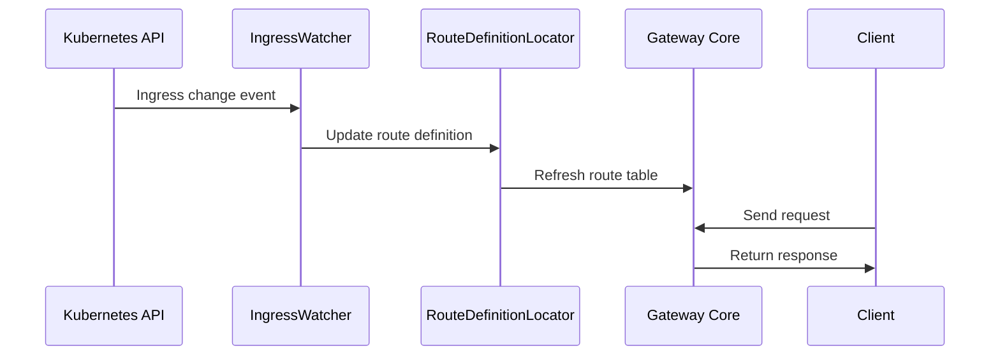

### 2. Dynamic Route Update
```java
@Service
public class DynamicRouteService {
    
    public void updateRoute(RouteDefinition route) {
        // 1. Validate route configuration
        validateRoute(route);
        
        // 2. Update route definition
        routeDefinitionLocator.updateRoute(route);
        
        // 3. Refresh gateway routes
        gatewayWebHandler.refresh();
        
        // 4. Log route change
        logRouteChange(route);
    }
}
```

### 3. Route Matching Process
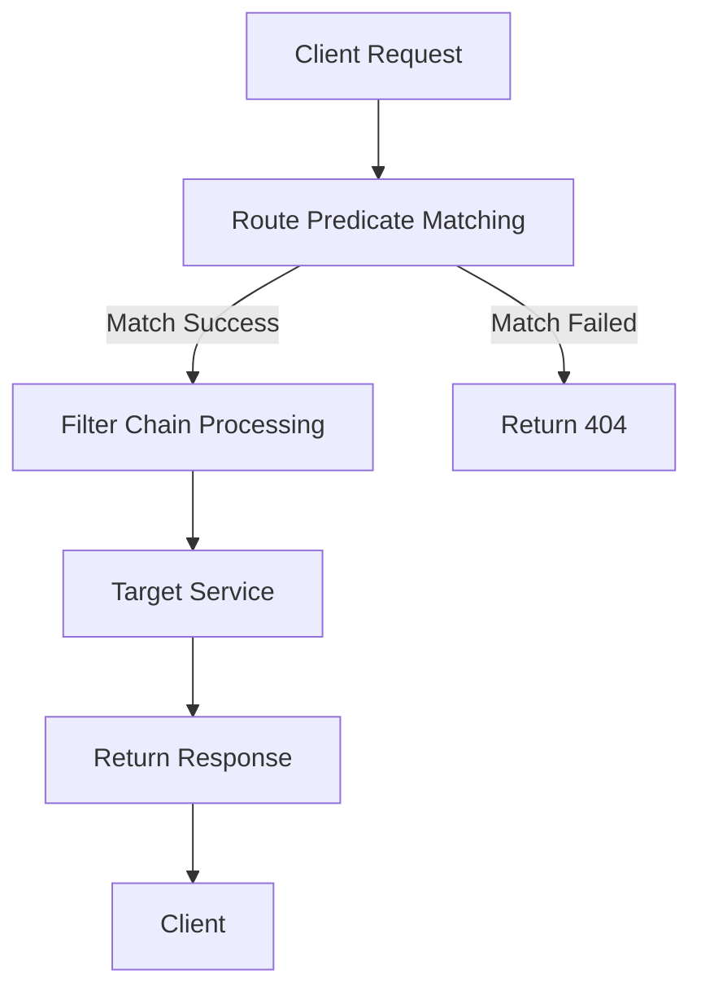

## Service Discovery Data Flow

### 1. Kubernetes Service Discovery
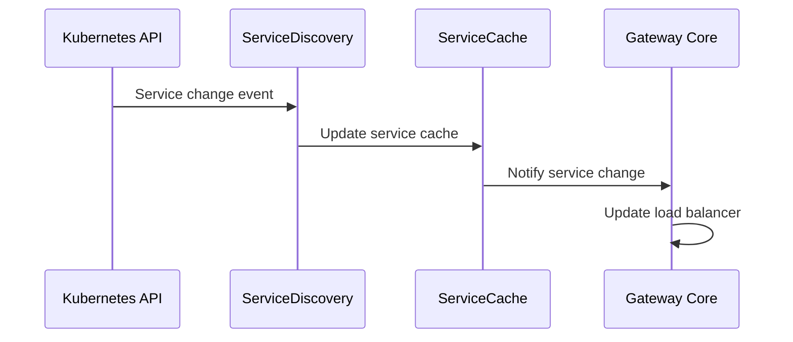

### 2. Service Registration and Discovery
```java
@Component
public class KubernetesServiceDiscovery {
    
    @EventListener
    public void handleServiceChange(ServiceChangeEvent event) {
        switch (event.getType()) {
            case ADDED:
                addService(event.getService());
                break;
            case MODIFIED:
                updateService(event.getService());
                break;
            case DELETED:
                removeService(event.getService());
                break;
        }
    }
}
```

## Cache Data Flow

### 1. Multi-Level Cache Architecture
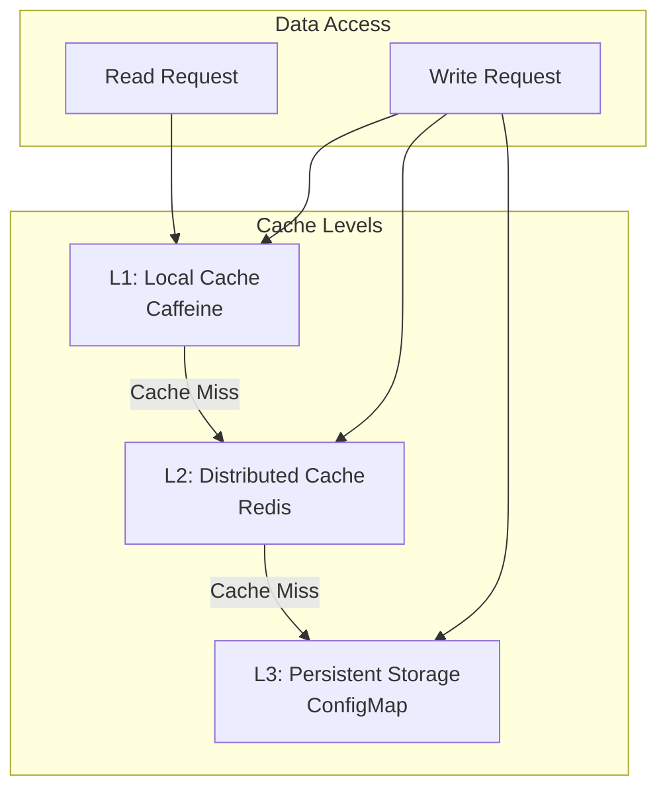

### 2. Cache Update Strategy
```java
@Service
public class CacheManager {
    
    @Cacheable(value = "routes", key = "#routeId")
    public RouteDefinition getRoute(String routeId) {
        return routeRepository.findById(routeId);
    }
    
    @CacheEvict(value = "routes", key = "#route.id")
    public void updateRoute(RouteDefinition route) {
        routeRepository.save(route);
        // Asynchronously update other caches
        asyncUpdateCache(route);
    }
}
```

## Monitoring Data Flow

### 1. Metrics Collection Process
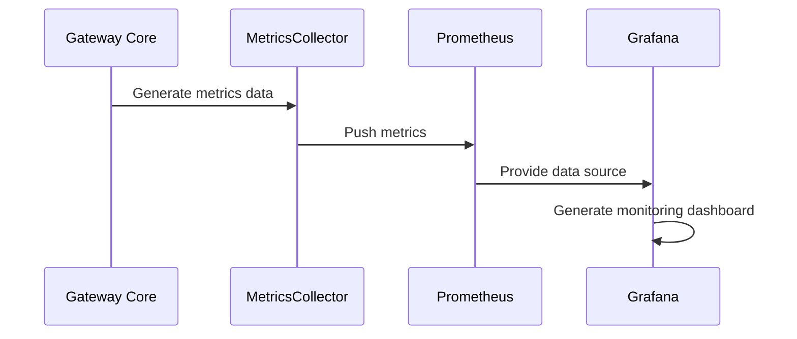

### 2. Log Data Flow
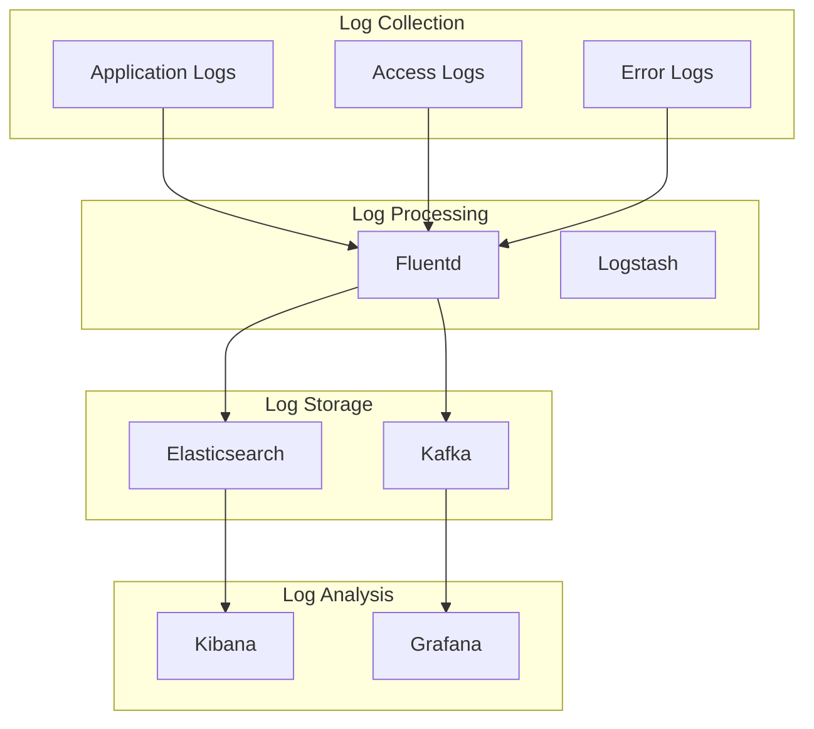

## Security Data Flow

### 1. Authentication and Authorization Process
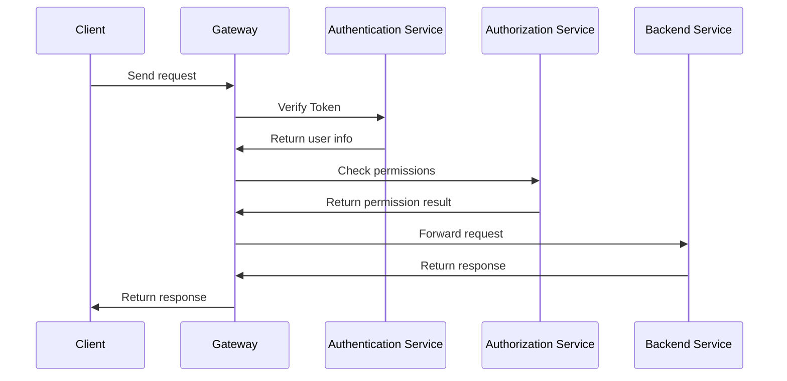

### 2. Security Configuration Data Flow
```java
@Component
public class SecurityConfigManager {
    
    public void updateSecurityConfig(SecurityConfig config) {
        // 1. Validate security configuration
        validateSecurityConfig(config);
        
        // 2. Update security policies
        updateSecurityPolicies(config);
        
        // 3. Refresh security filters
        refreshSecurityFilters();
        
        // 4. Audit security changes
        auditSecurityChange(config);
    }
}
```

## Data Consistency Guarantee

### 1. Eventual Consistency Model
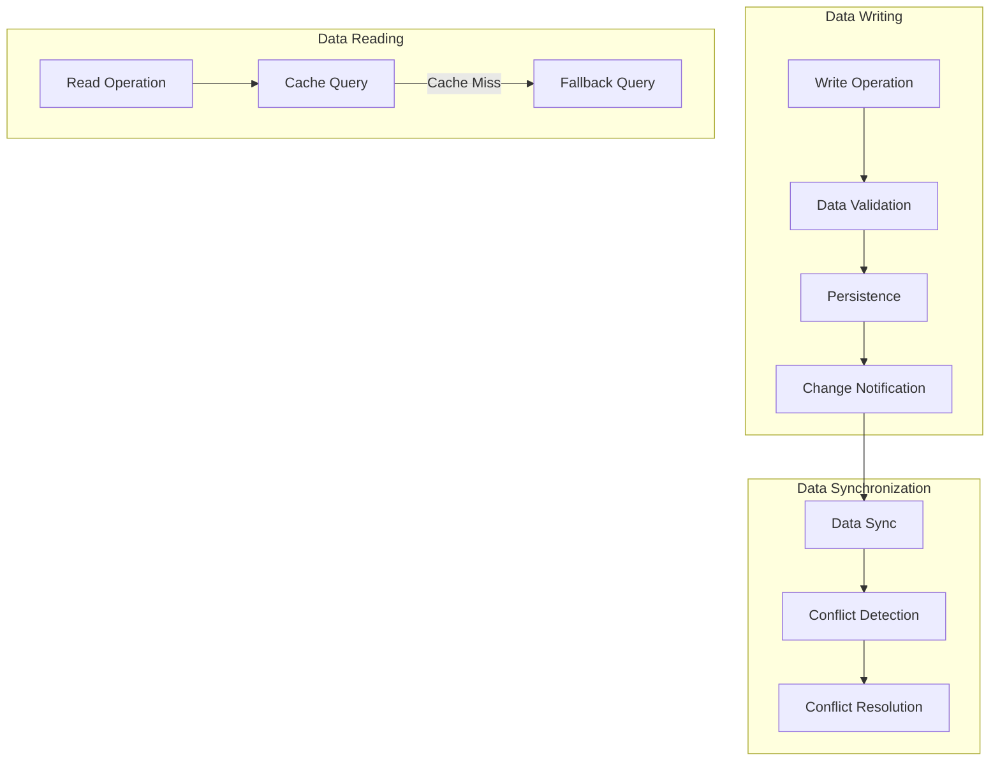

### 2. Data Version Control
```java
@Entity
public class RouteDefinition {
    @Id
    private String id;
    private String uri;
    private List<PredicateDefinition> predicates;
    private List<FilterDefinition> filters;
    
    @Version
    private Long version;
    
    @LastModifiedDate
    private LocalDateTime lastModified;
    
    // Optimistic locking control
    public boolean updateWithVersion(RouteDefinition newRoute) {
        if (this.version.equals(newRoute.getVersion())) {
            this.uri = newRoute.getUri();
            this.predicates = newRoute.getPredicates();
            this.filters = newRoute.getFilters();
            this.version++;
            return true;
        }
        return false; // Version conflict
    }
}
```

## Performance Optimization Data Flow

### 1. Asynchronous Processing Flow
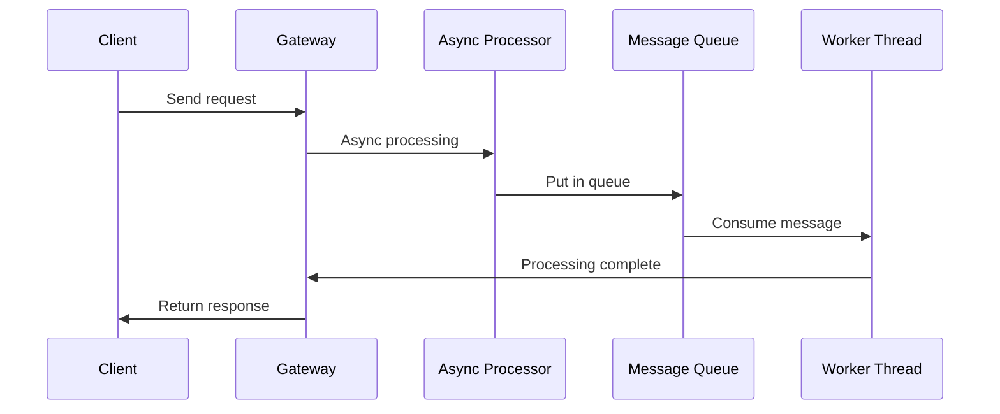

### 2. Batch Processing Optimization
```java
@Component
public class BatchProcessor {
    
    @Scheduled(fixedDelay = 1000)
    public void processBatch() {
        List<RouteUpdate> updates = batchQueue.drainTo(100);
        if (!updates.isEmpty()) {
            // Batch update routes
            batchUpdateRoutes(updates);
            // Batch refresh cache
            batchRefreshCache(updates);
        }
    }
}
```

## Data Backup and Recovery

### 1. Configuration Backup Process
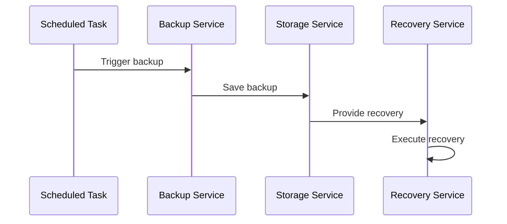

### 2. Data Recovery Mechanism
```java
@Service
public class DataRecoveryService {
    
    public void restoreFromBackup(String backupId) {
        // 1. Load backup data
        BackupData backup = loadBackup(backupId);
        
        // 2. Validate data integrity
        validateBackupData(backup);
        
        // 3. Execute data recovery
        restoreConfigData(backup.getConfig());
        restoreRouteData(backup.getRoutes());
        
        // 4. Refresh system state
        refreshSystemState();
    }
}
```

## Data Flow Monitoring

### 1. Data Flow Metrics
```java
@Component
public class DataFlowMetrics {
    
    private final Counter configUpdateCounter;
    private final Timer routeUpdateTimer;
    private final Gauge cacheHitRatio;
    
    public DataFlowMetrics(MeterRegistry meterRegistry) {
        this.configUpdateCounter = Counter.builder("tigateway.config.updates")
            .description("Number of configuration updates")
            .register(meterRegistry);
            
        this.routeUpdateTimer = Timer.builder("tigateway.routes.update.time")
            .description("Route update processing time")
            .register(meterRegistry);
            
        this.cacheHitRatio = Gauge.builder("tigateway.cache.hit.ratio")
            .description("Cache hit ratio")
            .register(meterRegistry, this, DataFlowMetrics::getCacheHitRatio);
    }
}
```

### 2. Data Flow Tracing
```java
@Component
public class DataFlowTracer {
    
    public void traceConfigUpdate(String configId, String operation) {
        Span span = tracer.nextSpan()
            .name("config-update")
            .tag("config.id", configId)
            .tag("operation", operation)
            .start();
            
        try (Tracer.SpanInScope ws = tracer.withSpanInScope(span)) {
            // Execute configuration update
            performConfigUpdate(configId, operation);
        } finally {
            span.end();
        }
    }
}
```

---

**Related Documentation**:
- [System Architecture](./system-architecture.md)
- [Module Design](./module-design.md)
- [Security Architecture](./security.md)
