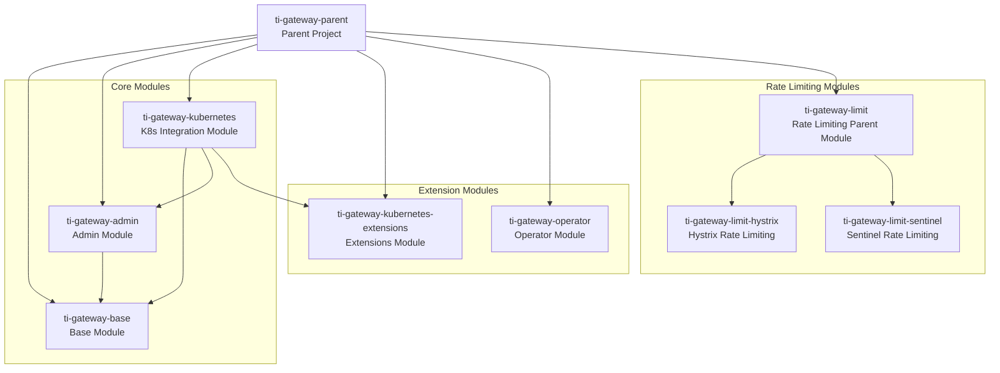
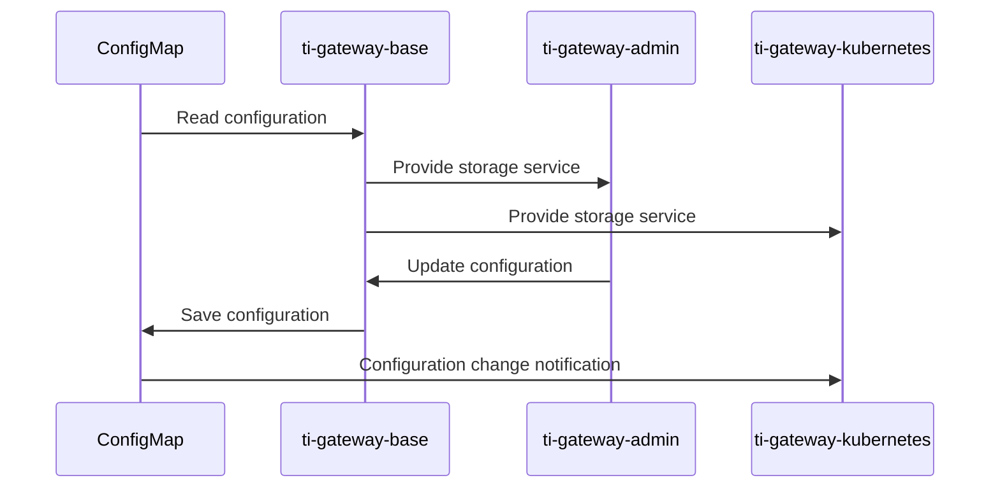
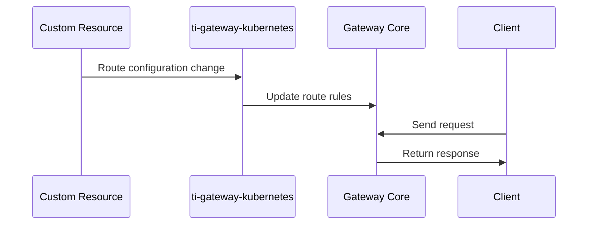

# TiGateway Module Design

## Module Overview

TiGateway adopts a multi-module Maven project structure, where each module has clear responsibilities and boundaries, supporting independent development and testing.

## Module Dependencies



## Detailed Module Design

### ti-gateway-parent
**Responsibility**: Project root module, managing dependency versions and common configurations

**Main Functions**:
- Dependency version management
- Plugin configuration
- Common property definitions

**Key Configuration**:
```xml
<properties>
    <spring-boot.version>2.6.3</spring-boot.version>
    <spring-cloud.version>2021.0.1</spring-cloud.version>
    <kubernetes-client.version>18.0.1</kubernetes-client.version>
    <lombok.version>1.18.30</lombok.version>
</properties>
```

### ti-gateway-base
**Responsibility**: Base functionality module, providing core data models and storage implementations

**Main Package Structure**:
```
ti.gateway.base/
├── core/                    # Core interfaces
│   ├── cache/              # Cache interfaces
│   └── config/             # Configuration interfaces
├── storage/                # Storage implementations
│   └── configmap/          # ConfigMap storage
│       ├── config/         # Auto-configuration
│       ├── impl/           # Implementation classes
│       ├── mapper/         # Data mapping
│       └── model/          # Data models
└── schema/                 # YAML Schema
    ├── validator/          # Validators
    └── transformer/        # Transformers
```

**Core Interfaces**:
```java
// Application server storage interface
public interface AppServerStorage {
    List<AppServerInfo> getAllAppServers();
    AppServerInfo getAppServer(String appId);
    void saveAppServer(AppServerInfo appServer);
    void deleteAppServer(String appId);
}

// ConfigMap storage implementation
@Component
public class ConfigMapAppServerStorage implements AppServerStorage {
    // Implementation of ConfigMap-based storage logic
}
```

### ti-gateway-admin
**Responsibility**: Management interface module, providing Web UI and REST API

**Main Package Structure**:
```
ti.gateway.admin/
├── config/                 # Configuration classes
│   ├── AdminConfiguration.java
│   ├── AdminProperties.java
│   └── AdminServerConfiguration.java
├── controller/             # Controllers
│   ├── AdminController.java
│   └── ApiController.java
├── service/                # Service layer
│   ├── IGwAppInfoService.java
│   └── impl/
│       └── GwAppInfoServiceImpl.java
├── service/entity/         # Entity classes
├── service/dto/            # Data transfer objects
└── base/                   # Base classes
    └── Page.java           # Pagination class
```

**Core Functions**:
- Independent port management service (8081)
- Web UI management interface
- REST API endpoints
- Application configuration management

### ti-gateway-kubernetes
**Responsibility**: Kubernetes integration module, main application entry point

**Main Package Structure**:
```
ti.gateway.kubernetes/
├── GatewayApplication.java # Main application class
├── config/                 # Configuration classes
│   └── KubernetesDiscoveryConfiguration.java
├── ingress/                # Ingress integration
│   ├── IngressConfiguration.java
│   ├── IngressController.java
│   ├── IngressProperties.java
│   ├── IngressRouteDefinitionLocator.java
│   └── IngressWatcher.java
└── security/               # Security configuration
    ├── CommonSecurity.java
    └── SsoDisabledConfiguration.java
```

**Core Functions**:
- Main gateway service (port 8080)
- Kubernetes Ingress integration
- Service discovery
- Security configuration

### ti-gateway-kubernetes-extensions
**Responsibility**: Extension functionality module, providing plugin mechanism

**Main Functions**:
- Custom extension points
- Third-party integrations
- Plugin development framework

### ti-gateway-operator
**Responsibility**: Kubernetes Operator module

**Main Functions**:
- CRD controllers
- Custom resource management
- Automated operations

### ti-gateway-limit
**Responsibility**: Rate limiting functionality module

**Sub-modules**:
- `ti-gateway-limit-hystrix`: Hystrix rate limiting implementation
- `ti-gateway-limit-sentinel`: Sentinel rate limiting implementation

## Inter-Module Communication

### Dependency Injection
```java
// Admin module uses Base module's storage service
@Service
public class GwAppInfoServiceImpl implements IGwAppInfoService {
    
    @Autowired
    private AppServerStorage appServerStorage; // From ti-gateway-base
    
    // Business logic implementation
}
```

### Configuration Sharing
```java
// Share configuration through @ConfigurationProperties
@ConfigurationProperties(prefix = "admin")
public class AdminProperties {
    private Server server = new Server();
    // Configuration properties
}
```

### Event Communication
```java
// Use Spring event mechanism for inter-module communication
@Component
public class RouteChangeListener {
    
    @EventListener
    public void handleRouteChange(RouteChangeEvent event) {
        // Handle route change events
    }
}
```

## Data Flow Design

### Configuration Data Flow


### Route Data Flow


## Extension Point Design

### Storage Extension
```java
// Define storage extension interface
public interface StorageExtension {
    void beforeSave(AppServerInfo appServer);
    void afterSave(AppServerInfo appServer);
    void beforeDelete(String appId);
    void afterDelete(String appId);
}

// Implement storage extension
@Component
public class AuditStorageExtension implements StorageExtension {
    // Audit log extension implementation
}
```

### Route Extension
```java
// Define route extension interface
public interface RouteExtension {
    RouteDefinition enhanceRoute(RouteDefinition route);
    boolean shouldApply(RouteDefinition route);
}

// Implement route extension
@Component
public class SecurityRouteExtension implements RouteExtension {
    // Security enhancement extension implementation
}
```

## Testing Strategy

### Unit Testing
```java
// Base module testing
@ExtendWith(MockitoExtension.class)
class ConfigMapAppServerStorageTest {
    
    @Mock
    private CoreV1Api coreV1Api;
    
    @InjectMocks
    private ConfigMapAppServerStorage storage;
    
    @Test
    void shouldSaveAppServer() {
        // Test storage functionality
    }
}
```

### Integration Testing
```java
// Use Testcontainers for integration testing
@SpringBootTest
@Testcontainers
class TiGatewayIntegrationTest {
    
    @Container
    static KubernetesContainer kubernetes = new KubernetesContainer();
    
    @Test
    void shouldWorkWithKubernetes() {
        // Integration test logic
    }
}
```

## Performance Optimization

### Caching Strategy
```java
// Use Spring Cache for caching
@Service
public class AppServerService {
    
    @Cacheable("appServers")
    public List<AppServerInfo> getAllAppServers() {
        // Cache application server list
    }
    
    @CacheEvict("appServers")
    public void updateAppServer(AppServerInfo appServer) {
        // Clear cache on update
    }
}
```

### Asynchronous Processing
```java
// Use asynchronous processing to improve performance
@Service
public class RouteUpdateService {
    
    @Async
    public CompletableFuture<Void> updateRoutesAsync() {
        // Asynchronously update routes
        return CompletableFuture.completedFuture(null);
    }
}
```

## Monitoring and Metrics

### Custom Metrics
```java
// Use Micrometer to define custom metrics
@Component
public class TiGatewayMetrics {
    
    private final Counter routeUpdateCounter;
    private final Timer routeProcessingTimer;
    
    public TiGatewayMetrics(MeterRegistry meterRegistry) {
        this.routeUpdateCounter = Counter.builder("tigateway.routes.updated")
            .description("Number of route updates")
            .register(meterRegistry);
            
        this.routeProcessingTimer = Timer.builder("tigateway.routes.processing")
            .description("Route processing time")
            .register(meterRegistry);
    }
}
```

---

**Related Documentation**:
- [System Architecture](./system-architecture.md)
- [Data Flow Design](./data-flow.md)
- [Development Environment Setup](../development/setup.md)
