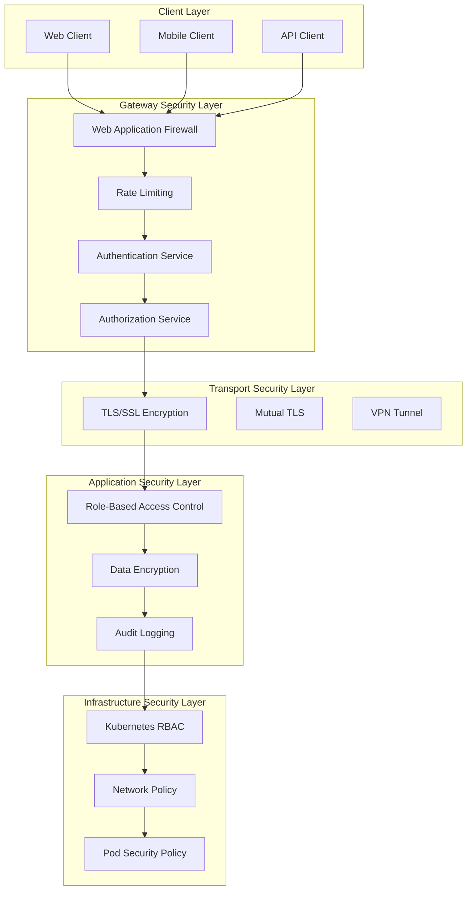
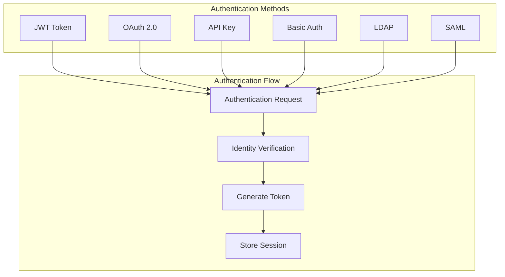
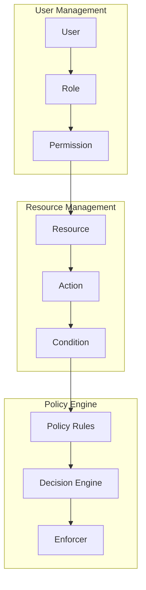
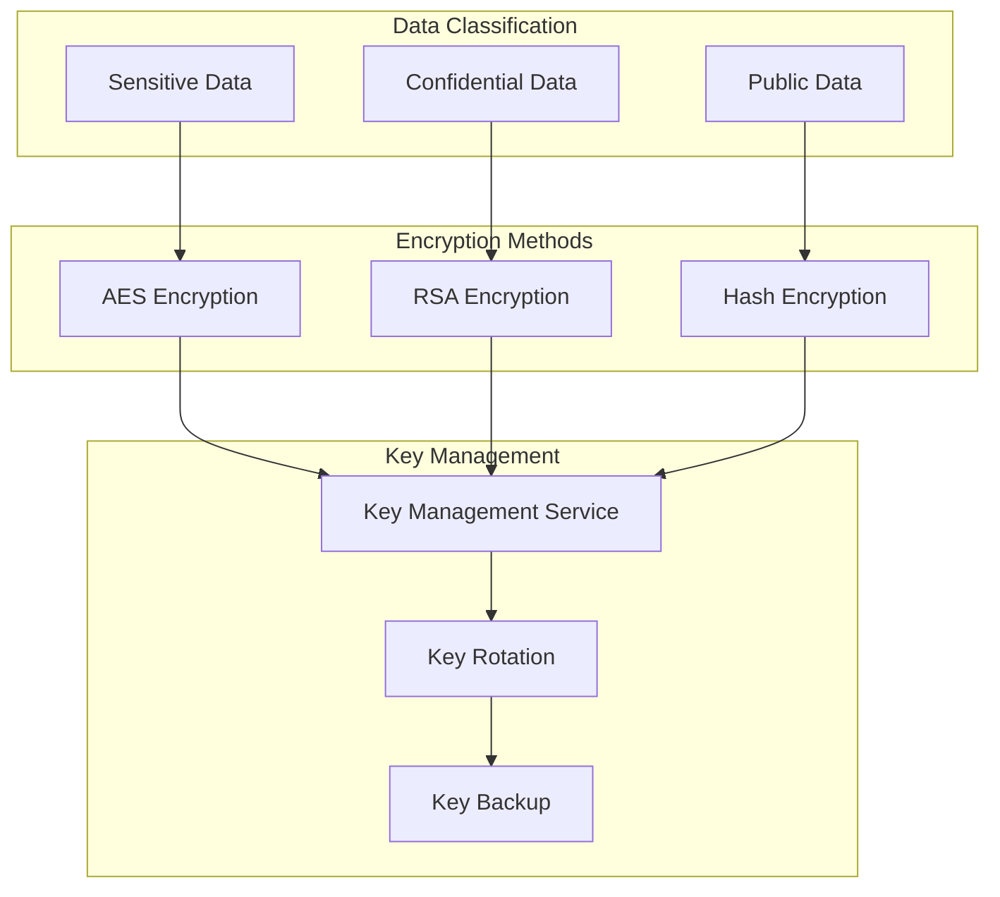
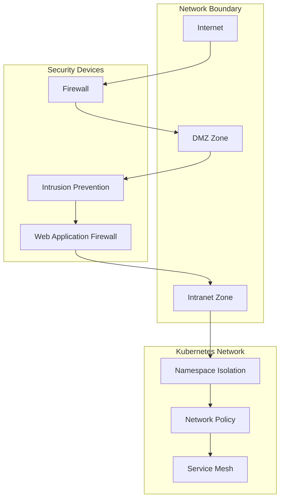
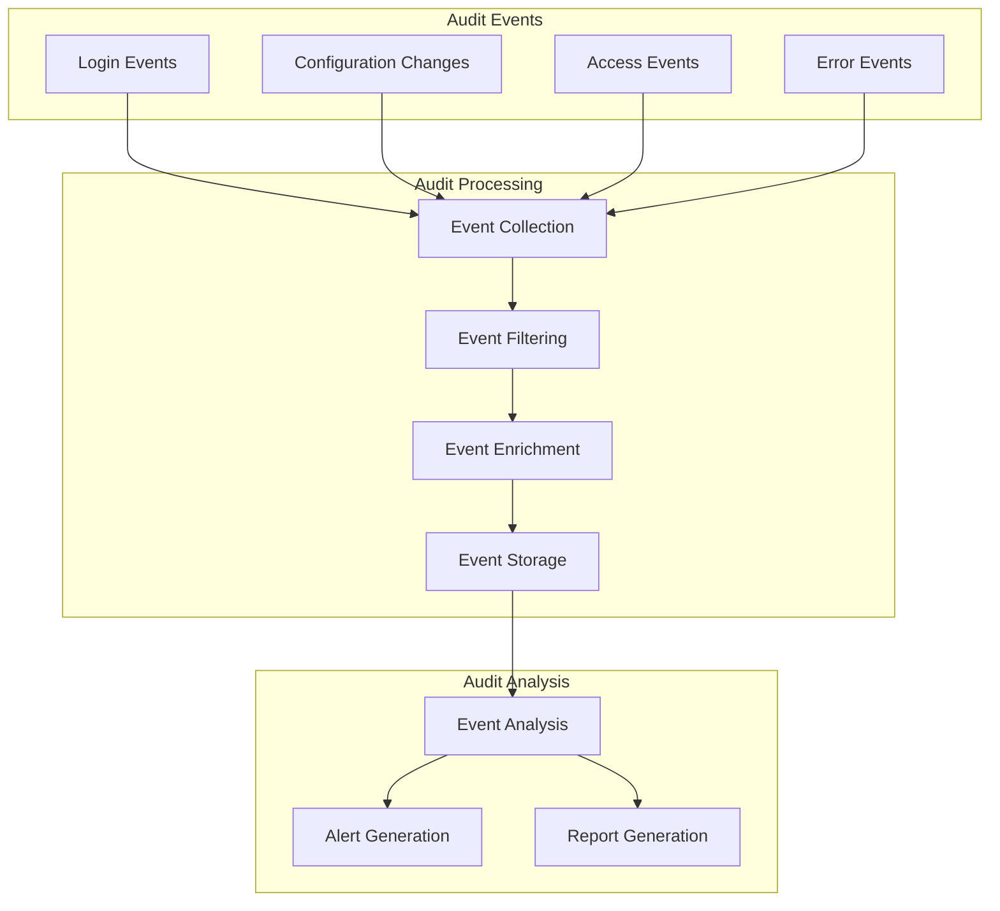

# TiGateway Security Architecture

## Overview

TiGateway adopts a multi-layer security architecture design, providing comprehensive security protection mechanisms including authentication, authorization, data encryption, network security, and more. This document details TiGateway's security architecture design and implementation.

## Security Architecture Overview



## Authentication Architecture

### 1. Multi-Authentication Method Support


### 2. JWT Authentication Implementation
```java
@Component
public class JwtAuthenticationFilter implements GlobalFilter, Ordered {
    
    @Override
    public Mono<Void> filter(ServerWebExchange exchange, GatewayFilterChain chain) {
        ServerHttpRequest request = exchange.getRequest();
        String token = extractToken(request);
        
        if (token != null) {
            return validateToken(token)
                .flatMap(claims -> {
                    // Set user context
                    setUserContext(exchange, claims);
                    return chain.filter(exchange);
                })
                .onErrorResume(e -> {
                    // Handle authentication failure
                    return handleAuthenticationError(exchange, e);
                });
        }
        
        return chain.filter(exchange);
    }
    
    private Mono<Claims> validateToken(String token) {
        try {
            Claims claims = Jwts.parser()
                .setSigningKey(jwtSecret)
                .parseClaimsJws(token)
                .getBody();
            return Mono.just(claims);
        } catch (Exception e) {
            return Mono.error(new AuthenticationException("Invalid token"));
        }
    }
}
```

### 3. OAuth 2.0 Integration
```yaml
spring:
  security:
    oauth2:
      client:
        provider:
          sso:
            issuer-uri: ${SSO_ISSUER_URI}
            authorization-uri: ${SSO_AUTHORIZATION_URI}
            token-uri: ${SSO_TOKEN_URI}
            user-info-uri: ${SSO_USER_INFO_URI}
        registration:
          sso:
            client-id: ${SSO_CLIENT_ID}
            client-secret: ${SSO_CLIENT_SECRET}
            scope: openid,profile,email
            authorization-grant-type: authorization_code
            redirect-uri: "{baseUrl}/login/oauth2/code/{registrationId}"

sso:
  roles-attribute-name: roles
  groups-attribute-name: groups
```

## Authorization Architecture

### 1. Role-Based Access Control (RBAC)


### 2. Permission Model Design
```java
@Entity
public class User {
    @Id
    private String id;
    private String username;
    private String email;
    
    @ManyToMany
    private Set<Role> roles;
    
    public boolean hasPermission(String resource, String action) {
        return roles.stream()
            .anyMatch(role -> role.hasPermission(resource, action));
    }
}

@Entity
public class Role {
    @Id
    private String id;
    private String name;
    private String description;
    
    @ManyToMany
    private Set<Permission> permissions;
    
    public boolean hasPermission(String resource, String action) {
        return permissions.stream()
            .anyMatch(permission -> 
                permission.getResource().equals(resource) && 
                permission.getAction().equals(action));
    }
}

@Entity
public class Permission {
    @Id
    private String id;
    private String resource;  // Resource type: route, config, user
    private String action;    // Action type: read, write, delete
    private String condition; // Condition expression
}
```

### 3. Policy Enforcement Point
```java
@Component
public class PolicyEnforcementPoint {
    
    public Mono<Boolean> checkPermission(String userId, String resource, String action) {
        return userService.findById(userId)
            .flatMap(user -> {
                // Check user permissions
                if (user.hasPermission(resource, action)) {
                    return Mono.just(true);
                }
                
                // Check dynamic policies
                return policyEngine.evaluate(user, resource, action);
            });
    }
    
    public Mono<Void> enforcePolicy(ServerWebExchange exchange, String resource, String action) {
        String userId = getCurrentUserId(exchange);
        
        return checkPermission(userId, resource, action)
            .flatMap(hasPermission -> {
                if (hasPermission) {
                    return Mono.empty();
                } else {
                    return Mono.error(new AccessDeniedException("Access denied"));
                }
            });
    }
}
```

## Data Security

### 1. Data Encryption Architecture


### 2. Sensitive Data Encryption
```java
@Component
public class DataEncryptionService {
    
    @Value("${encryption.key}")
    private String encryptionKey;
    
    public String encrypt(String plainText) {
        try {
            Cipher cipher = Cipher.getInstance("AES/GCM/NoPadding");
            SecretKeySpec keySpec = new SecretKeySpec(
                encryptionKey.getBytes(), "AES");
            cipher.init(Cipher.ENCRYPT_MODE, keySpec);
            
            byte[] encrypted = cipher.doFinal(plainText.getBytes());
            return Base64.getEncoder().encodeToString(encrypted);
        } catch (Exception e) {
            throw new EncryptionException("Failed to encrypt data", e);
        }
    }
    
    public String decrypt(String encryptedText) {
        try {
            Cipher cipher = Cipher.getInstance("AES/GCM/NoPadding");
            SecretKeySpec keySpec = new SecretKeySpec(
                encryptionKey.getBytes(), "AES");
            cipher.init(Cipher.DECRYPT_MODE, keySpec);
            
            byte[] decoded = Base64.getDecoder().decode(encryptedText);
            byte[] decrypted = cipher.doFinal(decoded);
            return new String(decrypted);
        } catch (Exception e) {
            throw new EncryptionException("Failed to decrypt data", e);
        }
    }
}
```

### 3. Configuration Data Protection
```java
@Component
public class ConfigDataProtection {
    
    @Autowired
    private DataEncryptionService encryptionService;
    
    public void protectSensitiveConfig(ConfigMap configMap) {
        Map<String, String> data = configMap.getData();
        
        // Identify sensitive configuration items
        Set<String> sensitiveKeys = identifySensitiveKeys(data);
        
        // Encrypt sensitive data
        sensitiveKeys.forEach(key -> {
            String value = data.get(key);
            String encryptedValue = encryptionService.encrypt(value);
            data.put(key, encryptedValue);
        });
        
        // Add encryption marker
        data.put("_encrypted_keys", String.join(",", sensitiveKeys));
    }
    
    private Set<String> identifySensitiveKeys(Map<String, String> data) {
        return data.keySet().stream()
            .filter(key -> key.toLowerCase().contains("password") ||
                          key.toLowerCase().contains("secret") ||
                          key.toLowerCase().contains("token") ||
                          key.toLowerCase().contains("key"))
            .collect(Collectors.toSet());
    }
}
```

## Network Security

### 1. Network Isolation Architecture


### 2. Kubernetes Network Policy
```yaml
apiVersion: networking.k8s.io/v1
kind: NetworkPolicy
metadata:
  name: tigateway-network-policy
  namespace: tigateway
spec:
  podSelector:
    matchLabels:
      app: tigateway
  policyTypes:
  - Ingress
  - Egress
  ingress:
  - from:
    - namespaceSelector:
        matchLabels:
          name: frontend
    - podSelector:
        matchLabels:
          app: admin
    ports:
    - protocol: TCP
      port: 8080
    - protocol: TCP
      port: 8081
  egress:
  - to:
    - namespaceSelector:
        matchLabels:
          name: backend
    ports:
    - protocol: TCP
      port: 8080
  - to: []
    ports:
    - protocol: TCP
      port: 53
    - protocol: UDP
      port: 53
```

### 3. TLS Configuration
```yaml
apiVersion: v1
kind: Secret
metadata:
  name: tigateway-tls
  namespace: tigateway
type: kubernetes.io/tls
data:
  tls.crt: <base64-encoded-cert>
  tls.key: <base64-encoded-key>

---
apiVersion: networking.k8s.io/v1
kind: Ingress
metadata:
  name: tigateway-ingress
  namespace: tigateway
  annotations:
    nginx.ingress.kubernetes.io/ssl-redirect: "true"
    nginx.ingress.kubernetes.io/force-ssl-redirect: "true"
spec:
  tls:
  - hosts:
    - gateway.example.com
    secretName: tigateway-tls
  rules:
  - host: gateway.example.com
    http:
      paths:
      - path: /
        pathType: Prefix
        backend:
          service:
            name: tigateway
            port:
              number: 8080
```

## Audit and Monitoring

### 1. Security Audit Architecture


### 2. Audit Log Implementation
```java
@Component
public class SecurityAuditLogger {
    
    private static final Logger auditLogger = LoggerFactory.getLogger("SECURITY_AUDIT");
    
    public void logAuthentication(String userId, String result, String details) {
        AuditEvent event = AuditEvent.builder()
            .eventType("AUTHENTICATION")
            .userId(userId)
            .result(result)
            .details(details)
            .timestamp(Instant.now())
            .sourceIp(getCurrentIp())
            .userAgent(getCurrentUserAgent())
            .build();
            
        auditLogger.info("AUTHENTICATION: {}", event);
    }
    
    public void logAuthorization(String userId, String resource, String action, String result) {
        AuditEvent event = AuditEvent.builder()
            .eventType("AUTHORIZATION")
            .userId(userId)
            .resource(resource)
            .action(action)
            .result(result)
            .timestamp(Instant.now())
            .sourceIp(getCurrentIp())
            .build();
            
        auditLogger.info("AUTHORIZATION: {}", event);
    }
    
    public void logConfigurationChange(String userId, String configType, String change) {
        AuditEvent event = AuditEvent.builder()
            .eventType("CONFIG_CHANGE")
            .userId(userId)
            .resource(configType)
            .action("MODIFY")
            .details(change)
            .timestamp(Instant.now())
            .build();
            
        auditLogger.info("CONFIG_CHANGE: {}", event);
    }
}
```

### 3. Security Monitoring Alerts
```java
@Component
public class SecurityMonitoringService {
    
    @EventListener
    public void handleSecurityEvent(SecurityEvent event) {
        // Check if alert is needed
        if (shouldAlert(event)) {
            sendAlert(event);
        }
        
        // Update security metrics
        updateSecurityMetrics(event);
    }
    
    private boolean shouldAlert(SecurityEvent event) {
        switch (event.getType()) {
            case FAILED_LOGIN:
                return checkFailedLoginThreshold(event);
            case SUSPICIOUS_ACCESS:
                return true;
            case CONFIG_CHANGE:
                return checkConfigChangeRisk(event);
            default:
                return false;
        }
    }
    
    private void sendAlert(SecurityEvent event) {
        Alert alert = Alert.builder()
            .severity(event.getSeverity())
            .title("Security Alert: " + event.getType())
            .description(event.getDescription())
            .timestamp(Instant.now())
            .build();
            
        alertService.sendAlert(alert);
    }
}
```

## Compliance Requirements

### 1. Data Protection Compliance
```java
@Component
public class DataProtectionCompliance {
    
    public void ensureDataRetention(String dataType, Duration retentionPeriod) {
        // Check data retention period
        List<DataRecord> expiredRecords = findExpiredRecords(dataType, retentionPeriod);
        
        // Delete expired data
        expiredRecords.forEach(record -> {
            if (isPersonalData(record)) {
                anonymizeData(record);
            } else {
                deleteData(record);
            }
        });
    }
    
    public void handleDataSubjectRequest(String subjectId, String requestType) {
        switch (requestType) {
            case "ACCESS":
                provideDataAccess(subjectId);
                break;
            case "PORTABILITY":
                provideDataPortability(subjectId);
                break;
            case "ERASURE":
                performDataErasure(subjectId);
                break;
            case "RECTIFICATION":
                performDataRectification(subjectId);
                break;
        }
    }
}
```

### 2. Security Baseline Configuration
```yaml
# Security baseline configuration
security:
  baseline:
    # Password policy
    password:
      min-length: 12
      require-uppercase: true
      require-lowercase: true
      require-numbers: true
      require-special-chars: true
      max-age-days: 90
    
    # Session management
    session:
      timeout-minutes: 30
      max-concurrent-sessions: 5
      secure-cookies: true
      http-only-cookies: true
    
    # Encryption requirements
    encryption:
      min-key-size: 2048
      allowed-algorithms: ["AES-256", "RSA-2048"]
      require-tls: true
      tls-min-version: "1.2"
    
    # Audit requirements
    audit:
      log-all-access: true
      log-config-changes: true
      log-security-events: true
      retention-days: 2555  # 7 years
```

## Security Testing

### 1. Security Testing Strategy
```java
@SpringBootTest
@TestPropertySource(properties = {
    "security.testing.enabled=true"
})
class SecurityIntegrationTest {
    
    @Test
    void shouldRejectInvalidJwtToken() {
        // Test invalid JWT Token
        webTestClient.get()
            .uri("/api/secure")
            .header("Authorization", "Bearer invalid-token")
            .exchange()
            .expectStatus().isUnauthorized();
    }
    
    @Test
    void shouldEnforceRateLimit() {
        // Test rate limiting functionality
        for (int i = 0; i < 100; i++) {
            webTestClient.get()
                .uri("/api/limited")
                .exchange()
                .expectStatus().isOk();
        }
        
        // Should be rejected when exceeding limit
        webTestClient.get()
            .uri("/api/limited")
            .exchange()
            .expectStatus().isEqualTo(HttpStatus.TOO_MANY_REQUESTS);
    }
    
    @Test
    void shouldLogSecurityEvents() {
        // Test security event logging
        webTestClient.post()
            .uri("/api/login")
            .bodyValue("{\"username\":\"invalid\",\"password\":\"wrong\"}")
            .exchange()
            .expectStatus().isUnauthorized();
            
        // Verify audit log
        verify(auditLogger).info(contains("FAILED_LOGIN"));
    }
}
```

### 2. Penetration Testing Checklist
```markdown
## Security Testing Checklist

### Authentication Security
- [ ] Password strength validation
- [ ] Account lockout mechanism
- [ ] Session timeout handling
- [ ] Multi-factor authentication
- [ ] Secure password reset

### Authorization Security
- [ ] Principle of least privilege
- [ ] Vertical privilege escalation protection
- [ ] Horizontal privilege escalation protection
- [ ] Resource access control
- [ ] API permission verification

### Data Security
- [ ] Sensitive data encryption
- [ ] Data transmission encryption
- [ ] Data storage encryption
- [ ] Key management security
- [ ] Data masking

### Network Security
- [ ] TLS configuration security
- [ ] Network isolation
- [ ] Firewall rules
- [ ] DDoS protection
- [ ] Intrusion detection

### Application Security
- [ ] Input validation
- [ ] Output encoding
- [ ] SQL injection protection
- [ ] XSS protection
- [ ] CSRF protection
```

---

**Related Documentation**:
- [System Architecture](./system-architecture.md)
- [Data Flow Design](./data-flow.md)
- [Module Design](./module-design.md)