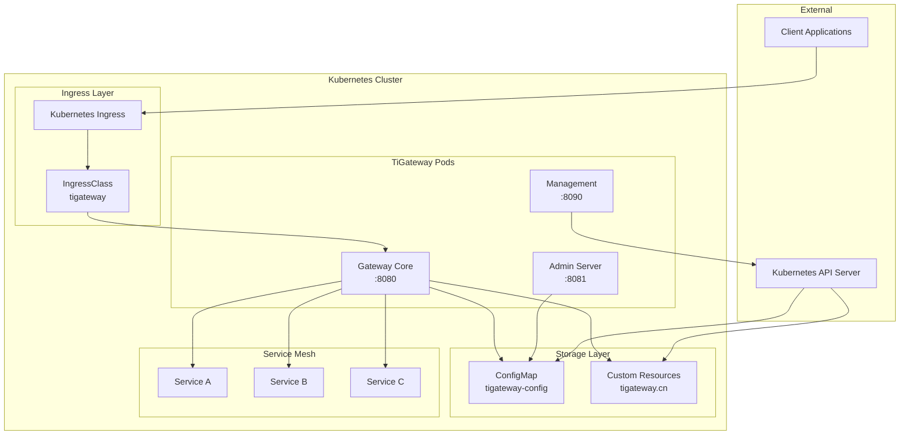
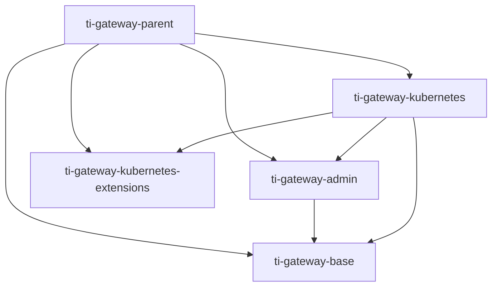

# TiGateway System Architecture

## Overview

TiGateway is a Kubernetes-native API gateway solution based on Spring Cloud Gateway, designed with cloud-native architecture to support dynamic routing, service discovery, and configuration management.

## Overall Architecture



## Core Components

### 1. Gateway Core (Port 8080)
- **Function**: Main gateway service, handling all inbound requests
- **Technology Stack**: Spring Cloud Gateway + WebFlux
- **Features**:
  - Dynamic route configuration
  - Load balancing
  - Circuit breaker
  - Rate limiting
  - Authentication and authorization

### 2. Admin Server (Port 8081)
- **Function**: Management interface and API, providing Web UI and REST API
- **Technology Stack**: Spring Boot + Thymeleaf + WebFlux
- **Features**:
  - Route management interface
  - Configuration management
  - Monitoring dashboard
  - User management

### 3. Management Endpoints (Port 8090)
- **Function**: Monitoring, health checks, and operational endpoints
- **Technology Stack**: Spring Boot Actuator
- **Features**:
  - Health checks
  - Metrics collection
  - Configuration viewing
  - Log management

## Data Storage Architecture

### ConfigMap Storage
```yaml
apiVersion: v1
kind: ConfigMap
metadata:
  name: tigateway-app-config
data:
  application.yml: |
    spring:
      cloud:
        gateway:
          routes:
            - id: user-service
              uri: lb://user-service
              predicates:
                - Path=/api/users/**
```

### Custom Resource Definitions (CRD)
```yaml
apiVersion: tigateway.cn/v1
kind: TiGateway
metadata:
  name: tigateway-instance
spec:
  replicas: 3
  image: tigateway:latest
```

## Module Architecture

### Module Dependencies


### Module Responsibilities

#### ti-gateway-base
- **Responsibility**: Base functionality module
- **Contains**:
  - ConfigMap storage implementation
  - Data model definitions
  - YAML Schema validation
  - Common utility classes

#### ti-gateway-admin
- **Responsibility**: Management interface module
- **Contains**:
  - Web UI interface
  - REST API endpoints
  - Management service logic
  - User interface components

#### ti-gateway-kubernetes
- **Responsibility**: Kubernetes integration module
- **Contains**:
  - Main application entry point
  - Ingress controller
  - Service discovery integration
  - Kubernetes client

#### ti-gateway-kubernetes-extensions
- **Responsibility**: Extension functionality module
- **Contains**:
  - Custom extensions
  - Plugin mechanism
  - Third-party integrations

## Network Architecture

### Port Allocation
- **8080**: Main gateway service
- **8081**: Admin management interface
- **8090**: Management monitoring endpoints

### Service Discovery
```yaml
spring:
  cloud:
    kubernetes:
      discovery:
        enabled: true
        namespace: default
      config:
        enabled: true
        name: tigateway-config
```

### Load Balancing
- Uses Spring Cloud LoadBalancer
- Supports multiple load balancing strategies
- Integrates with Kubernetes Service

## Security Architecture

### Authentication and Authorization
```yaml
spring:
  security:
    oauth2:
      client:
        provider:
          sso:
            issuer-uri: ${SSO_ISSUER_URI}
```

### RBAC Configuration
```yaml
apiVersion: rbac.authorization.k8s.io/v1
kind: Role
metadata:
  name: tigateway-role
rules:
  - apiGroups: [""]
    resources: ["configmaps", "services"]
    verbs: ["get", "list", "watch"]
```

## Scalability Design

### Horizontal Scaling
- Supports multi-replica deployment
- Stateless design
- Auto-scaling

### Plugin Mechanism
- Supports custom filters
- Extensible routing strategies
- Third-party integration interfaces

## Monitoring Architecture

### Metrics Collection
- Prometheus metrics
- Custom business metrics
- JVM monitoring metrics

### Log Management
- Structured logging
- Log aggregation
- Distributed tracing

## Deployment Architecture

### Kubernetes Deployment
```yaml
apiVersion: apps/v1
kind: Deployment
metadata:
  name: tigateway
spec:
  replicas: 3
  selector:
    matchLabels:
      app: tigateway
  template:
    metadata:
      labels:
        app: tigateway
    spec:
      containers:
      - name: tigateway
        image: tigateway:latest
        ports:
        - containerPort: 8080
        - containerPort: 8081
        - containerPort: 8090
```

### Helm Chart Structure
```
helm/
├── gateway/
│   ├── Chart.yaml
│   ├── values.yaml
│   └── templates/
│       ├── deployment.yaml
│       ├── service.yaml
│       ├── configmap.yaml
│       └── rbac.yaml
└── tigateway-crds/
    ├── Chart.yaml
    ├── values.yaml
    └── templates/
        ├── tigateway-crd.yaml
        ├── tigateway-mapping-crd.yaml
        └── ingressclass.yaml
```

## Performance Optimization

### Caching Strategy
- Route configuration caching
- Service discovery caching
- Configuration hot updates

### Connection Pool
- HTTP connection pool
- Kubernetes API connection pool
- Database connection pool

## Fault Recovery

### Health Checks
```yaml
livenessProbe:
  httpGet:
    path: /actuator/health
    port: 8090
  initialDelaySeconds: 30
  periodSeconds: 10

readinessProbe:
  httpGet:
    path: /actuator/health/readiness
    port: 8090
  initialDelaySeconds: 5
  periodSeconds: 5
```

### Failover
- Automatic retry mechanism
- Circuit breaker protection
- Degradation strategies

---

**Related Documentation**:
- [Module Design](./module-design.md)
- [Data Flow Design](./data-flow.md)
- [Security Architecture](./security.md)
