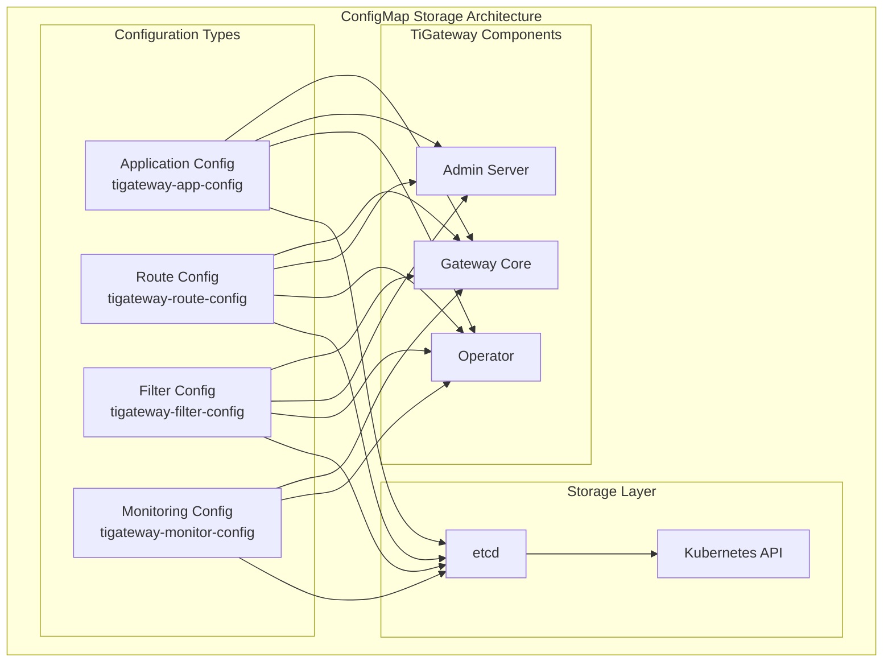

# ConfigMap Storage

TiGateway uses Kubernetes ConfigMap as the primary configuration storage mechanism, providing a cloud-native configuration management solution.

## ConfigMap Storage Overview

### Storage Architecture



### Storage Features

- **Cloud Native**: Based on Kubernetes native ConfigMap resources
- **Version Management**: Supports configuration version management and rollback
- **Hot Updates**: Supports hot configuration updates without service restart
- **Multi-format Support**: Supports YAML, JSON, Properties, and other formats
- **Validation Mechanism**: Provides configuration validation and Schema checking
- **Backup and Recovery**: Supports configuration backup and recovery

## ConfigMap Structure Design

### 1. Application Configuration ConfigMap

```yaml
apiVersion: v1
kind: ConfigMap
metadata:
  name: tigateway-app-config
  namespace: tigateway
  labels:
    app: tigateway
    component: config
    type: application
data:
  application.yml: |
    server:
      port: 8080
      servlet:
        context-path: /
    
    spring:
      application:
        name: tigateway
      cloud:
        gateway:
          discovery:
            locator:
              enabled: true
              lower-case-service-id: true
          httpclient:
            connect-timeout: 1000
            response-timeout: 5s
            pool:
              max-connections: 500
              max-idle-time: 30s
          metrics:
            enabled: true
            tags:
              application: tigateway
      
      security:
        oauth2:
          client:
            registration:
              gateway:
                client-id: tigateway
                client-secret: ${OAUTH2_CLIENT_SECRET}
                authorization-grant-type: client_credentials
                scope: read,write
            provider:
              gateway:
                token-uri: ${OAUTH2_TOKEN_URI}
    
    management:
      endpoints:
        web:
          exposure:
            include: health,info,metrics,prometheus,gateway
      endpoint:
        health:
          show-details: always
      metrics:
        export:
          prometheus:
            enabled: true
    
    logging:
      level:
        ti.gateway: INFO
        org.springframework.cloud.gateway: DEBUG
      pattern:
        console: "%d{yyyy-MM-dd HH:mm:ss} [%thread] %-5level %logger{36} - %msg%n"
  
  application-dev.yml: |
    server:
      port: 8080
    
    spring:
      cloud:
        gateway:
          discovery:
            locator:
              enabled: true
          httpclient:
            connect-timeout: 5000
            response-timeout: 30s
    
    logging:
      level:
        ti.gateway: DEBUG
        org.springframework.cloud.gateway: TRACE
  
  application-prod.yml: |
    server:
      port: 8080
    
    spring:
      cloud:
        gateway:
          discovery:
            locator:
              enabled: true
          httpclient:
            connect-timeout: 1000
            response-timeout: 5s
            pool:
              max-connections: 1000
              max-idle-time: 30s
    
    logging:
      level:
        ti.gateway: WARN
        org.springframework.cloud.gateway: INFO
```

### 2. Route Configuration ConfigMap

```yaml
apiVersion: v1
kind: ConfigMap
metadata:
  name: tigateway-route-config
  namespace: tigateway
  labels:
    app: tigateway
    component: config
    type: routes
data:
  routes.yaml: |
    spring:
      cloud:
        gateway:
          routes:
          - id: user-service
            uri: lb://user-service
            predicates:
            - Path=/api/users/**
            filters:
            - StripPrefix=2
            - AddRequestHeader=X-Gateway, TiGateway
            - CircuitBreaker=user-service
            metadata:
              description: "User service route"
              version: "v1"
              tags:
              - "user"
              - "api"
          
          - id: order-service
            uri: lb://order-service
            predicates:
            - Path=/api/orders/**
            filters:
            - StripPrefix=2
            - AddRequestHeader=X-Gateway, TiGateway
            - CircuitBreaker=order-service
            - Retry=3,INTERNAL_SERVER_ERROR,GET,10ms,50ms,2,false
            metadata:
              description: "Order service route"
              version: "v1"
              tags:
              - "order"
              - "api"
          
          - id: payment-service
            uri: lb://payment-service
            predicates:
            - Path=/api/payments/**
            - Method=POST,PUT
            filters:
            - StripPrefix=2
            - AddRequestHeader=X-Gateway, TiGateway
            - RequestRateLimiter=10,20,1,#{@userKeyResolver}
            metadata:
              description: "Payment service route"
              version: "v1"
              tags:
              - "payment"
              - "api"
              - "secure"
  
  routes-dev.yaml: |
    spring:
      cloud:
        gateway:
          routes:
          - id: user-service-dev
            uri: lb://user-service-dev
            predicates:
            - Path=/api/users/**
            filters:
            - StripPrefix=2
            - AddRequestHeader=X-Gateway, TiGateway-Dev
  
  routes-prod.yaml: |
    spring:
      cloud:
        gateway:
          routes:
          - id: user-service-prod
            uri: lb://user-service-prod
            predicates:
            - Path=/api/users/**
            filters:
            - StripPrefix=2
            - AddRequestHeader=X-Gateway, TiGateway-Prod
            - CircuitBreaker=user-service-prod
            - RequestRateLimiter=100,200,1,#{@userKeyResolver}
```

### 3. Filter Configuration ConfigMap

```yaml
apiVersion: v1
kind: ConfigMap
metadata:
  name: tigateway-filter-config
  namespace: tigateway
  labels:
    app: tigateway
    component: config
    type: filters
data:
  filters.yaml: |
    spring:
      cloud:
        gateway:
          default-filters:
          - AddResponseHeader=X-Response-Default-Foo, Default-Bar
          - AddResponseHeader=X-Response-Time, ${response.time}
          - DedupeResponseHeader=Access-Control-Allow-Credentials Access-Control-Allow-Origin
          
          filter:
            request-rate-limiter:
              deny-empty-key: false
              empty-key-status-code: 429
              key-resolver: "#{@userKeyResolver}"
            
            secure-headers:
              xss-protection-header: "1; mode=block"
              strict-transport-security: "max-age=631138519"
              frame-options: "DENY"
              content-type-options: "nosniff"
              referrer-policy: "no-referrer"
              content-security-policy: "default-src 'self' https:; font-src 'self' https: data:; img-src 'self' https: data:; object-src 'none'; script-src https:; style-src 'self' https: 'unsafe-inline'"
              download-options: "noopen"
              permitted-cross-domain-policies: "none"
            
            circuit-breaker:
              name: default-circuit-breaker
              fallback-uri: forward:/fallback
              status-codes:
              - 500
              - "BAD_GATEWAY"
              - "SERVICE_UNAVAILABLE"
  
  global-filters.yaml: |
    spring:
      cloud:
        gateway:
          global-filters:
          - name: RequestLogging
            args:
              level: INFO
            order: -1000
          - name: RequestId
            args:
              header-name: X-Request-ID
            order: -999
          - name: Authentication
            args:
              type: jwt
              secret: ${JWT_SECRET}
            order: -100
          - name: RateLimit
            args:
              requests-per-minute: 100
              burst-capacity: 200
            order: -50
```

### 4. Monitoring Configuration ConfigMap

```yaml
apiVersion: v1
kind: ConfigMap
metadata:
  name: tigateway-monitor-config
  namespace: tigateway
  labels:
    app: tigateway
    component: config
    type: monitoring
data:
  monitoring.yml: |
    management:
      endpoints:
        web:
          exposure:
            include: "*"
          base-path: /actuator
      
      endpoint:
        health:
          show-details: always
          show-components: always
          probes:
            enabled: true
        info:
          enabled: true
        metrics:
          enabled: true
        prometheus:
          enabled: true
        gateway:
          enabled: true
      
      health:
        defaults:
          enabled: true
        circuitbreakers:
          enabled: true
        diskspace:
          enabled: true
        redis:
          enabled: true
        db:
          enabled: true
      
      metrics:
        export:
          prometheus:
            enabled: true
            step: 10s
            descriptions: true
        distribution:
          percentiles-histogram:
            http.server.requests: true
          percentiles:
            http.server.requests: 0.5, 0.9, 0.95, 0.99
          slo:
            http.server.requests: 50ms, 100ms, 200ms, 500ms
      
      tracing:
        sampling:
          probability: 1.0
        zipkin:
          endpoint: http://zipkin:9411/api/v2/spans
  
  prometheus.yml: |
    global:
      scrape_interval: 15s
      evaluation_interval: 15s
    
    scrape_configs:
    - job_name: 'tigateway'
      static_configs:
      - targets: ['tigateway:8090']
      metrics_path: '/actuator/prometheus'
      scrape_interval: 5s
      scrape_timeout: 10s
```

## ConfigMap Management Service

### 1. ConfigMap Service

```java
@Service
public class ConfigMapService {
    
    @Autowired
    private KubernetesClient kubernetesClient;
    
    @Autowired
    private ConfigMapWatcher configMapWatcher;
    
    private final Map<String, ConfigMap> configMaps = new ConcurrentHashMap<>();
    
    @PostConstruct
    public void init() {
        // Initialize ConfigMap cache
        loadConfigMaps();
        
        // Start ConfigMap watcher
        startConfigMapWatcher();
    }
    
    public void loadConfigMaps() {
        try {
            List<ConfigMap> configMapList = kubernetesClient.configMaps()
                .inNamespace("tigateway")
                .withLabels(Map.of("app", "tigateway", "component", "config"))
                .list()
                .getItems();
            
            for (ConfigMap configMap : configMapList) {
                configMaps.put(configMap.getMetadata().getName(), configMap);
            }
            
            log.info("Loaded {} ConfigMaps", configMaps.size());
        } catch (Exception e) {
            log.error("Failed to load ConfigMaps", e);
        }
    }
    
    public void startConfigMapWatcher() {
        kubernetesClient.configMaps()
            .inNamespace("tigateway")
            .withLabels(Map.of("app", "tigateway", "component", "config"))
            .watch(new Watcher<ConfigMap>() {
                @Override
                public void eventReceived(Action action, ConfigMap configMap) {
                    handleConfigMapChange(action, configMap);
                }
                
                @Override
                public void onClose(WatcherException cause) {
                    log.error("ConfigMap watcher closed", cause);
                    // Restart watcher
                    startConfigMapWatcher();
                }
            });
    }
    
    private void handleConfigMapChange(Action action, ConfigMap configMap) {
        String configMapName = configMap.getMetadata().getName();
        
        log.info("ConfigMap {} changed: {}", configMapName, action);
        
        switch (action) {
            case ADDED:
            case MODIFIED:
                configMaps.put(configMapName, configMap);
                configMapWatcher.handleConfigMapChange(configMap);
                break;
            case DELETED:
                configMaps.remove(configMapName);
                configMapWatcher.handleConfigMapDeleted(configMapName);
                break;
        }
    }
    
    public ConfigMap getConfigMap(String name) {
        return configMaps.get(name);
    }
    
    public Map<String, ConfigMap> getAllConfigMaps() {
        return new HashMap<>(configMaps);
    }
    
    public String getConfigValue(String configMapName, String key) {
        ConfigMap configMap = configMaps.get(configMapName);
        if (configMap != null && configMap.getData() != null) {
            return configMap.getData().get(key);
        }
        return null;
    }
    
    public void updateConfigMap(String name, Map<String, String> data) {
        try {
            ConfigMap configMap = configMaps.get(name);
            if (configMap == null) {
                // Create new ConfigMap
                configMap = new ConfigMapBuilder()
                    .withNewMetadata()
                        .withName(name)
                        .withNamespace("tigateway")
                        .addToLabels("app", "tigateway")
                        .addToLabels("component", "config")
                    .endMetadata()
                    .withData(data)
                    .build();
            } else {
                // Update existing ConfigMap
                configMap.setData(data);
            }
            
            kubernetesClient.configMaps()
                .inNamespace("tigateway")
                .createOrReplace(configMap);
                
            log.info("Updated ConfigMap: {}", name);
        } catch (Exception e) {
            log.error("Failed to update ConfigMap: {}", name, e);
            throw new RuntimeException("Failed to update ConfigMap", e);
        }
    }
    
    public void deleteConfigMap(String name) {
        try {
            kubernetesClient.configMaps()
                .inNamespace("tigateway")
                .withName(name)
                .delete();
                
            configMaps.remove(name);
            log.info("Deleted ConfigMap: {}", name);
        } catch (Exception e) {
            log.error("Failed to delete ConfigMap: {}", name, e);
            throw new RuntimeException("Failed to delete ConfigMap", e);
        }
    }
}
```

### 2. ConfigMap Watcher

```java
@Component
public class ConfigMapWatcher {
    
    @Autowired
    private ConfigurationReloader configurationReloader;
    
    @Autowired
    private ConfigurationValidator configurationValidator;
    
    @Autowired
    private ApplicationEventPublisher eventPublisher;
    
    public void handleConfigMapChange(ConfigMap configMap) {
        String configMapName = configMap.getMetadata().getName();
        Map<String, String> data = configMap.getData();
        
        log.info("Handling ConfigMap change: {}", configMapName);
        
        try {
            // Validate configuration
            if (!validateConfiguration(configMapName, data)) {
                log.error("Invalid configuration in ConfigMap: {}", configMapName);
                return;
            }
            
            // Reload configuration
            configurationReloader.reloadConfiguration(configMapName, data);
            
            // Publish configuration change event
            eventPublisher.publishEvent(new ConfigurationChangeEvent(configMapName, data));
            
            log.info("Successfully processed ConfigMap change: {}", configMapName);
        } catch (Exception e) {
            log.error("Failed to process ConfigMap change: {}", configMapName, e);
        }
    }
    
    public void handleConfigMapDeleted(String configMapName) {
        log.info("Handling ConfigMap deletion: {}", configMapName);
        
        try {
            // Clean up configuration
            configurationReloader.cleanupConfiguration(configMapName);
            
            // Publish configuration delete event
            eventPublisher.publishEvent(new ConfigurationDeleteEvent(configMapName));
            
            log.info("Successfully processed ConfigMap deletion: {}", configMapName);
        } catch (Exception e) {
            log.error("Failed to process ConfigMap deletion: {}", configMapName, e);
        }
    }
    
    private boolean validateConfiguration(String configMapName, Map<String, String> data) {
        try {
            for (Map.Entry<String, String> entry : data.entrySet()) {
                String key = entry.getKey();
                String value = entry.getValue();
                
                // Validate based on configuration type
                if (key.endsWith(".yml") || key.endsWith(".yaml")) {
                    if (!configurationValidator.validateYaml(value)) {
                        log.error("Invalid YAML configuration in {}: {}", configMapName, key);
                        return false;
                    }
                } else if (key.endsWith(".json")) {
                    if (!configurationValidator.validateJson(value)) {
                        log.error("Invalid JSON configuration in {}: {}", configMapName, key);
                        return false;
                    }
                } else if (key.endsWith(".properties")) {
                    if (!configurationValidator.validateProperties(value)) {
                        log.error("Invalid Properties configuration in {}: {}", configMapName, key);
                        return false;
                    }
                }
            }
            
            return true;
        } catch (Exception e) {
            log.error("Failed to validate configuration: {}", configMapName, e);
            return false;
        }
    }
}
```

### 3. Configuration Reloader

```java
@Component
public class ConfigurationReloader {
    
    @Autowired
    private RouteDefinitionLocator routeDefinitionLocator;
    
    @Autowired
    private GatewayProperties gatewayProperties;
    
    @Autowired
    private ApplicationEventPublisher eventPublisher;
    
    private final Map<String, Object> configurationCache = new ConcurrentHashMap<>();
    
    public void reloadConfiguration(String configMapName, Map<String, String> data) {
        log.info("Reloading configuration for ConfigMap: {}", configMapName);
        
        try {
            // Cache configuration
            configurationCache.put(configMapName, data);
            
            // Reload based on configuration type
            switch (configMapName) {
                case "tigateway-app-config":
                    reloadApplicationConfiguration(data);
                    break;
                case "tigateway-route-config":
                    reloadRouteConfiguration(data);
                    break;
                case "tigateway-filter-config":
                    reloadFilterConfiguration(data);
                    break;
                case "tigateway-monitor-config":
                    reloadMonitorConfiguration(data);
                    break;
                default:
                    log.warn("Unknown ConfigMap type: {}", configMapName);
            }
            
            log.info("Successfully reloaded configuration for ConfigMap: {}", configMapName);
        } catch (Exception e) {
            log.error("Failed to reload configuration for ConfigMap: {}", configMapName, e);
            throw new RuntimeException("Failed to reload configuration", e);
        }
    }
    
    private void reloadApplicationConfiguration(Map<String, String> data) {
        // Reload application configuration
        String applicationYaml = data.get("application.yml");
        if (applicationYaml != null) {
            // Parse and apply configuration
            Yaml yaml = new Yaml();
            Object config = yaml.load(applicationYaml);
            applyApplicationConfiguration(config);
        }
    }
    
    private void reloadRouteConfiguration(Map<String, String> data) {
        // Reload route configuration
        String routesYaml = data.get("routes.yaml");
        if (routesYaml != null) {
            // Parse route configuration
            Yaml yaml = new Yaml();
            Object config = yaml.load(routesYaml);
            List<RouteDefinition> routes = extractRoutes(config);
            
            // Update routes
            updateRoutes(routes);
        }
    }
    
    private void reloadFilterConfiguration(Map<String, String> data) {
        // Reload filter configuration
        String filtersYaml = data.get("filters.yaml");
        if (filtersYaml != null) {
            // Parse filter configuration
            Yaml yaml = new Yaml();
            Object config = yaml.load(filtersYaml);
            applyFilterConfiguration(config);
        }
    }
    
    private void reloadMonitorConfiguration(Map<String, String> data) {
        // Reload monitoring configuration
        String monitoringYaml = data.get("monitoring.yml");
        if (monitoringYaml != null) {
            // Parse monitoring configuration
            Yaml yaml = new Yaml();
            Object config = yaml.load(monitoringYaml);
            applyMonitorConfiguration(config);
        }
    }
    
    private void applyApplicationConfiguration(Object config) {
        // Apply application configuration
        // Apply specific configuration items here
        log.info("Applying application configuration");
    }
    
    private List<RouteDefinition> extractRoutes(Object config) {
        List<RouteDefinition> routes = new ArrayList<>();
        
        if (config instanceof Map) {
            Map<String, Object> configMap = (Map<String, Object>) config;
            Map<String, Object> spring = (Map<String, Object>) configMap.get("spring");
            if (spring != null) {
                Map<String, Object> cloud = (Map<String, Object>) spring.get("cloud");
                if (cloud != null) {
                    Map<String, Object> gateway = (Map<String, Object>) cloud.get("gateway");
                    if (gateway != null) {
                        List<Map<String, Object>> routesList = (List<Map<String, Object>>) gateway.get("routes");
                        if (routesList != null) {
                            for (Map<String, Object> routeMap : routesList) {
                                RouteDefinition route = convertToRouteDefinition(routeMap);
                                routes.add(route);
                            }
                        }
                    }
                }
            }
        }
        
        return routes;
    }
    
    private RouteDefinition convertToRouteDefinition(Map<String, Object> routeMap) {
        RouteDefinition route = new RouteDefinition();
        
        route.setId((String) routeMap.get("id"));
        route.setUri((String) routeMap.get("uri"));
        
        // Convert predicates
        List<Map<String, Object>> predicatesList = (List<Map<String, Object>>) routeMap.get("predicates");
        if (predicatesList != null) {
            List<PredicateDefinition> predicates = new ArrayList<>();
            for (Map<String, Object> predicateMap : predicatesList) {
                PredicateDefinition predicate = new PredicateDefinition();
                predicate.setName((String) predicateMap.get("name"));
                Map<String, Object> args = (Map<String, Object>) predicateMap.get("args");
                if (args != null) {
                    predicate.setArgs(args);
                }
                predicates.add(predicate);
            }
            route.setPredicates(predicates);
        }
        
        // Convert filters
        List<Map<String, Object>> filtersList = (List<Map<String, Object>>) routeMap.get("filters");
        if (filtersList != null) {
            List<FilterDefinition> filters = new ArrayList<>();
            for (Map<String, Object> filterMap : filtersList) {
                FilterDefinition filter = new FilterDefinition();
                filter.setName((String) filterMap.get("name"));
                Map<String, Object> args = (Map<String, Object>) filterMap.get("args");
                if (args != null) {
                    filter.setArgs(args);
                }
                filters.add(filter);
            }
            route.setFilters(filters);
        }
        
        // Convert metadata
        Map<String, Object> metadata = (Map<String, Object>) routeMap.get("metadata");
        if (metadata != null) {
            route.setMetadata(metadata);
        }
        
        return route;
    }
    
    private void updateRoutes(List<RouteDefinition> routes) {
        // Update route configuration
        gatewayProperties.setRoutes(routes);
        
        // Publish route update event
        eventPublisher.publishEvent(new RoutesUpdatedEvent(routes));
        
        log.info("Updated {} routes", routes.size());
    }
    
    private void applyFilterConfiguration(Object config) {
        // Apply filter configuration
        log.info("Applying filter configuration");
    }
    
    private void applyMonitorConfiguration(Object config) {
        // Apply monitoring configuration
        log.info("Applying monitor configuration");
    }
    
    public void cleanupConfiguration(String configMapName) {
        configurationCache.remove(configMapName);
        log.info("Cleaned up configuration for ConfigMap: {}", configMapName);
    }
}
```

## ConfigMap Configuration Validation

### 1. Configuration Validator

```java
@Component
public class ConfigurationValidator {
    
    @Autowired
    private YamlSchemaValidator yamlSchemaValidator;
    
    @Autowired
    private JsonSchemaValidator jsonSchemaValidator;
    
    public boolean validateYaml(String yamlContent) {
        try {
            Yaml yaml = new Yaml();
            Object data = yaml.load(yamlContent);
            
            // Use Schema validation
            return yamlSchemaValidator.validate(data);
        } catch (Exception e) {
            log.error("Failed to validate YAML configuration", e);
            return false;
        }
    }
    
    public boolean validateJson(String jsonContent) {
        try {
            ObjectMapper mapper = new ObjectMapper();
            Object data = mapper.readValue(jsonContent, Object.class);
            
            // Use Schema validation
            return jsonSchemaValidator.validate(data);
        } catch (Exception e) {
            log.error("Failed to validate JSON configuration", e);
            return false;
        }
    }
    
    public boolean validateProperties(String propertiesContent) {
        try {
            Properties properties = new Properties();
            properties.load(new StringReader(propertiesContent));
            
            // Validate property format
            return validatePropertiesFormat(properties);
        } catch (Exception e) {
            log.error("Failed to validate Properties configuration", e);
            return false;
        }
    }
    
    private boolean validatePropertiesFormat(Properties properties) {
        // Validate property format
        for (String key : properties.stringPropertyNames()) {
            if (key == null || key.trim().isEmpty()) {
                return false;
            }
        }
        return true;
    }
}
```

### 2. YAML Schema Validator

```java
@Component
public class YamlSchemaValidator {
    
    private final ObjectMapper objectMapper;
    private final JsonSchemaFactory schemaFactory;
    
    public YamlSchemaValidator() {
        this.objectMapper = new ObjectMapper();
        this.schemaFactory = JsonSchemaFactory.getInstance(SpecVersion.VersionFlag.V7);
    }
    
    public boolean validate(Object data) {
        try {
            // Load Schema
            JsonSchema schema = loadSchema();
            
            // Validate data
            JsonNode jsonNode = objectMapper.valueToTree(data);
            Set<ValidationMessage> validationMessages = schema.validate(jsonNode);
            
            if (!validationMessages.isEmpty()) {
                log.error("Schema validation failed: {}", validationMessages);
                return false;
            }
            
            return true;
        } catch (Exception e) {
            log.error("Failed to validate YAML schema", e);
            return false;
        }
    }
    
    private JsonSchema loadSchema() throws Exception {
        // Load YAML Schema
        InputStream schemaStream = getClass().getResourceAsStream("/schema/tigateway-schema.json");
        JsonNode schemaNode = objectMapper.readTree(schemaStream);
        return schemaFactory.getSchema(schemaNode);
    }
}
```

## ConfigMap Backup and Recovery

### 1. Backup Service

```java
@Service
public class ConfigMapBackupService {
    
    @Autowired
    private KubernetesClient kubernetesClient;
    
    @Autowired
    private ObjectMapper objectMapper;
    
    public void backupConfigMaps(String backupName) {
        try {
            List<ConfigMap> configMaps = kubernetesClient.configMaps()
                .inNamespace("tigateway")
                .withLabels(Map.of("app", "tigateway", "component", "config"))
                .list()
                .getItems();
            
            Map<String, Object> backup = new HashMap<>();
            backup.put("backupName", backupName);
            backup.put("timestamp", Instant.now().toString());
            backup.put("configMaps", configMaps);
            
            String backupJson = objectMapper.writeValueAsString(backup);
            
            // Save backup to ConfigMap
            ConfigMap backupConfigMap = new ConfigMapBuilder()
                .withNewMetadata()
                    .withName("tigateway-backup-" + backupName)
                    .withNamespace("tigateway")
                    .addToLabels("app", "tigateway")
                    .addToLabels("component", "backup")
                .endMetadata()
                .addToData("backup.json", backupJson)
                .build();
            
            kubernetesClient.configMaps()
                .inNamespace("tigateway")
                .createOrReplace(backupConfigMap);
                
            log.info("Successfully created backup: {}", backupName);
        } catch (Exception e) {
            log.error("Failed to create backup: {}", backupName, e);
            throw new RuntimeException("Failed to create backup", e);
        }
    }
    
    public void restoreConfigMaps(String backupName) {
        try {
            ConfigMap backupConfigMap = kubernetesClient.configMaps()
                .inNamespace("tigateway")
                .withName("tigateway-backup-" + backupName)
                .get();
            
            if (backupConfigMap == null) {
                throw new RuntimeException("Backup not found: " + backupName);
            }
            
            String backupJson = backupConfigMap.getData().get("backup.json");
            Map<String, Object> backup = objectMapper.readValue(backupJson, Map.class);
            
            @SuppressWarnings("unchecked")
            List<Map<String, Object>> configMapsData = (List<Map<String, Object>>) backup.get("configMaps");
            
            for (Map<String, Object> configMapData : configMapsData) {
                ConfigMap configMap = objectMapper.convertValue(configMapData, ConfigMap.class);
                kubernetesClient.configMaps()
                    .inNamespace("tigateway")
                    .createOrReplace(configMap);
            }
            
            log.info("Successfully restored backup: {}", backupName);
        } catch (Exception e) {
            log.error("Failed to restore backup: {}", backupName, e);
            throw new RuntimeException("Failed to restore backup", e);
        }
    }
    
    public List<String> listBackups() {
        try {
            List<ConfigMap> backupConfigMaps = kubernetesClient.configMaps()
                .inNamespace("tigateway")
                .withLabels(Map.of("app", "tigateway", "component", "backup"))
                .list()
                .getItems();
            
            return backupConfigMaps.stream()
                .map(configMap -> configMap.getMetadata().getName().replace("tigateway-backup-", ""))
                .collect(Collectors.toList());
        } catch (Exception e) {
            log.error("Failed to list backups", e);
            return Collections.emptyList();
        }
    }
}
```

## Best Practices

### 1. ConfigMap Organization

```yaml
# Organize ConfigMaps by functionality
apiVersion: v1
kind: ConfigMap
metadata:
  name: tigateway-app-config
  namespace: tigateway
  labels:
    app: tigateway
    component: config
    type: application
    version: v1.0.0
    environment: production
data:
  application.yml: |
    # Application configuration
  application-dev.yml: |
    # Development environment configuration
  application-prod.yml: |
    # Production environment configuration
---
apiVersion: v1
kind: ConfigMap
metadata:
  name: tigateway-route-config
  namespace: tigateway
  labels:
    app: tigateway
    component: config
    type: routes
    version: v1.0.0
    environment: production
data:
  routes.yaml: |
    # Route configuration
  routes-dev.yaml: |
    # Development environment routes
  routes-prod.yaml: |
    # Production environment routes
```

### 2. Configuration Version Management

```yaml
# Use version labels to manage configuration
apiVersion: v1
kind: ConfigMap
metadata:
  name: tigateway-config-v1.0.0
  namespace: tigateway
  labels:
    app: tigateway
    component: config
    version: v1.0.0
    environment: production
  annotations:
    tigateway.cn/config-version: "v1.0.0"
    tigateway.cn/config-hash: "abc123"
    tigateway.cn/last-updated: "2023-01-01T00:00:00Z"
```

### 3. Configuration Security

```yaml
# Use Secret to store sensitive information
apiVersion: v1
kind: Secret
metadata:
  name: tigateway-secrets
  namespace: tigateway
type: Opaque
data:
  oauth2-client-secret: <base64-encoded-secret>
  jwt-secret: <base64-encoded-jwt-secret>
  database-password: <base64-encoded-password>
---
# Reference Secret in ConfigMap
apiVersion: v1
kind: ConfigMap
metadata:
  name: tigateway-app-config
  namespace: tigateway
data:
  application.yml: |
    spring:
      security:
        oauth2:
          client:
            registration:
              gateway:
                client-secret: ${OAUTH2_CLIENT_SECRET}
```

## Troubleshooting

### 1. Common Issues

#### ConfigMap Not Loaded
```bash
# Check if ConfigMap exists
kubectl get configmap -n tigateway

# Check ConfigMap content
kubectl get configmap tigateway-app-config -n tigateway -o yaml

# Check Pod mount
kubectl describe pod -l app=tigateway -n tigateway
```

#### Configuration Update Not Effective
```bash
# Check configuration change events
kubectl get events -n tigateway --sort-by='.lastTimestamp'

# Check configuration reload logs
kubectl logs -f deployment/tigateway -n tigateway | grep "ConfigMap"

# Manually trigger configuration reload
kubectl exec -it deployment/tigateway -n tigateway -- curl -X POST http://localhost:8090/actuator/refresh
```

#### Configuration Validation Failed
```bash
# Check configuration format
kubectl get configmap tigateway-route-config -n tigateway -o yaml

# Validate YAML syntax
kubectl get configmap tigateway-route-config -n tigateway -o jsonpath='{.data.routes\.yaml}' | yq eval -P

# Check configuration validation logs
kubectl logs -f deployment/tigateway -n tigateway | grep "validation"
```

### 2. Debug Commands

```bash
# View ConfigMap details
kubectl describe configmap tigateway-app-config -n tigateway

# View configuration change history
kubectl get events -n tigateway --field-selector involvedObject.name=tigateway-app-config

# Test configuration loading
kubectl exec -it deployment/tigateway -n tigateway -- cat /app/config/application.yml
```

## Summary

TiGateway's ConfigMap storage provides a complete cloud-native configuration management solution:

1. **Cloud Native Storage**: Based on Kubernetes native ConfigMap resources
2. **Multi-format Support**: Supports YAML, JSON, Properties, and other configuration formats
3. **Hot Updates**: Supports hot configuration updates without service restart
4. **Configuration Validation**: Provides complete configuration validation and Schema checking
5. **Version Management**: Supports configuration version management and rollback
6. **Backup and Recovery**: Provides configuration backup and recovery functionality
7. **Monitoring Integration**: Supports configuration change monitoring and alerting

Through ConfigMap storage, TiGateway achieves true cloud-native configuration management, providing a flexible and scalable configuration storage solution.
