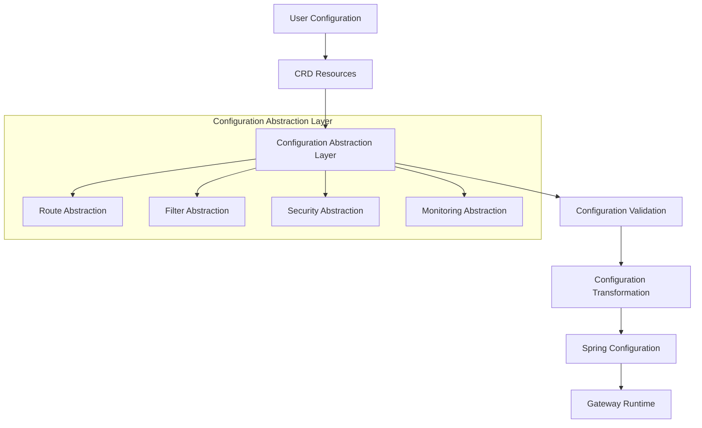

# TiGateway CRD Configuration Abstraction Design

## Overview

TiGateway adopts a configuration abstraction design based on Kubernetes Custom Resource Definitions (CRD), providing declarative, cloud-native configuration management. This document details TiGateway's CRD configuration abstraction layer design, including configuration models, abstraction levels, transformation mechanisms, and best practices.

## Design Philosophy

### 1. Cloud-Native Configuration Management

- **Declarative Configuration**: Use YAML to declare desired state, system automatically converges to target state
- **GitOps Friendly**: Configuration stored in Git, supporting version control and auditing
- **Kubernetes Native**: Fully based on Kubernetes resource model, seamless integration
- **Multi-Environment Support**: Multi-environment configuration isolation through namespaces and environment labels

### 2. Configuration Abstraction Levels



## Core Configuration Abstractions

### 1. Route Configuration Abstraction

#### 1.1 Route Definition Abstraction

```yaml
# Route configuration abstraction model
apiVersion: tigateway.cn/v1
kind: TiGatewayRouteConfig
metadata:
  name: api-routes
  namespace: tigateway
spec:
  # Route group configuration
  routeGroups:
    - name: user-service-group
      description: "User service route group"
      labels:
        service: user
        version: v1
        environment: production
      
      # Route definitions
      routes:
        - id: user-read-route
          description: "User read operation route"
          # Target service abstraction
          target:
            service: user-service
            namespace: backend
            port: 8080
            version: v1
          
          # Match condition abstraction
          match:
            path: "/api/users/**"
            methods: [GET, HEAD]
            headers:
              - name: X-API-Version
                value: v1
            query:
              - name: format
                values: [json, xml]
            time:
              start: "2024-01-01T00:00:00Z"
              end: "2024-12-31T23:59:59Z"
          
          # Traffic control abstraction
          traffic:
            weight: 80
            priority: 100
            canary:
              enabled: false
              percentage: 0
          
          # Filter chain abstraction
          filters:
            - name: StripPrefix
              config:
                parts: 2
            - name: AddRequestHeader
              config:
                name: X-Service
                value: user-service
            - name: CircuitBreaker
              config:
                name: user-service-cb
                fallbackUri: forward:/fallback/user-service
                failureThreshold: 5
                waitDurationInOpenState: 60s
```

#### 1.2 高级路由抽象

```yaml
# 高级路由配置抽象
apiVersion: tigateway.cn/v1
kind: TiGatewayRouteConfig
metadata:
  name: advanced-routes
spec:
  routeGroups:
    - name: microservices-group
      # 服务发现抽象
      serviceDiscovery:
        type: kubernetes
        namespace: microservices
        labelSelector:
          app.kubernetes.io/part-of: microservices
      
      # 负载均衡抽象
      loadBalancing:
        strategy: round-robin
        healthCheck:
          enabled: true
          path: /health
          interval: 30s
          timeout: 5s
          retries: 3
      
      # 路由模板
      routeTemplates:
        - name: standard-api-template
          match:
            path: "/api/{service}/**"
          filters:
            - name: StripPrefix
              config:
                parts: 2
            - name: AddRequestHeader
              config:
                name: X-Service-Name
                value: "{service}"
      
      # 应用模板的路由
      routes:
        - template: standard-api-template
          target:
            service: "{service}-service"
          match:
            service: user
        - template: standard-api-template
          target:
            service: "{service}-service"
          match:
            service: order
```

### 2. 过滤器配置抽象

#### 2.1 过滤器定义抽象

```yaml
# 过滤器配置抽象模型
apiVersion: tigateway.cn/v1
kind: TiGatewayFilterConfig
metadata:
  name: global-filters
spec:
  # 全局过滤器
  globalFilters:
    - name: RequestLogging
      order: -1000
      config:
        level: INFO
        includeHeaders: true
        includeBody: false
        maxBodySize: 1024
    
    - name: RateLimiting
      order: -900
      config:
        keyResolver: ip
        replenishRate: 100
        burstCapacity: 200
        requestedTokens: 1
    
    - name: SecurityHeaders
      order: -800
      config:
        headers:
          X-Content-Type-Options: nosniff
          X-Frame-Options: DENY
          X-XSS-Protection: "1; mode=block"
          Strict-Transport-Security: "max-age=31536000; includeSubDomains"
  
  # 过滤器组
  filterGroups:
    - name: authentication-group
      description: "认证相关过滤器组"
      filters:
        - name: JwtAuthentication
          config:
            secretKey: ${JWT_SECRET}
            tokenHeader: Authorization
            tokenPrefix: Bearer
            userInfoHeader: X-User-Info
        
        - name: RoleBasedAccess
          config:
            roleHeader: X-User-Roles
            requiredRoles: [USER, ADMIN]
    
    - name: monitoring-group
      description: "监控相关过滤器组"
      filters:
        - name: MetricsCollection
          config:
            enabled: true
            includeCustomMetrics: true
        
        - name: Tracing
          config:
            enabled: true
            samplingRate: 0.1
            traceHeader: X-Trace-Id
```

#### 2.2 自定义过滤器抽象

```yaml
# 自定义过滤器配置
apiVersion: tigateway.cn/v1
kind: TiGatewayCustomFilter
metadata:
  name: business-logic-filter
spec:
  # 过滤器定义
  filter:
    name: BusinessLogicFilter
    description: "业务逻辑过滤器"
    version: v1.0.0
    
    # 配置模式
    configSchema:
      type: object
      properties:
        businessRules:
          type: array
          items:
            type: object
            properties:
              condition:
                type: string
              action:
                type: string
                enum: [ALLOW, DENY, TRANSFORM]
              transform:
                type: object
  
  # 过滤器实现
  implementation:
    type: java
    className: com.tigateway.filter.BusinessLogicFilter
    dependencies:
      - groupId: com.tigateway
        artifactId: tigateway-core
        version: 1.0.0
  
  # 使用示例
  usage:
    routes:
      - name: business-api-route
        filters:
          - name: BusinessLogicFilter
            config:
              businessRules:
                - condition: "request.header['X-User-Type'] == 'PREMIUM'"
                  action: ALLOW
                - condition: "request.header['X-User-Type'] == 'BASIC'"
                  action: TRANSFORM
                  transform:
                    addHeader:
                      X-Upgrade-Prompt: "true"
```

### 3. 安全配置抽象

#### 3.1 认证配置抽象

```yaml
# 安全配置抽象模型
apiVersion: tigateway.cn/v1
kind: TiGatewaySecurityConfig
metadata:
  name: security-policy
spec:
  # 认证配置
  authentication:
    providers:
      - name: jwt
        type: JWT
        config:
          secretKey: ${JWT_SECRET}
          issuer: tigateway
          audience: api-users
          expiration: 3600s
      
      - name: oauth2
        type: OAuth2
        config:
          issuerUri: ${OAUTH2_ISSUER_URI}
          clientId: ${OAUTH2_CLIENT_ID}
          clientSecret: ${OAUTH2_CLIENT_SECRET}
          scope: openid,profile,email
      
      - name: api-key
        type: APIKey
        config:
          headerName: X-API-Key
          queryParamName: api_key
    
    # 认证策略
    policies:
      - name: public-access
        description: "公开访问策略"
        rules:
          - path: "/api/public/**"
            methods: [GET, POST]
            authentication: none
      
      - name: authenticated-access
        description: "认证访问策略"
        rules:
          - path: "/api/secure/**"
            methods: [GET, POST, PUT, DELETE]
            authentication: required
            providers: [jwt, oauth2]
      
      - name: api-key-access
        description: "API Key访问策略"
        rules:
          - path: "/api/external/**"
            methods: [GET, POST]
            authentication: required
            providers: [api-key]
```

#### 3.2 授权配置抽象

```yaml
# 授权配置抽象
apiVersion: tigateway.cn/v1
kind: TiGatewaySecurityConfig
metadata:
  name: authorization-policy
spec:
  # 授权配置
  authorization:
    # 角色定义
    roles:
      - name: ADMIN
        description: "系统管理员"
        permissions:
          - resource: "*"
            actions: ["*"]
      
      - name: USER
        description: "普通用户"
        permissions:
          - resource: "user"
            actions: [read, update]
            conditions:
              - "subject.id == resource.owner"
      
      - name: API_USER
        description: "API用户"
        permissions:
          - resource: "api"
            actions: [read]
            conditions:
              - "request.header['X-API-Version'] == 'v1'"
    
    # 权限策略
    policies:
      - name: user-data-access
        description: "用户数据访问策略"
        rules:
          - path: "/api/users/{userId}/**"
            methods: [GET, PUT, DELETE]
            authorization:
              requiredRoles: [USER, ADMIN]
              conditions:
                - "subject.roles.contains('ADMIN') || subject.id == path.userId"
      
      - name: admin-only-access
        description: "管理员专用访问策略"
        rules:
          - path: "/api/admin/**"
            methods: [GET, POST, PUT, DELETE]
            authorization:
              requiredRoles: [ADMIN]
```

### 4. 监控配置抽象

#### 4.1 指标配置抽象

```yaml
# 监控配置抽象模型
apiVersion: tigateway.cn/v1
kind: TiGatewayMonitoringConfig
metadata:
  name: monitoring-policy
spec:
  # 指标配置
  metrics:
    # 系统指标
    system:
      enabled: true
      collection:
        jvm: true
        system: true
        custom: true
    
    # 业务指标
    business:
      enabled: true
      customMetrics:
        - name: api_request_count
          type: counter
          description: "API请求计数"
          labels: [service, method, status]
        
        - name: api_response_time
          type: histogram
          description: "API响应时间"
          buckets: [0.1, 0.5, 1.0, 2.0, 5.0]
          labels: [service, method]
    
    # 指标导出
    export:
      prometheus:
        enabled: true
        path: /actuator/prometheus
        port: 8090
      
      custom:
        enabled: true
        endpoints:
          - name: metrics-endpoint
            path: /metrics
            format: json
```

#### 4.2 日志配置抽象

```yaml
# 日志配置抽象
apiVersion: tigateway.cn/v1
kind: TiGatewayMonitoringConfig
metadata:
  name: logging-policy
spec:
  # 日志配置
  logging:
    # 日志级别
    level:
      root: INFO
      com.tigateway: DEBUG
      org.springframework.cloud.gateway: INFO
    
    # 日志格式
    format:
      pattern: "%d{yyyy-MM-dd HH:mm:ss.SSS} [%thread] %-5level [%X{traceId},%X{spanId}] %logger{36} - %msg%n"
      includeTraceId: true
      includeSpanId: true
    
    # 日志输出
    appenders:
      - name: console
        type: console
        enabled: true
      
      - name: file
        type: file
        enabled: true
        fileName: /var/log/tigateway/application.log
        maxFileSize: 100MB
        maxHistory: 30
    
    # 结构化日志
    structured:
      enabled: true
      format: json
      fields:
        - name: timestamp
          value: "${timestamp}"
        - name: level
          value: "${level}"
        - name: message
          value: "${message}"
        - name: service
          value: "tigateway"
        - name: version
          value: "${tigateway.version}"
```

## 配置转换机制

### 1. 抽象到具体转换

```java
// 配置转换器接口
public interface ConfigurationTransformer {
    <T> T transform(ConfigurationAbstraction abstraction, Class<T> targetType);
}

// CRD到Spring配置转换器
@Component
public class CrdToSpringConfigTransformer implements ConfigurationTransformer {
    
    @Override
    public SpringCloudGatewayConfig transform(
            TiGatewayRouteConfig routeConfig, 
            Class<SpringCloudGatewayConfig> targetType) {
        
        SpringCloudGatewayConfig config = new SpringCloudGatewayConfig();
        
        // 转换路由配置
        List<RouteDefinition> routes = routeConfig.getSpec()
            .getRouteGroups()
            .stream()
            .flatMap(group -> group.getRoutes().stream())
            .map(this::transformRoute)
            .collect(Collectors.toList());
        
        config.setRoutes(routes);
        
        // 转换过滤器配置
        List<FilterDefinition> filters = routeConfig.getSpec()
            .getRouteGroups()
            .stream()
            .flatMap(group -> group.getFilters().stream())
            .map(this::transformFilter)
            .collect(Collectors.toList());
        
        config.setDefaultFilters(filters);
        
        return config;
    }
    
    private RouteDefinition transformRoute(TiGatewayRoute route) {
        RouteDefinition routeDef = new RouteDefinition();
        routeDef.setId(route.getId());
        routeDef.setUri(transformUri(route.getTarget()));
        routeDef.setPredicates(transformPredicates(route.getMatch()));
        routeDef.setFilters(transformFilters(route.getFilters()));
        return routeDef;
    }
    
    private String transformUri(TargetService target) {
        return String.format("lb://%s", target.getService());
    }
    
    private List<PredicateDefinition> transformPredicates(MatchCondition match) {
        List<PredicateDefinition> predicates = new ArrayList<>();
        
        // 路径匹配
        if (match.getPath() != null) {
            predicates.add(new PredicateDefinition("Path=" + match.getPath()));
        }
        
        // 方法匹配
        if (match.getMethods() != null && !match.getMethods().isEmpty()) {
            String methods = String.join(",", match.getMethods());
            predicates.add(new PredicateDefinition("Method=" + methods));
        }
        
        // 头部匹配
        if (match.getHeaders() != null) {
            match.getHeaders().forEach(header -> {
                String predicate = String.format("Header=%s,%s", 
                    header.getName(), header.getValue());
                predicates.add(new PredicateDefinition(predicate));
            });
        }
        
        return predicates;
    }
}
```

### 2. 配置验证机制

```java
// 配置验证器
@Component
public class ConfigurationValidator {
    
    public ValidationResult validate(TiGatewayRouteConfig config) {
        ValidationResult result = new ValidationResult();
        
        // 验证路由配置
        config.getSpec().getRouteGroups().forEach(group -> {
            group.getRoutes().forEach(route -> {
                validateRoute(route, result);
            });
        });
        
        // 验证过滤器配置
        config.getSpec().getRouteGroups().forEach(group -> {
            group.getFilters().forEach(filter -> {
                validateFilter(filter, result);
            });
        });
        
        return result;
    }
    
    private void validateRoute(TiGatewayRoute route, ValidationResult result) {
        // 验证路由ID
        if (route.getId() == null || route.getId().trim().isEmpty()) {
            result.addError("Route ID is required");
        }
        
        // 验证目标服务
        if (route.getTarget() == null) {
            result.addError("Route target is required");
        } else {
            if (route.getTarget().getService() == null) {
                result.addError("Target service name is required");
            }
        }
        
        // 验证匹配条件
        if (route.getMatch() == null) {
            result.addError("Route match condition is required");
        } else {
            if (route.getMatch().getPath() == null) {
                result.addError("Route path is required");
            }
        }
    }
    
    private void validateFilter(TiGatewayFilter filter, ValidationResult result) {
        // 验证过滤器名称
        if (filter.getName() == null || filter.getName().trim().isEmpty()) {
            result.addError("Filter name is required");
        }
        
        // 验证过滤器配置
        if (filter.getConfig() != null) {
            validateFilterConfig(filter.getName(), filter.getConfig(), result);
        }
    }
}
```

## 最佳实践

### 1. 配置组织最佳实践

```yaml
# 按环境组织配置
apiVersion: v1
kind: Namespace
metadata:
  name: tigateway-prod
  labels:
    environment: production
    tier: gateway

---
apiVersion: v1
kind: Namespace
metadata:
  name: tigateway-staging
  labels:
    environment: staging
    tier: gateway

---
# 生产环境配置
apiVersion: tigateway.cn/v1
kind: TiGatewayRouteConfig
metadata:
  name: production-routes
  namespace: tigateway-prod
spec:
  routeGroups:
    - name: production-services
      labels:
        environment: production
        tier: production
      # 生产环境特定配置
```

### 2. 配置版本管理最佳实践

```yaml
# 使用标签进行版本管理
apiVersion: tigateway.cn/v1
kind: TiGatewayRouteConfig
metadata:
  name: api-routes
  labels:
    version: v1.2.0
    app.kubernetes.io/version: v1.2.0
    app.kubernetes.io/managed-by: tigateway-operator
spec:
  # 配置内容
```

### 3. 配置安全最佳实践

```yaml
# 敏感配置使用Secret
apiVersion: v1
kind: Secret
metadata:
  name: tigateway-secrets
type: Opaque
data:
  jwt-secret: <base64-encoded-secret>
  oauth2-client-secret: <base64-encoded-secret>

---
# 引用Secret的配置
apiVersion: tigateway.cn/v1
kind: TiGatewaySecurityConfig
metadata:
  name: security-config
spec:
  authentication:
    providers:
      - name: jwt
        type: JWT
        config:
          secretKey: ${JWT_SECRET}  # 从Secret中引用
```

---

**相关文档**:
- [CRD资源配置](./crd-resource-configuration.md)
- [CRD过滤器配置](./crd-filter-configuration.md)
- [CRD断言配置](./crd-predicate-configuration.md)
- [CRD类型化设计](./crd-typed-design.md)
