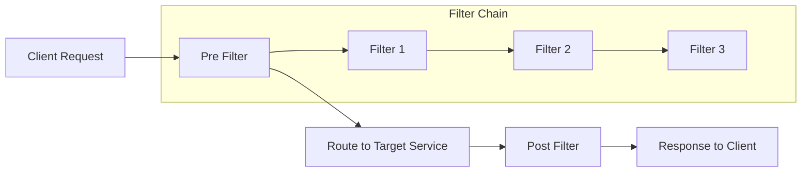

# TiGateway CRD Filter Configuration Documentation

## Overview

This document details the CRD configuration methods for various gateway filters in TiGateway. Filters are core components of Spring Cloud Gateway, used to modify requests and responses before and after request forwarding. Each filter is an instance of `GatewayFilter`, built through specific factories.

## 1. Filter Basic Concepts

### 1.1 Filter Working Principle



### 1.2 Filter Types

- **Pre Filter**: Executed before request forwarding
- **Post Filter**: Executed before response return
- **Global Filter**: Applied to all routes
- **Route Filter**: Applied to specific routes

## 2. Request Header Filters

### 2.1 AddRequestHeader Filter

Adds request headers to downstream requests.

```yaml
apiVersion: tigateway.cn/v1
kind: TiGatewayRouteConfig
metadata:
  name: add-request-header-example
spec:
  routes:
    - id: add-header-route
      uri: https://example.org
      filters:
        - AddRequestHeader=X-Request-red, blue
```

**CRD Configuration**:
```yaml
apiVersion: tigateway.cn/v1
kind: TiGatewayRouteConfig
metadata:
  name: add-request-header-crd
spec:
  routes:
    - id: add-header-route
      uri: https://example.org
      filters:
        - name: AddRequestHeader
          args:
            name: X-Request-red
            value: blue
```

### 2.2 AddRequestHeadersIfNotPresent Filter

Adds request headers only if they don't already exist.

```yaml
apiVersion: tigateway.cn/v1
kind: TiGatewayRouteConfig
metadata:
  name: add-request-headers-if-not-present-example
spec:
  routes:
    - id: add-headers-if-not-present-route
      uri: https://example.org
      filters:
        - AddRequestHeadersIfNotPresent=X-Request-red: blue, X-Request-Green: green
```

**CRD Configuration**:
```yaml
apiVersion: tigateway.cn/v1
kind: TiGatewayRouteConfig
metadata:
  name: add-request-headers-if-not-present-crd
spec:
  routes:
    - id: add-headers-if-not-present-route
      uri: https://example.org
      filters:
        - name: AddRequestHeadersIfNotPresent
          args:
            headers:
              X-Request-red: blue
              X-Request-Green: green
```

### 2.3 RemoveRequestHeader Filter

Removes request headers from downstream requests.

```yaml
apiVersion: tigateway.cn/v1
kind: TiGatewayRouteConfig
metadata:
  name: remove-request-header-example
spec:
  routes:
    - id: remove-header-route
      uri: https://example.org
      filters:
        - RemoveRequestHeader=X-Request-Foo
```

**CRD Configuration**:
```yaml
apiVersion: tigateway.cn/v1
kind: TiGatewayRouteConfig
metadata:
  name: remove-request-header-crd
spec:
  routes:
    - id: remove-header-route
      uri: https://example.org
      filters:
        - name: RemoveRequestHeader
          args:
            name: X-Request-Foo
```

### 2.4 SetRequestHeader Filter

Sets request headers, replacing existing ones.

```yaml
apiVersion: tigateway.cn/v1
kind: TiGatewayRouteConfig
metadata:
  name: set-request-header-example
spec:
  routes:
    - id: set-header-route
      uri: https://example.org
      filters:
        - SetRequestHeader=X-Request-red, blue
```

**CRD Configuration**:
```yaml
apiVersion: tigateway.cn/v1
kind: TiGatewayRouteConfig
metadata:
  name: set-request-header-crd
spec:
  routes:
    - id: set-header-route
      uri: https://example.org
      filters:
        - name: SetRequestHeader
          args:
            name: X-Request-red
            value: blue
```

## 3. Response Header Filters

### 3.1 AddResponseHeader Filter

Adds response headers to downstream responses.

```yaml
apiVersion: tigateway.cn/v1
kind: TiGatewayRouteConfig
metadata:
  name: add-response-header-example
spec:
  routes:
    - id: add-response-header-route
      uri: https://example.org
      filters:
        - AddResponseHeader=X-Response-red, blue
```

**CRD Configuration**:
```yaml
apiVersion: tigateway.cn/v1
kind: TiGatewayRouteConfig
metadata:
  name: add-response-header-crd
spec:
  routes:
    - id: add-response-header-route
      uri: https://example.org
      filters:
        - name: AddResponseHeader
          args:
            name: X-Response-red
            value: blue
```

### 3.2 AddResponseHeadersIfNotPresent Filter

Adds response headers only if they don't already exist.

```yaml
apiVersion: tigateway.cn/v1
kind: TiGatewayRouteConfig
metadata:
  name: add-response-headers-if-not-present-example
spec:
  routes:
    - id: add-response-headers-if-not-present-route
      uri: https://example.org
      filters:
        - AddResponseHeadersIfNotPresent=X-Response-red: blue, X-Response-Green: green
```

**CRD Configuration**:
```yaml
apiVersion: tigateway.cn/v1
kind: TiGatewayRouteConfig
metadata:
  name: add-response-headers-if-not-present-crd
spec:
  routes:
    - id: add-response-headers-if-not-present-route
      uri: https://example.org
      filters:
        - name: AddResponseHeadersIfNotPresent
          args:
            headers:
              X-Response-red: blue
              X-Response-Green: green
```

### 3.3 RemoveResponseHeader Filter

Removes response headers from downstream responses.

```yaml
apiVersion: tigateway.cn/v1
kind: TiGatewayRouteConfig
metadata:
  name: remove-response-header-example
spec:
  routes:
    - id: remove-response-header-route
      uri: https://example.org
      filters:
        - RemoveResponseHeader=X-Response-Foo
```

**CRD Configuration**:
```yaml
apiVersion: tigateway.cn/v1
kind: TiGatewayRouteConfig
metadata:
  name: remove-response-header-crd
spec:
  routes:
    - id: remove-response-header-route
      uri: https://example.org
      filters:
        - name: RemoveResponseHeader
          args:
            name: X-Response-Foo
```

### 3.4 SetResponseHeader Filter

Sets response headers, replacing existing ones.

```yaml
apiVersion: tigateway.cn/v1
kind: TiGatewayRouteConfig
metadata:
  name: set-response-header-example
spec:
  routes:
    - id: set-response-header-route
      uri: https://example.org
      filters:
        - SetResponseHeader=X-Response-red, blue
```

**CRD Configuration**:
```yaml
apiVersion: tigateway.cn/v1
kind: TiGatewayRouteConfig
metadata:
  name: set-response-header-crd
spec:
  routes:
    - id: set-response-header-route
      uri: https://example.org
      filters:
        - name: SetResponseHeader
          args:
            name: X-Response-red
            value: blue
```

## 4. Path Filters

### 4.1 StripPrefix Filter

Strips a specified number of path segments from the beginning of the request path.

```yaml
apiVersion: tigateway.cn/v1
kind: TiGatewayRouteConfig
metadata:
  name: strip-prefix-example
spec:
  routes:
    - id: strip-prefix-route
      uri: https://example.org
      predicates:
        - Path=/name/**
      filters:
        - StripPrefix=2
```

**CRD Configuration**:
```yaml
apiVersion: tigateway.cn/v1
kind: TiGatewayRouteConfig
metadata:
  name: strip-prefix-crd
spec:
  routes:
    - id: strip-prefix-route
      uri: https://example.org
      predicates:
        - name: Path
          args:
            pattern: /name/**
      filters:
        - name: StripPrefix
          args:
            parts: 2
```

### 4.2 PrefixPath Filter

Adds a prefix to the request path.

```yaml
apiVersion: tigateway.cn/v1
kind: TiGatewayRouteConfig
metadata:
  name: prefix-path-example
spec:
  routes:
    - id: prefix-path-route
      uri: https://example.org
      filters:
        - PrefixPath=/mypath
```

**CRD Configuration**:
```yaml
apiVersion: tigateway.cn/v1
kind: TiGatewayRouteConfig
metadata:
  name: prefix-path-crd
spec:
  routes:
    - id: prefix-path-route
      uri: https://example.org
      filters:
        - name: PrefixPath
          args:
            prefix: /mypath
```

### 4.3 RewritePath Filter

Rewrites the request path using a regular expression.

```yaml
apiVersion: tigateway.cn/v1
kind: TiGatewayRouteConfig
metadata:
  name: rewrite-path-example
spec:
  routes:
    - id: rewrite-path-route
      uri: https://example.org
      predicates:
        - Path=/red/**
      filters:
        - RewritePath=/red/(?<segment>.*), /$\{segment}
```

**CRD Configuration**:
```yaml
apiVersion: tigateway.cn/v1
kind: TiGatewayRouteConfig
metadata:
  name: rewrite-path-crd
spec:
  routes:
    - id: rewrite-path-route
      uri: https://example.org
      predicates:
        - name: Path
          args:
            pattern: /red/**
      filters:
        - name: RewritePath
          args:
            regexp: /red/(?<segment>.*)
            replacement: /$\{segment}
```

## 5. Request Parameter Filters

### 5.1 AddRequestParameter Filter

Adds request parameters to downstream requests.

```yaml
apiVersion: tigateway.cn/v1
kind: TiGatewayRouteConfig
metadata:
  name: add-request-parameter-example
spec:
  routes:
    - id: add-request-parameter-route
      uri: https://example.org
      filters:
        - AddRequestParameter=red, blue
```

**CRD Configuration**:
```yaml
apiVersion: tigateway.cn/v1
kind: TiGatewayRouteConfig
metadata:
  name: add-request-parameter-crd
spec:
  routes:
    - id: add-request-parameter-route
      uri: https://example.org
      filters:
        - name: AddRequestParameter
          args:
            name: red
            value: blue
```

### 5.2 RemoveRequestParameter Filter

Removes request parameters from downstream requests.

```yaml
apiVersion: tigateway.cn/v1
kind: TiGatewayRouteConfig
metadata:
  name: remove-request-parameter-example
spec:
  routes:
    - id: remove-request-parameter-route
      uri: https://example.org
      filters:
        - RemoveRequestParameter=red
```

**CRD Configuration**:
```yaml
apiVersion: tigateway.cn/v1
kind: TiGatewayRouteConfig
metadata:
  name: remove-request-parameter-crd
spec:
  routes:
    - id: remove-request-parameter-route
      uri: https://example.org
      filters:
        - name: RemoveRequestParameter
          args:
            name: red
```

## 6. Circuit Breaker Filters

### 6.1 CircuitBreaker Filter

Implements circuit breaker pattern for fault tolerance.

```yaml
apiVersion: tigateway.cn/v1
kind: TiGatewayRouteConfig
metadata:
  name: circuit-breaker-example
spec:
  routes:
    - id: circuit-breaker-route
      uri: https://example.org
      filters:
        - name: CircuitBreaker
          args:
            name: myCircuitBreaker
            fallbackUri: forward:/inCaseOfFailureUseThis
```

**CRD Configuration**:
```yaml
apiVersion: tigateway.cn/v1
kind: TiGatewayRouteConfig
metadata:
  name: circuit-breaker-crd
spec:
  routes:
    - id: circuit-breaker-route
      uri: https://example.org
      filters:
        - name: CircuitBreaker
          args:
            name: myCircuitBreaker
            fallbackUri: forward:/inCaseOfFailureUseThis
            statusCodes: 500,404
            failureThreshold: 5
            waitDurationInOpenState: 60s
            successThreshold: 3
```

### 6.2 CircuitBreaker with Fallback

```yaml
apiVersion: tigateway.cn/v1
kind: TiGatewayRouteConfig
metadata:
  name: circuit-breaker-fallback-example
spec:
  routes:
    - id: circuit-breaker-fallback-route
      uri: https://example.org
      filters:
        - name: CircuitBreaker
          args:
            name: myCircuitBreaker
            fallbackUri: forward:/inCaseOfFailureUseThis
            statusCodes: 500,404
            failureThreshold: 5
            waitDurationInOpenState: 60s
            successThreshold: 3
            fallbackResponseBody: |
              {
                "error": "Service temporarily unavailable",
                "timestamp": "{{timestamp}}",
                "path": "{{path}}"
              }
```

## 7. Rate Limiting Filters

### 7.1 RequestRateLimiter Filter

Implements rate limiting using Redis.

```yaml
apiVersion: tigateway.cn/v1
kind: TiGatewayRouteConfig
metadata:
  name: rate-limiter-example
spec:
  routes:
    - id: rate-limiter-route
      uri: https://example.org
      filters:
        - name: RequestRateLimiter
          args:
            redis-rate-limiter.replenishRate: 10
            redis-rate-limiter.burstCapacity: 20
            redis-rate-limiter.requestedTokens: 1
            key-resolver: "#{@userKeyResolver}"
```

**CRD Configuration**:
```yaml
apiVersion: tigateway.cn/v1
kind: TiGatewayRouteConfig
metadata:
  name: rate-limiter-crd
spec:
  routes:
    - id: rate-limiter-route
      uri: https://example.org
      filters:
        - name: RequestRateLimiter
          args:
            redis-rate-limiter.replenishRate: 10
            redis-rate-limiter.burstCapacity: 20
            redis-rate-limiter.requestedTokens: 1
            key-resolver: "#{@userKeyResolver}"
            rate-limiter-redis-config:
              host: localhost
              port: 6379
              database: 0
```

## 8. Retry Filters

### 8.1 Retry Filter

Implements retry logic for failed requests.

```yaml
apiVersion: tigateway.cn/v1
kind: TiGatewayRouteConfig
metadata:
  name: retry-example
spec:
  routes:
    - id: retry-route
      uri: https://example.org
      filters:
        - name: Retry
          args:
            retries: 3
            statuses: BAD_GATEWAY
            methods: GET,POST
            backoff:
              firstBackoff: 50ms
              maxBackoff: 500ms
              factor: 2
              basedOnPreviousValue: false
```

**CRD Configuration**:
```yaml
apiVersion: tigateway.cn/v1
kind: TiGatewayRouteConfig
metadata:
  name: retry-crd
spec:
  routes:
    - id: retry-route
      uri: https://example.org
      filters:
        - name: Retry
          args:
            retries: 3
            statuses: BAD_GATEWAY
            methods: GET,POST
            backoff:
              firstBackoff: 50ms
              maxBackoff: 500ms
              factor: 2
              basedOnPreviousValue: false
```

## 9. Global Filters

### 9.1 Global Filter Configuration

```yaml
apiVersion: tigateway.cn/v1
kind: TiGatewayGlobalFilterConfig
metadata:
  name: global-filters
spec:
  globalFilters:
    - name: AddRequestHeader
      args:
        name: X-Global-Request-Id
        value: "{{random.uuid}}"
      order: -1000
    
    - name: AddResponseHeader
      args:
        name: X-Global-Response-Time
        value: "{{responseTime}}"
      order: 1000
    
    - name: RequestLogging
      args:
        level: INFO
        includeHeaders: true
        includeBody: false
      order: -500
```

## 10. Custom Filters

### 10.1 Custom Filter Definition

```yaml
apiVersion: tigateway.cn/v1
kind: TiGatewayCustomFilter
metadata:
  name: custom-filter-example
spec:
  filter:
    name: CustomBusinessFilter
    description: "Custom business logic filter"
    version: v1.0.0
    
    configSchema:
      type: object
      properties:
        businessRule:
          type: string
        action:
          type: string
          enum: [ALLOW, DENY, TRANSFORM]
  
  implementation:
    type: java
    className: com.tigateway.filter.CustomBusinessFilter
    dependencies:
      - groupId: com.tigateway
        artifactId: tigateway-core
        version: 1.0.0
  
  usage:
    routes:
      - name: custom-filter-route
        filters:
          - name: CustomBusinessFilter
            config:
              businessRule: "user.type == 'PREMIUM'"
              action: ALLOW
```

## 11. Filter Ordering

### 11.1 Filter Order Configuration

```yaml
apiVersion: tigateway.cn/v1
kind: TiGatewayRouteConfig
metadata:
  name: filter-order-example
spec:
  routes:
    - id: filter-order-route
      uri: https://example.org
      filters:
        - name: AddRequestHeader
          args:
            name: X-First
            value: first
          order: -1000
        
        - name: AddRequestHeader
          args:
            name: X-Second
            value: second
          order: -500
        
        - name: AddResponseHeader
          args:
            name: X-Third
            value: third
          order: 500
        
        - name: AddResponseHeader
          args:
            name: X-Fourth
            value: fourth
          order: 1000
```

## 12. Best Practices

### 12.1 Filter Performance Optimization

```yaml
apiVersion: tigateway.cn/v1
kind: TiGatewayRouteConfig
metadata:
  name: performance-optimized-filters
spec:
  routes:
    - id: optimized-route
      uri: https://example.org
      filters:
        # 使用高效的过滤器顺序
        - name: RequestLogging
          args:
            level: INFO
            includeHeaders: false  # 减少日志开销
            includeBody: false
          order: -1000
        
        - name: AddRequestHeader
          args:
            name: X-Request-ID
            value: "{{random.uuid}}"
          order: -900
        
        - name: CircuitBreaker
          args:
            name: optimized-circuit-breaker
            fallbackUri: forward:/fallback
            failureThreshold: 3  # 较低的失败阈值
            waitDurationInOpenState: 30s  # 较短的等待时间
          order: -800
```

### 12.2 Filter Error Handling

```yaml
apiVersion: tigateway.cn/v1
kind: TiGatewayRouteConfig
metadata:
  name: error-handling-filters
spec:
  routes:
    - id: error-handling-route
      uri: https://example.org
      filters:
        - name: Retry
          args:
            retries: 3
            statuses: BAD_GATEWAY, SERVICE_UNAVAILABLE
            methods: GET,POST
            backoff:
              firstBackoff: 100ms
              maxBackoff: 1000ms
              factor: 2
          order: -1000
        
        - name: CircuitBreaker
          args:
            name: error-circuit-breaker
            fallbackUri: forward:/error-fallback
            statusCodes: 500,502,503,504
            failureThreshold: 5
            waitDurationInOpenState: 60s
            successThreshold: 3
          order: -900
        
        - name: AddResponseHeader
          args:
            name: X-Error-Handled
            value: "true"
          order: 1000
```

---

**Related Documentation**:
- [CRD Configuration Design](./crd-configuration-design.md)
- [CRD Resource Configuration](./crd-resource-configuration.md)
- [CRD Predicate Configuration](./crd-predicate-configuration.md)
- [CRD Typed Design](./crd-typed-design.md)
