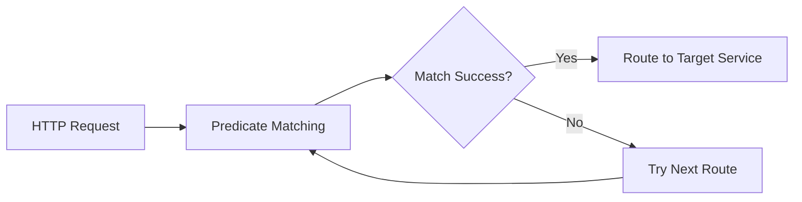

# TiGateway CRD Predicate Configuration Documentation

## Overview

This document details the CRD configuration methods for various route predicates in TiGateway. Predicates are core concepts of Spring Cloud Gateway, used to match and route HTTP requests. Each predicate is a Java 8 Function Predicate with input type `ServerWebExchange`.

## 1. Predicate Basic Concepts

### 1.1 Predicate Working Principle



### 1.2 Predicate Combination

Multiple predicates are combined using logical `and`, all predicates must return `true` to match the route:

```yaml
predicates:
  - Path=/api/users/**
  - Method=GET,POST
  - Header=X-Request-Id, \d+
```

## 2. Time-Related Predicates

### 2.1 After Predicate

Matches requests that occur after a specified time.

```yaml
apiVersion: tigateway.cn/v1
kind: TiGatewayRouteConfig
metadata:
  name: after-predicate-example
spec:
  routes:
    - id: after-route
      uri: https://example.org
      predicates:
        - After=2017-01-20T17:42:47.789-07:00[America/Denver]
```

**Configuration Parameters:**
- `datetime`: ISO 8601 format datetime string
- `timezone`: Optional timezone (default: UTC)

**CRD Configuration:**
```yaml
apiVersion: tigateway.cn/v1
kind: TiGatewayRouteConfig
metadata:
  name: after-predicate-crd
spec:
  routes:
    - id: after-route
      uri: https://example.org
      predicates:
        - name: After
          args:
            datetime: 2017-01-20T17:42:47.789-07:00[America/Denver]
```

### 2.2 Before Predicate

Matches requests that occur before a specified time.

```yaml
apiVersion: tigateway.cn/v1
kind: TiGatewayRouteConfig
metadata:
  name: before-predicate-example
spec:
  routes:
    - id: before-route
      uri: https://example.org
      predicates:
        - Before=2017-01-20T17:42:47.789-07:00[America/Denver]
```

**CRD Configuration:**
```yaml
apiVersion: tigateway.cn/v1
kind: TiGatewayRouteConfig
metadata:
  name: before-predicate-crd
spec:
  routes:
    - id: before-route
      uri: https://example.org
      predicates:
        - name: Before
          args:
            datetime: 2017-01-20T17:42:47.789-07:00[America/Denver]
```

### 2.3 Between Predicate

Matches requests that occur between two specified times.

```yaml
apiVersion: tigateway.cn/v1
kind: TiGatewayRouteConfig
metadata:
  name: between-predicate-example
spec:
  routes:
    - id: between-route
      uri: https://example.org
      predicates:
        - Between=2017-01-20T17:42:47.789-07:00[America/Denver], 2017-01-21T17:42:47.789-07:00[America/Denver]
```

**CRD Configuration:**
```yaml
apiVersion: tigateway.cn/v1
kind: TiGatewayRouteConfig
metadata:
  name: between-predicate-crd
spec:
  routes:
    - id: between-route
      uri: https://example.org
      predicates:
        - name: Between
          args:
            datetime1: 2017-01-20T17:42:47.789-07:00[America/Denver]
            datetime2: 2017-01-21T17:42:47.789-07:00[America/Denver]
```

## 3. Path-Related Predicates

### 3.1 Path Predicate

Matches requests based on the request path.

```yaml
apiVersion: tigateway.cn/v1
kind: TiGatewayRouteConfig
metadata:
  name: path-predicate-example
spec:
  routes:
    - id: path-route
      uri: https://example.org
      predicates:
        - Path=/red/{segment},/blue/{segment}
```

**Configuration Parameters:**
- `pattern`: Path pattern (supports Ant-style patterns)
- `caseSensitive`: Whether case sensitive (default: true)

**CRD Configuration:**
```yaml
apiVersion: tigateway.cn/v1
kind: TiGatewayRouteConfig
metadata:
  name: path-predicate-crd
spec:
  routes:
    - id: path-route
      uri: https://example.org
      predicates:
        - name: Path
          args:
            pattern: /red/{segment},/blue/{segment}
            caseSensitive: true
```

### 3.2 Path Pattern Examples

```yaml
# 精确匹配
- Path=/api/users

# 通配符匹配
- Path=/api/users/**

# 变量匹配
- Path=/api/users/{id}

# 多个路径匹配
- Path=/api/users/**,/api/orders/**
```

## 4. Method-Related Predicates

### 4.1 Method Predicate

Matches requests based on HTTP method.

```yaml
apiVersion: tigateway.cn/v1
kind: TiGatewayRouteConfig
metadata:
  name: method-predicate-example
spec:
  routes:
    - id: method-route
      uri: https://example.org
      predicates:
        - Method=GET,POST
```

**Configuration Parameters:**
- `methods`: HTTP methods (GET, POST, PUT, DELETE, etc.)

**CRD Configuration:**
```yaml
apiVersion: tigateway.cn/v1
kind: TiGatewayRouteConfig
metadata:
  name: method-predicate-crd
spec:
  routes:
    - id: method-route
      uri: https://example.org
      predicates:
        - name: Method
          args:
            methods: [GET, POST]
```

## 5. Header-Related Predicates

### 5.1 Header Predicate

Matches requests based on request headers.

```yaml
apiVersion: tigateway.cn/v1
kind: TiGatewayRouteConfig
metadata:
  name: header-predicate-example
spec:
  routes:
    - id: header-route
      uri: https://example.org
      predicates:
        - Header=X-Request-Id, \d+
```

**Configuration Parameters:**
- `name`: Header name
- `regexp`: Regular expression for header value

**CRD Configuration:**
```yaml
apiVersion: tigateway.cn/v1
kind: TiGatewayRouteConfig
metadata:
  name: header-predicate-crd
spec:
  routes:
    - id: header-route
      uri: https://example.org
      predicates:
        - name: Header
          args:
            name: X-Request-Id
            regexp: \d+
```

### 5.2 Header Examples

```yaml
# 精确匹配
- Header=X-API-Version, v1

# 正则表达式匹配
- Header=X-Request-Id, \d+

# 存在性匹配
- Header=X-Custom-Header

# 多个头部匹配
- Header=X-API-Version, v1
- Header=X-Client-Type, mobile
```

## 6. Query Parameter Predicates

### 6.1 Query Predicate

Matches requests based on query parameters.

```yaml
apiVersion: tigateway.cn/v1
kind: TiGatewayRouteConfig
metadata:
  name: query-predicate-example
spec:
  routes:
    - id: query-route
      uri: https://example.org
      predicates:
        - Query=green
```

**Configuration Parameters:**
- `param`: Query parameter name
- `regexp`: Optional regular expression for parameter value

**CRD Configuration:**
```yaml
apiVersion: tigateway.cn/v1
kind: TiGatewayRouteConfig
metadata:
  name: query-predicate-crd
spec:
  routes:
    - id: query-route
      uri: https://example.org
      predicates:
        - name: Query
          args:
            param: green
            regexp: ".*"  # Optional
```

### 6.2 Query Examples

```yaml
# 参数存在性匹配
- Query=green

# 参数值匹配
- Query=red, gree.

# 正则表达式匹配
- Query=color, (red|green|blue)

# 多个查询参数
- Query=color, red
- Query=size, large
```

## 7. Host-Related Predicates

### 7.1 Host Predicate

Matches requests based on the Host header.

```yaml
apiVersion: tigateway.cn/v1
kind: TiGatewayRouteConfig
metadata:
  name: host-predicate-example
spec:
  routes:
    - id: host-route
      uri: https://example.org
      predicates:
        - Host=**.somehost.org,**.anotherhost.org
```

**Configuration Parameters:**
- `pattern`: Host pattern (supports Ant-style patterns)

**CRD Configuration:**
```yaml
apiVersion: tigateway.cn/v1
kind: TiGatewayRouteConfig
metadata:
  name: host-predicate-crd
spec:
  routes:
    - id: host-route
      uri: https://example.org
      predicates:
        - name: Host
          args:
            pattern: "**.somehost.org,**.anotherhost.org"
```

### 7.2 Host Examples

```yaml
# 精确匹配
- Host=api.example.com

# 通配符匹配
- Host=*.example.com

# 多个主机匹配
- Host=api.example.com,admin.example.com

# 子域名匹配
- Host=**.example.com
```

## 8. Remote Address Predicates

### 8.1 RemoteAddr Predicate

Matches requests based on remote address.

```yaml
apiVersion: tigateway.cn/v1
kind: TiGatewayRouteConfig
metadata:
  name: remote-addr-predicate-example
spec:
  routes:
    - id: remote-addr-route
      uri: https://example.org
      predicates:
        - RemoteAddr=192.168.1.1/24
```

**Configuration Parameters:**
- `sources`: IP address or CIDR notation

**CRD Configuration:**
```yaml
apiVersion: tigateway.cn/v1
kind: TiGatewayRouteConfig
metadata:
  name: remote-addr-predicate-crd
spec:
  routes:
    - id: remote-addr-route
      uri: https://example.org
      predicates:
        - name: RemoteAddr
          args:
            sources: 192.168.1.1/24
```

### 8.2 RemoteAddr Examples

```yaml
# 单个IP匹配
- RemoteAddr=192.168.1.1

# CIDR匹配
- RemoteAddr=192.168.1.0/24

# 多个IP匹配
- RemoteAddr=192.168.1.1,10.0.0.1

# 排除IP
- RemoteAddr=!192.168.1.1
```

## 9. Weight-Related Predicates

### 9.1 Weight Predicate

Implements weighted routing for A/B testing or canary deployments.

```yaml
apiVersion: tigateway.cn/v1
kind: TiGatewayRouteConfig
metadata:
  name: weight-predicate-example
spec:
  routes:
    - id: weight-high-route
      uri: https://example.org
      predicates:
        - Weight=group1, 8
    - id: weight-low-route
      uri: https://example.org
      predicates:
        - Weight=group1, 2
```

**Configuration Parameters:**
- `group`: Weight group name
- `weight`: Weight value (integer)

**CRD Configuration:**
```yaml
apiVersion: tigateway.cn/v1
kind: TiGatewayRouteConfig
metadata:
  name: weight-predicate-crd
spec:
  routes:
    - id: weight-high-route
      uri: https://example.org
      predicates:
        - name: Weight
          args:
            group: group1
            weight: 8
    - id: weight-low-route
      uri: https://example.org
      predicates:
        - name: Weight
          args:
            group: group1
            weight: 2
```

## 10. Cookie Predicates

### 10.1 Cookie Predicate

Matches requests based on cookies.

```yaml
apiVersion: tigateway.cn/v1
kind: TiGatewayRouteConfig
metadata:
  name: cookie-predicate-example
spec:
  routes:
    - id: cookie-route
      uri: https://example.org
      predicates:
        - Cookie=chocolate, ch.p
```

**Configuration Parameters:**
- `name`: Cookie name
- `regexp`: Regular expression for cookie value

**CRD Configuration:**
```yaml
apiVersion: tigateway.cn/v1
kind: TiGatewayRouteConfig
metadata:
  name: cookie-predicate-crd
spec:
  routes:
    - id: cookie-route
      uri: https://example.org
      predicates:
        - name: Cookie
          args:
            name: chocolate
            regexp: ch.p
```

## 11. Complex Predicate Combinations

### 11.1 Multiple Predicate Example

```yaml
apiVersion: tigateway.cn/v1
kind: TiGatewayRouteConfig
metadata:
  name: complex-predicate-example
spec:
  routes:
    - id: complex-route
      uri: https://example.org
      predicates:
        - name: Path
          args:
            pattern: /api/users/**
        - name: Method
          args:
            methods: [GET, POST]
        - name: Header
          args:
            name: X-API-Version
            regexp: v1
        - name: Query
          args:
            param: format
            regexp: (json|xml)
        - name: Host
          args:
            pattern: api.example.com
        - name: RemoteAddr
          args:
            sources: 192.168.1.0/24
        - name: After
          args:
            datetime: 2024-01-01T00:00:00Z
```

### 11.2 A/B Testing Example

```yaml
apiVersion: tigateway.cn/v1
kind: TiGatewayRouteConfig
metadata:
  name: ab-testing-example
spec:
  routes:
    # 版本A (80%流量)
    - id: version-a-route
      uri: https://version-a.example.org
      predicates:
        - name: Path
          args:
            pattern: /api/**
        - name: Weight
          args:
            group: ab-test
            weight: 80
    
    # 版本B (20%流量)
    - id: version-b-route
      uri: https://version-b.example.org
      predicates:
        - name: Path
          args:
            pattern: /api/**
        - name: Weight
          args:
            group: ab-test
            weight: 20
```

### 11.3 Time-Based Routing Example

```yaml
apiVersion: tigateway.cn/v1
kind: TiGatewayRouteConfig
metadata:
  name: time-based-routing-example
spec:
  routes:
    # 工作时间路由
    - id: business-hours-route
      uri: https://business.example.org
      predicates:
        - name: Path
          args:
            pattern: /api/**
        - name: Between
          args:
            datetime1: 2024-01-01T09:00:00Z
            datetime2: 2024-01-01T17:00:00Z
    
    # 非工作时间路由
    - id: after-hours-route
      uri: https://afterhours.example.org
      predicates:
        - name: Path
          args:
            pattern: /api/**
        - name: After
          args:
            datetime: 2024-01-01T17:00:00Z
```

## 12. Custom Predicates

### 12.1 Custom Predicate Definition

```yaml
apiVersion: tigateway.cn/v1
kind: TiGatewayCustomPredicate
metadata:
  name: custom-predicate-example
spec:
  predicate:
    name: CustomBusinessPredicate
    description: "Custom business logic predicate"
    version: v1.0.0
    
    configSchema:
      type: object
      properties:
        businessRule:
          type: string
        threshold:
          type: number
  
  implementation:
    type: java
    className: com.tigateway.predicate.CustomBusinessPredicate
    dependencies:
      - groupId: com.tigateway
        artifactId: tigateway-core
        version: 1.0.0
  
  usage:
    routes:
      - name: custom-predicate-route
        predicates:
          - name: CustomBusinessPredicate
            config:
              businessRule: "user.level == 'PREMIUM'"
              threshold: 100
```

## 13. Best Practices

### 13.1 Predicate Performance Optimization

```yaml
apiVersion: tigateway.cn/v1
kind: TiGatewayRouteConfig
metadata:
  name: performance-optimized-predicates
spec:
  routes:
    - id: optimized-route
      uri: https://example.org
      predicates:
        # 使用高效的谓词顺序
        - name: Path
          args:
            pattern: /api/users/**  # 最常用的谓词放在前面
        - name: Method
          args:
            methods: [GET, POST]  # 简单匹配
        - name: Header
          args:
            name: X-API-Version
            regexp: v1  # 简单正则表达式
        - name: RemoteAddr
          args:
            sources: 192.168.1.0/24  # 最后进行复杂匹配
```

### 13.2 Predicate Debugging

```yaml
apiVersion: tigateway.cn/v1
kind: TiGatewayRouteConfig
metadata:
  name: debug-predicates
spec:
  routes:
    - id: debug-route
      uri: https://example.org
      predicates:
        - name: Path
          args:
            pattern: /api/debug/**
        - name: Header
          args:
            name: X-Debug-Mode
            regexp: true
      filters:
        - name: AddResponseHeader
          args:
            name: X-Predicate-Matched
            value: "true"
```

---

**Related Documentation**:
- [CRD Configuration Design](./crd-configuration-design.md)
- [CRD Resource Configuration](./crd-resource-configuration.md)
- [CRD Filter Configuration](./crd-filter-configuration.md)
- [CRD Typed Design](./crd-typed-design.md)
