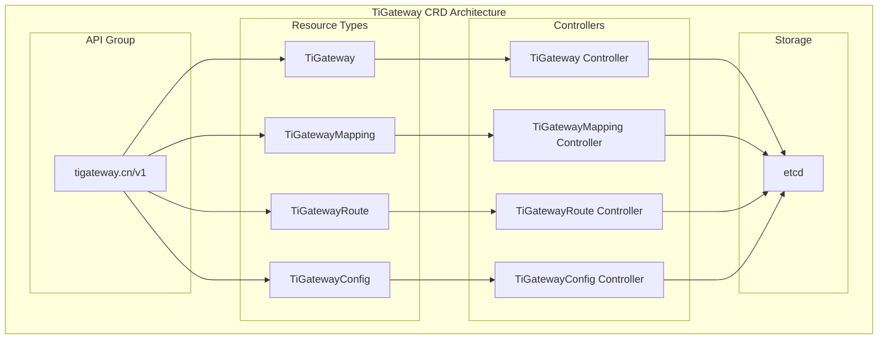

# CRD Resource Management

TiGateway provides comprehensive Custom Resource Definition (CRD) support, allowing users to manage gateway configurations through Kubernetes native methods.

## CRD Overview

### What is CRD

Custom Resource Definition (CRD) is Kubernetes' extension mechanism that allows users to define their own resource types. TiGateway leverages CRD to provide declarative gateway configuration management.

### TiGateway CRD Architecture



## Core CRD Resources

### 1. TiGateway

TiGateway is the main gateway resource that defines the configuration of gateway instances.

#### Resource Definition

```yaml
apiVersion: apiextensions.k8s.io/v1
kind: CustomResourceDefinition
metadata:
  name: tigateways.tigateway.cn
spec:
  group: tigateway.cn
  versions:
  - name: v1
    served: true
    storage: true
    schema:
      openAPIV3Schema:
        type: object
        properties:
          spec:
            type: object
            properties:
              replicas:
                type: integer
                minimum: 1
                maximum: 10
                default: 3
              image:
                type: object
                properties:
                  repository:
                    type: string
                  tag:
                    type: string
                  pullPolicy:
                    type: string
                    enum: ["Always", "IfNotPresent", "Never"]
              service:
                type: object
                properties:
                  type:
                    type: string
                    enum: ["ClusterIP", "NodePort", "LoadBalancer"]
                  ports:
                    type: object
                    properties:
                      gateway:
                        type: integer
                        default: 8080
                      admin:
                        type: integer
                        default: 8081
                      management:
                        type: integer
                        default: 8090
              resources:
                type: object
                properties:
                  limits:
                    type: object
                    properties:
                      cpu:
                        type: string
                      memory:
                        type: string
                  requests:
                    type: object
                    properties:
                      cpu:
                        type: string
                      memory:
                        type: string
              config:
                type: object
                properties:
                  routes:
                    type: array
                    items:
                      type: object
                      properties:
                        id:
                          type: string
                        uri:
                          type: string
                        predicates:
                          type: array
                        filters:
                          type: array
                        metadata:
                          type: object
            required: ["replicas", "image", "service"]
          status:
            type: object
            properties:
              phase:
                type: string
                enum: ["Pending", "Running", "Failed", "Terminating"]
              replicas:
                type: integer
              readyReplicas:
                type: integer
              conditions:
                type: array
                items:
                  type: object
                  properties:
                    type:
                      type: string
                    status:
                      type: string
                    lastTransitionTime:
                      type: string
                      format: date-time
                    reason:
                      type: string
                    message:
                      type: string
    additionalPrinterColumns:
    - name: Phase
      type: string
      jsonPath: .status.phase
    - name: Replicas
      type: integer
      jsonPath: .status.replicas
    - name: Ready
      type: integer
      jsonPath: .status.readyReplicas
    - name: Age
      type: date
      jsonPath: .metadata.creationTimestamp
```

#### Usage Example

```yaml
apiVersion: tigateway.cn/v1
kind: TiGateway
metadata:
  name: example-gateway
  namespace: tigateway
  labels:
    app: tigateway
    version: v1.0.0
spec:
  replicas: 3
  image:
    repository: tigateway/tigateway
    tag: v1.0.0
    pullPolicy: IfNotPresent
  service:
    type: ClusterIP
    ports:
      gateway: 8080
      admin: 8081
      management: 8090
  resources:
    limits:
      cpu: 1000m
      memory: 1Gi
    requests:
      cpu: 500m
      memory: 512Mi
  config:
    routes:
    - id: user-service
      uri: lb://user-service
      predicates:
      - Path=/api/users/**
      filters:
      - StripPrefix=2
      - AddRequestHeader=X-Gateway, TiGateway
      metadata:
        description: "User service route"
        version: "v1"
        tags:
        - "user"
        - "api"
    - id: order-service
      uri: lb://order-service
      predicates:
      - Path=/api/orders/**
      filters:
      - StripPrefix=2
      - CircuitBreaker=order-service
      metadata:
        description: "Order service route"
        version: "v1"
        tags:
        - "order"
        - "api"
```

### 2. TiGatewayMapping

TiGatewayMapping defines service mapping relationships for automatic discovery and route configuration.

#### Resource Definition

```yaml
apiVersion: apiextensions.k8s.io/v1
kind: CustomResourceDefinition
metadata:
  name: tigatewaymappings.tigateway.cn
spec:
  group: tigateway.cn
  versions:
  - name: v1
    served: true
    storage: true
    schema:
      openAPIV3Schema:
        type: object
        properties:
          spec:
            type: object
            properties:
              gateway:
                type: string
                description: "Associated TiGateway name"
              mappings:
                type: array
                items:
                  type: object
                  properties:
                    service:
                      type: string
                      description: "Kubernetes service name"
                    namespace:
                      type: string
                      description: "Service namespace"
                    path:
                      type: string
                      description: "Route path"
                    targetPath:
                      type: string
                      description: "Target path"
                    predicates:
                      type: array
                      description: "Route predicates"
                    filters:
                      type: array
                      description: "Route filters"
                    metadata:
                      type: object
                      description: "Route metadata"
                  required: ["service", "path"]
              selector:
                type: object
                properties:
                  matchLabels:
                    type: object
                    additionalProperties:
                      type: string
                  matchExpressions:
                    type: array
                    items:
                      type: object
                      properties:
                        key:
                          type: string
                        operator:
                          type: string
                          enum: ["In", "NotIn", "Exists", "DoesNotExist"]
                        values:
                          type: array
                          items:
                            type: string
            required: ["gateway", "mappings"]
          status:
            type: object
            properties:
              phase:
                type: string
                enum: ["Pending", "Active", "Failed"]
              mappedServices:
                type: integer
              lastSyncTime:
                type: string
                format: date-time
              conditions:
                type: array
                items:
                  type: object
                  properties:
                    type:
                      type: string
                    status:
                      type: string
                    lastTransitionTime:
                      type: string
                      format: date-time
                    reason:
                      type: string
                    message:
                      type: string
    additionalPrinterColumns:
    - name: Gateway
      type: string
      jsonPath: .spec.gateway
    - name: Phase
      type: string
      jsonPath: .status.phase
    - name: Mapped Services
      type: integer
      jsonPath: .status.mappedServices
    - name: Age
      type: date
      jsonPath: .metadata.creationTimestamp
```

#### Usage Example

```yaml
apiVersion: tigateway.cn/v1
kind: TiGatewayMapping
metadata:
  name: service-mapping
  namespace: tigateway
spec:
  gateway: example-gateway
  mappings:
  - service: user-service
    namespace: default
    path: /users
    targetPath: /
    predicates:
    - Path=/api/users/**
    filters:
    - StripPrefix=2
    - AddRequestHeader=X-Service, user-service
    metadata:
      description: "User service mapping"
      version: "v1"
  - service: order-service
    namespace: default
    path: /orders
    targetPath: /
    predicates:
    - Path=/api/orders/**
    filters:
    - StripPrefix=2
    - CircuitBreaker=order-service
    metadata:
      description: "Order service mapping"
      version: "v1"
  selector:
    matchLabels:
      app: microservice
      version: v1
```

### 3. TiGatewayRoute

TiGatewayRoute defines specific route configurations, supporting more granular route management.

#### Resource Definition

```yaml
apiVersion: apiextensions.k8s.io/v1
kind: CustomResourceDefinition
metadata:
  name: tigatewayroutes.tigateway.cn
spec:
  group: tigateway.cn
  versions:
  - name: v1
    served: true
    storage: true
    schema:
      openAPIV3Schema:
        type: object
        properties:
          spec:
            type: object
            properties:
              gateway:
                type: string
                description: "Associated TiGateway name"
              route:
                type: object
                properties:
                  id:
                    type: string
                    description: "Route ID"
                  uri:
                    type: string
                    description: "Target URI"
                  predicates:
                    type: array
                    items:
                      type: object
                      properties:
                        name:
                          type: string
                        args:
                          type: object
                  filters:
                    type: array
                    items:
                      type: object
                      properties:
                        name:
                          type: string
                        args:
                          type: object
                  metadata:
                    type: object
                  order:
                    type: integer
                    default: 0
                required: ["id", "uri", "predicates"]
              enabled:
                type: boolean
                default: true
              priority:
                type: integer
                default: 0
            required: ["gateway", "route"]
          status:
            type: object
            properties:
              phase:
                type: string
                enum: ["Pending", "Active", "Failed", "Disabled"]
              lastAppliedTime:
                type: string
                format: date-time
              conditions:
                type: array
                items:
                  type: object
                  properties:
                    type:
                      type: string
                    status:
                      type: string
                    lastTransitionTime:
                      type: string
                      format: date-time
                    reason:
                      type: string
                    message:
                      type: string
    additionalPrinterColumns:
    - name: Gateway
      type: string
      jsonPath: .spec.gateway
    - name: Route ID
      type: string
      jsonPath: .spec.route.id
    - name: Phase
      type: string
      jsonPath: .status.phase
    - name: Enabled
      type: boolean
      jsonPath: .spec.enabled
    - name: Age
      type: date
      jsonPath: .metadata.creationTimestamp
```

#### Usage Example

```yaml
apiVersion: tigateway.cn/v1
kind: TiGatewayRoute
metadata:
  name: user-service-route
  namespace: tigateway
spec:
  gateway: example-gateway
  route:
    id: user-service
    uri: lb://user-service
    predicates:
    - name: Path
      args:
        pattern: /api/users/**
    - name: Method
      args:
        methods: GET,POST,PUT,DELETE
    filters:
    - name: StripPrefix
      args:
        parts: 2
    - name: AddRequestHeader
      args:
        name: X-Gateway
        value: TiGateway
    - name: CircuitBreaker
      args:
        name: user-service
        fallbackUri: forward:/fallback
    metadata:
      description: "User service route"
      version: "v1"
      tags:
      - "user"
      - "api"
      - "crud"
    order: 1
  enabled: true
  priority: 100
```

### 4. TiGatewayConfig

TiGatewayConfig defines global gateway configuration, including filters, security settings, etc.

#### Resource Definition

```yaml
apiVersion: apiextensions.k8s.io/v1
kind: CustomResourceDefinition
metadata:
  name: tigatewayconfigs.tigateway.cn
spec:
  group: tigateway.cn
  versions:
  - name: v1
    served: true
    storage: true
    schema:
      openAPIV3Schema:
        type: object
        properties:
          spec:
            type: object
            properties:
              gateway:
                type: string
                description: "Associated TiGateway name"
              globalFilters:
                type: array
                items:
                  type: object
                  properties:
                    name:
                      type: string
                    args:
                      type: object
                    order:
                      type: integer
                      default: 0
              defaultFilters:
                type: array
                items:
                  type: object
                  properties:
                    name:
                      type: string
                    args:
                      type: object
              security:
                type: object
                properties:
                  cors:
                    type: object
                    properties:
                      allowedOrigins:
                        type: array
                        items:
                          type: string
                      allowedMethods:
                        type: array
                        items:
                          type: string
                      allowedHeaders:
                        type: array
                        items:
                          type: string
                  rateLimit:
                    type: object
                    properties:
                      enabled:
                        type: boolean
                      requestsPerMinute:
                        type: integer
                      burstCapacity:
                        type: integer
                  authentication:
                    type: object
                    properties:
                      enabled:
                        type: boolean
                      type:
                        type: string
                        enum: ["jwt", "oauth2", "basic"]
                      config:
                        type: object
              monitoring:
                type: object
                properties:
                  enabled:
                    type: boolean
                  metrics:
                    type: object
                    properties:
                      enabled:
                        type: boolean
                      path:
                        type: string
                        default: "/actuator/prometheus"
                  tracing:
                    type: object
                    properties:
                      enabled:
                        type: boolean
                      endpoint:
                        type: string
            required: ["gateway"]
          status:
            type: object
            properties:
              phase:
                type: string
                enum: ["Pending", "Active", "Failed"]
              lastAppliedTime:
                type: string
                format: date-time
              conditions:
                type: array
                items:
                  type: object
                  properties:
                    type:
                      type: string
                    status:
                      type: string
                    lastTransitionTime:
                      type: string
                      format: date-time
                    reason:
                      type: string
                    message:
                      type: string
    additionalPrinterColumns:
    - name: Gateway
      type: string
      jsonPath: .spec.gateway
    - name: Phase
      type: string
      jsonPath: .status.phase
    - name: Age
      type: date
      jsonPath: .metadata.creationTimestamp
```

#### Usage Example

```yaml
apiVersion: tigateway.cn/v1
kind: TiGatewayConfig
metadata:
  name: gateway-config
  namespace: tigateway
spec:
  gateway: example-gateway
  globalFilters:
  - name: RequestLogging
    args:
      level: INFO
    order: -1000
  - name: RequestId
    args:
      headerName: X-Request-ID
    order: -999
  - name: Authentication
    args:
      type: jwt
      secret: ${JWT_SECRET}
    order: -100
  - name: RateLimit
    args:
      requestsPerMinute: 100
      burstCapacity: 200
    order: -50
  defaultFilters:
  - name: AddResponseHeader
    args:
      name: X-Gateway
      value: TiGateway
  - name: AddResponseHeader
    args:
      name: X-Response-Time
      value: ${response.time}
  security:
    cors:
      allowedOrigins:
      - "*"
      allowedMethods:
      - GET
      - POST
      - PUT
      - DELETE
      - OPTIONS
      allowedHeaders:
      - Content-Type
      - Authorization
      - X-Requested-With
    rateLimit:
      enabled: true
      requestsPerMinute: 100
      burstCapacity: 200
    authentication:
      enabled: true
      type: jwt
      config:
        secret: ${JWT_SECRET}
        expiration: 3600
  monitoring:
    enabled: true
    metrics:
      enabled: true
      path: "/actuator/prometheus"
    tracing:
      enabled: true
      endpoint: "http://jaeger:14268/api/traces"
```

## CRD Controllers

### 1. TiGateway Controller

```java
@Controller
public class TiGatewayController {
    
    @Autowired
    private TiGatewayService tiGatewayService;
    
    @Autowired
    private KubernetesClient kubernetesClient;
    
    @KubernetesInformers
    public class TiGatewayInformer {
        
        @OnAdd
        public void onAdd(TiGateway tiGateway) {
            log.info("TiGateway added: {}", tiGateway.getMetadata().getName());
            tiGatewayService.createTiGateway(tiGateway);
        }
        
        @OnUpdate
        public void onUpdate(TiGateway oldTiGateway, TiGateway newTiGateway) {
            log.info("TiGateway updated: {}", newTiGateway.getMetadata().getName());
            tiGatewayService.updateTiGateway(oldTiGateway, newTiGateway);
        }
        
        @OnDelete
        public void onDelete(TiGateway tiGateway, boolean deletedFinalStateUnknown) {
            log.info("TiGateway deleted: {}", tiGateway.getMetadata().getName());
            tiGatewayService.deleteTiGateway(tiGateway);
        }
    }
    
    @Service
    public class TiGatewayService {
        
        public void createTiGateway(TiGateway tiGateway) {
            // Create Deployment
            createDeployment(tiGateway);
            
            // Create Service
            createService(tiGateway);
            
            // Create ConfigMap
            createConfigMap(tiGateway);
            
            // Update status
            updateStatus(tiGateway, "Running");
        }
        
        public void updateTiGateway(TiGateway oldTiGateway, TiGateway newTiGateway) {
            // Check if update is needed
            if (needsUpdate(oldTiGateway, newTiGateway)) {
                // Update Deployment
                updateDeployment(newTiGateway);
                
                // Update ConfigMap
                updateConfigMap(newTiGateway);
                
                // Update status
                updateStatus(newTiGateway, "Running");
            }
        }
        
        public void deleteTiGateway(TiGateway tiGateway) {
            // Delete related resources
            deleteDeployment(tiGateway);
            deleteService(tiGateway);
            deleteConfigMap(tiGateway);
        }
        
        private void createDeployment(TiGateway tiGateway) {
            Deployment deployment = new DeploymentBuilder()
                .withNewMetadata()
                    .withName(tiGateway.getMetadata().getName())
                    .withNamespace(tiGateway.getMetadata().getNamespace())
                    .withLabels(tiGateway.getMetadata().getLabels())
                .endMetadata()
                .withNewSpec()
                    .withReplicas(tiGateway.getSpec().getReplicas())
                    .withNewSelector()
                        .addToMatchLabels("app", tiGateway.getMetadata().getName())
                    .endSelector()
                    .withNewTemplate()
                        .withNewMetadata()
                            .addToLabels("app", tiGateway.getMetadata().getName())
                        .endMetadata()
                        .withNewSpec()
                            .addNewContainer()
                                .withName("tigateway")
                                .withImage(tiGateway.getSpec().getImage().getRepository() + ":" + 
                                          tiGateway.getSpec().getImage().getTag())
                                .withImagePullPolicy(tiGateway.getSpec().getImage().getPullPolicy())
                                .addNewPort()
                                    .withContainerPort(tiGateway.getSpec().getService().getPorts().getGateway())
                                    .withName("gateway")
                                .endPort()
                                .addNewPort()
                                    .withContainerPort(tiGateway.getSpec().getService().getPorts().getAdmin())
                                    .withName("admin")
                                .endPort()
                                .addNewPort()
                                    .withContainerPort(tiGateway.getSpec().getService().getPorts().getManagement())
                                    .withName("management")
                                .endPort()
                                .withResources(tiGateway.getSpec().getResources())
                            .endContainer()
                        .endSpec()
                    .endTemplate()
                .endSpec()
                .build();
            
            kubernetesClient.apps().deployments()
                .inNamespace(tiGateway.getMetadata().getNamespace())
                .create(deployment);
        }
        
        private void updateStatus(TiGateway tiGateway, String phase) {
            TiGatewayStatus status = new TiGatewayStatus();
            status.setPhase(phase);
            status.setReplicas(tiGateway.getSpec().getReplicas());
            status.setReadyReplicas(getReadyReplicas(tiGateway));
            status.setConditions(getConditions(tiGateway));
            
            tiGateway.setStatus(status);
            kubernetesClient.customResources(TiGateway.class)
                .inNamespace(tiGateway.getMetadata().getNamespace())
                .updateStatus(tiGateway);
        }
    }
}
```

### 2. TiGatewayMapping Controller

```java
@Controller
public class TiGatewayMappingController {
    
    @Autowired
    private TiGatewayMappingService mappingService;
    
    @KubernetesInformers
    public class TiGatewayMappingInformer {
        
        @OnAdd
        public void onAdd(TiGatewayMapping mapping) {
            log.info("TiGatewayMapping added: {}", mapping.getMetadata().getName());
            mappingService.createMapping(mapping);
        }
        
        @OnUpdate
        public void onUpdate(TiGatewayMapping oldMapping, TiGatewayMapping newMapping) {
            log.info("TiGatewayMapping updated: {}", newMapping.getMetadata().getName());
            mappingService.updateMapping(oldMapping, newMapping);
        }
        
        @OnDelete
        public void onDelete(TiGatewayMapping mapping, boolean deletedFinalStateUnknown) {
            log.info("TiGatewayMapping deleted: {}", mapping.getMetadata().getName());
            mappingService.deleteMapping(mapping);
        }
    }
    
    @Service
    public class TiGatewayMappingService {
        
        public void createMapping(TiGatewayMapping mapping) {
            // Discover services
            List<Service> services = discoverServices(mapping);
            
            // Create routes
            for (Service service : services) {
                createRouteFromService(mapping, service);
            }
            
            // Update status
            updateMappingStatus(mapping, "Active", services.size());
        }
        
        public void updateMapping(TiGatewayMapping oldMapping, TiGatewayMapping newMapping) {
            // Delete old routes
            deleteRoutes(oldMapping);
            
            // Create new routes
            createMapping(newMapping);
        }
        
        public void deleteMapping(TiGatewayMapping mapping) {
            // Delete related routes
            deleteRoutes(mapping);
        }
        
        private List<Service> discoverServices(TiGatewayMapping mapping) {
            return kubernetesClient.services()
                .inNamespace(mapping.getSpec().getMappings().get(0).getNamespace())
                .withLabels(mapping.getSpec().getSelector().getMatchLabels())
                .list()
                .getItems();
        }
        
        private void createRouteFromService(TiGatewayMapping mapping, Service service) {
            // Create route configuration based on service
            RouteDefinition route = new RouteDefinition();
            route.setId(service.getMetadata().getName());
            route.setUri("lb://" + service.getMetadata().getName());
            
            // Set predicates
            List<PredicateDefinition> predicates = new ArrayList<>();
            PredicateDefinition pathPredicate = new PredicateDefinition();
            pathPredicate.setName("Path");
            pathPredicate.addArg("pattern", "/" + service.getMetadata().getName() + "/**");
            predicates.add(pathPredicate);
            route.setPredicates(predicates);
            
            // Set filters
            List<FilterDefinition> filters = new ArrayList<>();
            FilterDefinition rewriteFilter = new FilterDefinition();
            rewriteFilter.setName("RewritePath");
            rewriteFilter.addArg("regexp", "/" + service.getMetadata().getName() + "/?(?<remaining>.*)");
            rewriteFilter.addArg("replacement", "/${remaining}");
            filters.add(rewriteFilter);
            route.setFilters(filters);
            
            // Save route configuration
            saveRouteConfig(mapping.getSpec().getGateway(), route);
        }
    }
}
```

## CRD Management Tools

### 1. kubectl Plugin

```bash
# Install TiGateway kubectl plugin
kubectl krew install tigateway

# View all TiGateway resources
kubectl tigateway get all

# View specific gateway
kubectl tigateway get gateway example-gateway

# View gateway status
kubectl tigateway status example-gateway

# View gateway routes
kubectl tigateway routes example-gateway

# Create gateway
kubectl tigateway create -f gateway.yaml

# Update gateway
kubectl tigateway update -f gateway.yaml

# Delete gateway
kubectl tigateway delete example-gateway
```

### 2. Management Interface Integration

```java
@RestController
@RequestMapping("/api/crd")
public class CRDController {
    
    @Autowired
    private KubernetesClient kubernetesClient;
    
    @GetMapping("/tigateways")
    public List<TiGateway> getTiGateways() {
        return kubernetesClient.customResources(TiGateway.class)
            .inNamespace("tigateway")
            .list()
            .getItems();
    }
    
    @GetMapping("/tigateways/{name}")
    public TiGateway getTiGateway(@PathVariable String name) {
        return kubernetesClient.customResources(TiGateway.class)
            .inNamespace("tigateway")
            .withName(name)
            .get();
    }
    
    @PostMapping("/tigateways")
    public TiGateway createTiGateway(@RequestBody TiGateway tiGateway) {
        return kubernetesClient.customResources(TiGateway.class)
            .inNamespace("tigateway")
            .create(tiGateway);
    }
    
    @PutMapping("/tigateways/{name}")
    public TiGateway updateTiGateway(@PathVariable String name, @RequestBody TiGateway tiGateway) {
        return kubernetesClient.customResources(TiGateway.class)
            .inNamespace("tigateway")
            .withName(name)
            .update(tiGateway);
    }
    
    @DeleteMapping("/tigateways/{name}")
    public void deleteTiGateway(@PathVariable String name) {
        kubernetesClient.customResources(TiGateway.class)
            .inNamespace("tigateway")
            .withName(name)
            .delete();
    }
}
```

## Best Practices

### 1. Resource Naming Conventions

```yaml
# Recommended naming conventions
apiVersion: tigateway.cn/v1
kind: TiGateway
metadata:
  name: tigateway-prod          # environment-type
  namespace: tigateway-prod     # environment namespace
  labels:
    app: tigateway
    environment: production
    version: v1.0.0
    team: platform
```

### 2. Resource Organization

```yaml
# Organize resources by environment
apiVersion: tigateway.cn/v1
kind: TiGateway
metadata:
  name: tigateway-dev
  namespace: tigateway-dev
  labels:
    environment: development
---
apiVersion: tigateway.cn/v1
kind: TiGateway
metadata:
  name: tigateway-staging
  namespace: tigateway-staging
  labels:
    environment: staging
---
apiVersion: tigateway.cn/v1
kind: TiGateway
metadata:
  name: tigateway-prod
  namespace: tigateway-prod
  labels:
    environment: production
```

### 3. Configuration Management

```yaml
# Use ConfigMap for configuration management
apiVersion: v1
kind: ConfigMap
metadata:
  name: tigateway-config
  namespace: tigateway
data:
  application.yml: |
    spring:
      cloud:
        gateway:
          global-filters:
          - name: RequestLogging
            args:
              level: INFO
          - name: RateLimit
            args:
              requests-per-minute: 100
---
apiVersion: tigateway.cn/v1
kind: TiGateway
metadata:
  name: example-gateway
spec:
  config:
    configMapRef:
      name: tigateway-config
```

### 4. Monitoring and Alerting

```yaml
# Configure monitoring
apiVersion: monitoring.coreos.com/v1
kind: ServiceMonitor
metadata:
  name: tigateway
  namespace: tigateway
spec:
  selector:
    matchLabels:
      app: tigateway
  endpoints:
  - port: management
    path: /actuator/prometheus
---
# Configure alerts
apiVersion: monitoring.coreos.com/v1
kind: PrometheusRule
metadata:
  name: tigateway-alerts
  namespace: tigateway
spec:
  groups:
  - name: tigateway
    rules:
    - alert: TiGatewayDown
      expr: up{job="tigateway"} == 0
      for: 1m
      labels:
        severity: critical
      annotations:
        summary: "TiGateway is down"
        description: "TiGateway instance {{ $labels.instance }} is down"
```

## Troubleshooting

### 1. Common Issues

#### CRD Not Registered
```bash
# Check if CRD is registered
kubectl get crd | grep tigateway

# Re-register CRD
kubectl apply -f tigateway-crds.yaml
```

#### Controller Not Started
```bash
# Check controller status
kubectl get pods -n tigateway-system

# View controller logs
kubectl logs -f deployment/tigateway-controller -n tigateway-system
```

#### Resource Status Abnormal
```bash
# View resource status
kubectl describe tigateway example-gateway

# View events
kubectl get events -n tigateway --sort-by='.lastTimestamp'
```

### 2. Debug Commands

```bash
# View CRD definition
kubectl get crd tigateways.tigateway.cn -o yaml

# View resource details
kubectl get tigateway example-gateway -o yaml

# View controller logs
kubectl logs -f deployment/tigateway-controller -n tigateway-system
```

## Summary

TiGateway's CRD resource management provides complete Kubernetes native configuration management capabilities:

1. **Complete CRD Definitions**: Supports TiGateway, TiGatewayMapping, TiGatewayRoute, TiGatewayConfig, and other resources
2. **Declarative Configuration**: Manages configuration through YAML files declaratively
3. **Automatic Controllers**: Provides complete controller implementation for automatic resource lifecycle management
4. **Management Tools**: Provides kubectl plugins and management interface integration
5. **Best Practices**: Follows Kubernetes resource management best practices
6. **Monitoring and Alerting**: Supports complete monitoring and alerting configuration

Through CRD resource management, users can manage TiGateway configurations in a Kubernetes native way, achieving declarative gateway management.