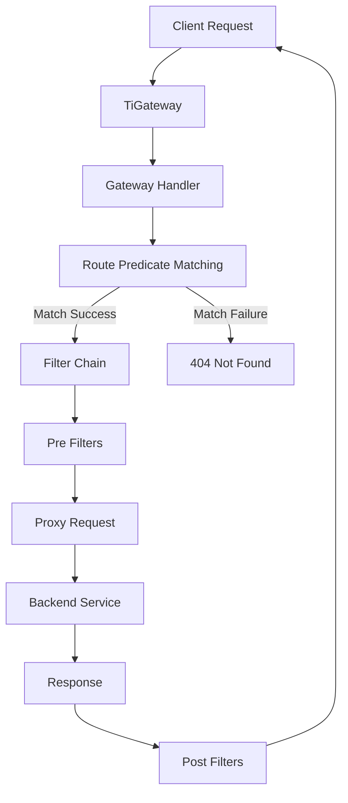

# TiGateway Predicate Factories Development Guide

## Overview

This guide provides detailed instructions for developing predicate factories in TiGateway. You'll learn how to create custom route predicates for request matching, including header-based, parameter-based, time-based, and composite predicates.

## Basic Predicate Factory Structure

### Abstract Predicate Factory

```java
@Component
public class CustomPredicateFactory extends AbstractRoutePredicateFactory<CustomPredicateFactory.Config> {
    
    public CustomPredicateFactory() {
        super(Config.class);
    }
    
    @Override
    public Predicate<ServerWebExchange> apply(Config config) {
        return exchange -> {
            // Predicate logic implementation
            return true; // or false based on conditions
        };
    }
    
    @Data
    public static class Config {
        // Configuration properties
        private String property1;
        private String property2;
    }
}
```

### Predicate Execution Flow



## Request Header-based Predicates

### Header Value Predicate

```java
@Component
@Slf4j
public class HeaderValuePredicateFactory extends AbstractRoutePredicateFactory<HeaderValuePredicateFactory.Config> {
    
    public HeaderValuePredicateFactory() {
        super(Config.class);
    }
    
    @Override
    public Predicate<ServerWebExchange> apply(Config config) {
        return exchange -> {
            ServerHttpRequest request = exchange.getRequest();
            String headerValue = request.getHeaders().getFirst(config.getHeaderName());
            
            if (headerValue == null) {
                log.debug("Header {} not found in request", config.getHeaderName());
                return false;
            }
            
            boolean matches = config.getMatchType().matches(headerValue, config.getExpectedValue());
            log.debug("Header predicate check: {}={}, expected={}, matches={}", 
                config.getHeaderName(), headerValue, config.getExpectedValue(), matches);
            
            return matches;
        };
    }
    
    @Override
    public List<String> shortcutFieldOrder() {
        return Arrays.asList("headerName", "expectedValue");
    }
    
    @Data
    public static class Config {
        private String headerName;
        private String expectedValue;
        private MatchType matchType = MatchType.EQUALS;
        
        public enum MatchType {
            EQUALS {
                @Override
                public boolean matches(String actual, String expected) {
                    return Objects.equals(actual, expected);
                }
            },
            CONTAINS {
                @Override
                public boolean matches(String actual, String expected) {
                    return actual != null && actual.contains(expected);
                }
            },
            STARTS_WITH {
                @Override
                public boolean matches(String actual, String expected) {
                    return actual != null && actual.startsWith(expected);
                }
            },
            ENDS_WITH {
                @Override
                public boolean matches(String actual, String expected) {
                    return actual != null && actual.endsWith(expected);
                }
            },
            REGEX {
                @Override
                public boolean matches(String actual, String expected) {
                    return actual != null && actual.matches(expected);
                }
            };
            
            public abstract boolean matches(String actual, String expected);
        }
    }
}
```

### Multiple Header Predicate

```java
@Component
@Slf4j
public class MultipleHeaderPredicateFactory extends AbstractRoutePredicateFactory<MultipleHeaderPredicateFactory.Config> {
    
    public MultipleHeaderPredicateFactory() {
        super(Config.class);
    }
    
    @Override
    public Predicate<ServerWebExchange> apply(Config config) {
        return exchange -> {
            ServerHttpRequest request = exchange.getRequest();
            
            for (HeaderCondition condition : config.getConditions()) {
                String headerValue = request.getHeaders().getFirst(condition.getHeaderName());
                
                if (headerValue == null) {
                    if (condition.isRequired()) {
                        log.debug("Required header {} not found", condition.getHeaderName());
                        return false;
                    }
                    continue;
                }
                
                boolean matches = condition.getMatchType().matches(headerValue, condition.getExpectedValue());
                if (!matches) {
                    log.debug("Header condition failed: {}={}, expected={}", 
                        condition.getHeaderName(), headerValue, condition.getExpectedValue());
                    return false;
                }
            }
            
            log.debug("All header conditions satisfied");
            return true;
        };
    }
    
    @Data
    public static class Config {
        private List<HeaderCondition> conditions = new ArrayList<>();
        private boolean requireAll = true; // true = AND, false = OR
    }
    
    @Data
    public static class HeaderCondition {
        private String headerName;
        private String expectedValue;
        private MatchType matchType = MatchType.EQUALS;
        private boolean required = true;
        
        public enum MatchType {
            EQUALS, CONTAINS, STARTS_WITH, ENDS_WITH, REGEX
        }
    }
}
```

## Request Parameter-based Predicates

### Query Parameter Predicate

```java
@Component
@Slf4j
public class QueryParameterPredicateFactory extends AbstractRoutePredicateFactory<QueryParameterPredicateFactory.Config> {
    
    public QueryParameterPredicateFactory() {
        super(Config.class);
    }
    
    @Override
    public Predicate<ServerWebExchange> apply(Config config) {
        return exchange -> {
            ServerHttpRequest request = exchange.getRequest();
            MultiValueMap<String, String> queryParams = request.getQueryParams();
            
            String paramValue = queryParams.getFirst(config.getParamName());
            
            if (paramValue == null) {
                log.debug("Query parameter {} not found", config.getParamName());
                return !config.isRequired();
            }
            
            boolean matches = config.getMatchType().matches(paramValue, config.getExpectedValue());
            log.debug("Query parameter predicate check: {}={}, expected={}, matches={}", 
                config.getParamName(), paramValue, config.getExpectedValue(), matches);
            
            return matches;
        };
    }
    
    @Override
    public List<String> shortcutFieldOrder() {
        return Arrays.asList("paramName", "expectedValue");
    }
    
    @Data
    public static class Config {
        private String paramName;
        private String expectedValue;
        private MatchType matchType = MatchType.EQUALS;
        private boolean required = true;
        
        public enum MatchType {
            EQUALS, CONTAINS, STARTS_WITH, ENDS_WITH, REGEX, EXISTS
        }
    }
}
```

### Form Parameter Predicate

```java
@Component
@Slf4j
public class FormParameterPredicateFactory extends AbstractRoutePredicateFactory<FormParameterPredicateFactory.Config> {
    
    public FormParameterPredicateFactory() {
        super(Config.class);
    }
    
    @Override
    public Predicate<ServerWebExchange> apply(Config config) {
        return exchange -> {
            ServerHttpRequest request = exchange.getRequest();
            
            if (!MediaType.APPLICATION_FORM_URLENCODED.isCompatibleWith(
                request.getHeaders().getContentType())) {
                log.debug("Request is not form-encoded");
                return !config.isRequired();
            }
            
            return DataBufferUtils.join(request.getBody())
                .defaultIfEmpty(DataBufferFactory.DEFAULT_ALLOCATOR.allocateBuffer(0))
                .map(dataBuffer -> {
                    try {
                        byte[] bytes = new byte[dataBuffer.readableByteCount()];
                        dataBuffer.read(bytes);
                        DataBufferUtils.release(dataBuffer);
                        
                        String body = new String(bytes, StandardCharsets.UTF_8);
                        MultiValueMap<String, String> formParams = parseFormData(body);
                        
                        String paramValue = formParams.getFirst(config.getParamName());
                        
                        if (paramValue == null) {
                            log.debug("Form parameter {} not found", config.getParamName());
                            return !config.isRequired();
                        }
                        
                        boolean matches = config.getMatchType().matches(paramValue, config.getExpectedValue());
                        log.debug("Form parameter predicate check: {}={}, expected={}, matches={}", 
                            config.getParamName(), paramValue, config.getExpectedValue(), matches);
                        
                        return matches;
                        
                    } catch (Exception e) {
                        log.error("Error parsing form data", e);
                        return false;
                    }
                })
                .block();
        };
    }
    
    private MultiValueMap<String, String> parseFormData(String body) {
        MultiValueMap<String, String> formParams = new LinkedMultiValueMap<>();
        
        if (body != null && !body.isEmpty()) {
            String[] pairs = body.split("&");
            for (String pair : pairs) {
                String[] keyValue = pair.split("=", 2);
                if (keyValue.length == 2) {
                    try {
                        String key = URLDecoder.decode(keyValue[0], StandardCharsets.UTF_8);
                        String value = URLDecoder.decode(keyValue[1], StandardCharsets.UTF_8);
                        formParams.add(key, value);
                    } catch (Exception e) {
                        log.warn("Error decoding form parameter: {}", pair, e);
                    }
                }
            }
        }
        
        return formParams;
    }
    
    @Data
    public static class Config {
        private String paramName;
        private String expectedValue;
        private MatchType matchType = MatchType.EQUALS;
        private boolean required = true;
        
        public enum MatchType {
            EQUALS, CONTAINS, STARTS_WITH, ENDS_WITH, REGEX
        }
    }
}
```

## Time-based Predicates

### Business Hours Predicate

```java
@Component
@Slf4j
public class BusinessHoursPredicateFactory extends AbstractRoutePredicateFactory<BusinessHoursPredicateFactory.Config> {
    
    public BusinessHoursPredicateFactory() {
        super(Config.class);
    }
    
    @Override
    public Predicate<ServerWebExchange> apply(Config config) {
        return exchange -> {
            LocalTime currentTime = LocalTime.now();
            LocalTime startTime = config.getStartTime();
            LocalTime endTime = config.getEndTime();
            
            boolean isBusinessHours = currentTime.isAfter(startTime) && currentTime.isBefore(endTime);
            
            // Check day of week if configured
            if (isBusinessHours && config.getBusinessDays() != null && !config.getBusinessDays().isEmpty()) {
                DayOfWeek currentDay = LocalDate.now().getDayOfWeek();
                isBusinessHours = config.getBusinessDays().contains(currentDay);
            }
            
            log.debug("Business hours predicate check: current={}, start={}, end={}, days={}, result={}", 
                currentTime, startTime, endTime, config.getBusinessDays(), isBusinessHours);
            
            return isBusinessHours;
        };
    }
    
    @Override
    public List<String> shortcutFieldOrder() {
        return Arrays.asList("startTime", "endTime");
    }
    
    @Data
    public static class Config {
        @DateTimeFormat(pattern = "HH:mm")
        private LocalTime startTime = LocalTime.of(9, 0);
        
        @DateTimeFormat(pattern = "HH:mm")
        private LocalTime endTime = LocalTime.of(17, 0);
        
        private List<DayOfWeek> businessDays = Arrays.asList(
            DayOfWeek.MONDAY, DayOfWeek.TUESDAY, DayOfWeek.WEDNESDAY, 
            DayOfWeek.THURSDAY, DayOfWeek.FRIDAY
        );
    }
}
```

### Time Range Predicate

```java
@Component
@Slf4j
public class TimeRangePredicateFactory extends AbstractRoutePredicateFactory<TimeRangePredicateFactory.Config> {
    
    public TimeRangePredicateFactory() {
        super(Config.class);
    }
    
    @Override
    public Predicate<ServerWebExchange> apply(Config config) {
        return exchange -> {
            LocalDateTime currentDateTime = LocalDateTime.now();
            
            boolean isInRange = currentDateTime.isAfter(config.getStartDateTime()) && 
                               currentDateTime.isBefore(config.getEndDateTime());
            
            log.debug("Time range predicate check: current={}, start={}, end={}, result={}", 
                currentDateTime, config.getStartDateTime(), config.getEndDateTime(), isInRange);
            
            return isInRange;
        };
    }
    
    @Data
    public static class Config {
        @DateTimeFormat(pattern = "yyyy-MM-dd HH:mm:ss")
        private LocalDateTime startDateTime;
        
        @DateTimeFormat(pattern = "yyyy-MM-dd HH:mm:ss")
        private LocalDateTime endDateTime;
    }
}
```

## Geo-location-based Predicates

### IP-based Location Predicate

```java
@Component
@Slf4j
public class IpLocationPredicateFactory extends AbstractRoutePredicateFactory<IpLocationPredicateFactory.Config> {
    
    private final GeoLocationService geoLocationService;
    
    public IpLocationPredicateFactory(GeoLocationService geoLocationService) {
        super(Config.class);
        this.geoLocationService = geoLocationService;
    }
    
    @Override
    public Predicate<ServerWebExchange> apply(Config config) {
        return exchange -> {
            String clientIp = getClientIp(exchange.getRequest());
            
            try {
                GeoLocation location = geoLocationService.getLocation(clientIp);
                
                boolean matches = false;
                switch (config.getMatchType()) {
                    case COUNTRY:
                        matches = config.getCountries().contains(location.getCountry());
                        break;
                    case REGION:
                        matches = config.getRegions().contains(location.getRegion());
                        break;
                    case CITY:
                        matches = config.getCities().contains(location.getCity());
                        break;
                    case COORDINATES:
                        matches = isWithinRadius(location, config.getLatitude(), config.getLongitude(), config.getRadius());
                        break;
                }
                
                log.debug("IP location predicate check: ip={}, location={}, matches={}", 
                    clientIp, location, matches);
                
                return matches;
                
            } catch (Exception e) {
                log.warn("Error getting location for IP: {}", clientIp, e);
                return config.isAllowOnError();
            }
        };
    }
    
    private String getClientIp(ServerHttpRequest request) {
        String xForwardedFor = request.getHeaders().getFirst("X-Forwarded-For");
        if (xForwardedFor != null && !xForwardedFor.isEmpty()) {
            return xForwardedFor.split(",")[0].trim();
        }
        
        String xRealIp = request.getHeaders().getFirst("X-Real-IP");
        if (xRealIp != null && !xRealIp.isEmpty()) {
            return xRealIp;
        }
        
        return request.getRemoteAddress() != null ? 
            request.getRemoteAddress().getAddress().getHostAddress() : "unknown";
    }
    
    private boolean isWithinRadius(GeoLocation location, double latitude, double longitude, double radiusKm) {
        double distance = calculateDistance(
            location.getLatitude(), location.getLongitude(),
            latitude, longitude
        );
        return distance <= radiusKm;
    }
    
    private double calculateDistance(double lat1, double lon1, double lat2, double lon2) {
        // Haversine formula implementation
        final int R = 6371; // Earth's radius in kilometers
        
        double latDistance = Math.toRadians(lat2 - lat1);
        double lonDistance = Math.toRadians(lon2 - lon1);
        double a = Math.sin(latDistance / 2) * Math.sin(latDistance / 2)
                + Math.cos(Math.toRadians(lat1)) * Math.cos(Math.toRadians(lat2))
                * Math.sin(lonDistance / 2) * Math.sin(lonDistance / 2);
        double c = 2 * Math.atan2(Math.sqrt(a), Math.sqrt(1 - a));
        
        return R * c;
    }
    
    @Data
    public static class Config {
        private MatchType matchType = MatchType.COUNTRY;
        private List<String> countries = new ArrayList<>();
        private List<String> regions = new ArrayList<>();
        private List<String> cities = new ArrayList<>();
        private double latitude;
        private double longitude;
        private double radius; // in kilometers
        private boolean allowOnError = false;
        
        public enum MatchType {
            COUNTRY, REGION, CITY, COORDINATES
        }
    }
}
```

## User Role-based Predicates

### Role-based Access Predicate

```java
@Component
@Slf4j
public class RoleBasedPredicateFactory extends AbstractRoutePredicateFactory<RoleBasedPredicateFactory.Config> {
    
    public RoleBasedPredicateFactory() {
        super(Config.class);
    }
    
    @Override
    public Predicate<ServerWebExchange> apply(Config config) {
        return exchange -> {
            ServerHttpRequest request = exchange.getRequest();
            
            // Extract user roles from request headers or JWT token
            List<String> userRoles = extractUserRoles(request);
            
            if (userRoles.isEmpty()) {
                log.debug("No user roles found in request");
                return config.isAllowAnonymous();
            }
            
            boolean hasRequiredRole = config.getRequiredRoles().stream()
                .anyMatch(userRoles::contains);
            
            log.debug("Role-based predicate check: userRoles={}, requiredRoles={}, matches={}", 
                userRoles, config.getRequiredRoles(), hasRequiredRole);
            
            return hasRequiredRole;
        };
    }
    
    private List<String> extractUserRoles(ServerHttpRequest request) {
        List<String> roles = new ArrayList<>();
        
        // Try to get roles from header
        String rolesHeader = request.getHeaders().getFirst("X-User-Roles");
        if (rolesHeader != null && !rolesHeader.isEmpty()) {
            roles.addAll(Arrays.asList(rolesHeader.split(",")));
        }
        
        // Try to get roles from JWT token
        String authHeader = request.getHeaders().getFirst("Authorization");
        if (authHeader != null && authHeader.startsWith("Bearer ")) {
            String token = authHeader.substring(7);
            try {
                List<String> tokenRoles = extractRolesFromToken(token);
                roles.addAll(tokenRoles);
            } catch (Exception e) {
                log.warn("Error extracting roles from token", e);
            }
        }
        
        return roles.stream()
            .map(String::trim)
            .filter(role -> !role.isEmpty())
            .collect(Collectors.toList());
    }
    
    private List<String> extractRolesFromToken(String token) {
        // Implementation to extract roles from JWT token
        // This would typically use a JWT utility class
        return new ArrayList<>();
    }
    
    @Data
    public static class Config {
        private List<String> requiredRoles = new ArrayList<>();
        private boolean allowAnonymous = false;
    }
}
```

## Request Size Predicates

### Request Size Predicate

```java
@Component
@Slf4j
public class RequestSizePredicateFactory extends AbstractRoutePredicateFactory<RequestSizePredicateFactory.Config> {
    
    public RequestSizePredicateFactory() {
        super(Config.class);
    }
    
    @Override
    public Predicate<ServerWebExchange> apply(Config config) {
        return exchange -> {
            ServerHttpRequest request = exchange.getRequest();
            
            // Get content length from headers
            String contentLengthHeader = request.getHeaders().getFirst("Content-Length");
            long contentLength = 0;
            
            if (contentLengthHeader != null) {
                try {
                    contentLength = Long.parseLong(contentLengthHeader);
                } catch (NumberFormatException e) {
                    log.warn("Invalid Content-Length header: {}", contentLengthHeader);
                }
            }
            
            boolean matches = false;
            switch (config.getComparisonType()) {
                case LESS_THAN:
                    matches = contentLength < config.getSize();
                    break;
                case LESS_THAN_OR_EQUAL:
                    matches = contentLength <= config.getSize();
                    break;
                case GREATER_THAN:
                    matches = contentLength > config.getSize();
                    break;
                case GREATER_THAN_OR_EQUAL:
                    matches = contentLength >= config.getSize();
                    break;
                case EQUALS:
                    matches = contentLength == config.getSize();
                    break;
                case BETWEEN:
                    matches = contentLength >= config.getMinSize() && contentLength <= config.getMaxSize();
                    break;
            }
            
            log.debug("Request size predicate check: contentLength={}, config={}, matches={}", 
                contentLength, config, matches);
            
            return matches;
        };
    }
    
    @Data
    public static class Config {
        private long size;
        private long minSize;
        private long maxSize;
        private ComparisonType comparisonType = ComparisonType.LESS_THAN;
        
        public enum ComparisonType {
            LESS_THAN, LESS_THAN_OR_EQUAL, GREATER_THAN, GREATER_THAN_OR_EQUAL, EQUALS, BETWEEN
        }
    }
}
```

## Composite Predicates

### Logical AND Predicate

```java
@Component
@Slf4j
public class AndPredicateFactory extends AbstractRoutePredicateFactory<AndPredicateFactory.Config> {
    
    private final List<RoutePredicateFactory> predicateFactories;
    
    public AndPredicateFactory(List<RoutePredicateFactory> predicateFactories) {
        super(Config.class);
        this.predicateFactories = predicateFactories;
    }
    
    @Override
    public Predicate<ServerWebExchange> apply(Config config) {
        return exchange -> {
            for (PredicateConfig predicateConfig : config.getPredicates()) {
                RoutePredicateFactory factory = findPredicateFactory(predicateConfig.getName());
                if (factory == null) {
                    log.warn("Predicate factory not found: {}", predicateConfig.getName());
                    return false;
                }
                
                Predicate<ServerWebExchange> predicate = factory.apply(predicateConfig.getArgs());
                if (!predicate.test(exchange)) {
                    log.debug("AND predicate failed: {}", predicateConfig.getName());
                    return false;
                }
            }
            
            log.debug("All AND predicates satisfied");
            return true;
        };
    }
    
    private RoutePredicateFactory findPredicateFactory(String name) {
        return predicateFactories.stream()
            .filter(factory -> factory.name().equals(name))
            .findFirst()
            .orElse(null);
    }
    
    @Data
    public static class Config {
        private List<PredicateConfig> predicates = new ArrayList<>();
    }
    
    @Data
    public static class PredicateConfig {
        private String name;
        private Map<String, Object> args = new HashMap<>();
    }
}
```

### Logical OR Predicate

```java
@Component
@Slf4j
public class OrPredicateFactory extends AbstractRoutePredicateFactory<OrPredicateFactory.Config> {
    
    private final List<RoutePredicateFactory> predicateFactories;
    
    public OrPredicateFactory(List<RoutePredicateFactory> predicateFactories) {
        super(Config.class);
        this.predicateFactories = predicateFactories;
    }
    
    @Override
    public Predicate<ServerWebExchange> apply(Config config) {
        return exchange -> {
            for (PredicateConfig predicateConfig : config.getPredicates()) {
                RoutePredicateFactory factory = findPredicateFactory(predicateConfig.getName());
                if (factory == null) {
                    log.warn("Predicate factory not found: {}", predicateConfig.getName());
                    continue;
                }
                
                Predicate<ServerWebExchange> predicate = factory.apply(predicateConfig.getArgs());
                if (predicate.test(exchange)) {
                    log.debug("OR predicate satisfied: {}", predicateConfig.getName());
                    return true;
                }
            }
            
            log.debug("No OR predicates satisfied");
            return false;
        };
    }
    
    private RoutePredicateFactory findPredicateFactory(String name) {
        return predicateFactories.stream()
            .filter(factory -> factory.name().equals(name))
            .findFirst()
            .orElse(null);
    }
    
    @Data
    public static class Config {
        private List<PredicateConfig> predicates = new ArrayList<>();
    }
    
    @Data
    public static class PredicateConfig {
        private String name;
        private Map<String, Object> args = new HashMap<>();
    }
}
```

## Testing Predicate Factories

### Unit Tests

```java
@ExtendWith(MockitoExtension.class)
class HeaderValuePredicateFactoryTest {
    
    private HeaderValuePredicateFactory predicateFactory;
    
    @BeforeEach
    void setUp() {
        predicateFactory = new HeaderValuePredicateFactory();
    }
    
    @Test
    @DisplayName("Should match when header value equals expected value")
    void shouldMatchWhenHeaderValueEqualsExpectedValue() {
        // Given
        HeaderValuePredicateFactory.Config config = new HeaderValuePredicateFactory.Config();
        config.setHeaderName("X-Test-Header");
        config.setExpectedValue("test-value");
        config.setMatchType(HeaderValuePredicateFactory.Config.MatchType.EQUALS);
        
        ServerHttpRequest request = MockServerHttpRequest.get("/test")
            .header("X-Test-Header", "test-value")
            .build();
        
        ServerWebExchange exchange = MockServerWebExchange.from(request);
        
        // When
        Predicate<ServerWebExchange> predicate = predicateFactory.apply(config);
        boolean result = predicate.test(exchange);
        
        // Then
        assertThat(result).isTrue();
    }
    
    @Test
    @DisplayName("Should not match when header value differs from expected value")
    void shouldNotMatchWhenHeaderValueDiffersFromExpectedValue() {
        // Given
        HeaderValuePredicateFactory.Config config = new HeaderValuePredicateFactory.Config();
        config.setHeaderName("X-Test-Header");
        config.setExpectedValue("test-value");
        config.setMatchType(HeaderValuePredicateFactory.Config.MatchType.EQUALS);
        
        ServerHttpRequest request = MockServerHttpRequest.get("/test")
            .header("X-Test-Header", "different-value")
            .build();
        
        ServerWebExchange exchange = MockServerWebExchange.from(request);
        
        // When
        Predicate<ServerWebExchange> predicate = predicateFactory.apply(config);
        boolean result = predicate.test(exchange);
        
        // Then
        assertThat(result).isFalse();
    }
}
```

### Integration Tests

```java
@SpringBootTest(webEnvironment = SpringBootTest.WebEnvironment.RANDOM_PORT)
class PredicateFactoryIntegrationTest {
    
    @Autowired
    private WebTestClient webTestClient;
    
    @Test
    @DisplayName("Should route based on custom predicate")
    void shouldRouteBasedOnCustomPredicate() {
        // When & Then
        webTestClient.get()
            .uri("/test")
            .header("X-Custom-Header", "test-value")
            .exchange()
            .expectStatus().isOk();
    }
}
```

## Configuration Examples

### YAML Configuration

```yaml
spring:
  cloud:
    gateway:
      routes:
        # Header-based routing
        - id: header-route
          uri: lb://header-service
          predicates:
            - Header=X-Custom-Header, test-value
            - Path=/api/header/**
        
        # Time-based routing
        - id: business-hours-route
          uri: lb://business-service
          predicates:
            - BusinessHours=09:00,17:00
            - Path=/api/business/**
```

## Best Practices

### 1. Predicate Design
- Keep predicates focused and single-purpose
- Use efficient data structures and algorithms
- Implement proper error handling
- Add comprehensive logging for debugging

### 2. Performance Optimization
- Order predicate checks from fastest to slowest
- Use caching for expensive operations
- Avoid blocking operations in predicates
- Monitor predicate performance

### 3. Testing
- Write comprehensive unit tests
- Include integration tests
- Test error scenarios
- Use proper mocking and test utilities

---

**Related Documentation**:
- [Filter Factories Development](./filter-factories.md)
- [Custom Components Development](./custom-components.md)
- [Spring Cloud Gateway Integration](./spring-cloud-gateway-integration.md)
- [Testing Guide](./testing.md)