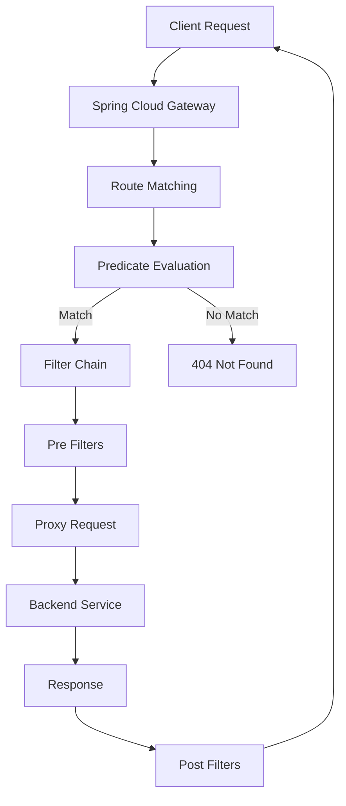

# TiGateway Spring Cloud Gateway Integration Guide

## Overview

This guide explains how TiGateway integrates with Spring Cloud Gateway, covering core concepts, working principles, configuration methods, and advanced features.

## Core Concepts

### Spring Cloud Gateway Architecture



### Key Components

#### 1. Route
A route is the basic building block of the gateway, consisting of:
- **ID**: Unique identifier
- **URI**: Target destination
- **Predicates**: Conditions for matching
- **Filters**: Processing logic

#### 2. Predicate
Predicates define the conditions under which a route should be matched:
- **Path Predicate**: Match based on request path
- **Method Predicate**: Match based on HTTP method
- **Header Predicate**: Match based on request headers
- **Query Predicate**: Match based on query parameters

#### 3. Filter
Filters process requests and responses:
- **Pre Filters**: Process requests before forwarding
- **Post Filters**: Process responses before returning
- **Global Filters**: Apply to all routes
- **Gateway Filters**: Apply to specific routes

## Working Principles

### Request Processing Flow

```java
@Component
@Slf4j
public class TiGatewayRequestProcessor implements GlobalFilter, Ordered {
    
    @Override
    public Mono<Void> filter(ServerWebExchange exchange, GatewayFilterChain chain) {
        ServerHttpRequest request = exchange.getRequest();
        
        // 1. Log incoming request
        log.info("Processing request: {} {}", request.getMethod(), request.getURI());
        
        // 2. Add request ID for tracing
        String requestId = UUID.randomUUID().toString();
        ServerHttpRequest modifiedRequest = request.mutate()
            .header("X-Request-ID", requestId)
            .build();
        
        ServerWebExchange modifiedExchange = exchange.mutate()
            .request(modifiedRequest)
            .build();
        
        // 3. Process through filter chain
        return chain.filter(modifiedExchange)
            .doOnSuccess(result -> {
                log.info("Request {} completed successfully", requestId);
            })
            .doOnError(error -> {
                log.error("Request {} failed: {}", requestId, error.getMessage());
            });
    }
    
    @Override
    public int getOrder() {
        return -1000; // High priority
    }
}
```

### Route Definition and Matching

```java
@Configuration
public class TiGatewayRouteConfiguration {
    
    @Bean
    public RouteLocator customRouteLocator(RouteLocatorBuilder builder) {
        return builder.routes()
            // User service route
            .route("user-service", r -> r
                .path("/api/users/**")
                .filters(f -> f
                    .stripPrefix(2)
                    .addRequestHeader("X-Service", "user-service")
                    .addResponseHeader("X-Response-Time", "${timestamp}")
                )
                .uri("lb://user-service"))
            
            // Order service route
            .route("order-service", r -> r
                .path("/api/orders/**")
                .and()
                .header("X-User-Type", "premium")
                .filters(f -> f
                    .stripPrefix(2)
                    .addRequestHeader("X-Service", "order-service")
                    .circuitBreaker(config -> config
                        .setName("order-service-cb")
                        .setFallbackUri("forward:/fallback/order")
                    )
                )
                .uri("lb://order-service"))
            
            // Admin service route
            .route("admin-service", r -> r
                .path("/api/admin/**")
                .and()
                .method(HttpMethod.GET, HttpMethod.POST)
                .filters(f -> f
                    .stripPrefix(2)
                    .addRequestHeader("X-Service", "admin-service")
                    .requestRateLimiter(config -> config
                        .setRateLimiter(redisRateLimiter())
                        .setKeyResolver(userKeyResolver())
                    )
                )
                .uri("lb://admin-service"))
            
            .build();
    }
    
    @Bean
    public RedisRateLimiter redisRateLimiter() {
        return new RedisRateLimiter(10, 20, 1);
    }
    
    @Bean
    public KeyResolver userKeyResolver() {
        return exchange -> Mono.just(
            exchange.getRequest().getHeaders().getFirst("X-User-ID")
        );
    }
}
```

## Configuration Methods

### Shortcut Configuration

```yaml
spring:
  cloud:
    gateway:
      routes:
        - id: user-service
          uri: lb://user-service
          predicates:
            - Path=/api/users/**
          filters:
            - StripPrefix=2
            - AddRequestHeader=X-Service, user-service
            - AddResponseHeader=X-Response-Time, ${timestamp}
        
        - id: order-service
          uri: lb://order-service
          predicates:
            - Path=/api/orders/**
            - Header=X-User-Type, premium
          filters:
            - StripPrefix=2
            - AddRequestHeader=X-Service, order-service
            - name: CircuitBreaker
              args:
                name: order-service-cb
                fallbackUri: forward:/fallback/order
```

### Expanded Configuration

```yaml
spring:
  cloud:
    gateway:
      routes:
        - id: user-service
          uri: lb://user-service
          predicates:
            - name: Path
              args:
                pattern: /api/users/**
          filters:
            - name: StripPrefix
              args:
                parts: 2
            - name: AddRequestHeader
              args:
                name: X-Service
                value: user-service
            - name: AddResponseHeader
              args:
                name: X-Response-Time
                value: ${timestamp}
```

### Programmatic Configuration

```java
@Configuration
public class ProgrammaticRouteConfiguration {
    
    @Bean
    public RouteLocator programmaticRoutes(RouteLocatorBuilder builder) {
        return builder.routes()
            .route("dynamic-route", r -> r
                .path("/api/dynamic/**")
                .filters(f -> f
                    .stripPrefix(2)
                    .filter(dynamicFilter())
                )
                .uri("lb://dynamic-service"))
            .build();
    }
    
    @Bean
    public GatewayFilter dynamicFilter() {
        return (exchange, chain) -> {
            // Dynamic filter logic
            ServerHttpRequest request = exchange.getRequest();
            String path = request.getPath().value();
            
            if (path.contains("/v1/")) {
                return chain.filter(exchange.mutate()
                    .request(request.mutate()
                        .header("X-API-Version", "v1")
                        .build())
                    .build());
            }
            
            return chain.filter(exchange);
        };
    }
}
```

## Built-in Route Predicate Factories

### Path Predicate Factory

```yaml
spring:
  cloud:
    gateway:
      routes:
        - id: path-route
          uri: lb://service
          predicates:
            - Path=/api/v1/**, /api/v2/**
```

### Method Predicate Factory

```yaml
spring:
  cloud:
    gateway:
      routes:
        - id: method-route
          uri: lb://service
          predicates:
            - Method=GET, POST
```

### Header Predicate Factory

```yaml
spring:
  cloud:
    gateway:
      routes:
        - id: header-route
          uri: lb://service
          predicates:
            - Header=X-Requested-With, XMLHttpRequest
            - Header=Authorization, Bearer .+
```

### Query Predicate Factory

```yaml
spring:
  cloud:
    gateway:
      routes:
        - id: query-route
          uri: lb://service
          predicates:
            - Query=version, v1
            - Query=debug, true
```

### Host Predicate Factory

```yaml
spring:
  cloud:
    gateway:
      routes:
        - id: host-route
          uri: lb://service
          predicates:
            - Host=**.example.com
```

### Cookie Predicate Factory

```yaml
spring:
  cloud:
    gateway:
      routes:
        - id: cookie-route
          uri: lb://service
          predicates:
            - Cookie=sessionId, .+
```

## Filter Factories

### Request Processing Filters

#### AddRequestHeader Filter

```yaml
spring:
  cloud:
    gateway:
      routes:
        - id: add-header-route
          uri: lb://service
          filters:
            - AddRequestHeader=X-Request-ID, ${random.uuid}
            - AddRequestHeader=X-Forwarded-For, ${remote-addr}
```

#### RemoveRequestHeader Filter

```yaml
spring:
  cloud:
    gateway:
      routes:
        - id: remove-header-route
          uri: lb://service
          filters:
            - RemoveRequestHeader=X-Secret-Header
```

#### AddRequestParameter Filter

```yaml
spring:
  cloud:
    gateway:
      routes:
        - id: add-param-route
          uri: lb://service
          filters:
            - AddRequestParameter=version, v1
            - AddRequestParameter=source, gateway
```

#### RewritePath Filter

```yaml
spring:
  cloud:
    gateway:
      routes:
        - id: rewrite-path-route
          uri: lb://service
          predicates:
            - Path=/api/old/**
          filters:
            - RewritePath=/api/old/(?<segment>.*), /api/new/${segment}
```

### Response Processing Filters

#### AddResponseHeader Filter

```yaml
spring:
  cloud:
    gateway:
      routes:
        - id: add-response-header-route
          uri: lb://service
          filters:
            - AddResponseHeader=X-Response-Time, ${timestamp}
            - AddResponseHeader=X-Gateway-Version, 1.0.0
```

#### RemoveResponseHeader Filter

```yaml
spring:
  cloud:
    gateway:
      routes:
        - id: remove-response-header-route
          uri: lb://service
          filters:
            - RemoveResponseHeader=X-Internal-Header
```

### Advanced Filters

#### Circuit Breaker Filter

```yaml
spring:
  cloud:
    gateway:
      routes:
        - id: circuit-breaker-route
          uri: lb://service
          filters:
            - name: CircuitBreaker
              args:
                name: service-cb
                fallbackUri: forward:/fallback/service
                statusCodes: BAD_GATEWAY, INTERNAL_SERVER_ERROR
```

#### Request Rate Limiter Filter

```yaml
spring:
  cloud:
    gateway:
      routes:
        - id: rate-limit-route
          uri: lb://service
          filters:
            - name: RequestRateLimiter
              args:
                redis-rate-limiter.replenishRate: 10
                redis-rate-limiter.burstCapacity: 20
                key-resolver: "#{@userKeyResolver}"
```

#### Retry Filter

```yaml
spring:
  cloud:
    gateway:
      routes:
        - id: retry-route
          uri: lb://service
          filters:
            - name: Retry
              args:
                retries: 3
                statuses: BAD_GATEWAY, INTERNAL_SERVER_ERROR
                methods: GET, POST
                backoff:
                  firstBackoff: 50ms
                  maxBackoff: 500ms
                  factor: 2
```

## Global Filters

### Custom Global Filter

```java
@Component
@Slf4j
public class TiGatewayGlobalFilter implements GlobalFilter, Ordered {
    
    private final MeterRegistry meterRegistry;
    private final Counter requestCounter;
    private final Timer requestTimer;
    
    public TiGatewayGlobalFilter(MeterRegistry meterRegistry) {
        this.meterRegistry = meterRegistry;
        this.requestCounter = Counter.builder("tigateway.requests.total")
            .description("Total number of requests")
            .register(meterRegistry);
        this.requestTimer = Timer.builder("tigateway.request.duration")
            .description("Request processing duration")
            .register(meterRegistry);
    }
    
    @Override
    public Mono<Void> filter(ServerWebExchange exchange, GatewayFilterChain chain) {
        long startTime = System.currentTimeMillis();
        
        // Increment request counter
        requestCounter.increment(
            Tags.of(
                "method", exchange.getRequest().getMethod().name(),
                "path", exchange.getRequest().getPath().value()
            )
        );
        
        return chain.filter(exchange)
            .doOnSuccess(result -> {
                long duration = System.currentTimeMillis() - startTime;
                requestTimer.record(duration, TimeUnit.MILLISECONDS);
                
                log.debug("Request processed in {}ms: {} {}", 
                    duration, 
                    exchange.getRequest().getMethod(), 
                    exchange.getRequest().getURI());
            })
            .doOnError(error -> {
                long duration = System.currentTimeMillis() - startTime;
                requestTimer.record(duration, TimeUnit.MILLISECONDS);
                
                log.error("Request failed after {}ms: {} {}", 
                    duration, 
                    exchange.getRequest().getMethod(), 
                    exchange.getRequest().getURI(), 
                    error);
            });
    }
    
    @Override
    public int getOrder() {
        return -1000; // High priority
    }
}
```

### CORS Global Filter

```java
@Configuration
public class CorsConfiguration {
    
    @Bean
    public CorsWebFilter corsFilter() {
        CorsConfiguration config = new CorsConfiguration();
        config.setAllowCredentials(true);
        config.addAllowedOriginPattern("*");
        config.addAllowedHeader("*");
        config.addAllowedMethod("*");
        
        UrlBasedCorsConfigurationSource source = new UrlBasedCorsConfigurationSource();
        source.registerCorsConfiguration("/**", config);
        
        return new CorsWebFilter(source);
    }
}
```

## Service Discovery Integration

### Kubernetes Service Discovery

```yaml
spring:
  cloud:
    gateway:
      discovery:
        locator:
          enabled: true
          lower-case-service-id: true
          predicates:
            - name: Path
              args:
                pattern: "'/api/'+serviceId+'/**'"
          filters:
            - name: RewritePath
              args:
                regexp: "'/api/' + serviceId + '/(?<remaining>.*)'"
                replacement: "'/${remaining}'"
```

### Eureka Service Discovery

```yaml
spring:
  cloud:
    gateway:
      discovery:
        locator:
          enabled: true
          lower-case-service-id: true
          predicates:
            - name: Path
              args:
                pattern: "'/api/'+serviceId+'/**'"
          filters:
            - name: RewritePath
              args:
                regexp: "'/api/' + serviceId + '/(?<remaining>.*)'"
                replacement: "'/${remaining}'"
```

### Consul Service Discovery

```yaml
spring:
  cloud:
    gateway:
      discovery:
        locator:
          enabled: true
          lower-case-service-id: true
          predicates:
            - name: Path
              args:
                pattern: "'/api/'+serviceId+'/**'"
          filters:
            - name: RewritePath
              args:
                regexp: "'/api/' + serviceId + '/(?<remaining>.*)'"
                replacement: "'/${remaining}'"
```

## Configuration Management

### Dynamic Route Configuration

```java
@Component
public class DynamicRouteService {
    
    private final RouteDefinitionLocator routeDefinitionLocator;
    private final RouteDefinitionWriter routeDefinitionWriter;
    private final ApplicationEventPublisher applicationEventPublisher;
    
    public DynamicRouteService(RouteDefinitionLocator routeDefinitionLocator,
                             RouteDefinitionWriter routeDefinitionWriter,
                             ApplicationEventPublisher applicationEventPublisher) {
        this.routeDefinitionLocator = routeDefinitionLocator;
        this.routeDefinitionWriter = routeDefinitionWriter;
        this.applicationEventPublisher = applicationEventPublisher;
    }
    
    public Mono<Void> addRoute(RouteDefinition routeDefinition) {
        return routeDefinitionWriter.save(Mono.just(routeDefinition))
            .then(Mono.fromRunnable(() -> {
                applicationEventPublisher.publishEvent(new RefreshRoutesEvent(this));
            }));
    }
    
    public Mono<Void> deleteRoute(String routeId) {
        return routeDefinitionWriter.delete(Mono.just(routeId))
            .then(Mono.fromRunnable(() -> {
                applicationEventPublisher.publishEvent(new RefreshRoutesEvent(this));
            }));
    }
    
    public Flux<RouteDefinition> getRoutes() {
        return routeDefinitionLocator.getRouteDefinitions();
    }
}
```

### Configuration Refresh

```java
@RestController
@RequestMapping("/gateway")
public class GatewayController {
    
    private final DynamicRouteService dynamicRouteService;
    
    public GatewayController(DynamicRouteService dynamicRouteService) {
        this.dynamicRouteService = dynamicRouteService;
    }
    
    @PostMapping("/routes")
    public Mono<ResponseEntity<String>> addRoute(@RequestBody RouteDefinition routeDefinition) {
        return dynamicRouteService.addRoute(routeDefinition)
            .then(Mono.just(ResponseEntity.ok("Route added successfully")));
    }
    
    @DeleteMapping("/routes/{id}")
    public Mono<ResponseEntity<String>> deleteRoute(@PathVariable String id) {
        return dynamicRouteService.deleteRoute(id)
            .then(Mono.just(ResponseEntity.ok("Route deleted successfully")));
    }
    
    @GetMapping("/routes")
    public Flux<RouteDefinition> getRoutes() {
        return dynamicRouteService.getRoutes();
    }
    
    @PostMapping("/refresh")
    public Mono<ResponseEntity<String>> refreshRoutes() {
        return Mono.fromRunnable(() -> {
            // Trigger route refresh
            applicationEventPublisher.publishEvent(new RefreshRoutesEvent(this));
        }).then(Mono.just(ResponseEntity.ok("Routes refreshed successfully")));
    }
}
```

## Monitoring and Observability

### Metrics Configuration

```yaml
management:
  endpoints:
    web:
      exposure:
        include: health,info,metrics,prometheus
  metrics:
    export:
      prometheus:
        enabled: true
    distribution:
      percentiles-histogram:
        http.server.requests: true
      percentiles:
        http.server.requests: 0.5, 0.95, 0.99
```

### Custom Metrics

```java
@Component
public class GatewayMetrics {
    
    private final MeterRegistry meterRegistry;
    private final Counter routeCounter;
    private final Timer routeTimer;
    private final Gauge activeConnections;
    
    public GatewayMetrics(MeterRegistry meterRegistry) {
        this.meterRegistry = meterRegistry;
        this.routeCounter = Counter.builder("tigateway.routes.total")
            .description("Total number of route matches")
            .register(meterRegistry);
        this.routeTimer = Timer.builder("tigateway.route.duration")
            .description("Route processing duration")
            .register(meterRegistry);
        this.activeConnections = Gauge.builder("tigateway.connections.active")
            .description("Active connections")
            .register(meterRegistry, this, GatewayMetrics::getActiveConnections);
    }
    
    public void recordRouteMatch(String routeId) {
        routeCounter.increment(Tags.of("route", routeId));
    }
    
    public void recordRouteDuration(String routeId, Duration duration) {
        routeTimer.record(duration, Tags.of("route", routeId));
    }
    
    private double getActiveConnections() {
        // Implementation to get active connections
        return 0.0;
    }
}
```

### Health Checks

```java
@Component
public class GatewayHealthIndicator implements HealthIndicator {
    
    private final RouteDefinitionLocator routeDefinitionLocator;
    
    public GatewayHealthIndicator(RouteDefinitionLocator routeDefinitionLocator) {
        this.routeDefinitionLocator = routeDefinitionLocator;
    }
    
    @Override
    public Health health() {
        try {
            List<RouteDefinition> routes = routeDefinitionLocator.getRouteDefinitions()
                .collectList()
                .block();
            
            if (routes == null || routes.isEmpty()) {
                return Health.down()
                    .withDetail("routes", "No routes configured")
                    .build();
            }
            
            return Health.up()
                .withDetail("routes", routes.size())
                .withDetail("routeIds", routes.stream()
                    .map(RouteDefinition::getId)
                    .collect(Collectors.toList()))
                .build();
                
        } catch (Exception e) {
            return Health.down()
                .withDetail("error", e.getMessage())
                .build();
        }
    }
}
```

## Security Integration

### OAuth2 Integration

```yaml
spring:
  security:
    oauth2:
      client:
        provider:
          sso:
            issuer-uri: ${SSO_ISSUER_URI}
        registration:
          sso:
            provider: sso
            client-id: ${SSO_CLIENT_ID}
            client-secret: ${SSO_CLIENT_SECRET}
            scope: openid,profile,email
```

### JWT Token Validation

```java
@Component
public class JwtAuthenticationFilter implements GlobalFilter, Ordered {
    
    private final JwtDecoder jwtDecoder;
    
    public JwtAuthenticationFilter(JwtDecoder jwtDecoder) {
        this.jwtDecoder = jwtDecoder;
    }
    
    @Override
    public Mono<Void> filter(ServerWebExchange exchange, GatewayFilterChain chain) {
        ServerHttpRequest request = exchange.getRequest();
        String authHeader = request.getHeaders().getFirst("Authorization");
        
        if (authHeader != null && authHeader.startsWith("Bearer ")) {
            String token = authHeader.substring(7);
            
            try {
                Jwt jwt = jwtDecoder.decode(token);
                
                // Add user information to request
                ServerHttpRequest modifiedRequest = request.mutate()
                    .header("X-User-ID", jwt.getSubject())
                    .header("X-User-Roles", String.join(",", jwt.getClaimAsStringList("roles")))
                    .build();
                
                return chain.filter(exchange.mutate()
                    .request(modifiedRequest)
                    .build());
                    
            } catch (Exception e) {
                return handleUnauthorized(exchange);
            }
        }
        
        return chain.filter(exchange);
    }
    
    private Mono<Void> handleUnauthorized(ServerWebExchange exchange) {
        ServerHttpResponse response = exchange.getResponse();
        response.setStatusCode(HttpStatus.UNAUTHORIZED);
        response.getHeaders().add("Content-Type", "application/json");
        
        String body = "{\"error\": \"Unauthorized\", \"message\": \"Invalid or missing token\"}";
        DataBuffer buffer = response.bufferFactory().wrap(body.getBytes(StandardCharsets.UTF_8));
        
        return response.writeWith(Mono.just(buffer));
    }
    
    @Override
    public int getOrder() {
        return -100;
    }
}
```

## Performance Optimization

### Connection Pool Configuration

```yaml
spring:
  cloud:
    gateway:
      httpclient:
        pool:
          max-connections: 1000
          max-idle-time: 30s
          max-life-time: 60s
        connect-timeout: 5s
        response-timeout: 30s
```

### Thread Pool Configuration

```yaml
spring:
  cloud:
    gateway:
      httpclient:
        pool:
          type: elastic
          max-connections: 500
```

### Caching Configuration

```yaml
spring:
  cache:
    type: redis
    redis:
      time-to-live: 600000
      cache-null-values: false
```

## Troubleshooting

### Common Issues

#### 1. Route Not Matching

```bash
# Check route configuration
curl http://localhost:8080/actuator/gateway/routes

# Check route refresh
curl -X POST http://localhost:8080/actuator/gateway/refresh
```

#### 2. Service Discovery Issues

```bash
# Check service discovery
curl http://localhost:8080/actuator/health

# Check discovered services
curl http://localhost:8080/actuator/gateway/globalfilters
```

#### 3. Filter Issues

```bash
# Check filter configuration
curl http://localhost:8080/actuator/gateway/globalfilters

# Check filter order
curl http://localhost:8080/actuator/gateway/routefilters
```

### Debug Configuration

```yaml
logging:
  level:
    org.springframework.cloud.gateway: DEBUG
    org.springframework.web.reactive: DEBUG
    reactor.netty: DEBUG
```

---

**Related Documentation**:
- [Custom Components Development](./custom-components.md)
- [Filter Factories Development](./filter-factories.md)
- [Predicate Factories Development](./predicate-factories.md)
- [Testing Guide](./testing.md)