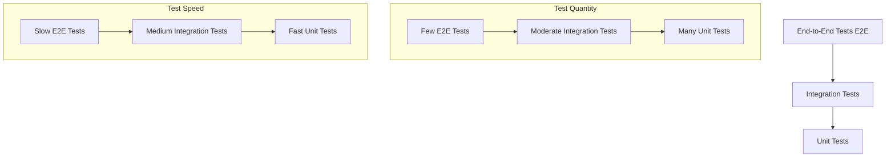

# TiGateway Testing Guide

## Overview

This document provides a comprehensive testing guide for the TiGateway project, including unit testing, integration testing, end-to-end testing, performance testing, and more. Through systematic testing strategies, we ensure code quality and system stability.

## 1. Testing Strategy

### 1.1 Testing Pyramid



### 1.2 Test Type Descriptions

| Test Type | Purpose | Scope | Execution Frequency | Maintenance Cost |
|-----------|---------|-------|-------------------|------------------|
| Unit Tests | Verify single component functionality | Single class/method | Every commit | Low |
| Integration Tests | Verify component interactions | Multiple components | Every build | Medium |
| End-to-End Tests | Verify complete business processes | Entire system | Every release | High |
| Performance Tests | Verify system performance metrics | Entire system | Regular execution | Medium |

## 2. Unit Testing

### 2.1 Testing Framework Selection

```xml
<!-- Maven Dependencies -->
<dependencies>
    <!-- JUnit 5 -->
    <dependency>
        <groupId>org.junit.jupiter</groupId>
        <artifactId>junit-jupiter</artifactId>
        <scope>test</scope>
    </dependency>
    
    <!-- Mockito -->
    <dependency>
        <groupId>org.mockito</groupId>
        <artifactId>mockito-core</artifactId>
        <scope>test</scope>
    </dependency>
    
    <!-- AssertJ -->
    <dependency>
        <groupId>org.assertj</groupId>
        <artifactId>assertj-core</artifactId>
        <scope>test</scope>
    </dependency>
    
    <!-- Spring Boot Test -->
    <dependency>
        <groupId>org.springframework.boot</groupId>
        <artifactId>spring-boot-starter-test</artifactId>
        <scope>test</scope>
    </dependency>
</dependencies>
```

### 2.2 Test Class Structure

```java
@ExtendWith(MockitoExtension.class)
@DisplayName("Route Service Tests")
class RouteServiceTest {
    
    @Mock
    private RouteRepository routeRepository;
    
    @Mock
    private RouteValidator routeValidator;
    
    @Mock
    private RouteEventPublisher eventPublisher;
    
    @InjectMocks
    private RouteServiceImpl routeService;
    
    private RouteRequest validRequest;
    private Route expectedRoute;
    
    @BeforeEach
    void setUp() {
        validRequest = RouteRequest.builder()
                .id("test-route")
                .uri("http://example.com")
                .predicates(List.of("Path=/test/**"))
                .build();
        
        expectedRoute = Route.builder()
                .id("test-route")
                .uri("http://example.com")
                .predicates(List.of("Path=/test/**"))
                .status(RouteStatus.ACTIVE)
                .build();
    }
    
    @Nested
    @DisplayName("Create Route Tests")
    class CreateRouteTests {
        
        @Test
        @DisplayName("Should create route successfully when request is valid")
        void should_create_route_successfully_when_request_is_valid() {
            // Given
            when(routeValidator.validate(any(Route.class))).thenReturn(true);
            when(routeRepository.save(any(Route.class))).thenReturn(expectedRoute);
            
            // When
            Route result = routeService.createRoute(validRequest);
            
            // Then
            assertThat(result).isNotNull();
            assertThat(result.getId()).isEqualTo("test-route");
            assertThat(result.getUri()).isEqualTo("http://example.com");
            assertThat(result.getStatus()).isEqualTo(RouteStatus.ACTIVE);
            
            verify(routeValidator).validate(any(Route.class));
            verify(routeRepository).save(any(Route.class));
            verify(eventPublisher).publishRouteCreated(any(Route.class));
        }
        
        @Test
        @DisplayName("Should throw exception when route ID already exists")
        void should_throw_exception_when_route_id_already_exists() {
            // Given
            when(routeRepository.existsById("test-route")).thenReturn(true);
            
            // When & Then
            assertThatThrownBy(() -> routeService.createRoute(validRequest))
                    .isInstanceOf(RouteAlreadyExistsException.class)
                    .hasMessage("Route with id 'test-route' already exists");
            
            verify(routeRepository).existsById("test-route");
            verify(routeRepository, never()).save(any(Route.class));
        }
        
        @Test
        @DisplayName("Should throw exception when route validation fails")
        void should_throw_exception_when_route_validation_fails() {
            // Given
            when(routeValidator.validate(any(Route.class))).thenReturn(false);
            
            // When & Then
            assertThatThrownBy(() -> routeService.createRoute(validRequest))
                    .isInstanceOf(ValidationException.class)
                    .hasMessage("Route validation failed");
            
            verify(routeValidator).validate(any(Route.class));
            verify(routeRepository, never()).save(any(Route.class));
        }
    }
    
    @Nested
    @DisplayName("Query Route Tests")
    class QueryRouteTests {
        
        @Test
        @DisplayName("Should return route when ID exists")
        void should_return_route_when_id_exists() {
            // Given
            when(routeRepository.findById("test-route")).thenReturn(Optional.of(expectedRoute));
            
            // When
            Optional<Route> result = routeService.findById("test-route");
            
            // Then
            assertThat(result).isPresent();
            assertThat(result.get()).isEqualTo(expectedRoute);
            
            verify(routeRepository).findById("test-route");
        }
        
        @Test
        @DisplayName("Should return empty when ID does not exist")
        void should_return_empty_when_id_not_exists() {
            // Given
            when(routeRepository.findById("non-existent")).thenReturn(Optional.empty());
            
            // When
            Optional<Route> result = routeService.findById("non-existent");
            
            // Then
            assertThat(result).isEmpty();
            
            verify(routeRepository).findById("non-existent");
        }
    }
}
```

### 2.3 Test Data Management

```java
// Test Data Builder
public class RouteTestDataBuilder {
    
    public static RouteRequest.RouteRequestBuilder validRouteRequest() {
        return RouteRequest.builder()
                .id("test-route")
                .uri("http://example.com")
                .predicates(List.of("Path=/test/**"))
                .filters(List.of())
                .order(0);
    }
    
    public static Route.RouteBuilder validRoute() {
        return Route.builder()
                .id("test-route")
                .uri("http://example.com")
                .predicates(List.of("Path=/test/**"))
                .filters(List.of())
                .order(0)
                .status(RouteStatus.ACTIVE)
                .createdAt(Instant.now())
                .updatedAt(Instant.now());
    }
    
    public static RouteRequest invalidRouteRequest() {
        return RouteRequest.builder()
                .id("")  // Invalid ID
                .uri("invalid-uri")  // Invalid URI
                .predicates(List.of())  // Empty predicates
                .build();
    }
}

// Using Test Data Builder
@Test
void should_create_route_with_valid_data() {
    // Given
    RouteRequest request = RouteTestDataBuilder.validRouteRequest().build();
    Route expectedRoute = RouteTestDataBuilder.validRoute().build();
    
    when(routeRepository.save(any(Route.class))).thenReturn(expectedRoute);
    
    // When
    Route result = routeService.createRoute(request);
    
    // Then
    assertThat(result).isEqualTo(expectedRoute);
}
```

### 2.4 Parameterized Tests

```java
@ParameterizedTest
@ValueSource(strings = {
    "user-service",
    "order-service", 
    "payment-service"
})
@DisplayName("Should create routes for different services")
void should_create_routes_for_different_services(String serviceName) {
    // Given
    RouteRequest request = RouteRequest.builder()
            .id(serviceName + "-route")
            .uri("http://" + serviceName + ":8080")
            .predicates(List.of("Path=/api/" + serviceName + "/**"))
            .build();
    
    when(routeRepository.save(any(Route.class))).thenAnswer(invocation -> {
        Route route = invocation.getArgument(0);
        return route.toBuilder().id(route.getId()).build();
    });
    
    // When
    Route result = routeService.createRoute(request);
    
    // Then
    assertThat(result.getId()).isEqualTo(serviceName + "-route");
    assertThat(result.getUri()).isEqualTo("http://" + serviceName + ":8080");
}

@ParameterizedTest
@CsvSource({
    "user-service, /api/users/**, http://user-service:8080",
    "order-service, /api/orders/**, http://order-service:8080",
    "payment-service, /api/payments/**, http://payment-service:8080"
})
@DisplayName("Should create routes from CSV data")
void should_create_routes_from_csv_data(String serviceName, String path, String uri) {
    // Given
    RouteRequest request = RouteRequest.builder()
            .id(serviceName + "-route")
            .uri(uri)
            .predicates(List.of("Path=" + path))
            .build();
    
    // When & Then
    assertThatCode(() -> routeService.createRoute(request))
            .doesNotThrowAnyException();
}
```

## 3. Integration Testing

### 3.1 Spring Boot Integration Tests

```java
@SpringBootTest(webEnvironment = SpringBootTest.WebEnvironment.RANDOM_PORT)
@TestPropertySource(properties = {
    "spring.cloud.gateway.kubernetes.ingress.enabled=true",
    "spring.kubernetes.discovery.enabled=false",
    "logging.level.ti.gateway=DEBUG"
})
@ActiveProfiles("test")
class RouteControllerIntegrationTest {
    
    @Autowired
    private TestRestTemplate restTemplate;
    
    @Autowired
    private RouteRepository routeRepository;
    
    @LocalServerPort
    private int port;
    
    @BeforeEach
    void setUp() {
        routeRepository.deleteAll();
    }
    
    @Test
    @DisplayName("Should create route successfully via API")
    void should_create_route_via_api() {
        // Given
        RouteRequest request = RouteRequest.builder()
                .id("api-test-route")
                .uri("http://example.com")
                .predicates(List.of("Path=/api/test/**"))
                .build();
        
        // When
        ResponseEntity<ApiResponse<Route>> response = restTemplate.postForEntity(
                "/api/v1/routes", 
                request, 
                new ParameterizedTypeReference<ApiResponse<Route>>() {}
        );
        
        // Then
        assertThat(response.getStatusCode()).isEqualTo(HttpStatus.CREATED);
        assertThat(response.getBody().getCode()).isEqualTo("SUCCESS");
        assertThat(response.getBody().getData().getId()).isEqualTo("api-test-route");
        
        // Verify data in database
        Optional<Route> savedRoute = routeRepository.findById("api-test-route");
        assertThat(savedRoute).isPresent();
    }
    
    @Test
    @DisplayName("Should return 400 error when request is invalid")
    void should_return_400_when_request_is_invalid() {
        // Given
        RouteRequest invalidRequest = RouteRequest.builder()
                .id("")  // Invalid ID
                .uri("invalid-uri")  // Invalid URI
                .build();
        
        // When
        ResponseEntity<ErrorResponse> response = restTemplate.postForEntity(
                "/api/v1/routes",
                invalidRequest,
                ErrorResponse.class
        );
        
        // Then
        assertThat(response.getStatusCode()).isEqualTo(HttpStatus.BAD_REQUEST);
        assertThat(response.getBody().getCode()).isEqualTo("VALIDATION_ERROR");
    }
}
```

### 3.2 Database Integration Tests

```java
@DataJpaTest
@AutoConfigureTestDatabase(replace = AutoConfigureTestDatabase.Replace.NONE)
@TestPropertySource(properties = {
    "spring.datasource.url=jdbc:h2:mem:testdb",
    "spring.jpa.hibernate.ddl-auto=create-drop"
})
class RouteRepositoryTest {
    
    @Autowired
    private TestEntityManager entityManager;
    
    @Autowired
    private RouteRepository routeRepository;
    
    @Test
    @DisplayName("Should find routes by status")
    void should_find_routes_by_status() {
        // Given
        Route activeRoute = Route.builder()
                .id("active-route")
                .uri("http://example.com")
                .status(RouteStatus.ACTIVE)
                .build();
        
        Route inactiveRoute = Route.builder()
                .id("inactive-route")
                .uri("http://example.com")
                .status(RouteStatus.INACTIVE)
                .build();
        
        entityManager.persistAndFlush(activeRoute);
        entityManager.persistAndFlush(inactiveRoute);
        
        // When
        List<Route> activeRoutes = routeRepository.findByStatus(RouteStatus.ACTIVE);
        
        // Then
        assertThat(activeRoutes).hasSize(1);
        assertThat(activeRoutes.get(0).getId()).isEqualTo("active-route");
    }
    
    @Test
    @DisplayName("Should find routes by URI pattern")
    void should_find_routes_by_uri_pattern() {
        // Given
        Route route1 = Route.builder()
                .id("route1")
                .uri("http://user-service:8080")
                .build();
        
        Route route2 = Route.builder()
                .id("route2")
                .uri("http://order-service:8080")
                .build();
        
        entityManager.persistAndFlush(route1);
        entityManager.persistAndFlush(route2);
        
        // When
        List<Route> userServiceRoutes = routeRepository.findByUriContaining("user-service");
        
        // Then
        assertThat(userServiceRoutes).hasSize(1);
        assertThat(userServiceRoutes.get(0).getId()).isEqualTo("route1");
    }
}
```

### 3.3 WebFlux Integration Tests

```java
@SpringBootTest(webEnvironment = SpringBootTest.WebEnvironment.RANDOM_PORT)
class RouteControllerWebFluxTest {
    
    @Autowired
    private WebTestClient webTestClient;
    
    @MockBean
    private RouteService routeService;
    
    @Test
    @DisplayName("Should create route successfully via WebFlux")
    void should_create_route_via_webflux() {
        // Given
        RouteRequest request = RouteRequest.builder()
                .id("webflux-test-route")
                .uri("http://example.com")
                .predicates(List.of("Path=/api/test/**"))
                .build();
        
        Route expectedRoute = Route.builder()
                .id("webflux-test-route")
                .uri("http://example.com")
                .predicates(List.of("Path=/api/test/**"))
                .status(RouteStatus.ACTIVE)
                .build();
        
        when(routeService.createRoute(any(RouteRequest.class))).thenReturn(expectedRoute);
        
        // When & Then
        webTestClient.post()
                .uri("/api/v1/routes")
                .contentType(MediaType.APPLICATION_JSON)
                .bodyValue(request)
                .exchange()
                .expectStatus().isCreated()
                .expectHeader().exists("Location")
                .expectBody(ApiResponse.class)
                .value(response -> {
                    assertThat(response.getCode()).isEqualTo("SUCCESS");
                    assertThat(response.getData().getId()).isEqualTo("webflux-test-route");
                });
        
        verify(routeService).createRoute(any(RouteRequest.class));
    }
    
    @Test
    @DisplayName("Should return route list")
    void should_return_route_list() {
        // Given
        List<Route> routes = List.of(
                Route.builder().id("route1").uri("http://service1").build(),
                Route.builder().id("route2").uri("http://service2").build()
        );
        
        when(routeService.getAllRoutes()).thenReturn(routes);
        
        // When & Then
        webTestClient.get()
                .uri("/api/v1/routes")
                .exchange()
                .expectStatus().isOk()
                .expectBody(ApiResponse.class)
                .value(response -> {
                    assertThat(response.getCode()).isEqualTo("SUCCESS");
                    assertThat(response.getData()).hasSize(2);
                });
    }
}
```

## 4. End-to-End Testing

### 4.1 TestContainers Integration Tests

```java
@SpringBootTest(webEnvironment = SpringBootTest.WebEnvironment.RANDOM_PORT)
@Testcontainers
class RouteE2ETest {
    
    @Container
    static GenericContainer<?> redis = new GenericContainer<>("redis:7-alpine")
            .withExposedPorts(6379);
    
    @Container
    static GenericContainer<?> postgres = new GenericContainer<>("postgres:15-alpine")
            .withDatabaseName("tigateway")
            .withUsername("test")
            .withPassword("test")
            .withExposedPorts(5432);
    
    @DynamicPropertySource
    static void configureProperties(DynamicPropertyRegistry registry) {
        registry.add("spring.redis.host", redis::getHost);
        registry.add("spring.redis.port", redis::getFirstMappedPort);
        registry.add("spring.datasource.url", () -> 
                "jdbc:postgresql://" + postgres.getHost() + ":" + postgres.getFirstMappedPort() + "/tigateway");
        registry.add("spring.datasource.username", () -> "test");
        registry.add("spring.datasource.password", () -> "test");
    }
    
    @Autowired
    private TestRestTemplate restTemplate;
    
    @Test
    @DisplayName("Should complete full route management workflow")
    void should_complete_full_route_management_workflow() {
        // 1. Create route
        RouteRequest createRequest = RouteRequest.builder()
                .id("e2e-test-route")
                .uri("http://example.com")
                .predicates(List.of("Path=/api/e2e/**"))
                .build();
        
        ResponseEntity<ApiResponse<Route>> createResponse = restTemplate.postForEntity(
                "/api/v1/routes", createRequest, new ParameterizedTypeReference<ApiResponse<Route>>() {}
        );
        
        assertThat(createResponse.getStatusCode()).isEqualTo(HttpStatus.CREATED);
        String routeId = createResponse.getBody().getData().getId();
        
        // 2. Query route
        ResponseEntity<ApiResponse<Route>> getResponse = restTemplate.getForEntity(
                "/api/v1/routes/" + routeId, new ParameterizedTypeReference<ApiResponse<Route>>() {}
        );
        
        assertThat(getResponse.getStatusCode()).isEqualTo(HttpStatus.OK);
        assertThat(getResponse.getBody().getData().getId()).isEqualTo(routeId);
        
        // 3. Update route
        RouteRequest updateRequest = RouteRequest.builder()
                .id(routeId)
                .uri("http://updated-example.com")
                .predicates(List.of("Path=/api/updated/**"))
                .build();
        
        ResponseEntity<ApiResponse<Route>> updateResponse = restTemplate.exchange(
                "/api/v1/routes/" + routeId,
                HttpMethod.PUT,
                new HttpEntity<>(updateRequest),
                new ParameterizedTypeReference<ApiResponse<Route>>() {}
        );
        
        assertThat(updateResponse.getStatusCode()).isEqualTo(HttpStatus.OK);
        assertThat(updateResponse.getBody().getData().getUri()).isEqualTo("http://updated-example.com");
        
        // 4. Delete route
        ResponseEntity<Void> deleteResponse = restTemplate.exchange(
                "/api/v1/routes/" + routeId,
                HttpMethod.DELETE,
                null,
                Void.class
        );
        
        assertThat(deleteResponse.getStatusCode()).isEqualTo(HttpStatus.NO_CONTENT);
        
        // 5. Verify route is deleted
        ResponseEntity<ApiResponse<Route>> getAfterDeleteResponse = restTemplate.getForEntity(
                "/api/v1/routes/" + routeId, new ParameterizedTypeReference<ApiResponse<Route>>() {}
        );
        
        assertThat(getAfterDeleteResponse.getStatusCode()).isEqualTo(HttpStatus.NOT_FOUND);
    }
}
```

### 4.2 Contract Testing

```java
// Using Pact for contract testing
@ExtendWith(PactConsumerTestExt.class)
@PactTestFor(providerName = "route-service")
class RouteServiceContractTest {
    
    @Pact(consumer = "tigateway-admin")
    public RequestResponsePact createRoutePact(PactDslWithProvider builder) {
        return builder
                .given("route service is available")
                .uponReceiving("a request to create a route")
                .path("/api/v1/routes")
                .method("POST")
                .headers("Content-Type", "application/json")
                .body("""
                    {
                        "id": "test-route",
                        "uri": "http://example.com",
                        "predicates": ["Path=/test/**"]
                    }
                    """)
                .willRespondWith()
                .status(201)
                .headers(Map.of("Content-Type", "application/json"))
                .body("""
                    {
                        "code": "SUCCESS",
                        "message": "Route created successfully",
                        "data": {
                            "id": "test-route",
                            "uri": "http://example.com",
                            "predicates": ["Path=/test/**"],
                            "status": "ACTIVE"
                        }
                    }
                    """)
                .toPact();
    }
    
    @Test
    @PactTestFor(pactMethod = "createRoutePact")
    void testCreateRoute(MockServer mockServer) {
        // Given
        String baseUrl = mockServer.getUrl();
        RouteServiceClient client = new RouteServiceClient(baseUrl);
        
        RouteRequest request = RouteRequest.builder()
                .id("test-route")
                .uri("http://example.com")
                .predicates(List.of("Path=/test/**"))
                .build();
        
        // When
        Route result = client.createRoute(request);
        
        // Then
        assertThat(result.getId()).isEqualTo("test-route");
        assertThat(result.getUri()).isEqualTo("http://example.com");
        assertThat(result.getStatus()).isEqualTo(RouteStatus.ACTIVE);
    }
}
```

## 5. Performance Testing

### 5.1 JMeter Performance Testing

```xml
<!-- JMeter Test Plan Example -->
<?xml version="1.0" encoding="UTF-8"?>
<jmeterTestPlan version="1.2">
  <hashTree>
    <TestPlan testname="TiGateway Performance Test">
      <elementProp name="TestPlan.arguments" elementType="Arguments" guiclass="ArgumentsPanel">
        <collectionProp name="Arguments.arguments"/>
      </elementProp>
      <stringProp name="TestPlan.user_define_classpath"></stringProp>
      <boolProp name="TestPlan.functional_mode">false</boolProp>
      <boolProp name="TestPlan.serialize_threadgroups">false</boolProp>
      <elementProp name="TestPlan.arguments" elementType="Arguments" guiclass="ArgumentsPanel">
        <collectionProp name="Arguments.arguments"/>
      </elementProp>
      <stringProp name="TestPlan.user_define_classpath"></stringProp>
      <boolProp name="TestPlan.functional_mode">false</boolProp>
      <boolProp name="TestPlan.serialize_threadgroups">false</boolProp>
    </TestPlan>
    <hashTree>
      <ThreadGroup testname="Route Creation Load Test">
        <stringProp name="ThreadGroup.num_threads">100</stringProp>
        <stringProp name="ThreadGroup.ramp_time">60</stringProp>
        <stringProp name="ThreadGroup.duration">300</stringProp>
        <stringProp name="ThreadGroup.delay"></stringProp>
        <boolProp name="ThreadGroup.scheduler">true</boolProp>
        <stringProp name="ThreadGroup.duration">300</stringProp>
        <stringProp name="ThreadGroup.delay"></stringProp>
      </ThreadGroup>
    </hashTree>
  </hashTree>
</jmeterTestPlan>
```

### 5.2 Gatling Performance Testing

```scala
// Gatling Performance Test Script
import io.gatling.core.Predef._
import io.gatling.http.Predef._
import scala.concurrent.duration._

class RoutePerformanceTest extends Simulation {
  
  val httpProtocol = http
    .baseUrl("http://localhost:8080")
    .acceptHeader("application/json")
    .contentTypeHeader("application/json")
  
  val createRouteScenario = scenario("Create Route Performance Test")
    .exec(
      http("Create Route")
        .post("/api/v1/routes")
        .body(StringBody("""
          {
            "id": "perf-test-route-${randomInt()}",
            "uri": "http://example.com",
            "predicates": ["Path=/api/test/**"]
          }
        """))
        .check(status.is(201))
        .check(jsonPath("$.data.id").saveAs("routeId"))
    )
    .pause(1)
    .exec(
      http("Get Route")
        .get("/api/v1/routes/${routeId}")
        .check(status.is(200))
    )
  
  setUp(
    createRouteScenario.inject(
      rampUsers(100) during (60 seconds),
      constantUsers(100) during (300 seconds)
    )
  ).protocols(httpProtocol)
   .assertions(
     global.responseTime.max.lt(1000),
     global.responseTime.mean.lt(500),
     global.successfulRequests.percent.gt(99)
   )
}
```

## 6. Test Configuration

### 6.1 Test Configuration Files

```yaml
# application-test.yml
spring:
  profiles:
    active: test
  
  datasource:
    url: jdbc:h2:mem:testdb
    driver-class-name: org.h2.Driver
    username: sa
    password: 
  
  jpa:
    hibernate:
      ddl-auto: create-drop
    show-sql: false
    properties:
      hibernate:
        format_sql: true
  
  redis:
    host: localhost
    port: 6379
    database: 1
  
  cloud:
    gateway:
      kubernetes:
        ingress:
          enabled: false
      discovery:
        locator:
          enabled: false

# Test-specific configuration
test:
  routes:
    default-uri: http://test-service:8080
    default-predicates:
      - Path=/test/**
  
  performance:
    thread-count: 10
    request-count: 1000
    timeout: 30s

# Logging configuration
logging:
  level:
    ti.gateway: DEBUG
    org.springframework.web: DEBUG
    org.springframework.test: DEBUG
  pattern:
    console: "%d{HH:mm:ss.SSS} [%thread] %-5level %logger{36} - %msg%n"
```

## 7. Testing Best Practices

### 7.1 Test Naming Conventions

```java
// Test class naming: ClassUnderTest + Test
public class RouteServiceTest {}

// Test method naming: should_expectedResult_when_condition
@Test
void should_return_route_when_valid_id_provided() {}

@Test
void should_throw_exception_when_invalid_request() {}

// Use @DisplayName for more friendly test names
@Test
@DisplayName("Should create route successfully when request parameters are valid")
void should_create_route_successfully_when_request_is_valid() {}
```

### 7.2 Test Organization

```java
@ExtendWith(MockitoExtension.class)
class RouteServiceTest {
    
    // Use @Nested to organize related tests
    @Nested
    @DisplayName("Create Route Tests")
    class CreateRouteTests {
        
        @Test
        void should_create_route_successfully() {}
        
        @Test
        void should_throw_exception_when_id_exists() {}
    }
    
    @Nested
    @DisplayName("Query Route Tests")
    class QueryRouteTests {
        
        @Test
        void should_return_route_when_found() {}
        
        @Test
        void should_return_empty_when_not_found() {}
    }
}
```

## 8. Continuous Integration Testing

### 8.1 GitHub Actions Configuration

```yaml
# .github/workflows/test.yml
name: Test

on:
  push:
    branches: [ main, develop ]
  pull_request:
    branches: [ main ]

jobs:
  test:
    runs-on: ubuntu-latest
    
    services:
      redis:
        image: redis:7-alpine
        ports:
          - 6379:6379
      
      postgres:
        image: postgres:15-alpine
        env:
          POSTGRES_DB: tigateway_test
          POSTGRES_USER: test
          POSTGRES_PASSWORD: test
        ports:
          - 5432:5432
    
    steps:
    - uses: actions/checkout@v3
    
    - name: Set up JDK 11
      uses: actions/setup-java@v3
      with:
        java-version: '11'
        distribution: 'temurin'
    
    - name: Cache Maven dependencies
      uses: actions/cache@v3
      with:
        path: ~/.m2
        key: ${{ runner.os }}-m2-${{ hashFiles('**/pom.xml') }}
        restore-keys: ${{ runner.os }}-m2
    
    - name: Run unit tests
      run: mvn test
    
    - name: Run integration tests
      run: mvn verify -P integration-test
    
    - name: Generate test report
      uses: dorny/test-reporter@v1
      if: success() || failure()
      with:
        name: Maven Tests
        path: target/surefire-reports/*.xml
        reporter: java-junit
    
    - name: Upload coverage reports
      uses: codecov/codecov-action@v3
      with:
        file: target/site/jacoco/jacoco.xml
```

---

**Related Documentation**:
- [Coding Standards](./coding-standards.md)
- [Development Setup](./setup.md)
- [Debugging Guide](./debugging.md)
- [Custom Components Development](./custom-components.md)