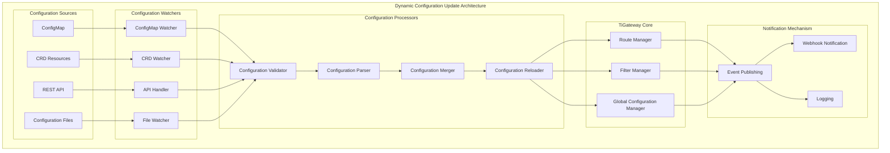

# Dynamic Configuration Updates

TiGateway provides comprehensive dynamic configuration update functionality, supporting real-time updates of routes, filters, and other configurations without service restart.

## Dynamic Configuration Update Overview

### Update Architecture



### Update Features

- **Real-time Updates**: Configuration changes take effect immediately without restart
- **Multi-source Support**: Supports ConfigMap, CRD, API, file, and other configuration sources
- **Configuration Validation**: Validates configuration before updates to ensure correctness
- **Rollback Mechanism**: Supports configuration rollback to previous versions
- **Event Notification**: Provides configuration change event notification mechanism
- **Atomic Operations**: Ensures atomicity of configuration updates

## Configuration Update Implementation

### 1. Configuration Update Service

```java
@Service
public class DynamicConfigurationService {
    
    @Autowired
    private ConfigurationValidator configurationValidator;
    
    @Autowired
    private ConfigurationReloader configurationReloader;
    
    @Autowired
    private ConfigurationHistoryService historyService;
    
    @Autowired
    private ApplicationEventPublisher eventPublisher;
    
    private final Map<String, Object> configurationCache = new ConcurrentHashMap<>();
    private final Map<String, Long> lastUpdateTime = new ConcurrentHashMap<>();
    
    public void updateConfiguration(String configType, String configId, Object configuration) {
        log.info("Updating configuration: type={}, id={}", configType, configId);
        
        try {
            // Validate configuration
            if (!validateConfiguration(configType, configuration)) {
                throw new ConfigurationValidationException("Invalid configuration");
            }
            
            // Save history version
            historyService.saveConfigurationVersion(configType, configId, configuration);
            
            // Update configuration cache
            String cacheKey = configType + ":" + configId;
            configurationCache.put(cacheKey, configuration);
            lastUpdateTime.put(cacheKey, System.currentTimeMillis());
            
            // Reload configuration
            configurationReloader.reloadConfiguration(configType, configId, configuration);
            
            // Publish configuration update event
            ConfigurationUpdateEvent event = new ConfigurationUpdateEvent(
                configType, configId, configuration, System.currentTimeMillis());
            eventPublisher.publishEvent(event);
            
            log.info("Successfully updated configuration: type={}, id={}", configType, configId);
        } catch (Exception e) {
            log.error("Failed to update configuration: type={}, id={}", configType, configId, e);
            throw new ConfigurationUpdateException("Failed to update configuration", e);
        }
    }
    
    public void updateRouteConfiguration(String routeId, RouteDefinition route) {
        updateConfiguration("route", routeId, route);
    }
    
    public void updateFilterConfiguration(String filterId, FilterDefinition filter) {
        updateConfiguration("filter", filterId, filter);
    }
    
    public void updateGlobalConfiguration(String configId, Object configuration) {
        updateConfiguration("global", configId, configuration);
    }
    
    public void deleteConfiguration(String configType, String configId) {
        log.info("Deleting configuration: type={}, id={}", configType, configId);
        
        try {
            // Save deletion history
            historyService.saveConfigurationVersion(configType, configId, null);
            
            // Remove from cache
            String cacheKey = configType + ":" + configId;
            configurationCache.remove(cacheKey);
            lastUpdateTime.remove(cacheKey);
            
            // Reload configuration
            configurationReloader.reloadConfiguration(configType, configId, null);
            
            // Publish configuration delete event
            ConfigurationDeleteEvent event = new ConfigurationDeleteEvent(
                configType, configId, System.currentTimeMillis());
            eventPublisher.publishEvent(event);
            
            log.info("Successfully deleted configuration: type={}, id={}", configType, configId);
        } catch (Exception e) {
            log.error("Failed to delete configuration: type={}, id={}", configType, configId, e);
            throw new ConfigurationUpdateException("Failed to delete configuration", e);
        }
    }
    
    public Object getConfiguration(String configType, String configId) {
        String cacheKey = configType + ":" + configId;
        return configurationCache.get(cacheKey);
    }
    
    public Map<String, Object> getAllConfigurations(String configType) {
        return configurationCache.entrySet().stream()
            .filter(entry -> entry.getKey().startsWith(configType + ":"))
            .collect(Collectors.toMap(
                entry -> entry.getKey().substring(configType.length() + 1),
                Map.Entry::getValue
            ));
    }
    
    public boolean validateConfiguration(String configType, Object configuration) {
        try {
            switch (configType) {
                case "route":
                    return configurationValidator.validateRoute((RouteDefinition) configuration);
                case "filter":
                    return configurationValidator.validateFilter((FilterDefinition) configuration);
                case "global":
                    return configurationValidator.validateGlobalConfiguration(configuration);
                default:
                    return configurationValidator.validateGenericConfiguration(configuration);
            }
        } catch (Exception e) {
            log.error("Failed to validate configuration: type={}", configType, e);
            return false;
        }
    }
    
    public void rollbackConfiguration(String configType, String configId, String version) {
        log.info("Rolling back configuration: type={}, id={}, version={}", configType, configId, version);
        
        try {
            Object previousConfiguration = historyService.getConfigurationVersion(
                configType, configId, version);
            
            if (previousConfiguration == null) {
                throw new ConfigurationNotFoundException("Configuration version not found");
            }
            
            updateConfiguration(configType, configId, previousConfiguration);
            
            log.info("Successfully rolled back configuration: type={}, id={}, version={}", 
                configType, configId, version);
        } catch (Exception e) {
            log.error("Failed to rollback configuration: type={}, id={}, version={}", 
                configType, configId, version, e);
            throw new ConfigurationUpdateException("Failed to rollback configuration", e);
        }
    }
}
```

### 2. Configuration Reloader

```java
@Component
public class ConfigurationReloader {
    
    @Autowired
    private RouteDefinitionLocator routeDefinitionLocator;
    
    @Autowired
    private GatewayProperties gatewayProperties;
    
    @Autowired
    private ApplicationEventPublisher eventPublisher;
    
    @Autowired
    private RouteRefreshService routeRefreshService;
    
    public void reloadConfiguration(String configType, String configId, Object configuration) {
        log.info("Reloading configuration: type={}, id={}", configType, configId);
        
        try {
            switch (configType) {
                case "route":
                    reloadRouteConfiguration(configId, (RouteDefinition) configuration);
                    break;
                case "filter":
                    reloadFilterConfiguration(configId, (FilterDefinition) configuration);
                    break;
                case "global":
                    reloadGlobalConfiguration(configId, configuration);
                    break;
                default:
                    log.warn("Unknown configuration type: {}", configType);
            }
            
            log.info("Successfully reloaded configuration: type={}, id={}", configType, configId);
        } catch (Exception e) {
            log.error("Failed to reload configuration: type={}, id={}", configType, configId, e);
            throw new ConfigurationReloadException("Failed to reload configuration", e);
        }
    }
    
    private void reloadRouteConfiguration(String routeId, RouteDefinition route) {
        if (route == null) {
            // Delete route
            removeRoute(routeId);
        } else {
            // Update or add route
            updateRoute(routeId, route);
        }
        
        // Refresh route cache
        routeRefreshService.refreshRoutes();
        
        // Publish route update event
        RoutesUpdatedEvent event = new RoutesUpdatedEvent(
            Collections.singletonList(route), System.currentTimeMillis());
        eventPublisher.publishEvent(event);
    }
    
    private void reloadFilterConfiguration(String filterId, FilterDefinition filter) {
        if (filter == null) {
            // Delete filter
            removeFilter(filterId);
        } else {
            // Update or add filter
            updateFilter(filterId, filter);
        }
        
        // Refresh filter configuration
        refreshFilters();
        
        // Publish filter update event
        FiltersUpdatedEvent event = new FiltersUpdatedEvent(
            Collections.singletonList(filter), System.currentTimeMillis());
        eventPublisher.publishEvent(event);
    }
    
    private void reloadGlobalConfiguration(String configId, Object configuration) {
        // Update global configuration
        updateGlobalConfiguration(configId, configuration);
        
        // Refresh global configuration
        refreshGlobalConfiguration();
        
        // Publish global configuration update event
        GlobalConfigurationUpdatedEvent event = new GlobalConfigurationUpdatedEvent(
            configId, configuration, System.currentTimeMillis());
        eventPublisher.publishEvent(event);
    }
    
    private void updateRoute(String routeId, RouteDefinition route) {
        List<RouteDefinition> routes = gatewayProperties.getRoutes();
        
        // Find existing route
        RouteDefinition existingRoute = routes.stream()
            .filter(r -> routeId.equals(r.getId()))
            .findFirst()
            .orElse(null);
        
        if (existingRoute != null) {
            // Update existing route
            int index = routes.indexOf(existingRoute);
            routes.set(index, route);
        } else {
            // Add new route
            routes.add(route);
        }
        
        gatewayProperties.setRoutes(routes);
    }
    
    private void removeRoute(String routeId) {
        List<RouteDefinition> routes = gatewayProperties.getRoutes();
        routes.removeIf(route -> routeId.equals(route.getId()));
        gatewayProperties.setRoutes(routes);
    }
    
    private void updateFilter(String filterId, FilterDefinition filter) {
        // Update filter configuration
        // Update based on specific filter type
        log.info("Updating filter: {}", filterId);
    }
    
    private void removeFilter(String filterId) {
        // Delete filter configuration
        log.info("Removing filter: {}", filterId);
    }
    
    private void updateGlobalConfiguration(String configId, Object configuration) {
        // Update global configuration
        log.info("Updating global configuration: {}", configId);
    }
    
    private void refreshRoutes() {
        // Refresh route configuration
        routeRefreshService.refreshRoutes();
    }
    
    private void refreshFilters() {
        // Refresh filter configuration
        log.info("Refreshing filters");
    }
    
    private void refreshGlobalConfiguration() {
        // Refresh global configuration
        log.info("Refreshing global configuration");
    }
}
```

### 3. Route Refresh Service

```java
@Service
public class RouteRefreshService {
    
    @Autowired
    private RouteDefinitionLocator routeDefinitionLocator;
    
    @Autowired
    private RouteLocator routeLocator;
    
    @Autowired
    private ApplicationEventPublisher eventPublisher;
    
    public void refreshRoutes() {
        log.info("Refreshing routes");
        
        try {
            // Clear route cache
            clearRouteCache();
            
            // Reload routes
            reloadRoutes();
            
            // Publish route refresh event
            RoutesRefreshedEvent event = new RoutesRefreshedEvent(System.currentTimeMillis());
            eventPublisher.publishEvent(event);
            
            log.info("Successfully refreshed routes");
        } catch (Exception e) {
            log.error("Failed to refresh routes", e);
            throw new RouteRefreshException("Failed to refresh routes", e);
        }
    }
    
    public void refreshRoute(String routeId) {
        log.info("Refreshing route: {}", routeId);
        
        try {
            // Clear specific route cache
            clearRouteCache(routeId);
            
            // Reload specific route
            reloadRoute(routeId);
            
            // Publish route refresh event
            RouteRefreshedEvent event = new RouteRefreshedEvent(routeId, System.currentTimeMillis());
            eventPublisher.publishEvent(event);
            
            log.info("Successfully refreshed route: {}", routeId);
        } catch (Exception e) {
            log.error("Failed to refresh route: {}", routeId, e);
            throw new RouteRefreshException("Failed to refresh route", e);
        }
    }
    
    private void clearRouteCache() {
        // Clear all route cache
        if (routeLocator instanceof CachingRouteLocator) {
            ((CachingRouteLocator) routeLocator).clearCache();
        }
    }
    
    private void clearRouteCache(String routeId) {
        // Clear specific route cache
        if (routeLocator instanceof CachingRouteLocator) {
            ((CachingRouteLocator) routeLocator).clearCache(routeId);
        }
    }
    
    private void reloadRoutes() {
        // Reload all routes
        Flux<RouteDefinition> routes = routeDefinitionLocator.getRouteDefinitions();
        routes.subscribe(
            route -> log.debug("Loaded route: {}", route.getId()),
            error -> log.error("Failed to load routes", error),
            () -> log.info("Finished loading routes")
        );
    }
    
    private void reloadRoute(String routeId) {
        // Reload specific route
        Flux<RouteDefinition> routes = routeDefinitionLocator.getRouteDefinitions();
        routes.filter(route -> routeId.equals(route.getId()))
            .subscribe(
                route -> log.debug("Loaded route: {}", route.getId()),
                error -> log.error("Failed to load route: {}", routeId, error)
            );
    }
}
```

## Configuration Update API

### 1. REST API Controller

```java
@RestController
@RequestMapping("/api/configuration")
public class ConfigurationController {
    
    @Autowired
    private DynamicConfigurationService configurationService;
    
    @Autowired
    private ConfigurationHistoryService historyService;
    
    @PostMapping("/routes")
    public ResponseEntity<RouteDefinition> createRoute(@RequestBody RouteDefinition route) {
        try {
            configurationService.updateRouteConfiguration(route.getId(), route);
            return ResponseEntity.ok(route);
        } catch (Exception e) {
            return ResponseEntity.badRequest().build();
        }
    }
    
    @PutMapping("/routes/{routeId}")
    public ResponseEntity<RouteDefinition> updateRoute(
            @PathVariable String routeId, 
            @RequestBody RouteDefinition route) {
        try {
            configurationService.updateRouteConfiguration(routeId, route);
            return ResponseEntity.ok(route);
        } catch (Exception e) {
            return ResponseEntity.badRequest().build();
        }
    }
    
    @DeleteMapping("/routes/{routeId}")
    public ResponseEntity<Void> deleteRoute(@PathVariable String routeId) {
        try {
            configurationService.deleteConfiguration("route", routeId);
            return ResponseEntity.ok().build();
        } catch (Exception e) {
            return ResponseEntity.badRequest().build();
        }
    }
    
    @GetMapping("/routes")
    public ResponseEntity<List<RouteDefinition>> getRoutes() {
        try {
            Map<String, Object> routes = configurationService.getAllConfigurations("route");
            List<RouteDefinition> routeList = routes.values().stream()
                .map(obj -> (RouteDefinition) obj)
                .collect(Collectors.toList());
            return ResponseEntity.ok(routeList);
        } catch (Exception e) {
            return ResponseEntity.badRequest().build();
        }
    }
    
    @GetMapping("/routes/{routeId}")
    public ResponseEntity<RouteDefinition> getRoute(@PathVariable String routeId) {
        try {
            RouteDefinition route = (RouteDefinition) configurationService.getConfiguration("route", routeId);
            if (route != null) {
                return ResponseEntity.ok(route);
            } else {
                return ResponseEntity.notFound().build();
            }
        } catch (Exception e) {
            return ResponseEntity.badRequest().build();
        }
    }
    
    @PostMapping("/filters")
    public ResponseEntity<FilterDefinition> createFilter(@RequestBody FilterDefinition filter) {
        try {
            configurationService.updateFilterConfiguration(filter.getId(), filter);
            return ResponseEntity.ok(filter);
        } catch (Exception e) {
            return ResponseEntity.badRequest().build();
        }
    }
    
    @PutMapping("/filters/{filterId}")
    public ResponseEntity<FilterDefinition> updateFilter(
            @PathVariable String filterId, 
            @RequestBody FilterDefinition filter) {
        try {
            configurationService.updateFilterConfiguration(filterId, filter);
            return ResponseEntity.ok(filter);
        } catch (Exception e) {
            return ResponseEntity.badRequest().build();
        }
    }
    
    @DeleteMapping("/filters/{filterId}")
    public ResponseEntity<Void> deleteFilter(@PathVariable String filterId) {
        try {
            configurationService.deleteConfiguration("filter", filterId);
            return ResponseEntity.ok().build();
        } catch (Exception e) {
            return ResponseEntity.badRequest().build();
        }
    }
    
    @GetMapping("/filters")
    public ResponseEntity<List<FilterDefinition>> getFilters() {
        try {
            Map<String, Object> filters = configurationService.getAllConfigurations("filter");
            List<FilterDefinition> filterList = filters.values().stream()
                .map(obj -> (FilterDefinition) obj)
                .collect(Collectors.toList());
            return ResponseEntity.ok(filterList);
        } catch (Exception e) {
            return ResponseEntity.badRequest().build();
        }
    }
    
    @PostMapping("/global")
    public ResponseEntity<Object> updateGlobalConfiguration(
            @RequestParam String configId, 
            @RequestBody Object configuration) {
        try {
            configurationService.updateGlobalConfiguration(configId, configuration);
            return ResponseEntity.ok(configuration);
        } catch (Exception e) {
            return ResponseEntity.badRequest().build();
        }
    }
    
    @GetMapping("/global/{configId}")
    public ResponseEntity<Object> getGlobalConfiguration(@PathVariable String configId) {
        try {
            Object configuration = configurationService.getConfiguration("global", configId);
            if (configuration != null) {
                return ResponseEntity.ok(configuration);
            } else {
                return ResponseEntity.notFound().build();
            }
        } catch (Exception e) {
            return ResponseEntity.badRequest().build();
        }
    }
    
    @PostMapping("/refresh")
    public ResponseEntity<Void> refreshConfiguration() {
        try {
            // Refresh all configurations
            configurationService.refreshAllConfigurations();
            return ResponseEntity.ok().build();
        } catch (Exception e) {
            return ResponseEntity.badRequest().build();
        }
    }
    
    @PostMapping("/rollback")
    public ResponseEntity<Void> rollbackConfiguration(
            @RequestParam String configType,
            @RequestParam String configId,
            @RequestParam String version) {
        try {
            configurationService.rollbackConfiguration(configType, configId, version);
            return ResponseEntity.ok().build();
        } catch (Exception e) {
            return ResponseEntity.badRequest().build();
        }
    }
    
    @GetMapping("/history/{configType}/{configId}")
    public ResponseEntity<List<ConfigurationVersion>> getConfigurationHistory(
            @PathVariable String configType,
            @PathVariable String configId) {
        try {
            List<ConfigurationVersion> history = historyService.getConfigurationHistory(configType, configId);
            return ResponseEntity.ok(history);
        } catch (Exception e) {
            return ResponseEntity.badRequest().build();
        }
    }
}
```

### 2. WebSocket Configuration Update Notification

```java
@Component
public class ConfigurationWebSocketHandler extends TextWebSocketHandler {
    
    @Autowired
    private ApplicationEventPublisher eventPublisher;
    
    private final Set<WebSocketSession> sessions = Collections.synchronizedSet(new HashSet<>());
    
    @Override
    public void afterConnectionEstablished(WebSocketSession session) throws Exception {
        sessions.add(session);
        log.info("WebSocket connection established: {}", session.getId());
    }
    
    @Override
    public void afterConnectionClosed(WebSocketSession session, CloseStatus status) throws Exception {
        sessions.remove(session);
        log.info("WebSocket connection closed: {}", session.getId());
    }
    
    @Override
    public void handleTextMessage(WebSocketSession session, TextMessage message) throws Exception {
        // Handle client messages
        String payload = message.getPayload();
        log.info("Received WebSocket message: {}", payload);
        
        // Handle configuration subscription messages
        handleConfigurationSubscription(session, payload);
    }
    
    @EventListener
    public void handleConfigurationUpdate(ConfigurationUpdateEvent event) {
        // Send configuration update notification to all connected clients
        String message = createUpdateMessage(event);
        broadcastMessage(message);
    }
    
    @EventListener
    public void handleConfigurationDelete(ConfigurationDeleteEvent event) {
        // Send configuration delete notification to all connected clients
        String message = createDeleteMessage(event);
        broadcastMessage(message);
    }
    
    private void handleConfigurationSubscription(WebSocketSession session, String payload) {
        try {
            ObjectMapper mapper = new ObjectMapper();
            Map<String, Object> message = mapper.readValue(payload, Map.class);
            
            String type = (String) message.get("type");
            if ("subscribe".equals(type)) {
                String configType = (String) message.get("configType");
                String configId = (String) message.get("configId");
                
                // Handle configuration subscription
                log.info("Client {} subscribed to configuration: {}:{}", 
                    session.getId(), configType, configId);
            }
        } catch (Exception e) {
            log.error("Failed to handle configuration subscription", e);
        }
    }
    
    private String createUpdateMessage(ConfigurationUpdateEvent event) {
        try {
            ObjectMapper mapper = new ObjectMapper();
            Map<String, Object> message = new HashMap<>();
            message.put("type", "configuration_update");
            message.put("configType", event.getConfigType());
            message.put("configId", event.getConfigId());
            message.put("timestamp", event.getTimestamp());
            message.put("configuration", event.getConfiguration());
            
            return mapper.writeValueAsString(message);
        } catch (Exception e) {
            log.error("Failed to create update message", e);
            return "{}";
        }
    }
    
    private String createDeleteMessage(ConfigurationDeleteEvent event) {
        try {
            ObjectMapper mapper = new ObjectMapper();
            Map<String, Object> message = new HashMap<>();
            message.put("type", "configuration_delete");
            message.put("configType", event.getConfigType());
            message.put("configId", event.getConfigId());
            message.put("timestamp", event.getTimestamp());
            
            return mapper.writeValueAsString(message);
        } catch (Exception e) {
            log.error("Failed to create delete message", e);
            return "{}";
        }
    }
    
    private void broadcastMessage(String message) {
        synchronized (sessions) {
            for (WebSocketSession session : sessions) {
                try {
                    if (session.isOpen()) {
                        session.sendMessage(new TextMessage(message));
                    }
                } catch (Exception e) {
                    log.error("Failed to send message to session: {}", session.getId(), e);
                    sessions.remove(session);
                }
            }
        }
    }
}
```

## Configuration History Management

### 1. Configuration History Service

```java
@Service
public class ConfigurationHistoryService {
    
    @Autowired
    private KubernetesClient kubernetesClient;
    
    @Autowired
    private ObjectMapper objectMapper;
    
    private final int MAX_HISTORY_VERSIONS = 10;
    
    public void saveConfigurationVersion(String configType, String configId, Object configuration) {
        try {
            String version = generateVersion();
            ConfigurationVersion configVersion = new ConfigurationVersion();
            configVersion.setConfigType(configType);
            configVersion.setConfigId(configId);
            configVersion.setVersion(version);
            configVersion.setConfiguration(configuration);
            configVersion.setTimestamp(Instant.now());
            configVersion.setHash(generateHash(configuration));
            
            // Save to ConfigMap
            saveToConfigMap(configVersion);
            
            // Clean up old versions
            cleanupOldVersions(configType, configId);
            
            log.info("Saved configuration version: {}:{}:{}", configType, configId, version);
        } catch (Exception e) {
            log.error("Failed to save configuration version: {}:{}", configType, configId, e);
        }
    }
    
    public Object getConfigurationVersion(String configType, String configId, String version) {
        try {
            ConfigMap configMap = kubernetesClient.configMaps()
                .inNamespace("tigateway")
                .withName("tigateway-config-history-" + configType + "-" + configId)
                .get();
            
            if (configMap != null && configMap.getData() != null) {
                String versionData = configMap.getData().get(version);
                if (versionData != null) {
                    ConfigurationVersion configVersion = objectMapper.readValue(versionData, ConfigurationVersion.class);
                    return configVersion.getConfiguration();
                }
            }
            
            return null;
        } catch (Exception e) {
            log.error("Failed to get configuration version: {}:{}:{}", configType, configId, version, e);
            return null;
        }
    }
    
    public List<ConfigurationVersion> getConfigurationHistory(String configType, String configId) {
        try {
            ConfigMap configMap = kubernetesClient.configMaps()
                .inNamespace("tigateway")
                .withName("tigateway-config-history-" + configType + "-" + configId)
                .get();
            
            if (configMap == null || configMap.getData() == null) {
                return Collections.emptyList();
            }
            
            List<ConfigurationVersion> history = new ArrayList<>();
            for (Map.Entry<String, String> entry : configMap.getData().entrySet()) {
                if (!"metadata".equals(entry.getKey())) {
                    ConfigurationVersion configVersion = objectMapper.readValue(entry.getValue(), ConfigurationVersion.class);
                    history.add(configVersion);
                }
            }
            
            // Sort by timestamp
            history.sort((v1, v2) -> v2.getTimestamp().compareTo(v1.getTimestamp()));
            
            return history;
        } catch (Exception e) {
            log.error("Failed to get configuration history: {}:{}", configType, configId, e);
            return Collections.emptyList();
        }
    }
    
    private void saveToConfigMap(ConfigurationVersion configVersion) throws Exception {
        String configMapName = "tigateway-config-history-" + 
            configVersion.getConfigType() + "-" + configVersion.getConfigId();
        
        ConfigMap configMap = kubernetesClient.configMaps()
            .inNamespace("tigateway")
            .withName(configMapName)
            .get();
        
        if (configMap == null) {
            configMap = new ConfigMapBuilder()
                .withNewMetadata()
                    .withName(configMapName)
                    .withNamespace("tigateway")
                    .addToLabels("app", "tigateway")
                    .addToLabels("component", "config-history")
                    .addToLabels("configType", configVersion.getConfigType())
                    .addToLabels("configId", configVersion.getConfigId())
                .endMetadata()
                .withData(new HashMap<>())
                .build();
        }
        
        Map<String, String> data = configMap.getData();
        if (data == null) {
            data = new HashMap<>();
        }
        
        String versionData = objectMapper.writeValueAsString(configVersion);
        data.put(configVersion.getVersion(), versionData);
        
        // Save metadata
        Map<String, Object> metadata = new HashMap<>();
        metadata.put("latestVersion", configVersion.getVersion());
        metadata.put("lastUpdated", configVersion.getTimestamp().toString());
        data.put("metadata", objectMapper.writeValueAsString(metadata));
        
        configMap.setData(data);
        
        kubernetesClient.configMaps()
            .inNamespace("tigateway")
            .createOrReplace(configMap);
    }
    
    private void cleanupOldVersions(String configType, String configId) {
        try {
            List<ConfigurationVersion> history = getConfigurationHistory(configType, configId);
            
            if (history.size() > MAX_HISTORY_VERSIONS) {
                // Delete old versions
                List<ConfigurationVersion> toDelete = history.subList(MAX_HISTORY_VERSIONS, history.size());
                
                String configMapName = "tigateway-config-history-" + configType + "-" + configId;
                ConfigMap configMap = kubernetesClient.configMaps()
                    .inNamespace("tigateway")
                    .withName(configMapName)
                    .get();
                
                if (configMap != null && configMap.getData() != null) {
                    Map<String, String> data = configMap.getData();
                    
                    for (ConfigurationVersion version : toDelete) {
                        data.remove(version.getVersion());
                    }
                    
                    configMap.setData(data);
                    kubernetesClient.configMaps()
                        .inNamespace("tigateway")
                        .createOrReplace(configMap);
                }
            }
        } catch (Exception e) {
            log.error("Failed to cleanup old versions: {}:{}", configType, configId, e);
        }
    }
    
    private String generateVersion() {
        return "v" + System.currentTimeMillis();
    }
    
    private String generateHash(Object configuration) {
        try {
            String configJson = objectMapper.writeValueAsString(configuration);
            MessageDigest md = MessageDigest.getInstance("MD5");
            byte[] hash = md.digest(configJson.getBytes());
            return Base64.getEncoder().encodeToString(hash);
        } catch (Exception e) {
            log.error("Failed to generate hash", e);
            return "unknown";
        }
    }
}
```

## Configuration Update Monitoring

### 1. Configuration Update Metrics

```java
@Component
public class ConfigurationMetrics {
    
    private final MeterRegistry meterRegistry;
    private final Counter configurationUpdates;
    private final Counter configurationDeletes;
    private final Timer configurationUpdateLatency;
    private final Gauge configurationCount;
    
    public ConfigurationMetrics(MeterRegistry meterRegistry) {
        this.meterRegistry = meterRegistry;
        this.configurationUpdates = Counter.builder("tigateway_configuration_updates_total")
            .description("Total number of configuration updates")
            .register(meterRegistry);
        this.configurationDeletes = Counter.builder("tigateway_configuration_deletes_total")
            .description("Total number of configuration deletes")
            .register(meterRegistry);
        this.configurationUpdateLatency = Timer.builder("tigateway_configuration_update_duration_seconds")
            .description("Configuration update duration")
            .register(meterRegistry);
        this.configurationCount = Gauge.builder("tigateway_configuration_count")
            .description("Number of active configurations")
            .register(meterRegistry);
    }
    
    public void recordConfigurationUpdate(String configType, String configId, boolean success) {
        configurationUpdates.increment(
            Tags.of(
                "configType", configType,
                "configId", configId,
                "success", String.valueOf(success)
            )
        );
    }
    
    public void recordConfigurationDelete(String configType, String configId, boolean success) {
        configurationDeletes.increment(
            Tags.of(
                "configType", configType,
                "configId", configId,
                "success", String.valueOf(success)
            )
        );
    }
    
    public void recordConfigurationUpdateLatency(Duration duration) {
        configurationUpdateLatency.record(duration);
    }
    
    public void updateConfigurationCount(int count) {
        configurationCount.set(count);
    }
}
```

## Best Practices

### 1. Configuration Update Strategy

```yaml
# Configuration update strategy
apiVersion: v1
kind: ConfigMap
metadata:
  name: tigateway-config-update-policy
  namespace: tigateway
data:
  update-policy.yml: |
    configuration:
      update:
        strategy: "rolling"  # rolling, immediate, scheduled
        batch-size: 10
        interval: "30s"
        timeout: "5m"
        retry:
          max-attempts: 3
          backoff: "exponential"
          initial-delay: "1s"
          max-delay: "30s"
      validation:
        enabled: true
        schema-validation: true
        syntax-validation: true
        dependency-check: true
      rollback:
        enabled: true
        auto-rollback: true
        rollback-threshold: 0.1  # 10% error rate
        rollback-window: "5m"
      history:
        max-versions: 10
        retention-period: "7d"
        compression: true
```

### 2. Configuration Update Notifications

```yaml
# Configuration update notification configuration
apiVersion: v1
kind: ConfigMap
metadata:
  name: tigateway-config-notification
  namespace: tigateway
data:
  notification.yml: |
    notification:
      webhook:
        enabled: true
        url: "https://webhook.example.com/tigateway/config-update"
        timeout: "10s"
        retry:
          max-attempts: 3
          backoff: "exponential"
      email:
        enabled: false
        smtp:
          host: "smtp.example.com"
          port: 587
          username: "tigateway@example.com"
          password: "${SMTP_PASSWORD}"
        recipients:
        - "admin@example.com"
        - "ops@example.com"
      slack:
        enabled: false
        webhook-url: "${SLACK_WEBHOOK_URL}"
        channel: "#tigateway"
      teams:
        enabled: false
        webhook-url: "${TEAMS_WEBHOOK_URL}"
```

## Troubleshooting

### 1. Common Issues

#### Configuration Update Failure
```bash
# Check configuration update logs
kubectl logs -f deployment/tigateway -n tigateway | grep "configuration"

# Check configuration validation
kubectl exec -it deployment/tigateway -n tigateway -- curl -X POST http://localhost:8090/actuator/configuration/validate

# Check configuration history
kubectl get configmap -n tigateway | grep config-history
```

#### Configuration Rollback Failure
```bash
# Check configuration history
kubectl get configmap tigateway-config-history-route-user-service -n tigateway -o yaml

# Check rollback logs
kubectl logs -f deployment/tigateway -n tigateway | grep "rollback"

# Manual rollback
kubectl exec -it deployment/tigateway -n tigateway -- curl -X POST "http://localhost:8090/api/configuration/rollback?configType=route&configId=user-service&version=v1234567890"
```

### 2. Debug Commands

```bash
# View configuration update status
kubectl exec -it deployment/tigateway -n tigateway -- curl http://localhost:8090/actuator/configuration/status

# View configuration update metrics
kubectl exec -it deployment/tigateway -n tigateway -- curl http://localhost:8090/actuator/metrics/tigateway.configuration.updates.total

# Test configuration update
kubectl exec -it deployment/tigateway -n tigateway -- curl -X POST http://localhost:8090/api/configuration/refresh
```

## Summary

TiGateway's dynamic configuration update functionality provides comprehensive configuration management capabilities:

1. **Real-time Updates**: Supports real-time configuration updates without service restart
2. **Multi-source Support**: Supports ConfigMap, CRD, API, file, and other configuration sources
3. **Configuration Validation**: Provides comprehensive configuration validation mechanisms
4. **History Management**: Supports configuration version management and rollback
5. **Event Notification**: Provides configuration change event notifications
6. **Monitoring Metrics**: Provides rich configuration update monitoring metrics
7. **Best Practices**: Follows configuration update best practices

Through the dynamic configuration update functionality, TiGateway achieves true cloud-native configuration management, providing a flexible and reliable configuration update solution.