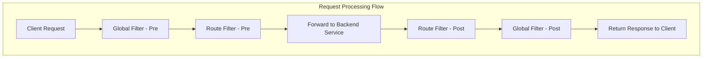

# Global Filters

Global filters in TiGateway are filters applied to all routes, executing throughout the request processing flow to provide cross-route common functionality.

## Global Filter Overview

### Filter Execution Order



### Global Filter Features

- **Global Application**: Automatically applied to all routes
- **Execution Order**: Controlled through the `Ordered` interface
- **Lifecycle**: Supports pre-request and post-request processing
- **Configurable**: Supports customization through configuration

## Built-in Global Filters

### 1. Load Balancer Filter

#### ReactiveLoadBalancerClientFilter

Automatically handles load balancing:

```java
@Component
public class LoadBalancerGlobalFilter implements GlobalFilter, Ordered {
    
    @Override
    public Mono<Void> filter(ServerWebExchange exchange, GatewayFilterChain chain) {
        URI url = exchange.getAttribute(GATEWAY_REQUEST_URL_ATTR);
        String schemePrefix = exchange.getAttribute(GATEWAY_SCHEME_PREFIX_ATTR);
        
        if (url == null || (!"lb".equals(url.getScheme()) && !"lb".equals(schemePrefix))) {
            return chain.filter(exchange);
        }
        
        // Handle load balancing logic
        return loadBalancerClient.execute(serviceId, url, exchange, chain);
    }
    
    @Override
    public int getOrder() {
        return 10100;
    }
}
```

### 2. Route Conversion Filter

#### RouteToRequestUrlFilter

Converts route information to request URL:

```java
@Component
public class RouteToRequestUrlGlobalFilter implements GlobalFilter, Ordered {
    
    @Override
    public Mono<Void> filter(ServerWebExchange exchange, GatewayFilterChain chain) {
        Route route = exchange.getAttribute(GATEWAY_ROUTE_ATTR);
        if (route == null) {
            return chain.filter(exchange);
        }
        
        URI uri = exchange.getRequest().getURI();
        boolean encoded = containsEncodedParts(uri);
        
        URI routeUri = route.getUri();
        URI mergedUrl = UriComponentsBuilder.fromUri(uri)
            .uri(routeUri)
            .build(encoded)
            .toUri();
        
        exchange.getAttributes().put(GATEWAY_REQUEST_URL_ATTR, mergedUrl);
        return chain.filter(exchange);
    }
    
    @Override
    public int getOrder() {
        return 10000;
    }
}
```

### 3. Network Filter

#### NettyRoutingFilter

Uses Netty for network requests:

```java
@Component
public class NettyRoutingGlobalFilter implements GlobalFilter, Ordered {
    
    @Override
    public Mono<Void> filter(ServerWebExchange exchange, GatewayFilterChain chain) {
        URI requestUrl = exchange.getRequiredAttribute(GATEWAY_REQUEST_URL_ATTR);
        String scheme = requestUrl.getScheme();
        
        if (!"http".equals(scheme) && !"https".equals(scheme)) {
            return chain.filter(exchange);
        }
        
        return chain.filter(exchange).then(Mono.defer(() -> {
            // Use Netty client to send request
            return nettyClient.execute(exchange, requestUrl);
        }));
    }
    
    @Override
    public int getOrder() {
        return Integer.MAX_VALUE;
    }
}
```

### 4. Response Write Filter

#### NettyWriteResponseFilter

Writes response to client:

```java
@Component
public class NettyWriteResponseGlobalFilter implements GlobalFilter, Ordered {
    
    @Override
    public Mono<Void> filter(ServerWebExchange exchange, GatewayFilterChain chain) {
        return chain.filter(exchange).then(Mono.defer(() -> {
            ServerHttpResponse response = exchange.getResponse();
            if (response.isCommitted()) {
                return Mono.empty();
            }
            
            // Write response data
            return writeResponse(exchange, response);
        }));
    }
    
    @Override
    public int getOrder() {
        return -1;
    }
}
```

### 5. Forward Filter

#### ForwardRoutingFilter

Handles internal forward requests:

```java
@Component
public class ForwardRoutingGlobalFilter implements GlobalFilter, Ordered {
    
    @Override
    public Mono<Void> filter(ServerWebExchange exchange, GatewayFilterChain chain) {
        URI requestUrl = exchange.getRequiredAttribute(GATEWAY_REQUEST_URL_ATTR);
        String scheme = requestUrl.getScheme();
        
        if (!"forward".equals(scheme)) {
            return chain.filter(exchange);
        }
        
        // Handle internal forwarding
        return forwardRequest(exchange, requestUrl);
    }
    
    @Override
    public int getOrder() {
        return Integer.MAX_VALUE;
    }
}
```

### 6. WebSocket Route Filter

#### WebsocketRoutingFilter

Handles WebSocket connections:

```java
@Component
public class WebsocketRoutingGlobalFilter implements GlobalFilter, Ordered {
    
    @Override
    public Mono<Void> filter(ServerWebExchange exchange, GatewayFilterChain chain) {
        URI requestUrl = exchange.getRequiredAttribute(GATEWAY_REQUEST_URL_ATTR);
        String scheme = requestUrl.getScheme();
        
        if (!"ws".equals(scheme) && !"wss".equals(scheme)) {
            return chain.filter(exchange);
        }
        
        // Handle WebSocket connection
        return handleWebSocketConnection(exchange, requestUrl);
    }
    
    @Override
    public int getOrder() {
        return Integer.MAX_VALUE - 1;
    }
}
```

## Custom Global Filters

### 1. Request Logging Filter

```java
@Component
public class RequestLoggingGlobalFilter implements GlobalFilter, Ordered {
    
    private static final Logger log = LoggerFactory.getLogger(RequestLoggingGlobalFilter.class);
    
    @Override
    public Mono<Void> filter(ServerWebExchange exchange, GatewayFilterChain chain) {
        ServerHttpRequest request = exchange.getRequest();
        
        // Log request information
        log.info("Request: {} {}", request.getMethod(), request.getURI());
        log.info("Headers: {}", request.getHeaders());
        
        long startTime = System.currentTimeMillis();
        
        return chain.filter(exchange).then(Mono.fromRunnable(() -> {
            long duration = System.currentTimeMillis() - startTime;
            ServerHttpResponse response = exchange.getResponse();
            
            log.info("Response: {} - Duration: {}ms", 
                response.getStatusCode(), duration);
        }));
    }
    
    @Override
    public int getOrder() {
        return -1000; // High priority, execute first
    }
}
```

### 2. Request ID Filter

```java
@Component
public class RequestIdGlobalFilter implements GlobalFilter, Ordered {
    
    @Override
    public Mono<Void> filter(ServerWebExchange exchange, GatewayFilterChain chain) {
        ServerHttpRequest request = exchange.getRequest();
        
        // Generate request ID
        String requestId = UUID.randomUUID().toString();
        
        // Add to request header
        ServerHttpRequest.Builder builder = request.mutate();
        builder.header("X-Request-ID", requestId);
        
        // Add to response header
        ServerHttpResponse response = exchange.getResponse();
        response.getHeaders().add("X-Request-ID", requestId);
        
        // Add to exchange attributes
        exchange.getAttributes().put("REQUEST_ID", requestId);
        
        return chain.filter(exchange.mutate().request(builder.build()).build());
    }
    
    @Override
    public int getOrder() {
        return -999;
    }
}
```

### 3. Authentication Filter

```java
@Component
public class AuthenticationGlobalFilter implements GlobalFilter, Ordered {
    
    @Autowired
    private JwtTokenProvider jwtTokenProvider;
    
    @Override
    public Mono<Void> filter(ServerWebExchange exchange, GatewayFilterChain chain) {
        ServerHttpRequest request = exchange.getRequest();
        
        // Check if authentication is required
        if (isPublicPath(request.getPath().value())) {
            return chain.filter(exchange);
        }
        
        // Extract JWT Token
        String token = extractToken(request);
        if (token == null) {
            return unauthorized(exchange);
        }
        
        // Validate Token
        if (!jwtTokenProvider.validateToken(token)) {
            return unauthorized(exchange);
        }
        
        // Set user information
        String username = jwtTokenProvider.getUsernameFromToken(token);
        exchange.getAttributes().put("USERNAME", username);
        
        return chain.filter(exchange);
    }
    
    private boolean isPublicPath(String path) {
        return path.startsWith("/public/") || 
               path.startsWith("/health") || 
               path.startsWith("/actuator");
    }
    
    private String extractToken(ServerHttpRequest request) {
        String bearerToken = request.getHeaders().getFirst("Authorization");
        if (bearerToken != null && bearerToken.startsWith("Bearer ")) {
            return bearerToken.substring(7);
        }
        return null;
    }
    
    private Mono<Void> unauthorized(ServerWebExchange exchange) {
        ServerHttpResponse response = exchange.getResponse();
        response.setStatusCode(HttpStatus.UNAUTHORIZED);
        response.getHeaders().add("Content-Type", "application/json");
        
        String body = "{\"error\":\"Unauthorized\",\"message\":\"Invalid or missing token\"}";
        DataBuffer buffer = response.bufferFactory().wrap(body.getBytes());
        return response.writeWith(Mono.just(buffer));
    }
    
    @Override
    public int getOrder() {
        return -100;
    }
}
```

### 4. Rate Limiting Filter

```java
@Component
public class RateLimitGlobalFilter implements GlobalFilter, Ordered {
    
    private final RedisTemplate<String, String> redisTemplate;
    private final RateLimiter rateLimiter;
    
    public RateLimitGlobalFilter(RedisTemplate<String, String> redisTemplate) {
        this.redisTemplate = redisTemplate;
        this.rateLimiter = RateLimiter.create(100.0); // 100 requests per second
    }
    
    @Override
    public Mono<Void> filter(ServerWebExchange exchange, GatewayFilterChain chain) {
        ServerHttpRequest request = exchange.getRequest();
        String clientId = getClientId(request);
        
        // Check rate limiting
        if (!rateLimiter.tryAcquire()) {
            return rateLimitExceeded(exchange);
        }
        
        // Use Redis for distributed rate limiting
        String key = "rate_limit:" + clientId;
        String count = redisTemplate.opsForValue().get(key);
        
        if (count == null) {
            redisTemplate.opsForValue().set(key, "1", Duration.ofSeconds(60));
        } else {
            int currentCount = Integer.parseInt(count);
            if (currentCount >= 100) { // 100 requests per minute
                return rateLimitExceeded(exchange);
            }
            redisTemplate.opsForValue().increment(key);
        }
        
        return chain.filter(exchange);
    }
    
    private String getClientId(ServerHttpRequest request) {
        String clientId = request.getHeaders().getFirst("X-Client-ID");
        if (clientId == null) {
            clientId = request.getRemoteAddress().getAddress().getHostAddress();
        }
        return clientId;
    }
    
    private Mono<Void> rateLimitExceeded(ServerWebExchange exchange) {
        ServerHttpResponse response = exchange.getResponse();
        response.setStatusCode(HttpStatus.TOO_MANY_REQUESTS);
        response.getHeaders().add("Content-Type", "application/json");
        response.getHeaders().add("Retry-After", "60");
        
        String body = "{\"error\":\"Rate limit exceeded\",\"message\":\"Too many requests\"}";
        DataBuffer buffer = response.bufferFactory().wrap(body.getBytes());
        return response.writeWith(Mono.just(buffer));
    }
    
    @Override
    public int getOrder() {
        return -50;
    }
}
```

### 5. CORS Filter

```java
@Component
public class CorsGlobalFilter implements GlobalFilter, Ordered {
    
    @Override
    public Mono<Void> filter(ServerWebExchange exchange, GatewayFilterChain chain) {
        ServerHttpRequest request = exchange.getRequest();
        ServerHttpResponse response = exchange.getResponse();
        
        // Handle preflight requests
        if (request.getMethod() == HttpMethod.OPTIONS) {
            response.getHeaders().add("Access-Control-Allow-Origin", "*");
            response.getHeaders().add("Access-Control-Allow-Methods", "GET, POST, PUT, DELETE, OPTIONS");
            response.getHeaders().add("Access-Control-Allow-Headers", "Content-Type, Authorization, X-Requested-With");
            response.getHeaders().add("Access-Control-Max-Age", "3600");
            response.setStatusCode(HttpStatus.OK);
            return Mono.empty();
        }
        
        return chain.filter(exchange).then(Mono.fromRunnable(() -> {
            // Add CORS headers
            response.getHeaders().add("Access-Control-Allow-Origin", "*");
            response.getHeaders().add("Access-Control-Allow-Credentials", "true");
        }));
    }
    
    @Override
    public int getOrder() {
        return -200;
    }
}
```

### 6. Cache Filter

```java
@Component
public class CacheGlobalFilter implements GlobalFilter, Ordered {
    
    private final CacheManager cacheManager;
    
    public CacheGlobalFilter(CacheManager cacheManager) {
        this.cacheManager = cacheManager;
    }
    
    @Override
    public Mono<Void> filter(ServerWebExchange exchange, GatewayFilterChain chain) {
        ServerHttpRequest request = exchange.getRequest();
        
        // Only cache GET requests
        if (request.getMethod() != HttpMethod.GET) {
            return chain.filter(exchange);
        }
        
        String cacheKey = generateCacheKey(request);
        Cache cache = cacheManager.getCache("gateway-cache");
        
        // Check cache
        Cache.ValueWrapper cached = cache.get(cacheKey);
        if (cached != null) {
            return returnCachedResponse(exchange, cached.get());
        }
        
        // Cache response
        return chain.filter(exchange).then(Mono.fromRunnable(() -> {
            ServerHttpResponse response = exchange.getResponse();
            if (response.getStatusCode() == HttpStatus.OK) {
                // Cache response data
                cache.put(cacheKey, response);
            }
        }));
    }
    
    private String generateCacheKey(ServerHttpRequest request) {
        return request.getURI().toString() + ":" + request.getHeaders().toString();
    }
    
    private Mono<Void> returnCachedResponse(ServerWebExchange exchange, Object cached) {
        ServerHttpResponse response = exchange.getResponse();
        // Return cached response
        return response.writeWith(Mono.just(response.bufferFactory().wrap("cached response".getBytes())));
    }
    
    @Override
    public int getOrder() {
        return -10;
    }
}
```

## Filter Configuration

### 1. Global Filter Configuration

```yaml
# application.yml
spring:
  cloud:
    gateway:
      global-filters:
      - name: RequestLogging
        args:
          level: INFO
      - name: RequestId
        args:
          header-name: X-Request-ID
      - name: RateLimit
        args:
          requests-per-minute: 100
          burst-capacity: 200
      - name: Cors
        args:
          allowed-origins: "*"
          allowed-methods: "GET,POST,PUT,DELETE,OPTIONS"
          allowed-headers: "Content-Type,Authorization,X-Requested-With"
```

### 2. Filter Order Configuration

```java
@Configuration
public class GlobalFilterConfiguration {
    
    @Bean
    @Order(-1000)
    public GlobalFilter requestLoggingFilter() {
        return new RequestLoggingGlobalFilter();
    }
    
    @Bean
    @Order(-999)
    public GlobalFilter requestIdFilter() {
        return new RequestIdGlobalFilter();
    }
    
    @Bean
    @Order(-100)
    public GlobalFilter authenticationFilter() {
        return new AuthenticationGlobalFilter();
    }
    
    @Bean
    @Order(-50)
    public GlobalFilter rateLimitFilter() {
        return new RateLimitGlobalFilter();
    }
}
```

## Filter Monitoring

### 1. Filter Metrics

```java
@Component
public class FilterMetricsGlobalFilter implements GlobalFilter, Ordered {
    
    private final MeterRegistry meterRegistry;
    private final Map<String, Timer> filterTimers = new ConcurrentHashMap<>();
    
    public FilterMetricsGlobalFilter(MeterRegistry meterRegistry) {
        this.meterRegistry = meterRegistry;
    }
    
    @Override
    public Mono<Void> filter(ServerWebExchange exchange, GatewayFilterChain chain) {
        String routeId = exchange.getAttribute(GATEWAY_ROUTE_ATTR) != null ? 
            exchange.getAttribute(GATEWAY_ROUTE_ATTR).getId() : "unknown";
        
        Timer.Sample sample = Timer.start(meterRegistry);
        
        return chain.filter(exchange).doFinally(signalType -> {
            sample.stop(Timer.builder("gateway.filter.duration")
                .tag("route", routeId)
                .tag("filter", "global")
                .register(meterRegistry));
        });
    }
    
    @Override
    public int getOrder() {
        return -1;
    }
}
```

### 2. Filter Health Check

```java
@Component
public class FilterHealthIndicator implements HealthIndicator {
    
    @Autowired
    private List<GlobalFilter> globalFilters;
    
    @Override
    public Health health() {
        Map<String, Object> details = new HashMap<>();
        details.put("totalFilters", globalFilters.size());
        details.put("filterNames", globalFilters.stream()
            .map(filter -> filter.getClass().getSimpleName())
            .collect(Collectors.toList()));
        
        return Health.up()
            .withDetails(details)
            .build();
    }
}
```

## Best Practices

### 1. Filter Order

```java
// Recommended filter order
@Component
@Order(-1000) // Highest priority
public class RequestLoggingGlobalFilter implements GlobalFilter {
    // Request logging
}

@Component
@Order(-999)
public class RequestIdGlobalFilter implements GlobalFilter {
    // Request ID generation
}

@Component
@Order(-100)
public class AuthenticationGlobalFilter implements GlobalFilter {
    // Authentication check
}

@Component
@Order(-50)
public class RateLimitGlobalFilter implements GlobalFilter {
    // Rate limiting control
}

@Component
@Order(-10)
public class CacheGlobalFilter implements GlobalFilter {
    // Cache handling
}

@Component
@Order(10000)
public class RouteToRequestUrlGlobalFilter implements GlobalFilter {
    // Route conversion
}

@Component
@Order(Integer.MAX_VALUE)
public class NettyRoutingGlobalFilter implements GlobalFilter {
    // Network request
}
```

### 2. Performance Optimization

```java
@Component
public class OptimizedGlobalFilter implements GlobalFilter, Ordered {
    
    // Use cache to avoid repeated calculations
    private final Cache<String, Boolean> pathCache = Caffeine.newBuilder()
        .maximumSize(1000)
        .expireAfterWrite(1, TimeUnit.HOURS)
        .build();
    
    @Override
    public Mono<Void> filter(ServerWebExchange exchange, GatewayFilterChain chain) {
        String path = exchange.getRequest().getPath().value();
        
        // Use cache to check path
        Boolean shouldProcess = pathCache.get(path, this::shouldProcessPath);
        if (!shouldProcess) {
            return chain.filter(exchange);
        }
        
        // Processing logic
        return processRequest(exchange, chain);
    }
    
    private boolean shouldProcessPath(String path) {
        // Path check logic
        return path.startsWith("/api/");
    }
    
    @Override
    public int getOrder() {
        return -100;
    }
}
```

### 3. Error Handling

```java
@Component
public class ErrorHandlingGlobalFilter implements GlobalFilter, Ordered {
    
    @Override
    public Mono<Void> filter(ServerWebExchange exchange, GatewayFilterChain chain) {
        return chain.filter(exchange)
            .onErrorResume(throwable -> {
                log.error("Error in filter chain", throwable);
                return handleError(exchange, throwable);
            });
    }
    
    private Mono<Void> handleError(ServerWebExchange exchange, Throwable throwable) {
        ServerHttpResponse response = exchange.getResponse();
        
        if (throwable instanceof TimeoutException) {
            response.setStatusCode(HttpStatus.GATEWAY_TIMEOUT);
        } else if (throwable instanceof ConnectException) {
            response.setStatusCode(HttpStatus.BAD_GATEWAY);
        } else {
            response.setStatusCode(HttpStatus.INTERNAL_SERVER_ERROR);
        }
        
        response.getHeaders().add("Content-Type", "application/json");
        String body = "{\"error\":\"" + throwable.getMessage() + "\"}";
        DataBuffer buffer = response.bufferFactory().wrap(body.getBytes());
        return response.writeWith(Mono.just(buffer));
    }
    
    @Override
    public int getOrder() {
        return Integer.MAX_VALUE;
    }
}
```

## Summary

Global filters are important components in TiGateway, providing cross-route common functionality:

1. **Built-in Filters**: Provide core functionality like load balancing, route conversion, and network requests
2. **Custom Filters**: Support development of custom global filters
3. **Execution Order**: Control filter execution order through the `Ordered` interface
4. **Configuration Management**: Support filter customization through configuration
5. **Monitoring Metrics**: Provide filter-level monitoring and health checks
6. **Best Practices**: Follow performance optimization and error handling principles

By properly using global filters, you can add common functionality like authentication, rate limiting, logging, and caching to TiGateway, improving system maintainability and observability.
