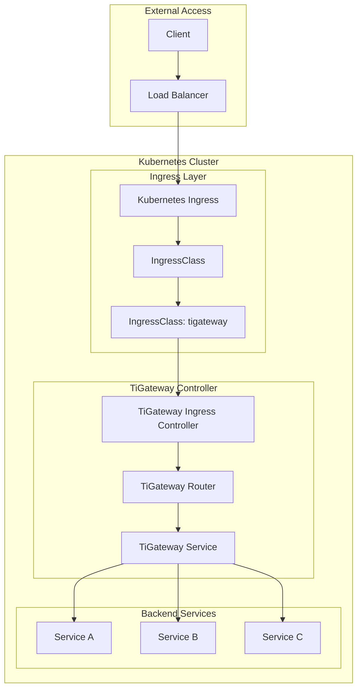

# Ingress Integration

TiGateway provides comprehensive Kubernetes Ingress integration support, serving as an Ingress controller while also supporting integration with existing Ingress controllers.

## Ingress Integration Overview

### Integration Architecture



### Integration Methods

TiGateway supports two Ingress integration methods:

1. **As Ingress Controller**: TiGateway directly handles Ingress resources
2. **Integration with Existing Controllers**: Integrates with existing Ingress controllers like Nginx, Traefik, etc.

## As Ingress Controller

### 1. Create IngressClass

```yaml
apiVersion: networking.k8s.io/v1
kind: IngressClass
metadata:
  name: tigateway
  annotations:
    ingressclass.kubernetes.io/is-default-class: "true"
spec:
  controller: tigateway.cn/ingress-controller
  parameters:
    apiGroup: tigateway.cn
    kind: IngressClassParameters
    name: tigateway-parameters
---
apiVersion: tigateway.cn/v1
kind: IngressClassParameters
metadata:
  name: tigateway-parameters
spec:
  defaultBackend:
    service:
      name: default-backend
      port:
        number: 80
  loadBalancer:
    type: ClusterIP
  rateLimit:
    enabled: true
    requestsPerMinute: 100
  cors:
    enabled: true
    allowedOrigins:
    - "*"
```

### 2. Deploy TiGateway Ingress Controller

```yaml
apiVersion: apps/v1
kind: Deployment
metadata:
  name: tigateway-ingress-controller
  namespace: tigateway-system
spec:
  replicas: 2
  selector:
    matchLabels:
      app: tigateway-ingress-controller
  template:
    metadata:
      labels:
        app: tigateway-ingress-controller
    spec:
      serviceAccountName: tigateway-ingress-controller
      containers:
      - name: tigateway-ingress-controller
        image: tigateway/ingress-controller:latest
        args:
        - /tigateway-ingress-controller
        - --ingress-class=tigateway
        - --configmap=tigateway-ingress-config
        - --default-backend-service=tigateway-system/default-backend
        - --election-id=tigateway-ingress-controller
        - --watch-namespace=
        - --update-status=true
        - --update-status-on-shutdown=true
        - --enable-ssl-passthrough=false
        - --http-port=8080
        - --https-port=8443
        - --profiling=true
        - --metrics-port=10254
        - --metrics-bind-address=0.0.0.0
        ports:
        - name: http
          containerPort: 8080
        - name: https
          containerPort: 8443
        - name: metrics
          containerPort: 10254
        livenessProbe:
          httpGet:
            path: /healthz
            port: 10254
            scheme: HTTP
          initialDelaySeconds: 10
          periodSeconds: 10
          timeoutSeconds: 1
          successThreshold: 1
          failureThreshold: 5
        readinessProbe:
          httpGet:
            path: /healthz
            port: 10254
            scheme: HTTP
          initialDelaySeconds: 10
          periodSeconds: 10
          timeoutSeconds: 1
          successThreshold: 1
          failureThreshold: 3
        resources:
          limits:
            cpu: 100m
            memory: 90Mi
          requests:
            cpu: 100m
            memory: 90Mi
        env:
        - name: POD_NAME
          valueFrom:
            fieldRef:
              fieldPath: metadata.name
        - name: POD_NAMESPACE
          valueFrom:
            fieldRef:
              fieldPath: metadata.namespace
---
apiVersion: v1
kind: Service
metadata:
  name: tigateway-ingress-controller
  namespace: tigateway-system
spec:
  type: LoadBalancer
  ports:
  - name: http
    port: 80
    targetPort: 8080
    protocol: TCP
  - name: https
    port: 443
    targetPort: 8443
    protocol: TCP
  selector:
    app: tigateway-ingress-controller
```

### 3. Create Ingress Resource

```yaml
apiVersion: networking.k8s.io/v1
kind: Ingress
metadata:
  name: example-ingress
  namespace: default
  annotations:
    kubernetes.io/ingress.class: "tigateway"
    tigateway.cn/rewrite-target: "/"
    tigateway.cn/rate-limit: "100"
    tigateway.cn/cors-enabled: "true"
    tigateway.cn/ssl-redirect: "true"
    cert-manager.io/cluster-issuer: "letsencrypt-prod"
spec:
  tls:
  - hosts:
    - api.example.com
    secretName: api-tls
  rules:
  - host: api.example.com
    http:
      paths:
      - path: /users
        pathType: Prefix
        backend:
          service:
            name: user-service
            port:
              number: 80
      - path: /orders
        pathType: Prefix
        backend:
          service:
            name: order-service
            port:
              number: 80
      - path: /payments
        pathType: Prefix
        backend:
          service:
            name: payment-service
            port:
              number: 80
```

## Ingress Annotation Support

### 1. Path Rewrite Annotation

```yaml
apiVersion: networking.k8s.io/v1
kind: Ingress
metadata:
  name: rewrite-ingress
  annotations:
    kubernetes.io/ingress.class: "tigateway"
    tigateway.cn/rewrite-target: "/"
    tigateway.cn/rewrite-path: "/api/v1"
spec:
  rules:
  - host: api.example.com
    http:
      paths:
      - path: /api/users
        pathType: Prefix
        backend:
          service:
            name: user-service
            port:
              number: 80
```

### 2. Load Balancer Annotation

```yaml
apiVersion: networking.k8s.io/v1
kind: Ingress
metadata:
  name: lb-ingress
  annotations:
    kubernetes.io/ingress.class: "tigateway"
    tigateway.cn/load-balancer: "round-robin"
    tigateway.cn/load-balancer-weight: "1:2:1"
spec:
  rules:
  - host: api.example.com
    http:
      paths:
      - path: /api
        pathType: Prefix
        backend:
          service:
            name: api-service
            port:
              number: 80
```

### 3. Rate Limiting Annotation

```yaml
apiVersion: networking.k8s.io/v1
kind: Ingress
metadata:
  name: rate-limit-ingress
  annotations:
    kubernetes.io/ingress.class: "tigateway"
    tigateway.cn/rate-limit: "100"
    tigateway.cn/rate-limit-burst: "200"
    tigateway.cn/rate-limit-key: "ip"
spec:
  rules:
  - host: api.example.com
    http:
      paths:
      - path: /api
        pathType: Prefix
        backend:
          service:
            name: api-service
            port:
              number: 80
```

### 4. Circuit Breaker Annotation

```yaml
apiVersion: networking.k8s.io/v1
kind: Ingress
metadata:
  name: circuit-breaker-ingress
  annotations:
    kubernetes.io/ingress.class: "tigateway"
    tigateway.cn/circuit-breaker: "api-service"
    tigateway.cn/circuit-breaker-fallback: "forward:/fallback"
    tigateway.cn/circuit-breaker-threshold: "50"
spec:
  rules:
  - host: api.example.com
    http:
      paths:
      - path: /api
        pathType: Prefix
        backend:
          service:
            name: api-service
            port:
              number: 80
```

### 5. Authentication Annotation

```yaml
apiVersion: networking.k8s.io/v1
kind: Ingress
metadata:
  name: auth-ingress
  annotations:
    kubernetes.io/ingress.class: "tigateway"
    tigateway.cn/auth-type: "jwt"
    tigateway.cn/auth-secret: "jwt-secret"
    tigateway.cn/auth-header: "Authorization"
    tigateway.cn/auth-prefix: "Bearer "
spec:
  rules:
  - host: api.example.com
    http:
      paths:
      - path: /api
        pathType: Prefix
        backend:
          service:
            name: api-service
            port:
              number: 80
```

### 6. CORS Annotation

```yaml
apiVersion: networking.k8s.io/v1
kind: Ingress
metadata:
  name: cors-ingress
  annotations:
    kubernetes.io/ingress.class: "tigateway"
    tigateway.cn/cors-enabled: "true"
    tigateway.cn/cors-allowed-origins: "https://example.com,https://app.example.com"
    tigateway.cn/cors-allowed-methods: "GET,POST,PUT,DELETE,OPTIONS"
    tigateway.cn/cors-allowed-headers: "Content-Type,Authorization,X-Requested-With"
    tigateway.cn/cors-allow-credentials: "true"
    tigateway.cn/cors-max-age: "3600"
spec:
  rules:
  - host: api.example.com
    http:
      paths:
      - path: /api
        pathType: Prefix
        backend:
          service:
            name: api-service
            port:
              number: 80
```

### 7. Timeout Annotation

```yaml
apiVersion: networking.k8s.io/v1
kind: Ingress
metadata:
  name: timeout-ingress
  annotations:
    kubernetes.io/ingress.class: "tigateway"
    tigateway.cn/connect-timeout: "5s"
    tigateway.cn/response-timeout: "30s"
    tigateway.cn/read-timeout: "30s"
    tigateway.cn/write-timeout: "30s"
spec:
  rules:
  - host: api.example.com
    http:
      paths:
      - path: /api
        pathType: Prefix
        backend:
          service:
            name: api-service
            port:
              number: 80
```

### 8. Retry Annotation

```yaml
apiVersion: networking.k8s.io/v1
kind: Ingress
metadata:
  name: retry-ingress
  annotations:
    kubernetes.io/ingress.class: "tigateway"
    tigateway.cn/retry-attempts: "3"
    tigateway.cn/retry-status-codes: "500,502,503,504"
    tigateway.cn/retry-methods: "GET,POST"
    tigateway.cn/retry-backoff: "100ms"
spec:
  rules:
  - host: api.example.com
    http:
      paths:
      - path: /api
        pathType: Prefix
        backend:
          service:
            name: api-service
            port:
              number: 80
```

## Advanced Ingress Configuration

### 1. Multi-Path Ingress

```yaml
apiVersion: networking.k8s.io/v1
kind: Ingress
metadata:
  name: multi-path-ingress
  namespace: default
  annotations:
    kubernetes.io/ingress.class: "tigateway"
    tigateway.cn/rewrite-target: "/"
spec:
  rules:
  - host: api.example.com
    http:
      paths:
      - path: /api/v1/users
        pathType: Prefix
        backend:
          service:
            name: user-service-v1
            port:
              number: 80
      - path: /api/v2/users
        pathType: Prefix
        backend:
          service:
            name: user-service-v2
            port:
              number: 80
      - path: /api/orders
        pathType: Prefix
        backend:
          service:
            name: order-service
            port:
              number: 80
      - path: /api/payments
        pathType: Prefix
        backend:
          service:
            name: payment-service
            port:
              number: 80
```

### 2. Multi-Host Ingress

```yaml
apiVersion: networking.k8s.io/v1
kind: Ingress
metadata:
  name: multi-host-ingress
  namespace: default
  annotations:
    kubernetes.io/ingress.class: "tigateway"
spec:
  tls:
  - hosts:
    - api.example.com
    - admin.example.com
    - docs.example.com
    secretName: multi-host-tls
  rules:
  - host: api.example.com
    http:
      paths:
      - path: /
        pathType: Prefix
        backend:
          service:
            name: api-service
            port:
              number: 80
  - host: admin.example.com
    http:
      paths:
      - path: /
        pathType: Prefix
        backend:
          service:
            name: admin-service
            port:
              number: 80
  - host: docs.example.com
    http:
      paths:
      - path: /
        pathType: Prefix
        backend:
          service:
            name: docs-service
            port:
              number: 80
```

### 3. Wildcard Domain Ingress

```yaml
apiVersion: networking.k8s.io/v1
kind: Ingress
metadata:
  name: wildcard-ingress
  namespace: default
  annotations:
    kubernetes.io/ingress.class: "tigateway"
    tigateway.cn/rewrite-target: "/"
spec:
  tls:
  - hosts:
    - "*.example.com"
    secretName: wildcard-tls
  rules:
  - host: "*.example.com"
    http:
      paths:
      - path: /api
        pathType: Prefix
        backend:
          service:
            name: api-service
            port:
              number: 80
      - path: /admin
        pathType: Prefix
        backend:
          service:
            name: admin-service
            port:
              number: 80
```

## Ingress Controller Implementation

### 1. Ingress Controller

```java
@Controller
public class TiGatewayIngressController {
    
    @Autowired
    private IngressService ingressService;
    
    @Autowired
    private KubernetesClient kubernetesClient;
    
    @KubernetesInformers
    public class IngressInformer {
        
        @OnAdd
        public void onAdd(Ingress ingress) {
            if (isTiGatewayIngress(ingress)) {
                log.info("TiGateway Ingress added: {}", ingress.getMetadata().getName());
                ingressService.createIngress(ingress);
            }
        }
        
        @OnUpdate
        public void onUpdate(Ingress oldIngress, Ingress newIngress) {
            if (isTiGatewayIngress(newIngress)) {
                log.info("TiGateway Ingress updated: {}", newIngress.getMetadata().getName());
                ingressService.updateIngress(oldIngress, newIngress);
            }
        }
        
        @OnDelete
        public void onDelete(Ingress ingress, boolean deletedFinalStateUnknown) {
            if (isTiGatewayIngress(ingress)) {
                log.info("TiGateway Ingress deleted: {}", ingress.getMetadata().getName());
                ingressService.deleteIngress(ingress);
            }
        }
        
        private boolean isTiGatewayIngress(Ingress ingress) {
            String ingressClass = ingress.getMetadata().getAnnotations()
                .get("kubernetes.io/ingress.class");
            return "tigateway".equals(ingressClass);
        }
    }
    
    @Service
    public class IngressService {
        
        public void createIngress(Ingress ingress) {
            // Parse Ingress rules
            List<RouteDefinition> routes = parseIngressRules(ingress);
            
            // Create route configuration
            for (RouteDefinition route : routes) {
                createRoute(route);
            }
            
            // Update Ingress status
            updateIngressStatus(ingress, "Active");
        }
        
        public void updateIngress(Ingress oldIngress, Ingress newIngress) {
            // Delete old routes
            deleteRoutes(oldIngress);
            
            // Create new routes
            createIngress(newIngress);
        }
        
        public void deleteIngress(Ingress ingress) {
            // Delete related routes
            deleteRoutes(ingress);
            
            // Update Ingress status
            updateIngressStatus(ingress, "Terminating");
        }
        
        private List<RouteDefinition> parseIngressRules(Ingress ingress) {
            List<RouteDefinition> routes = new ArrayList<>();
            
            for (IngressRule rule : ingress.getSpec().getRules()) {
                String host = rule.getHost();
                
                if (rule.getHttp() != null) {
                    for (HTTPIngressPath path : rule.getHttp().getPaths()) {
                        RouteDefinition route = new RouteDefinition();
                        route.setId(generateRouteId(ingress, host, path));
                        route.setUri("lb://" + path.getBackend().getService().getName());
                        
                        // Set predicates
                        List<PredicateDefinition> predicates = new ArrayList<>();
                        
                        // Path predicate
                        PredicateDefinition pathPredicate = new PredicateDefinition();
                        pathPredicate.setName("Path");
                        pathPredicate.addArg("pattern", path.getPath());
                        predicates.add(pathPredicate);
                        
                        // Host predicate
                        if (host != null) {
                            PredicateDefinition hostPredicate = new PredicateDefinition();
                            hostPredicate.setName("Host");
                            hostPredicate.addArg("pattern", host);
                            predicates.add(hostPredicate);
                        }
                        
                        route.setPredicates(predicates);
                        
                        // Set filters
                        List<FilterDefinition> filters = parseFilters(ingress);
                        route.setFilters(filters);
                        
                        routes.add(route);
                    }
                }
            }
            
            return routes;
        }
        
        private List<FilterDefinition> parseFilters(Ingress ingress) {
            List<FilterDefinition> filters = new ArrayList<>();
            Map<String, String> annotations = ingress.getMetadata().getAnnotations();
            
            // Rewrite path filter
            String rewriteTarget = annotations.get("tigateway.cn/rewrite-target");
            if (rewriteTarget != null) {
                FilterDefinition rewriteFilter = new FilterDefinition();
                rewriteFilter.setName("RewritePath");
                rewriteFilter.addArg("regexp", ".*");
                rewriteFilter.addArg("replacement", rewriteTarget);
                filters.add(rewriteFilter);
            }
            
            // Rate limiting filter
            String rateLimit = annotations.get("tigateway.cn/rate-limit");
            if (rateLimit != null) {
                FilterDefinition rateLimitFilter = new FilterDefinition();
                rateLimitFilter.setName("RequestRateLimiter");
                rateLimitFilter.addArg("redis-rate-limiter.replenishRate", rateLimit);
                rateLimitFilter.addArg("redis-rate-limiter.burstCapacity", 
                    annotations.getOrDefault("tigateway.cn/rate-limit-burst", "200"));
                filters.add(rateLimitFilter);
            }
            
            // Circuit breaker filter
            String circuitBreaker = annotations.get("tigateway.cn/circuit-breaker");
            if (circuitBreaker != null) {
                FilterDefinition circuitBreakerFilter = new FilterDefinition();
                circuitBreakerFilter.setName("CircuitBreaker");
                circuitBreakerFilter.addArg("name", circuitBreaker);
                String fallbackUri = annotations.get("tigateway.cn/circuit-breaker-fallback");
                if (fallbackUri != null) {
                    circuitBreakerFilter.addArg("fallbackUri", fallbackUri);
                }
                filters.add(circuitBreakerFilter);
            }
            
            return filters;
        }
        
        private String generateRouteId(Ingress ingress, String host, HTTPIngressPath path) {
            return ingress.getMetadata().getName() + "-" + 
                   (host != null ? host.replace(".", "-") : "default") + "-" +
                   path.getPath().replace("/", "-").replace("*", "wildcard");
        }
    }
}
```

### 2. Status Update

```java
@Service
public class IngressStatusService {
    
    @Autowired
    private KubernetesClient kubernetesClient;
    
    public void updateIngressStatus(Ingress ingress, String status) {
        IngressStatus ingressStatus = new IngressStatus();
        
        // Set load balancer status
        IngressLoadBalancerStatus lbStatus = new IngressLoadBalancerStatus();
        List<IngressLoadBalancerIngress> ingresses = new ArrayList<>();
        
        IngressLoadBalancerIngress lbIngress = new IngressLoadBalancerIngress();
        lbIngress.setIp("192.168.1.100"); // Get actual IP from service
        ingresses.add(lbIngress);
        
        lbStatus.setIngress(ingresses);
        ingressStatus.setLoadBalancer(lbStatus);
        
        ingress.setStatus(ingressStatus);
        
        kubernetesClient.network().v1().ingresses()
            .inNamespace(ingress.getMetadata().getNamespace())
            .withName(ingress.getMetadata().getName())
            .updateStatus(ingress);
    }
}
```

## Integration with Existing Ingress Controllers

### 1. Integration with Nginx Ingress

```yaml
apiVersion: networking.k8s.io/v1
kind: Ingress
metadata:
  name: nginx-tigateway-ingress
  namespace: default
  annotations:
    kubernetes.io/ingress.class: "nginx"
    nginx.ingress.kubernetes.io/rewrite-target: /
    nginx.ingress.kubernetes.io/backend-protocol: "HTTP"
    nginx.ingress.kubernetes.io/upstream-hash-by: "$binary_remote_addr"
spec:
  rules:
  - host: api.example.com
    http:
      paths:
      - path: /api
        pathType: Prefix
        backend:
          service:
            name: tigateway
            port:
              number: 8080
```

### 2. Integration with Traefik Ingress

```yaml
apiVersion: networking.k8s.io/v1
kind: Ingress
metadata:
  name: traefik-tigateway-ingress
  namespace: default
  annotations:
    kubernetes.io/ingress.class: "traefik"
    traefik.ingress.kubernetes.io/router.entrypoints: "web,websecure"
    traefik.ingress.kubernetes.io/router.tls: "true"
spec:
  tls:
  - secretName: api-tls
  rules:
  - host: api.example.com
    http:
      paths:
      - path: /api
        pathType: Prefix
        backend:
          service:
            name: tigateway
            port:
              number: 8080
```

## Monitoring and Logging

### 1. Ingress Monitoring

```yaml
apiVersion: monitoring.coreos.com/v1
kind: ServiceMonitor
metadata:
  name: tigateway-ingress
  namespace: tigateway-system
spec:
  selector:
    matchLabels:
      app: tigateway-ingress-controller
  endpoints:
  - port: metrics
    path: /metrics
    interval: 30s
    scrapeTimeout: 10s
```

### 2. Ingress Metrics

```java
@Component
public class IngressMetrics {
    
    private final MeterRegistry meterRegistry;
    private final Counter ingressRequests;
    private final Timer ingressDuration;
    
    public IngressMetrics(MeterRegistry meterRegistry) {
        this.meterRegistry = meterRegistry;
        this.ingressRequests = Counter.builder("tigateway_ingress_requests_total")
            .description("Total number of Ingress requests")
            .register(meterRegistry);
        this.ingressDuration = Timer.builder("tigateway_ingress_duration_seconds")
            .description("Ingress request duration")
            .register(meterRegistry);
    }
    
    public void recordRequest(String ingressName, String host, String path, int statusCode) {
        ingressRequests.increment(
            Tags.of(
                "ingress", ingressName,
                "host", host,
                "path", path,
                "status", String.valueOf(statusCode)
            )
        );
    }
    
    public void recordDuration(String ingressName, Duration duration) {
        ingressDuration.record(duration);
    }
}
```

## Best Practices

### 1. Ingress Design Principles

```yaml
# Organize Ingress by service
apiVersion: networking.k8s.io/v1
kind: Ingress
metadata:
  name: user-service-ingress
  namespace: user-service
  annotations:
    kubernetes.io/ingress.class: "tigateway"
    tigateway.cn/rewrite-target: "/"
spec:
  rules:
  - host: api.example.com
    http:
      paths:
      - path: /api/users
        pathType: Prefix
        backend:
          service:
            name: user-service
            port:
              number: 80
---
apiVersion: networking.k8s.io/v1
kind: Ingress
metadata:
  name: order-service-ingress
  namespace: order-service
  annotations:
    kubernetes.io/ingress.class: "tigateway"
    tigateway.cn/rewrite-target: "/"
spec:
  rules:
  - host: api.example.com
    http:
      paths:
      - path: /api/orders
        pathType: Prefix
        backend:
          service:
            name: order-service
            port:
              number: 80
```

### 2. Security Configuration

```yaml
apiVersion: networking.k8s.io/v1
kind: Ingress
metadata:
  name: secure-ingress
  namespace: default
  annotations:
    kubernetes.io/ingress.class: "tigateway"
    tigateway.cn/auth-type: "jwt"
    tigateway.cn/rate-limit: "100"
    tigateway.cn/cors-enabled: "true"
    cert-manager.io/cluster-issuer: "letsencrypt-prod"
spec:
  tls:
  - hosts:
    - api.example.com
    secretName: api-tls
  rules:
  - host: api.example.com
    http:
      paths:
      - path: /api
        pathType: Prefix
        backend:
          service:
            name: api-service
            port:
              number: 80
```

### 3. Performance Optimization

```yaml
apiVersion: networking.k8s.io/v1
kind: Ingress
metadata:
  name: optimized-ingress
  namespace: default
  annotations:
    kubernetes.io/ingress.class: "tigateway"
    tigateway.cn/load-balancer: "round-robin"
    tigateway.cn/connect-timeout: "5s"
    tigateway.cn/response-timeout: "30s"
    tigateway.cn/retry-attempts: "3"
spec:
  rules:
  - host: api.example.com
    http:
      paths:
      - path: /api
        pathType: Prefix
        backend:
          service:
            name: api-service
            port:
              number: 80
```

## Troubleshooting

### 1. Common Issues

#### Ingress Status Abnormal
```bash
# Check Ingress status
kubectl describe ingress example-ingress

# Check Ingress controller logs
kubectl logs -f deployment/tigateway-ingress-controller -n tigateway-system

# Check service status
kubectl get svc -n default
```

#### Routes Not Working
```bash
# Check route configuration
kubectl get configmap tigateway-route-config -o yaml

# Check TiGateway logs
kubectl logs -f deployment/tigateway -n tigateway

# Test routes
curl -H "Host: api.example.com" http://gateway-ip/api/test
```

#### TLS Certificate Issues
```bash
# Check certificate status
kubectl get certificate

# Check certificate details
kubectl describe certificate api-tls

# Check certificate manager logs
kubectl logs -f deployment/cert-manager -n cert-manager
```

### 2. Debug Commands

```bash
# View Ingress details
kubectl get ingress -o wide

# View Ingress events
kubectl get events -n default --sort-by='.lastTimestamp'

# Test Ingress configuration
kubectl port-forward svc/tigateway 8080:8080
curl -H "Host: api.example.com" http://localhost:8080/api/test
```

## Summary

TiGateway's Ingress integration provides comprehensive Kubernetes Ingress support:

1. **As Ingress Controller**: Directly handles Ingress resources, providing complete Ingress functionality
2. **Rich Annotation Support**: Supports annotations for path rewriting, load balancing, rate limiting, circuit breakers, authentication, CORS, etc.
3. **Advanced Configuration**: Supports advanced Ingress configurations like multi-path, multi-host, and wildcard domains
4. **Integration with Existing Controllers**: Can integrate with existing Ingress controllers like Nginx, Traefik, etc.
5. **Monitoring and Logging**: Provides comprehensive monitoring metrics and logging
6. **Best Practices**: Follows Ingress design principles and security configurations

Through Ingress integration, TiGateway can seamlessly integrate into existing Kubernetes environments, providing unified entry management.