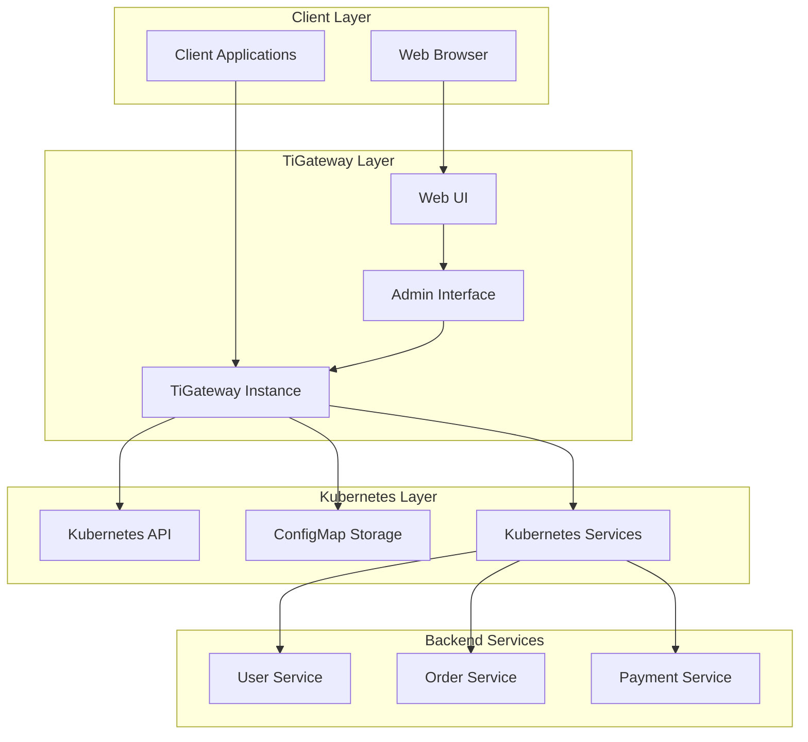

# Introduction

TiGateway is a Kubernetes-native API Gateway built on Spring Cloud Gateway, designed to provide high-performance, scalable, and cloud-native gateway capabilities for modern microservices architectures.

## What is TiGateway?

TiGateway is an enterprise-grade API Gateway that combines the power of Spring Cloud Gateway with Kubernetes-native features. It provides a unified entry point for managing, routing, and securing microservices in containerized environments.

### Key Features

- **Kubernetes Native**: Seamlessly integrates with Kubernetes ecosystem
- **High Performance**: Built on Spring Cloud Gateway with reactive programming model
- **Dynamic Configuration**: Real-time route and configuration updates without restarts
- **Service Discovery**: Automatic service discovery and load balancing
- **Security**: Built-in authentication, authorization, and rate limiting
- **Monitoring**: Comprehensive metrics, logging, and tracing capabilities
- **Web UI**: Intuitive management interface for configuration and monitoring

## Architecture Overview



## Core Components

### 1. Gateway Core
The main gateway engine built on Spring Cloud Gateway, handling request routing, filtering, and load balancing.

### 2. Admin Interface
RESTful API and Web UI for managing gateway configurations, monitoring system status, and viewing metrics.

### 3. Kubernetes Integration
Native integration with Kubernetes for service discovery, configuration management, and deployment.

### 4. Configuration Management
Dynamic configuration system supporting multiple storage backends including ConfigMap, database, and file systems.

## Use Cases

### Microservices Gateway
- **Service Routing**: Intelligent routing based on path, header, and query parameters
- **Load Balancing**: Multiple load balancing algorithms (Round Robin, Least Connections, Random)
- **Circuit Breaker**: Built-in circuit breaker pattern for fault tolerance
- **Rate Limiting**: Request rate limiting and throttling capabilities

### API Management
- **Authentication & Authorization**: JWT, OAuth2, and custom authentication mechanisms
- **API Versioning**: Support for API versioning and backward compatibility
- **Documentation**: Auto-generated API documentation
- **Analytics**: Request analytics and performance monitoring

### Cloud-Native Deployment
- **Kubernetes Native**: Full integration with Kubernetes ecosystem
- **Auto-scaling**: Horizontal Pod Autoscaler (HPA) support
- **Health Checks**: Comprehensive health check endpoints
- **Service Mesh**: Integration with service mesh solutions

## Getting Started

### Quick Start
Get TiGateway running in minutes with our quick start guide:

```bash
# Deploy TiGateway using Helm
helm repo add tigateway https://tigateway.github.io/helm-charts
helm install tigateway tigateway/tigateway
```

### Installation Options
- **Kubernetes**: Deploy using Helm charts or YAML manifests
- **Docker**: Run as standalone container
- **Development**: Local development setup with Docker Compose

## Why Choose TiGateway?

### Performance
- **Reactive Architecture**: Built on Spring WebFlux for high concurrency
- **Low Latency**: Optimized for minimal request processing overhead
- **High Throughput**: Handles thousands of requests per second

### Reliability
- **Fault Tolerance**: Circuit breaker and retry mechanisms
- **Health Monitoring**: Comprehensive health checks and monitoring
- **Graceful Degradation**: Continues operating even when some services fail

### Developer Experience
- **Easy Configuration**: Simple YAML-based configuration
- **Rich UI**: Intuitive web interface for management
- **Comprehensive APIs**: RESTful APIs for all operations
- **Extensive Documentation**: Detailed guides and examples

### Enterprise Ready
- **Security**: Enterprise-grade security features
- **Scalability**: Horizontal scaling capabilities
- **Monitoring**: Integration with popular monitoring solutions
- **Support**: Commercial support available

## Community and Support

### Open Source
TiGateway is open source and welcomes community contributions. Join our community to:
- Report issues and feature requests
- Contribute code and documentation
- Share your use cases and experiences
- Get help from the community

### Resources
- **GitHub**: [https://github.com/tigateway/tigateway](https://github.com/tigateway/tigateway)
- **Documentation**: [https://tigateway.github.io/tigateway](https://tigateway.github.io/tigateway)
- **Issues**: [https://github.com/tigateway/tigateway/issues](https://github.com/tigateway/tigateway/issues)
- **Discussions**: [https://github.com/tigateway/tigateway/discussions](https://github.com/tigateway/tigateway/discussions)

## Next Steps

Ready to get started with TiGateway? Here are the recommended next steps:

1. **[Quick Start Guide](./quick-start.md)** - Get TiGateway running in minutes
2. **[Installation Guide](./installation.md)** - Detailed installation instructions
3. **[Configuration Guide](./configuration.md)** - Learn how to configure TiGateway
4. **[API Reference](./api/rest-api.md)** - Explore the REST API documentation

---

**Ready to transform your microservices architecture?** Start with TiGateway today and experience the power of Kubernetes-native API Gateway.
